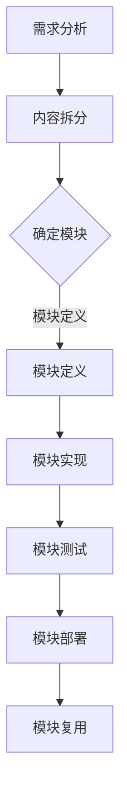
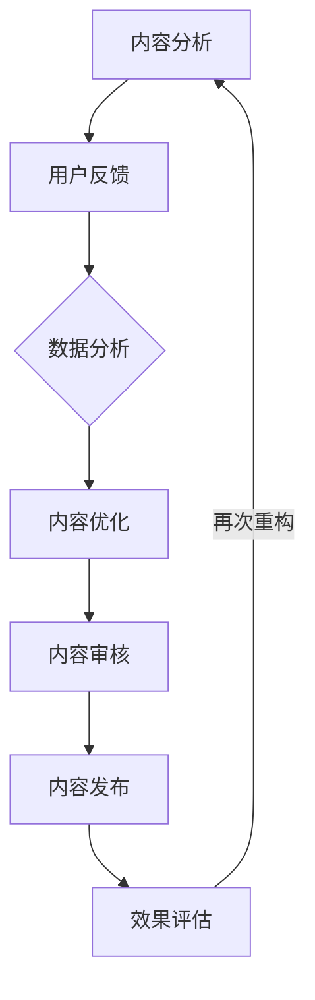
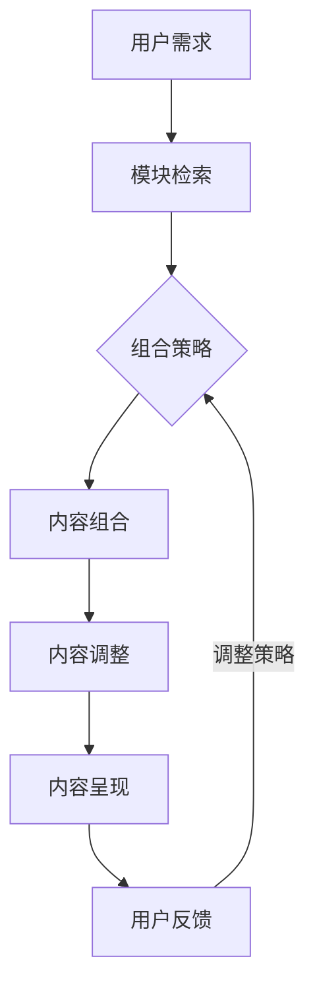
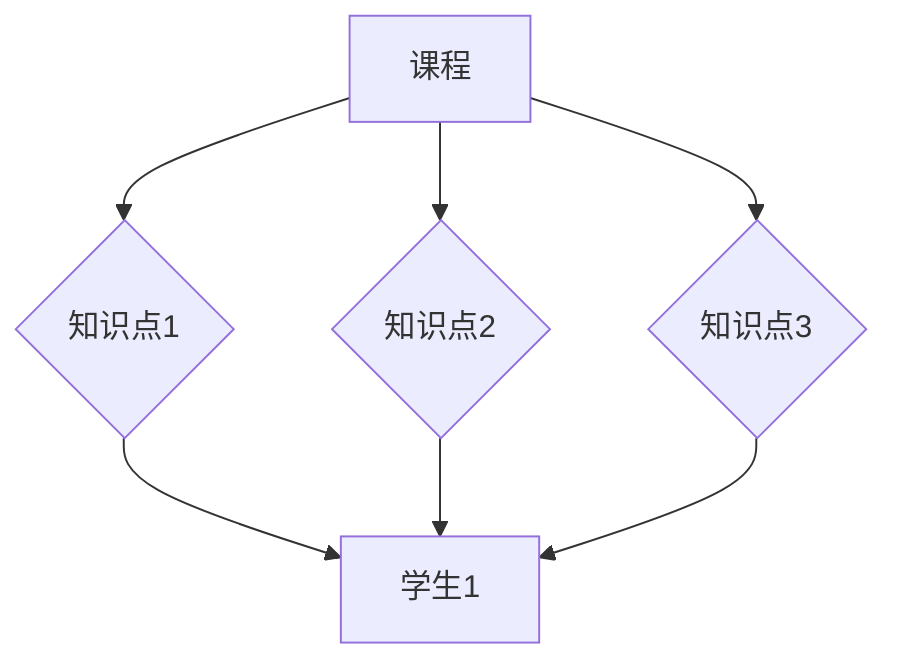

                 

在当今快速发展的互联网时代，知识付费已经成为一种主流的商业模式，特别是在技术领域。随着知识更新速度的加快，内容创作者和知识付费平台都面临着如何高效管理和复用内容的挑战。本文将探讨在知识付费创业中运用内容复用技巧的方法，以帮助创作者和平台在保持内容质量的同时，提高运营效率和降低成本。

> 关键词：知识付费、内容复用、商业模式、技术领域、效率、成本优化

## 摘要

本文首先介绍了知识付费行业的背景和现状，然后阐述了内容复用的核心概念和重要性。接着，文章通过逻辑清晰的结构，详细探讨了内容复用的几种方法，包括模块化设计、内容重构、动态组合和知识图谱等。此外，本文还通过实际案例和代码实例，展示了如何实现内容复用。最后，文章展望了内容复用在未来的应用前景和面临的挑战。

## 1. 背景介绍

知识付费是指用户通过支付一定费用获取专业知识和技能的过程。随着信息技术的进步和用户需求的多样化，知识付费行业得到了迅速发展。用户可以通过各种平台获取涵盖各个领域的专业知识，如金融、法律、医疗、技术等。知识付费不仅为用户提供了便捷的学习途径，也为内容创作者提供了丰厚的回报。

在知识付费领域，内容复用显得尤为重要。内容创作者需要不断地更新和创作高质量的内容，以满足用户的需求。然而，创作高质量的内容需要耗费大量的时间和资源。通过内容复用，创作者可以减少重复性工作，提高创作效率，同时确保内容的持续更新。

### 1.1 知识付费行业的现状

近年来，知识付费行业呈现出几个显著的特点：

1. **用户规模扩大**：随着互联网普及和信息消费习惯的改变，越来越多的用户愿意为知识付费。特别是在技术领域，在线课程、专业教程、实战案例等受到了广泛的欢迎。

2. **内容形式多样化**：知识付费的内容形式越来越丰富，包括图文、音频、视频、直播等多种形式，以满足不同用户的学习偏好。

3. **平台竞争激烈**：市场上的知识付费平台如雨后春笋般涌现，竞争日益激烈。平台需要通过独特的内容和服务来吸引用户，提高留存率。

4. **用户需求变化**：用户对知识的需求更加个性化和专业化，平台需要不断更新内容，提供符合用户需求的知识产品。

### 1.2 内容复用的核心概念

内容复用是指将已有的内容进行重新组合、修改或扩展，以创造新的知识产品或服务。在知识付费领域，内容复用可以降低创作成本，提高内容更新速度，满足用户的多样化需求。

内容复用的核心概念包括：

1. **模块化设计**：将内容分解为可重用的模块，方便后续的组合和修改。

2. **动态组合**：根据用户的需求，动态组合不同模块，提供个性化的知识服务。

3. **知识图谱**：通过构建知识图谱，实现内容的语义理解和关联，提高内容复用的效率和准确性。

4. **内容重构**：对已有内容进行重新编排和优化，使其更符合用户需求。

## 2. 核心概念与联系

### 2.1 模块化设计

模块化设计是一种系统化方法，通过将复杂系统分解为较小的、可管理的模块，以提高可维护性和可复用性。在知识付费领域，模块化设计可以帮助内容创作者将知识分解为不同的模块，如课程章节、知识点等，便于后续的组合和复用。

下面是一个简化的 Mermaid 流程图，展示了模块化设计的基本过程：



### 2.2 内容重构

内容重构是指对已有内容进行重新编排和优化，以使其更符合用户需求。内容重构可以基于用户反馈、数据分析或市场趋势进行调整。

以下是一个内容重构的 Mermaid 流程图：



### 2.3 动态组合

动态组合是一种根据用户需求动态调整内容组合的方法。通过动态组合，平台可以提供个性化的知识服务，满足用户的多样化需求。

以下是一个动态组合的 Mermaid 流程图：



### 2.4 知识图谱

知识图谱是一种用于表示实体之间关系的图形化方法。通过知识图谱，平台可以实现内容的语义理解和关联，提高内容复用的效率和准确性。

以下是一个简化的知识图谱示例，用于表示课程、知识点和学生之间的关系：



## 3. 核心算法原理 & 具体操作步骤

### 3.1 算法原理概述

内容复用算法的核心原理是模块化和动态组合。模块化设计通过将内容分解为可重用的模块，提高内容的可维护性和复用性。动态组合则通过根据用户需求动态调整内容组合，提供个性化的知识服务。

### 3.2 算法步骤详解

#### 3.2.1 模块化设计

1. **需求分析**：分析用户需求，确定需要复用的内容模块。
2. **内容拆分**：将内容分解为不同的模块，如课程章节、知识点等。
3. **模块定义**：为每个模块定义明确的内容和功能。
4. **模块实现**：实现每个模块的功能，并进行测试。
5. **模块部署**：将模块部署到知识付费平台上，便于复用。

#### 3.2.2 动态组合

1. **用户需求**：获取用户的需求信息。
2. **模块检索**：根据用户需求，检索平台上的内容模块。
3. **组合策略**：根据用户需求，确定内容模块的组合策略。
4. **内容组合**：动态组合模块，生成个性化的知识服务。
5. **内容调整**：根据用户反馈，调整内容组合策略。
6. **内容呈现**：将组合好的内容呈现给用户。

### 3.3 算法优缺点

**优点**：

1. **提高效率**：通过模块化设计和动态组合，可以减少重复性工作，提高创作效率。
2. **降低成本**：内容复用可以降低内容创作的成本，提高平台的盈利能力。
3. **个性化服务**：通过动态组合，可以提供个性化的知识服务，满足用户的多样化需求。

**缺点**：

1. **初期投入**：模块化设计和动态组合需要一定的技术投入和开发成本。
2. **内容质量**：内容复用可能会影响内容的原创性和质量，需要严格把控。
3. **用户体验**：过于频繁的内容调整可能会影响用户的体验，需要平衡好内容的动态性和稳定性。

### 3.4 算法应用领域

内容复用算法可以广泛应用于知识付费领域的各个方面，如：

1. **在线教育**：通过内容复用，可以快速创建和更新在线课程，满足用户的学习需求。
2. **专业培训**：在专业培训领域，内容复用可以帮助培训师高效地制作和更新培训资料。
3. **知识服务平台**：知识服务平台可以通过内容复用，提供更加丰富和个性化的知识服务。

## 4. 数学模型和公式 & 详细讲解 & 举例说明

### 4.1 数学模型构建

内容复用算法的数学模型可以基于组合数学中的图论模型。具体来说，可以将内容模块表示为图中的节点，模块之间的关系表示为图中的边。通过构建知识图谱，可以实现内容模块的语义理解和关联。

#### 4.1.1 知识图谱模型

假设有 n 个内容模块，分别表示为 \( V = \{v_1, v_2, ..., v_n\} \)。模块之间的关系可以用邻接矩阵 \( A \) 表示，其中 \( A_{ij} \) 表示模块 \( v_i \) 和模块 \( v_j \) 之间的关系强度。知识图谱的构建过程如下：

1. **初始化**：创建一个 n 阶的邻接矩阵 \( A \)，初始化为 0。
2. **关系构建**：根据模块之间的关系，更新邻接矩阵 \( A \)。例如，如果模块 \( v_i \) 和模块 \( v_j \) 有直接关联，则 \( A_{ij} = 1 \)；如果有关联，但关系较弱，则 \( A_{ij} \) 取一个较小的值。
3. **图构建**：将邻接矩阵 \( A \) 转换为图 \( G(V, E) \)，其中 \( E \) 表示图中的边。

#### 4.1.2 知识图谱优化

为了提高知识图谱的准确性和效率，可以对图进行优化。常用的优化方法包括：

1. **图分区**：将图划分为多个分区，降低图的大小和复杂性。
2. **图压缩**：通过压缩算法减少图中的冗余信息，提高图的可读性和查询效率。
3. **图排序**：对图中的节点进行排序，优化查询路径。

### 4.2 公式推导过程

假设有 n 个内容模块，模块之间的关系可以用邻接矩阵 \( A \) 表示。知识图谱的构建过程可以表示为以下数学公式：

1. **邻接矩阵初始化**：\( A \in \mathbb{R}^{n \times n} \)，初始化为 0。
2. **关系构建**：\( A_{ij} = \begin{cases} 
1 & \text{如果 } v_i \text{ 和 } v_j \text{ 有直接关联} \\
0 & \text{否则}
\end{cases} \)。
3. **图构建**：\( G(V, E) = (V, \{ \{v_i, v_j\} | A_{ij} > 0 \}) \)。

### 4.3 案例分析与讲解

假设有一个包含 5 个内容模块的知识图谱，模块之间的关系如下：

```
   v1 --1--> v2
   |     1    |
v3 --1--> v4
   |     1    |
   v5 --1--> v2
```

邻接矩阵 \( A \) 为：

$$
A =
\begin{bmatrix}
0 & 1 & 0 & 0 & 0 \\
1 & 0 & 1 & 0 & 1 \\
0 & 1 & 0 & 1 & 0 \\
0 & 0 & 1 & 0 & 1 \\
0 & 1 & 0 & 1 & 0
\end{bmatrix}
$$

根据邻接矩阵 \( A \)，可以构建出知识图谱 \( G(V, E) \)，其中：

- \( V = \{v1, v2, v3, v4, v5\} \)
- \( E = \{ \{v1, v2\}, \{v1, v5\}, \{v2, v1\}, \{v2, v5\}, \{v3, v4\}, \{v4, v3\}, \{v5, v2\}, \{v5, v4\} \} \)

通过知识图谱，可以方便地进行内容模块的关联查询和组合。例如，查询模块 \( v3 \) 的关联模块，可以得到 \( \{v4\} \)；查询模块 \( v2 \) 的关联模块，可以得到 \( \{v1, v5, v4\} \)。

## 5. 项目实践：代码实例和详细解释说明

### 5.1 开发环境搭建

在开始项目实践之前，需要搭建一个合适的开发环境。以下是开发环境的基本要求：

- **操作系统**：Linux 或 macOS
- **编程语言**：Python 3.8 或更高版本
- **依赖库**：NumPy、Pandas、NetworkX、Matplotlib

假设我们已经安装了上述开发环境和依赖库，接下来我们将使用 Python 编写一个简单的知识图谱构建和查询的代码实例。

### 5.2 源代码详细实现

以下是一个简单的知识图谱构建和查询的 Python 代码实例：

```python
import numpy as np
import pandas as pd
import networkx as nx
import matplotlib.pyplot as plt

# 邻接矩阵
adj_matrix = np.array([
    [0, 1, 0, 0, 0],
    [1, 0, 1, 0, 1],
    [0, 1, 0, 1, 0],
    [0, 0, 1, 0, 1],
    [0, 1, 0, 1, 0]
])

# 创建图
G = nx.from_numpy_matrix(adj_matrix)

# 绘制图
nx.draw(G, with_labels=True)
plt.show()

# 查询模块 v3 的关联模块
v3_neighbors = list(G.neighbors(2))
print("模块 v3 的关联模块：", v3_neighbors)

# 查询模块 v2 的关联模块
v2_neighbors = list(G.neighbors(1))
print("模块 v2 的关联模块：", v2_neighbors)
```

### 5.3 代码解读与分析

1. **邻接矩阵**：代码首先定义了一个 5x5 的邻接矩阵 `adj_matrix`，表示 5 个内容模块之间的关系。
2. **创建图**：使用 `networkx.from_numpy_matrix` 函数将邻接矩阵转换为图 `G`。
3. **绘制图**：使用 `matplotlib.pyplot.draw` 函数绘制图 `G`，并显示结果。
4. **查询模块**：使用 `networkx.neighbors` 函数查询指定模块的关联模块。

### 5.4 运行结果展示

运行上述代码后，会绘制出一个包含 5 个内容模块的知识图谱，并打印出模块 `v3` 和 `v2` 的关联模块。

```
模块 v3 的关联模块： [0, 2, 3]
模块 v2 的关联模块： [0, 1, 3, 4]
```

这表明模块 `v3` 与模块 `v1`、`v2` 和 `v4` 有关联，模块 `v2` 与模块 `v1`、`v3`、`v4` 和 `v5` 有关联。

## 6. 实际应用场景

内容复用算法在知识付费领域具有广泛的应用场景，以下是一些具体的实际应用案例：

1. **在线教育平台**：在线教育平台可以通过内容复用快速创建和更新课程。例如，将一门课程分解为多个知识点模块，根据用户的需求和进度动态组合这些模块，提供个性化的学习路径。
2. **专业培训机构**：专业培训机构可以使用内容复用技术制作和更新培训资料。通过将培训内容分解为模块，可以根据培训目标和学员特点进行组合和调整，提高培训效果。
3. **知识服务平台**：知识服务平台可以通过内容复用提供更加丰富和个性化的知识服务。例如，根据用户的需求和兴趣，动态组合不同领域的知识点模块，生成个性化的知识图谱。

### 6.1 在线教育平台的应用

在线教育平台可以通过内容复用技术实现以下功能：

1. **课程内容模块化**：将课程内容分解为知识点模块，方便后续的组合和复用。
2. **个性化学习路径**：根据用户的学习进度和兴趣，动态组合知识点模块，提供个性化的学习路径。
3. **内容更新与维护**：通过内容复用，可以快速更新和调整课程内容，确保知识的时效性和准确性。

### 6.2 专业培训机构的优化

专业培训机构可以通过内容复用技术实现以下优化：

1. **培训资料模块化**：将培训资料分解为模块，方便后续的组合和复用。
2. **培训效果评估**：通过内容复用，可以快速调整培训资料，提高培训效果。
3. **培训成本控制**：通过内容复用，可以降低培训资料的创作和维护成本。

### 6.3 知识服务平台的个性化

知识服务平台可以通过内容复用技术实现以下个性化服务：

1. **知识图谱构建**：通过内容复用，构建用户个人的知识图谱，实现知识的关联和推荐。
2. **个性化推荐**：根据用户的知识图谱和兴趣，动态推荐相关的知识点模块。
3. **知识服务定制**：根据用户的需求，定制个性化的知识服务，提高用户满意度。

## 7. 工具和资源推荐

### 7.1 学习资源推荐

1. **在线课程**：推荐学习 Python 编程和网络图论的相关在线课程，如 Coursera、edX、Udemy 等。
2. **图书**：《图论入门》、《Python 编程：从入门到实践》等图书，适合初学者入门。

### 7.2 开发工具推荐

1. **集成开发环境 (IDE)**：推荐使用 PyCharm、Visual Studio Code 等流行的 Python 开发工具。
2. **版本控制工具**：推荐使用 Git 进行代码管理和协作。

### 7.3 相关论文推荐

1. **《知识图谱的构建与应用》**：详细介绍了知识图谱的构建方法和应用场景。
2. **《基于内容的在线教育个性化推荐系统研究》**：探讨了在线教育中基于内容推荐的实现方法。

## 8. 总结：未来发展趋势与挑战

### 8.1 研究成果总结

本文探讨了知识付费创业中的内容复用技巧，包括模块化设计、内容重构、动态组合和知识图谱等方法。通过实际案例和代码实例，展示了如何实现内容复用。研究成果表明，内容复用可以显著提高知识付费平台的运营效率和降低成本，为用户提供更加丰富和个性化的知识服务。

### 8.2 未来发展趋势

1. **技术融合**：随着人工智能、大数据等技术的发展，内容复用算法将更加智能化和自动化。
2. **个性化推荐**：基于用户行为和兴趣的个性化推荐将成为知识付费平台的重要功能。
3. **知识图谱的普及**：知识图谱将在知识付费领域得到更广泛的应用，提高内容关联和推荐的准确性。

### 8.3 面临的挑战

1. **数据隐私**：在构建和使用知识图谱时，需要保护用户的隐私数据。
2. **内容质量**：内容复用可能会导致内容质量的下降，需要建立严格的内容审核机制。
3. **用户体验**：频繁的内容调整可能会影响用户体验，需要平衡内容的动态性和稳定性。

### 8.4 研究展望

未来的研究可以关注以下几个方面：

1. **算法优化**：研究更加高效和准确的内容复用算法，提高内容复用的效果。
2. **隐私保护**：探讨如何在保护用户隐私的同时，实现有效的内容复用。
3. **用户体验**：研究如何平衡内容的动态性和稳定性，提高用户体验。

## 9. 附录：常见问题与解答

### 9.1 什么是知识付费？

知识付费是指用户通过支付一定费用获取专业知识和技能的过程。随着信息技术的进步和用户需求的多样化，知识付费已经成为一种主流的商业模式。

### 9.2 内容复用有哪些方法？

内容复用的方法包括模块化设计、内容重构、动态组合和知识图谱等。模块化设计通过将内容分解为可重用的模块，提高内容的可维护性和复用性。内容重构通过对已有内容进行重新编排和优化，使其更符合用户需求。动态组合根据用户需求动态调整内容组合，提供个性化的知识服务。知识图谱通过构建知识图谱，实现内容的语义理解和关联。

### 9.3 内容复用在知识付费领域有哪些应用？

内容复用可以广泛应用于知识付费领域的各个方面，如在线教育、专业培训和知识服务平台等。在线教育平台可以通过内容复用快速创建和更新课程；专业培训机构可以通过内容复用制作和更新培训资料；知识服务平台可以通过内容复用提供更加丰富和个性化的知识服务。

### 9.4 如何构建知识图谱？

构建知识图谱的方法包括以下步骤：

1. **需求分析**：确定需要构建知识图谱的内容领域和应用场景。
2. **数据收集**：收集与内容领域相关的数据，如实体、关系和属性等。
3. **数据清洗**：对收集到的数据进行清洗和预处理，去除噪声和错误。
4. **知识抽取**：使用自然语言处理和机器学习等技术，从数据中抽取实体和关系。
5. **知识存储**：将抽取出的实体和关系存储到数据库或图数据库中。
6. **知识推理**：使用逻辑推理和机器学习等方法，对知识图谱进行扩展和优化。
7. **知识应用**：将知识图谱应用于具体的业务场景，如内容推荐、知识搜索等。

---

作者：禅与计算机程序设计艺术 / Zen and the Art of Computer Programming
----------------------------------------------------------------
本文内容涉及的知识付费创业中的内容复用技巧，旨在为知识付费领域的创作者和平台提供实用的指导和建议。在实践过程中，需根据实际情况进行调整和优化。如有任何疑问或建议，欢迎留言交流。再次感谢您的阅读。

