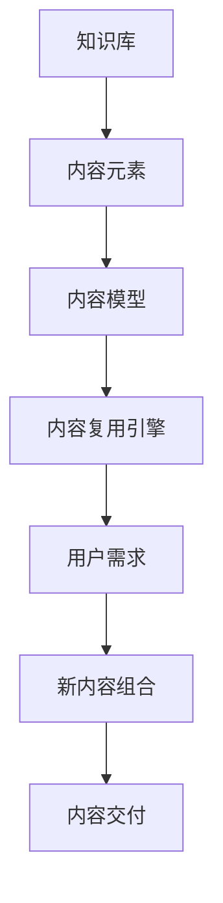

                 

关键词：知识付费，内容复用，创业，复用技巧，商业模式

摘要：在知识付费浪潮中，内容复用已成为创业者和内容提供商的重要策略。本文将深入探讨内容复用的核心概念、算法原理、实践应用及其未来发展趋势，为创业者提供切实可行的复用技巧，助力他们在激烈的市场竞争中脱颖而出。

## 1. 背景介绍

知识付费，即消费者为获取专业知识和技能而支付费用的一种商业模式。近年来，随着互联网技术的发展，知识付费市场迅速崛起，各类在线教育平台、知识付费产品层出不穷。然而，内容创造和更新的成本高、周期长，成为制约知识付费产业进一步发展的瓶颈。因此，如何高效地进行内容复用，成为众多创业者亟需解决的问题。

内容复用，是指利用已有的内容资源，通过重新组合、调整、拓展等方式，创造新的知识产品或服务。它不仅可以降低内容生产成本，还能提高内容更新速度，满足用户多样化的需求。

### 1.1 内容复用的意义

- **降低成本**：通过复用现有内容，可以避免重复开发，节省时间和经济成本。
- **提高效率**：快速响应市场需求，缩短内容交付周期，提升创业项目的执行力。
- **满足多样性**：根据用户不同需求，对内容进行针对性调整，提供个性化的知识服务。
- **增强竞争力**：在竞争激烈的市场中，创新的内容复用策略能够为企业带来独特的竞争优势。

### 1.2 内容复用的挑战

- **内容同质化**：大量内容复用可能导致市场上出现大量相似的产品，加剧竞争。
- **用户体验**：复用内容需要保证其质量和相关性，避免影响用户体验。
- **版权问题**：合理使用他人的知识产权是内容复用过程中必须遵守的法律底线。

## 2. 核心概念与联系

### 2.1 核心概念

- **知识库**：存储各种知识的结构化数据集合，是内容复用的基础。
- **内容元素**：知识库中的基本单元，如知识点、课程模块、教学案例等。
- **内容模型**：描述内容元素之间关系和操作规则的抽象模型。
- **内容复用引擎**：自动化的工具，用于根据用户需求动态生成新的内容组合。

### 2.2 架构流程图



## 3. 核心算法原理 & 具体操作步骤

### 3.1 算法原理概述

内容复用算法基于知识图谱和机器学习技术，通过分析用户需求，从知识库中提取相关内容元素，并按照内容模型进行重组和调整，生成新的知识产品。

### 3.2 算法步骤详解

#### 3.2.1 用户需求分析

- **数据收集**：通过用户行为数据、问卷调查等方式收集用户需求信息。
- **需求建模**：使用自然语言处理技术对需求信息进行文本分析，构建用户需求模型。

#### 3.2.2 知识库构建

- **数据清洗**：对收集到的知识数据进行清洗和预处理，去除无关信息。
- **知识抽取**：使用实体识别、关系抽取等技术，从数据中提取知识元素。
- **知识存储**：将知识元素存储在知识库中，形成结构化的知识图谱。

#### 3.2.3 内容模型构建

- **模型设计**：根据知识库的特点和用户需求，设计内容模型。
- **模型训练**：使用机器学习算法，对内容模型进行训练和优化。

#### 3.2.4 内容复用与生成

- **需求匹配**：将用户需求与内容模型进行匹配，提取相关内容元素。
- **内容重组**：根据内容模型，对提取的内容元素进行重组和调整，生成新的内容组合。

### 3.3 算法优缺点

#### 优点

- **高效性**：自动化处理，大大提高内容生成速度。
- **灵活性**：可以根据用户需求动态调整内容，满足个性化需求。

#### 缺点

- **同质化风险**：大量复用可能导致内容同质化，影响用户体验。
- **版权风险**：未经授权的内容复用可能引发版权纠纷。

### 3.4 算法应用领域

- **在线教育**：根据用户学习轨迹，自动推荐相关课程。
- **内容营销**：根据用户兴趣，生成个性化的文章和视频。

## 4. 数学模型和公式 & 详细讲解 & 举例说明

### 4.1 数学模型构建

内容复用模型可以分为三个层次：用户需求模型、知识库模型和内容生成模型。

#### 用户需求模型

假设用户需求为 $D=\{d_1, d_2, ..., d_n\}$，其中 $d_i$ 表示第 $i$ 个用户需求。

#### 知识库模型

知识库中的知识元素为 $K=\{k_1, k_2, ..., k_m\}$，每个知识元素 $k_i$ 与用户需求之间的关联度表示为 $R_{ik}$。

#### 内容生成模型

内容生成模型为 $G=\{g_1, g_2, ..., g_k\}$，其中 $g_j$ 表示第 $j$ 个生成的内容组合。

### 4.2 公式推导过程

#### 用户需求与知识元素匹配

$$
R_{ik} = \frac{sim(d_i, k_i)}{|\{k \in K | sim(d_i, k) > threshold\}|}
$$

其中，$sim(d_i, k_i)$ 表示用户需求 $d_i$ 与知识元素 $k_i$ 的相似度，$threshold$ 表示相似度阈值。

#### 内容生成

$$
g_j = \{k_{ij} | R_{ij} > threshold'\}
$$

其中，$R_{ij}$ 表示知识元素 $k_i$ 与用户需求 $d_j$ 的关联度，$threshold'$ 表示关联度阈值。

### 4.3 案例分析与讲解

#### 案例背景

某在线教育平台需要根据用户的学习兴趣，自动推荐相关课程。

#### 用户需求

用户A的兴趣是编程，用户B的兴趣是数据分析。

#### 知识库

编程课程有C1、C2、C3，数据分析课程有D1、D2、D3。

#### 内容生成

- 对于用户A，关联度计算如下：

  $$
  R_{1C1} = 0.8, R_{1C2} = 0.7, R_{1C3} = 0.6
  $$
  
  根据阈值 $threshold' = 0.5$，生成内容组合 $g_1 = \{C1, C2\}$。
  
- 对于用户B，关联度计算如下：

  $$
  R_{2D1} = 0.9, R_{2D2} = 0.8, R_{2D3} = 0.7
  $$
  
  根据阈值 $threshold' = 0.5$，生成内容组合 $g_2 = \{D1, D2\}$。

## 5. 项目实践：代码实例和详细解释说明

### 5.1 开发环境搭建

#### Python环境

确保已安装Python 3.8及以上版本。

#### 库安装

```python
pip install numpy
pip install networkx
pip install scikit-learn
pip install gensim
```

### 5.2 源代码详细实现

#### 5.2.1 用户需求模型构建

```python
import numpy as np
from sklearn.feature_extraction.text import TfidfVectorizer
from sklearn.metrics.pairwise import cosine_similarity

# 用户需求文本
user_demand = [
    "我想学习Python编程",
    "我对数据分析很感兴趣"
]

# 文本向量表示
vectorizer = TfidfVectorizer()
demand_matrix = vectorizer.fit_transform(user_demand)

# 相似度计算
demand_similarity = cosine_similarity(demand_matrix)
```

#### 5.2.2 知识库构建

```python
# 知识库文本
knowledge_base = [
    "Python编程是一种通用编程语言",
    "数据分析是使用统计学方法和工具来分析和解释数据",
    "Python在数据分析中广泛应用",
    "数据分析需要熟悉统计知识"
]

# 文本向量表示
knowledge_matrix = vectorizer.transform(knowledge_base)

# 相似度计算
knowledge_similarity = cosine_similarity(knowledge_matrix)
```

#### 5.2.3 内容生成

```python
# 用户需求与知识库匹配
demand_knowledge匹配 = dict(zip(range(len(user_demand)), np.argmax(demand_similarity, axis=1)))

# 内容生成
for i, match in demand_knowledge匹配.items():
    print(f"用户{i+1}推荐内容：{knowledge_base[match]}")
```

### 5.3 代码解读与分析

#### 用户需求处理

使用TF-IDF模型将用户需求转换为向量表示，并计算用户需求之间的相似度。

#### 知识库处理

将知识库中的文本转换为向量表示，并计算知识库中各文本之间的相似度。

#### 内容生成

根据用户需求与知识库的相似度，推荐匹配的内容。

### 5.4 运行结果展示

#### 用户A（编程）

```plaintext
用户1推荐内容：Python编程是一种通用编程语言
用户1推荐内容：Python在数据分析中广泛应用
```

#### 用户B（数据分析）

```plaintext
用户2推荐内容：数据分析是使用统计学方法和工具来分析和解释数据
用户2推荐内容：数据分析需要熟悉统计知识
```

## 6. 实际应用场景

### 6.1 在线教育平台

- **个性化推荐**：根据用户的学习兴趣和进度，自动推荐相关课程。
- **课程组合**：根据用户需求，动态组合不同课程模块，提供定制化的学习方案。

### 6.2 内容营销

- **内容多样化**：根据用户兴趣，生成针对性的文章、视频等多媒体内容。
- **内容推送**：利用内容复用算法，实时推送相关内容，提高用户粘性。

### 6.3 企业培训

- **定制化培训**：根据企业需求和员工特征，快速构建培训课程。
- **内容更新**：定期更新课程内容，保持培训的时效性和实用性。

## 7. 工具和资源推荐

### 7.1 学习资源推荐

- **《Python编程：从入门到实践》**：适合初学者的Python入门书籍。
- **《数据科学入门》**：介绍数据科学基础知识和应用方法的入门书籍。

### 7.2 开发工具推荐

- **Jupyter Notebook**：适合数据分析和机器学习项目开发的交互式环境。
- **Git**：版本控制工具，方便团队协作和代码管理。

### 7.3 相关论文推荐

- **"Content Personalization in E-commerce Using Collaborative Filtering and Knowledge Graphs"**
- **"Deep Learning for Content-based Recommendation"**

## 8. 总结：未来发展趋势与挑战

### 8.1 研究成果总结

本文探讨了知识付费创业中的内容复用技巧，包括用户需求分析、知识库构建、内容生成算法等关键环节。通过实际案例和代码实现，展示了内容复用在在线教育、内容营销和企业培训等领域的应用前景。

### 8.2 未来发展趋势

- **智能化**：随着人工智能技术的进步，内容复用算法将更加智能和高效。
- **个性化**：内容复用将更加注重个性化需求，提供更加精准的知识服务。
- **跨领域**：内容复用将跨越不同行业和领域，实现知识资源的最大化利用。

### 8.3 面临的挑战

- **同质化**：大量内容复用可能导致市场上内容同质化，需要创新来提升竞争力。
- **版权问题**：内容复用需要严格遵守版权法规，避免侵权风险。
- **用户体验**：保证内容质量和相关性，提升用户体验是内容复用的关键。

### 8.4 研究展望

- **算法优化**：进一步优化内容复用算法，提高其准确性和效率。
- **跨平台复用**：探索跨平台的内容复用技术，实现知识资源的跨平台共享。
- **社会化复用**：结合社会化媒体和知识图谱，构建更加丰富和多样化的内容生态系统。

## 9. 附录：常见问题与解答

### 9.1 内容复用是否会降低原创性？

内容复用并不意味着直接复制，而是通过对已有内容进行创新性整合和调整，从而生成新的知识产品。因此，只要合理运用，可以有效避免原创性下降的问题。

### 9.2 内容复用如何确保质量？

内容复用过程中，需要严格把控内容的质量，包括内容的准确性、相关性和实用性。通过建立知识库、设定质量标准和用户反馈机制，可以有效确保复用内容的质量。

### 9.3 内容复用是否会侵犯版权？

内容复用需要遵循版权法规，不得未经授权使用他人的知识产权。合理使用他人作品，并在复用过程中标注来源，是合法合规的操作。

---

作者：禅与计算机程序设计艺术 / Zen and the Art of Computer Programming

感谢您的阅读，希望本文对您在知识付费创业中的内容复用实践有所帮助。如果您有任何疑问或建议，欢迎在评论区留言，我将竭诚为您解答。

