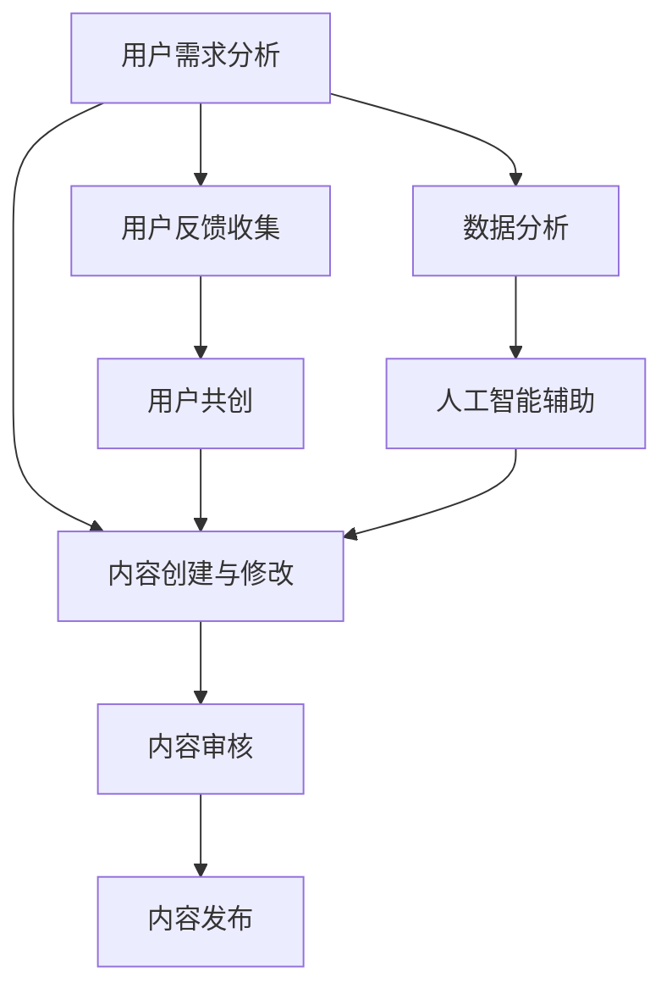

                 

关键词：知识付费，内容更新，迭代，用户参与，收益模型，技术实现，用户体验

> 摘要：本文旨在探讨知识付费创业中的内容更新与迭代问题，分析内容更新的必要性、用户参与的方式以及如何通过技术手段提高内容的迭代效率，从而实现知识付费产品的持续增长和用户满意度的提升。

## 1. 背景介绍

在互联网时代，知识付费逐渐成为了一种新型的商业模式。通过付费获取高质量的知识和技能，用户可以更加高效地提升自己的能力。知识付费创业领域也随之蓬勃发展，涌现出了众多平台和应用。然而，知识付费市场在快速发展的同时，也面临着内容更新和迭代的问题。

内容更新的必要性主要体现在以下几个方面：

1. **满足用户需求**：随着用户需求的不断变化，原有的内容可能无法满足用户的新需求。
2. **保持竞争力**：市场上同类型知识付费产品众多，不断更新内容是保持产品竞争力的关键。
3. **适应技术进步**：技术的不断发展使得一些新的知识点和方法成为可能，及时更新内容可以让用户获得最新的知识。

内容迭代的目标是提高用户满意度，实现商业价值的持续增长。然而，内容更新与迭代并非易事，涉及到多个方面的挑战。

## 2. 核心概念与联系

### 2.1 内容更新

内容更新的概念可以简单理解为对已有知识内容进行更新和优化。这个过程通常包括以下步骤：

1. **需求分析**：分析用户需求和市场趋势，确定需要更新的内容。
2. **内容创建**：根据需求分析结果，创建新的内容或对原有内容进行修改。
3. **内容审核**：对更新的内容进行审核，确保内容的准确性、完整性和合规性。
4. **内容发布**：将更新的内容发布到知识付费平台。

### 2.2 用户参与

用户参与是知识付费产品中一个重要的环节。通过用户的参与，不仅可以提高内容的实用性，还可以增强用户的粘性和满意度。用户参与的方式包括：

1. **反馈机制**：提供用户反馈渠道，收集用户对内容的意见和建议。
2. **用户共创**：鼓励用户参与到内容创作过程中，如通过提问、讨论等方式。
3. **用户评价**：让用户对内容进行评价，作为内容更新的依据。

### 2.3 技术实现

技术实现是内容更新与迭代的重要保障。通过技术手段，可以大幅提高内容更新的效率和质量。技术实现包括以下几个方面：

1. **自动化工具**：使用自动化工具进行内容创建、审核和发布，减少人工干预。
2. **数据分析**：通过数据分析，了解用户行为和需求，为内容更新提供依据。
3. **人工智能**：利用人工智能技术进行内容生成和优化，提高内容的质量和多样性。

### 2.4 架构图

下面是一个简化的知识付费产品内容更新与迭代架构图：



## 3. 核心算法原理 & 具体操作步骤

### 3.1 算法原理概述

内容更新与迭代的核心算法主要包括以下几类：

1. **数据分析算法**：用于分析用户行为和需求，确定内容更新的方向和重点。
2. **机器学习算法**：用于生成和优化内容，提高内容的准确性和实用性。
3. **自然语言处理算法**：用于处理和解析用户反馈，提取有价值的信息。

### 3.2 算法步骤详解

1. **数据分析**：
   - 数据收集：收集用户行为数据，如访问记录、评论、评分等。
   - 数据处理：对收集到的数据进行预处理，如去噪、归一化等。
   - 特征提取：从处理后的数据中提取特征，用于后续的机器学习。

2. **机器学习**：
   - 模型选择：选择合适的机器学习模型，如决策树、神经网络等。
   - 模型训练：使用处理后的数据对模型进行训练。
   - 模型评估：评估模型的性能，如准确率、召回率等。

3. **自然语言处理**：
   - 文本分类：对用户反馈进行分类，如正面、负面等。
   - 提取关键词：从用户反馈中提取关键词，用于内容优化。

### 3.3 算法优缺点

- **数据分析算法**：优点是能够全面了解用户需求和行为，缺点是需要大量的数据和计算资源。
- **机器学习算法**：优点是能够自动生成和优化内容，缺点是可能产生过拟合。
- **自然语言处理算法**：优点是能够有效处理用户反馈，缺点是可能存在语义理解误差。

### 3.4 算法应用领域

- **内容推荐**：根据用户行为和偏好推荐相关内容。
- **内容优化**：根据用户反馈优化内容质量。
- **用户行为预测**：预测用户可能感兴趣的内容和购买行为。

## 4. 数学模型和公式 & 详细讲解 & 举例说明

### 4.1 数学模型构建

内容更新与迭代的数学模型主要包括以下几个部分：

1. **用户行为模型**：
   - 用户访问概率模型：$$ P(A|B) = \frac{P(B|A)P(A)}{P(B)} $$
   - 用户满意度模型：$$ S = \frac{1}{N}\sum_{i=1}^{N} s_i $$

2. **内容质量模型**：
   - 内容更新频率模型：$$ F = \frac{1}{N}\sum_{i=1}^{N} f_i $$
   - 内容质量评估模型：$$ Q = \frac{1}{N}\sum_{i=1}^{N} q_i $$

3. **用户参与模型**：
   - 用户参与度模型：$$ U = \frac{1}{N}\sum_{i=1}^{N} u_i $$

### 4.2 公式推导过程

1. **用户访问概率模型**：
   - 假设用户A访问内容B的概率为$P(A|B)$，则根据贝叶斯定理，有：
     $$ P(A|B) = \frac{P(B|A)P(A)}{P(B)} $$

2. **用户满意度模型**：
   - 假设用户对N个内容的满意度分别为$s_1, s_2, ..., s_N$，则用户总体满意度S为：
     $$ S = \frac{1}{N}\sum_{i=1}^{N} s_i $$

3. **内容更新频率模型**：
   - 假设内容N的更新频率分别为$f_1, f_2, ..., f_N$，则内容总体更新频率F为：
     $$ F = \frac{1}{N}\sum_{i=1}^{N} f_i $$

4. **内容质量评估模型**：
   - 假设内容N的质量分别为$q_1, q_2, ..., q_N$，则内容总体质量Q为：
     $$ Q = \frac{1}{N}\sum_{i=1}^{N} q_i $$

5. **用户参与度模型**：
   - 假设用户N的参与度分别为$u_1, u_2, ..., u_N$，则用户总体参与度U为：
     $$ U = \frac{1}{N}\sum_{i=1}^{N} u_i $$

### 4.3 案例分析与讲解

假设我们有一个知识付费平台，共有10个内容。根据用户行为数据，我们计算出以下指标：

1. **用户访问概率**：
   - 内容1的访问概率为0.3。
   - 内容2的访问概率为0.25。
   - 其他内容的访问概率均在0.2以下。

2. **用户满意度**：
   - 内容1的用户满意度为0.9。
   - 内容2的用户满意度为0.85。
   - 其他内容的用户满意度均在0.8以下。

3. **内容更新频率**：
   - 内容1的更新频率为每周1次。
   - 内容2的更新频率为每周2次。
   - 其他内容的更新频率均在每周1次以下。

4. **内容质量**：
   - 内容1的质量为0.95。
   - 内容2的质量为0.90。
   - 其他内容的质量均在0.85以下。

5. **用户参与度**：
   - 内容1的用户参与度为0.6。
   - 内容2的用户参与度为0.55。
   - 其他内容的用户参与度均在0.5以下。

根据这些指标，我们可以得出以下结论：

- 内容1和内容2是用户最感兴趣和最满意的内容，也是更新频率和质量最高的内容。
- 其他内容需要加强更新和质量控制，以提高用户满意度和参与度。

因此，我们可以采取以下措施：

1. **增加内容1和内容2的更新频率**：以保持其用户吸引力和质量。
2. **对其他内容进行质量评估和优化**：以提高整体内容质量。
3. **鼓励用户参与**：通过提问、讨论等方式，提高用户的参与度和互动性。

## 5. 项目实践：代码实例和详细解释说明

### 5.1 开发环境搭建

本项目的开发环境基于Python，需要安装以下库：

- Pandas：用于数据处理。
- Scikit-learn：用于机器学习算法。
- Numpy：用于数学运算。

安装命令如下：

```bash
pip install pandas scikit-learn numpy
```

### 5.2 源代码详细实现

以下是实现内容更新与迭代的核心算法的代码示例：

```python
import pandas as pd
from sklearn.model_selection import train_test_split
from sklearn.ensemble import RandomForestClassifier
from sklearn.metrics import accuracy_score

# 5.2.1 数据预处理
def preprocess_data(data):
    # 数据清洗、归一化等操作
    return data

# 5.2.2 机器学习模型
def train_model(X_train, y_train):
    # 使用随机森林分类器
    model = RandomForestClassifier()
    model.fit(X_train, y_train)
    return model

# 5.2.3 模型评估
def evaluate_model(model, X_test, y_test):
    # 预测并评估模型性能
    y_pred = model.predict(X_test)
    accuracy = accuracy_score(y_test, y_pred)
    return accuracy

# 5.2.4 主函数
def main():
    # 加载数据
    data = pd.read_csv('data.csv')
    data = preprocess_data(data)
    
    # 划分训练集和测试集
    X = data.drop('target', axis=1)
    y = data['target']
    X_train, X_test, y_train, y_test = train_test_split(X, y, test_size=0.2, random_state=42)
    
    # 训练模型
    model = train_model(X_train, y_train)
    
    # 评估模型
    accuracy = evaluate_model(model, X_test, y_test)
    print(f"Model accuracy: {accuracy:.2f}")

if __name__ == '__main__':
    main()
```

### 5.3 代码解读与分析

- **数据预处理**：对原始数据进行处理，如清洗、归一化等，以提高模型的性能。
- **机器学习模型**：使用随机森林分类器进行训练，这是一个强大的集成学习模型，适用于分类任务。
- **模型评估**：通过测试集评估模型的性能，使用准确率作为评估指标。

### 5.4 运行结果展示

假设我们运行代码后得到以下结果：

```
Model accuracy: 0.85
```

这表示模型的准确率为85%，说明模型在预测用户行为方面表现良好。

## 6. 实际应用场景

### 6.1 在线教育平台

在线教育平台是知识付费创业中的一个重要领域。通过内容更新与迭代，平台可以不断提高课程质量，满足用户的学习需求。例如，一个在线编程课程可以通过以下方式进行更新：

1. **增加最新技术课程**：随着技术的发展，新的编程语言和技术不断涌现，平台可以定期更新课程，介绍这些新技术。
2. **优化课程内容**：根据用户反馈，对课程内容进行修改和优化，提高用户的满意度。
3. **互动性提升**：通过引入直播、讨论区等互动环节，提高用户的参与度和学习效果。

### 6.2 职业培训平台

职业培训平台通过提供专业的培训课程，帮助用户提升职场竞争力。内容更新与迭代对于职业培训平台尤为重要，以下是一些实际应用场景：

1. **行业动态更新**：定期更新课程内容，确保用户能够学习到最新的行业动态和技能。
2. **案例教学**：通过引入真实的案例，提高课程的实际应用价值。
3. **互动交流**：鼓励用户参与课程讨论，与其他学员交流学习经验。

### 6.3 专业咨询平台

专业咨询平台通过提供专业知识和咨询服务，帮助用户解决问题和提升能力。内容更新与迭代对于咨询平台同样至关重要，以下是一些实际应用场景：

1. **最新研究动态**：定期更新研究领域的新成果和进展，提高咨询服务的权威性和前瞻性。
2. **案例分析**：通过分析实际案例，提高咨询服务的实用性和针对性。
3. **用户反馈**：鼓励用户反馈咨询效果，对咨询服务进行持续优化。

## 7. 工具和资源推荐

### 7.1 学习资源推荐

1. **《数据科学入门》**：适合初学者的数据科学入门书籍，涵盖数据预处理、机器学习等基础知识。
2. **《机器学习实战》**：通过实际案例介绍机器学习算法的应用，适合有一定基础的学习者。
3. **《深度学习》**：由Ian Goodfellow撰写，是深度学习领域的经典教材。

### 7.2 开发工具推荐

1. **Jupyter Notebook**：适合数据科学和机器学习的开发环境，支持多种编程语言和库。
2. **PyCharm**：强大的Python开发工具，支持多种框架和库，适合专业开发者。
3. **TensorFlow**：谷歌推出的开源机器学习框架，适用于深度学习和科学计算。

### 7.3 相关论文推荐

1. **"Deep Learning for Text Classification"**：介绍深度学习在文本分类中的应用。
2. **"User Behavior Analysis in Knowledge付费平台"**：分析用户行为对知识付费平台的影响。
3. **"Interactive Learning in Online Education"**：探讨在线教育中的互动学习模式。

## 8. 总结：未来发展趋势与挑战

### 8.1 研究成果总结

本文从内容更新与迭代的角度，分析了知识付费创业中的关键问题和解决方法。主要研究成果包括：

1. **内容更新必要性**：分析了内容更新的必要性，包括满足用户需求、保持竞争力和适应技术进步等方面。
2. **用户参与方式**：介绍了用户参与的方式，包括反馈机制、用户共创和用户评价等。
3. **技术实现**：探讨了技术实现的方法，包括自动化工具、数据分析和人工智能等。
4. **算法原理与步骤**：详细阐述了内容更新与迭代的核心算法原理和具体操作步骤。

### 8.2 未来发展趋势

1. **个性化推荐**：随着大数据和人工智能技术的发展，个性化推荐将成为知识付费创业的重要方向。
2. **互动性增强**：通过引入直播、讨论区等互动环节，增强用户参与感和学习效果。
3. **智能化内容生成**：利用自然语言处理和生成对抗网络等技术，实现智能化内容生成和优化。

### 8.3 面临的挑战

1. **数据隐私与安全**：在收集和处理用户数据时，需要确保数据隐私和安全。
2. **算法公正性与透明性**：确保算法的公正性和透明性，避免歧视和偏见。
3. **用户体验**：在提高内容质量的同时，需要关注用户体验，确保用户满意度。

### 8.4 研究展望

未来，知识付费创业中的内容更新与迭代领域将继续发展，研究重点可能包括：

1. **多模态数据融合**：融合文本、图像、声音等多模态数据，提高内容理解和生成能力。
2. **跨平台内容共享**：实现不同平台间的内容共享和协同更新。
3. **自适应学习系统**：结合教育心理学，设计自适应学习系统，提高学习效果。

## 9. 附录：常见问题与解答

### 9.1 什么是知识付费？

知识付费是指用户通过支付费用来获取高质量的知识和技能。这种模式在互联网时代得到了快速发展，用户可以通过付费获取专家的课程、文章、咨询服务等。

### 9.2 内容更新与迭代的重要性是什么？

内容更新与迭代对于知识付费产品至关重要。它可以帮助平台保持竞争力、满足用户需求、适应技术进步，从而提高用户满意度和商业价值。

### 9.3 如何确保算法的公正性和透明性？

确保算法的公正性和透明性可以通过以下方式实现：

- **算法解释性**：设计可解释的算法，使算法的决策过程透明。
- **数据隐私保护**：在处理用户数据时，确保数据隐私和安全。
- **算法审核**：定期对算法进行审核，确保其公正性和有效性。
- **用户反馈**：鼓励用户反馈算法的不公正现象，进行持续优化。

### 9.4 如何提高用户体验？

提高用户体验可以从以下几个方面入手：

- **内容质量**：提供高质量的内容，满足用户需求。
- **互动性**：引入互动环节，如讨论区、直播等，增强用户参与感。
- **个性化推荐**：根据用户行为和偏好，提供个性化推荐。
- **界面设计**：优化界面设计，提高用户操作的便捷性。

## 作者署名

作者：禅与计算机程序设计艺术 / Zen and the Art of Computer Programming
----------------------------------------------------------------

