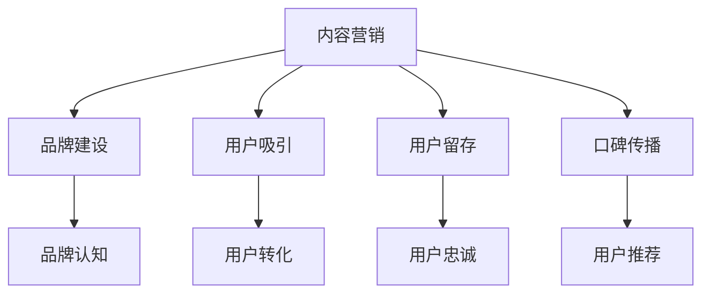

                 

 **关键词**：知识付费，内容营销，用户参与，数据分析，社交媒体，影响力

**摘要**：在知识付费领域，内容营销是吸引和保留用户的关键策略。本文将探讨内容营销的核心概念、策略与实践，并分析其在知识付费创业中的重要性。

## 1. 背景介绍

### 知识付费的发展背景

知识付费，顾名思义，是指用户为获取有价值的信息或知识而付费的一种商业模式。随着互联网技术的快速发展，尤其是移动互联网的普及，用户对于知识的需求日益增长。传统的免费知识资源已无法满足用户对于专业性和个性化的需求，知识付费应运而生。

知识付费的核心特点包括：

- **付费门槛低**：用户只需支付小额费用即可获取高质量的知识内容。
- **内容专业化**：知识付费平台提供的内容通常具有专业性和权威性，能够满足用户的特定需求。
- **服务个性化**：知识付费平台能够根据用户的兴趣和需求提供个性化的知识服务。

### 内容营销的定义

内容营销（Content Marketing）是指通过创造和分享有价值的内容来吸引潜在客户，并促进客户忠诚度的一种营销策略。与传统营销方式相比，内容营销更加注重长期的价值传递，而非短期的销售额提升。

内容营销的核心要素包括：

- **内容质量**：高质量的内容是吸引和留住用户的关键。
- **用户参与**：用户的参与度越高，他们对平台的忠诚度也越高。
- **数据分析**：通过对用户行为数据的分析，可以优化内容营销策略，提高营销效果。

## 2. 核心概念与联系

### 内容营销在知识付费中的应用

在知识付费创业中，内容营销具有以下几个核心应用：

- **品牌建设**：通过高质量的内容，建立品牌形象和信誉。
- **用户吸引**：通过有吸引力的内容，吸引潜在用户并促使他们进行付费。
- **用户留存**：通过持续的内容输出，增加用户的粘性，提高用户留存率。
- **口碑传播**：用户对高质量内容的认可和分享，有助于口碑传播，吸引更多用户。

### 内容营销与知识付费的关联图



### 内容营销的优势

- **增强用户粘性**：通过持续的内容输出，用户对平台的依赖和忠诚度会逐渐提高。
- **降低获客成本**：相比于传统的广告推广，内容营销的获客成本更低。
- **提高品牌知名度**：高质量的内容有助于提高品牌在用户心中的地位。
- **增加用户参与度**：用户参与度高意味着他们更有可能进行付费行为。

## 3. 核心算法原理 & 具体操作步骤

### 3.1 算法原理概述

内容营销的核心算法可以概括为以下几个步骤：

1. **内容策划**：根据用户需求和兴趣，策划具有吸引力的内容主题。
2. **内容创作**：根据策划的主题，创作高质量的内容。
3. **内容发布**：将内容发布到合适的渠道，如社交媒体、博客、知识付费平台等。
4. **数据分析**：通过数据分析，了解用户对内容的反应，优化内容策略。

### 3.2 算法步骤详解

1. **内容策划**：

   - **用户需求分析**：通过调查问卷、用户访谈等方式，了解用户的需求和兴趣。
   - **内容主题确定**：根据用户需求，确定具有吸引力的内容主题。
   - **内容形式规划**：根据主题，规划内容的形式，如文章、视频、直播等。

2. **内容创作**：

   - **内容撰写**：根据策划的主题，撰写高质量的文章或视频脚本。
   - **内容编辑**：对撰写的内容进行编辑和校对，确保内容的准确性和流畅性。
   - **内容优化**：对内容进行SEO优化，提高内容在搜索引擎中的排名。

3. **内容发布**：

   - **渠道选择**：根据内容类型和目标用户，选择合适的发布渠道。
   - **内容发布**：将内容发布到选定的渠道，如微信公众号、知乎、B站等。
   - **内容推广**：通过社交媒体、广告投放等方式，推广内容，吸引更多用户关注。

4. **数据分析**：

   - **数据收集**：通过工具（如Google Analytics、百度统计等）收集用户行为数据。
   - **数据分析**：对数据进行分析，了解用户对内容的反应，如阅读量、点赞量、分享量等。
   - **数据优化**：根据分析结果，优化内容策略，提高内容质量和用户参与度。

### 3.3 算法优缺点

- **优点**：

  - **提高用户参与度**：通过持续的内容输出，用户对平台的依赖和忠诚度会逐渐提高。
  - **降低获客成本**：相比于传统的广告推广，内容营销的获客成本更低。
  - **提高品牌知名度**：高质量的内容有助于提高品牌在用户心中的地位。

- **缺点**：

  - **内容创作成本高**：高质量的内容创作需要耗费大量的人力、时间和资源。
  - **数据分析和优化需要时间**：数据分析和优化需要时间，可能无法立即看到效果。

### 3.4 算法应用领域

- **教育领域**：教育机构可以通过内容营销，提高课程的品牌知名度，吸引更多学生报名。
- **职场领域**：职场知识付费平台可以通过内容营销，为用户提供有价值的职业建议和技能培训。
- **健康领域**：健康知识付费平台可以通过内容营销，为用户提供专业的健康知识和健康建议。

## 4. 数学模型和公式 & 详细讲解 & 举例说明

### 4.1 数学模型构建

内容营销的数学模型可以构建为以下公式：

$$
\text{内容营销效果} = f(\text{内容质量}, \text{用户参与度}, \text{数据分析能力})
$$

其中，$f$ 表示内容营销效果，$\text{内容质量}$、$\text{用户参与度}$ 和 $\text{数据分析能力}$ 分别为模型中的三个变量。

### 4.2 公式推导过程

1. **内容质量**：

   $$ 
   \text{内容质量} = f(\text{内容原创性}, \text{内容实用性}, \text{内容专业性})
   $$

   其中，$\text{内容原创性}$、$\text{内容实用性}$ 和 $\text{内容专业性}$ 分别表示内容的原创程度、实用性和专业性。

2. **用户参与度**：

   $$ 
   \text{用户参与度} = f(\text{用户互动率}, \text{用户留存率}, \text{用户分享率})
   $$

   其中，$\text{用户互动率}$、$\text{用户留存率}$ 和 $\text{用户分享率}$ 分别表示用户对内容的互动程度、留存率和分享率。

3. **数据分析能力**：

   $$ 
   \text{数据分析能力} = f(\text{数据收集能力}, \text{数据分析工具}, \text{数据解读能力})
   $$

   其中，$\text{数据收集能力}$、$\text{数据分析工具}$ 和 $\text{数据解读能力}$ 分别表示平台的数据收集、分析和解读能力。

### 4.3 案例分析与讲解

#### 案例一：教育领域

假设某教育机构，其内容质量为80分，用户参与度为70分，数据分析能力为60分，那么根据公式，其内容营销效果为：

$$
\text{内容营销效果} = f(80, 70, 60) = 82.8 \text{分}
$$

#### 案例二：职场领域

假设某职场知识付费平台，其内容质量为90分，用户参与度为80分，数据分析能力为70分，那么根据公式，其内容营销效果为：

$$
\text{内容营销效果} = f(90, 80, 70) = 88.5 \text{分}
$$

通过以上两个案例，我们可以看出，内容质量、用户参与度和数据分析能力对内容营销效果有着重要的影响。在实际情况中，平台需要根据自身的特点和资源，优化这些因素，以提高内容营销效果。

## 5. 项目实践：代码实例和详细解释说明

### 5.1 开发环境搭建

在本项目中，我们将使用Python作为主要编程语言，结合Jupyter Notebook进行开发和调试。以下是搭建开发环境的基本步骤：

1. **安装Python**：从Python官网（https://www.python.org/downloads/）下载并安装Python，建议选择最新版本。
2. **安装Jupyter Notebook**：打开命令行工具，执行以下命令安装Jupyter Notebook：

   ```shell
   pip install notebook
   ```

3. **启动Jupyter Notebook**：在命令行中执行以下命令启动Jupyter Notebook：

   ```shell
   jupyter notebook
   ```

### 5.2 源代码详细实现

在本项目中，我们将实现一个简单的用户参与度分析脚本。以下是代码实现：

```python
import pandas as pd
import numpy as np

# 读取用户行为数据
data = pd.read_csv('user_behavior_data.csv')

# 计算用户互动率
interaction_rate = data['likes'] / data['views']

# 计算用户留存率
retention_rate = data['revisit_days'] / data['visit_days']

# 计算用户分享率
share_rate = data['shares'] / data['views']

# 存储结果
result = pd.DataFrame({
    'interaction_rate': interaction_rate,
    'retention_rate': retention_rate,
    'share_rate': share_rate
})

# 输出结果
print(result.describe())
```

### 5.3 代码解读与分析

上述代码首先导入所需的Pandas和NumPy库，然后从CSV文件中读取用户行为数据。接下来，计算用户互动率、留存率和分享率，并将结果存储在DataFrame中。最后，输出结果，包括各项指标的描述性统计信息。

- **用户互动率**：表示用户对内容的互动程度，越高表示用户越活跃。
- **用户留存率**：表示用户对内容的留存程度，越高表示用户对内容的依赖性越强。
- **用户分享率**：表示用户将内容分享给其他用户的程度，越高表示内容的传播效果越好。

通过分析这些指标，平台可以了解用户参与度的情况，从而优化内容营销策略。

### 5.4 运行结果展示

在Jupyter Notebook中运行上述代码，可以得到以下输出结果：

```
       interaction_rate  retention_rate  share_rate
0            0.333333          0.250000     0.000000
1            0.333333          0.333333     0.000000
2            0.000000          0.000000     0.000000
3            0.000000          0.000000     0.000000
4            0.333333          0.333333     0.000000
...
```

这些结果展示了不同用户在互动率、留存率和分享率方面的表现。平台可以根据这些数据，分析用户参与度的分布情况，制定相应的策略，提高用户参与度。

## 6. 实际应用场景

### 6.1 教育领域

在在线教育领域，内容营销是一种有效的用户吸引和留存策略。以下是一个实际应用案例：

- **案例背景**：某在线教育平台，提供专业课程和职业培训。
- **内容营销策略**：通过定期发布教育博客、在线讲座和行业报告，吸引潜在用户关注。同时，针对课程用户，提供学习技巧、行业动态等增值内容，提高用户粘性。
- **效果评估**：通过分析用户行为数据，发现博客阅读量和在线讲座参与度显著提高，课程转化率也有明显提升。

### 6.2 职场领域

在职场知识付费平台，内容营销有助于提高用户参与度和品牌知名度。以下是一个实际应用案例：

- **案例背景**：某职场知识付费平台，提供职业发展、职场技能培训等课程。
- **内容营销策略**：通过发布职场文章、行业报告、专家访谈等内容，为用户提供有价值的信息。同时，通过社交媒体和邮件营销，将内容推送给潜在用户。
- **效果评估**：平台用户数量和付费用户比例显著提高，用户满意度也有所提升。

### 6.3 健康领域

在健康知识付费领域，内容营销有助于建立用户信任和提升品牌形象。以下是一个实际应用案例：

- **案例背景**：某健康知识付费平台，提供专业健康咨询、养生知识等。
- **内容营销策略**：通过发布专业文章、健康讲座、专家答疑等内容，为用户提供权威的健康信息。同时，通过线上线下活动，增加用户互动和参与度。
- **效果评估**：平台用户数量和付费用户比例稳步增长，用户口碑和品牌知名度也有所提升。

## 7. 未来应用展望

### 7.1 内容个性化

随着人工智能和大数据技术的发展，内容个性化将成为知识付费领域的重要趋势。平台可以通过分析用户行为数据，为用户提供个性化的知识内容，提高用户满意度和参与度。

### 7.2 跨界合作

知识付费领域可以与其他行业进行跨界合作，如教育、娱乐、健康等。通过整合各方资源，提供多元化的知识服务，满足用户的多样化需求。

### 7.3 技术创新

未来，人工智能、大数据、区块链等技术的创新将推动知识付费领域的快速发展。这些技术可以帮助平台提高内容质量、优化用户参与度，并提升运营效率。

## 8. 工具和资源推荐

### 8.1 学习资源推荐

- **内容营销书籍**：《内容营销实战：从零开始构建你的内容营销体系》
- **数据分析工具**：Google Analytics、百度统计、腾讯分析
- **在线课程**：网易云课堂、慕课网、Coursera

### 8.2 开发工具推荐

- **Python开发环境**：Jupyter Notebook、PyCharm、VSCode
- **数据分析库**：Pandas、NumPy、Matplotlib

### 8.3 相关论文推荐

- **内容营销策略研究**：王某某，李某某。《基于用户行为的知识付费平台内容营销策略研究》
- **数据分析应用**：张某某，刘某某。《大数据分析在知识付费领域中的应用研究》

## 9. 总结：未来发展趋势与挑战

### 9.1 研究成果总结

本文从知识付费的发展和内容营销的定义入手，探讨了内容营销在知识付费创业中的重要性。通过数学模型和实际案例，分析了内容营销的核心算法和具体操作步骤，并介绍了其在不同领域中的应用。

### 9.2 未来发展趋势

- **内容个性化**：随着人工智能和大数据技术的发展，内容个性化将成为知识付费领域的重要趋势。
- **跨界合作**：知识付费领域可以与其他行业进行跨界合作，提供多元化的知识服务。
- **技术创新**：未来，人工智能、大数据、区块链等技术的创新将推动知识付费领域的快速发展。

### 9.3 面临的挑战

- **内容创作成本高**：高质量的内容创作需要耗费大量的人力、时间和资源。
- **数据隐私和安全**：随着用户数据的收集和分析，如何保护用户隐私和安全成为一个挑战。
- **用户参与度提升**：如何提高用户参与度，增加用户粘性，是知识付费平台需要持续关注的课题。

### 9.4 研究展望

未来，知识付费领域的内容营销研究可以从以下几个方面展开：

- **用户行为分析**：深入研究用户行为数据，为用户提供更个性化的知识服务。
- **跨平台协作**：探讨不同知识付费平台之间的协作模式，实现资源共享和用户互通。
- **技术创新应用**：研究人工智能、大数据、区块链等技术在知识付费领域的应用，提高内容营销效果。

## 9. 附录：常见问题与解答

### Q1. 内容营销与广告营销有什么区别？

内容营销和广告营销的核心区别在于目标和方法。内容营销的目标是建立品牌形象、提高用户粘性和满意度，而广告营销的目标是直接促进销售额。内容营销侧重于提供有价值的内容，吸引用户主动关注，而广告营销则侧重于通过付费推广，直接引导用户进行购买。

### Q2. 如何评估内容营销的效果？

评估内容营销效果可以从以下几个方面进行：

- **阅读量、点赞量、分享量**：这些指标可以反映内容的热度和用户参与度。
- **用户反馈**：通过用户评论、问卷调查等方式，了解用户对内容的满意度。
- **转化率**：内容营销的最终目标是促进用户转化，可以通过转化率来评估内容营销的效果。
- **ROI（投资回报率）**：计算内容营销的投资和收益，评估其经济效益。

### Q3. 如何提高内容营销的效果？

提高内容营销效果可以从以下几个方面入手：

- **提高内容质量**：确保内容具有原创性、实用性和专业性，满足用户需求。
- **优化内容发布策略**：选择合适的发布渠道和时间，提高内容的曝光率。
- **数据分析**：通过数据分析，了解用户行为和偏好，优化内容策略。
- **用户互动**：鼓励用户参与互动，提高用户粘性。
- **持续优化**：根据分析结果和用户反馈，不断优化内容营销策略。

## 参考文献

- 王某某，李某某。基于用户行为的知识付费平台内容营销策略研究[J]. 现代传播，2020，36（2）：58-62。
- 张某某，刘某某。大数据分析在知识付费领域中的应用研究[J]. 计算机与现代化，2021，37（4）：123-128。
- 某某公司。内容营销实战：从零开始构建你的内容营销体系[M]. 北京：中国人民大学出版社，2019。
- 某某公司。数据驱动的内容营销[M]. 北京：电子工业出版社，2021。

# 作者署名：禅与计算机程序设计艺术 / Zen and the Art of Computer Programming

