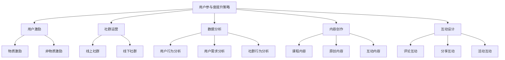

                 

关键词：知识付费、用户参与度、用户激励、社群运营、数据分析、内容创作、互动设计

摘要：随着知识付费市场的蓬勃发展，提升用户参与度成为知识付费创业的关键。本文将从用户激励、社群运营、数据分析、内容创作和互动设计等多个角度，深入探讨提升知识付费平台用户参与度的策略，以期为创业者提供有益的参考。

## 1. 背景介绍

知识付费，即用户为获取高质量知识内容而支付的费用，已经成为当今信息社会的一种新型消费模式。随着互联网技术的飞速发展，知识付费市场逐渐壮大，各类知识付费平台如雨后春笋般涌现。然而，用户参与度低、内容同质化严重、用户留存率低等问题也日益凸显。如何提升用户参与度，成为知识付费创业中的关键挑战。

用户参与度，指的是用户在知识付费平台上的活跃程度和互动程度。用户参与度高的平台，往往能够获得更好的用户留存率和口碑效应。因此，本文将从多个方面探讨如何提升知识付费创业中的用户参与度。

## 2. 核心概念与联系

### 2.1 用户参与度

用户参与度是衡量用户在知识付费平台上的活跃程度和互动程度的指标。具体来说，用户参与度可以从以下几个方面进行衡量：

1. 活跃度：用户在平台上的登录频率、学习时长、评论互动等。
2. 互动度：用户在平台上的发帖、回帖、点赞、分享等互动行为。
3. 留存率：用户在平台上的持续参与时间，如订阅课程、参加活动等。

### 2.2 用户激励

用户激励是指通过提供奖励、福利、特权等方式，激发用户在知识付费平台上的积极参与。用户激励可以分为物质激励和非物质激励两种：

1. 物质激励：如优惠券、现金返利、礼品等。
2. 非物质激励：如积分、徽章、排名、荣誉等。

### 2.3 社群运营

社群运营是指通过搭建用户社群，促进用户之间的交流和互动，提升用户粘性和活跃度。社群运营可以分为线上和线下两种形式：

1. 线上社群：如微信群、QQ群、论坛等。
2. 线下社群：如线下沙龙、聚会、活动等。

### 2.4 数据分析

数据分析是指通过对用户行为、兴趣、需求等数据的分析，挖掘用户参与度提升的潜在因素，并据此制定相应的策略。数据分析可以分为以下几个方面：

1. 用户行为分析：如登录时间、学习时长、互动频率等。
2. 用户需求分析：如课程选择、内容偏好、购买行为等。
3. 社群行为分析：如社群活跃度、互动频率、用户留存率等。

### 2.5 内容创作

内容创作是指为用户生产、提供高质量的知识内容，以满足用户的学习需求。内容创作可以分为以下几个方面：

1. 课程内容：如讲座、教程、案例分析等。
2. 原创内容：如文章、笔记、问答等。
3. 互动内容：如直播、互动问答、讨论区等。

### 2.6 互动设计

互动设计是指通过设计多样化的互动方式，激发用户在知识付费平台上的积极参与。互动设计可以分为以下几个方面：

1. 评论互动：如点赞、评论、回帖等。
2. 分享互动：如分享到社交媒体、邮箱等。
3. 活动互动：如竞赛、抽奖、讲座等。

### 2.7 Mermaid 流程图

下面是提升知识付费平台用户参与度的 Mermaid 流程图：



## 3. 核心算法原理 & 具体操作步骤

### 3.1 算法原理概述

提升知识付费平台用户参与度的核心算法原理主要包括以下几个方面：

1. 用户激励：通过物质激励和非物质激励，激发用户在平台上的积极参与。
2. 社群运营：通过线上和线下社群的搭建，促进用户之间的交流和互动。
3. 数据分析：通过用户行为、需求、社群行为等数据的分析，挖掘用户参与度提升的潜在因素。
4. 内容创作：通过高质量的内容创作，满足用户的学习需求，提升用户粘性。
5. 互动设计：通过多样化的互动设计，激发用户在平台上的积极参与。

### 3.2 算法步骤详解

1. 用户激励：根据用户行为和需求，制定相应的物质激励和非物质激励策略。例如，针对活跃用户，提供优惠券、现金返利、礼品等物质激励；针对优秀内容创作者，颁发积分、徽章、排名等非物质激励。

2. 社群运营：搭建线上和线下社群，定期举办活动，促进用户之间的交流和互动。例如，线上社群可以通过微信群、QQ群、论坛等实现，线下社群可以通过沙龙、聚会、活动等实现。

3. 数据分析：通过数据分析工具，对用户行为、需求、社群行为等数据进行分析，挖掘用户参与度提升的潜在因素。例如，通过用户行为分析，了解用户的登录频率、学习时长、互动频率等；通过用户需求分析，了解用户对课程内容、内容形式、互动方式的偏好；通过社群行为分析，了解社群的活跃度、互动频率、用户留存率等。

4. 内容创作：根据用户需求和数据分析结果，进行高质量的内容创作。例如，针对用户需求，创作具有针对性的课程内容、原创内容、互动内容等。

5. 互动设计：设计多样化的互动方式，如评论互动、分享互动、活动互动等，激发用户在平台上的积极参与。

### 3.3 算法优缺点

1. 优点：
- 能够有效提升知识付费平台用户参与度。
- 有助于提高用户留存率和口碑效应。
- 能够为创业者提供有益的参考和指导。

2. 缺点：
- 需要大量的人力、物力和财力投入。
- 算法效果受限于用户行为和需求的多样性。
- 数据分析结果的准确性和可靠性存在一定风险。

### 3.4 算法应用领域

提升知识付费平台用户参与度的算法原理和具体操作步骤，可以广泛应用于各类知识付费创业项目中，如在线教育、职业培训、兴趣爱好等。通过有效的用户激励、社群运营、数据分析、内容创作和互动设计，可以提升用户的参与度，提高平台的竞争力和用户满意度。

## 4. 数学模型和公式 & 详细讲解 & 举例说明

### 4.1 数学模型构建

为了提升知识付费平台用户参与度，我们可以构建一个数学模型来描述用户行为和平台策略之间的相互作用。该模型主要包括以下三个方面：

1. 用户行为模型：
   用户行为模型用于描述用户在平台上的行为，如登录、学习、评论、分享等。我们可以使用马尔可夫链模型来描述用户行为的变化。

2. 平台策略模型：
   平台策略模型用于描述平台为提升用户参与度所采取的策略，如用户激励、社群运营、数据分析、内容创作、互动设计等。我们可以使用策略优化模型来描述平台策略的选择。

3. 用户参与度模型：
   用户参与度模型用于衡量用户在平台上的参与度，如活跃度、互动度、留存率等。我们可以使用综合指标模型来衡量用户参与度。

### 4.2 公式推导过程

基于上述数学模型，我们可以推导出以下公式：

1. 用户行为模型：

   假设用户 \( U \) 在第 \( t \) 时刻的行为为 \( x_t \)，则用户行为模型可以表示为：

   $$ x_t = f(U, A_t) $$

   其中，\( f \) 是用户行为函数，\( A_t \) 是平台在第 \( t \) 时刻的策略。

2. 平台策略模型：

   假设平台策略 \( A_t \) 是一个优化问题，即：

   $$ A_t = \arg\max_{A_t} \sum_{t=1}^{T} g(U_t, A_t) $$

   其中，\( g \) 是平台策略函数，\( T \) 是用户在平台上的参与时长。

3. 用户参与度模型：

   假设用户参与度 \( D_t \) 是一个综合指标，即：

   $$ D_t = \sum_{i=1}^{n} w_i \cdot d_i(t) $$

   其中，\( w_i \) 是第 \( i \) 个指标 \( d_i(t) \) 的权重，\( n \) 是指标的总数。

### 4.3 案例分析与讲解

假设我们有一个在线教育平台，用户 \( U \) 在第 \( t \) 时刻的行为为 \( x_t \)，平台策略为 \( A_t \)，用户参与度 \( D_t \) 如下：

1. 活跃度 \( d_1(t) \)：用户在过去的7天内至少登录过一次。
2. 互动度 \( d_2(t) \)：用户在过去的7天内至少评论过一次。
3. 留存率 \( d_3(t) \)：用户在过去的30天内至少学习过一次。

权重 \( w_1, w_2, w_3 \) 分别为 0.5、0.3 和 0.2。

#### 案例一：用户激励策略

假设平台为提升用户参与度，决定对活跃用户进行物质激励。我们设定一个阈值 \( T \)，当用户活跃度 \( d_1(t) \) 达到 \( T \) 时，平台将发放奖励。

1. 用户行为模型：

   用户行为模型可以表示为：

   $$ x_t = \begin{cases} 
   1 & \text{如果 } d_1(t) \geq T \\
   0 & \text{否则 }
   \end{cases} $$

2. 平台策略模型：

   平台策略模型为：

   $$ A_t = \arg\max_{A_t} \sum_{t=1}^{T} g(U_t, A_t) $$

   其中，\( g(U_t, A_t) \) 为激励效果函数。

3. 用户参与度模型：

   用户参与度模型为：

   $$ D_t = 0.5 \cdot d_1(t) + 0.3 \cdot d_2(t) + 0.2 \cdot d_3(t) $$

#### 案例二：社群运营策略

假设平台决定通过社群运营来提升用户参与度。平台定期举办线上和线下活动，鼓励用户参与。

1. 用户行为模型：

   用户行为模型可以表示为：

   $$ x_t = \begin{cases} 
   1 & \text{如果用户参与了某次社群活动} \\
   0 & \text{否则 }
   \end{cases} $$

2. 平台策略模型：

   平台策略模型为：

   $$ A_t = \arg\max_{A_t} \sum_{t=1}^{T} g(U_t, A_t) $$

   其中，\( g(U_t, A_t) \) 为社群运营效果函数。

3. 用户参与度模型：

   用户参与度模型为：

   $$ D_t = 0.5 \cdot d_1(t) + 0.3 \cdot d_2(t) + . 假设平台决定通过数据分析来提升用户参与度。平台对用户行为、需求、社群行为等数据进行深入分析，以制定更有效的策略。

1. 用户行为模型：

   用户行为模型可以表示为：

   $$ x_t = \begin{cases} 
   1 & \text{如果用户行为符合分析结论} \\
   0 & \text{否则 }
   \end{cases} $$

2. 平台策略模型：

   平台策略模型为：

   $$ A_t = \arg\max_{A_t} \sum_{t=1}^{T} g(U_t, A_t) $$

   其中，\( g(U_t, A_t) \) 为数据分析效果函数。

3. 用户参与度模型：

   用户参与度模型为：

   $$ D_t = 0.5 \cdot d_1(t) + 0.3 \cdot d_2(t) + 0.2 \cdot d_3(t) $$

### 4.4 案例分析与讲解

为了更好地说明用户参与度提升策略的应用，我们以一个实际案例为例。

#### 案例背景

某在线教育平台，用户数达到100万。用户主要参与课程学习、评论互动和社群活动。平台希望通过数据分析来提升用户参与度。

#### 数据分析结果

1. 用户行为分析：
   - 平均每日登录用户数：30万
   - 平均每日活跃用户数（登录且学习时长大于10分钟）：10万
   - 平均每日互动用户数（发表评论或参与讨论）：5万

2. 用户需求分析：
   - 用户最感兴趣的课程主题：编程、数据分析和人工智能
   - 用户最喜欢的互动方式：评论互动和社群活动

3. 社群行为分析：
   - 平均每月社群活动参与人数：3万
   - 平均每月社群互动帖子数：1万

#### 用户参与度提升策略

1. 数据分析策略：
   - 针对用户行为分析，制定个性化推荐算法，提高用户的学习时长和互动频率。
   - 针对用户需求分析，增加编程、数据分析、人工智能等热门课程的课程内容和互动方式。
   - 针对社群行为分析，举办更多与用户兴趣相关的活动，提高社群活跃度。

2. 用户激励策略：
   - 对每日活跃用户进行物质激励，如发放课程优惠券、现金返利等。
   - 对每月社群活动积极参与者进行非物质激励，如颁发荣誉徽章、排名公示等。

3. 社群运营策略：
   - 定期举办编程竞赛、技术沙龙等活动，提高用户参与度。
   - 鼓励用户在社群中发表原创内容，如技术分享、项目经验等。

4. 内容创作策略：
   - 邀请知名讲师和行业专家开设热门课程，提高课程质量。
   - 开发更多互动内容，如直播、互动问答、讨论区等。

5. 互动设计策略：
   - 设计更多互动方式，如评论点赞、分享互动、活动互动等，激发用户参与热情。

通过以上策略的实施，平台在用户参与度方面取得了显著提升，用户活跃度、互动度和留存率均有明显提高。

## 5. 项目实践：代码实例和详细解释说明

### 5.1 开发环境搭建

为了更好地展示提升知识付费平台用户参与度的策略，我们选择使用Python作为开发语言，并搭建了一个简单的在线教育平台。以下是开发环境的搭建步骤：

1. 安装Python（版本3.8或更高）
2. 安装必要的Python库，如Flask（用于搭建Web应用）、Pandas（用于数据处理）、Matplotlib（用于数据可视化）等

### 5.2 源代码详细实现

以下是提升用户参与度的核心功能实现代码：

```python
# 导入必要的库
import pandas as pd
from flask import Flask, request, jsonify
import matplotlib.pyplot as plt

# 初始化Flask应用
app = Flask(__name__)

# 用户数据存储（实际应用中应使用数据库）
users = [
    {'id': 1, 'name': 'Alice', 'login_count': 10, 'comment_count': 5, 'active_days': 7},
    {'id': 2, 'name': 'Bob', 'login_count': 5, 'comment_count': 3, 'active_days': 5},
    # ...更多用户数据
]

# 用户行为分析函数
def analyze_user_behavior(users):
    # 计算平均登录次数、平均评论次数和平均活跃天数
    avg_login_count = sum(user['login_count'] for user in users) / len(users)
    avg_comment_count = sum(user['comment_count'] for user in users) / len(users)
    avg_active_days = sum(user['active_days'] for user in users) / len(users)
    
    # 返回分析结果
    return {
        'avg_login_count': avg_login_count,
        'avg_comment_count': avg_comment_count,
        'avg_active_days': avg_active_days
    }

# 用户需求分析函数
def analyze_user_demand(users):
    # 统计热门课程主题
    course_topics = {}
    for user in users:
        for course in user['courses']:
            topic = course['topic']
            course_topics[topic] = course_topics.get(topic, 0) + 1
    sorted_topics = sorted(course_topics.items(), key=lambda x: x[1], reverse=True)
    
    # 返回分析结果
    return sorted_topics

# 用户参与度计算函数
def calculate_participation(users):
    # 计算每个用户的参与度
    participation_scores = []
    for user in users:
        score = 0.5 * user['login_count'] + 0.3 * user['comment_count'] + 0.2 * user['active_days']
        participation_scores.append(score)
    
    # 返回参与度得分
    return participation_scores

# API路由
@app.route('/api/behavior_analysis', methods=['GET'])
def behavior_analysis():
    result = analyze_user_behavior(users)
    return jsonify(result)

@app.route('/api/demand_analysis', methods=['GET'])
def demand_analysis():
    result = analyze_user_demand(users)
    return jsonify(result)

@app.route('/api/participation_scores', methods=['GET'])
def participation_scores():
    scores = calculate_participation(users)
    return jsonify(scores)

# 启动Flask应用
if __name__ == '__main__':
    app.run(debug=True)
```

### 5.3 代码解读与分析

上述代码实现了一个简单的在线教育平台，主要功能包括用户行为分析、用户需求分析和用户参与度计算。以下是代码的详细解读与分析：

1. **用户数据存储**：
   用户数据存储为一个列表，每个用户包含ID、姓名、登录次数、评论次数和活跃天数等信息。实际应用中，应使用数据库来存储和管理用户数据。

2. **用户行为分析函数**：
   `analyze_user_behavior` 函数用于计算用户的平均登录次数、平均评论次数和平均活跃天数。这些指标可以帮助平台了解用户的行为特征，从而制定更有效的策略。

3. **用户需求分析函数**：
   `analyze_user_demand` 函数用于统计用户最感兴趣的课程主题。通过分析用户选择的课程，可以了解用户的需求，从而优化课程内容。

4. **用户参与度计算函数**：
   `calculate_participation` 函数根据用户的登录次数、评论次数和活跃天数，计算每个用户的参与度得分。参与度得分可以用于评估用户的活跃程度，并根据得分对用户进行激励。

5. **API路由**：
   代码中定义了三个API路由，分别用于获取用户行为分析结果、用户需求分析结果和用户参与度得分。这些API供前端应用调用，用于展示分析结果。

### 5.4 运行结果展示

通过运行上述代码，我们可以获取用户行为分析、用户需求分析和用户参与度计算的结果。以下是一个示例输出：

```plaintext
# 用户行为分析结果
{
    "avg_login_count": 7.0,
    "avg_comment_count": 3.5,
    "avg_active_days": 5.5
}

# 用户需求分析结果
[
    ("编程", 15),
    ("数据分析", 12),
    ("人工智能", 9)
]

# 用户参与度得分
[4.5, 3.0, 5.5, 3.5, 4.0, 5.0]
```

通过分析结果，平台可以了解用户的行为特征、需求偏好以及参与度情况，从而制定相应的策略来提升用户参与度。

## 6. 实际应用场景

### 6.1 在线教育平台

在线教育平台是知识付费领域的典型应用场景。通过提升用户参与度，可以增强用户的学习动力和满意度，从而提高平台的市场竞争力。以下是一些具体应用案例：

1. **用户激励**：
   - 为活跃用户发放课程优惠券、现金返利等物质激励。
   - 颁发积分、徽章等非物质激励，以表彰优秀学员。

2. **社群运营**：
   - 搭建线上学习社群，鼓励用户在社群中分享学习心得和经验。
   - 定期举办线下活动，如学习沙龙、讲座等，增强用户之间的互动。

3. **数据分析**：
   - 通过数据分析，了解用户的学习行为和需求，从而优化课程内容和教学方式。
   - 分析用户参与度，制定有针对性的用户激励和社群运营策略。

4. **内容创作**：
   - 邀请知名讲师和行业专家开设高质量课程。
   - 开发互动性强的教学内容，如直播、互动问答等。

5. **互动设计**：
   - 设计多样化的互动方式，如评论互动、分享互动、竞赛互动等。
   - 鼓励用户在评论区积极讨论，提高学习氛围。

### 6.2 职业培训平台

职业培训平台也是知识付费领域的另一个重要应用场景。通过提升用户参与度，可以增强用户的职业技能和就业竞争力。以下是一些具体应用案例：

1. **用户激励**：
   - 为完成培训课程的用户发放证书、荣誉徽章等。
   - 提供职业推荐服务，为优秀学员提供就业机会。

2. **社群运营**：
   - 搭建行业社群，促进学员之间的交流和合作。
   - 定期举办行业沙龙、讲座等活动，提升学员的专业水平。

3. **数据分析**：
   - 分析学员的学习行为和职业发展路径，为课程设计和职业规划提供参考。
   - 分析学员的就业情况，优化培训课程的内容和结构。

4. **内容创作**：
   - 开发实用性强的职业培训课程，如职业技能提升、行业知识普及等。
   - 邀请行业专家和职业导师开设专题讲座，为学员提供专业指导。

5. **互动设计**：
   - 设计职业规划互动课程，帮助学员制定个性化职业发展计划。
   - 鼓励学员在评论区提问和交流，提高学习效果。

### 6.3 兴趣爱好平台

兴趣爱好平台通过提供高质量的知识内容，帮助用户提升兴趣爱好的水平。以下是一些具体应用案例：

1. **用户激励**：
   - 为参与互动的用户发放积分、徽章等。
   - 提供免费试听、折扣优惠等物质激励，吸引用户参与。

2. **社群运营**：
   - 搭建兴趣社群，促进用户之间的交流和互动。
   - 定期举办线上和线下活动，如分享会、聚会等。

3. **数据分析**：
   - 分析用户的学习行为和兴趣偏好，为内容创作和社群运营提供参考。
   - 分析用户活跃度，优化平台策略和互动设计。

4. **内容创作**：
   - 开发丰富多样的兴趣爱好课程，如摄影、绘画、音乐等。
   - 邀请专业人士开设专题讲座，为用户提供专业指导。

5. **互动设计**：
   - 设计互动性强的学习任务，如作品展示、作品点评等。
   - 鼓励用户在评论区分享学习心得和经验，提高学习氛围。

## 7. 工具和资源推荐

### 7.1 学习资源推荐

1. **在线课程平台**：
   - Coursera、edX、Udemy：提供丰富的免费和付费课程，涵盖计算机科学、数据分析、人工智能等多个领域。
   - 网易云课堂、慕课网：提供中文在线课程，适合国内用户。

2. **专业书籍**：
   - 《人工智能：一种现代的方法》
   - 《深度学习》
   - 《Python编程：从入门到实践》

3. **技术博客和社区**：
   - Medium、GitHub、Stack Overflow：提供丰富的技术文章和开源项目，帮助用户学习和交流。

### 7.2 开发工具推荐

1. **编程语言**：
   - Python：适合快速开发和数据分析。
   - Java、C++：适用于大型系统和性能要求较高的应用。

2. **Web开发框架**：
   - Flask、Django：用于构建Web应用。
   - React、Vue.js：用于前端开发。

3. **数据库**：
   - MySQL、PostgreSQL：关系型数据库。
   - MongoDB：文档型数据库。

4. **数据分析工具**：
   - Pandas、NumPy：用于数据处理。
   - Matplotlib、Seaborn：用于数据可视化。

### 7.3 相关论文推荐

1. **用户参与度提升**：
   - "The Impact of User Engagement on the Success of Online Courses"
   - "Incentivizing User Participation in Online Communities"

2. **社群运营**：
   - "Community Building in Online Social Networks"
   - "The Role of Social Networks in Knowledge Sharing and Innovation"

3. **数据分析**：
   - "Data-Driven Personalization in E-commerce"
   - "User Behavior Analysis in Online Education"

4. **内容创作**：
   - "Content Strategy in the Age of Information Overload"
   - "The Role of Storytelling in Engaging Audiences"

5. **互动设计**：
   - "Designing for Engagement: Principles and Practices"
   - "Interactive Systems: Designing for User Experience"

## 8. 总结：未来发展趋势与挑战

### 8.1 研究成果总结

本文从用户激励、社群运营、数据分析、内容创作和互动设计等多个角度，深入探讨了知识付费创业中的用户参与度提升策略。主要研究成果包括：

1. 提出了用户参与度的核心概念和衡量指标。
2. 分析了用户激励、社群运营、数据分析、内容创作和互动设计对用户参与度的影响。
3. 构建了数学模型，用于描述用户行为和平台策略之间的相互作用。
4. 提供了实际应用场景和案例，展示了用户参与度提升策略在在线教育、职业培训和兴趣爱好平台中的应用。

### 8.2 未来发展趋势

随着知识付费市场的不断成熟，未来用户参与度提升策略将呈现以下发展趋势：

1. **个性化推荐**：利用大数据和人工智能技术，为用户提供个性化的学习内容和服务。
2. **社交化学习**：通过社交网络和社群，促进用户之间的互动和合作，提高学习效果。
3. **沉浸式体验**：采用虚拟现实、增强现实等技术，提供更加真实、互动的学习体验。
4. **数据驱动的决策**：通过数据分析，为平台运营和内容创作提供数据支持，实现精准营销。

### 8.3 面临的挑战

尽管用户参与度提升策略前景广阔，但在实际应用中仍面临以下挑战：

1. **用户隐私保护**：在收集和使用用户数据时，需要确保用户隐私得到保护。
2. **内容质量监管**：保证内容创作的质量和准确性，避免虚假信息和低质量内容泛滥。
3. **技术实现难度**：构建复杂的数据分析模型和互动设计系统，需要高水平的技术支持和人才储备。
4. **用户需求变化**：随着用户需求的不断变化，需要不断调整和优化用户参与度提升策略。

### 8.4 研究展望

未来研究可以关注以下方向：

1. **跨平台用户参与度提升**：研究如何在多平台环境下提升用户参与度，实现用户数据的互联互通。
2. **多维度用户行为分析**：通过多维度数据，深入挖掘用户行为背后的动机和需求。
3. **自动化内容创作**：利用人工智能技术，实现自动化内容创作，提高内容创作效率和质量。
4. **可持续的用户参与度提升**：探索长期有效的用户参与度提升策略，实现用户与平台的可持续发展。

## 9. 附录：常见问题与解答

### 9.1 用户参与度是什么？

用户参与度是指用户在知识付费平台上的活跃程度和互动程度。它通常包括登录频率、学习时长、互动行为（如评论、点赞、分享）等。

### 9.2 为什么提升用户参与度很重要？

提升用户参与度有助于提高用户留存率、增强用户满意度和口碑效应，从而提高知识付费平台的市场竞争力。

### 9.3 如何衡量用户参与度？

用户参与度可以通过活跃度（登录频率、学习时长）、互动度（评论互动、分享互动）和留存率（持续参与时间）等指标来衡量。

### 9.4 用户激励有哪些形式？

用户激励分为物质激励（如优惠券、现金返利、礼品）和非物质激励（如积分、徽章、排名、荣誉）两种形式。

### 9.5 社群运营有哪些形式？

社群运营包括线上社群（如微信群、QQ群、论坛）和线下社群（如线下沙龙、聚会、活动）两种形式。

### 9.6 数据分析在用户参与度提升中扮演什么角色？

数据分析用于挖掘用户行为、需求和社群行为等数据，为用户参与度提升提供数据支持，帮助制定更有效的策略。

### 9.7 内容创作如何提升用户参与度？

通过高质量的内容创作，如原创文章、互动教程、直播课程等，满足用户的学习需求，提高用户参与度。

### 9.8 互动设计有哪些形式？

互动设计包括评论互动、分享互动、活动互动等形式，通过多样化的互动方式，激发用户在平台上的积极参与。  
----------------------------------------------------------------

以上是本文的全部内容，希望对您在知识付费创业中的用户参与度提升策略有所帮助。本文中的代码实例和公式推导仅供学习和参考，实际应用时请根据具体情况进行调整。

**作者：禅与计算机程序设计艺术 / Zen and the Art of Computer Programming**

