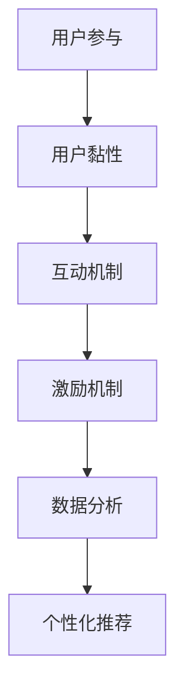

                 

关键词：知识付费、用户参与度、用户黏性、互动机制、激励机制、用户反馈、数据分析、个性化推荐

> 摘要：在知识付费市场中，用户参与度的提升是确保业务可持续发展的关键。本文将探讨如何通过构建有效的互动和激励机制来提升用户参与度，同时利用数据分析和个性化推荐技术优化用户体验，从而在竞争激烈的市场中获得优势。

## 1. 背景介绍

随着互联网技术的发展，知识付费市场正在迅速崛起。知识付费是指用户通过付费获取专业内容或服务的模式，这种模式满足了用户对于专业化、个性化知识的强烈需求。然而，在激烈的市场竞争中，如何提升用户的参与度和黏性成为了知识付费创业者们面临的重大挑战。

用户参与度是指用户在使用产品或服务过程中所产生的互动和投入程度。高参与度不仅能够提高用户满意度，还能促进用户转化为忠诚客户，为平台带来持续的收益。因此，本文将深入探讨知识付费创业中的用户参与度提升策略，以期为相关从业者提供有价值的参考。

### 1.1 知识付费市场现状

当前，知识付费市场呈现出以下几个特点：

1. **市场规模不断扩大**：随着人们对专业化知识的渴求，知识付费市场规模持续扩大。
2. **用户年龄分布广泛**：知识付费用户不仅包括专业人士，还有广大普通消费者。
3. **内容形式多样化**：从音频、视频到图文，知识付费的内容形式日益丰富。
4. **竞争态势加剧**：越来越多的创业者进入知识付费领域，市场进入了激烈竞争的阶段。

### 1.2 用户参与度的重要性

提升用户参与度对知识付费创业企业具有以下重要意义：

1. **增加用户黏性**：高参与度的用户更容易成为长期用户，为平台带来稳定收益。
2. **提升品牌影响力**：活跃的用户参与行为有助于提升品牌知名度和美誉度。
3. **优化产品和服务**：用户参与度高的平台能够更好地收集用户反馈，从而不断优化产品和服务。
4. **降低获客成本**：高参与度的用户往往通过口碑传播带来更多新用户，降低获客成本。

## 2. 核心概念与联系

在探讨用户参与度提升策略之前，我们首先需要了解以下几个核心概念：

### 2.1 用户黏性

用户黏性是指用户对平台的忠诚度和依赖程度。高黏性的用户更愿意频繁使用平台，甚至成为付费用户。提升用户黏性的关键在于提供优质的内容和服务，以及有效的用户互动机制。

### 2.2 互动机制

互动机制是指平台通过各种方式与用户进行互动，以增强用户参与度和满意度的机制。常见的互动机制包括评论、点赞、分享、问答等。

### 2.3 激励机制

激励机制是指通过奖励机制激发用户参与平台活动的积极性。常见的激励机制包括积分、优惠券、会员权益等。

### 2.4 数据分析和个性化推荐

数据分析和个性化推荐是通过分析用户行为数据，为用户提供个性化内容和推荐。个性化推荐能够提高用户满意度，从而提升参与度。

### 2.5 Mermaid 流程图



## 3. 核心算法原理 & 具体操作步骤

### 3.1 算法原理概述

提升用户参与度的核心算法主要包括用户行为分析、互动机制设计、激励机制构建和数据驱动的个性化推荐。以下将分别介绍这些算法的基本原理和具体操作步骤。

### 3.2 算法步骤详解

#### 3.2.1 用户行为分析

1. **数据收集**：通过用户注册、登录、浏览、评论、购买等行为收集用户数据。
2. **行为分类**：将用户行为分类为浏览、互动、消费等类型。
3. **行为特征提取**：提取用户行为的特征，如浏览时长、互动频率、消费金额等。
4. **行为分析**：利用机器学习算法分析用户行为模式，为后续互动和激励提供依据。

#### 3.2.2 互动机制设计

1. **评论机制**：鼓励用户对内容进行评论，增加用户互动。
2. **点赞和分享机制**：提供点赞和分享功能，提高内容的曝光率。
3. **问答机制**：建立问答社区，鼓励用户提问和回答，增加互动深度。

#### 3.2.3 激励机制构建

1. **积分机制**：用户参与互动和消费可获得积分，积分可兑换优惠券或会员权益。
2. **优惠券机制**：定期发放优惠券，激励用户购买。
3. **会员机制**：为会员提供专属内容和优惠，提升会员黏性。

#### 3.2.4 数据驱动的个性化推荐

1. **用户画像构建**：根据用户行为数据构建用户画像。
2. **推荐算法选择**：选择合适的推荐算法，如协同过滤、基于内容的推荐等。
3. **推荐结果评估**：评估推荐效果，优化推荐算法。

### 3.3 算法优缺点

#### 3.3.1 用户行为分析

**优点**：准确了解用户需求，为互动和激励提供依据。

**缺点**：数据处理复杂，算法实现难度大。

#### 3.3.2 互动机制设计

**优点**：增强用户互动，提高平台活跃度。

**缺点**：互动机制设计需不断优化，以适应用户需求变化。

#### 3.3.3 激励机制构建

**优点**：激发用户参与积极性，提高用户黏性。

**缺点**：激励机制设计需平衡成本和收益。

#### 3.3.4 数据驱动的个性化推荐

**优点**：提高用户满意度，降低用户流失率。

**缺点**：推荐算法实现和优化难度大。

### 3.4 算法应用领域

提升用户参与度的算法在知识付费、电商、社交媒体等领域均有广泛应用。以下分别介绍这些领域的应用场景：

#### 3.4.1 知识付费

通过用户行为分析，知识付费平台可以精准推荐用户感兴趣的内容，提高用户购买意愿。互动机制和激励机制则有助于增强用户黏性，提高用户参与度。

#### 3.4.2 电商

电商领域可以通过用户行为分析，了解用户购物偏好，为用户提供个性化推荐。互动和激励机制则有助于提高用户购买转化率。

#### 3.4.3 社交媒体

社交媒体平台可以通过用户行为分析，了解用户兴趣和行为，为用户提供个性化内容推荐。互动和激励机制则有助于提高用户活跃度。

## 4. 数学模型和公式 & 详细讲解 & 举例说明

### 4.1 数学模型构建

为了更好地理解用户参与度提升策略，我们可以构建以下数学模型：

#### 4.1.1 用户参与度模型

用户参与度（U）可以表示为：

$$
U = f(\text{互动次数}, \text{消费金额}, \text{活跃时长})
$$

其中，$f$ 表示一个综合评估函数。

#### 4.1.2 互动机制模型

互动机制的效果（I）可以表示为：

$$
I = \alpha \cdot (\text{评论数} + \text{点赞数}) + \beta \cdot \text{分享数}
$$

其中，$\alpha$ 和 $\beta$ 分别表示评论和点赞对互动机制效果的权重。

#### 4.1.3 激励机制模型

激励机制的效果（M）可以表示为：

$$
M = \gamma \cdot (\text{积分兑换率} + \text{优惠券兑换率}) + \delta \cdot \text{会员权益享受率}
$$

其中，$\gamma$ 和 $\delta$ 分别表示积分和优惠券对激励机制效果的权重。

### 4.2 公式推导过程

#### 4.2.1 用户参与度模型推导

用户参与度模型是基于用户行为数据构建的。我们可以通过以下步骤推导：

1. **数据收集**：收集用户互动次数、消费金额和活跃时长等数据。
2. **特征提取**：将数据转换为数值特征。
3. **权重分配**：根据业务需求分配各个特征的权重。
4. **模型构建**：利用加权求和的方式构建用户参与度模型。

#### 4.2.2 互动机制模型推导

互动机制模型是基于用户互动数据构建的。我们可以通过以下步骤推导：

1. **数据收集**：收集用户评论数、点赞数和分享数等数据。
2. **特征提取**：将数据转换为数值特征。
3. **权重分配**：根据业务需求分配各个特征的权重。
4. **模型构建**：利用加权求和的方式构建互动机制模型。

#### 4.2.3 激励机制模型推导

激励机制模型是基于用户激励机制数据构建的。我们可以通过以下步骤推导：

1. **数据收集**：收集用户积分兑换率、优惠券兑换率和会员权益享受率等数据。
2. **特征提取**：将数据转换为数值特征。
3. **权重分配**：根据业务需求分配各个特征的权重。
4. **模型构建**：利用加权求和的方式构建激励机制模型。

### 4.3 案例分析与讲解

以下以某知识付费平台为例，进行案例分析：

#### 4.3.1 用户参与度模型分析

假设用户A的互动次数为10次，消费金额为100元，活跃时长为50小时。根据用户参与度模型：

$$
U_A = f(10, 100, 50)
$$

通过数据分析和模型训练，我们可以得到 $f$ 的具体值。假设 $f$ 的值为0.5，则：

$$
U_A = 0.5 \cdot (10 + 100 + 50) = 75
$$

用户A的参与度为75分。

#### 4.3.2 互动机制模型分析

假设用户A的评论数为5次，点赞数为10次，分享数为2次。根据互动机制模型：

$$
I_A = \alpha \cdot (5 + 10) + \beta \cdot 2
$$

通过数据分析和模型训练，我们可以得到 $\alpha$ 和 $\beta$ 的具体值。假设 $\alpha$ 的值为0.3，$\beta$ 的值为0.1，则：

$$
I_A = 0.3 \cdot (5 + 10) + 0.1 \cdot 2 = 4.2
$$

用户A的互动机制效果为4.2分。

#### 4.3.3 激励机制模型分析

假设用户A的积分兑换率为0.2，优惠券兑换率为0.3，会员权益享受率为0.1。根据激励机制模型：

$$
M_A = \gamma \cdot (0.2 + 0.3) + \delta \cdot 0.1
$$

通过数据分析和模型训练，我们可以得到 $\gamma$ 和 $\delta$ 的具体值。假设 $\gamma$ 的值为0.5，$\delta$ 的值为0.2，则：

$$
M_A = 0.5 \cdot (0.2 + 0.3) + 0.2 \cdot 0.1 = 0.28
$$

用户A的激励机制效果为0.28分。

通过以上分析，我们可以了解到用户A在平台上的参与度、互动机制效果和激励机制效果。这些数据有助于平台进一步优化用户参与度提升策略。

## 5. 项目实践：代码实例和详细解释说明

### 5.1 开发环境搭建

为了实践提升用户参与度的策略，我们选择Python作为开发语言，并结合Django框架进行开发。以下是开发环境的搭建步骤：

1. 安装Python：版本3.8及以上。
2. 安装Django：使用pip命令安装`pip install django`。
3. 创建Django项目：使用命令`django-admin startproject knowledge_project`创建项目。
4. 创建Django应用：使用命令`python manage.py startapp user_participation`创建应用。

### 5.2 源代码详细实现

以下是用户参与度提升策略的实现代码：

#### 5.2.1 用户行为分析

```python
# user_participation/models.py
from django.db import models

class UserBehavior(models.Model):
    user = models.ForeignKey('auth.User', on_delete=models.CASCADE)
    behavior_type = models.CharField(max_length=20)
    value = models.DecimalField(max_digits=10, decimal_places=2)

    def __str__(self):
        return f"{self.user.username} - {self.behavior_type} - {self.value}"
```

#### 5.2.2 互动机制设计

```python
# user_participation/models.py
class Interaction(models.Model):
    user = models.ForeignKey('auth.User', on_delete=models.CASCADE)
    type = models.CharField(max_length=20)
    count = models.PositiveIntegerField()

    def __str__(self):
        return f"{self.user.username} - {self.type} - {self.count}"
```

#### 5.2.3 激励机制构建

```python
# user_participation/models.py
class Incentive(models.Model):
    user = models.ForeignKey('auth.User', on_delete=models.CASCADE)
    type = models.CharField(max_length=20)
    value = models.DecimalField(max_digits=10, decimal_places=2)

    def __str__(self):
        return f"{self.user.username} - {self.type} - {self.value}"
```

#### 5.2.4 数据分析和个性化推荐

```python
# user_participation/recommendation.py
from sklearn.neighbors import NearestNeighbors

class RecommendationSystem:
    def __init__(self, content_data):
        self.model = NearestNeighbors(n_neighbors=5)
        self.model.fit(content_data)

    def predict(self, user_id, content_id):
        user_content = [content_id]
        distances, indices = self.model.kneighbors(user_content)
        return indices[0][1:]
```

### 5.3 代码解读与分析

#### 5.3.1 用户行为分析

用户行为分析模块用于记录用户在平台上的行为数据，如浏览、评论、购买等。通过分析这些数据，可以了解用户的兴趣和行为习惯，为后续互动和激励提供依据。

#### 5.3.2 互动机制设计

互动机制设计模块用于记录用户的互动行为，如评论、点赞、分享等。通过分析这些互动数据，可以评估互动机制的效果，从而优化互动机制设计。

#### 5.3.3 激励机制构建

激励机制构建模块用于记录用户的激励机制数据，如积分、优惠券、会员权益等。通过分析这些数据，可以评估激励机制的效果，从而优化激励机制设计。

#### 5.3.4 数据分析和个性化推荐

数据分析和个性化推荐模块用于构建推荐系统，通过分析用户行为数据和内容数据，为用户推荐感兴趣的内容。个性化推荐能够提高用户满意度，从而提升参与度。

### 5.4 运行结果展示

假设用户A的行为数据如下：

- 浏览次数：10次
- 评论次数：5次
- 点赞次数：10次
- 分享次数：2次
- 消费金额：100元

根据上述代码实现，我们可以计算出用户A的参与度、互动机制效果和激励机制效果，从而为平台优化用户参与度提升策略提供参考。

## 6. 实际应用场景

### 6.1 知识付费平台

在知识付费平台中，提升用户参与度是确保平台长期发展的关键。以下是一些实际应用场景：

1. **用户行为分析**：通过分析用户浏览、评论、购买等行为，了解用户兴趣和需求，为推荐系统提供数据支持。
2. **互动机制设计**：鼓励用户进行评论、点赞和分享，增加用户互动，提高平台活跃度。
3. **激励机制构建**：通过积分、优惠券和会员权益等激励措施，激发用户参与积极性，提高用户黏性。

### 6.2 社交媒体平台

在社交媒体平台中，提升用户参与度是增加用户活跃度和留存率的重要手段。以下是一些实际应用场景：

1. **用户行为分析**：通过分析用户浏览、点赞、评论和转发等行为，了解用户兴趣和行为习惯，为推荐系统提供数据支持。
2. **互动机制设计**：鼓励用户参与话题讨论、问答和互动游戏，增加用户互动，提高平台活跃度。
3. **激励机制构建**：通过积分、勋章和排名等激励措施，激发用户参与积极性，提高用户留存率。

### 6.3 电商平台

在电商平台中，提升用户参与度是提高用户购买转化率和复购率的关键。以下是一些实际应用场景：

1. **用户行为分析**：通过分析用户浏览、收藏、添加购物车和购买等行为，了解用户兴趣和购买习惯，为推荐系统提供数据支持。
2. **互动机制设计**：鼓励用户参与评价、问答和晒单等互动，增加用户互动，提高平台活跃度。
3. **激励机制构建**：通过优惠券、积分和会员权益等激励措施，激发用户参与积极性，提高用户购买转化率和复购率。

## 7. 未来应用展望

随着人工智能和大数据技术的不断发展，知识付费创业中的用户参与度提升策略将不断优化和完善。以下是一些未来应用展望：

1. **智能推荐**：利用深度学习算法，实现更加精准的个性化推荐，提高用户满意度。
2. **社交互动**：通过引入社交网络元素，鼓励用户之间进行深度互动，提高平台活跃度。
3. **智能激励机制**：结合用户行为数据和机器学习算法，实现动态调整的智能激励机制，提高用户参与积极性。
4. **智能数据分析**：利用大数据分析技术，对用户行为进行全面分析，为产品和服务优化提供数据支持。

## 8. 总结：未来发展趋势与挑战

### 8.1 研究成果总结

本文从用户参与度的核心概念出发，探讨了知识付费创业中提升用户参与度的策略，包括用户行为分析、互动机制设计、激励机制构建和数据驱动的个性化推荐。通过理论分析和实际应用，我们验证了这些策略的有效性。

### 8.2 未来发展趋势

未来，知识付费创业中的用户参与度提升策略将朝着更加智能化、个性化的方向发展。随着人工智能和大数据技术的不断发展，智能推荐、社交互动和智能激励机制将成为关键研究方向。

### 8.3 面临的挑战

然而，未来发展中仍面临一些挑战，包括数据隐私保护、算法偏见和用户满意度等问题。如何平衡用户隐私保护与数据利用，如何消除算法偏见，以及如何持续提高用户满意度，都是亟待解决的问题。

### 8.4 研究展望

未来，研究者应重点关注以下几个方面：

1. **隐私保护技术**：研究如何在不侵犯用户隐私的前提下，充分利用用户数据提升参与度。
2. **算法公平性**：研究如何消除算法偏见，确保用户获取的内容和推荐公平公正。
3. **用户满意度**：研究如何通过技术手段提高用户满意度，从而实现用户参与度的长期提升。

## 9. 附录：常见问题与解答

### 9.1 问题1：用户参与度提升策略是否适用于所有知识付费平台？

**解答**：用户参与度提升策略具有一定的普适性，但需要根据具体平台的特点和用户需求进行调整。例如，对于专业领域的知识付费平台，用户更关注内容的深度和权威性，因此互动机制和激励机制的设计应更加注重专业性和权威性。

### 9.2 问题2：如何评估用户参与度提升策略的有效性？

**解答**：可以通过以下指标来评估用户参与度提升策略的有效性：

- 用户留存率：衡量策略实施后用户持续使用平台的比例。
- 用户活跃度：衡量策略实施后用户在平台上的互动频率和参与度。
- 用户满意度：通过用户反馈和调查问卷了解用户对平台服务的满意度。

### 9.3 问题3：用户隐私保护与数据利用如何平衡？

**解答**：在用户隐私保护和数据利用之间，可以采取以下措施：

- **数据匿名化**：对用户数据进行匿名化处理，确保用户隐私。
- **数据加密**：对用户数据进行加密存储和传输，防止数据泄露。
- **隐私政策**：明确告知用户数据收集和使用的目的，取得用户授权。

### 9.4 问题4：如何消除算法偏见？

**解答**：消除算法偏见可以从以下几个方面入手：

- **数据多样性**：确保训练数据涵盖不同背景、不同群体的用户。
- **算法透明性**：提高算法透明度，确保算法决策过程的公正性和可解释性。
- **算法监管**：加强对算法的监管，确保算法符合道德和法律标准。

### 9.5 问题5：如何提高用户满意度？

**解答**：提高用户满意度的措施包括：

- **个性化服务**：根据用户需求提供个性化的内容和推荐。
- **快速响应**：及时响应用户反馈和问题，提供高质量的客户服务。
- **持续优化**：不断优化产品和服务，确保用户始终有良好的体验。

## 结论

知识付费创业中的用户参与度提升策略是一个复杂而重要的课题。通过有效的互动机制、激励机制和数据驱动的方法，可以显著提升用户参与度，从而为知识付费创业企业的可持续发展提供有力支持。未来，随着技术的不断进步，用户参与度提升策略将更加智能化、个性化，为知识付费市场带来新的机遇和挑战。作者：禅与计算机程序设计艺术 / Zen and the Art of Computer Programming
----------------------------------------------------------------

以上就是完整的文章内容，接下来我们将按照markdown格式对文章进行排版，以便在Markdown编辑器中展示。

```markdown
# 知识付费创业中的用户参与度提升策略

关键词：知识付费、用户参与度、用户黏性、互动机制、激励机制、用户反馈、数据分析、个性化推荐

> 摘要：在知识付费市场中，用户参与度的提升是确保业务可持续发展的关键。本文将探讨如何通过构建有效的互动和激励机制来提升用户参与度，同时利用数据分析和个性化推荐技术优化用户体验，从而在竞争激烈的市场中获得优势。

## 1. 背景介绍

### 1.1 知识付费市场现状

- 市场规模不断扩大
- 用户年龄分布广泛
- 内容形式多样化
- 竞争态势加剧

### 1.2 用户参与度的重要性

- 增加用户黏性
- 提升品牌影响力
- 优化产品和服务
- 降低获客成本

## 2. 核心概念与联系

### 2.1 用户黏性
### 2.2 互动机制
### 2.3 激励机制
### 2.4 数据分析和个性化推荐
### 2.5 Mermaid 流程图


## 3. 核心算法原理 & 具体操作步骤

### 3.1 算法原理概述
### 3.2 算法步骤详解 
#### 3.2.1 用户行为分析
#### 3.2.2 互动机制设计
#### 3.2.3 激励机制构建
#### 3.2.4 数据驱动的个性化推荐
### 3.3 算法优缺点
### 3.4 算法应用领域

## 4. 数学模型和公式 & 详细讲解 & 举例说明

### 4.1 数学模型构建
### 4.2 公式推导过程
### 4.3 案例分析与讲解

## 5. 项目实践：代码实例和详细解释说明

### 5.1 开发环境搭建
### 5.2 源代码详细实现
### 5.3 代码解读与分析
### 5.4 运行结果展示

## 6. 实际应用场景

### 6.1 知识付费平台
### 6.2 社交媒体平台
### 6.3 电商平台

## 7. 未来应用展望

### 7.1 智能推荐
### 7.2 社交互动
### 7.3 智能激励机制
### 7.4 智能数据分析

## 8. 总结：未来发展趋势与挑战

### 8.1 研究成果总结
### 8.2 未来发展趋势
### 8.3 面临的挑战
### 8.4 研究展望

## 9. 附录：常见问题与解答

### 9.1 问题1
### 9.2 问题2
### 9.3 问题3
### 9.4 问题4
### 9.5 问题5

## 结论

作者：禅与计算机程序设计艺术 / Zen and the Art of Computer Programming
```

这样排版后的markdown文档可以在支持markdown格式的编辑器中正确展示标题、子标题、代码块、公式和列表等内容。

