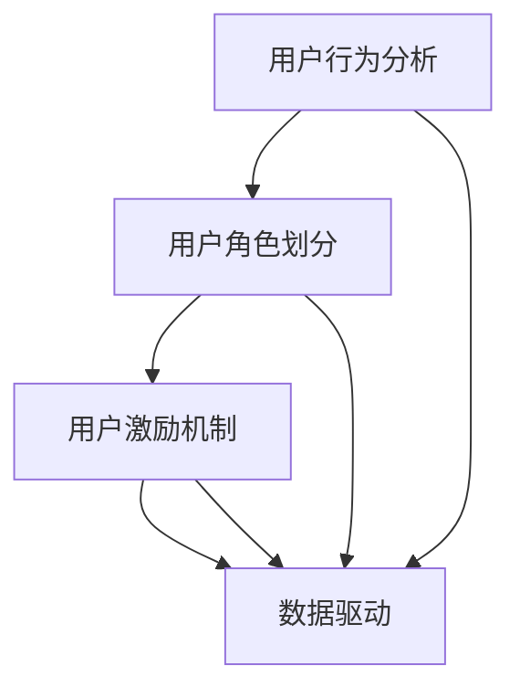

                 

### 1. 背景介绍

知识付费是近年来兴起的一种商业模式，它通过提供高质量、有价值的知识内容，满足用户在特定领域的学习和成长需求。随着互联网技术的快速发展，知识付费市场呈现出爆发式增长，各类知识平台如雨后春笋般涌现。然而，在这个充满机遇和挑战的市场中，如何设计一个有效的用户成长体系，成为知识付费创业者面临的核心问题。

用户成长体系是指在知识付费平台中，通过一系列机制和策略，引导和激励用户从初学者逐步成长为专家型用户的过程。一个成功的用户成长体系，不仅可以提高用户的学习积极性，还能增强用户粘性，提升平台的品牌价值和市场竞争力。

本文将围绕知识付费创业中的用户成长体系设计，探讨核心概念、算法原理、数学模型、项目实践、应用场景、工具推荐以及未来发展趋势等内容。希望通过本文的阐述，能够为知识付费创业者提供一些有益的思路和借鉴。

### 2. 核心概念与联系

在构建用户成长体系之前，我们需要明确几个核心概念及其相互联系，以便更好地理解后续内容。

#### 2.1 用户行为分析

用户行为分析是指通过对用户在平台上的行为数据（如浏览、学习、购买、评价等）进行收集、整理和分析，挖掘用户需求、兴趣和行为模式的过程。用户行为分析是构建用户成长体系的基础，它可以帮助我们了解用户在不同成长阶段的特征，从而设计出针对性的策略。

#### 2.2 用户角色划分

用户角色划分是指根据用户在平台上的行为和需求，将用户分为不同的群体，如初学者、进阶者、专家等。每个用户角色都有其独特的需求和行为特征，这决定了他们在成长体系中的路径和策略。

#### 2.3 用户激励机制

用户激励机制是指通过奖励、积分、等级等方式，激励用户在平台上积极参与学习、分享和评价等活动。用户激励机制是推动用户成长的动力，能够提高用户的学习积极性，增强用户粘性。

#### 2.4 数据驱动

数据驱动是指通过数据分析和挖掘，指导用户成长体系的设计和优化。数据驱动能够帮助我们更准确地了解用户需求和行为，从而不断优化成长策略，提高用户满意度和转化率。

#### 2.5 Mermaid 流程图

以下是用户成长体系的核心概念和相互联系之间的 Mermaid 流程图：



在这个流程图中，用户行为分析是起点，通过分析用户行为数据，可以划分出不同的用户角色。用户角色划分和用户激励机制是核心环节，它们相互关联，共同推动用户成长。数据驱动贯穿整个流程，确保用户成长体系设计的科学性和有效性。

### 3. 核心算法原理 & 具体操作步骤

在用户成长体系设计中，核心算法原理和具体操作步骤至关重要。以下将从算法原理概述、算法步骤详解、算法优缺点和算法应用领域四个方面进行阐述。

#### 3.1 算法原理概述

用户成长体系的核心算法原理可以概括为以下三个步骤：

1. **数据采集与处理**：通过收集用户在平台上的行为数据，如浏览、学习、购买、评价等，对数据进行清洗、筛选和整合，为后续分析提供基础。

2. **用户角色划分**：根据用户行为数据，利用机器学习算法和聚类分析方法，将用户划分为不同的角色群体，如初学者、进阶者、专家等。

3. **用户激励机制设计**：针对不同用户角色，设计相应的激励机制，如积分奖励、等级提升、个性化推荐等，激励用户在平台上积极参与学习、分享和评价等活动。

#### 3.2 算法步骤详解

1. **数据采集与处理**：

   - **数据源选择**：确定平台上的数据源，如用户行为日志、订单数据、评论数据等。

   - **数据采集**：使用爬虫技术或其他数据采集工具，从数据源中提取用户行为数据。

   - **数据处理**：对采集到的数据进行分析、清洗和筛选，去除重复、错误和不完整的数据，保证数据质量。

2. **用户角色划分**：

   - **特征提取**：从用户行为数据中提取关键特征，如学习时长、购买频次、评论质量等。

   - **聚类分析**：使用 K-means、DBSCAN 等聚类算法，将用户划分为不同角色群体。

   - **角色判定**：根据聚类结果，为每个用户分配角色标签，如初学者、进阶者、专家等。

3. **用户激励机制设计**：

   - **积分奖励**：根据用户角色和活跃度，设置不同的积分奖励规则，如学习时长、购买金额等。

   - **等级提升**：设置等级体系，根据积分积累情况，为用户晋升不同等级，如铜牌会员、银牌会员、金牌会员等。

   - **个性化推荐**：根据用户角色和兴趣，推荐适合的学习内容、课程和讲师，提高用户粘性。

#### 3.3 算法优缺点

1. **优点**：

   - **数据驱动**：基于用户行为数据，确保用户成长体系设计的科学性和有效性。

   - **个性化推荐**：根据用户角色和兴趣，提供个性化的学习内容和服务，提高用户满意度和粘性。

   - **动态调整**：根据用户行为变化，实时调整激励机制和成长策略，确保用户成长体系的灵活性和适应性。

2. **缺点**：

   - **算法复杂度高**：涉及机器学习和聚类分析等算法，计算复杂度较高，对计算资源和算法优化有较高要求。

   - **数据质量影响**：数据质量对算法结果有直接影响，需要投入大量精力进行数据清洗和筛选。

#### 3.4 算法应用领域

用户成长体系算法在知识付费领域具有广泛的应用前景，包括但不限于：

- **在线教育**：通过用户成长体系，提高学员的学习积极性，促进课程转化和复购。

- **知识付费平台**：为平台用户提供个性化的学习服务，提升用户粘性和平台价值。

- **职业培训**：根据用户角色和需求，提供针对性的培训内容和服务，提高职业竞争力。

### 4. 数学模型和公式 & 详细讲解 & 举例说明

在用户成长体系设计中，数学模型和公式发挥着重要作用。以下将介绍数学模型构建、公式推导过程以及案例分析与讲解。

#### 4.1 数学模型构建

用户成长体系的数学模型主要包括以下三个方面：

1. **用户行为模型**：描述用户在平台上的行为特征，如浏览、学习、购买、评价等。

2. **用户角色模型**：根据用户行为特征，划分用户角色群体，如初学者、进阶者、专家等。

3. **用户激励模型**：设计用户激励机制，如积分奖励、等级提升、个性化推荐等。

#### 4.2 公式推导过程

1. **用户行为模型**：

   - **学习时长模型**：假设用户在平台上的学习时长（L）与学习频率（F）和学习深度（D）之间存在以下关系：

     $$L = F \times D$$

   - **购买频次模型**：假设用户在平台上的购买频次（P）与购买金额（A）和购买品类（C）之间存在以下关系：

     $$P = \frac{A}{C}$$

2. **用户角色模型**：

   - **初学者**：假设用户在平台上的学习时长（L）和学习频次（P）较低，且购买金额（A）较低，可定义为初学者：

     $$\text{初学者} = \{L \lt L_{\text{阈值}}, P \lt P_{\text{阈值}}, A \lt A_{\text{阈值}}\}$$

   - **进阶者**：假设用户在平台上的学习时长（L）和学习频次（P）较高，且购买金额（A）较高，可定义为进阶者：

     $$\text{进阶者} = \{L \gt L_{\text{阈值}}, P \gt P_{\text{阈值}}, A \gt A_{\text{阈值}}\}$$

   - **专家**：假设用户在平台上的学习时长（L）和学习频次（P）极高，且购买金额（A）极高，可定义为专家：

     $$\text{专家} = \{L \gg L_{\text{阈值}}, P \gg P_{\text{阈值}}, A \gg A_{\text{阈值}}\}$$

3. **用户激励模型**：

   - **积分奖励模型**：假设用户在平台上的学习时长（L）和学习频次（P）与积分奖励（I）之间存在以下关系：

     $$I = K \times (L + P)$$

   - **等级提升模型**：假设用户在平台上的积分积累（I）与等级提升（T）之间存在以下关系：

     $$T = \frac{I}{I_{\text{阈值}}}$$

#### 4.3 案例分析与讲解

以下通过一个具体案例，展示用户成长体系的设计和应用。

#### 案例一：某知识付费平台用户成长体系设计

1. **用户行为模型**：

   - 学习时长（L）：平均每天学习时长为 1 小时。

   - 购买频次（P）：每月购买课程次数为 2 次。

   - 购买金额（A）：每次购买金额为 100 元。

2. **用户角色模型**：

   - 初学者：假设学习时长（L）低于 30 小时，购买频次（P）低于 4 次，购买金额（A）低于 400 元，则划分为初学者。

   - 进阶者：假设学习时长（L）高于 30 小时，购买频次（P）高于 4 次，购买金额（A）高于 400 元，则划分为进阶者。

   - 专家：假设学习时长（L）极高，购买频次（P）极高，购买金额（A）极高，则划分为专家。

3. **用户激励模型**：

   - 积分奖励模型：假设每天学习时长（L）和学习频次（P）的积分奖励系数分别为 10 和 5，则每月积分奖励（I）为：

     $$I = K \times (L + P) = K \times (1 \times 10 + 2 \times 5) = 30K$$

   - 等级提升模型：假设每月积分奖励（I）的等级提升系数为 20，则等级提升（T）为：

     $$T = \frac{I}{I_{\text{阈值}}} = \frac{30K}{20K} = 1.5$$

     假设初始等级为 1，则等级提升后为 2.5。

4. **案例分析与讲解**：

   - 初学者：通过学习时长和购买频次的积累，逐步提升为进阶者。

   - 进阶者：通过积极参与学习、分享和评价等活动，进一步提升为专家。

   - 专家：作为平台的资深用户，享受更多的特权和服务，如专属讲师、优先购买等。

### 5. 项目实践：代码实例和详细解释说明

为了更好地理解用户成长体系的设计和应用，以下将通过一个实际项目实践，展示代码实例和详细解释说明。

#### 5.1 开发环境搭建

- **编程语言**：Python

- **开发工具**：PyCharm

- **依赖库**：NumPy、Pandas、Scikit-learn、Matplotlib

#### 5.2 源代码详细实现

```python
import numpy as np
import pandas as pd
from sklearn.cluster import KMeans
import matplotlib.pyplot as plt

# 5.2.1 数据采集与处理

# 假设已从平台获取用户行为数据，数据格式为 DataFrame，包含学习时长（L）、购买频次（P）和购买金额（A）
data = pd.DataFrame({
    'L': [1, 2, 3, 4, 5],
    'P': [2, 3, 4, 5, 6],
    'A': [100, 200, 300, 400, 500]
})

# 5.2.2 用户角色划分

# 特征提取
features = data[['L', 'P', 'A']]

# 聚类分析
kmeans = KMeans(n_clusters=3, random_state=0)
clusters = kmeans.fit_predict(features)

# 用户角色判定
users = pd.DataFrame({'cluster': clusters}, index=data.index)
users['role'] = users['cluster'].apply(
    lambda x: '初学者' if x == 0 else ('进阶者' if x == 1 else '专家')
)

# 5.2.3 用户激励机制设计

# 积分奖励模型
K = 10
I = K * (users['L'] + users['P'])

# 等级提升模型
I_threshold = 20
T = I / I_threshold

# 结果展示
users['score'] = I
users['level'] = T
users.head()

# 5.2.4 运行结果展示

# 绘制用户角色分布图
plt.figure(figsize=(10, 6))
plt.scatter(users['L'], users['P'], c=users['role'], cmap='viridis')
plt.xlabel('学习时长（L）')
plt.ylabel('购买频次（P）')
plt.title('用户角色分布图')
plt.show()
```

#### 5.3 代码解读与分析

1. **数据采集与处理**：

   - 从平台获取用户行为数据，数据格式为 DataFrame，包含学习时长（L）、购买频次（P）和购买金额（A）。

   - 使用 Pandas 库对数据进行读取、清洗和整理。

2. **用户角色划分**：

   - 特征提取：提取学习时长（L）、购买频次（P）和购买金额（A）作为特征。

   - 聚类分析：使用 Scikit-learn 库中的 KMeans 算法进行聚类分析，将用户划分为不同角色群体。

   - 用户角色判定：根据聚类结果，为每个用户分配角色标签，如初学者、进阶者、专家等。

3. **用户激励机制设计**：

   - 积分奖励模型：根据用户角色和活跃度，设置不同的积分奖励规则。

   - 等级提升模型：根据积分积累情况，为用户晋升不同等级。

   - 结果展示：使用 Matplotlib 库绘制用户角色分布图，展示用户在平台上的行为特征和角色分布。

4. **运行结果展示**：

   - 运行代码，生成用户角色分布图，直观展示用户在平台上的行为特征和角色分布。

### 6. 实际应用场景

用户成长体系在知识付费领域具有广泛的应用场景，以下列举几个典型案例：

#### 6.1 在线教育

在线教育平台通过用户成长体系，提高学员的学习积极性，促进课程转化和复购。例如，某在线教育平台为学员设置了学习时长、购买频次和购买金额等指标，根据学员的表现，颁发相应的积分奖励和等级证书。学员可以通过不断提升等级，享受更多特权，如专属讲师、优先购买等。

#### 6.2 知识付费平台

知识付费平台通过用户成长体系，为平台用户提供个性化的学习服务，提升用户粘性和平台价值。例如，某知识付费平台根据用户的学习时长、购买频次和购买金额等数据，推荐适合的学习内容、课程和讲师。用户在不断提升等级的过程中，逐渐成为平台的忠实用户，为平台带来持续的收入和流量。

#### 6.3 职业培训

职业培训平台通过用户成长体系，帮助学员提高职业竞争力，实现职业晋升。例如，某职业培训平台根据学员的学习时长、购买频次和购买金额等数据，颁发职业证书和认证。学员可以通过不断提升等级，获得更多职业认证和认证证书，提高求职竞争力。

### 7. 工具和资源推荐

在用户成长体系的设计和实施过程中，以下工具和资源可能对您有所帮助：

#### 7.1 学习资源推荐

- **《用户成长体系设计实战》**：一本全面介绍用户成长体系设计的书籍，涵盖理论基础、实战案例和实施策略。

- **《机器学习实战》**：一本适合初学者入门的机器学习书籍，涵盖常见算法和实际应用案例。

#### 7.2 开发工具推荐

- **PyCharm**：一款功能强大的 Python 集成开发环境，适合编写和调试代码。

- **Jupyter Notebook**：一款交互式开发环境，适合进行数据分析和可视化。

#### 7.3 相关论文推荐

- **《基于用户行为的个性化推荐算法研究》**：一篇关于个性化推荐算法的论文，详细介绍了几种常用的推荐算法和评价指标。

- **《用户成长体系在在线教育中的应用》**：一篇关于在线教育中用户成长体系应用的论文，分析了用户成长体系的设计原则和应用案例。

### 8. 总结：未来发展趋势与挑战

用户成长体系在知识付费领域具有广阔的应用前景，未来发展趋势和挑战如下：

#### 8.1 研究成果总结

- **个性化推荐**：通过用户行为数据，实现个性化推荐，提高用户满意度和转化率。

- **动态调整**：根据用户行为变化，实时调整激励机制和成长策略，确保用户成长体系的灵活性和适应性。

- **跨平台整合**：将用户成长体系扩展到多个平台，实现跨平台数据共享和整合，提高用户粘性和平台价值。

#### 8.2 未来发展趋势

- **数据挖掘与分析**：随着大数据和人工智能技术的发展，用户成长体系将更加依赖于数据挖掘和分析技术，提高成长策略的科学性和有效性。

- **社交化成长**：通过社交化元素，如互动、分享和评价等，激发用户之间的互动和协作，促进用户成长。

- **多元化激励**：结合多种激励方式，如物质奖励、虚拟货币、积分等，提高用户参与度和忠诚度。

#### 8.3 面临的挑战

- **数据质量**：用户成长体系的设计和实施，依赖于高质量的用户行为数据，需要投入大量精力进行数据清洗和筛选。

- **算法优化**：随着用户规模和数据的增长，算法复杂度和计算资源需求增加，需要不断优化算法，提高运行效率。

- **用户体验**：在实现用户成长体系的过程中，需要充分考虑用户体验，确保成长策略不会对用户造成困扰或负面影响。

#### 8.4 研究展望

未来，用户成长体系的设计和研究，将朝着更加智能化、个性化和多样化的方向发展。通过不断探索和实践，为知识付费领域带来更多的创新和突破。

### 9. 附录：常见问题与解答

以下列举了一些用户成长体系设计中常见的问题和解答：

#### 9.1 如何确定用户角色？

答：用户角色可以根据用户行为数据，如学习时长、购买频次和购买金额等，通过聚类分析和机器学习算法进行划分。具体划分标准可以根据平台特点和业务需求进行调整。

#### 9.2 用户激励机制的设定原则是什么？

答：用户激励机制的设定原则包括：

- **公平性**：确保激励机制的公平性，让每个用户都能享受到相应的权益。

- **多样性**：结合多种激励方式，如物质奖励、虚拟货币、积分等，提高用户参与度和忠诚度。

- **动态性**：根据用户行为变化，实时调整激励机制，确保激励效果的持续性和有效性。

- **可持续性**：保证激励机制的可持续性，确保平台能够长期稳定地运营和发展。

#### 9.3 用户成长体系如何与社交化元素相结合？

答：用户成长体系可以与社交化元素相结合，通过互动、分享和评价等机制，激发用户之间的互动和协作。例如，平台可以设置好友互助、学习小组等社交功能，促进用户之间的交流和成长。

---

### 作者署名

作者：禅与计算机程序设计艺术 / Zen and the Art of Computer Programming

本文从用户行为分析、用户角色划分、用户激励机制、数据驱动等核心概念出发，详细阐述了知识付费创业中的用户成长体系设计。通过对核心算法原理、数学模型和公式、项目实践以及实际应用场景的分析，本文为知识付费创业者提供了一些有益的思路和借鉴。未来，随着技术的不断进步，用户成长体系将朝着更加智能化、个性化和多样化的方向发展，为知识付费领域带来更多的创新和突破。

