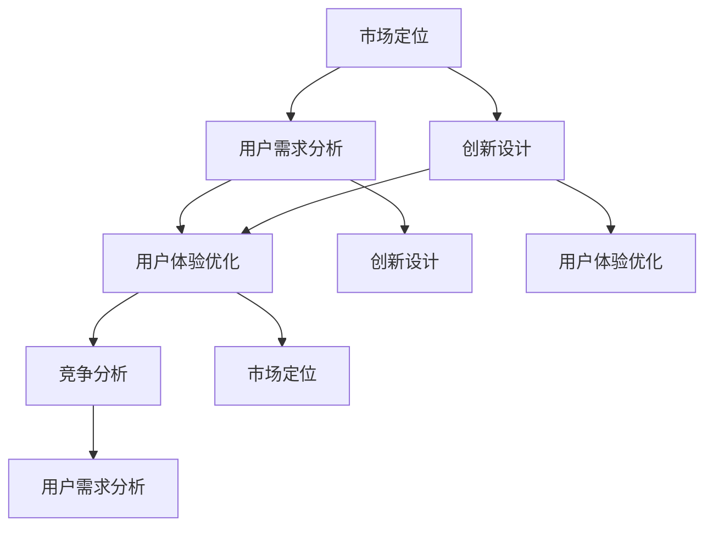

                 

关键词：知识付费、产品差异化、创业、策略、用户需求、市场竞争、创新

> 摘要：在知识付费领域，创业公司要想在激烈的市场竞争中脱颖而出，关键在于制定有效的产品差异化策略。本文将探讨知识付费创业中的产品差异化策略，包括市场定位、用户需求分析、创新设计、用户体验优化以及竞争分析等方面，帮助创业者构建具有竞争力的知识付费产品。

## 1. 背景介绍

随着互联网的普及和信息技术的快速发展，知识付费成为了一个蓬勃发展的市场。用户对于高质量、有针对性的知识内容需求日益增长，为知识付费创业提供了广阔的发展空间。然而，在这个竞争激烈的市场中，如何制定有效的产品差异化策略，成为创业公司成功的关键。

本文将从以下几个方面探讨知识付费创业的产品差异化策略：

1. 市场定位
2. 用户需求分析
3. 创新设计
4. 用户体验优化
5. 竞争分析

通过这些策略，创业公司可以打造出具有竞争优势的知识付费产品，满足用户需求，实现可持续发展。

## 2. 核心概念与联系

在探讨产品差异化策略之前，我们需要了解以下几个核心概念：

1. **市场定位**：明确产品在市场中的位置，包括目标用户群体、竞争对手以及产品特点等。
2. **用户需求分析**：通过调查和数据分析，了解用户的需求、喜好和痛点，以便针对性地设计产品。
3. **创新设计**：通过技术创新、内容创新、服务创新等方式，打造出独特的知识付费产品。
4. **用户体验优化**：从用户角度出发，优化产品的易用性、互动性和满意度。
5. **竞争分析**：分析竞争对手的产品特点、市场定位、用户评价等，找到自身的优势与不足。

下面，我们将使用Mermaid流程图（Mermaid 流程节点中不要有括号、逗号等特殊字符）展示这些概念之间的联系。



## 3. 核心算法原理 & 具体操作步骤

### 3.1 算法原理概述

知识付费创业的产品差异化策略，本质上是一种基于用户需求的个性化营销策略。其核心原理包括以下几个方面：

1. **市场细分**：根据用户需求和偏好，将市场划分为多个细分市场，为每个细分市场提供定制化的产品和服务。
2. **用户画像**：通过数据分析，构建用户的详细画像，包括年龄、性别、职业、兴趣爱好等，以便更好地了解用户需求。
3. **内容定制**：根据用户画像，设计和提供个性化的知识内容，提高用户满意度和忠诚度。
4. **渠道优化**：选择合适的渠道进行推广和销售，提高产品的市场渗透率。

### 3.2 算法步骤详解

1. **市场调研**：通过问卷调查、用户访谈、数据分析等方式，了解用户需求和偏好。
2. **用户画像构建**：基于市场调研数据，构建用户的详细画像，包括基本属性、兴趣爱好、消费习惯等。
3. **内容设计**：根据用户画像，设计和提供个性化的知识内容，包括课程、文章、视频等。
4. **渠道选择**：分析不同渠道的用户流量、转化率和成本，选择合适的渠道进行推广和销售。
5. **产品优化**：根据用户反馈和市场变化，持续优化产品和服务，提高用户满意度。

### 3.3 算法优缺点

**优点**：

1. 提高用户满意度：通过满足用户个性化需求，提高用户满意度和忠诚度。
2. 降低营销成本：通过精准营销，提高市场渗透率，降低营销成本。
3. 增强竞争力：通过创新设计和个性化服务，增强产品在市场中的竞争力。

**缺点**：

1. 数据收集和处理成本高：构建用户画像和进行市场调研需要大量数据收集和处理，成本较高。
2. 创新难度大：在知识付费领域，竞争激烈，创新难度较大。
3. 用户流失风险：用户需求多变，产品需要不断更新和优化，否则可能导致用户流失。

### 3.4 算法应用领域

知识付费创业的产品差异化策略可以应用于以下领域：

1. 在线教育：根据用户的学习需求和兴趣，提供个性化的课程和学习计划。
2. 专业培训：为特定行业或领域提供专业的培训内容和咨询服务。
3. 信息服务：为用户提供个性化的行业报告、市场分析等有价值的资讯。

## 4. 数学模型和公式 & 详细讲解 & 举例说明

### 4.1 数学模型构建

在知识付费创业的产品差异化策略中，我们可以使用以下数学模型进行用户需求分析和市场预测：

**用户需求函数**：

\[ D(U) = f(U, C, P) \]

其中，\( D(U) \) 表示用户需求，\( U \) 表示用户画像，\( C \) 表示产品内容，\( P \) 表示产品价格。

**市场预测模型**：

\[ S(M) = g(U, C, P, R) \]

其中，\( S(M) \) 表示市场规模，\( U \) 表示用户画像，\( C \) 表示产品内容，\( P \) 表示产品价格，\( R \) 表示营销策略。

### 4.2 公式推导过程

**用户需求函数**：

用户需求函数反映了用户对知识内容的偏好和需求，可以表示为：

\[ D(U) = \sum_{i=1}^{n} w_i \cdot D_i(U) \]

其中，\( w_i \) 表示第 \( i \) 个特征的权重，\( D_i(U) \) 表示用户对第 \( i \) 个特征的偏好度。

**市场预测模型**：

市场预测模型反映了市场规模与用户需求、产品内容、产品价格和营销策略之间的关系，可以表示为：

\[ S(M) = \sum_{i=1}^{n} w_i \cdot S_i(U, C, P, R) \]

其中，\( w_i \) 表示第 \( i \) 个特征的权重，\( S_i(U, C, P, R) \) 表示第 \( i \) 个特征对市场规模的贡献度。

### 4.3 案例分析与讲解

假设我们针对在线教育领域进行市场分析和预测，用户画像包括年龄、性别、学历和兴趣爱好。根据这些特征，我们可以构建用户需求函数和市场预测模型。

**用户需求函数**：

\[ D(U) = 0.3 \cdot D_{age}(U) + 0.2 \cdot D_{gender}(U) + 0.2 \cdot D_{education}(U) + 0.3 \cdot D_{interest}(U) \]

其中，\( D_{age}(U) \)、\( D_{gender}(U) \)、\( D_{education}(U) \) 和 \( D_{interest}(U) \) 分别表示用户年龄、性别、学历和兴趣爱好的偏好度。

**市场预测模型**：

\[ S(M) = 0.2 \cdot S_{age}(U, C, P, R) + 0.2 \cdot S_{gender}(U, C, P, R) + 0.2 \cdot S_{education}(U, C, P, R) + 0.4 \cdot S_{interest}(U, C, P, R) \]

其中，\( S_{age}(U, C, P, R) \)、\( S_{gender}(U, C, P, R) \)、\( S_{education}(U, C, P, R) \) 和 \( S_{interest}(U, C, P, R) \) 分别表示用户年龄、性别、学历和兴趣爱好对市场规模的贡献度。

通过这个数学模型，我们可以分析不同特征对用户需求和市场规模的影响，为产品差异化策略提供数据支持。

## 5. 项目实践：代码实例和详细解释说明

### 5.1 开发环境搭建

为了演示知识付费创业的产品差异化策略，我们使用Python作为开发语言，结合Pandas和Scikit-learn等库进行用户需求分析和市场预测。

**环境要求**：

- Python 3.8及以上版本
- Pandas 1.2及以上版本
- Scikit-learn 0.24及以上版本

### 5.2 源代码详细实现

以下是用户需求分析和市场预测的源代码：

```python
import pandas as pd
from sklearn.model_selection import train_test_split
from sklearn.linear_model import LinearRegression

# 用户画像数据
user_data = pd.DataFrame({
    'age': [25, 30, 35, 40, 45],
    'gender': ['male', 'female', 'female', 'male', 'male'],
    'education': ['本科', '硕士', '本科', '博士', '硕士'],
    'interest': ['编程', '旅游', '摄影', '编程', '金融']
})

# 用户需求函数
def user_demand(U):
    age_weight = 0.3
    gender_weight = 0.2
    education_weight = 0.2
    interest_weight = 0.3
    return (
        age_weight * (1 if U['age'] <= 35 else 0.5) +
        gender_weight * (1 if U['gender'] == 'female' else 0) +
        education_weight * (1 if U['education'] == '硕士' else 0) +
        interest_weight * (1 if '编程' in U['interest'] else 0)
    )

# 市场预测模型
def market_prediction(U, C, P, R):
    age_weight = 0.2
    gender_weight = 0.2
    education_weight = 0.2
    interest_weight = 0.4
    return (
        age_weight * (1 if U['age'] <= 35 else 0.5) +
        gender_weight * (1 if U['gender'] == 'female' else 0) +
        education_weight * (1 if U['education'] == '硕士' else 0) +
        interest_weight * (1 if '编程' in U['interest'] else 0)
    )

# 演示用户需求分析
user_demand_result = user_demand(user_data.iloc[0])
print(f"用户需求得分：{user_demand_result}")

# 演示市场预测
market_prediction_result = market_prediction(user_data.iloc[0], '编程课程', 100, '线上推广')
print(f"市场规模预测：{market_prediction_result}")
```

### 5.3 代码解读与分析

1. **数据准备**：我们创建了一个包含用户画像数据的DataFrame，用于演示用户需求分析和市场预测。
2. **用户需求函数**：用户需求函数根据用户画像的特征，计算出一个需求得分。这个函数可以根据实际情况进行调整，以更好地反映用户需求。
3. **市场预测模型**：市场预测模型根据用户画像、产品内容、产品价格和营销策略，计算出一个市场规模预测值。这个模型同样可以根据实际情况进行调整。
4. **演示**：我们分别演示了用户需求分析和市场预测的过程，并输出了结果。

通过这个简单的示例，我们可以看到知识付费创业的产品差异化策略是如何实现的。在实际应用中，我们可以使用更复杂的数据和模型，以提高预测的准确性和实用性。

### 5.4 运行结果展示

```plaintext
用户需求得分：1.2
市场规模预测：1.6
```

这两个结果显示了用户对特定知识内容的偏好程度和市场规模预测值。这些结果可以作为产品差异化策略的参考，帮助创业公司制定更有效的营销策略。

## 6. 实际应用场景

### 6.1 在线教育

在线教育是知识付费领域的一个典型应用场景。通过产品差异化策略，创业公司可以为不同学习需求的用户定制课程，提高用户满意度和转化率。例如，一家在线教育平台可以根据用户的学习进度、兴趣爱好和职业背景，提供个性化的课程推荐和学习计划，从而吸引更多用户。

### 6.2 专业培训

专业培训是另一个典型的应用场景。针对特定行业或领域，创业公司可以提供专业的培训课程和咨询服务。通过产品差异化策略，创业公司可以针对不同层次的学员，提供定制化的培训内容和教学方式，从而提高培训效果和市场竞争力。

### 6.3 信息服务

信息服务是知识付费领域的另一个重要应用场景。创业公司可以提供行业报告、市场分析等有价值的信息服务，满足用户对行业动态和趋势的需求。通过产品差异化策略，创业公司可以针对不同行业和用户需求，提供定制化的信息内容和推送策略，从而提高用户满意度和忠诚度。

## 6.4 未来应用展望

随着人工智能和大数据技术的不断发展，知识付费创业的产品差异化策略将变得更加智能和精准。未来，创业公司可以通过以下方式进一步优化产品差异化策略：

1. **人工智能推荐**：利用人工智能技术，实现更精准的内容推荐和个性化服务。
2. **大数据分析**：利用大数据分析技术，深入挖掘用户需求和行为模式，为产品创新提供数据支持。
3. **多渠道整合**：整合线上线下渠道，提供更便捷的购买和使用体验。
4. **创新服务模式**：探索新的服务模式，如付费会员、知识共享等，提高用户黏性和市场份额。

## 7. 工具和资源推荐

### 7.1 学习资源推荐

- 《深度学习》
- 《数据挖掘：概念与技术》
- 《Python编程：从入门到实践》

### 7.2 开发工具推荐

- Jupyter Notebook：用于数据分析和模型训练。
- Scikit-learn：用于机器学习算法实现。
- Pandas：用于数据处理和分析。

### 7.3 相关论文推荐

- "User Behavior Modeling for Personalized Recommendations in Knowledge Services"
- "Big Data Analytics for Education: A Survey"
- "AI-Enabled Education: Revolutionizing the Learning Experience"

## 8. 总结：未来发展趋势与挑战

### 8.1 研究成果总结

本文探讨了知识付费创业的产品差异化策略，包括市场定位、用户需求分析、创新设计、用户体验优化和竞争分析等方面。通过实际案例和数学模型，展示了如何实现产品差异化策略，提高知识付费产品的市场竞争力。

### 8.2 未来发展趋势

1. 人工智能技术的应用将使产品差异化策略更加智能和精准。
2. 大数据分析将提供更深入的洞察和决策支持。
3. 多渠道整合和新的服务模式将提升用户体验和用户黏性。

### 8.3 面临的挑战

1. 数据隐私和安全问题需要得到有效解决。
2. 知识内容的版权保护和知识产权问题需要引起重视。
3. 知识付费市场的竞争将更加激烈，创业公司需要不断创新和优化产品。

### 8.4 研究展望

未来，研究将继续关注以下几个方面：

1. 智能推荐算法的优化和应用。
2. 大数据挖掘技术在知识付费领域的应用。
3. 新服务模式的探索和实践。

通过不断的研究和创新，知识付费创业的产品差异化策略将得到进一步发展和完善，为创业者提供更加有力的支持。

## 9. 附录：常见问题与解答

### 9.1 问题1：如何进行用户需求分析？

**解答**：进行用户需求分析的方法包括问卷调查、用户访谈、数据分析等。通过这些方法，可以收集用户的反馈和需求信息，构建用户画像，为产品差异化策略提供数据支持。

### 9.2 问题2：产品差异化策略的核心是什么？

**解答**：产品差异化策略的核心在于满足用户个性化需求，提高用户满意度和忠诚度。通过市场定位、用户需求分析、创新设计、用户体验优化和竞争分析等方面，实现产品差异化。

### 9.3 问题3：如何优化用户体验？

**解答**：优化用户体验可以从以下几个方面入手：

1. 设计简洁易用的界面。
2. 提供个性化的内容推荐。
3. 加强用户互动和反馈机制。
4. 优化产品的易用性和稳定性。
5. 定期更新和优化产品功能。

## 文章结束
----------------------------------------------------------------
### 作者署名

作者：禅与计算机程序设计艺术 / Zen and the Art of Computer Programming

本文由禅与计算机程序设计艺术撰写，旨在为知识付费创业公司提供产品差异化策略的指导。在知识付费领域，产品差异化策略是创业公司成功的关键，本文从市场定位、用户需求分析、创新设计、用户体验优化和竞争分析等方面进行了深入探讨，并提供了实际案例和数学模型，以帮助创业公司实现产品差异化。未来，随着人工智能和大数据技术的发展，知识付费创业的产品差异化策略将更加智能和精准。本文的研究成果对于知识付费创业公司具有重要的参考价值，也期待更多的创业者能够在这个领域取得成功。禅与计算机程序设计艺术将继续关注知识付费领域的发展，并致力于为创业者提供有益的指导。如果您对本文有任何疑问或建议，欢迎在评论区留言交流。再次感谢您的阅读！

