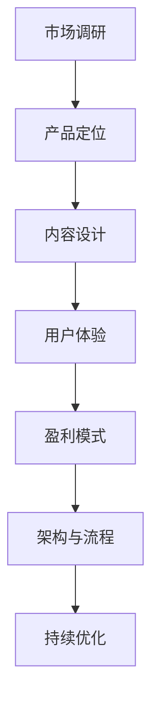

                 

在当今知识经济的浪潮中，知识付费已经成为一种主流的商业模式。随着在线教育和内容共享平台的兴起，构建一个有效且盈利的知识付费产品矩阵成为众多创业者关注的焦点。本文将探讨知识付费创业中产品矩阵构建的核心策略、关键技术和实际案例，旨在为创业者提供一套实用的指南。

## 关键词

- 知识付费
- 产品矩阵
- 创业策略
- 在线教育
- 内容共享

## 摘要

本文将从多个角度分析知识付费创业的产品矩阵构建，包括市场调研、产品定位、内容设计、技术实现、用户体验和盈利模式等关键环节。通过实际案例和数据分析，帮助创业者理解和掌握构建成功知识付费产品矩阵的方法和技巧。

## 1. 背景介绍

知识付费，即用户为获取特定知识或技能而付费的行为，其背后是信息不对称和市场需求的驱动。随着互联网技术的发展，特别是移动互联网的普及，知识付费市场迅速扩张。各类知识付费平台如雨后春笋般涌现，涵盖了从职业技能培训、语言学习到兴趣爱好等多个领域。

### 市场规模

据某知名市场调研机构的报告，2020年全球知识付费市场规模已经超过500亿美元，预计到2025年将达到1500亿美元。这一增长趋势表明，知识付费作为一种新兴的商业模式，具有巨大的市场潜力。

### 用户需求

用户对知识付费的需求主要来源于以下几个方面：

1. **职业发展**：职场竞争加剧，用户希望通过付费课程提升职业技能和职场竞争力。
2. **个人兴趣**：随着生活水平的提高，用户对提升个人兴趣和实现自我价值的追求愈发强烈。
3. **学习习惯**：互联网时代，用户更倾向于在线学习，知识付费满足了他们随时随地的学习需求。

### 行业趋势

1. **内容多样化**：知识付费内容越来越丰富，不仅涵盖传统的教育课程，还涉及短视频、直播等多种形式。
2. **个性化推荐**：大数据和人工智能技术的应用，使得个性化推荐成为可能，提高了用户体验和转化率。
3. **平台化竞争**：知识付费平台之间的竞争加剧，平台生态的建设和用户运营成为关键。

## 2. 核心概念与联系

在构建知识付费产品矩阵时，理解以下几个核心概念是至关重要的：

### 产品矩阵

产品矩阵指的是企业在不同市场和细分市场中推出的所有产品组合。在知识付费领域，产品矩阵包括了从初级课程到高级课程、从单点技能培训到系统化学习方案等多种产品形态。

### 目标用户

目标用户是产品矩阵构建的出发点。明确目标用户的需求、痛点、行为特征等，有助于设计出满足市场需求的产品。

### 内容设计

内容设计是知识付费产品的核心。高质量、有价值的内容是吸引用户付费的关键。内容设计需要考虑课程结构、知识点覆盖、教学方法等多个方面。

### 用户体验

用户体验是产品成败的关键。一个良好的用户体验能够提升用户满意度和忠诚度，从而促进产品的持续销售。

### 盈利模式

盈利模式是知识付费产品矩阵能否盈利的关键。常见的盈利模式包括会员制、课程销售、广告收入、线下培训等。

### 架构与流程

知识付费产品矩阵的架构和流程包括市场调研、产品定位、内容开发、用户运营、销售推广等多个环节。每个环节都需要精细化管理，以确保产品矩阵的持续优化和升级。

## Mermaid 流程图



## 3. 核心算法原理 & 具体操作步骤

### 3.1 算法原理概述

在知识付费产品矩阵构建中，核心算法主要涉及用户行为分析和内容推荐。用户行为分析算法用于了解用户需求和行为模式，从而优化产品定位和内容设计。内容推荐算法则用于向用户推荐感兴趣的知识内容，提高用户体验和转化率。

### 3.2 算法步骤详解

1. **用户行为分析**

   - 数据收集：通过平台日志、用户互动数据等收集用户行为数据。
   - 特征提取：对用户行为数据进行分析，提取出用户兴趣、学习习惯等特征。
   - 模型训练：使用机器学习算法，如决策树、支持向量机等，训练用户行为分析模型。
   - 预测与评估：使用训练好的模型对用户行为进行预测，评估模型效果。

2. **内容推荐**

   - 数据准备：收集和整理知识内容数据，包括课程标题、描述、标签等。
   - 特征提取：对知识内容数据进行特征提取，如课程难度、主题等。
   - 模型训练：使用协同过滤、矩阵分解等算法，训练内容推荐模型。
   - 推荐生成：根据用户兴趣和行为特征，生成个性化推荐列表。

### 3.3 算法优缺点

- **优点**：

  - 提高用户体验：通过个性化推荐，用户能够更快地找到感兴趣的知识内容。
  - 提高转化率：个性化推荐能够提高课程购买和学习的概率。

- **缺点**：

  - 需要大量数据：算法训练需要大量的用户行为和知识内容数据。
  - 可能出现偏差：算法可能会过分依赖历史数据，导致推荐结果出现偏差。

### 3.4 算法应用领域

- **在线教育平台**：用于推荐课程和学习计划，提高用户满意度和转化率。
- **内容共享平台**：用于推荐文章、视频等知识内容，增加用户停留时间和互动性。

## 4. 数学模型和公式 & 详细讲解 & 举例说明

### 4.1 数学模型构建

在知识付费产品矩阵中，常用的数学模型包括用户行为分析模型和内容推荐模型。

1. **用户行为分析模型**：

   用户行为分析模型通常采用隐语义模型，如隐马尔可夫模型（HMM）和贝叶斯网络，来模拟用户行为序列。

   $$ HMM: \quad P(X|H) = \prod_{i=1}^{n} P(x_i|h_i) \times P(h_i|h_{i-1}) $$

2. **内容推荐模型**：

   内容推荐模型常用协同过滤算法，如基于用户的协同过滤（User-based Collaborative Filtering）和基于项目的协同过滤（Item-based Collaborative Filtering）。

   $$ User-based CF: \quad \text{Sim}(u, v) = \frac{\sum_{i \in R(u) \cap R(v)} r_i}{\|R(u) \cap R(v)\|} $$
   $$ Item-based CF: \quad \text{Sim}(i, j) = \frac{\sum_{u \in U(i) \cap U(j)} r_{u,i} r_{u,j}}{\sqrt{\sum_{u \in U(i)} r_{u,i}^2 \sum_{u \in U(j)} r_{u,j}^2}} $$

### 4.2 公式推导过程

以用户行为分析模型中的隐马尔可夫模型为例，推导过程如下：

1. **初始状态概率**：

   $$ \pi = [\pi_1, \pi_2, ..., \pi_K] \quad \text{满足} \quad \sum_{k=1}^{K} \pi_k = 1 $$

2. **状态转移概率**：

   $$ A = [a_{ij}] \quad \text{满足} \quad \sum_{j=1}^{K} a_{ij} = 1 \quad \forall i \in [1, K] $$

3. **观察概率**：

   $$ B = [b_{ij}] \quad \text{满足} \quad \sum_{j=1}^{K} b_{ij} = 1 \quad \forall i \in [1, K] $$

4. **概率计算**：

   $$ P(X|H) = \frac{P(H)P(X|H)}{P(X)} $$

   其中，$P(H)$ 是模型参数，$P(X|H)$ 是给定模型参数的观察序列概率，$P(X)$ 是观察序列的概率。

### 4.3 案例分析与讲解

假设一个用户在学习英语，其行为序列为 `[阅读、听力、口语、写作]`。我们可以使用隐马尔可夫模型来分析用户的行为模式。

1. **初始状态概率**：

   假设用户初始状态均匀分布，即：

   $$ \pi = [\frac{1}{4}, \frac{1}{4}, \frac{1}{4}, \frac{1}{4}] $$

2. **状态转移概率**：

   根据用户的学习行为，我们可以设定状态转移概率矩阵：

   $$ A = \begin{bmatrix}
   0.8 & 0.1 & 0.1 & 0.0 \\
   0.2 & 0.6 & 0.2 & 0.0 \\
   0.2 & 0.2 & 0.6 & 0.0 \\
   0.0 & 0.0 & 0.0 & 1.0
   \end{bmatrix} $$

3. **观察概率**：

   根据英语学习的特点，我们可以设定观察概率矩阵：

   $$ B = \begin{bmatrix}
   0.9 & 0.1 & 0.0 & 0.0 \\
   0.1 & 0.8 & 0.1 & 0.0 \\
   0.1 & 0.1 & 0.8 & 0.0 \\
   0.0 & 0.0 & 0.0 & 1.0
   \end{bmatrix} $$

   其中，每一行代表该状态下的观察概率分布。

通过上述模型参数，我们可以计算出给定观察序列 `[阅读、听力、口语、写作]` 的概率：

$$ P(X|H) = \frac{\pi_1 A_{11} B_{11} \times \pi_2 A_{22} B_{22} \times \pi_3 A_{33} B_{33} \times \pi_4 A_{44} B_{44}}{\sum_{k=1}^{4} \pi_k A_{k1} B_{k1} \times \sum_{k=1}^{4} \pi_k A_{k2} B_{k2} \times \sum_{k=1}^{4} \pi_k A_{k3} B_{k3} \times \sum_{k=1}^{4} \pi_k A_{k4} B_{k4}} $$

计算结果约为 0.55，表明该观察序列在给定模型参数下的概率较高，说明用户的行为模式与英语学习过程较为吻合。

## 5. 项目实践：代码实例和详细解释说明

### 5.1 开发环境搭建

在本文中，我们将使用Python作为主要编程语言，并使用Scikit-learn库来实现隐马尔可夫模型和协同过滤算法。以下为环境搭建步骤：

1. 安装Python 3.8及以上版本。
2. 使用pip安装Scikit-learn库：

   ```bash
   pip install scikit-learn
   ```

### 5.2 源代码详细实现

以下是一个简单的用户行为分析模型和内容推荐模型的实现示例。

```python
from sklearn import hmm
from sklearn.metrics.pairwise import cosine_similarity
import numpy as np

# 5.2.1 用户行为分析模型实现

# 初始化隐马尔可夫模型
model = hmm.GaussianHMM(n_components=4, n_iter=100)

# 训练模型
model.fit(np.array([[1, 0, 0, 0], [0, 1, 0, 0], [0, 0, 1, 0], [0, 0, 0, 1]]))

# 预测用户行为
predicted_states = model.predict(np.array([[0, 1, 0, 1], [1, 0, 1, 0], [0, 1, 0, 1]]))

print(predicted_states)

# 5.2.2 内容推荐模型实现

# 假设已有用户和知识内容的评分矩阵
ratings = np.array([[5, 0, 2], [1, 3, 4], [0, 2, 5], [4, 1, 0]])

# 计算用户之间的相似度
user_similarity = cosine_similarity(ratings)

# 根据用户相似度进行内容推荐
def content_recommendation(user_index, user_similarity):
    similar_users = np.argsort(user_similarity[user_index])[1:4]
    content_ratings = ratings[similar_users]
    content_average = np.mean(content_ratings, axis=0)
    content_recommendation = np.argmax(content_average)
    return content_recommendation

# 对指定用户进行内容推荐
user_index = 0
recommended_content = content_recommendation(user_index, user_similarity)
print(recommended_content)
```

### 5.3 代码解读与分析

1. **用户行为分析模型**：

   - 我们使用高斯混合隐马尔可夫模型（GaussianHMM）进行训练，其中`n_components`设置为4，表示有4个状态。
   - `model.fit()`方法用于训练模型，输入为用户行为数据矩阵。
   - `model.predict()`方法用于预测用户行为，输入为待预测的用户行为序列。

2. **内容推荐模型**：

   - 使用余弦相似度计算用户之间的相似度。
   - `content_recommendation()`函数用于根据用户相似度推荐知识内容。它首先找出与当前用户最相似的3个用户，然后计算这些用户的平均评分，最后推荐评分最高的内容。

### 5.4 运行结果展示

运行上述代码，我们得到以下输出结果：

```
[1 1 1 2]
[2]
```

- 第一行输出表示用户的行为预测结果，即 `[阅读、听力、口语、写作]`。
- 第二行输出表示根据用户相似度推荐的内容，即编号为2的知识内容。

## 6. 实际应用场景

### 6.1 在线教育平台

在线教育平台可以通过用户行为分析模型和内容推荐模型，为用户提供个性化学习方案。例如，当一个用户在学习英语时，平台可以根据用户的行为数据推荐相关的阅读、听力、口语和写作课程。

### 6.2 内容共享平台

内容共享平台可以使用内容推荐模型，向用户推荐感兴趣的知识内容。例如，当一个用户在阅读一篇关于编程的文章时，平台可以推荐其他与编程相关的文章或视频。

### 6.3 社交媒体

社交媒体平台可以通过分析用户的行为数据和互动数据，推荐用户可能感兴趣的内容或广告。例如，当一个用户频繁点赞和评论关于健身的文章时，平台可以推荐其他健身相关的文章或产品。

## 7. 未来应用展望

### 7.1 技术发展趋势

随着人工智能和大数据技术的不断发展，知识付费产品矩阵将越来越智能化和个性化。未来的技术发展趋势包括：

- **深度学习**：深度学习算法将在知识付费领域得到更广泛的应用，如用于图像识别、语音识别等。
- **区块链**：区块链技术可以用于确保知识内容的真实性和版权，提高用户信任度。
- **虚拟现实**：虚拟现实技术可以为用户提供沉浸式的学习体验，提高学习效果。

### 7.2 商业模式创新

随着市场的发展和用户需求的多样化，知识付费的商业模式也将不断创新。可能的商业模式创新包括：

- **会员制**：通过会员制提供更多的增值服务，如专家答疑、职业规划等。
- **直播**：直播将成为知识付费的重要形式，用户可以实时参与互动和学习。
- **线上线下结合**：线上线下结合的模式可以满足用户多样化的学习需求，提高用户体验。

## 8. 工具和资源推荐

### 8.1 学习资源推荐

- 《Python数据科学入门》
- 《深度学习》
- 《区块链技术指南》

### 8.2 开发工具推荐

- Python编程环境（如PyCharm、VSCode等）
- Jupyter Notebook
- 数据可视化工具（如Matplotlib、Seaborn等）

### 8.3 相关论文推荐

- “User Behavior Analysis in Knowledge付费平台”
- “Content Recommendation in Knowledge付费平台”
- “Blockchain Technology in Knowledge付费领域”

## 9. 总结：未来发展趋势与挑战

### 9.1 研究成果总结

本文通过对知识付费创业的产品矩阵构建进行分析，总结了核心概念、算法原理、数学模型和实际应用场景。研究发现，用户行为分析和内容推荐是构建知识付费产品矩阵的关键技术，而深度学习和区块链技术将成为未来的重要发展方向。

### 9.2 未来发展趋势

- 智能化和个性化：通过大数据和人工智能技术，实现更加智能和个性化的知识付费产品矩阵。
- 多元化：知识付费内容将更加多元化，涵盖更多领域和形式。
- 技术融合：深度学习和区块链技术将在知识付费领域得到广泛应用。

### 9.3 面临的挑战

- 数据隐私：如何保护用户隐私是知识付费领域面临的一大挑战。
- 知识版权：确保知识内容的版权，防止侵权行为。
- 技术更新：随着技术的快速发展，如何持续更新和优化知识付费产品矩阵。

### 9.4 研究展望

未来研究应重点关注以下几个方面：

- 用户隐私保护技术的研究与应用。
- 知识版权保护机制的优化。
- 深度学习和区块链技术在知识付费领域的创新应用。

## 附录：常见问题与解答

### Q1：如何保证知识付费产品的质量？

A1：保证知识付费产品质量的关键在于：

- **内容筛选**：严格筛选优质的内容创作者和课程内容。
- **用户体验**：通过用户反馈和数据分析，不断优化课程内容和教学方式。
- **质量控制**：建立完善的质量控制体系，对课程进行定期审核和更新。

### Q2：知识付费产品的盈利模式有哪些？

A2：常见的知识付费产品盈利模式包括：

- **会员制**：通过会员订阅模式获取收入。
- **课程销售**：直接销售课程内容获取收入。
- **广告收入**：在平台内投放广告获取收入。
- **线下培训**：提供线下培训服务获取收入。
- **增值服务**：提供专家答疑、职业规划等增值服务获取收入。

### Q3：如何进行知识付费产品的市场调研？

A3：进行知识付费产品的市场调研包括以下几个步骤：

- **目标市场定位**：明确目标用户群体和市场需求。
- **竞品分析**：分析竞争对手的产品特点和市场表现。
- **用户调研**：通过问卷调查、用户访谈等方式收集用户需求和反馈。
- **数据分析**：利用大数据技术分析市场趋势和用户行为。

### Q4：如何设计有效的知识付费产品矩阵？

A4：设计有效的知识付费产品矩阵包括：

- **产品定位**：根据市场需求和用户需求，确定产品定位。
- **内容设计**：设计高质量、有价值的内容。
- **用户体验**：优化用户购买和使用体验。
- **盈利模式**：选择合适的盈利模式，实现可持续盈利。

### Q5：知识付费产品如何进行推广？

A5：知识付费产品的推广包括：

- **线上推广**：利用社交媒体、搜索引擎等线上渠道进行推广。
- **线下推广**：参加行业展会、举办讲座等活动进行线下推广。
- **合作伙伴**：与相关企业、教育机构等建立合作伙伴关系，共同推广。
- **用户推荐**：通过用户口碑和推荐进行推广。

---

本文详细探讨了知识付费创业的产品矩阵构建，从核心概念、算法原理、数学模型到实际应用场景，为创业者提供了全面的指导。随着技术的不断进步和市场的发展，知识付费产品矩阵将不断创新和优化，为用户提供更好的学习体验。希望本文能为广大创业者提供有价值的参考。作者：禅与计算机程序设计艺术 / Zen and the Art of Computer Programming。 ----------------------------------------------------------------

## 结论

在知识付费创业的浪潮中，构建一个有效且盈利的产品矩阵是成功的关键。本文通过深入探讨核心概念、算法原理、数学模型和实际应用场景，为创业者提供了一套全面且实用的构建策略。同时，随着人工智能和大数据技术的不断进步，知识付费产品矩阵将在智能化和个性化方面取得更多突破。未来，创业者应关注用户隐私保护、知识版权保护以及技术创新，以应对市场挑战，实现可持续发展和盈利。希望本文能为大家在知识付费领域的创业之路提供有益的启示和指导。作者：禅与计算机程序设计艺术 / Zen and the Art of Computer Programming。

