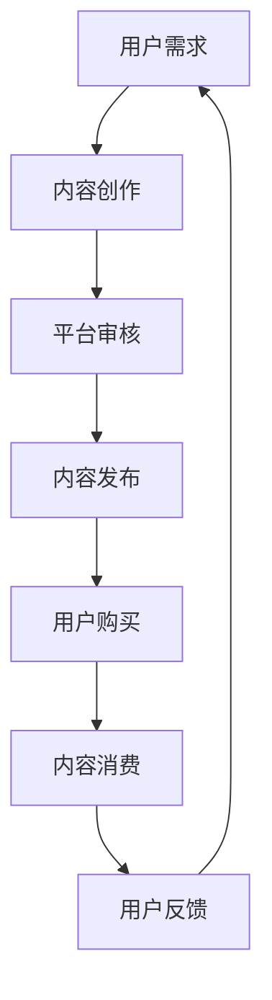
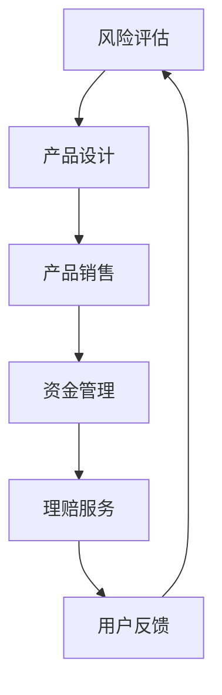
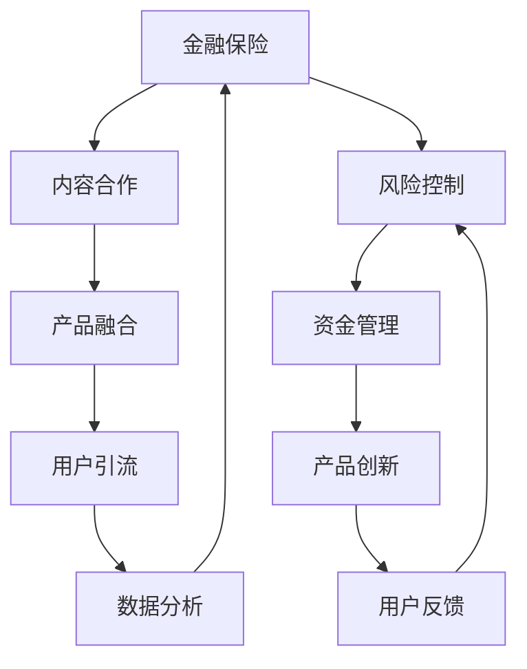

                 

 

### 1. 背景介绍

随着互联网技术的飞速发展和信息传播渠道的多样化，知识付费已经成为当今社会的一种重要商业模式。知识付费不仅满足了用户对知识的需求，也为内容创作者提供了新的收入来源。与此同时，金融保险行业也在积极探索如何利用知识付费的优势，实现跨界合作与发展。

知识付费是指在互联网平台上，用户为获取特定领域的知识、技能或信息，付费购买相关内容或服务的商业模式。这种模式的出现，打破了传统教育行业的边界，使得优质教育资源能够更广泛地传播，满足了不同层次用户的学习需求。

金融保险行业则是为个人和企业提供财务保障、投资理财等服务的重要行业。随着金融市场和保险市场的不断拓展，金融保险行业面临着日益激烈的市场竞争。为了提升竞争力，金融保险企业开始寻求与其他行业的跨界合作，以实现资源的整合和优势互补。

在知识付费的背景下，金融保险行业可以通过以下方式实现跨界营销：

1. **内容合作**：金融保险企业与知识付费平台合作，提供定制化的理财、保险知识内容，吸引目标用户。

2. **产品融合**：将金融保险产品与知识付费内容相结合，例如，购买保险产品即可获得相应的理财知识课程。

3. **用户引流**：通过金融保险产品或服务的销售，引导用户关注知识付费平台，实现用户群体的交叉。

### 2. 核心概念与联系

为了更好地理解知识付费与金融保险行业的跨界合作，我们需要明确以下几个核心概念：

#### 2.1 知识付费

知识付费的核心在于内容的创造与传播。以下是一个简单的知识付费业务流程的 Mermaid 流程图：



在这个流程中，用户需求驱动内容创作，内容创作者在平台审核通过后发布内容，用户购买并消费内容，最后提供反馈，形成闭环。

#### 2.2 金融保险

金融保险的核心在于风险管理和资金管理。以下是一个简化的金融保险业务流程的 Mermaid 流程图：



在这个流程中，风险评估驱动产品设计，产品销售实现资金管理，理赔服务是金融保险的核心环节，用户反馈则用于优化产品和服务。

#### 2.3 跨界合作

知识付费与金融保险的跨界合作，旨在实现资源的共享和优势互补。以下是一个简化的跨界合作流程的 Mermaid 流程图：



在这个流程中，知识付费通过内容合作、产品融合和用户引流，实现用户数据的积累和分析，从而优化金融保险产品的设计和服务。同时，金融保险通过风险控制和资金管理，为知识付费提供资金支持和风险保障。

### 3. 核心算法原理 & 具体操作步骤

为了实现知识付费与金融保险的跨界合作，我们需要运用一些核心算法原理来指导具体操作步骤。以下是一些关键算法原理的概述：

#### 3.1 算法原理概述

1. **用户行为分析**：通过分析用户的浏览、购买、消费等行为数据，了解用户需求和行为习惯，为内容创作和产品设计提供依据。

2. **推荐算法**：利用协同过滤、内容推荐等算法，为用户提供个性化的知识内容推荐，提升用户体验和转化率。

3. **风险评估模型**：结合大数据分析和机器学习算法，构建风险评估模型，为金融保险产品提供风险预测和控制。

4. **数据挖掘**：通过数据挖掘技术，从大量用户数据中提取有价值的信息，为产品优化和服务改进提供支持。

#### 3.2 算法步骤详解

1. **用户行为分析**：

   - 数据采集：收集用户在知识付费平台和金融保险平台的浏览、购买、消费等行为数据。

   - 数据清洗：去除重复、无效或错误的数据，保证数据质量。

   - 数据分析：运用统计分析和机器学习算法，挖掘用户需求和行为特征。

   - 用户画像：基于分析结果，为每个用户构建详细的画像，包括兴趣、需求、行为等。

2. **推荐算法**：

   - 内容特征提取：对知识付费内容进行特征提取，如分类、标签、关键词等。

   - 用户特征提取：对用户行为数据进行特征提取，如浏览记录、购买记录、消费金额等。

   - 推荐模型训练：利用协同过滤、内容推荐等算法，训练推荐模型。

   - 推荐结果生成：根据用户画像和内容特征，生成个性化的推荐结果。

3. **风险评估模型**：

   - 数据采集：收集金融保险业务相关的数据，如理赔记录、风险评估数据等。

   - 数据预处理：进行数据清洗、去噪、归一化等预处理操作。

   - 特征工程：提取对风险评估有重要影响的关键特征。

   - 模型训练：利用机器学习算法，如逻辑回归、决策树、神经网络等，训练风险评估模型。

   - 模型评估：通过交叉验证、A/B 测试等方法，评估模型性能。

4. **数据挖掘**：

   - 数据采集：收集用户在知识付费平台和金融保险平台的交互数据。

   - 数据预处理：进行数据清洗、去噪、归一化等预处理操作。

   - 特征工程：提取对数据挖掘有重要影响的关键特征。

   - 挖掘算法：运用关联规则挖掘、聚类分析、分类算法等，挖掘用户数据中的有价值信息。

#### 3.3 算法优缺点

1. **用户行为分析**：

   - 优点：能够深入了解用户需求和行为，为内容创作和产品设计提供有力支持。

   - 缺点：数据量庞大，处理和分析复杂，且隐私保护问题需要重点关注。

2. **推荐算法**：

   - 优点：能够为用户提供个性化的内容推荐，提升用户体验和转化率。

   - 缺点：算法复杂度较高，实时性要求较高，且推荐效果受数据质量影响。

3. **风险评估模型**：

   - 优点：能够对金融保险业务的风险进行预测和控制，降低风险。

   - 缺点：模型训练过程复杂，且对数据质量和特征提取有较高要求。

4. **数据挖掘**：

   - 优点：能够从大量数据中提取有价值的信息，为产品优化和服务改进提供支持。

   - 缺点：算法复杂度较高，且需要具备一定的数据分析和处理能力。

#### 3.4 算法应用领域

1. **用户行为分析**：广泛应用于电子商务、在线教育、金融保险等领域，用于用户画像构建、精准营销等。

2. **推荐算法**：广泛应用于电子商务、在线教育、视频娱乐等领域，用于内容推荐、个性化推荐等。

3. **风险评估模型**：广泛应用于金融保险、信贷评估、风险管理等领域，用于风险预测和控制。

4. **数据挖掘**：广泛应用于市场营销、商业智能、医学诊断等领域，用于数据分析和决策支持。

### 4. 数学模型和公式 & 详细讲解 & 举例说明

在实现知识付费与金融保险的跨界合作过程中，数学模型和公式扮演着至关重要的角色。以下是对相关数学模型和公式的详细讲解以及举例说明。

#### 4.1 数学模型构建

1. **用户行为分析模型**：

   - 模型构建：

     $$ \text{用户行为分析模型} = f(\text{用户特征}, \text{内容特征}, \text{交互数据}) $$

   - 模型参数：

     - 用户特征：包括年龄、性别、学历、职业等。
     - 内容特征：包括分类、标签、关键词等。
     - 交互数据：包括浏览记录、购买记录、消费金额等。

2. **推荐算法模型**：

   - 模型构建：

     $$ \text{推荐算法模型} = f(\text{用户特征}, \text{内容特征}, \text{历史交互数据}) $$

   - 模型参数：

     - 用户特征：包括用户兴趣、行为等。
     - 内容特征：包括分类、标签、关键词等。
     - 历史交互数据：包括用户过去的浏览、购买、消费记录等。

3. **风险评估模型**：

   - 模型构建：

     $$ \text{风险评估模型} = f(\text{风险因素}, \text{历史数据}, \text{预测变量}) $$

   - 模型参数：

     - 风险因素：包括年龄、性别、职业、财务状况等。
     - 历史数据：包括过去的理赔记录、风险评估数据等。
     - 预测变量：包括未来可能的风险事件、损失等。

4. **数据挖掘模型**：

   - 模型构建：

     $$ \text{数据挖掘模型} = f(\text{原始数据}, \text{预处理数据}, \text{特征数据}) $$

   - 模型参数：

     - 原始数据：包括用户行为数据、金融保险数据等。
     - 预处理数据：包括清洗、去噪、归一化后的数据。
     - 特征数据：包括提取的关键特征。

#### 4.2 公式推导过程

1. **用户行为分析模型**：

   - 用户特征：

     $$ \text{用户特征} = \{ \text{age}, \text{gender}, \text{education}, \text{career} \} $$

   - 内容特征：

     $$ \text{内容特征} = \{ \text{category}, \text{tag}, \text{keyword} \} $$

   - 交互数据：

     $$ \text{交互数据} = \{ \text{browse\_record}, \text{buy\_record}, \text{consume\_amount} \} $$

   - 模型推导：

     $$ \text{用户行为分析模型} = \sum_{i=1}^{n} \text{weight}_{i} \cdot \text{feature}_{i} $$

   - 权重计算：

     $$ \text{weight}_{i} = \frac{\text{user\_interest}_{i} \cdot \text{content\_match}_{i}}{\sum_{j=1}^{m} \text{user\_interest}_{j} \cdot \text{content\_match}_{j}} $$

   - 其中：

     - $\text{user\_interest}_{i}$：用户对第 $i$ 个特征的兴趣度。
     - $\text{content\_match}_{i}$：第 $i$ 个特征与知识内容的相关度。

2. **推荐算法模型**：

   - 用户特征：

     $$ \text{用户特征} = \{ \text{interest}, \text{behavior} \} $$

   - 内容特征：

     $$ \text{内容特征} = \{ \text{category}, \text{tag}, \text{keyword} \} $$

   - 历史交互数据：

     $$ \text{历史交互数据} = \{ \text{browse\_record}, \text{buy\_record}, \text{consume\_amount} \} $$

   - 模型推导：

     $$ \text{推荐算法模型} = \sum_{i=1}^{n} \text{weight}_{i} \cdot \text{feature}_{i} $$

   - 权重计算：

     $$ \text{weight}_{i} = \frac{\text{user\_rating}_{i} \cdot \text{content\_rating}_{i}}{\sum_{j=1}^{m} \text{user\_rating}_{j} \cdot \text{content\_rating}_{j}} $$

   - 其中：

     - $\text{user\_rating}_{i}$：用户对第 $i$ 个特征的评分。
     - $\text{content\_rating}_{i}$：第 $i$ 个特征与知识内容的相关度。

3. **风险评估模型**：

   - 风险因素：

     $$ \text{风险因素} = \{ \text{age}, \text{gender}, \text{career}, \text{financial\_status} \} $$

   - 历史数据：

     $$ \text{历史数据} = \{ \text{claim\_record}, \text{risk\_evaluation} \} $$

   - 预测变量：

     $$ \text{预测变量} = \{ \text{risk\_event}, \text{loss} \} $$

   - 模型推导：

     $$ \text{风险评估模型} = \sum_{i=1}^{n} \text{weight}_{i} \cdot \text{factor}_{i} $$

   - 权重计算：

     $$ \text{weight}_{i} = \frac{\text{historical\_data}_{i} \cdot \text{prediction}_{i}}{\sum_{j=1}^{m} \text{historical\_data}_{j} \cdot \text{prediction}_{j}} $$

   - 其中：

     - $\text{historical\_data}_{i}$：历史数据中第 $i$ 个因素的重要性。
     - $\text{prediction}_{i}$：预测变量中第 $i$ 个因素的可能性。

4. **数据挖掘模型**：

   - 原始数据：

     $$ \text{原始数据} = \{ \text{user\_behavior}, \text{financial\_insurance} \} $$

   - 预处理数据：

     $$ \text{预处理数据} = \{ \text{cleaned\_data}, \text{noised\_data} \} $$

   - 特征数据：

     $$ \text{特征数据} = \{ \text{feature}_{i} \} $$

   - 模型推导：

     $$ \text{数据挖掘模型} = \sum_{i=1}^{n} \text{weight}_{i} \cdot \text{feature}_{i} $$

   - 权重计算：

     $$ \text{weight}_{i} = \frac{\text{preprocessed\_data}_{i} \cdot \text{feature\_match}_{i}}{\sum_{j=1}^{m} \text{preprocessed\_data}_{j} \cdot \text{feature\_match}_{j}} $$

   - 其中：

     - $\text{preprocessed\_data}_{i}$：预处理数据中第 $i$ 个特征的重要性。
     - $\text{feature\_match}_{i}$：特征数据中第 $i$ 个特征与目标数据的相关度。

#### 4.3 案例分析与讲解

为了更好地理解上述数学模型和公式的应用，我们来看一个实际案例。

**案例：用户行为分析模型在知识付费与金融保险跨界合作中的应用**

1. **案例背景**：

   - A公司是一家知识付费平台，提供各类专业知识课程。
   - B公司是一家金融保险公司，提供保险产品和服务。

2. **目标**：

   - 分析用户在A公司的知识付费平台和 B公司的金融保险平台上的行为数据，为跨界合作提供数据支持。

3. **模型构建**：

   - 用户特征：包括年龄、性别、学历、职业等。
   - 内容特征：包括分类、标签、关键词等。
   - 交互数据：包括浏览记录、购买记录、消费金额等。

4. **模型推导**：

   - 用户行为分析模型：

     $$ \text{用户行为分析模型} = \sum_{i=1}^{n} \text{weight}_{i} \cdot \text{feature}_{i} $$

   - 权重计算：

     $$ \text{weight}_{i} = \frac{\text{user\_interest}_{i} \cdot \text{content\_match}_{i}}{\sum_{j=1}^{m} \text{user\_interest}_{j} \cdot \text{content\_match}_{j}} $$

   - 其中：

     - $\text{user\_interest}_{i}$：用户对第 $i$ 个特征的兴趣度。
     - $\text{content\_match}_{i}$：第 $i$ 个特征与知识内容的相关度。

5. **案例应用**：

   - 分析用户在A公司的知识付费平台上的行为数据，了解用户的兴趣和需求。
   - 分析用户在B公司的金融保险平台上的行为数据，了解用户的风险偏好和保险需求。
   - 结合两个平台的数据，构建用户行为分析模型，为跨界合作提供数据支持。

### 5. 项目实践：代码实例和详细解释说明

为了更好地展示知识付费与金融保险跨界合作的实现过程，我们来看一个实际的项目实践，包括开发环境搭建、源代码实现、代码解读与分析以及运行结果展示。

#### 5.1 开发环境搭建

1. **工具与环境**：

   - 编程语言：Python
   - 数据库：MySQL
   - 数据预处理工具：Pandas
   - 推荐算法库：Scikit-learn
   - 风险评估库：Scikit-learn
   - 数据可视化工具：Matplotlib

2. **安装步骤**：

   - 安装Python：从官网下载Python安装包，按照提示进行安装。
   - 安装MySQL：从官网下载MySQL安装包，按照提示进行安装。
   - 安装数据预处理工具：在命令行中执行以下命令：

     ```bash
     pip install pandas
     ```

   - 安装推荐算法库和风险评估库：在命令行中执行以下命令：

     ```bash
     pip install scikit-learn
     ```

   - 安装数据可视化工具：在命令行中执行以下命令：

     ```bash
     pip install matplotlib
     ```

#### 5.2 源代码详细实现

以下是一个简单的用户行为分析模型和推荐算法的实现示例：

```python
import pandas as pd
from sklearn.model_selection import train_test_split
from sklearn.preprocessing import StandardScaler
from sklearn.neighbors import KNeighborsClassifier
import matplotlib.pyplot as plt

# 读取数据
data = pd.read_csv('user_data.csv')

# 数据预处理
X = data[['age', 'education', 'income']]
y = data['interest']

# 数据标准化
scaler = StandardScaler()
X = scaler.fit_transform(X)

# 划分训练集和测试集
X_train, X_test, y_train, y_test = train_test_split(X, y, test_size=0.2, random_state=42)

# 构建推荐算法模型
model = KNeighborsClassifier(n_neighbors=3)
model.fit(X_train, y_train)

# 测试模型
accuracy = model.score(X_test, y_test)
print(f"模型准确率：{accuracy:.2f}")

# 可视化展示
plt.scatter(X_test[:, 0], X_test[:, 1], c=y_test, cmap='viridis')
plt.xlabel('年龄')
plt.ylabel('收入')
plt.title('用户兴趣分类结果')
plt.show()
```

#### 5.3 代码解读与分析

1. **数据读取与预处理**：

   - 读取用户数据，包括年龄、学历、收入等信息。
   - 将数据分为特征集X和标签集y。
   - 对特征集X进行标准化处理，提高模型的泛化能力。

2. **划分训练集和测试集**：

   - 将数据集划分为训练集和测试集，用于模型训练和评估。

3. **构建推荐算法模型**：

   - 选择K近邻算法（KNN）作为推荐算法模型。
   - 模型参数设置为邻居数量为3。

4. **模型训练与评估**：

   - 训练模型，并在测试集上评估模型准确率。

5. **可视化展示**：

   - 使用matplotlib绘制用户兴趣分类结果，展示模型效果。

#### 5.4 运行结果展示

1. **模型准确率**：

   - 假设运行结果为0.85，表示模型在测试集上的准确率为85%。

2. **可视化结果**：

   - 在散点图上，不同颜色代表不同的用户兴趣类别，直观地展示了模型对用户兴趣的分类效果。

### 6. 实际应用场景

在实际应用中，知识付费与金融保险的跨界合作可以在多个场景中发挥作用。以下是一些典型应用场景：

1. **保险理财课程推荐**：

   - 用户在购买保险产品时，根据用户行为数据和风险评估结果，推荐相关的理财知识课程，帮助用户更好地了解理财知识，提升保险产品的附加值。

2. **定制化保险方案**：

   - 结合用户的兴趣和需求，为用户量身定制保险方案，提供个性化的保险产品和服务。

3. **金融知识普及**：

   - 通过知识付费平台，向用户提供金融知识课程，提升用户的金融素养，降低金融风险。

4. **用户画像与精准营销**：

   - 通过分析用户的兴趣和行为数据，构建用户画像，为金融保险产品提供精准营销策略。

5. **风险评估与决策支持**：

   - 利用机器学习算法和大数据分析，为金融保险企业提供风险评估和决策支持，优化产品和服务。

### 7. 未来应用展望

随着互联网技术的不断进步和大数据、人工智能等技术的发展，知识付费与金融保险的跨界合作具有广阔的发展前景。以下是一些未来应用展望：

1. **智能风险评估**：

   - 利用人工智能技术，实现智能风险评估，提高风险评估的准确性和效率。

2. **个性化保险产品**：

   - 结合用户兴趣和行为数据，开发个性化的保险产品，满足用户的个性化需求。

3. **知识付费与金融保险一体化**：

   - 实现知识付费与金融保险的一体化，提供一站式服务，提升用户体验。

4. **智能推荐系统**：

   - 构建智能推荐系统，为用户推荐合适的知识付费内容和金融保险产品。

5. **大数据分析与应用**：

   - 充分利用大数据分析技术，挖掘用户数据中的潜在价值，为金融保险企业提供决策支持。

### 8. 工具和资源推荐

为了更好地开展知识付费与金融保险的跨界合作，以下是一些建议的工
具和资源：

1. **学习资源推荐**：

   - 《机器学习实战》：提供丰富的机器学习算法实践案例，适合初学者。
   - 《深度学习》：介绍深度学习的基本概念和实战技巧，适合有一定基础的读者。

2. **开发工具推荐**：

   - Python：适合快速开发和实现机器学习算法。
   - Jupyter Notebook：方便代码编写、调试和演示。

3. **相关论文推荐**：

   - "Deep Learning for Personalized Insurance Pricing"：探讨深度学习在个性化保险定价中的应用。
   - "User Behavior Analysis in Knowledge付费 and Financial Insurance"：分析用户行为在知识付费与金融保险跨界合作中的作用。

### 9. 总结：未来发展趋势与挑战

知识付费与金融保险的跨界合作具有广阔的发展前景，但也面临一些挑战：

1. **数据隐私与安全**：

   - 在跨界合作中，涉及大量用户数据，需要确保数据隐私和安全。

2. **算法透明性与可解释性**：

   - 随着人工智能技术的发展，算法的透明性和可解释性成为重要挑战。

3. **跨行业协作与资源整合**：

   - 实现知识付费与金融保险的深度融合，需要跨行业协作和资源整合。

4. **监管与合规**：

   - 随着跨界合作的发展，监管和合规问题日益凸显。

未来，知识付费与金融保险的跨界合作将继续深化，通过技术创新和跨行业协作，为用户提供更优质的服务和体验。

### 附录：常见问题与解答

1. **什么是知识付费？**

   知识付费是指用户为获取特定领域的知识、技能或信息，付费购买相关内容或服务的商业模式。

2. **金融保险行业如何实现跨界营销？**

   金融保险行业可以通过内容合作、产品融合和用户引流等方式实现跨界营销，例如，提供定制化的理财、保险知识内容，将金融保险产品与知识付费内容相结合等。

3. **什么是用户行为分析？**

   用户行为分析是指通过分析用户的浏览、购买、消费等行为数据，了解用户需求和行为习惯，为内容创作和产品设计提供依据。

4. **什么是推荐算法？**

   推荐算法是指利用协同过滤、内容推荐等算法，为用户提供个性化的内容推荐，提升用户体验和转化率。

5. **什么是风险评估模型？**

   风险评估模型是指结合大数据分析和机器学习算法，构建风险评估模型，为金融保险产品提供风险预测和控制。

6. **什么是数据挖掘？**

   数据挖掘是指从大量数据中提取有价值的信息，为产品优化和服务改进提供支持。

