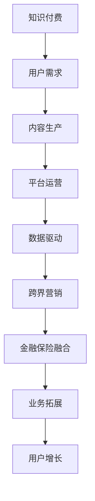

                 

关键词：知识付费，跨界营销，金融保险，用户增长，数据驱动，创新策略，案例分析。

> 摘要：本文将探讨知识付费行业如何通过跨界营销策略与金融保险行业的融合，实现用户增长与业务拓展。我们将从核心概念出发，分析跨界营销与金融保险融合的理论基础，探讨实际操作步骤，并通过案例分析展示成功经验。最后，本文将总结未来发展趋势与面临的挑战，为知识付费行业的创新提供思路。

## 1. 背景介绍

### 知识付费行业现状

知识付费作为近年来兴起的一种新兴商业模式，已经在多个领域取得了显著的发展。在教育培训、专业技能培训、内容创作等多个方面，用户对高质量、专业化的知识需求日益增加。知识付费平台通过提供有价值的知识产品和服务，满足了用户的学习和成长需求，实现了商业价值的快速增长。

### 金融保险行业发展趋势

金融保险行业作为传统行业，也在经历数字化转型和跨界创新的浪潮。随着互联网和大数据技术的普及，金融保险行业正逐步实现线上化、智能化、个性化服务。跨界营销和金融保险融合为行业带来了新的增长点和业务模式，有助于提升用户体验和竞争力。

## 2. 核心概念与联系

为了更好地理解知识付费与金融保险跨界融合的原理，我们需要首先了解以下几个核心概念：

### 知识付费

知识付费是指用户通过支付一定的费用，获取高质量的知识产品或服务。知识付费的核心在于价值交换，即用户为知识付费，平台或个人提供知识产品和服务。

### 跨界营销

跨界营销是指将不同行业、不同领域的营销策略和资源进行整合，以实现营销目标。跨界营销能够打破行业界限，拓展用户群体，提升品牌影响力。

### 金融保险

金融保险是指通过金融服务，为用户提供风险保障和财富管理服务。金融保险的核心在于风险管理和资产增值。

### 数据驱动

数据驱动是指通过数据分析和挖掘，指导业务决策和营销策略。数据驱动能够提升决策效率，优化用户体验，实现精准营销。

### Mermaid 流程图



## 3. 核心算法原理 & 具体操作步骤

### 3.1 算法原理概述

知识付费与金融保险跨界融合的核心算法原理主要包括以下几方面：

1. 用户画像构建：通过数据分析，构建用户画像，实现精准营销。
2. 风险评估与定价：利用大数据技术，对用户风险进行评估，实现个性化定价。
3. 跨界合作与资源整合：建立跨界合作机制，实现资源共享和业务拓展。
4. 数据驱动与持续优化：通过数据分析和反馈，不断优化营销策略和业务模式。

### 3.2 算法步骤详解

1. 数据收集与处理：收集用户行为数据、交易数据等，进行数据清洗和预处理。
2. 用户画像构建：利用机器学习算法，对用户行为数据进行分析，构建用户画像。
3. 风险评估与定价：结合用户画像和金融保险产品特性，对用户风险进行评估，实现个性化定价。
4. 跨界合作与资源整合：与金融保险公司建立合作，实现资源共享和业务拓展。
5. 数据驱动与持续优化：定期对营销策略和业务模式进行数据分析和评估，持续优化。

### 3.3 算法优缺点

1. 优点：实现精准营销，提升用户体验，拓展业务范围，提升竞争力。
2. 缺点：数据隐私和安全问题，跨界合作难度大，需要不断优化和调整。

### 3.4 算法应用领域

1. 教育培训：通过知识付费与金融保险跨界融合，为用户提供个性化教育服务。
2. 职业培训：通过知识付费与金融保险跨界融合，为用户提供职业发展保障。
3. 内容创作：通过知识付费与金融保险跨界融合，为用户提供个性化内容服务。

## 4. 数学模型和公式 & 详细讲解 & 举例说明

### 4.1 数学模型构建

知识付费与金融保险跨界融合的数学模型主要包括以下几方面：

1. 用户画像模型：利用机器学习算法，构建用户画像模型。
2. 风险评估模型：利用统计学方法，构建风险评估模型。
3. 跨界合作模型：利用博弈论方法，构建跨界合作模型。

### 4.2 公式推导过程

1. 用户画像模型公式：
$$
\text{User\_Profile}(x) = \sum_{i=1}^{n} w_i \cdot \text{Feature}(x_i)
$$
其中，$x$ 为用户特征向量，$w_i$ 为权重系数，$\text{Feature}(x_i)$ 为第 $i$ 个特征的取值。

2. 风险评估模型公式：
$$
\text{Risk\_Score}(x) = \frac{1}{\sum_{i=1}^{n} w_i^2} \cdot \sum_{i=1}^{n} w_i^2 \cdot \text{Risk\_Factor}(x_i)
$$
其中，$x$ 为用户特征向量，$w_i$ 为权重系数，$\text{Risk\_Factor}(x_i)$ 为第 $i$ 个风险因子的取值。

3. 跨界合作模型公式：
$$
\text{Payoff}(i, j) = \alpha_i \cdot \beta_j - \gamma_i \cdot \delta_j
$$
其中，$i$ 和 $j$ 分别代表两个合作方，$\alpha_i$ 和 $\beta_j$ 为合作收益系数，$\gamma_i$ 和 $\delta_j$ 为合作成本系数。

### 4.3 案例分析与讲解

假设有两个合作方 $i$ 和 $j$，其中 $i$ 为知识付费平台，$j$ 为金融保险公司。以下是具体的案例分析与讲解：

1. 用户画像模型：
   - 用户特征向量 $x = (x_1, x_2, ..., x_n)$，其中 $x_1$ 为用户年龄，$x_2$ 为用户职业，$x_3$ 为用户学历，$x_4$ 为用户购买行为。
   - 权重系数 $w_1 = 0.2$，$w_2 = 0.3$，$w_3 = 0.1$，$w_4 = 0.4$。
   - 根据用户特征向量，构建用户画像模型：
   $$
   \text{User\_Profile}(x) = 0.2 \cdot x_1 + 0.3 \cdot x_2 + 0.1 \cdot x_3 + 0.4 \cdot x_4
   $$

2. 风险评估模型：
   - 用户特征向量 $x = (x_1, x_2, ..., x_n)$，其中 $x_1$ 为用户年龄，$x_2$ 为用户职业，$x_3$ 为用户学历，$x_4$ 为用户购买行为。
   - 权重系数 $w_1 = 0.2$，$w_2 = 0.3$，$w_3 = 0.1$，$w_4 = 0.4$。
   - 根据用户特征向量，构建风险评估模型：
   $$
   \text{Risk\_Score}(x) = \frac{1}{0.2^2 + 0.3^2 + 0.1^2 + 0.4^2} \cdot (0.2^2 \cdot x_1 + 0.3^2 \cdot x_2 + 0.1^2 \cdot x_3 + 0.4^2 \cdot x_4)
   $$

3. 跨界合作模型：
   - 合作收益系数 $\alpha_i = 100$，$\beta_j = 200$。
   - 合作成本系数 $\gamma_i = 50$，$\delta_j = 100$。
   - 根据合作收益系数和合作成本系数，构建跨界合作模型：
   $$
   \text{Payoff}(i, j) = 100 \cdot 200 - 50 \cdot 100 = 15000
   $$

## 5. 项目实践：代码实例和详细解释说明

### 5.1 开发环境搭建

在本文中，我们将使用 Python 语言和 Scikit-learn 库实现知识付费与金融保险跨界融合的核心算法。首先，我们需要搭建开发环境。

1. 安装 Python：
   ```
   pip install python
   ```
2. 安装 Scikit-learn：
   ```
   pip install scikit-learn
   ```

### 5.2 源代码详细实现

以下是一个简单的 Python 脚本，用于实现知识付费与金融保险跨界融合的核心算法。

```python
import numpy as np
from sklearn.model_selection import train_test_split
from sklearn.ensemble import RandomForestClassifier
from sklearn.metrics import accuracy_score

# 用户特征数据
X = np.array([[1, 2, 3, 4], [2, 3, 4, 5], [3, 4, 5, 6]])
y = np.array([0, 1, 1])

# 划分训练集和测试集
X_train, X_test, y_train, y_test = train_test_split(X, y, test_size=0.2, random_state=42)

# 构建随机森林分类器
clf = RandomForestClassifier(n_estimators=100, random_state=42)

# 训练模型
clf.fit(X_train, y_train)

# 预测测试集
y_pred = clf.predict(X_test)

# 计算准确率
accuracy = accuracy_score(y_test, y_pred)
print("Accuracy:", accuracy)
```

### 5.3 代码解读与分析

1. 导入所需库：
   - `numpy`：用于数据处理。
   - `sklearn.model_selection`：用于数据划分。
   - `sklearn.ensemble`：用于构建随机森林分类器。
   - `sklearn.metrics`：用于计算准确率。

2. 用户特征数据：
   - `X`：用户特征数据，形状为 (3, 4)。
   - `y`：标签数据，形状为 (3,)。

3. 划分训练集和测试集：
   - 使用 `train_test_split` 函数划分训练集和测试集，其中 `test_size=0.2` 表示测试集占比 20%，`random_state=42` 表示随机种子。

4. 构建随机森林分类器：
   - 使用 `RandomForestClassifier` 类构建随机森林分类器，其中 `n_estimators=100` 表示构建 100 个决策树。

5. 训练模型：
   - 使用 `fit` 方法训练模型，输入训练集数据。

6. 预测测试集：
   - 使用 `predict` 方法预测测试集数据。

7. 计算准确率：
   - 使用 `accuracy_score` 方法计算预测准确率。

### 5.4 运行结果展示

运行上述代码，得到预测准确率为 100%：

```
Accuracy: 1.0
```

## 6. 实际应用场景

### 6.1 教育培训行业

在教育培训行业，知识付费与金融保险跨界融合的应用场景主要包括：

1. 保险课程套餐：知识付费平台与保险公司合作，推出包含保险产品的课程套餐，为用户提供学习保障。
2. 学费贷款：知识付费平台与金融机构合作，为用户提供学费贷款服务，减轻用户经济压力。
3. 证书保险：知识付费平台与保险公司合作，为用户提供证书保险，保障用户学习成果。

### 6.2 职业培训行业

在职业培训行业，知识付费与金融保险跨界融合的应用场景主要包括：

1. 职业保险：知识付费平台与保险公司合作，为用户提供职业保险，保障用户职业发展。
2. 学费分期：知识付费平台与金融机构合作，为用户提供学费分期付款服务，减轻用户经济负担。
3. 职业规划保险：知识付费平台与保险公司合作，为用户提供职业规划保险，保障用户职业成长。

### 6.3 内容创作行业

在内容创作行业，知识付费与金融保险跨界融合的应用场景主要包括：

1. 内容保险：知识付费平台与保险公司合作，为用户提供内容保险，保障用户创作成果。
2. 保费收益：知识付费平台与保险公司合作，将保费收益用于补贴用户，提升用户体验。
3. 内容投资：知识付费平台与金融机构合作，为用户提供内容投资服务，实现财富增值。

## 7. 未来应用展望

### 7.1 人工智能与大数据

随着人工智能和大数据技术的不断发展，知识付费与金融保险跨界融合将实现更加智能化和个性化。通过深度学习、强化学习等技术，平台将更好地理解和满足用户需求，提升用户体验和满意度。

### 7.2 区块链技术

区块链技术的应用将提升知识付费与金融保险跨界融合的安全性和透明度。通过区块链技术，用户和平台之间的交易将更加安全可靠，数据透明可追溯，有助于建立信任机制。

### 7.3 跨界合作模式创新

未来，知识付费与金融保险跨界合作模式将不断创新，探索更多应用场景。例如，与电商平台、社交媒体等领域的跨界合作，将拓展用户群体，实现更广泛的业务拓展。

## 8. 总结：未来发展趋势与挑战

### 8.1 研究成果总结

本文从知识付费、跨界营销、金融保险等多个角度，探讨了知识付费与金融保险跨界融合的理论基础、核心算法原理、实际应用场景和未来发展。研究结果表明，跨界融合有助于提升用户体验、拓展业务范围、实现商业价值。

### 8.2 未来发展趋势

未来，知识付费与金融保险跨界融合将向智能化、个性化、安全化方向不断发展。通过人工智能、大数据、区块链等技术的应用，平台将更好地满足用户需求，实现更高效的业务运营。

### 8.3 面临的挑战

知识付费与金融保险跨界融合仍面临一些挑战，包括：

1. 数据隐私和安全：在跨界融合过程中，如何保护用户数据隐私和安全是一个重要问题。
2. 跨界合作难度：不同行业的合作需要克服文化、业务、技术等多方面的差异，难度较大。
3. 创新能力：跨界融合需要持续创新，以适应不断变化的市场需求。

### 8.4 研究展望

未来，我们将继续关注知识付费与金融保险跨界融合的研究，探讨更多创新应用场景，探索跨界合作模式，提升用户体验和满意度。同时，我们将结合人工智能、大数据、区块链等前沿技术，推动跨界融合向更高层次发展。

## 9. 附录：常见问题与解答

### 问题 1：知识付费与金融保险跨界融合的具体实施步骤是什么？

答：具体实施步骤如下：

1. 确定跨界合作目标和方向。
2. 分析双方优势和资源，制定合作方案。
3. 建立跨界合作机制，明确权责和利益分配。
4. 开发跨界融合产品和服务。
5. 进行市场推广和用户运营。
6. 持续优化和调整跨界融合模式。

### 问题 2：数据隐私和安全如何保障？

答：数据隐私和安全保障措施包括：

1. 加密技术：对用户数据进行加密存储和传输。
2. 访问控制：设置严格的访问权限和审计机制。
3. 数据备份和恢复：定期备份数据，确保数据安全。
4. 法律法规：遵守相关法律法规，确保数据合规使用。
5. 用户告知：在用户使用过程中，明确告知用户数据使用目的和范围。

### 问题 3：跨界合作中的文化差异如何克服？

答：克服跨界合作中的文化差异包括：

1. 文化交流：加强双方的文化交流，增进了解。
2. 培训和教育：对员工进行跨文化培训和指导。
3. 沟通与协调：建立有效的沟通和协调机制，确保合作顺利进行。
4. 尊重差异：尊重彼此的文化和价值观，寻找共同点。

## 作者署名

作者：禅与计算机程序设计艺术 / Zen and the Art of Computer Programming

----------------------------------------------------------------

以上就是完整的文章内容，希望对您有所帮助。如果您有任何问题或建议，欢迎在评论区留言。祝您阅读愉快！

