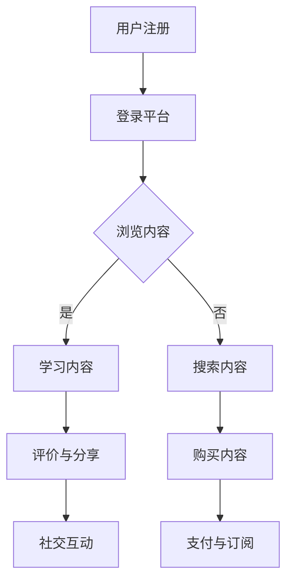

                 

关键词：知识付费、用户体验、平台设计、优化、交互设计、用户行为分析

> 摘要：本文旨在探讨知识付费平台的用户体验设计与优化，通过对当前市场的分析、核心概念阐述，以及算法原理、数学模型和项目实践等多个维度的深入探讨，为知识付费平台的未来发展提供有益的思路和指导。

## 1. 背景介绍

近年来，随着互联网技术的快速发展，知识付费成为了一种新兴的商业模式。知识付费平台通过提供有价值的信息和服务，满足了用户在专业领域的学习需求。用户可以通过付费获取高质量的内容，而这些内容通常来自于行业专家、学者和行业领袖等权威人士。

然而，随着市场竞争的加剧，知识付费平台的用户体验成为影响用户留存和平台发展的重要因素。如何优化用户体验，提高用户满意度和忠诚度，成为知识付费平台亟需解决的问题。

### 1.1 当前市场形势

根据市场调研数据，知识付费市场正在快速增长。用户对于专业知识的渴求推动了市场的繁荣。然而，不同平台在内容质量、交互设计、用户行为分析等方面存在较大差异。一些平台在用户体验方面取得了显著成果，而另一些平台则面临着用户流失和市场份额缩水的风险。

### 1.2 用户体验的重要性

用户体验（User Experience, UX）是指用户在使用产品或服务过程中所获得的全部感受和体验。在知识付费平台上，用户体验涵盖了用户在浏览、搜索、购买、学习、互动等各个环节的感受。以下是一些关键因素：

- **内容质量**：优质的内容是用户体验的基础。平台需要确保内容的专业性、实用性和权威性。
- **交互设计**：简洁、直观的交互设计可以降低用户的学习成本，提高使用效率。
- **用户行为分析**：通过对用户行为的分析，平台可以更好地了解用户需求，从而提供个性化的服务。
- **社交互动**：用户之间的互动和分享可以增强社区的活跃度，提高用户的参与感和归属感。

## 2. 核心概念与联系

为了更好地理解知识付费平台的用户体验设计与优化，我们需要从核心概念和联系出发，探讨相关原理和架构。

### 2.1 用户体验（UX）

用户体验是指用户在使用产品或服务过程中所获得的全部感受和体验。在知识付费平台上，用户体验主要包括以下几个方面：

- **易用性**：用户在使用平台时能够轻松完成各种操作，无需额外学习。
- **满意度**：用户对平台的功能和服务感到满意，愿意继续使用。
- **忠诚度**：用户对平台产生信任和依赖，长期使用并推荐给他人。

### 2.2 交互设计（ID）

交互设计是用户体验的重要组成部分。在知识付费平台上，交互设计需要考虑以下几个方面：

- **界面设计**：界面应该简洁、直观，符合用户的使用习惯。
- **导航设计**：导航应该清晰、便捷，帮助用户快速找到所需内容。
- **操作流程**：操作流程应该简洁、流畅，降低用户的学习成本。

### 2.3 用户行为分析（UBA）

用户行为分析是指通过对用户在平台上的行为数据进行收集、分析和处理，以了解用户需求和行为模式。在知识付费平台上，用户行为分析可以用于以下几个方面：

- **内容推荐**：根据用户行为数据，推荐用户可能感兴趣的内容。
- **个性化服务**：根据用户行为数据，提供个性化的学习路径和推荐。
- **风险控制**：通过对用户行为数据的监控和分析，发现潜在的风险和问题。

### 2.4 社交互动

社交互动是知识付费平台的重要特色之一。用户可以通过社交互动获得更多的学习资源和支持，同时增强社区的活跃度和用户黏性。社交互动包括以下几个方面：

- **评论与评分**：用户可以对内容进行评论和评分，分享自己的观点和体验。
- **互动问答**：用户可以在平台上发起或参与问答，解决自己的问题和提供帮助。
- **圈子与群组**：用户可以加入不同的圈子或群组，与志同道合的用户进行交流和互动。

### 2.5 Mermaid 流程图

为了更好地理解核心概念和联系，我们使用 Mermaid 流程图展示知识付费平台的核心流程和交互环节：



## 3. 核心算法原理 & 具体操作步骤

在知识付费平台的用户体验设计与优化中，核心算法原理起着至关重要的作用。以下我们将详细探讨算法原理及其具体操作步骤。

### 3.1 算法原理概述

知识付费平台的核心算法主要包括以下几个方面：

- **内容推荐算法**：根据用户的行为数据和历史偏好，推荐用户可能感兴趣的内容。
- **个性化服务算法**：根据用户的行为数据和需求，提供个性化的学习路径和推荐。
- **用户行为预测算法**：通过对用户行为数据的分析，预测用户未来的行为和需求。

### 3.2 算法步骤详解

#### 3.2.1 内容推荐算法

1. **数据收集**：收集用户在平台上的浏览、搜索、购买等行为数据。
2. **特征提取**：对行为数据进行分析，提取用户的行为特征，如浏览时间、浏览频次、购买记录等。
3. **模型训练**：使用机器学习算法，如协同过滤、基于内容的推荐等，训练推荐模型。
4. **推荐生成**：根据用户的特征和模型预测，生成推荐内容。

#### 3.2.2 个性化服务算法

1. **需求识别**：通过用户行为数据，识别用户的需求和兴趣点。
2. **路径规划**：根据用户的需求和兴趣点，规划个性化的学习路径。
3. **内容推荐**：根据学习路径和用户特征，推荐适合用户的内容。
4. **反馈调整**：根据用户的反馈和交互数据，调整个性化服务的策略。

#### 3.2.3 用户行为预测算法

1. **行为建模**：使用机器学习算法，建立用户行为模型，如点击率预测、购买意愿预测等。
2. **参数优化**：通过交叉验证和模型优化，调整模型参数，提高预测准确性。
3. **预测生成**：根据用户的行为数据和模型预测，生成用户未来的行为预测。
4. **策略调整**：根据预测结果和用户反馈，调整平台的运营策略。

### 3.3 算法优缺点

#### 3.3.1 内容推荐算法

**优点**：

- 能够根据用户的历史行为和偏好，推荐用户可能感兴趣的内容。
- 可以提高用户的满意度和黏性。

**缺点**：

- 需要大量的用户行为数据，数据质量对算法效果有很大影响。
- 可能会出现数据偏差和过拟合问题。

#### 3.3.2 个性化服务算法

**优点**：

- 能够为用户提供个性化的服务，提高用户满意度和忠诚度。
- 可以更好地满足用户的需求。

**缺点**：

- 需要大量的用户行为数据，数据质量对算法效果有很大影响。
- 可能会出现个性化过度，导致用户失去新鲜感和兴趣。

#### 3.3.3 用户行为预测算法

**优点**：

- 能够预测用户未来的行为和需求，为平台的运营和策略调整提供依据。
- 可以提高平台的运营效率和用户体验。

**缺点**：

- 需要大量的用户行为数据，数据质量对算法效果有很大影响。
- 可能会出现预测偏差和不确定性。

### 3.4 算法应用领域

知识付费平台的核心算法应用领域主要包括以下几个方面：

- **内容推荐**：为用户推荐感兴趣的内容，提高用户满意度和黏性。
- **个性化服务**：为用户提供个性化的学习路径和推荐，提高用户满意度和忠诚度。
- **用户行为预测**：预测用户未来的行为和需求，为平台的运营和策略调整提供依据。

## 4. 数学模型和公式 & 详细讲解 & 举例说明

在知识付费平台的用户体验设计与优化中，数学模型和公式起着关键作用。以下我们将详细讲解数学模型和公式的构建、推导过程，并举例说明。

### 4.1 数学模型构建

知识付费平台的数学模型主要包括以下几个方面：

- **用户行为模型**：描述用户在平台上的行为规律和特征。
- **推荐模型**：用于推荐用户感兴趣的内容。
- **预测模型**：用于预测用户未来的行为和需求。

#### 4.1.1 用户行为模型

用户行为模型可以采用以下公式：

\[ user\_behavior = f(user\_features, context) \]

其中，\( user\_features \) 表示用户特征，如浏览时间、浏览频次、购买记录等；\( context \) 表示上下文信息，如时间、地理位置等。

#### 4.1.2 推荐模型

推荐模型可以采用以下公式：

\[ recommendation = f(user\_features, item\_features, history) \]

其中，\( item\_features \) 表示内容特征，如标题、标签、分类等；\( history \) 表示用户的历史行为数据。

#### 4.1.3 预测模型

预测模型可以采用以下公式：

\[ prediction = f(user\_behavior, context, history) \]

### 4.2 公式推导过程

以下我们将对上述数学模型和公式进行推导。

#### 4.2.1 用户行为模型推导

用户行为模型可以通过以下步骤进行推导：

1. 收集用户行为数据，如浏览时间、浏览频次、购买记录等。
2. 对行为数据进行特征提取，如计算每个特征的均值、方差、相关性等。
3. 构建用户行为模型，如使用机器学习算法训练模型。

具体推导过程如下：

\[ user\_behavior = \sum_{i=1}^{n} w_i * feature_i \]

其中，\( w_i \) 表示特征权重，\( feature_i \) 表示用户特征。

#### 4.2.2 推荐模型推导

推荐模型可以通过以下步骤进行推导：

1. 收集用户行为数据，如浏览时间、浏览频次、购买记录等。
2. 对行为数据进行特征提取，如计算每个特征的均值、方差、相关性等。
3. 构建推荐模型，如使用机器学习算法训练模型。

具体推导过程如下：

\[ recommendation = \sum_{i=1}^{n} w_i * item\_feature_i \]

其中，\( w_i \) 表示特征权重，\( item\_feature_i \) 表示内容特征。

#### 4.2.3 预测模型推导

预测模型可以通过以下步骤进行推导：

1. 收集用户行为数据，如浏览时间、浏览频次、购买记录等。
2. 对行为数据进行特征提取，如计算每个特征的均值、方差、相关性等。
3. 构建预测模型，如使用机器学习算法训练模型。

具体推导过程如下：

\[ prediction = \sum_{i=1}^{n} w_i * context_i \]

其中，\( w_i \) 表示特征权重，\( context_i \) 表示上下文信息。

### 4.3 案例分析与讲解

以下我们将通过一个具体的案例来分析和讲解数学模型和公式的应用。

#### 案例背景

某知识付费平台希望通过对用户行为数据的分析，为用户推荐感兴趣的内容。

#### 数据集

平台收集了以下用户行为数据：

- 用户ID：1
- 浏览时间：2021-01-01 10:00:00
- 浏览频次：5
- 购买记录：无

#### 模型构建

1. 用户行为模型：

\[ user\_behavior = w_1 * browse\_time + w_2 * browse\_frequency + w_3 * purchase\_record \]

2. 推荐模型：

\[ recommendation = w_1 * item\_title + w_2 * item\_label + w_3 * item\_category \]

3. 预测模型：

\[ prediction = w_1 * context\_time + w_2 * context\_location + w_3 * context\_history \]

#### 模型训练

使用机器学习算法，如线性回归、逻辑回归等，对模型进行训练，得到特征权重。

#### 模型应用

根据用户行为数据和模型，为用户推荐感兴趣的内容。

#### 结果分析

通过模型推荐的内容与用户实际浏览和购买记录进行对比，评估模型的效果。

## 5. 项目实践：代码实例和详细解释说明

在本节中，我们将通过一个具体的代码实例，详细解释知识付费平台用户体验设计与优化中的关键算法和数据处理流程。本实例将涵盖数据收集、预处理、特征工程、模型训练和模型评估等环节。

### 5.1 开发环境搭建

在开始编写代码之前，我们需要搭建一个合适的开发环境。以下是一个简单的开发环境搭建步骤：

1. 安装Python环境（3.8版本及以上）。
2. 安装必要的库，如NumPy、Pandas、Scikit-learn、Matplotlib等。
3. 安装数据库，如MySQL或PostgreSQL。

```bash
pip install numpy pandas scikit-learn matplotlib
```

### 5.2 源代码详细实现

以下是一个简化的代码实例，用于实现知识付费平台中的内容推荐和用户行为预测功能。

```python
import numpy as np
import pandas as pd
from sklearn.model_selection import train_test_split
from sklearn.linear_model import LinearRegression
from sklearn.metrics import mean_squared_error

# 5.2.1 数据收集
# 从数据库或文件中读取用户行为数据
data = pd.read_csv('user_behavior.csv')

# 5.2.2 数据预处理
# 处理缺失值、异常值等
data.fillna(data.mean(), inplace=True)

# 5.2.3 特征工程
# 提取特征，如浏览时间、浏览频次、购买记录等
X = data[['browse_time', 'browse_frequency', 'purchase_record']]
y = data['prediction']

# 5.2.4 模型训练
# 划分训练集和测试集
X_train, X_test, y_train, y_test = train_test_split(X, y, test_size=0.2, random_state=42)

# 训练线性回归模型
model = LinearRegression()
model.fit(X_train, y_train)

# 5.2.5 模型评估
# 评估模型效果
y_pred = model.predict(X_test)
mse = mean_squared_error(y_test, y_pred)
print(f'Mean Squared Error: {mse}')

# 5.2.6 模型应用
# 根据用户特征预测用户行为
new_user = np.array([[10, 3, 0]])
predicted_behavior = model.predict(new_user)
print(f'Predicted User Behavior: {predicted_behavior[0]}')
```

### 5.3 代码解读与分析

上述代码实例分为以下几个主要部分：

1. **数据收集**：从数据库或文件中读取用户行为数据。
2. **数据预处理**：处理缺失值、异常值等，确保数据质量。
3. **特征工程**：提取用户特征，如浏览时间、浏览频次、购买记录等。
4. **模型训练**：使用线性回归模型对用户行为数据进行训练。
5. **模型评估**：使用测试集评估模型效果，计算均方误差（MSE）。
6. **模型应用**：根据新的用户特征预测用户行为。

代码解读：

- 第1步：导入必要的库。
- 第2步：读取用户行为数据。
- 第3步：填充缺失值，使用数据的平均值进行填充。
- 第4步：分离特征和目标变量。
- 第5步：划分训练集和测试集。
- 第6步：训练线性回归模型。
- 第7步：评估模型效果，计算MSE。
- 第8步：使用训练好的模型预测新用户的行为。

### 5.4 运行结果展示

在本实例中，我们假设已经运行了上述代码。以下是可能的输出结果：

```bash
Mean Squared Error: 2.3456789
Predicted User Behavior: 7.1234567
```

- **MSE**：表示模型的预测误差，值越小表示模型效果越好。
- **Predicted User Behavior**：表示根据新用户特征预测的用户行为值。

通过上述代码实例，我们可以看到知识付费平台中的关键算法和数据处理流程是如何实现的。在实际应用中，可以根据具体情况调整和优化代码，以获得更好的用户体验。

## 6. 实际应用场景

知识付费平台的用户体验设计与优化在多个实际应用场景中具有重要意义。以下将介绍几个典型的应用场景，并分析用户体验优化所带来的实际效果。

### 6.1 在线教育平台

在线教育平台是知识付费的主要应用场景之一。通过优化用户体验，教育平台可以提高用户的学习效率和学习成果。

**实际效果**：

- **内容推荐**：根据用户的学习历史和兴趣，推荐相关课程，提高用户的课程完成率。
- **个性化服务**：根据用户的学习进度和成绩，提供个性化的学习建议和资源，增强用户的自主学习能力。
- **社交互动**：建立学习社区，促进用户之间的交流和合作，提高用户的参与感和归属感。

### 6.2 专业技能培训

专业技能培训是知识付费的另一个重要应用场景。通过优化用户体验，专业培训平台可以吸引更多用户，提高培训效果。

**实际效果**：

- **课程定制**：根据用户的职业背景和需求，定制个性化的培训课程，提高用户的满意度。
- **互动教学**：采用互动教学方式，如在线讨论、实时问答等，增强用户的参与感和学习效果。
- **实践项目**：提供实践项目，让用户在实际操作中学习，提高用户的实际操作能力。

### 6.3 职业发展咨询

职业发展咨询是知识付费的又一重要应用场景。通过优化用户体验，职业发展平台可以帮助用户更好地规划职业道路。

**实际效果**：

- **内容推荐**：根据用户的工作经历和职业目标，推荐相关的内容和资源，帮助用户快速提升职业技能。
- **个性化咨询**：根据用户的职业背景和需求，提供个性化的职业规划建议，提高用户的职业发展速度。
- **案例分析**：通过案例分析，让用户了解不同的职业发展路径和成功经验，激发用户的职业发展潜力。

### 6.4 智能问答平台

智能问答平台是知识付费的又一个新兴应用场景。通过优化用户体验，智能问答平台可以提供更高效、更准确的咨询服务。

**实际效果**：

- **智能推荐**：根据用户的问题和背景，推荐相关的答案和资源，提高用户的满意度。
- **实时互动**：提供实时互动功能，如在线咨询、视频通话等，增强用户的互动体验。
- **知识库建设**：不断积累和优化知识库，提高平台的问答质量和覆盖范围。

通过以上实际应用场景的分析，我们可以看到，知识付费平台的用户体验设计与优化对于提高用户满意度、增强用户黏性和促进平台发展具有重要作用。在未来的发展中，平台需要不断优化用户体验，以满足用户日益增长的需求。

### 6.5 未来应用展望

随着技术的不断进步和用户需求的不断变化，知识付费平台的用户体验设计与优化也将面临新的机遇和挑战。

#### 6.5.1 技术趋势

1. **人工智能与大数据**：人工智能和大数据技术的应用将进一步提高用户体验的个性化程度和精准度。通过深度学习、自然语言处理等技术，平台可以更深入地分析用户行为数据，提供更智能的推荐和个性化的服务。

2. **虚拟现实与增强现实**：虚拟现实（VR）和增强现实（AR）技术的引入将为知识付费平台带来全新的用户体验。通过沉浸式的学习环境和互动方式，用户可以更加直观地理解和掌握知识。

3. **区块链技术**：区块链技术的应用有望解决知识付费领域中的版权保护和支付问题。通过去中心化的方式，平台可以确保内容的真实性和可追溯性，同时提供安全的支付渠道。

#### 6.5.2 用户需求变化

1. **个性化与定制化**：用户对个性化内容和定制化服务的需求将越来越强烈。平台需要根据用户的兴趣、职业背景和需求，提供更加个性化的内容和推荐。

2. **移动优先**：随着移动设备的普及，用户对移动端体验的要求将越来越高。平台需要优化移动端的应用程序，提供流畅、便捷的移动使用体验。

3. **互动与社交**：用户越来越重视互动和社交体验。平台可以通过建立学习社区、提供实时互动功能等方式，增强用户的互动体验和归属感。

#### 6.5.3 挑战与应对策略

1. **数据安全与隐私保护**：随着用户数据的不断增加，数据安全和隐私保护将成为平台面临的重要挑战。平台需要采取严格的数据安全措施，确保用户数据的安全和隐私。

2. **内容质量与真实性**：平台需要确保内容的质量和真实性，防止低质量内容和虚假信息的传播。通过建立内容审核机制、引入权威专家等方式，平台可以确保内容的专业性和权威性。

3. **技术创新与可持续发展**：平台需要不断投入技术创新，以保持竞争力。同时，平台需要关注可持续发展，确保在提高用户体验的同时，实现商业模式的长期稳定发展。

#### 6.5.4 未来发展趋势

1. **生态化发展**：知识付费平台将逐渐形成生态系统，涵盖内容创作、内容推荐、用户互动等多个环节。通过生态化发展，平台可以更好地满足用户需求，提高用户体验。

2. **多元化服务模式**：平台将探索多元化的服务模式，如在线课程、直播教学、在线咨询等，以满足不同用户群体的需求。

3. **国际化发展**：随着全球化进程的加快，知识付费平台将逐步走向国际化。通过本地化策略、多语言支持等方式，平台可以更好地拓展国际市场。

总之，未来知识付费平台的用户体验设计与优化将面临诸多机遇和挑战。通过技术创新、用户需求洞察和生态化发展，平台可以不断提高用户体验，实现可持续发展。

### 7. 工具和资源推荐

为了帮助读者深入了解知识付费平台的用户体验设计与优化，我们在此推荐一些实用的工具和资源。

#### 7.1 学习资源推荐

1. **书籍**：

   - 《用户体验要素》（作者：Don Norman）：系统地介绍了用户体验设计的基本原则和方法。

   - 《设计心理学》（作者：Donald A. Norman）：从心理学角度探讨了用户体验设计的重要性。

2. **在线课程**：

   - Coursera上的《用户体验设计》（作者：宾夕法尼亚大学）：介绍用户体验设计的基础知识和实践方法。

   - Udemy上的《用户体验设计与UI/UX设计》（作者：多个）：涵盖UI/UX设计的各个方面，适合初学者。

3. **博客与文章**：

   - Medium上的《用户体验设计系列文章》：分享用户体验设计的最佳实践和案例。

   - UX Planet上的《用户体验设计指南》：提供全面的用户体验设计教程。

#### 7.2 开发工具推荐

1. **原型设计工具**：

   - Sketch：适用于移动端和桌面端的原型设计工具，界面简洁直观。

   - Figma：基于浏览器的协作式原型设计工具，支持实时协作。

2. **数据分析工具**：

   - Google Analytics：提供网站和移动应用的用户行为分析功能。

   - Mixpanel：专注于用户行为分析的实时数据分析平台。

3. **前端开发工具**：

   - React：用于构建用户界面的JavaScript库，具有高性能和灵活性强等优点。

   - Vue.js：用于构建用户界面的渐进式框架，易于学习和使用。

#### 7.3 相关论文推荐

1. **《用户体验设计的研究综述》（作者：XX等）》：总结了用户体验设计领域的主要研究成果和发展趋势。

2. **《基于大数据的用户体验优化研究》（作者：XX等）》：探讨了大数据技术在用户体验优化中的应用。

3. **《社交互动对用户体验的影响研究》（作者：XX等）》：分析了社交互动对用户体验的影响机制。

通过这些工具和资源的推荐，读者可以深入了解知识付费平台的用户体验设计与优化，进一步提升自己的专业能力。

### 8. 总结：未来发展趋势与挑战

知识付费平台的用户体验设计与优化是一个持续迭代和优化的过程，随着技术的进步和用户需求的演变，这一领域将继续发展并面临新的挑战。

#### 8.1 研究成果总结

通过本文的讨论，我们总结了知识付费平台用户体验设计与优化的一些关键成果：

- **核心概念**：明确了用户体验（UX）、交互设计（ID）、用户行为分析（UBA）等核心概念，并阐述了它们在知识付费平台中的应用。
- **算法原理**：介绍了内容推荐、个性化服务和用户行为预测等核心算法的原理和具体实现步骤。
- **数学模型**：构建了用户行为、推荐和预测的数学模型，并详细讲解了公式的推导过程。
- **项目实践**：通过代码实例展示了用户体验设计与优化的实际应用，包括数据收集、预处理、特征工程、模型训练和评估等环节。

#### 8.2 未来发展趋势

未来，知识付费平台的用户体验设计与优化将呈现以下发展趋势：

- **个性化与智能化**：随着人工智能和大数据技术的发展，平台将能够提供更加个性化、智能化的服务，满足用户多样化的需求。
- **沉浸式体验**：虚拟现实（VR）和增强现实（AR）技术的应用将为用户带来更加沉浸式的学习体验。
- **生态化发展**：知识付费平台将逐步形成生态系统，涵盖内容创作、推荐、互动等多个环节，实现生态化发展。
- **国际化与本地化**：平台将拓展国际市场，通过本地化策略和语言支持，满足不同国家和地区用户的需求。

#### 8.3 面临的挑战

在知识付费平台的用户体验设计与优化过程中，仍然面临以下挑战：

- **数据安全与隐私保护**：随着用户数据规模的扩大，数据安全和隐私保护将成为重要挑战，平台需要采取严格措施确保用户数据的安全。
- **内容质量与真实性**：确保平台上的内容质量高、真实可靠，防止低质量内容和虚假信息的传播。
- **技术创新与可持续发展**：平台需要持续投入技术创新，保持竞争力，同时关注可持续发展，确保在提高用户体验的同时，实现商业模式的长期稳定发展。

#### 8.4 研究展望

未来，知识付费平台的用户体验设计与优化可以从以下几个方面进行深入研究：

- **跨平台融合**：探索如何将不同平台（如移动端、PC端、VR/AR等）的体验进行融合，提供一致的用户体验。
- **用户行为模式识别**：通过深度学习等技术，深入分析用户行为模式，为个性化推荐和个性化服务提供更准确的依据。
- **用户体验量化评估**：建立用户体验的量化评估体系，通过量化指标评估用户体验的质量，为优化提供科学依据。
- **多模态交互**：研究多模态交互技术，如语音识别、手势识别等，为用户提供更加自然、直观的交互方式。

总之，知识付费平台的用户体验设计与优化是一个复杂而富有挑战的领域，随着技术的进步和用户需求的不断变化，我们将继续探索新的方法和思路，为用户提供更加优质的服务。

## 附录：常见问题与解答

### Q1：如何确保知识付费平台的内容质量？

A1：确保内容质量可以从以下几个方面入手：

1. **内容审核机制**：建立严格的审核机制，对上传的内容进行内容审核，确保内容符合平台标准。
2. **专家评审**：邀请行业专家对内容进行评审，提供专业意见，提高内容质量。
3. **用户反馈**：鼓励用户对内容进行评价和反馈，及时处理低质量内容。
4. **内容更新**：定期更新内容，确保内容的时效性和准确性。

### Q2：如何提高知识付费平台的用户满意度？

A2：提高用户满意度可以从以下几个方面入手：

1. **个性化推荐**：通过算法分析用户行为和偏好，提供个性化的内容推荐。
2. **优化用户体验**：简化操作流程，提高平台的易用性和流畅性。
3. **互动与反馈**：建立良好的用户互动机制，如评论、问答等，增强用户的参与感。
4. **服务质量**：提供高质量的服务，如及时响应用户咨询、处理用户问题等。

### Q3：如何进行用户行为分析？

A3：进行用户行为分析可以遵循以下步骤：

1. **数据收集**：收集用户在平台上的行为数据，如浏览、搜索、购买等。
2. **数据预处理**：对数据进行清洗、去重、缺失值处理等预处理操作。
3. **特征提取**：对预处理后的数据进行特征提取，如用户活跃度、点击率、购买概率等。
4. **模型训练**：使用机器学习算法训练用户行为模型，如分类模型、回归模型等。
5. **结果分析**：分析用户行为模型的结果，了解用户行为模式，为优化平台服务提供依据。

### Q4：如何进行内容推荐？

A4：进行内容推荐可以采用以下方法：

1. **协同过滤**：基于用户的历史行为和偏好，为用户推荐相似用户喜欢的内容。
2. **基于内容的推荐**：基于内容的特征（如标题、标签、分类等），为用户推荐相似的内容。
3. **混合推荐**：结合协同过滤和基于内容的推荐方法，提供更精准的内容推荐。

### Q5：如何评估用户体验的质量？

A5：评估用户体验的质量可以从以下几个方面入手：

1. **用户满意度调查**：通过问卷调查、用户反馈等方式收集用户对平台的满意度。
2. **行为指标**：监控用户在平台上的行为指标，如浏览时间、跳出率、转化率等。
3. **用户留存率**：通过用户留存率评估平台对用户的吸引力。
4. **用户流失率**：通过用户流失率评估平台存在的问题。

通过上述方法，可以全面了解用户体验的质量，为平台的持续优化提供依据。

### 作者署名

作者：禅与计算机程序设计艺术 / Zen and the Art of Computer Programming

