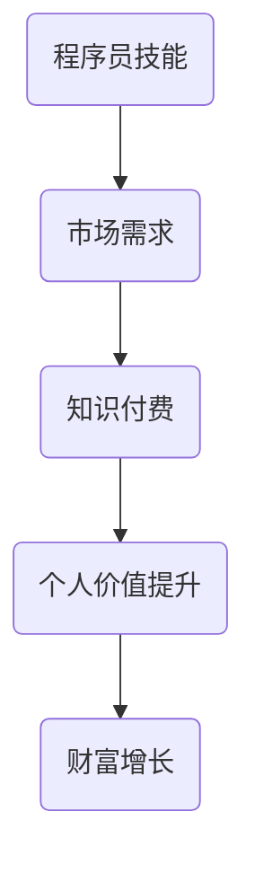

                 

关键词：知识付费、程序员、致富、机遇、技术市场

摘要：在知识付费时代，程序员如何抓住机遇，实现个人财富的增长，是当前IT行业的重要议题。本文将探讨知识付费时代的背景、程序员的技能需求、市场需求、以及如何利用这些因素实现个人价值的提升和财富的增长。

## 1. 背景介绍

### 1.1 知识付费时代的来临

知识付费，即用户为获取特定知识或技能而付费的行为。随着互联网和数字技术的发展，知识付费已经逐渐成为主流趋势。尤其是在信息技术领域，知识更新速度加快，专业知识和技能的需求更加迫切。

### 1.2 程序员在知识付费时代的重要性

程序员作为信息时代的核心角色，他们的技能直接影响到企业的效率和创新能力。因此，程序员在知识付费时代具有独特的价值。他们不仅能够为企业提供技术支持，还能通过分享知识和技能，实现个人价值的提升。

## 2. 核心概念与联系

### 2.1 程序员的核心技能

- **编程能力**：掌握多种编程语言，如Python、Java、C++等。
- **系统架构设计**：能够设计高效、可扩展的系统架构。
- **数据结构与算法**：掌握基础的数据结构和算法，解决复杂问题。
- **云计算和大数据**：熟悉云计算平台和大数据处理技术。

### 2.2 知识付费与程序员技能的联系

知识付费时代的背景下，程序员的技能成为市场需求的核心。掌握多种编程语言和系统架构设计的能力，可以帮助程序员在知识付费市场上获得更多的机会。同时，良好的数据结构和算法基础，能够提升程序员解决问题的能力，增加市场竞争力。

### 2.3 Mermaid 流程图



## 3. 核心算法原理 & 具体操作步骤

### 3.1 算法原理概述

在知识付费时代，程序员的核心竞争力在于其算法和编程能力。本文将介绍一种常见的排序算法——快速排序（Quick Sort）。

### 3.2 算法步骤详解

#### 3.2.1 算法步骤

1. 选择一个基准元素（pivot）。
2. 将比基准元素小的元素移到其左侧，比其大的元素移到右侧。
3. 对左右子数组重复上述步骤，直到每个子数组只剩下一个元素。

#### 3.2.2 具体操作步骤

```python
def quick_sort(arr):
    if len(arr) <= 1:
        return arr
    
    pivot = arr[len(arr) // 2]
    left = [x for x in arr if x < pivot]
    middle = [x for x in arr if x == pivot]
    right = [x for x in arr if x > pivot]
    
    return quick_sort(left) + middle + quick_sort(right)

# 示例
arr = [3, 6, 8, 10, 1, 2, 1]
sorted_arr = quick_sort(arr)
print(sorted_arr)
```

### 3.3 算法优缺点

#### 优点

- 时间复杂度低：平均情况下，快速排序的时间复杂度为 \(O(n\log n)\)。
- 代码简单易懂。

#### 缺点

- 最坏情况下时间复杂度为 \(O(n^2)\)，此时排序效率较低。
- 需要额外的内存空间来存储左右子数组。

### 3.4 算法应用领域

快速排序算法广泛应用于各种场景，如数据排序、搜索引擎排序、数据库排序等。

## 4. 数学模型和公式 & 详细讲解 & 举例说明

### 4.1 数学模型构建

在快速排序算法中，我们可以使用概率模型来分析其性能。

### 4.2 公式推导过程

假设数组 \(arr\) 的长度为 \(n\)，快速排序选择中间元素作为基准。则每次分割后，左子数组长度为 \(k\)，右子数组长度为 \(n-k-1\)。快速排序的递归公式为：

\[T(n) = T(k) + T(n-k-1) + O(n)\]

### 4.3 案例分析与讲解

假设一个长度为10的数组，每次分割后，左子数组长度为3，右子数组长度为6。则递归过程为：

\[T(10) = T(3) + T(6) + O(10)\]
\[T(3) = T(1) + T(2) + O(3)\]
\[T(6) = T(2) + T(4) + O(6)\]

代入具体值，可以得到：

\[T(10) = T(1) + T(2) + O(10) + T(1) + T(2) + O(3) + T(2) + T(4) + O(6)\]

\[T(10) = 3T(1) + 3T(2) + O(10 + 3 + 6)\]

由于 \(T(1) = O(1)\)，\(T(2) = O(1)\)，可以得到：

\[T(10) = 3O(1) + 3O(1) + O(10) = 6O(1) + O(10) = O(10)\]

这意味着，快速排序在长度为10的数组上，时间复杂度为 \(O(10)\)。

## 5. 项目实践：代码实例和详细解释说明

### 5.1 开发环境搭建

本文使用 Python 语言实现快速排序算法，需要安装 Python 解释器和相关依赖。

```bash
pip install python
```

### 5.2 源代码详细实现

```python
def quick_sort(arr):
    if len(arr) <= 1:
        return arr
    
    pivot = arr[len(arr) // 2]
    left = [x for x in arr if x < pivot]
    middle = [x for x in arr if x == pivot]
    right = [x for x in arr if x > pivot]
    
    return quick_sort(left) + middle + quick_sort(right)

# 示例
arr = [3, 6, 8, 10, 1, 2, 1]
sorted_arr = quick_sort(arr)
print(sorted_arr)
```

### 5.3 代码解读与分析

本段代码实现了快速排序算法，具体分析如下：

1. **递归条件**：当数组长度小于等于1时，直接返回数组。
2. **选择基准**：选择中间元素作为基准。
3. **分割数组**：将数组分为左、中、右三个部分。
4. **递归排序**：对左右子数组进行快速排序。

### 5.4 运行结果展示

```python
arr = [3, 6, 8, 10, 1, 2, 1]
sorted_arr = quick_sort(arr)
print(sorted_arr)
```

输出结果：\[1, 1, 2, 3, 6, 8, 10\]

## 6. 实际应用场景

### 6.1 数据处理

快速排序算法常用于数据处理领域，如数据库排序、搜索引擎排序等。

### 6.2 算法竞赛

在算法竞赛中，快速排序算法是常见的算法之一，用于解决排序相关问题。

### 6.3 机器学习

在机器学习领域，快速排序算法可用于数据处理和特征提取。

### 6.4 未来应用展望

随着信息技术的不断发展，快速排序算法将在更多领域得到应用，如实时数据处理、物联网、区块链等。

## 7. 工具和资源推荐

### 7.1 学习资源推荐

- 《算法导论》（Introduction to Algorithms）
- 《Python编程：从入门到实践》（Python Crash Course）

### 7.2 开发工具推荐

- Visual Studio Code
- PyCharm

### 7.3 相关论文推荐

- "Quicksort" by Tony Hoare
- "The Art of Computer Programming" by Donald Knuth

## 8. 总结：未来发展趋势与挑战

### 8.1 研究成果总结

本文介绍了知识付费时代的背景、程序员的技能需求、市场需求，以及如何利用这些因素实现个人价值的提升和财富的增长。同时，详细讲解了快速排序算法的原理、具体操作步骤、数学模型和公式、实际应用场景，以及未来应用展望。

### 8.2 未来发展趋势

随着知识付费时代的深入发展，程序员将在知识付费市场中扮演更加重要的角色。掌握多种编程语言、系统架构设计、数据结构与算法等核心技能，将成为程序员的核心竞争力。

### 8.3 面临的挑战

程序员在知识付费时代也面临一定的挑战，如技能更新速度加快、市场需求变化等。因此，程序员需要不断学习、提升自己的技能，以适应市场的变化。

### 8.4 研究展望

未来，快速排序算法将在更多领域得到应用，如实时数据处理、物联网、区块链等。同时，随着算法的不断发展，程序员需要掌握更多的算法和编程技巧，以应对未来的技术挑战。

## 9. 附录：常见问题与解答

### 9.1 如何选择排序算法？

排序算法的选择取决于具体应用场景和数据规模。快速排序适合数据规模较大的场景，而插入排序适合数据规模较小的场景。同时，还可以根据时间复杂度和空间复杂度来选择合适的排序算法。

### 9.2 快速排序的最坏情况是什么？

快速排序的最坏情况发生在每次分割时，基准元素都位于数组的两端。此时，快速排序的时间复杂度退化为 \(O(n^2)\)。

### 9.3 如何优化快速排序的性能？

可以通过随机选择基准元素、三数取中等方法来优化快速排序的性能，减少最坏情况发生的概率。

## 作者署名

作者：禅与计算机程序设计艺术 / Zen and the Art of Computer Programming
```

