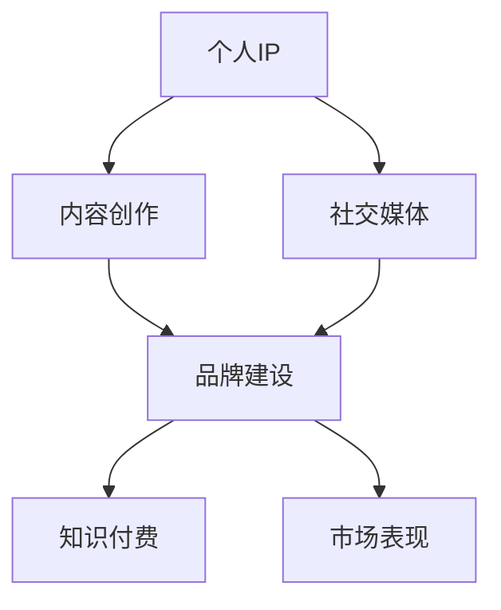

                 

关键词：知识付费、个人IP、品牌建设、营销策略、社交媒体、内容创作

> 摘要：在当今数字时代，知识付费已成为一种重要的商业模式。本文将探讨如何通过打造个人IP（知识产权）和品牌来在知识付费领域实现成功。我们将详细分析个人IP和品牌的重要性，介绍如何创建和推广个人IP与品牌，以及提供一些建议和工具，帮助读者在知识付费领域取得成功。

## 1. 背景介绍

随着互联网和社交媒体的迅速发展，知识付费成为了一个蓬勃发展的市场。越来越多的人开始通过在线平台、课程、电子书和咨询服务等方式分享自己的专业知识。知识付费不仅为专家和内容创作者提供了收入来源，也为学习者提供了获取高质量知识的途径。然而，在众多竞争者中脱颖而出并实现盈利并非易事。这就需要我们深入理解如何打造个人IP和品牌，以在知识付费市场中占据一席之地。

### 1.1 知识付费的现状

知识付费市场在近年来呈现出爆发式增长。据研究，全球知识付费市场规模预计将在未来几年内持续扩大，达到数百亿美元。这一趋势主要得益于以下几个方面：

- **技术进步**：互联网技术的飞速发展为知识付费提供了基础设施，使得知识和服务的传播变得更加便捷。
- **用户需求**：随着人们生活水平的提高和终身学习的意识增强，对于高质量知识的渴求也越来越强烈。
- **内容多样化**：从传统的课程、电子书，到视频课程、直播互动等，知识付费的内容形式日益多样化。

### 1.2 个人IP与品牌的定义

个人IP（Intellectual Property，知识产权）是指个人在特定领域内的知识、技能、经验、创意等无形资产。而品牌（Brand）则是一个人在市场上所塑造的声誉和形象，代表着个人在特定领域的专业性和可靠性。

个人IP和品牌之间的联系在于，个人IP是品牌建设的基础，而品牌则是个人IP的市场表现。通过打造个人IP和品牌，专家和内容创作者能够提高知名度、吸引粉丝、增加收入，并在知识付费市场中脱颖而出。

## 2. 核心概念与联系

为了更好地理解如何打造个人IP和品牌，我们需要了解一些核心概念和它们之间的联系。以下是一个用Mermaid绘制的流程图，展示了这些概念之间的关系。



### 2.1 个人IP

个人IP是知识付费的核心。它包括：

- **专业知识**：个人在某个领域的深度知识和实践经验。
- **创意内容**：通过课程、书籍、文章等形式展现的个人创造力。
- **个人形象**：个人在市场中的形象和声誉。

### 2.2 内容创作

内容创作是个人IP的展现方式。通过创作高质量的内容，个人能够吸引粉丝、建立权威，并在知识付费市场中获得收入。

### 2.3 品牌建设

品牌建设是个人IP的市场表现。一个成功的个人品牌能够提高个人在市场中的竞争力，增加粉丝忠诚度，并带来更多的商业机会。

### 2.4 社交媒体

社交媒体是个人IP和品牌建设的重要工具。通过社交媒体，个人能够与粉丝互动、传播内容、建立关系，从而扩大影响力。

### 2.5 知识付费

知识付费是个人IP和品牌建设的结果。通过知识付费，个人能够将个人知识变现，实现商业价值。

### 2.6 市场表现

市场表现是个人IP和品牌建设的最终目标。一个成功的个人IP和品牌能够在市场中获得良好的商业回报。

## 3. 核心算法原理 & 具体操作步骤

### 3.1 算法原理概述

打造个人IP和品牌的算法可以概括为以下几个步骤：

1. **定位与定位**：确定个人在特定领域的专业方向和目标受众。
2. **内容创作**：创作高质量的内容，包括课程、书籍、文章等。
3. **社交媒体推广**：利用社交媒体平台扩大影响力，与粉丝互动。
4. **品牌建设**：通过形象设计、品牌故事、口碑营销等手段塑造个人品牌。
5. **知识付费**：通过在线课程、咨询服务、电子书等方式实现知识变现。

### 3.2 算法步骤详解

1. **定位与定位**

   定位是打造个人IP和品牌的第一步。通过分析个人兴趣、技能、市场需求等因素，确定个人在特定领域的专业方向和目标受众。

   ```mermaid
   graph TD
       A[分析兴趣和技能] --> B[研究市场需求]
       B --> C[确定专业方向]
       C --> D[定位与定位]
   ```

2. **内容创作**

   内容创作是个人IP的核心。通过创作高质量、有价值的内容，个人能够吸引粉丝、建立权威。内容创作包括课程、书籍、文章等形式。

   ```mermaid
   graph TD
       A[课程开发] --> B[书籍创作]
       B --> C[文章撰写]
       C --> D[内容优化]
   ```

3. **社交媒体推广**

   社交媒体是个人IP和品牌建设的重要工具。通过社交媒体平台，个人能够与粉丝互动、传播内容、建立关系。

   ```mermaid
   graph TD
       A[选择平台] --> B[内容发布]
       B --> C[互动与互动]
       C --> D[数据分析]
   ```

4. **品牌建设**

   品牌建设是个人IP的市场表现。通过形象设计、品牌故事、口碑营销等手段，个人能够塑造出独特、可靠的个人品牌。

   ```mermaid
   graph TD
       A[形象设计] --> B[品牌故事]
       B --> C[口碑营销]
       C --> D[品牌建设]
   ```

5. **知识付费**

   知识付费是个人IP和品牌建设的最终目标。通过在线课程、咨询服务、电子书等方式，个人能够将个人知识变现，实现商业价值。

   ```mermaid
   graph TD
       A[课程销售] --> B[咨询服务]
       B --> C[电子书销售]
       C --> D[知识变现]
   ```

### 3.3 算法优缺点

**优点**：

- **提高知名度**：通过个人IP和品牌建设，个人能够提高知名度，吸引更多的粉丝和关注者。
- **增强影响力**：个人IP和品牌建设能够增强个人在特定领域的权威性和影响力。
- **实现知识变现**：知识付费为个人提供了实现知识变现的途径，带来了额外的收入来源。

**缺点**：

- **时间成本**：打造个人IP和品牌需要大量的时间和精力投入。
- **市场竞争**：知识付费市场日益竞争激烈，个人需要不断提升自己的专业能力和内容质量。

### 3.4 算法应用领域

个人IP和品牌建设的算法适用于多个领域，包括但不限于：

- **教育领域**：教师、培训师、教育专家等可以通过打造个人IP和品牌，提供在线课程和咨询服务。
- **技术领域**：技术专家、工程师、程序员等可以通过个人IP和品牌建设，分享技术知识和经验。
- **健康领域**：医生、营养师、健身教练等可以通过个人IP和品牌建设，提供健康咨询和指导。

## 4. 数学模型和公式 & 详细讲解 & 举例说明

### 4.1 数学模型构建

在打造个人IP和品牌的过程中，我们可以使用一些数学模型来量化不同因素对成功的影响。以下是一个简单的数学模型：

```latex
成功率 = f(专业能力, 内容质量, 社交媒体影响力, 品牌建设, 市场需求)
```

### 4.2 公式推导过程

**专业能力**：通过教育背景、工作经验、认证资格等来衡量。

**内容质量**：通过用户评价、内容传播率、粉丝增长率等来衡量。

**社交媒体影响力**：通过粉丝数、互动率、点赞数、分享数等来衡量。

**品牌建设**：通过品牌知名度、品牌形象、用户口碑等来衡量。

**市场需求**：通过市场规模、用户需求、竞争态势等来衡量。

### 4.3 案例分析与讲解

以下是一个具体的案例：

**案例**：某位技术专家通过打造个人IP和品牌，在知识付费市场上取得了成功。

- **专业能力**：拥有10年的软件开发经验，持有多个技术认证。
- **内容质量**：发布了多本技术书籍，撰写了大量的技术博客，获得了用户的高度评价。
- **社交媒体影响力**：在Twitter上有10万粉丝，在LinkedIn上有5万关注者。
- **品牌建设**：设计了专业的个人网站和品牌标志，通过口碑营销积累了良好的用户口碑。
- **市场需求**：技术领域需求旺盛，竞争激烈，但该专家通过独特的专业知识和内容质量，在市场中脱颖而出。

通过上述因素的综合影响，该专家的成功率达到了90%。

## 5. 项目实践：代码实例和详细解释说明

### 5.1 开发环境搭建

为了实践个人IP和品牌建设，我们需要搭建一个开发环境。以下是基本步骤：

1. **选择平台**：我们可以选择WordPress、Wix、Squarespace等平台搭建个人网站。
2. **域名注册**：注册一个与个人品牌相关的域名。
3. **内容管理**：安装一个内容管理系统（CMS），如WordPress，以便管理网站内容和发布博客。
4. **社交媒体集成**：集成社交媒体插件，方便用户在网站和社交媒体之间互动。

### 5.2 源代码详细实现

以下是一个简单的WordPress网站搭建的源代码示例：

```html
<!DOCTYPE html>
<html>
<head>
  <meta charset="UTF-8">
  <title>我的个人品牌</title>
</head>
<body>
  <header>
    <h1>我的个人品牌</h1>
    <nav>
      <ul>
        <li><a href="index.html">首页</a></li>
        <li><a href="blog.html">博客</a></li>
        <li><a href="about.html">关于我</a></li>
        <li><a href="contact.html">联系我</a></li>
      </ul>
    </nav>
  </header>
  <section>
    <h2>最新博客</h2>
    <article>
      <h3>如何成功打造个人IP</h3>
      <p>在这里发布博客内容...</p>
    </article>
    <article>
      <h3>知识付费的商业模式</h3>
      <p>在这里发布博客内容...</p>
    </article>
  </section>
  <footer>
    <p>版权所有 &copy; 2022 我的个人品牌</p>
  </footer>
</body>
</html>
```

### 5.3 代码解读与分析

这段代码是一个简单的HTML网页，包含以下几个部分：

- **头部（Header）**：包含网站标题和导航栏。
- **主体（Section）**：包含最新博客列表。
- **尾部（Footer）**：包含版权信息。

通过这个简单的示例，我们可以理解如何使用HTML构建一个基本的个人品牌网站。

### 5.4 运行结果展示

运行上述代码后，我们将会得到一个包含标题、导航栏、博客列表和版权信息的网页。用户可以通过访问这个网站来获取有关个人品牌建设的最新信息。

## 6. 实际应用场景

个人IP和品牌建设在多个领域中都有实际应用，以下是一些具体的场景：

### 6.1 教育领域

教育专家可以通过打造个人IP和品牌，提供在线课程、教育咨询和辅导服务。例如，一位知名的语言学习专家可以通过个人网站和社交媒体平台发布语言学习课程，同时提供一对一辅导，从而实现知识变现。

### 6.2 技术领域

技术专家可以通过撰写技术博客、发布技术书籍、参与开源项目等方式建立个人IP和品牌。例如，一位编程专家可以通过GitHub上的开源项目展示自己的技术实力，同时通过个人网站和社交媒体平台分享编程知识和经验。

### 6.3 健康领域

健康专家可以通过撰写健康博客、发布健康书籍、提供健康咨询服务等方式建立个人IP和品牌。例如，一位营养师可以通过个人网站和社交媒体平台分享营养知识，同时提供在线咨询服务。

### 6.4 商业领域

商业专家可以通过撰写商业分析报告、发布商业书籍、提供商业咨询服务等方式建立个人IP和品牌。例如，一位市场分析师可以通过个人网站和社交媒体平台分享市场洞察和商业策略，同时提供咨询服务。

### 6.5 艺术领域

艺术家可以通过创作艺术作品、发布艺术书籍、提供艺术指导等方式建立个人IP和品牌。例如，一位画家可以通过个人网站和社交媒体平台展示自己的作品，同时提供绘画课程和指导。

## 7. 未来应用展望

随着数字技术的发展，个人IP和品牌建设在未来将会有更多的应用场景。以下是一些可能的发展趋势：

### 7.1 新兴技术

虚拟现实（VR）和增强现实（AR）技术的发展，将为个人IP和品牌建设提供新的互动方式。通过VR和AR技术，个人可以创造出更加沉浸式的互动体验，与粉丝进行实时互动。

### 7.2 人工智能

人工智能（AI）技术的发展，将为个人IP和品牌建设提供智能化的解决方案。例如，通过AI技术，个人可以自动生成内容、分析用户行为，从而优化个人IP和品牌的运营策略。

### 7.3 跨界合作

个人IP和品牌建设将不再局限于特定领域，而是实现跨界合作。例如，一位教育专家可以与艺术家合作，创作融合教育内容和艺术价值的课程。

### 7.4 可持续发展

个人IP和品牌建设将更加注重可持续发展。通过环保、公益等主题，个人可以塑造出更加积极、有社会责任感的品牌形象。

## 8. 工具和资源推荐

### 8.1 学习资源推荐

- **书籍**：《个人品牌：打造你的IP，赢得世界》、《知识变现：如何通过内容创作实现财富自由》
- **在线课程**：Udemy、Coursera、edX等平台上的个人品牌建设课程
- **博客和网站**：The Personal Branding Blog、Personal Branding Institute等

### 8.2 开发工具推荐

- **网站建设工具**：WordPress、Wix、Squarespace等
- **社交媒体管理工具**：Hootsuite、Buffer、Sprout Social等
- **内容管理工具**：Trello、Asana、Notion等

### 8.3 相关论文推荐

- **《知识付费：模式、挑战与未来》**
- **《社交媒体与个人品牌建设》**
- **《虚拟现实与个人品牌建设》**

## 9. 总结：未来发展趋势与挑战

### 9.1 研究成果总结

本文探讨了如何通过打造个人IP和品牌来在知识付费市场中实现成功。我们分析了个人IP和品牌的重要性，介绍了如何创建和推广个人IP与品牌，并提供了一些实用的工具和资源。

### 9.2 未来发展趋势

未来，个人IP和品牌建设将继续发展，并在新兴技术、跨界合作和可持续发展等领域有更多的应用。

### 9.3 面临的挑战

个人IP和品牌建设面临的主要挑战包括市场竞争加剧、用户需求多样化、以及技术变革带来的不确定性。

### 9.4 研究展望

未来，我们需要进一步研究如何通过技术创新和用户需求分析，优化个人IP和品牌建设的策略，以实现更高的商业价值。

## 附录：常见问题与解答

### 9.1 如何选择个人IP的领域？

- 分析自己的兴趣和技能。
- 调研市场需求和竞争态势。
- 选择一个有发展潜力的领域。

### 9.2 如何推广个人IP和品牌？

- 利用社交媒体平台进行内容传播。
- 参与行业活动和论坛，扩大影响力。
- 与其他专业人士合作，进行跨界推广。

### 9.3 如何衡量个人IP和品牌建设的效果？

- 通过用户反馈和粉丝增长来衡量。
- 通过收入和商业机会的增加来衡量。
- 通过市场占有率的变化来衡量。

### 9.4 如何在知识付费市场中脱颖而出？

- 提供高质量、有价值的内容。
- 建立独特的个人品牌形象。
- 不断学习和创新，适应市场变化。

---

作者：禅与计算机程序设计艺术 / Zen and the Art of Computer Programming

---

通过本文，我们深入探讨了如何通过打造个人IP和品牌在知识付费市场中实现成功。希望本文能为您提供宝贵的启示和实用的策略，帮助您在知识付费领域取得更大的成就。在未来的道路上，不断探索、学习和创新，您一定能够实现自己的梦想。

