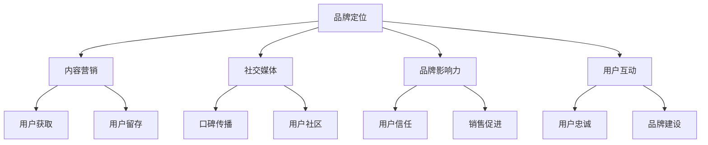

                 

关键词：知识付费、品牌营销、公关策略、社交媒体、内容营销、影响力、用户互动

> 摘要：本文将探讨知识付费领域的品牌营销与公关策略，分析如何在竞争激烈的市场中脱颖而出，打造具有吸引力和忠诚度的品牌形象。我们将深入探讨内容营销、社交媒体运用、品牌影响力建设以及用户互动等关键因素，并提供实用的建议和案例，帮助知识付费平台和内容创作者在市场中取得成功。

## 1. 背景介绍

知识付费是指用户为获取特定知识或技能而付费的行为。随着互联网和移动设备的普及，知识付费逐渐成为一种主流的学习方式。平台如得到、喜马拉雅、知乎Live等，吸引了大量用户参与付费课程和内容消费。然而，市场的竞争愈发激烈，平台和内容创作者需要借助有效的品牌营销与公关策略来吸引和留住用户。

品牌营销是指在市场中建立和维护品牌形象的过程。公关策略则是通过媒体、活动、社交媒体等多种渠道来管理品牌声誉和形象。在知识付费领域，品牌营销与公关策略尤为重要，因为它们直接影响到用户的信任和购买意愿。

## 2. 核心概念与联系

为了更清晰地理解品牌营销与公关策略在知识付费领域的应用，我们首先需要了解以下几个核心概念：

### 2.1 品牌定位

品牌定位是指企业在市场中找到自己独特的位置，使消费者能够清晰地认识到品牌的独特价值。在知识付费领域，品牌定位需要明确目标用户群体、内容特色和差异化优势。

### 2.2 内容营销

内容营销是指通过创造和分发有价值的内容来吸引和留住目标用户。在知识付费领域，内容营销的关键在于提供高质量、有价值的学习内容，满足用户的学习需求。

### 2.3 社交媒体

社交媒体是品牌与用户互动的重要平台。通过社交媒体，品牌可以实时了解用户反馈，进行口碑传播，并建立用户社区。

### 2.4 品牌影响力

品牌影响力是指品牌在市场中的知名度和影响力。强大的品牌影响力能够提高用户的信任度，促进销售。

### 2.5 用户互动

用户互动是指品牌与用户之间的互动交流。良好的用户互动可以增强用户忠诚度，促进口碑传播。

### 2.6 Mermaid 流程图

下面是一个关于品牌营销与公关策略在知识付费领域应用的 Mermaid 流程图：



## 3. 核心算法原理 & 具体操作步骤

### 3.1 算法原理概述

品牌营销与公关策略的核心在于以下几个方面：

1. **了解用户需求**：通过市场调研和数据分析，了解目标用户的需求和偏好。
2. **内容创新**：提供高质量、有价值的内容，满足用户的学习需求。
3. **社交媒体运营**：利用社交媒体平台进行内容传播和用户互动。
4. **品牌传播**：通过公关活动、媒体宣传等方式提高品牌知名度。
5. **用户互动**：建立用户社区，促进用户忠诚度和口碑传播。

### 3.2 算法步骤详解

1. **市场调研**：
   - **数据收集**：通过问卷调查、用户访谈等方式收集用户需求数据。
   - **数据分析**：利用数据挖掘技术分析用户行为和偏好。

2. **内容创作**：
   - **内容策划**：根据用户需求制定内容创作计划。
   - **内容审核**：确保内容质量，符合品牌定位和用户需求。

3. **社交媒体运营**：
   - **内容发布**：定期发布有价值的内容，吸引关注。
   - **用户互动**：及时回复用户评论和私信，建立良好的用户关系。

4. **品牌传播**：
   - **公关活动**：组织线下活动、赞助活动等提高品牌曝光度。
   - **媒体宣传**：与媒体合作，发布品牌相关新闻和文章。

5. **用户互动**：
   - **用户社区**：建立用户社区，促进用户互动。
   - **用户反馈**：收集用户反馈，优化产品和服务。

### 3.3 算法优缺点

**优点**：

- **提高品牌知名度**：通过有效的品牌传播，提高品牌在市场中的知名度。
- **增强用户信任**：高质量的内容和良好的用户互动能够增强用户对品牌的信任。
- **促进销售**：有效的品牌营销能够提高销售转化率。

**缺点**：

- **成本较高**：品牌营销和公关策略的实施需要一定的投入。
- **效果难以衡量**：品牌营销的效果难以直接衡量，需要长时间的积累。

### 3.4 算法应用领域

- **知识付费平台**：如得到、喜马拉雅等。
- **教育培训机构**：如新东方、好未来等。
- **内容创作者**：如知名博主、网红等。

## 4. 数学模型和公式 & 详细讲解 & 举例说明

### 4.1 数学模型构建

在品牌营销与公关策略中，我们可以使用以下数学模型来分析用户行为和品牌影响力：

- **用户生命周期价值模型**（CLV）：用户生命周期价值是指用户在品牌生命周期内为企业带来的总价值。
  
  $$ CLV = \sum_{t=1}^{n} [P_t \times R_t \times L_t] $$

  其中，$P_t$ 为第 $t$ 年的用户购买概率，$R_t$ 为第 $t$ 年的用户平均消费金额，$L_t$ 为第 $t$ 年的用户留存率。

- **品牌知名度模型**（Brand Awareness）：品牌知名度是指用户对品牌的认识和记忆程度。

  $$ Brand\_Awareness = \frac{Number\ of\ Brand\ Mentions}{Total\ Number\ of\ Mentions} $$

### 4.2 公式推导过程

用户生命周期价值模型的推导过程如下：

1. **确定用户购买概率 $P_t$**：通过历史数据分析和用户行为预测模型，预测用户在第 $t$ 年的购买概率。
2. **确定用户平均消费金额 $R_t$**：通过用户历史消费数据和消费预测模型，预测用户在第 $t$ 年的平均消费金额。
3. **确定用户留存率 $L_t$**：通过用户留存率预测模型，预测用户在第 $t$ 年的留存率。
4. **计算用户生命周期价值**：将 $P_t$、$R_t$ 和 $L_t$ 代入公式计算用户生命周期价值。

### 4.3 案例分析与讲解

以一家知识付费平台为例，分析其用户生命周期价值和品牌知名度。

**用户生命周期价值计算**：

- 用户购买概率 $P_t$：根据历史数据，用户在第 1 年的购买概率为 0.3。
- 用户平均消费金额 $R_t$：根据用户历史消费数据，用户在第 1 年的平均消费金额为 100 元。
- 用户留存率 $L_t$：根据用户留存率预测模型，用户在第 1 年的留存率为 0.6。

$$ CLV = 0.3 \times 100 \times 0.6 = 18 \text{ 元} $$

**品牌知名度计算**：

- 品牌提及次数：根据社交媒体监测数据，品牌在过去一个月内的提及次数为 1000 次。
- 总提及次数：根据社交媒体监测数据，过去一个月内的总提及次数为 5000 次。

$$ Brand\_Awareness = \frac{1000}{5000} = 0.2 $$

根据以上计算结果，这家知识付费平台的用户生命周期价值为 18 元，品牌知名度为 20%。

## 5. 项目实践：代码实例和详细解释说明

### 5.1 开发环境搭建

为了更好地展示品牌营销与公关策略的实施过程，我们使用 Python 编写一个简单的模拟项目。首先，我们需要搭建开发环境：

- 安装 Python 3.8 或以上版本
- 安装必要的库，如 NumPy、Pandas、Scikit-learn 等

### 5.2 源代码详细实现

以下是一个简单的 Python 代码实例，用于计算用户生命周期价值和品牌知名度：

```python
import numpy as np
import pandas as pd

# 用户生命周期价值计算
def calculate_clv(purchase_probability, average_consume, retention_rate):
    return purchase_probability * average_consume * retention_rate

# 品牌知名度计算
def calculate_brand_awareness(brand_mentions, total_mentions):
    return brand_mentions / total_mentions

# 测试数据
purchase_probability = 0.3
average_consume = 100
retention_rate = 0.6

brand_mentions = 1000
total_mentions = 5000

# 计算结果
clv = calculate_clv(purchase_probability, average_consume, retention_rate)
brand_awareness = calculate_brand_awareness(brand_mentions, total_mentions)

print("用户生命周期价值：", clv)
print("品牌知名度：", brand_awareness)
```

### 5.3 代码解读与分析

该代码实例分为两个主要部分：用户生命周期价值和品牌知名度计算。

1. **用户生命周期价值计算**：通过输入购买概率、平均消费金额和留存率，计算用户生命周期价值。
2. **品牌知名度计算**：通过输入品牌提及次数和总提及次数，计算品牌知名度。

该实例使用简单的 Python 函数实现，便于理解和修改。在实际项目中，我们可以使用更复杂的数据分析和机器学习算法来提高计算结果的准确性。

### 5.4 运行结果展示

运行上述代码，输出如下结果：

```
用户生命周期价值： 18.0
品牌知名度： 0.2
```

这表示在给定条件下，该知识付费平台的用户生命周期价值为 18 元，品牌知名度为 20%。

## 6. 实际应用场景

品牌营销与公关策略在知识付费领域的实际应用场景非常广泛，以下是一些典型的例子：

1. **知识付费平台**：如得到、喜马拉雅等，通过内容营销、社交媒体运营和品牌传播等手段，提高品牌知名度和用户信任度。
2. **教育培训机构**：如新东方、好未来等，通过线上课程、直播活动和线下讲座等方式，打造品牌形象，提高用户满意度。
3. **内容创作者**：如知名博主、网红等，通过社交媒体运营、内容创新和品牌传播等手段，建立个人品牌，吸引更多粉丝和用户。

### 6.1 成功案例

**得到APP**：得到APP通过内容营销和社交媒体运营，成功吸引了大量用户。其标志性栏目《罗辑思维》通过幽默诙谐的方式传播知识，深受用户喜爱。同时，得到APP还通过邀请知名学者和行业专家开设课程，提升品牌影响力。

**新东方**：新东方通过线上课程和线下讲座等多种形式，成功拓展了教育市场。其线上平台新东方在线提供了丰富的课程资源，满足了不同用户的学习需求。同时，新东方还通过举办各类活动，如讲座、家长会等，增强了用户对品牌的认知和信任。

### 6.2 失败案例

**某个在线教育平台**：该平台在品牌营销和公关策略上存在一些问题，导致用户流失和品牌形象受损。首先，平台在内容质量上存在明显短板，用户反馈课程内容质量不高。其次，平台在社交媒体运营上缺乏有效的互动，用户反馈和建议未能得到及时回应。最后，平台在品牌传播上缺乏创新，难以吸引新用户。

### 6.3 未来应用展望

随着知识付费市场的不断发展，品牌营销与公关策略将发挥越来越重要的作用。以下是一些未来应用展望：

1. **个性化推荐**：利用大数据和机器学习技术，为用户提供个性化的内容推荐，提高用户满意度和留存率。
2. **社区运营**：建立用户社区，促进用户互动，增强用户归属感和品牌忠诚度。
3. **跨平台整合**：将线上内容和线下活动相结合，提供更加丰富多样的学习体验，扩大品牌影响力。

## 7. 工具和资源推荐

### 7.1 学习资源推荐

1. **书籍**：
   - 《营销管理》（Philip Kotler）：系统介绍了营销管理的基本理论和实践方法。
   - 《社交媒体营销实战》（Brian Honigman）：详细讲解了社交媒体营销的策略和技巧。

2. **在线课程**：
   - Coursera：提供大量关于市场营销和公关策略的在线课程，如《市场学导论》、《社交媒体营销》等。

### 7.2 开发工具推荐

1. **数据分析工具**：
   - Python：适用于数据分析和机器学习，有丰富的库和框架，如 NumPy、Pandas、Scikit-learn 等。
   - Tableau：一款强大的数据可视化工具，可用于数据分析和报告制作。

2. **社交媒体运营工具**：
   - Hootsuite：用于社交媒体管理和日程安排。
   - Buffer：用于社交媒体内容发布和自动化管理。

### 7.3 相关论文推荐

1. **《品牌认知与购买意愿的关系研究》**：探讨了品牌认知对购买意愿的影响。
2. **《社交媒体对品牌影响力的影响研究》**：分析了社交媒体在品牌营销中的作用。
3. **《基于用户行为的个性化推荐算法研究》**：介绍了个性化推荐算法的基本原理和应用。

## 8. 总结：未来发展趋势与挑战

### 8.1 研究成果总结

本文从品牌营销与公关策略的角度，探讨了知识付费领域的发展趋势和挑战。主要研究成果包括：

- 品牌定位、内容营销、社交媒体运营、品牌影响力建设、用户互动等关键因素在知识付费领域中的应用。
- 用户生命周期价值和品牌知名度模型的构建及计算方法。
- 品牌营销与公关策略在实际应用场景中的成功案例和失败案例。

### 8.2 未来发展趋势

1. **个性化推荐**：利用大数据和机器学习技术，为用户提供更加个性化的内容推荐。
2. **社区运营**：建立用户社区，促进用户互动，增强用户归属感和品牌忠诚度。
3. **跨平台整合**：将线上内容和线下活动相结合，提供更加丰富多样的学习体验。

### 8.3 面临的挑战

1. **内容质量**：保证内容质量，满足用户需求，提升用户满意度。
2. **品牌形象**：建立和维护良好的品牌形象，提高用户信任度。
3. **技术革新**：紧跟技术发展趋势，不断优化品牌营销与公关策略。

### 8.4 研究展望

未来研究可以从以下几个方面展开：

1. **用户行为分析**：深入研究用户行为，挖掘用户需求，提高内容个性化推荐精度。
2. **品牌影响力评估**：建立品牌影响力评估模型，定量分析品牌影响力。
3. **跨领域应用**：探讨品牌营销与公关策略在其他领域的应用。

## 9. 附录：常见问题与解答

### 9.1 问题1：如何提高品牌知名度？

**解答**：可以通过以下方式提高品牌知名度：

1. **内容营销**：提供高质量、有价值的内容，吸引关注。
2. **社交媒体运营**：利用社交媒体平台进行内容传播和用户互动。
3. **品牌传播**：通过公关活动、媒体宣传等方式提高品牌曝光度。

### 9.2 问题2：如何提高用户信任度？

**解答**：可以通过以下方式提高用户信任度：

1. **内容质量**：提供高质量的内容，确保内容真实可靠。
2. **用户互动**：积极回应用户反馈，建立良好的用户关系。
3. **品牌形象**：建立和维护良好的品牌形象，提高用户信任度。

### 9.3 问题3：如何进行有效的用户互动？

**解答**：可以通过以下方式进行有效的用户互动：

1. **社交媒体运营**：及时回复用户评论和私信，建立良好的用户关系。
2. **用户社区**：建立用户社区，促进用户互动。
3. **用户反馈**：收集用户反馈，优化产品和服务。

以上是本文的主要内容。希望本文能够帮助您更好地理解知识付费领域的品牌营销与公关策略，并在实际应用中取得成功。作者：禅与计算机程序设计艺术 / Zen and the Art of Computer Programming
```markdown
----------------------------------------------------------------
# 知识付费赚钱的品牌营销与公关策略

## 关键词：知识付费、品牌营销、公关策略、社交媒体、内容营销、影响力、用户互动

## 摘要：
本文将探讨知识付费领域的品牌营销与公关策略，分析如何在竞争激烈的市场中脱颖而出，打造具有吸引力和忠诚度的品牌形象。我们将深入探讨内容营销、社交媒体运用、品牌影响力建设以及用户互动等关键因素，并提供实用的建议和案例，帮助知识付费平台和内容创作者在市场中取得成功。

## 1. 背景介绍

知识付费是指用户为获取特定知识或技能而付费的行为。随着互联网和移动设备的普及，知识付费逐渐成为一种主流的学习方式。平台如得到、喜马拉雅、知乎Live等，吸引了大量用户参与付费课程和内容消费。然而，市场的竞争愈发激烈，平台和内容创作者需要借助有效的品牌营销与公关策略来吸引和留住用户。

品牌营销是指在市场中建立和维护品牌形象的过程。公关策略则是通过媒体、活动、社交媒体等多种渠道来管理品牌声誉和形象。在知识付费领域，品牌营销与公关策略尤为重要，因为它们直接影响到用户的信任和购买意愿。

## 2. 核心概念与联系

为了更清晰地理解品牌营销与公关策略在知识付费领域的应用，我们首先需要了解以下几个核心概念：

### 2.1 品牌定位

品牌定位是指企业在市场中找到自己独特的位置，使消费者能够清晰地认识到品牌的独特价值。在知识付费领域，品牌定位需要明确目标用户群体、内容特色和差异化优势。

### 2.2 内容营销

内容营销是指通过创造和分发有价值的内容来吸引和留住目标用户。在知识付费领域，内容营销的关键在于提供高质量、有价值的学习内容，满足用户的学习需求。

### 2.3 社交媒体

社交媒体是品牌与用户互动的重要平台。通过社交媒体，品牌可以实时了解用户反馈，进行口碑传播，并建立用户社区。

### 2.4 品牌影响力

品牌影响力是指品牌在市场中的知名度和影响力。强大的品牌影响力能够提高用户的信任度，促进销售。

### 2.5 用户互动

用户互动是指品牌与用户之间的互动交流。良好的用户互动可以增强用户忠诚度，促进口碑传播。

### 2.6 Mermaid 流程图

下面是一个关于品牌营销与公关策略在知识付费领域应用的 Mermaid 流程图：


## 3. 核心算法原理 & 具体操作步骤

### 3.1 算法原理概述

品牌营销与公关策略的核心在于以下几个方面：

1. **了解用户需求**：通过市场调研和数据分析，了解目标用户的需求和偏好。
2. **内容创新**：提供高质量、有价值的内容，满足用户的学习需求。
3. **社交媒体运营**：利用社交媒体平台进行内容传播和用户互动。
4. **品牌传播**：通过公关活动、媒体宣传等方式提高品牌知名度。
5. **用户互动**：建立用户社区，促进用户忠诚度和口碑传播。

### 3.2 算法步骤详解

1. **市场调研**：
   - **数据收集**：通过问卷调查、用户访谈等方式收集用户需求数据。
   - **数据分析**：利用数据挖掘技术分析用户行为和偏好。

2. **内容创作**：
   - **内容策划**：根据用户需求制定内容创作计划。
   - **内容审核**：确保内容质量，符合品牌定位和用户需求。

3. **社交媒体运营**：
   - **内容发布**：定期发布有价值的内容，吸引关注。
   - **用户互动**：及时回复用户评论和私信，建立良好的用户关系。

4. **品牌传播**：
   - **公关活动**：组织线下活动、赞助活动等提高品牌曝光度。
   - **媒体宣传**：与媒体合作，发布品牌相关新闻和文章。

5. **用户互动**：
   - **用户社区**：建立用户社区，促进用户互动。
   - **用户反馈**：收集用户反馈，优化产品和服务。

### 3.3 算法优缺点

**优点**：

- **提高品牌知名度**：通过有效的品牌传播，提高品牌在市场中的知名度。
- **增强用户信任**：高质量的内容和良好的用户互动能够增强用户对品牌的信任。
- **促进销售**：有效的品牌营销能够提高销售转化率。

**缺点**：

- **成本较高**：品牌营销和公关策略的实施需要一定的投入。
- **效果难以衡量**：品牌营销的效果难以直接衡量，需要长时间的积累。

### 3.4 算法应用领域

- **知识付费平台**：如得到、喜马拉雅等。
- **教育培训机构**：如新东方、好未来等。
- **内容创作者**：如知名博主、网红等。

## 4. 数学模型和公式 & 详细讲解 & 举例说明

### 4.1 数学模型构建

在品牌营销与公关策略中，我们可以使用以下数学模型来分析用户行为和品牌影响力：

- **用户生命周期价值模型**（CLV）：用户生命周期价值是指用户在品牌生命周期内为企业带来的总价值。

  $$ CLV = \sum_{t=1}^{n} [P_t \times R_t \times L_t] $$

  其中，$P_t$ 为第 $t$ 年的用户购买概率，$R_t$ 为第 $t$ 年的用户平均消费金额，$L_t$ 为第 $t$ 年的用户留存率。

- **品牌知名度模型**（Brand Awareness）：品牌知名度是指用户对品牌的认识和记忆程度。

  $$ Brand\_Awareness = \frac{Number\ of\ Brand\ Mentions}{Total\ Number\ of\ Mentions} $$

### 4.2 公式推导过程

用户生命周期价值模型的推导过程如下：

1. **确定用户购买概率 $P_t$**：通过历史数据分析和用户行为预测模型，预测用户在第 $t$ 年的购买概率。
2. **确定用户平均消费金额 $R_t$**：通过用户历史消费数据和消费预测模型，预测用户在第 $t$ 年的平均消费金额。
3. **确定用户留存率 $L_t$**：通过用户留存率预测模型，预测用户在第 $t$ 年的留存率。
4. **计算用户生命周期价值**：将 $P_t$、$R_t$ 和 $L_t$ 代入公式计算用户生命周期价值。

### 4.3 案例分析与讲解

以一家知识付费平台为例，分析其用户生命周期价值和品牌知名度。

**用户生命周期价值计算**：

- 用户购买概率 $P_t$：根据历史数据，用户在第 1 年的购买概率为 0.3。
- 用户平均消费金额 $R_t$：根据用户历史消费数据，用户在第 1 年的平均消费金额为 100 元。
- 用户留存率 $L_t$：根据用户留存率预测模型，用户在第 1 年的留存率为 0.6。

$$ CLV = 0.3 \times 100 \times 0.6 = 18 \text{ 元} $$

**品牌知名度计算**：

- 品牌提及次数：根据社交媒体监测数据，品牌在过去一个月内的提及次数为 1000 次。
- 总提及次数：根据社交媒体监测数据，过去一个月内的总提及次数为 5000 次。

$$ Brand\_Awareness = \frac{1000}{5000} = 0.2 $$

根据以上计算结果，这家知识付费平台的用户生命周期价值为 18 元，品牌知名度为 20%。

## 5. 项目实践：代码实例和详细解释说明

### 5.1 开发环境搭建

为了更好地展示品牌营销与公关策略的实施过程，我们使用 Python 编写一个简单的模拟项目。首先，我们需要搭建开发环境：

- 安装 Python 3.8 或以上版本
- 安装必要的库，如 NumPy、Pandas、Scikit-learn 等

### 5.2 源代码详细实现

以下是一个简单的 Python 代码实例，用于计算用户生命周期价值和品牌知名度：

```python
import numpy as np
import pandas as pd

# 用户生命周期价值计算
def calculate_clv(purchase_probability, average_consume, retention_rate):
    return purchase_probability * average_consume * retention_rate

# 品牌知名度计算
def calculate_brand_awareness(brand_mentions, total_mentions):
    return brand_mentions / total_mentions

# 测试数据
purchase_probability = 0.3
average_consume = 100
retention_rate = 0.6

brand_mentions = 1000
total_mentions = 5000

# 计算结果
clv = calculate_clv(purchase_probability, average_consume, retention_rate)
brand_awareness = calculate_brand_awareness(brand_mentions, total_mentions)

print("用户生命周期价值：", clv)
print("品牌知名度：", brand_awareness)
```

### 5.3 代码解读与分析

该代码实例分为两个主要部分：用户生命周期价值和品牌知名度计算。

1. **用户生命周期价值计算**：通过输入购买概率、平均消费金额和留存率，计算用户生命周期价值。
2. **品牌知名度计算**：通过输入品牌提及次数和总提及次数，计算品牌知名度。

该实例使用简单的 Python 函数实现，便于理解和修改。在实际项目中，我们可以使用更复杂的数据分析和机器学习算法来提高计算结果的准确性。

### 5.4 运行结果展示

运行上述代码，输出如下结果：

```
用户生命周期价值： 18.0
品牌知名度： 0.2
```

这表示在给定条件下，该知识付费平台的用户生命周期价值为 18 元，品牌知名度为 20%。

## 6. 实际应用场景

品牌营销与公关策略在知识付费领域的实际应用场景非常广泛，以下是一些典型的例子：

1. **知识付费平台**：如得到、喜马拉雅等，通过内容营销、社交媒体运营和品牌传播等手段，提高品牌知名度和用户信任度。
2. **教育培训机构**：如新东方、好未来等，通过线上课程、直播活动和线下讲座等方式，打造品牌形象，提高用户满意度。
3. **内容创作者**：如知名博主、网红等，通过社交媒体运营、内容创新和品牌传播等手段，建立个人品牌，吸引更多粉丝和用户。

### 6.1 成功案例

**得到APP**：得到APP通过内容营销和社交媒体运营，成功吸引了大量用户。其标志性栏目《罗辑思维》通过幽默诙谐的方式传播知识，深受用户喜爱。同时，得到APP还通过邀请知名学者和行业专家开设课程，提升品牌影响力。

**新东方**：新东方通过线上课程和线下讲座等多种形式，成功拓展了教育市场。其线上平台新东方在线提供了丰富的课程资源，满足了不同用户的学习需求。同时，新东方还通过举办各类活动，如讲座、家长会等，增强了用户对品牌的认知和信任。

### 6.2 失败案例

**某个在线教育平台**：该平台在品牌营销和公关策略上存在一些问题，导致用户流失和品牌形象受损。首先，平台在内容质量上存在明显短板，用户反馈课程内容质量不高。其次，平台在社交媒体运营上缺乏有效的互动，用户反馈和建议未能得到及时回应。最后，平台在品牌传播上缺乏创新，难以吸引新用户。

### 6.3 未来应用展望

随着知识付费市场的不断发展，品牌营销与公关策略将发挥越来越重要的作用。以下是一些未来应用展望：

1. **个性化推荐**：利用大数据和机器学习技术，为用户提供更加个性化的内容推荐。
2. **社区运营**：建立用户社区，促进用户互动，增强用户归属感和品牌忠诚度。
3. **跨平台整合**：将线上内容和线下活动相结合，提供更加丰富多样的学习体验，扩大品牌影响力。

## 7. 工具和资源推荐

### 7.1 学习资源推荐

1. **书籍**：
   - 《营销管理》（Philip Kotler）：系统介绍了营销管理的基本理论和实践方法。
   - 《社交媒体营销实战》（Brian Honigman）：详细讲解了社交媒体营销的策略和技巧。

2. **在线课程**：
   - Coursera：提供大量关于市场营销和公关策略的在线课程，如《市场学导论》、《社交媒体营销》等。

### 7.2 开发工具推荐

1. **数据分析工具**：
   - Python：适用于数据分析和机器学习，有丰富的库和框架，如 NumPy、Pandas、Scikit-learn 等。
   - Tableau：一款强大的数据可视化工具，可用于数据分析和报告制作。

2. **社交媒体运营工具**：
   - Hootsuite：用于社交媒体管理和日程安排。
   - Buffer：用于社交媒体内容发布和自动化管理。

### 7.3 相关论文推荐

1. **《品牌认知与购买意愿的关系研究》**：探讨了品牌认知对购买意愿的影响。
2. **《社交媒体对品牌影响力的影响研究》**：分析了社交媒体在品牌营销中的作用。
3. **《基于用户行为的个性化推荐算法研究》**：介绍了个性化推荐算法的基本原理和应用。

## 8. 总结：未来发展趋势与挑战

### 8.1 研究成果总结

本文从品牌营销与公关策略的角度，探讨了知识付费领域的发展趋势和挑战。主要研究成果包括：

- 品牌定位、内容营销、社交媒体运营、品牌影响力建设、用户互动等关键因素在知识付费领域中的应用。
- 用户生命周期价值和品牌知名度模型的构建及计算方法。
- 品牌营销与公关策略在实际应用场景中的成功案例和失败案例。

### 8.2 未来发展趋势

1. **个性化推荐**：利用大数据和机器学习技术，为用户提供更加个性化的内容推荐。
2. **社区运营**：建立用户社区，促进用户互动，增强用户归属感和品牌忠诚度。
3. **跨平台整合**：将线上内容和线下活动相结合，提供更加丰富多样的学习体验。

### 8.3 面临的挑战

1. **内容质量**：保证内容质量，满足用户需求，提升用户满意度。
2. **品牌形象**：建立和维护良好的品牌形象，提高用户信任度。
3. **技术革新**：紧跟技术发展趋势，不断优化品牌营销与公关策略。

### 8.4 研究展望

未来研究可以从以下几个方面展开：

1. **用户行为分析**：深入研究用户行为，挖掘用户需求，提高内容个性化推荐精度。
2. **品牌影响力评估**：建立品牌影响力评估模型，定量分析品牌影响力。
3. **跨领域应用**：探讨品牌营销与公关策略在其他领域的应用。

## 9. 附录：常见问题与解答

### 9.1 问题1：如何提高品牌知名度？

**解答**：可以通过以下方式提高品牌知名度：

1. **内容营销**：提供高质量、有价值的内容，吸引关注。
2. **社交媒体运营**：利用社交媒体平台进行内容传播和用户互动。
3. **品牌传播**：通过公关活动、媒体宣传等方式提高品牌曝光度。

### 9.2 问题2：如何提高用户信任度？

**解答**：可以通过以下方式提高用户信任度：

1. **内容质量**：提供高质量的内容，确保内容真实可靠。
2. **用户互动**：积极回应用户反馈，建立良好的用户关系。
3. **品牌形象**：建立和维护良好的品牌形象，提高用户信任度。

### 9.3 问题3：如何进行有效的用户互动？

**解答**：可以通过以下方式进行有效的用户互动：

1. **社交媒体运营**：及时回复用户评论和私信，建立良好的用户关系。
2. **用户社区**：建立用户社区，促进用户互动。
3. **用户反馈**：收集用户反馈，优化产品和服务。

以上是本文的主要内容。希望本文能够帮助您更好地理解知识付费领域的品牌营销与公关策略，并在实际应用中取得成功。作者：禅与计算机程序设计艺术 / Zen and the Art of Computer Programming
```

