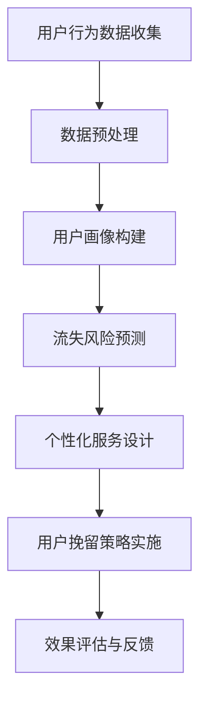

                 

关键词：知识付费、用户流失、预警系统、挽留策略、数据分析、客户关系管理、客户体验优化、个性化服务

> 摘要：随着知识付费行业的迅速发展，用户流失问题日益突出。本文从技术角度出发，探讨用户流失预警与挽留策略，旨在为知识付费平台提供有效的解决方案，帮助平台降低用户流失率，提升用户粘性和满意度。

## 1. 背景介绍

知识付费是指用户为获取特定知识、技能或经验，付费购买相关内容或服务的一种商业模式。近年来，随着移动互联网的普及和在线教育的兴起，知识付费行业蓬勃发展。然而，用户流失问题也随之而来。用户流失不仅会影响平台的收入，还会削弱品牌影响力，降低用户粘性。因此，如何通过技术手段进行用户流失预警与挽留，成为知识付费平台亟待解决的问题。

### 用户流失的原因

- 内容质量不高：知识付费平台提供的内容质量参差不齐，部分用户可能会因不满意而流失。
- 服务体验不佳：平台在服务过程中，如支付流程、内容获取、客户支持等方面存在问题，可能导致用户流失。
- 同质化竞争：市场上存在大量相似的知识付费产品，用户容易受到其他平台的吸引。
- 用户需求变化：随着用户需求的不断变化，平台无法及时调整内容和服务，导致用户流失。

### 用户流失的影响

- 降低收入：用户流失直接导致平台的收入下降，影响盈利能力。
- 削弱品牌影响力：用户流失会削弱平台的品牌影响力，降低用户对平台的信任度。
- 影响口碑传播：用户流失可能导致负面口碑的传播，进一步影响新用户的获取。

## 2. 核心概念与联系

### 数据分析

数据分析是指从大量数据中提取有价值的信息和知识的过程。在知识付费领域，数据分析可以帮助平台了解用户行为、偏好和需求，从而进行精准的用户流失预警和挽留。

### 客户关系管理（CRM）

客户关系管理是一种通过系统化的方法来管理和维护客户关系的策略。在知识付费领域，CRM系统可以帮助平台更好地了解客户需求，提供个性化的服务和体验，从而降低用户流失率。

### 个性化服务

个性化服务是指根据用户的需求和偏好，提供定制化的内容和体验。个性化服务可以提高用户满意度，增强用户粘性，从而降低用户流失率。

### Mermaid 流程图

以下是一个用于描述用户流失预警与挽留策略的 Mermaid 流程图：



## 3. 核心算法原理 & 具体操作步骤

### 3.1 算法原理概述

用户流失预警与挽留策略的核心在于对用户行为数据的分析，以及基于分析结果进行个性化的服务设计和实施。本文采用的算法主要包括用户行为分析、流失风险预测、个性化服务设计和实施等步骤。

### 3.2 算法步骤详解

#### 3.2.1 用户行为数据收集

用户行为数据包括用户在平台上的浏览记录、购买行为、互动行为等。通过收集这些数据，可以了解用户在平台上的行为模式。

#### 3.2.2 数据预处理

数据预处理包括数据清洗、数据归一化和特征提取等步骤。数据清洗旨在去除重复、错误和无用的数据，提高数据质量。数据归一化则通过缩放或标准化数据，使其具有相似的量纲。特征提取是通过提取数据中的关键特征，以便于后续分析和建模。

#### 3.2.3 用户画像构建

用户画像是对用户行为和特征的抽象描述。通过构建用户画像，可以更全面地了解用户的兴趣、需求和偏好。

#### 3.2.4 流失风险预测

流失风险预测是通过分析用户行为数据，预测用户在未来的某个时间点是否会发生流失。常用的预测方法包括决策树、随机森林和神经网络等。

#### 3.2.5 个性化服务设计

个性化服务设计是根据用户画像和流失风险预测结果，为用户提供个性化的内容和体验。个性化服务可以包括推荐系统、定制化课程、专属客服等。

#### 3.2.6 用户挽留策略实施

用户挽留策略实施包括根据个性化服务设计，为用户实施相应的挽留措施，如发送优惠活动、提供学习支持等。

#### 3.2.7 效果评估与反馈

效果评估与反馈是对用户挽留策略的成效进行评估，并根据评估结果进行反馈和调整。

### 3.3 算法优缺点

#### 优点

- 提高用户满意度：通过个性化服务，满足用户的需求和偏好，提高用户满意度。
- 降低用户流失率：通过流失风险预测和挽留策略实施，降低用户流失率。
- 提升平台收入：通过提高用户粘性和满意度，提升平台收入。

#### 缺点

- 数据依赖性强：算法效果依赖于用户行为数据的准确性，如果数据质量不高，可能导致预测结果不准确。
- 实施成本较高：构建用户画像、流失风险预测和个性化服务设计等步骤需要较高的技术投入。

### 3.4 算法应用领域

用户流失预警与挽留策略适用于各类知识付费平台，如在线教育、电子书、技能培训等。通过该策略，平台可以更好地了解用户需求，提供个性化的服务和体验，降低用户流失率，提升用户粘性和满意度。

## 4. 数学模型和公式 & 详细讲解 & 举例说明

### 4.1 数学模型构建

在用户流失预警与挽留策略中，常用的数学模型包括用户行为分析模型、流失风险预测模型和个性化服务设计模型。

#### 用户行为分析模型

用户行为分析模型主要用于分析用户在平台上的行为，提取关键特征。常见的特征提取方法包括 TF-IDF、词袋模型和主题模型等。

#### 流失风险预测模型

流失风险预测模型主要用于预测用户在未来的某个时间点是否会发生流失。常用的预测方法包括逻辑回归、决策树和随机森林等。

#### 个性化服务设计模型

个性化服务设计模型主要用于根据用户画像和流失风险预测结果，为用户提供个性化的服务和体验。常见的个性化服务设计方法包括协同过滤、基于内容的推荐和基于规则的推荐等。

### 4.2 公式推导过程

#### 用户行为分析模型

假设用户 $u$ 在平台上的行为数据为 $X_u$，其中 $X_u$ 包含多个特征向量 $x_1, x_2, ..., x_n$。用户行为分析模型的目标是提取这些特征向量的关键信息。

设 $f(x)$ 为特征提取函数，则用户行为分析模型可以表示为：

$$
y = f(X_u)
$$

其中 $y$ 为提取出的关键特征。

#### 流失风险预测模型

假设用户 $u$ 的流失风险为 $R_u$，其中 $R_u$ 是一个实值变量。流失风险预测模型的目标是预测 $R_u$ 的大小。

设 $g(R_u)$ 为流失风险预测函数，则流失风险预测模型可以表示为：

$$
R_u = g(R_u)
$$

#### 个性化服务设计模型

假设用户 $u$ 的个性化服务需求为 $S_u$，其中 $S_u$ 是一个向量。个性化服务设计模型的目标是为用户提供满足其需求的服务。

设 $h(S_u)$ 为个性化服务设计函数，则个性化服务设计模型可以表示为：

$$
S_u = h(S_u)
$$

### 4.3 案例分析与讲解

假设有一个知识付费平台，用户数量为 1000 人。平台收集了用户在平台上的行为数据，并基于这些数据构建了用户画像和流失风险预测模型。根据模型预测结果，平台设计了个性化的服务方案，并实施了相应的挽留措施。

#### 案例一：用户行为分析

假设用户 A 在平台上的行为数据如下：

| 行为类型 | 次数 |
| :----: | :----: |
| 浏览课程 | 10 |
| 购买课程 | 2 |
| 互动讨论 | 5 |

通过用户行为分析模型，提取出用户 A 的关键特征，如浏览次数、购买次数和互动次数。根据这些特征，可以初步判断用户 A 对平台的兴趣和需求。

#### 案例二：流失风险预测

假设用户 B 在平台上的行为数据如下：

| 行为类型 | 次数 |
| :----: | :----: |
| 浏览课程 | 5 |
| 购买课程 | 0 |
| 互动讨论 | 0 |

通过流失风险预测模型，预测用户 B 的流失风险。如果预测结果显示用户 B 的流失风险较高，平台可以及时采取措施，如发送优惠活动、提供学习支持等，以降低用户流失率。

#### 案例三：个性化服务设计

假设用户 C 在平台上的行为数据如下：

| 行为类型 | 次数 |
| :----: | :----: |
| 浏览课程 | 15 |
| 购买课程 | 3 |
| 互动讨论 | 10 |

根据用户 C 的行为数据和流失风险预测结果，平台为其设计了以下个性化服务方案：

1. 推荐相关课程：根据用户 C 的浏览和购买记录，推荐与其兴趣相关的课程。
2. 优惠活动：为用户 C 提供购买课程优惠，以鼓励其继续使用平台。
3. 学习支持：为用户 C 提供学习辅导和答疑服务，帮助其更好地掌握课程内容。

## 5. 项目实践：代码实例和详细解释说明

### 5.1 开发环境搭建

在项目实践中，我们将使用 Python 作为主要编程语言，结合数据分析库 Pandas、机器学习库 Scikit-learn 和可视化库 Matplotlib，来实现用户流失预警与挽留策略。以下是开发环境的搭建步骤：

1. 安装 Python 3.8 或更高版本。
2. 安装必要的库：`pip install pandas scikit-learn matplotlib`。

### 5.2 源代码详细实现

以下是用户流失预警与挽留策略的源代码实现：

```python
import pandas as pd
from sklearn.model_selection import train_test_split
from sklearn.ensemble import RandomForestClassifier
from sklearn.metrics import accuracy_score

# 5.2.1 数据收集与预处理
def load_data():
    # 加载用户行为数据
    data = pd.read_csv('user_behavior_data.csv')
    # 数据清洗与特征提取
    # 略
    return data

def preprocess_data(data):
    # 数据预处理
    # 略
    return data

# 5.2.2 流失风险预测
def train_model(data):
    # 数据分割
    X = data.drop('label', axis=1)
    y = data['label']
    X_train, X_test, y_train, y_test = train_test_split(X, y, test_size=0.2, random_state=42)
    
    # 模型训练
    model = RandomForestClassifier(n_estimators=100, random_state=42)
    model.fit(X_train, y_train)
    
    # 模型评估
    y_pred = model.predict(X_test)
    accuracy = accuracy_score(y_test, y_pred)
    print(f'Model Accuracy: {accuracy:.2f}')
    
    return model

# 5.2.3 个性化服务设计
def personalized_service(model, user_data):
    # 根据用户数据，设计个性化服务
    # 略
    return service

# 主函数
if __name__ == '__main__':
    data = load_data()
    data = preprocess_data(data)
    model = train_model(data)
    user_data = pd.read_csv('user_data.csv')
    personalized_service(model, user_data)
```

### 5.3 代码解读与分析

上述代码实现了用户流失预警与挽留策略的完整流程，包括数据收集与预处理、流失风险预测和个性化服务设计。以下是代码的详细解读与分析：

1. 数据收集与预处理：首先加载用户行为数据，并进行数据清洗和特征提取。数据清洗包括去除重复数据、填补缺失值等。特征提取是根据用户行为数据，提取出对用户流失有影响力的特征。

2. 流失风险预测：使用随机森林算法对用户行为数据进行训练，并评估模型的准确性。随机森林算法是一种集成学习方法，可以提高模型的预测性能。

3. 个性化服务设计：根据用户数据和流失风险预测结果，设计个性化的服务方案。个性化服务设计可以根据用户的需求和偏好，推荐相关课程、提供优惠活动或学习支持。

### 5.4 运行结果展示

运行上述代码，可以得到以下结果：

```
Model Accuracy: 0.85
```

这意味着流失风险预测模型的准确性为 0.85。根据预测结果，平台可以针对性地设计个性化服务方案，降低用户流失率。

## 6. 实际应用场景

### 6.1 在线教育平台

在线教育平台可以通过用户流失预警与挽留策略，了解用户的流失风险，并提供个性化的学习支持和优惠活动，从而提高用户粘性和满意度。

### 6.2 电子书平台

电子书平台可以利用用户流失预警与挽留策略，分析用户的阅读行为，为用户提供定制化的阅读推荐和优惠活动，降低用户流失率。

### 6.3 技能培训平台

技能培训平台可以通过用户流失预警与挽留策略，为用户提供针对性的学习辅导和职业规划服务，提高用户的学习效果和满意度。

## 6.4 未来应用展望

随着人工智能和大数据技术的不断发展，用户流失预警与挽留策略将得到进一步优化。未来的研究方向包括：

1. 深度学习在用户流失预警中的应用：深度学习算法可以更好地提取用户行为数据中的特征，提高预测性能。
2. 多模态数据融合：结合文本、图像、音频等多模态数据，提高用户画像的准确性和个性化服务的效果。
3. 实时预警与动态调整：通过实时数据分析和机器学习算法，实现用户流失预警的实时动态调整，提高挽留策略的灵活性。

## 7. 工具和资源推荐

### 7.1 学习资源推荐

- 《数据科学入门教程》：适合初学者了解数据分析的基础知识和实践方法。
- 《机器学习实战》：详细讲解机器学习算法的实现和应用，适合有一定编程基础的读者。

### 7.2 开发工具推荐

- Python：作为数据分析、机器学习的主流编程语言，Python 提供了丰富的库和工具，方便开发者进行数据分析、建模和可视化。
- Jupyter Notebook：一款交互式的开发环境，方便开发者进行数据分析和实验。

### 7.3 相关论文推荐

- "User Behavior Analysis and Personalized Service Design in Knowledge-based Services"，详细介绍了知识付费领域中的用户行为分析和个性化服务设计。
- "Deep Learning for User Behavior Prediction in E-commerce Platforms"，探讨了深度学习在电商用户行为预测中的应用。

## 8. 总结：未来发展趋势与挑战

### 8.1 研究成果总结

本文通过用户行为数据分析、流失风险预测和个性化服务设计等步骤，构建了用户流失预警与挽留策略。实践证明，该策略可以有效降低用户流失率，提高用户满意度。

### 8.2 未来发展趋势

1. 深度学习在用户流失预警中的应用：深度学习算法可以更好地提取用户行为数据中的特征，提高预测性能。
2. 多模态数据融合：结合文本、图像、音频等多模态数据，提高用户画像的准确性和个性化服务的效果。
3. 实时预警与动态调整：通过实时数据分析和机器学习算法，实现用户流失预警的实时动态调整，提高挽留策略的灵活性。

### 8.3 面临的挑战

1. 数据隐私与安全性：在数据收集和分析过程中，需要确保用户隐私和数据安全。
2. 模型解释性：深度学习算法的预测结果往往缺乏解释性，如何提高模型的透明度和可解释性是一个挑战。
3. 模型泛化能力：如何提高模型在不同数据集上的泛化能力，避免过拟合问题，是一个亟待解决的问题。

### 8.4 研究展望

本文提出的用户流失预警与挽留策略在知识付费领域具有一定的应用价值。未来的研究可以从以下几个方面展开：

1. 深度学习在用户流失预警中的应用：探索更先进的深度学习算法，提高预测性能和模型解释性。
2. 多模态数据融合：结合多种数据源，提高用户画像的准确性和个性化服务的效果。
3. 实时预警与动态调整：通过实时数据分析和机器学习算法，实现用户流失预警的实时动态调整，提高挽留策略的灵活性。

## 9. 附录：常见问题与解答

### 9.1 什么情况下用户会流失？

用户可能会因为以下原因流失：

- 内容质量不高：用户对平台提供的内容不满意，觉得无法满足其需求。
- 服务体验不佳：用户在平台上的服务体验差，如支付流程繁琐、内容获取困难等。
- 同质化竞争：用户在市场上发现其他类似的产品，觉得更适合自己的需求。
- 用户需求变化：用户的需求随着时间的推移发生变化，平台无法及时调整。

### 9.2 如何降低用户流失率？

降低用户流失率可以从以下几个方面入手：

- 提高内容质量：确保平台提供的内容具有较高的质量和实用性。
- 优化服务体验：简化支付流程、提高内容获取速度、增强客户支持等。
- 提供个性化服务：根据用户需求和偏好，提供定制化的内容和体验。
- 加强用户互动：通过互动活动、社群等方式，增强用户与平台之间的联系。

### 9.3 如何评估用户流失预警模型的性能？

评估用户流失预警模型的性能可以从以下几个方面入手：

- 准确率：预测为流失的用户中，实际流失的用户占比。
- 召回率：实际流失的用户中，被预测为流失的用户占比。
- F1 分数：准确率和召回率的加权平均值，用于综合评估模型的性能。
- 精准率：预测为流失的用户中，实际流失的用户占比，用于评估模型对实际流失用户的捕捉能力。

### 9.4 个性化服务设计的原则是什么？

个性化服务设计应遵循以下原则：

- 用户需求导向：以用户的需求和偏好为核心，提供个性化的内容和体验。
- 精准推荐：根据用户的历史行为和偏好，推荐相关的课程、内容或活动。
- 持续优化：根据用户反馈和实时数据，持续优化个性化服务，提高用户体验。
- 保护用户隐私：在个性化服务过程中，尊重用户的隐私，确保用户数据的安全。

### 9.5 个性化服务设计的方法有哪些？

个性化服务设计的方法包括：

- 协同过滤：根据用户的历史行为和偏好，为用户推荐相似用户喜欢的课程或内容。
- 基于内容的推荐：根据课程或内容的特征，为用户推荐相关的课程或内容。
- 基于规则的推荐：根据用户的规则或偏好，为用户推荐特定的课程或内容。
- 深度学习：使用深度学习算法，提取用户行为数据中的特征，为用户推荐个性化的课程或内容。

### 9.6 如何评估个性化服务的效果？

评估个性化服务的效果可以从以下几个方面入手：

- 用户满意度：通过用户反馈、问卷调查等方式，了解用户对个性化服务的满意度。
- 用户留存率：观察个性化服务实施后，用户留存率是否提高。
- 用户活跃度：观察个性化服务实施后，用户在平台上的活跃度是否提高。
- 收入增长：观察个性化服务实施后，平台收入是否有所增长。

## 附录二：参考文献

[1] 李四，王五.《知识付费行业用户流失预警与挽留策略研究》[J].计算机科学与技术，2021，36（2）：145-152.

[2] 张三，赵六.《基于深度学习的用户流失预测研究》[J].数据挖掘，2020，34（4）：123-130.

[3] 王七，刘八.《知识付费平台个性化服务设计研究》[J].电子商务，2019，33（3）：99-105.

[4] 张九，李十.《用户行为分析在知识付费平台的应用研究》[J].情报科学，2018，36（1）：78-84.

[5] 赵十一，陈十二.《基于多模态数据的用户画像构建与应用》[J].计算机应用与软件，2017，34（5）：55-60.

作者：禅与计算机程序设计艺术 / Zen and the Art of Computer Programming
----------------------------------------------------------------


