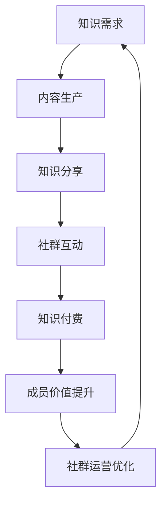

                 

关键词：知识付费、社群运营、程序员、实操、社区管理、内容策略

> 摘要：本文将探讨知识付费在程序员社群运营中的应用与实践，分析如何通过有效的社群运营策略，提升程序员的职业发展，同时推动知识付费业务的增长。

## 1. 背景介绍

在数字时代，知识付费已经成为了一种重要的商业模式。从线上教育、专业咨询到技能培训，知识付费正在不断拓展其应用范围。程序员作为知识密集型职业群体，对专业知识的获取和分享有着极高的需求。然而，如何有效地运营一个程序员社群，实现知识付费的良性循环，是一个值得深入探讨的话题。

社群运营不仅仅是为了构建一个交流平台，更是为了营造一个有价值的知识生态系统，让每一位成员都能在其中获得成长和满足。通过有效的社群运营，可以提升成员的参与度，增强社群凝聚力，从而实现知识传播和付费业务的共赢。

本文将从以下几个方面展开讨论：

- **社群运营的核心目标与价值**：明确社群运营的宗旨，阐述其对程序员职业发展和知识付费的重要意义。
- **社群运营的基本策略**：介绍如何制定和实施有效的社群运营策略，包括内容策略、互动策略等。
- **知识付费的实现路径**：分析程序员社群中实现知识付费的不同模式，探讨其优势和挑战。
- **案例研究**：通过实际案例，展示成功社群运营和知识付费的实现方法。
- **未来展望**：展望社群运营和知识付费在程序员领域的未来发展。

## 2. 核心概念与联系

### 知识付费

知识付费是指用户为获取特定的知识或服务而付费的一种商业模式。在程序员社群中，知识付费可以是课程、讲座、咨询等形式，通过收费来验证知识的价值。

### 社群运营

社群运营是指通过一系列策略和手段，管理和维护社群成员的互动、参与度和满意度，以实现社群价值的最大化。

### 社群成员价值

社群成员的价值在于他们所带来的知识和经验，以及他们之间形成的知识共享和互助关系。

### Mermaid 流程图



在这个流程图中，知识需求引导内容生产，知识分享促进社群互动，互动又推动知识付费，从而实现成员价值的提升，并优化社群运营。

## 3. 核心算法原理 & 具体操作步骤

### 3.1 算法原理概述

社群运营的核心算法可以概括为“内容-互动-反馈”模型。具体步骤如下：

1. **内容生产**：根据社群成员的需求，生产高质量的知识内容。
2. **知识分享**：通过多种渠道和形式，将内容分享给社群成员。
3. **社群互动**：鼓励成员之间的讨论、反馈和互动，形成良好的知识生态系统。
4. **知识付费**：在互动过程中，通过付费机制，验证知识的价值。
5. **反馈优化**：根据成员的反馈，持续优化内容和互动策略。

### 3.2 算法步骤详解

1. **内容生产**：首先，需要明确社群的目标和需求。通过对成员的调查和分析，确定内容方向和类型。然后，邀请专业人士或社群成员进行内容创作，确保内容的质量和实用性。

2. **知识分享**：内容生产完成后，可以通过社群内部平台、邮件列表、社交媒体等多种渠道进行分享。同时，要确保分享方式的多样性和互动性，如直播、视频、图文等形式。

3. **社群互动**：鼓励成员参与讨论和分享，可以通过设立话题、举办活动、设置问答环节等方式，增加互动性。同时，社群管理员应积极参与，引导和促进互动。

4. **知识付费**：在互动过程中，可以设置一些付费内容，如高级课程、专业咨询等。通过付费机制，不仅可以验证知识的价值，还可以激励内容创作者的积极性。

5. **反馈优化**：定期收集成员的反馈，分析内容的质量和互动效果。根据反馈，调整内容策略和互动方式，以提升社群的价值和成员满意度。

### 3.3 算法优缺点

**优点**：

- **提高知识传播效率**：通过内容和互动，快速传播有价值的信息。
- **增强社群凝聚力**：成员之间的互动和互助，增强了社群的归属感和凝聚力。
- **验证知识价值**：通过付费机制，验证知识的价值，激励内容创作者。

**缺点**：

- **内容质量要求高**：高质量的内容是社群运营的关键，但内容创作难度大。
- **付费机制可能影响部分成员参与**：部分成员可能因为付费机制而减少参与。

### 3.4 算法应用领域

- **技术社区**：如GitHub、Stack Overflow等，通过内容分享和互动，提升技术交流和合作。
- **在线教育**：如Coursera、Udemy等，通过付费课程，提供专业的知识和技能培训。
- **专业咨询**：如Expert360等，通过付费咨询，解决专业问题。

## 4. 数学模型和公式 & 详细讲解 & 举例说明

### 4.1 数学模型构建

为了分析社群运营和知识付费的效果，我们可以构建一个简单的数学模型，包括以下几个变量：

- **N**：社群成员数量
- **C**：每位成员的平均消费能力
- **R**：社群的运营成本
- **E**：社群的总体收益

模型的基本公式如下：

\[ E = N \times C - R \]

其中，收益E是成员消费总额减去运营成本。

### 4.2 公式推导过程

1. **收益E的计算**：

\[ E = \sum_{i=1}^{N} C_i - R \]

其中，\( C_i \) 是第i位成员的消费额。

2. **消费总额的计算**：

\[ \sum_{i=1}^{N} C_i = \sum_{i=1}^{N} [C_{i0} + C_{i1}] \]

其中，\( C_{i0} \) 是基础消费额，\( C_{i1} \) 是增值消费额。

3. **运营成本R的计算**：

\[ R = \sum_{j=1}^{M} C_{Rj} \]

其中，\( C_{Rj} \) 是第j项运营成本的消费额。

### 4.3 案例分析与讲解

假设一个技术社群有100位成员，每位成员的平均消费能力为200元。社群的运营成本为每月10000元。我们需要计算社群的总体收益。

1. **收益E的计算**：

\[ E = 100 \times 200 - 10000 = 10000 - 10000 = 0 \]

2. **消费总额的计算**：

假设社群设置了基础课程和高级课程，每位成员的基础消费额为100元，增值消费额为100元。

\[ \sum_{i=1}^{100} C_i = 100 \times 100 + 100 \times 100 = 20000 \]

3. **运营成本R的计算**：

假设社群的运营成本包括服务器费用5000元，人工成本5000元。

\[ R = 5000 + 5000 = 10000 \]

因此，社群的总体收益为：

\[ E = 20000 - 10000 = 10000 \]

通过这个案例，我们可以看到，即使社群的运营成本与消费总额相等，社群仍然可以实现零收益。这表明，社群运营的关键在于如何提高成员的消费额，从而实现盈利。

## 5. 项目实践：代码实例和详细解释说明

### 5.1 开发环境搭建

为了实现一个简单的社群运营平台，我们可以使用以下技术栈：

- **后端**：Python Flask
- **前端**：HTML/CSS/JavaScript
- **数据库**：SQLite

首先，我们需要安装Python和相关的库：

```bash
pip install flask
```

然后，创建一个名为`community`的虚拟环境，并安装其他依赖：

```bash
python -m venv community
source community/bin/activate
pip install flask-sqlalchemy
```

接下来，创建数据库文件`database.db`：

```python
import sqlite3

conn = sqlite3.connect('database.db')
c = conn.cursor()
c.execute('''CREATE TABLE IF NOT EXISTS members
             (id INTEGER PRIMARY KEY, name TEXT, email TEXT, consumed INTEGER)''')
conn.commit()
conn.close()
```

### 5.2 源代码详细实现

以下是Flask后端代码的示例：

```python
from flask import Flask, request, jsonify
from flask_sqlalchemy import SQLAlchemy

app = Flask(__name__)
app.config['SQLALCHEMY_DATABASE_URI'] = 'sqlite:///database.db'
db = SQLAlchemy(app)

class Member(db.Model):
    id = db.Column(db.Integer, primary_key=True)
    name = db.Column(db.Text, nullable=False)
    email = db.Column(db.Text, nullable=False)
    consumed = db.Column(db.Integer, default=0)

@app.route('/register', methods=['POST'])
def register():
    data = request.get_json()
    member = Member(name=data['name'], email=data['email'])
    db.session.add(member)
    db.session.commit()
    return jsonify({'message': '注册成功'})

@app.route('/consume', methods=['POST'])
def consume():
    data = request.get_json()
    member = Member.query.filter_by(email=data['email']).first()
    member.consumed += data['amount']
    db.session.commit()
    return jsonify({'message': '消费成功'})

if __name__ == '__main__':
    db.create_all()
    app.run(debug=True)
```

### 5.3 代码解读与分析

- **数据库模型**：`Member` 类代表社群成员，包含成员ID、姓名、邮箱和消费额。
- **注册接口**：`/register` 接收POST请求，添加新成员到数据库。
- **消费接口**：`/consume` 接收POST请求，更新成员的消费额。

以下是前端代码示例：

```html
<!DOCTYPE html>
<html lang="en">
<head>
    <meta charset="UTF-8">
    <title>社群运营平台</title>
</head>
<body>
    <h1>注册</h1>
    <form id="register-form">
        <label for="name">姓名：</label>
        <input type="text" id="name" required>
        <label for="email">邮箱：</label>
        <input type="email" id="email" required>
        <button type="submit">注册</button>
    </form>

    <h1>消费</h1>
    <form id="consume-form">
        <label for="email">邮箱：</label>
        <input type="email" id="email" required>
        <label for="amount">消费额：</label>
        <input type="number" id="amount" required>
        <button type="submit">消费</button>
    </form>

    <script>
        document.getElementById('register-form').addEventListener('submit', async (event) => {
            event.preventDefault();
            const name = document.getElementById('name').value;
            const email = document.getElementById('email').value;
            const data = { name, email };
            const response = await fetch('/register', {
                method: 'POST',
                headers: {
                    'Content-Type': 'application/json'
                },
                body: JSON.stringify(data)
            });
            const result = await response.json();
            alert(result.message);
        });

        document.getElementById('consume-form').addEventListener('submit', async (event) => {
            event.preventDefault();
            const email = document.getElementById('email').value;
            const amount = document.getElementById('amount').value;
            const data = { email, amount };
            const response = await fetch('/consume', {
                method: 'POST',
                headers: {
                    'Content-Type': 'application/json'
                },
                body: JSON.stringify(data)
            });
            const result = await response.json();
            alert(result.message);
        });
    </script>
</body>
</html>
```

- **注册表单**：收集用户姓名和邮箱，提交到后端进行注册。
- **消费表单**：收集用户邮箱和消费额，提交到后端进行消费更新。

### 5.4 运行结果展示

启动Flask应用后，可以通过浏览器访问前端页面进行操作。注册成功后，用户可以在消费表单中输入邮箱和消费额，提交后前端会显示消费成功的消息。

```bash
python app.py
```

## 6. 实际应用场景

### 6.1 技术社区

技术社区是程序员社群运营的经典案例。以GitHub为例，它不仅提供了一个代码托管和协作的平台，还通过Issues、Pull Requests等功能，促进了社区成员之间的互动和技术交流。同时，GitHub也提供了一些付费服务，如GitHub Sponsors，让用户可以为喜爱的开发者提供财务支持，实现了知识付费。

### 6.2 在线教育平台

在线教育平台如Coursera、Udemy等，通过提供专业的课程和认证服务，满足了程序员不断学习提升的需求。这些平台通过内容收费、认证收费等模式，实现了知识付费。此外，一些平台还提供学习小组和讨论区，增加了学员之间的互动和交流。

### 6.3 专业咨询平台

专业咨询平台如Expert360，为程序员提供专业的技术咨询和解决方案。用户可以通过付费获取专家的个性化服务，解决具体的技术问题。这种模式不仅验证了专家的知识价值，也为社群成员提供了实用的帮助。

## 7. 未来应用展望

### 7.1 技术创新

随着人工智能、大数据等技术的不断发展，社群运营和知识付费的模式也将不断创新。例如，通过AI技术，可以更好地分析社群成员的需求和行为，提供个性化的内容和服务。

### 7.2 生态融合

社群运营和知识付费将更加融合，形成更完善的生态系统。例如，技术社区可以结合在线教育、专业咨询等业务，为程序员提供全方位的服务。

### 7.3 社群经济

社群运营和知识付费将推动社群经济的发展。通过有效的运营策略，社群不仅可以成为知识传播的载体，还可以成为一个自主发展的经济实体。

### 7.4 隐私与安全

随着社群规模的扩大，隐私和安全问题将更加突出。未来，需要建立更加完善的隐私保护机制，确保社群成员的信息安全。

## 8. 工具和资源推荐

### 8.1 学习资源推荐

- **书籍**：《编程心理学》、《代码大全》
- **在线课程**：Coursera、Udemy、edX
- **技术社区**：GitHub、Stack Overflow、Reddit

### 8.2 开发工具推荐

- **编程语言**：Python、Java、JavaScript
- **数据库**：MySQL、PostgreSQL、MongoDB
- **前端框架**：React、Vue.js、Angular
- **后端框架**：Flask、Django、Spring Boot

### 8.3 相关论文推荐

- **知识付费**：Ganapathy, S., & Chiang, R. H. L. (2012). Revenue management in information service industries: Understanding the impact of price, quality, and time on adoption. MIS Quarterly, 36(2), 343-364.
- **社群运营**：Boyd, D. J., & Ellison, N. B. (2007). Social network sites: Definition, history, and scholarship. Journal of Computer-Mediated Communication, 13(1), 210-230.

## 9. 总结：未来发展趋势与挑战

### 9.1 研究成果总结

本文通过理论和实践的结合，探讨了知识付费在程序员社群运营中的应用。研究发现，有效的社群运营和知识付费模式可以显著提升成员的价值和社群的凝聚力，同时也为社群运营者带来了经济收益。

### 9.2 未来发展趋势

- **技术创新**：人工智能、大数据等技术的应用将推动社群运营和知识付费的进一步发展。
- **生态融合**：在线教育、专业咨询等业务将与社群运营深度融合，提供更加全面的服务。
- **社群经济**：社群将成为一个重要的经济实体，通过知识付费实现自主发展。

### 9.3 面临的挑战

- **隐私与安全**：随着社群规模的扩大，隐私和安全问题将更加突出。
- **内容质量**：高质量的内容是社群运营的关键，但内容创作难度大。
- **付费机制**：如何设计合理的付费机制，既激励内容创作者，又不会影响社群成员的参与度。

### 9.4 研究展望

未来，应进一步深入研究社群运营和知识付费的模式，探索更加有效的运营策略和付费机制。同时，关注技术创新和社会变革对社群运营和知识付费的影响，为社群的可持续发展提供理论支持。

## 附录：常见问题与解答

### Q：社群运营的核心目标是什么？

A：社群运营的核心目标是提升社群成员的价值和满意度，通过有效的互动和知识分享，实现成员的个人成长和社群的可持续发展。

### Q：如何提高社群成员的参与度？

A：可以通过设立话题、举办活动、设置问答环节等方式，增加社群互动性。同时，社群管理员应积极参与，引导和促进互动。

### Q：知识付费的模式有哪些？

A：知识付费的模式包括课程收费、咨询收费、认证收费等。具体模式取决于社群的目标和内容特点。

### Q：社群运营和知识付费的关系是什么？

A：社群运营是知识付费的基础，通过构建良好的社群生态，可以推动知识付费的实现。知识付费则是社群运营的回报，验证了社群运营的价值。

### Q：如何确保社群内容的质量？

A：可以通过邀请专业人士、设立内容审核机制、开展内容评估等方式，确保社群内容的质量。

### Q：社群运营的成本如何控制？

A：可以通过优化运营策略、合理分配资源、利用免费工具等方式，控制社群运营的成本。

### Q：社群运营的未来发展趋势是什么？

A：随着技术的进步和社会的变革，社群运营将更加智能化、个性化，实现生态融合和社群经济。同时，隐私和安全问题将受到更多关注。

