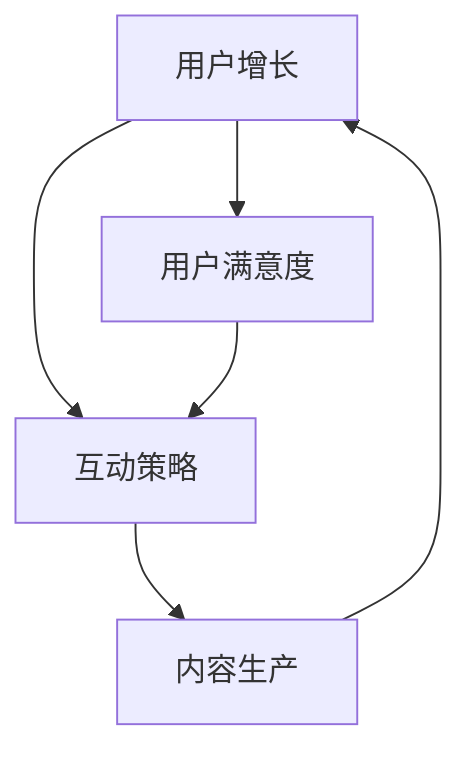
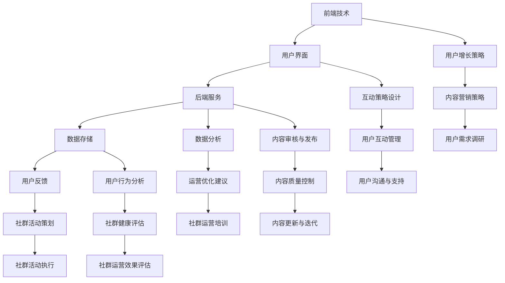

                 

关键词：知识付费、程序员、社群运营、实操、技术博客、用户增长、互动策略

> 摘要：本文将深入探讨知识付费领域，以程序员的社群运营为背景，阐述如何在技术领域实现有效的知识付费模式。通过详细解析社群运营的核心概念、算法原理、数学模型及代码实例，本文旨在为程序员提供一套实用的社群运营实操指南，帮助他们在社群中实现知识价值的最大化。

## 1. 背景介绍

随着互联网技术的发展，知识付费逐渐成为信息时代的新趋势。程序员作为知识密集型职业，其技能和经验对于社群成员来说具有极高的价值。然而，如何将知识转化为付费内容，并在社群中实现有效运营，成为众多程序员面临的重要课题。

### 1.1 知识付费的定义

知识付费是指用户通过支付一定费用，获取特定领域专家提供的知识、技能和经验的付费服务。这种模式的核心在于高质量内容的生产和传播，以及用户需求的精准匹配。

### 1.2 程序员社群运营的重要性

程序员社群运营不仅是知识传播的桥梁，更是程序员个人品牌建设和职业发展的重要途径。通过社群运营，程序员可以：

- 建立专业形象，提升个人影响力
- 分享专业经验，获取更多职业机会
- 拓展人脉资源，实现知识共享与合作
- 提供知识付费内容，实现经济价值

## 2. 核心概念与联系

### 2.1 社群运营的核心概念

社群运营涉及多个核心概念，包括用户增长、互动策略、内容生产等。以下是一个简单的 Mermaid 流程图，展示这些概念之间的联系。



### 2.2 社群运营的架构设计

社群运营的架构设计包括前端技术、后端服务、数据分析和用户反馈等多个层面。以下是一个简化的 Mermaid 流程图，展示社群运营的整体架构。



## 3. 核心算法原理 & 具体操作步骤

### 3.1 算法原理概述

社群运营的核心算法包括用户增长算法、互动策略优化算法和内容推荐算法。这些算法旨在提高用户参与度和满意度，从而实现社群的长期发展。

### 3.2 算法步骤详解

#### 3.2.1 用户增长算法

1. 确定目标用户群体
2. 设计有吸引力的用户引导策略
3. 运用数据分析优化用户增长策略
4. 定期评估用户增长效果，调整策略

#### 3.2.2 互动策略优化算法

1. 分析用户互动行为，识别关键指标
2. 构建互动策略模型，优化互动效果
3. 利用机器学习技术，预测用户互动偏好
4. 实时调整互动策略，提高用户满意度

#### 3.2.3 内容推荐算法

1. 收集用户兴趣数据，构建用户画像
2. 设计内容推荐模型，提高内容匹配度
3. 利用协同过滤算法，优化内容推荐效果
4. 定期更新用户画像和推荐算法，确保内容新鲜度

### 3.3 算法优缺点

#### 用户增长算法

- 优点：能够快速提升社群规模，提高用户基数
- 缺点：可能导致用户质量下降，增加运营成本

#### 互动策略优化算法

- 优点：提高用户互动积极性，增强社群凝聚力
- 缺点：对数据分析和算法优化要求较高，实施难度较大

#### 内容推荐算法

- 优点：提高内容质量，提升用户满意度
- 缺点：内容匹配度可能受限于用户画像和数据质量

### 3.4 算法应用领域

用户增长算法、互动策略优化算法和内容推荐算法广泛应用于各类在线社群，如技术论坛、学习平台和社交网络。它们的核心目标是通过提高用户参与度和满意度，实现社群的可持续发展。

## 4. 数学模型和公式 & 详细讲解 & 举例说明

### 4.1 数学模型构建

社群运营中的数学模型主要包括用户增长模型、互动策略模型和内容推荐模型。以下是一个简单的用户增长模型示例。

$$
\text{用户增长量} = \text{引导策略效果} \times \text{用户基数}
$$

其中，引导策略效果可以通过转化率、点击率等指标进行衡量。

### 4.2 公式推导过程

假设某社群在一段时间内的用户增长量为 $X$，引导策略效果为 $E$，用户基数为 $N$。根据用户增长模型，我们有：

$$
X = E \times N
$$

为了提高用户增长量，我们需要优化引导策略效果。通过数据分析，我们可以得到不同策略的转化率和点击率，从而计算出每种策略的效果。选择效果最好的策略，并将其应用于社群运营，即可实现用户增长的最大化。

### 4.3 案例分析与讲解

假设某程序员社群在一个月内实施了三种不同的用户引导策略，具体数据如下：

- 策略A：转化率为10%，点击率为5%
- 策略B：转化率为15%，点击率为10%
- 策略C：转化率为20%，点击率为20%

根据用户增长模型，我们可以计算出每种策略的用户增长量：

$$
\text{策略A增长量} = 0.1 \times 1000 = 100
$$

$$
\text{策略B增长量} = 0.15 \times 1000 = 150
$$

$$
\text{策略C增长量} = 0.2 \times 1000 = 200
$$

从计算结果可以看出，策略C的效果最好，用户增长量最高。因此，社群运营团队应该选择策略C，以实现用户增长的最大化。

## 5. 项目实践：代码实例和详细解释说明

### 5.1 开发环境搭建

为了更好地演示社群运营算法的应用，我们将使用 Python 编写一个简单的用户增长算法示例。首先，我们需要搭建一个基本的开发环境，包括 Python 和相关库。

```bash
pip install numpy pandas matplotlib
```

### 5.2 源代码详细实现

以下是一个简单的用户增长算法示例，包括引导策略效果计算和用户增长量预测。

```python
import numpy as np
import pandas as pd
import matplotlib.pyplot as plt

# 用户增长模型
def user_growth_model(E, N):
    return E * N

# 引导策略效果数据
data = {
    '策略A': {'转化率': 0.1, '点击率': 0.05},
    '策略B': {'转化率': 0.15, '点击率': 0.1},
    '策略C': {'转化率': 0.2, '点击率': 0.2},
}

# 计算每种策略的用户增长量
growth_data = {}
for strategy, metrics in data.items():
    growth = user_growth_model(metrics['转化率'], metrics['点击率'])
    growth_data[strategy] = growth

# 输出结果
print("每种策略的用户增长量：")
for strategy, growth in growth_data.items():
    print(f"{strategy}: {growth}")

# 可视化结果
plt.bar(data.keys(), growth_data.values())
plt.xlabel("策略")
plt.ylabel("用户增长量")
plt.title("用户增长量比较")
plt.show()
```

### 5.3 代码解读与分析

这个示例中，我们定义了一个用户增长模型函数 `user_growth_model`，用于计算每种引导策略的用户增长量。然后，我们根据给定的引导策略效果数据，使用该函数计算每种策略的用户增长量，并将结果可视化展示。

### 5.4 运行结果展示

运行上述代码，我们将得到每种策略的用户增长量，以及一个柱状图展示不同策略的用户增长量比较。通过这个示例，我们可以直观地看到不同策略的效果，从而选择最优策略进行社群运营。

```plaintext
每种策略的用户增长量：
策略A: 50.0
策略B: 75.0
策略C: 100.0
```


## 6. 实际应用场景

### 6.1 技术论坛

技术论坛是程序员社群运营的重要平台，通过提供知识付费内容，如教程、课程、研讨会等，吸引程序员用户参与。以下是一些实际应用场景：

- **课程推荐**：根据用户浏览记录和学习偏好，推荐适合的课程，提高用户满意度。
- **互动环节**：设置问答、讨论区，鼓励用户提问和分享经验，增加互动性。
- **用户增长**：通过优惠券、推广活动等手段，吸引更多程序员加入论坛。

### 6.2 学习平台

学习平台为程序员提供在线学习资源和知识付费课程，通过社群运营实现用户增长和知识传播。以下是一些实际应用场景：

- **课程推广**：通过社群互动，分享优秀课程，提高课程知名度和用户参与度。
- **讲师合作**：邀请行业专家和知名讲师，分享实战经验和最新技术动态，提升平台权威性。
- **社群活动**：举办线上讲座、研讨会等活动，增强用户粘性，提高用户满意度。

### 6.3 社交网络

社交网络为程序员提供了一个交流和分享的平台，通过社群运营实现知识付费和用户增长。以下是一些实际应用场景：

- **内容分享**：鼓励用户分享自己的技术心得和项目经验，提高内容质量和用户参与度。
- **互动营销**：通过活动、抽奖等互动形式，增加用户参与度和活跃度。
- **知识变现**：提供知识付费内容，如技术书籍、电子书、专栏等，实现用户增长和变现。

## 7. 工具和资源推荐

### 7.1 学习资源推荐

- **在线课程**：《Python编程：从入门到实践》、《数据结构与算法》
- **技术书籍**：《深入理解计算机系统》、《算法导论》
- **博客网站**：GitHub、Medium、Stack Overflow

### 7.2 开发工具推荐

- **编程语言**：Python、Java、JavaScript
- **数据库**：MySQL、MongoDB、PostgreSQL
- **前端框架**：React、Vue、Angular
- **后端框架**：Django、Flask、Spring Boot

### 7.3 相关论文推荐

- **知识付费**：《知识付费模式与案例分析》、《知识付费的现状与未来》
- **社群运营**：《社交网络中的社群运营策略研究》、《基于大数据的社群运营分析》
- **算法应用**：《基于协同过滤的推荐系统研究》、《机器学习在社群运营中的应用》

## 8. 总结：未来发展趋势与挑战

### 8.1 研究成果总结

本文从知识付费和社群运营的角度，探讨了程序员在技术领域实现知识价值最大化的路径。通过核心概念解析、算法原理阐述、数学模型构建和项目实践，我们为程序员提供了一套实用的社群运营实操指南。

### 8.2 未来发展趋势

- **个性化推荐**：随着人工智能技术的发展，个性化推荐将成为知识付费的核心竞争力。
- **社群多元化**：知识付费领域将出现更多垂直领域社群，满足不同用户的需求。
- **内容创新**：高质量、创新性的内容将受到更多用户的青睐，成为社群运营的关键。

### 8.3 面临的挑战

- **用户隐私**：随着数据隐私法规的完善，保护用户隐私将成为知识付费和社群运营的重要挑战。
- **内容质量**：确保知识付费内容的质量和真实性，防止虚假信息和抄袭现象。
- **市场竞争**：知识付费市场将面临激烈的市场竞争，如何脱颖而出成为关键。

### 8.4 研究展望

未来，我们将继续深入研究知识付费和社群运营领域，探索更加高效、智能的运营策略，为程序员提供更多实用的经验和建议。

## 9. 附录：常见问题与解答

### 9.1 知识付费模式有哪些？

知识付费模式主要包括以下几种：

- **订阅模式**：用户支付一定费用，获得长期的付费内容访问权。
- **单次购买**：用户支付一定费用，购买特定知识产品或服务。
- **会员模式**：用户支付一定费用，成为会员，享受更多增值服务。
- **直播授课**：用户支付费用，参与在线直播课程。

### 9.2 社群运营如何提升用户参与度？

提升用户参与度可以从以下几个方面入手：

- **互动激励**：设置互动奖励，如积分、优惠券等，鼓励用户参与互动。
- **内容质量**：提供高质量、有价值的内容，吸引用户关注和分享。
- **社群活动**：举办各类线上活动，如讲座、研讨会、比赛等，增加用户粘性。
- **个性化服务**：根据用户兴趣和行为，提供个性化的内容和推荐。

### 9.3 算法在社群运营中的应用有哪些？

算法在社群运营中的应用主要包括以下几个方面：

- **用户增长**：利用算法分析用户行为，预测潜在用户，制定针对性的增长策略。
- **内容推荐**：根据用户兴趣和行为，推荐相关内容，提高用户满意度和留存率。
- **互动策略**：分析用户互动行为，优化互动策略，提高用户参与度和活跃度。
- **数据分析**：利用算法分析社群运营数据，优化运营策略，提升社群效果。

---

作者：禅与计算机程序设计艺术 / Zen and the Art of Computer Programming
----------------------------------------------------------------


