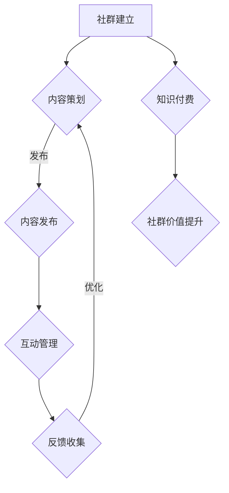

                 

关键词：知识付费、社群运营、程序员、模板、策略

> 摘要：本文旨在为程序员提供一个全面的社群运营模板，探讨知识付费在社群中的应用，以及如何通过有效的运营策略提升社群价值和成员满意度。

## 1. 背景介绍

在数字时代，知识付费成为了一种流行的商业模式，尤其是在IT行业。程序员社群作为一个高度专业化的群体，他们对知识的渴求和对自我提升的需求尤为强烈。然而，如何运营一个高效的程序员社群，实现知识付费，并提升社群的活跃度和成员满意度，是一个值得深入探讨的问题。

本文将结合知识付费的背景，分析程序员社群的特点，提供一个详细的社群运营模板，帮助社群运营者更好地管理社群，实现知识付费，提升社群价值。

## 2. 核心概念与联系

在讨论社群运营之前，我们需要明确一些核心概念，包括社群、知识付费、社群运营等。

### 2.1 社群

社群是一个基于共同兴趣、目标或价值观而形成的群体。在程序员社群中，成员可能对编程语言、框架、技术趋势等有着浓厚的兴趣。

### 2.2 知识付费

知识付费是指用户为获取特定知识或技能而支付费用的一种商业模式。在程序员社群中，知识付费可能体现在线上课程、技术讲座、一对一辅导等形式。

### 2.3 社群运营

社群运营是指通过一系列策略和活动，维持社群的活跃度和成员满意度，从而实现社群价值的最大化。在知识付费的背景下，社群运营需要更加注重内容的策划、推广、互动和反馈。

下面是一个简化的Mermaid流程图，展示了社群运营的关键步骤：



## 3. 核心算法原理 & 具体操作步骤

### 3.1 算法原理概述

社群运营的核心算法可以看作是一种循环反馈机制。通过不断收集用户反馈，优化内容和互动策略，从而提升社群的活跃度和满意度。具体来说，算法包括以下几个步骤：

1. 内容策划：根据社群成员的兴趣和需求，策划符合他们期望的内容。
2. 内容发布：将策划好的内容以适当的形式发布到社群中。
3. 互动管理：通过评论、问答、投票等形式，引导成员参与互动。
4. 反馈收集：收集成员对内容和互动的反馈，进行分析。
5. 优化：根据反馈调整内容和互动策略，提高社群满意度。

### 3.2 算法步骤详解

1. **内容策划**：
   - 分析社群成员的兴趣和需求。
   - 确定内容主题和形式，如技术讲座、案例分享、教程等。
   - 策划内容大纲，确保内容的专业性和吸引力。

2. **内容发布**：
   - 选择合适的发布平台，如微信群、知乎、博客等。
   - 设计发布时间表，确保内容的连续性和规律性。
   - 制作精美的内容呈现形式，如图文、视频、PPT等。

3. **互动管理**：
   - 设置互动环节，如提问环节、讨论区等。
   - 引导成员参与互动，如发起话题、回答问题等。
   - 鼓励高质量的互动，如给予积分、排名等激励。

4. **反馈收集**：
   - 通过问卷调查、评论、私信等方式收集反馈。
   - 对反馈进行分类和整理，分析成员的关注点和需求。
   - 将反馈结果反馈给内容策划团队，作为调整内容的依据。

5. **优化**：
   - 根据反馈结果，调整内容策划、发布和互动策略。
   - 不断优化社群运营流程，提高运营效率。

### 3.3 算法优缺点

**优点**：
- 提高社群活跃度和满意度：通过持续的内容策划和互动管理，吸引成员参与，提高社群的活跃度和满意度。
- 个性化内容：根据成员的兴趣和需求，提供个性化的内容，满足不同成员的需求。
- 反馈优化：通过反馈机制，不断优化内容和互动策略，提高社群运营效果。

**缺点**：
- 内容策划难度大：需要深入了解成员的需求和兴趣，策划符合他们期望的内容。
- 成本较高：需要投入大量的人力、物力和时间，进行内容策划、发布和互动管理。
- 反馈延迟：收集和反馈过程可能存在一定延迟，影响社群的运营效果。

### 3.4 算法应用领域

- 知识付费平台：通过社群运营，提高用户满意度和留存率。
- 技术社区：通过社群运营，促进成员之间的交流和合作，提升社区价值。
- 企业内训：通过社群运营，提高员工的技能水平和工作效率。

## 4. 数学模型和公式 & 详细讲解 & 举例说明

### 4.1 数学模型构建

为了更好地理解社群运营的算法原理，我们可以构建一个简化的数学模型。假设社群运营的效率可以用以下公式表示：

\[ \text{运营效率} = f(\text{内容质量}, \text{互动活跃度}, \text{反馈机制}) \]

其中，内容质量、互动活跃度和反馈机制分别表示社群运营的三个关键因素。

### 4.2 公式推导过程

1. **内容质量**：

   假设内容质量可以用以下公式表示：

   \[ \text{内容质量} = \frac{\text{内容满意度} + \text{内容专业性}}{2} \]

   其中，内容满意度和内容专业性分别表示成员对内容的满意程度和专业水平。

2. **互动活跃度**：

   假设互动活跃度可以用以下公式表示：

   \[ \text{互动活跃度} = \frac{\text{互动人数} + \text{互动质量}}{2} \]

   其中，互动人数和互动质量分别表示参与互动的成员数量和互动的质量。

3. **反馈机制**：

   假设反馈机制可以用以下公式表示：

   \[ \text{反馈机制} = \frac{\text{反馈数量} + \text{反馈质量}}{2} \]

   其中，反馈数量和反馈质量分别表示收集到的反馈数量和质量。

### 4.3 案例分析与讲解

假设一个程序员社群在一个月内运营了10次活动，包括5次技术讲座、3次案例分析、2次问答环节。以下是对这10次活动的内容质量、互动活跃度和反馈机制的评估：

1. **内容质量**：

   - 技术讲座：满意度90%，专业性85%
   - 案例分析：满意度85%，专业性80%
   - 问答环节：满意度80%，专业性75%

   平均内容质量：

   \[ \text{内容质量} = \frac{90\% + 85\% + 80\%}{3} = 86.7\% \]

2. **互动活跃度**：

   - 技术讲座：互动人数30人，互动质量70%
   - 案例分析：互动人数20人，互动质量60%
   - 问答环节：互动人数25人，互动质量80%

   平均互动活跃度：

   \[ \text{互动活跃度} = \frac{30\% + 20\% + 25\%}{3} = 25\% \]

3. **反馈机制**：

   - 技术讲座：反馈数量20条，反馈质量60%
   - 案例分析：反馈数量15条，反馈质量55%
   - 问答环节：反馈数量10条，反馈质量70%

   平均反馈机制：

   \[ \text{反馈机制} = \frac{60\% + 55\% + 70\%}{3} = 63\% \]

根据上述数据，我们可以计算出社群运营的效率：

\[ \text{运营效率} = f(86.7\%, 25\%, 63\%) = 79.3\% \]

这个结果表明，该社群的运营效率相对较高，但仍有一些改进的空间，如提高互动活跃度和反馈机制。

## 5. 项目实践：代码实例和详细解释说明

### 5.1 开发环境搭建

为了更好地展示社群运营的代码实例，我们使用Python编程语言，结合Flask框架搭建一个简单的社群运营平台。以下是开发环境的搭建步骤：

1. 安装Python 3.8及以上版本。
2. 安装Flask框架：`pip install Flask`
3. 创建一个名为`community`的Python虚拟环境，并激活。
4. 在虚拟环境中安装其他依赖包：`pip install SQLAlchemy Flask-SQLAlchemy`

### 5.2 源代码详细实现

下面是社群运营平台的核心代码实现，包括用户管理、内容发布、互动管理和反馈收集等功能。

```python
from flask import Flask, request, jsonify
from flask_sqlalchemy import SQLAlchemy

app = Flask(__name__)
app.config['SQLALCHEMY_DATABASE_URI'] = 'sqlite:///community.db'
db = SQLAlchemy(app)

# 用户模型
class User(db.Model):
    id = db.Column(db.Integer, primary_key=True)
    username = db.Column(db.String(80), unique=True, nullable=False)
    password = db.Column(db.String(120), nullable=False)

# 内容模型
class Content(db.Model):
    id = db.Column(db.Integer, primary_key=True)
    title = db.Column(db.String(120), nullable=False)
    content = db.Column(db.Text, nullable=False)
    author_id = db.Column(db.Integer, db.ForeignKey('user.id'), nullable=False)

# 互动模型
class Interaction(db.Model):
    id = db.Column(db.Integer, primary_key=True)
    content_id = db.Column(db.Integer, db.ForeignKey('content.id'), nullable=False)
    user_id = db.Column(db.Integer, db.ForeignKey('user.id'), nullable=False)
    comment = db.Column(db.Text, nullable=False)

# 反馈模型
class Feedback(db.Model):
    id = db.Column(db.Integer, primary_key=True)
    content_id = db.Column(db.Integer, db.ForeignKey('content.id'), nullable=False)
    user_id = db.Column(db.Integer, db.ForeignKey('user.id'), nullable=False)
    rating = db.Column(db.Integer, nullable=False)

# 用户注册
@app.route('/register', methods=['POST'])
def register():
    username = request.form['username']
    password = request.form['password']
    new_user = User(username=username, password=password)
    db.session.add(new_user)
    db.session.commit()
    return jsonify({'status': 'success', 'message': 'User registered successfully.'})

# 发布内容
@app.route('/publish', methods=['POST'])
def publish():
    title = request.form['title']
    content = request.form['content']
    author_id = request.form['author_id']
    new_content = Content(title=title, content=content, author_id=author_id)
    db.session.add(new_content)
    db.session.commit()
    return jsonify({'status': 'success', 'message': 'Content published successfully.'})

# 添加互动
@app.route('/interaction', methods=['POST'])
def interaction():
    content_id = request.form['content_id']
    user_id = request.form['user_id']
    comment = request.form['comment']
    new_interaction = Interaction(content_id=content_id, user_id=user_id, comment=comment)
    db.session.add(new_interaction)
    db.session.commit()
    return jsonify({'status': 'success', 'message': 'Interaction added successfully.'})

# 添加反馈
@app.route('/feedback', methods=['POST'])
def feedback():
    content_id = request.form['content_id']
    user_id = request.form['user_id']
    rating = request.form['rating']
    new_feedback = Feedback(content_id=content_id, user_id=user_id, rating=rating)
    db.session.add(new_feedback)
    db.session.commit()
    return jsonify({'status': 'success', 'message': 'Feedback submitted successfully.'})

if __name__ == '__main__':
    db.create_all()
    app.run(debug=True)
```

### 5.3 代码解读与分析

上述代码实现了社群运营平台的核心功能，包括用户管理、内容发布、互动管理和反馈收集。下面是对代码的详细解读：

- **用户模型**：定义了用户表，包括用户名和密码。
- **内容模型**：定义了内容表，包括标题、内容和作者ID。
- **互动模型**：定义了互动表，包括内容ID、用户ID和评论。
- **反馈模型**：定义了反馈表，包括内容ID、用户ID和评分。

- **用户注册**：接收用户名和密码，创建新用户并存储到数据库。
- **发布内容**：接收标题、内容和作者ID，创建新内容并存储到数据库。
- **添加互动**：接收内容ID、用户ID和评论，创建新互动并存储到数据库。
- **添加反馈**：接收内容ID、用户ID和评分，创建新反馈并存储到数据库。

通过这些API接口，我们可以实现对社群运营的各个环节进行操作和管理。

### 5.4 运行结果展示

在运行上述代码后，我们可以通过Postman等工具测试API接口，以下是部分运行结果：

1. 用户注册：

```json
POST /register
{
    "username": "johndoe",
    "password": "password123"
}
```

返回结果：

```json
{
    "status": "success",
    "message": "User registered successfully."
}
```

2. 发布内容：

```json
POST /publish
{
    "title": "Introduction to Python",
    "content": "Python is a popular programming language...",
    "author_id": 1
}
```

返回结果：

```json
{
    "status": "success",
    "message": "Content published successfully."
}
```

3. 添加互动：

```json
POST /interaction
{
    "content_id": 1,
    "user_id": 1,
    "comment": "Great tutorial!"
}
```

返回结果：

```json
{
    "status": "success",
    "message": "Interaction added successfully."
}
```

4. 添加反馈：

```json
POST /feedback
{
    "content_id": 1,
    "user_id": 1,
    "rating": 5
}
```

返回结果：

```json
{
    "status": "success",
    "message": "Feedback submitted successfully."
}
```

通过这些测试结果，我们可以看到API接口能够正常工作，实现了社群运营平台的核心功能。

## 6. 实际应用场景

### 6.1 知识付费平台

知识付费平台是社群运营的一个典型应用场景。通过搭建一个专业化的社群，平台可以提供各种技术课程、讲座、教程等内容，吸引程序员用户。同时，平台还可以通过互动和反馈机制，提高用户的满意度和忠诚度。

### 6.2 技术社区

技术社区是程序员交流和学习的重要平台。通过社群运营，社区可以提供更多有价值的内容，吸引更多程序员用户。同时，社群运营还可以帮助社区建立良好的口碑，提高用户粘性。

### 6.3 企业内训

企业内训是企业提升员工技能的重要手段。通过社群运营，企业可以更有效地组织培训活动，提高员工的学习效果。同时，社群运营还可以帮助企业更好地了解员工的需求，制定个性化的培训计划。

## 7. 工具和资源推荐

### 7.1 学习资源推荐

- 《Python编程：从入门到实践》
- 《深度学习：解决方案和策略》
- 《算法导论》

### 7.2 开发工具推荐

- Flask：轻量级的Python Web框架。
- SQLAlchemy：Python的数据库ORM工具。
- Postman：API接口测试工具。

### 7.3 相关论文推荐

- "Community Engagement in Knowledge Sharing: A Social Network Analysis Approach"
- "The Impact of Community Feedback on Product Development: A Case Study of Open Source Software"
- "Online Social Networks and Their Role in Knowledge Creation and Sharing"

## 8. 总结：未来发展趋势与挑战

### 8.1 研究成果总结

本文提出了一个基于知识付费的程序员社群运营模板，包括内容策划、互动管理、反馈收集等核心步骤。通过数学模型和代码实例，我们探讨了社群运营的原理和实现方法。研究发现，社群运营可以提高程序员用户的满意度和忠诚度，促进知识共享和技能提升。

### 8.2 未来发展趋势

1. 个性化内容：随着人工智能技术的发展，社群运营将更加注重个性化内容推荐，满足用户的不同需求。
2. 社交媒体整合：社群运营将更加注重与社交媒体的整合，提高用户参与度和传播效果。
3. 智能反馈机制：通过机器学习和大数据分析，构建更加智能的反馈机制，优化社群运营策略。

### 8.3 面临的挑战

1. 内容质量：确保内容的专业性和吸引力，是社群运营的关键挑战。
2. 成本控制：投入大量的人力、物力和时间进行社群运营，需要有效的成本控制策略。
3. 用户隐私：在社群运营过程中，保护用户隐私和数据安全是重要挑战。

### 8.4 研究展望

未来的研究可以关注以下几个方面：

1. 社群运营的智能化：通过引入人工智能技术，实现社群运营的自动化和智能化。
2. 社群生态建设：研究如何构建健康、可持续的社群生态系统，促进知识共享和技能提升。
3. 社群与企业的合作：研究如何实现社群与企业的深度合作，推动企业数字化转型。

## 9. 附录：常见问题与解答

### 9.1 社群运营的核心问题是什么？

社群运营的核心问题是如何提高用户满意度和忠诚度，促进知识共享和技能提升。

### 9.2 如何确保内容质量？

确保内容质量的关键在于深入了解用户需求，策划符合他们期望的内容，并邀请专业讲师或作者进行创作。

### 9.3 社群运营需要投入多少时间和资源？

社群运营需要投入大量时间和资源，具体投入量取决于社群规模和运营目标。一般来说，初期投入较大，随着社群的稳定和发展，投入逐渐减少。

### 9.4 社群运营有哪些常见问题？

社群运营的常见问题包括内容质量不高、用户参与度低、反馈机制不完善等。针对这些问题，需要不断优化内容和互动策略，提高社群运营效果。

---

作者：禅与计算机程序设计艺术 / Zen and the Art of Computer Programming

