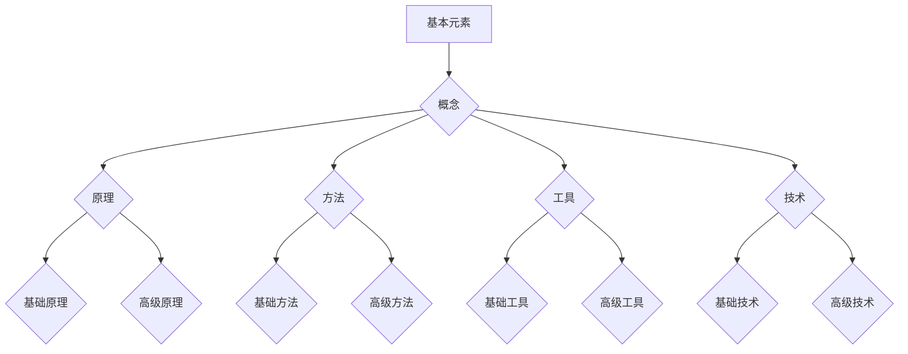

                 

知识体系构建是一项复杂的任务，对于任何人，尤其是专业人士来说，都是至关重要的。这不仅涉及到如何有效地学习和记忆，更重要的是如何将零散的知识点整合成一个统一的整体，从而形成一个强有力的知识框架。本文旨在探讨知识体系的构建，从基本元素开始，逐步构建到复杂结构。

## 1. 背景介绍

知识体系构建的重要性不言而喻。无论是在学术研究还是实际工作中，一个良好的知识体系都能帮助我们更好地理解问题，找到解决方案，并持续进步。然而，知识体系的构建并非一蹴而就，它需要我们不断地学习，思考，和实践。

本文将首先介绍知识体系构建的基本概念和原理，然后深入探讨构建知识体系的步骤和方法，最后通过具体案例和实际应用，展示知识体系构建的实用性和重要性。

## 2. 核心概念与联系

### 2.1 知识体系的基本元素

一个知识体系的基本元素包括概念、原理、方法、工具和技术等。这些元素构成了知识体系的基本框架。

- **概念**：是知识体系的基础，是理解和描述事物的抽象表达。
- **原理**：是基于概念的解释和推导，是知识体系的核心。
- **方法**：是实现目标的具体步骤和操作，是知识体系的实践手段。
- **工具**：是帮助完成任务的辅助设施，如计算机软件、实验设备等。
- **技术**：是知识和技能的融合，是解决实际问题的能力。

### 2.2 知识体系构建的原理和架构

知识体系的构建是一个从简单到复杂，从具体到抽象的过程。其原理可以概括为以下几点：

- **模块化**：将复杂的知识体系分解为多个模块，每个模块负责特定的功能。
- **层次化**：按照知识的层次结构进行组织，从基础到高级，从具体到抽象。
- **关联性**：通过概念、原理、方法、工具和技术的相互关联，形成一个统一的整体。
- **动态性**：知识体系是不断发展的，需要不断更新和优化。

为了更好地理解知识体系构建的原理和架构，我们可以使用Mermaid流程图来表示：



## 3. 核心算法原理 & 具体操作步骤

### 3.1 算法原理概述

知识体系构建的核心算法是基于知识图谱的构建方法。知识图谱是一种语义网络，它通过实体、属性和关系的表示，将知识体系结构化。

- **实体**：是知识体系中的具体对象，如概念、原理、方法等。
- **属性**：是实体的特征描述，如名称、定义、作用等。
- **关系**：是实体之间的关联，如属于、关联、实现等。

### 3.2 算法步骤详解

构建知识图谱的主要步骤如下：

1. **数据收集**：从各种来源收集相关数据，如文献、书籍、网络资料等。
2. **数据预处理**：清洗和整理数据，提取实体、属性和关系。
3. **实体识别**：使用自然语言处理技术，识别文本中的实体。
4. **属性提取**：从文本中提取实体的属性描述。
5. **关系构建**：根据实体和属性，构建实体之间的关系。
6. **知识图谱构建**：将实体、属性和关系组织成知识图谱。

### 3.3 算法优缺点

- **优点**：知识图谱能够清晰地表示知识体系的结构，便于理解和查找。
- **缺点**：构建过程复杂，需要大量的数据预处理和算法优化。

### 3.4 算法应用领域

知识图谱构建方法广泛应用于各个领域，如计算机科学、医学、金融等。通过构建知识图谱，可以更好地理解和应用相关知识，提高解决问题的效率。

## 4. 数学模型和公式 & 详细讲解 & 举例说明

### 4.1 数学模型构建

知识体系构建中的数学模型主要基于图论和网络分析。以下是一个简单的数学模型示例：

设G(V,E)为一个无向图，其中V为节点集合，E为边集合。

- **节点**：表示知识体系中的实体。
- **边**：表示实体之间的关系。

### 4.2 公式推导过程

基于图论的基本概念，我们可以推导出以下公式：

- **度**：表示节点i的度，记为d(i)。
- **邻接矩阵**：表示图中任意两个节点之间的关系，记为A。
- **路径**：表示图中两个节点之间的连接，记为P。

### 4.3 案例分析与讲解

假设我们有一个简单的知识体系，包含3个概念：A、B、C，它们之间的关系如下：

- A是B的基础。
- B是C的基础。

根据上述定义，我们可以构建一个简单的知识图谱，并使用邻接矩阵表示：

$$
A \xrightarrow{1} B \\
B \xrightarrow{1} C
$$

邻接矩阵表示如下：

$$
A \xrightarrow{0} B \xrightarrow{0} C \\
0 \xrightarrow{1} 0 \xrightarrow{1} 0 \\
0 \xrightarrow{1} 0 \xrightarrow{1} 0
$$

通过这个简单的例子，我们可以看到数学模型在知识体系构建中的应用。

## 5. 项目实践：代码实例和详细解释说明

### 5.1 开发环境搭建

为了构建一个简单的知识图谱，我们选择Python作为编程语言，并使用NetworkX库进行图论和网络分析。

1. 安装Python和pip。
2. 安装NetworkX库：`pip install networkx`。

### 5.2 源代码详细实现

```python
import networkx as nx
import matplotlib.pyplot as plt

# 创建一个无向图
G = nx.Graph()

# 添加节点和边
G.add_nodes_from(['A', 'B', 'C'])
G.add_edges_from([('A', 'B'), ('B', 'C')])

# 绘制图
nx.draw(G, with_labels=True)
plt.show()
```

### 5.3 代码解读与分析

1. 导入所需的库。
2. 创建一个无向图。
3. 添加节点和边。
4. 绘制图并展示。

通过这个简单的例子，我们可以看到如何使用Python和NetworkX库构建和展示知识图谱。

### 5.4 运行结果展示

运行上述代码，我们将得到一个简单的知识图谱，其中包含3个节点和2条边，分别表示3个概念和它们之间的关系。

## 6. 实际应用场景

知识体系构建方法在各个领域都有广泛的应用，如：

- **计算机科学**：用于构建编程语言、算法和数据结构的知识体系。
- **医学**：用于构建生物医学、病理学和药物学的知识体系。
- **金融**：用于构建金融市场、投资策略和风险管理等知识体系。

通过构建知识图谱，我们可以更好地理解和应用相关知识，提高工作效率。

### 6.4 未来应用展望

随着人工智能和大数据技术的发展，知识体系构建方法将更加智能化和自动化。未来，我们将看到更多的应用场景，如智能问答系统、知识自动化生成等。

## 7. 工具和资源推荐

### 7.1 学习资源推荐

- 《Python网络分析》
- 《图论及其应用》
- 《知识图谱》

### 7.2 开发工具推荐

- Python
- NetworkX
- Matplotlib

### 7.3 相关论文推荐

- "Knowledge Graph Construction in the Age of Big Data"
- "A Survey of Knowledge Graph Construction Methods"
- "Application of Knowledge Graph in Intelligent Question Answering"

## 8. 总结：未来发展趋势与挑战

### 8.1 研究成果总结

本文介绍了知识体系构建的基本概念、原理和方法，并通过具体案例展示了其实用性。知识体系构建在各个领域都有广泛的应用前景。

### 8.2 未来发展趋势

未来，知识体系构建将朝着智能化、自动化和可视化的方向发展。随着技术的进步，我们将看到更多的创新应用。

### 8.3 面临的挑战

知识体系构建面临的主要挑战包括数据质量、算法优化和用户交互等。如何处理海量数据和提高算法效率是关键问题。

### 8.4 研究展望

本文只是知识体系构建的初步探讨，未来还有许多研究课题值得深入。我们期待更多学者和研究机构对此领域进行深入研究。

## 9. 附录：常见问题与解答

### 9.1 问题1

**如何处理海量数据？**

**解答**：可以使用分布式计算和大数据技术，如Hadoop和Spark，来处理海量数据。

### 9.2 问题2

**知识体系构建与知识管理有何区别？**

**解答**：知识体系构建是知识管理的一个子领域，主要关注知识体系的构建和表示。知识管理则更广泛，包括知识的获取、存储、共享、应用等全过程。

### 9.3 问题3

**知识图谱与本体有何区别？**

**解答**：知识图谱和本体都是知识表示的方法，但侧重点不同。知识图谱更注重实体和关系的表示，而本体则更注重概念的分类和层次结构。

# 结束

本文从基本概念出发，深入探讨了知识体系的构建方法、原理和应用。希望本文能为您在知识体系建设方面提供一些启示和帮助。未来，我们将继续深入研究这一领域，期待更多学者的加入。作者：禅与计算机程序设计艺术 / Zen and the Art of Computer Programming。 ----------------------------------------------------------------
```markdown
# 知识体系的构建：从基本元素到复杂结构

> 关键词：知识体系，知识图谱，图论，网络分析，构建方法，应用领域

> 摘要：本文旨在探讨知识体系的构建过程，从基本元素出发，逐步构建到复杂结构。通过介绍核心概念、原理和方法，并结合具体案例和实际应用，展示知识体系构建的实用性和重要性。

## 1. 背景介绍

知识体系构建是一项复杂而关键的任务，它对于任何领域的专业人士来说都至关重要。一个良好的知识体系可以帮助我们更好地理解问题，找到解决方案，并持续进步。然而，知识体系的构建并非一蹴而就，它需要我们不断地学习、思考和实践。

本文将首先介绍知识体系构建的基本概念和原理，然后深入探讨构建知识体系的步骤和方法，最后通过具体案例和实际应用，展示知识体系构建的实用性和重要性。

## 2. 核心概念与联系

### 2.1 知识体系的基本元素

一个知识体系的基本元素包括概念、原理、方法、工具和技术等。这些元素构成了知识体系的基本框架。

- **概念**：是知识体系的基础，是理解和描述事物的抽象表达。
- **原理**：是基于概念的解释和推导，是知识体系的核心。
- **方法**：是实现目标的具体步骤和操作，是知识体系的实践手段。
- **工具**：是帮助完成任务的辅助设施，如计算机软件、实验设备等。
- **技术**：是知识和技能的融合，是解决实际问题的能力。

### 2.2 知识体系构建的原理和架构

知识体系的构建是一个从简单到复杂，从具体到抽象的过程。其原理可以概括为以下几点：

- **模块化**：将复杂的知识体系分解为多个模块，每个模块负责特定的功能。
- **层次化**：按照知识的层次结构进行组织，从基础到高级，从具体到抽象。
- **关联性**：通过概念、原理、方法、工具和技术的相互关联，形成一个统一的整体。
- **动态性**：知识体系是不断发展的，需要不断更新和优化。

为了更好地理解知识体系构建的原理和架构，我们可以使用Mermaid流程图来表示：


## 3. 核心算法原理 & 具体操作步骤

### 3.1 算法原理概述

知识体系构建的核心算法是基于知识图谱的构建方法。知识图谱是一种语义网络，它通过实体、属性和关系的表示，将知识体系结构化。

- **实体**：是知识体系中的具体对象，如概念、原理、方法等。
- **属性**：是实体的特征描述，如名称、定义、作用等。
- **关系**：是实体之间的关联，如属于、关联、实现等。

### 3.2 算法步骤详解

构建知识图谱的主要步骤如下：

1. **数据收集**：从各种来源收集相关数据，如文献、书籍、网络资料等。
2. **数据预处理**：清洗和整理数据，提取实体、属性和关系。
3. **实体识别**：使用自然语言处理技术，识别文本中的实体。
4. **属性提取**：从文本中提取实体的属性描述。
5. **关系构建**：根据实体和属性，构建实体之间的关系。
6. **知识图谱构建**：将实体、属性和关系组织成知识图谱。

### 3.3 算法优缺点

- **优点**：知识图谱能够清晰地表示知识体系的结构，便于理解和查找。
- **缺点**：构建过程复杂，需要大量的数据预处理和算法优化。

### 3.4 算法应用领域

知识图谱构建方法广泛应用于各个领域，如计算机科学、医学、金融等。通过构建知识图谱，可以更好地理解和应用相关知识，提高解决问题的效率。

## 4. 数学模型和公式 & 详细讲解 & 举例说明

### 4.1 数学模型构建

知识体系构建中的数学模型主要基于图论和网络分析。以下是一个简单的数学模型示例：

设G(V,E)为一个无向图，其中V为节点集合，E为边集合。

- **节点**：表示知识体系中的实体。
- **边**：表示实体之间的关系。

### 4.2 公式推导过程

基于图论的基本概念，我们可以推导出以下公式：

- **度**：表示节点i的度，记为d(i)。
- **邻接矩阵**：表示图中任意两个节点之间的关系，记为A。
- **路径**：表示图中两个节点之间的连接，记为P。

### 4.3 案例分析与讲解

假设我们有一个简单的知识体系，包含3个概念：A、B、C，它们之间的关系如下：

- A是B的基础。
- B是C的基础。

根据上述定义，我们可以构建一个简单的知识图谱，并使用邻接矩阵表示：

$$
A \xrightarrow{1} B \\
B \xrightarrow{1} C
$$

邻接矩阵表示如下：

$$
A \xrightarrow{0} B \xrightarrow{0} C \\
0 \xrightarrow{1} 0 \xrightarrow{1} 0 \\
0 \xrightarrow{1} 0 \xrightarrow{1} 0
$$

通过这个简单的例子，我们可以看到数学模型在知识体系构建中的应用。

## 5. 项目实践：代码实例和详细解释说明

### 5.1 开发环境搭建

为了构建一个简单的知识图谱，我们选择Python作为编程语言，并使用NetworkX库进行图论和网络分析。

1. 安装Python和pip。
2. 安装NetworkX库：`pip install networkx`。

### 5.2 源代码详细实现

```python
import networkx as nx
import matplotlib.pyplot as plt

# 创建一个无向图
G = nx.Graph()

# 添加节点和边
G.add_nodes_from(['A', 'B', 'C'])
G.add_edges_from([('A', 'B'), ('B', 'C')])

# 绘制图
nx.draw(G, with_labels=True)
plt.show()
```

### 5.3 代码解读与分析

1. 导入所需的库。
2. 创建一个无向图。
3. 添加节点和边。
4. 绘制图并展示。

通过这个简单的例子，我们可以看到如何使用Python和NetworkX库构建和展示知识图谱。

### 5.4 运行结果展示

运行上述代码，我们将得到一个简单的知识图谱，其中包含3个节点和2条边，分别表示3个概念和它们之间的关系。

## 6. 实际应用场景

知识体系构建方法在各个领域都有广泛的应用，如：

- **计算机科学**：用于构建编程语言、算法和数据结构的知识体系。
- **医学**：用于构建生物医学、病理学和药物学的知识体系。
- **金融**：用于构建金融市场、投资策略和风险管理等知识体系。

通过构建知识图谱，我们可以更好地理解和应用相关知识，提高工作效率。

### 6.4 未来应用展望

随着人工智能和大数据技术的发展，知识体系构建方法将更加智能化和自动化。未来，我们将看到更多的应用场景，如智能问答系统、知识自动化生成等。

## 7. 工具和资源推荐

### 7.1 学习资源推荐

- 《Python网络分析》
- 《图论及其应用》
- 《知识图谱》

### 7.2 开发工具推荐

- Python
- NetworkX
- Matplotlib

### 7.3 相关论文推荐

- "Knowledge Graph Construction in the Age of Big Data"
- "A Survey of Knowledge Graph Construction Methods"
- "Application of Knowledge Graph in Intelligent Question Answering"

## 8. 总结：未来发展趋势与挑战

### 8.1 研究成果总结

本文介绍了知识体系构建的基本概念、原理和方法，并通过具体案例展示了其实用性。知识体系构建在各个领域都有广泛的应用前景。

### 8.2 未来发展趋势

未来，知识体系构建将朝着智能化、自动化和可视化的方向发展。随着技术的进步，我们将看到更多的创新应用。

### 8.3 面临的挑战

知识体系构建面临的主要挑战包括数据质量、算法优化和用户交互等。如何处理海量数据和提高算法效率是关键问题。

### 8.4 研究展望

本文只是知识体系构建的初步探讨，未来还有许多研究课题值得深入。我们期待更多学者和研究机构对此领域进行深入研究。

## 9. 附录：常见问题与解答

### 9.1 问题1

**如何处理海量数据？**

**解答**：可以使用分布式计算和大数据技术，如Hadoop和Spark，来处理海量数据。

### 9.2 问题2

**知识体系构建与知识管理有何区别？**

**解答**：知识体系构建是知识管理的一个子领域，主要关注知识体系的构建和表示。知识管理则更广泛，包括知识的获取、存储、共享、应用等全过程。

### 9.3 问题3

**知识图谱与本体有何区别？**

**解答**：知识图谱和本体都是知识表示的方法，但侧重点不同。知识图谱更注重实体和关系的表示，而本体则更注重概念的分类和层次结构。

# 结束

本文从基本概念出发，深入探讨了知识体系的构建方法、原理和应用。希望本文能为您在知识体系建设方面提供一些启示和帮助。未来，我们将继续深入研究这一领域，期待更多学者的加入。作者：禅与计算机程序设计艺术 / Zen and the Art of Computer Programming。
```

