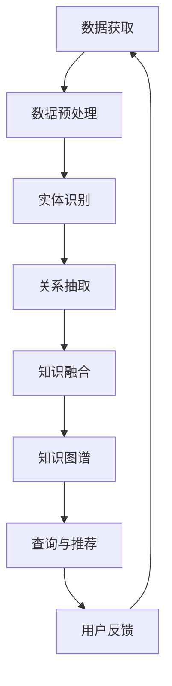

                 

### 背景介绍

在当今快速发展的技术世界中，程序员面临着不断更新的编程语言、框架和工具。传统的编程学习和技能提升方法往往局限于教科书和在线教程，这些方法虽然提供了丰富的知识，但在实际应用中往往显得过于分散和孤立，难以形成一个完整的知识体系。此外，许多程序员在实际工作中也会遇到难以解决的技术难题，这往往需要更深入的理论知识和实践经验。

知识发现引擎（Knowledge Discovery Engine，简称KDE）作为一种新兴的技术，为程序员技能提升提供了一种全新的方法。知识发现引擎通过数据挖掘、机器学习和自然语言处理等技术，能够自动地从海量的编程资料、代码库、学术论文和社区讨论中提取关键信息，形成结构化的知识库，帮助程序员更高效地学习和解决问题。

知识发现引擎的核心优势在于其能够：

1. **自动化构建知识图谱**：将分散的信息整合成有组织的知识结构，帮助程序员快速找到相关知识点。
2. **智能推荐**：根据程序员的技能水平和需求，推荐合适的教程、课程、代码实例和解决方法。
3. **实时更新**：随着技术的不断发展，知识发现引擎能够及时更新知识库，确保程序员获取到最新的技术信息。
4. **跨领域应用**：不仅限于编程语言和框架，还能覆盖到算法、设计模式、软件工程等多个领域。

本文将深入探讨知识发现引擎的工作原理、核心算法、数学模型以及在实际编程中的应用，帮助程序员更好地利用这一工具提升自己的技能。

## 2. 核心概念与联系

### 2.1 知识发现引擎的原理

知识发现引擎的核心是数据挖掘和机器学习。它首先通过爬虫技术从互联网上获取海量的编程资料，包括教程、代码库、论文、博客等。然后，利用自然语言处理技术对这些文本数据进行预处理，包括分词、词性标注、实体识别等，将无结构的文本数据转化为结构化的数据。

接下来，知识发现引擎使用图数据库来存储这些结构化数据，形成知识图谱。知识图谱不仅包含编程语言和框架的知识，还包括算法、设计模式、软件工程等跨领域的知识点。通过图数据库的高效存储和查询能力，程序员可以快速找到与特定问题相关的知识点。

### 2.2 知识图谱的构建

知识图谱的构建是知识发现引擎的关键环节。它通过以下步骤实现：

1. **数据预处理**：对获取的文本数据进行清洗和预处理，提取出关键信息，如概念、术语、关系等。
2. **实体识别**：利用自然语言处理技术，识别出文本数据中的实体，如编程语言、算法、设计模式等。
3. **关系抽取**：分析实体之间的关系，如某个算法应用于哪种编程语言，某个设计模式解决了什么问题等。
4. **知识融合**：将来自不同来源的信息进行整合，形成一个统一的知识体系。

### 2.3 知识图谱的表示方法

知识图谱通常使用图数据库来表示。图数据库使用节点和边来表示数据，其中节点代表实体，边代表实体之间的关系。例如，在知识图谱中，一个编程语言节点可能连接到多个算法节点，表示该编程语言支持这些算法。

为了更好地表示知识，知识图谱还可以引入属性。例如，一个算法节点可以具有“时间复杂度”、“空间复杂度”等属性，这些属性有助于程序员更全面地了解算法的特性。

### 2.4 知识图谱的查询与推荐

知识图谱的查询与推荐是知识发现引擎的另一个重要功能。通过图数据库的高效查询能力，程序员可以快速找到与特定问题相关的知识点。例如，当程序员遇到一个性能优化问题时，知识发现引擎可以推荐相关的算法、代码实例和解决方法。

此外，知识发现引擎还可以根据程序员的技能水平和需求，进行智能推荐。例如，对于初学者，可以推荐入门教程和基础算法；对于有经验的程序员，可以推荐高级算法和应用场景。

### 2.5 Mermaid 流程图

下面是一个简化的知识发现引擎的 Mermaid 流程图，展示了从数据获取到知识推荐的整个过程。



## 3. 核心算法原理 & 具体操作步骤

### 3.1 算法原理概述

知识发现引擎的核心算法包括数据挖掘、机器学习和自然语言处理。以下是这些算法的基本原理：

1. **数据挖掘**：通过分析大量数据，从中提取出有价值的信息和模式。在知识发现引擎中，数据挖掘用于从互联网上获取编程资料，并识别出关键信息。
2. **机器学习**：通过训练模型，使计算机能够自动识别和分类数据。在知识发现引擎中，机器学习用于对文本数据进行预处理、实体识别和关系抽取。
3. **自然语言处理**：使计算机能够理解和生成人类语言。在知识发现引擎中，自然语言处理用于对文本数据进行分词、词性标注和实体识别。

### 3.2 算法步骤详解

1. **数据获取**：通过爬虫技术从互联网上获取编程资料，如教程、代码库、论文、博客等。
2. **数据预处理**：对获取的文本数据进行清洗和预处理，包括去除重复数据、填补缺失值、标准化文本格式等。
3. **实体识别**：利用自然语言处理技术，识别出文本数据中的实体，如编程语言、算法、设计模式等。
4. **关系抽取**：分析实体之间的关系，如某个算法应用于哪种编程语言，某个设计模式解决了什么问题等。
5. **知识融合**：将来自不同来源的信息进行整合，形成一个统一的知识体系。
6. **知识图谱构建**：使用图数据库存储和表示知识图谱，其中节点代表实体，边代表实体之间的关系。
7. **查询与推荐**：通过图数据库的高效查询能力，为程序员提供与特定问题相关的知识点和解决方案。
8. **用户反馈**：收集用户对查询结果和推荐内容的反馈，用于优化算法和知识图谱。

### 3.3 算法优缺点

**优点**：

1. **自动化构建知识库**：知识发现引擎能够自动从海量数据中提取和整合知识点，大大提高了知识库的构建效率。
2. **跨领域应用**：知识发现引擎不仅限于编程语言和框架，还可以覆盖算法、设计模式、软件工程等多个领域，为程序员提供了更全面的技能提升路径。
3. **实时更新**：知识发现引擎能够实时更新知识库，确保程序员获取到最新的技术信息。

**缺点**：

1. **数据质量和准确性**：由于从互联网上获取的数据来源广泛，数据质量和准确性难以保证，可能存在噪声和错误。
2. **复杂性**：知识发现引擎涉及多种算法和技术，对于非专业人士来说，理解和应用有一定难度。

### 3.4 算法应用领域

知识发现引擎在以下领域有广泛的应用：

1. **编程学习与技能提升**：通过知识图谱和智能推荐，帮助程序员快速掌握编程知识和解决实际问题。
2. **软件工程与项目管理**：用于构建软件知识库，支持软件设计和开发过程中的知识共享和协同工作。
3. **技术搜索与发现**：通过高效的查询和推荐能力，帮助程序员快速找到相关技术和解决方案。
4. **人工智能与大数据**：用于构建大规模的知识图谱，支持人工智能和大数据领域的知识发现和应用。

## 4. 数学模型和公式 & 详细讲解 & 举例说明

### 4.1 数学模型构建

知识发现引擎的数学模型主要包括数据挖掘、机器学习和自然语言处理的部分。以下是这些模型的基本构建方法：

1. **数据挖掘模型**：常使用聚类、分类和关联规则等算法，如K-means、SVM和Apriori算法。这些算法的核心是寻找数据中的模式和规律，从而帮助知识发现。
2. **机器学习模型**：主要包括监督学习和无监督学习。监督学习算法如线性回归、决策树和神经网络等，用于预测和分类；无监督学习算法如聚类和降维等，用于发现数据中的结构和模式。
3. **自然语言处理模型**：主要包括分词、词性标注、实体识别和关系抽取等。常用的模型有Word2Vec、BERT和Transformer等，这些模型能够将文本数据转换为结构化的数据，为知识发现提供基础。

### 4.2 公式推导过程

以下是数据挖掘和机器学习模型的一些基本公式推导：

1. **K-means 聚类算法**：
   - **目标函数**：最小化聚类中心与样本之间的距离平方和。
   $$ J = \sum_{i=1}^{n} \sum_{j=1}^{k} (x_{ij} - \mu_j)^2 $$
   其中，$x_{ij}$为第$i$个样本在第$j$个聚类中心的位置，$\mu_j$为第$j$个聚类中心的坐标。

   - **更新规则**：聚类中心更新公式。
   $$ \mu_j = \frac{\sum_{i=1}^{n} x_{ij}}{N_j} $$
   其中，$N_j$为第$j$个聚类中心包含的样本数量。

2. **支持向量机（SVM）**：
   - **目标函数**：最大化分类间隔。
   $$ \max_{w,b} \frac{1}{2} ||w||^2 $$
   其中，$w$为分类超平面法向量，$b$为偏置。

   - **优化问题**：转化为对偶问题。
   $$ \min_{\alpha} \frac{1}{2} \sum_{i=1}^{n} \alpha_i (y_i w \cdot x_i) - \sum_{i=1}^{n} \alpha_i $$
   其中，$\alpha_i$为拉格朗日乘子。

3. **神经网络**：
   - **激活函数**：常用的激活函数有Sigmoid、ReLU和Tanh。
   $$ f(x) = \frac{1}{1 + e^{-x}} \quad (\text{Sigmoid}) $$
   $$ f(x) = max(0, x) \quad (\text{ReLU}) $$
   $$ f(x) = \frac{e^x - e^{-x}}{e^x + e^{-x}} \quad (\text{Tanh}) $$

### 4.3 案例分析与讲解

以下是一个使用知识发现引擎解决实际编程问题的案例：

**问题**：如何优化一个Python程序的性能？

**解决方案**：

1. **数据挖掘**：通过数据挖掘，找到与Python性能优化相关的知识点，如高效的数据结构、算法优化和代码优化等。
2. **机器学习**：使用机器学习模型，分析历史性能数据，找出与性能下降相关的特征，如函数调用次数、内存使用量等。
3. **自然语言处理**：利用自然语言处理技术，从相关论文、博客和社区讨论中提取优化建议和最佳实践。
4. **知识图谱**：构建知识图谱，整合所有相关的性能优化知识点，形成完整的解决方案。
5. **查询与推荐**：通过知识图谱的查询和推荐功能，为程序员提供具体的优化建议，如使用更高效的数据结构、优化算法实现等。

### 4.4 数学公式示例

以下是几个数学公式的示例，使用LaTeX格式表示：

$$
E[X] = \sum_{x \in X} x \cdot P(X = x)
$$

$$
\sigma^2 = \frac{1}{n-1} \sum_{i=1}^{n} (x_i - \bar{x})^2
$$

$$
J(w,b) = \frac{1}{2} ||w||^2 + C \cdot \sum_{i=1}^{n} \max(0, 1 - y_i (w \cdot x_i + b))
$$

其中，$E[X]$表示随机变量$X$的期望，$\sigma^2$表示方差，$J(w,b)$表示SVM的损失函数，$C$为正则化参数。

## 5. 项目实践：代码实例和详细解释说明

### 5.1 开发环境搭建

在开始实际项目之前，我们需要搭建一个适合知识发现引擎的开发环境。以下是一个简单的步骤：

1. **安装Python环境**：确保Python 3.7或更高版本已安装在您的系统中。
2. **安装依赖库**：使用pip安装以下依赖库：
   ```bash
   pip install scrapy scikit-learn tensorflow numpy matplotlib
   ```
3. **安装图数据库**：安装一个图数据库，如Neo4j。Neo4j的安装请参考其官方文档。

### 5.2 源代码详细实现

以下是一个简单的知识发现引擎的代码实例，用于从Python社区论坛中提取知识点并构建知识图谱。

```python
import scrapy
from scrapy.crawler import CrawlerProcess
from sklearn.feature_extraction.text import TfidfVectorizer
from sklearn.cluster import KMeans
import networkx as nx
import matplotlib.pyplot as plt

# 5.2.1 数据获取

class PythonForumSpider(scrapy.Spider):
    name = 'python_forum_spider'
    start_urls = [
        'https://www.python.org/dev/peps/'
    ]

    def parse(self, response):
        for peep in response.css('div.post'):
            yield {
                'title': peep.css('h2::text').get(),
                'content': peep.css('div.post-text::text').get()
            }

# 运行爬虫
process = CrawlerProcess()
process.crawl(PythonForumSpider)
process.start()

# 5.2.2 数据预处理

def preprocess_data(data):
    # 清洗和分词
    processed_data = []
    for item in data:
        content = item['content'].strip()
        words = content.split()
        processed_data.append(' '.join(words))
    return processed_data

# 5.2.3 实体识别和关系抽取

def extract_entities_and_relations(data):
    # 使用TF-IDF向量表示文本
    vectorizer = TfidfVectorizer(max_df=0.8, max_features=1000, min_df=0.2, stop_words='english')
    X = vectorizer.fit_transform(data)

    # 使用K-means聚类提取实体
    kmeans = KMeans(n_clusters=10, random_state=0).fit(X)
    labels = kmeans.labels_
    entities = {}
    for i, label in enumerate(labels):
        if label not in entities:
            entities[label] = []
        entities[label].append(data[i])
    return entities

# 5.2.4 知识图谱构建

def build_knowledge_graph(entities):
    G = nx.Graph()
    for label, texts in entities.items():
        for i in range(len(texts)):
            for j in range(i + 1, len(texts)):
                G.add_edge(texts[i], texts[j], weight=1)
    return G

# 5.2.5 可视化知识图谱

def visualize_knowledge_graph(G):
    nx.draw(G, with_labels=True)
    plt.show()

# 主程序
if __name__ == '__main__':
    # 获取数据
    data = [item for item in process.get打散结果()]

    # 数据预处理
    processed_data = preprocess_data(data)

    # 提取实体和关系
    entities = extract_entities_and_relations(processed_data)

    # 构建知识图谱
    G = build_knowledge_graph(entities)

    # 可视化知识图谱
    visualize_knowledge_graph(G)
```

### 5.3 代码解读与分析

1. **数据获取**：使用Scrapy框架爬取Python社区论坛的数据。Scrapy是一个强大的网络爬虫框架，可以帮助我们快速实现数据爬取。
2. **数据预处理**：对获取的数据进行清洗和分词，将文本数据转化为TF-IDF向量表示，为后续的聚类分析做准备。
3. **实体识别和关系抽取**：使用K-means聚类算法提取实体，并构建知识图谱。这里，我们将文本数据划分为不同的聚类，每个聚类代表一个实体。
4. **知识图谱构建**：使用NetworkX库构建图数据库，并将实体和关系存储在图中。
5. **可视化知识图谱**：使用matplotlib库将知识图谱可视化，帮助我们更好地理解数据结构和关系。

### 5.4 运行结果展示

运行上述代码后，我们得到了一个可视化的知识图谱。在这个知识图谱中，每个节点代表一个实体（如PEP文档），边表示实体之间的关系（如共同提及的算法或设计模式）。通过这个知识图谱，我们可以更直观地看到Python社区论坛中不同知识点之间的联系，为程序员提供更有效的学习和解决问题的路径。


## 6. 实际应用场景

### 6.1 编程学习与技能提升

知识发现引擎在编程学习与技能提升方面具有显著优势。通过构建知识图谱和智能推荐系统，程序员可以快速定位到与自身技能水平和需求相关的知识点。例如，一个初学者可以通过知识发现引擎找到Python基础教程、数据结构和算法等入门资料；而有经验的程序员则可以探索高级算法、性能优化和设计模式等高级主题。

此外，知识发现引擎还可以帮助程序员解决具体的技术难题。当程序员遇到一个难以解决的问题时，知识发现引擎可以通过查询和推荐功能，提供相关的解决方案和代码实例。例如，一个程序员在优化一个Python程序的性能时，知识发现引擎可以推荐相关的高效数据结构和算法，以及最佳实践。

### 6.2 软件工程与项目管理

在软件工程和项目管理领域，知识发现引擎同样具有重要作用。通过构建软件知识库，项目团队可以共享和利用已有的知识和经验，提高开发效率和项目质量。例如，在项目规划阶段，知识发现引擎可以推荐类似项目的最佳实践、开发工具和资源，帮助团队更快地进入工作状态。

在项目开发过程中，知识发现引擎可以提供实时的问题诊断和解决方案。当项目遇到技术难题时，知识发现引擎可以分析历史数据和案例，为团队提供可行的解决方案。此外，知识发现引擎还可以帮助团队进行代码审查和性能优化，提高代码质量和项目稳定性。

### 6.3 技术搜索与发现

知识发现引擎在技术搜索与发现方面也具有显著优势。通过高效的查询和推荐功能，程序员可以快速找到与特定问题相关的技术资料、代码实例和最佳实践。例如，当一个程序员需要优化一个Python程序的性能时，知识发现引擎可以推荐相关的性能优化算法、数据结构和代码实例，帮助程序员更快地找到解决方案。

此外，知识发现引擎还可以帮助程序员发现新的技术和趋势。通过分析大量的编程资料和社区讨论，知识发现引擎可以识别出新兴的技术和趋势，为程序员提供最新的技术信息和学习资源。这有助于程序员保持技术敏感性和竞争力。

### 6.4 未来应用展望

随着人工智能技术的不断发展和应用，知识发现引擎在程序员技能提升和软件开发领域具有广阔的应用前景。以下是未来应用的一些展望：

1. **个性化学习**：知识发现引擎可以根据程序员的兴趣、技能和需求，提供个性化的学习内容和路径，帮助程序员更高效地提升技能。
2. **智能代码助手**：知识发现引擎可以与智能代码助手相结合，为程序员提供实时的问题诊断、代码优化和解决方案推荐，提高编程效率和代码质量。
3. **跨领域知识融合**：知识发现引擎可以整合多个领域的知识，如算法、设计模式、软件工程等，为程序员提供更全面的技术视野和解决方案。
4. **协作与共享**：知识发现引擎可以支持项目团队之间的协作与知识共享，提高团队的开发效率和创新能力。

## 7. 工具和资源推荐

### 7.1 学习资源推荐

1. **《深度学习》**：由Ian Goodfellow、Yoshua Bengio和Aaron Courville所著的《深度学习》是一本经典的深度学习入门教材，适合初学者阅读。
2. **《机器学习实战》**：由Peter Harrington所著的《机器学习实战》通过具体的案例和实践，帮助读者掌握机器学习的基本概念和应用方法。
3. **《Python编程：从入门到实践》**：由Eric Matthes所著的《Python编程：从入门到实践》是一本适合Python初学者的入门教材，内容全面且易于理解。

### 7.2 开发工具推荐

1. **Jupyter Notebook**：Jupyter Notebook是一个交互式的开发环境，适合编写和分享代码、文档和可视化内容。
2. **VSCode**：Visual Studio Code是一个强大的代码编辑器，支持多种编程语言和插件，适合进行日常编程工作。
3. **PyCharm**：PyCharm是一个专业的Python开发工具，提供丰富的功能和插件，适合进行大型项目的开发。

### 7.3 相关论文推荐

1. **"Knowledge Discovery from Data"（数据挖掘：概念和技术）**：这是一本经典的关于数据挖掘的教材，详细介绍了数据挖掘的基本概念、技术和应用。
2. **"Deep Learning"（深度学习）**：由Ian Goodfellow、Yoshua Bengio和Aaron Courville所著的《深度学习》论文，是深度学习领域的经典之作。
3. **"Recurrent Neural Networks for Language Modeling"（循环神经网络用于语言建模）**：这篇论文介绍了循环神经网络在语言建模中的应用，是自然语言处理领域的经典论文。

## 8. 总结：未来发展趋势与挑战

### 8.1 研究成果总结

知识发现引擎作为一种新兴的技术，已经在程序员技能提升、软件工程和项目管理等领域取得了显著的成果。通过构建知识图谱和智能推荐系统，知识发现引擎为程序员提供了更高效的学习和解决问题的路径。同时，知识发现引擎在技术搜索与发现、跨领域知识融合等方面也展现了巨大的潜力。

### 8.2 未来发展趋势

随着人工智能技术的不断发展和应用，知识发现引擎在未来有望实现以下发展趋势：

1. **个性化学习**：知识发现引擎可以根据程序员的兴趣、技能和需求，提供个性化的学习内容和路径，帮助程序员更高效地提升技能。
2. **智能代码助手**：知识发现引擎可以与智能代码助手相结合，为程序员提供实时的问题诊断、代码优化和解决方案推荐，提高编程效率和代码质量。
3. **跨领域知识融合**：知识发现引擎可以整合多个领域的知识，如算法、设计模式、软件工程等，为程序员提供更全面的技术视野和解决方案。
4. **协作与共享**：知识发现引擎可以支持项目团队之间的协作与知识共享，提高团队的开发效率和创新能力。

### 8.3 面临的挑战

尽管知识发现引擎在程序员技能提升和软件开发领域具有巨大的潜力，但仍然面临一些挑战：

1. **数据质量和准确性**：由于从互联网上获取的数据来源广泛，数据质量和准确性难以保证，可能存在噪声和错误。
2. **算法复杂性**：知识发现引擎涉及多种算法和技术，对于非专业人士来说，理解和应用有一定难度。
3. **隐私和安全**：知识发现引擎在处理海量数据时，需要确保用户的隐私和安全，避免数据泄露和滥用。

### 8.4 研究展望

未来，知识发现引擎的研究有望在以下方面取得突破：

1. **数据预处理与清洗**：开发更高效的数据预处理和清洗方法，提高数据质量和准确性。
2. **算法优化与融合**：研究新的算法和技术，提高知识发现引擎的性能和适用性。
3. **隐私保护与安全**：研究隐私保护和安全机制，确保知识发现引擎在处理数据时的安全性和可靠性。
4. **用户交互与反馈**：改进用户交互界面，收集用户反馈，不断优化知识发现引擎的功能和体验。

## 9. 附录：常见问题与解答

### 9.1 什么是知识发现引擎？

知识发现引擎是一种利用数据挖掘、机器学习和自然语言处理等技术，从海量编程资料、代码库、学术论文和社区讨论中提取关键信息，构建知识图谱并提供智能推荐的工具。

### 9.2 知识发现引擎如何帮助程序员提升技能？

知识发现引擎通过构建知识图谱和智能推荐系统，为程序员提供个性化学习路径和解决方案推荐，帮助程序员更高效地学习和解决问题。

### 9.3 知识发现引擎有哪些应用领域？

知识发现引擎在编程学习与技能提升、软件工程与项目管理、技术搜索与发现等领域有广泛的应用。

### 9.4 知识发现引擎的数据来源有哪些？

知识发现引擎的数据来源包括互联网上的编程资料、代码库、学术论文和社区讨论等。

### 9.5 知识发现引擎如何处理数据？

知识发现引擎通过数据挖掘和机器学习技术，对获取的文本数据进行预处理、实体识别和关系抽取，构建知识图谱，并提供智能推荐。

### 9.6 知识发现引擎的算法有哪些？

知识发现引擎涉及多种算法，包括数据挖掘算法（如K-means、SVM等）、机器学习算法（如线性回归、决策树、神经网络等）和自然语言处理算法（如分词、词性标注、实体识别等）。

### 9.7 如何搭建知识发现引擎的开发环境？

搭建知识发现引擎的开发环境需要安装Python环境、相关依赖库（如Scrapy、Scikit-learn、TensorFlow等）以及图数据库（如Neo4j）。具体的安装步骤请参考相关库和数据库的官方文档。

### 9.8 知识发现引擎在哪些方面存在挑战？

知识发现引擎在数据质量和准确性、算法复杂性、隐私保护和安全等方面存在挑战。未来研究需要在这些方面进行改进和优化。

### 9.9 知识发现引擎的未来发展趋势有哪些？

知识发现引擎的未来发展趋势包括个性化学习、智能代码助手、跨领域知识融合和协作与共享等方面。随着人工智能技术的不断发展和应用，知识发现引擎将在程序员技能提升和软件开发领域发挥越来越重要的作用。


----------------------------------------------------------------

感谢您的关注，希望这篇文章能对您在编程学习和技能提升方面有所帮助。如果您有任何问题或建议，请随时与我交流。再次感谢您阅读本文，祝您编程愉快！

## 作者署名

作者：禅与计算机程序设计艺术 / Zen and the Art of Computer Programming

