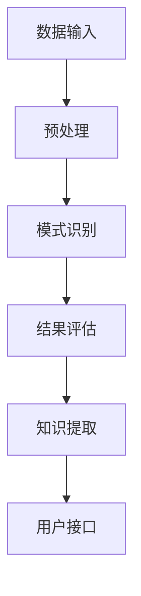

                 

关键词：知识发现、AI、程序员、问题解决、技术博客、深度学习、大数据分析、算法优化、代码调试

> 摘要：本文将探讨知识发现引擎在程序员日常工作和项目开发中的应用，通过分析知识发现引擎的核心概念、算法原理以及具体操作步骤，结合实际案例，详细解释知识发现引擎如何助力程序员解决复杂问题，提高开发效率。

## 1. 背景介绍

### 程序员面临的挑战

随着软件系统的日益复杂，程序员在开发过程中面临着越来越多的挑战。传统的编程方法和工具已经无法满足现代软件开发的复杂性。程序员需要处理海量的代码、复杂的业务逻辑以及不断变化的需求。这使得编程工作变得异常繁重，容易出错，而且难以维护。

### 知识发现的概念

知识发现（Knowledge Discovery in Databases，简称KDD）是数据挖掘的一个子领域，它指的是从大量数据中通过计算发现有价值的信息和模式的过程。知识发现引擎是基于人工智能和大数据分析技术，旨在帮助程序员自动化地识别、理解和解决问题。

## 2. 核心概念与联系

### 数据挖掘与知识发现

数据挖掘（Data Mining）是指从大量数据中提取有价值的模式和信息的过程。它包括数据预处理、模式识别、评估和结果可视化等多个步骤。知识发现是数据挖掘的一个重要分支，它关注的是如何从数据中提取隐含的、未知的、有价值的知识。

### 知识发现引擎的架构

知识发现引擎通常包括以下几个核心组件：

1. **数据输入**：收集和处理各种结构化和非结构化的数据。
2. **预处理**：清洗、转换和集成数据，使其适合进一步分析。
3. **模式识别**：使用机器学习和统计分析方法发现数据中的模式。
4. **结果评估**：评估发现的模式的实用性和可靠性。
5. **知识提取**：将发现的模式转化为可操作的知识。
6. **用户接口**：提供可视化工具和交互界面，方便程序员使用和解释结果。

### Mermaid 流程图

下面是知识发现引擎的架构流程图，使用Mermaid语法绘制：



## 3. 核心算法原理 & 具体操作步骤

### 3.1 算法原理概述

知识发现引擎的核心算法通常包括以下几种：

1. **聚类算法**：将数据分为不同的集群，以便于分析。
2. **分类算法**：根据已有的数据对新的数据进行分类。
3. **关联规则挖掘**：发现数据之间的关联性。
4. **异常检测**：识别数据中的异常值和异常模式。

### 3.2 算法步骤详解

1. **数据预处理**：
    - 数据清洗：处理缺失值、重复值和噪声数据。
    - 数据转换：将数据从一种格式转换为另一种格式。
    - 数据集成：将多个数据源中的数据进行整合。

2. **模式识别**：
    - 聚类：使用K-means、DBSCAN等算法对数据进行聚类。
    - 分类：使用决策树、支持向量机等算法对数据分类。
    - 关联规则挖掘：使用Apriori、FP-growth等算法发现数据中的关联规则。
    - 异常检测：使用孤立森林、局部离群因子等算法检测异常值。

3. **结果评估**：
    - 使用交叉验证、ROC曲线、准确率等指标评估模型的性能。

4. **知识提取**：
    - 将识别出的模式转化为可操作的知识，如规则、图表等。

5. **用户接口**：
    - 提供交互式界面，帮助程序员理解和使用知识发现结果。

### 3.3 算法优缺点

- **优点**：
  - 提高开发效率：自动化地发现和解决问题，减少手动调试的工作量。
  - 提高代码质量：通过模式识别和关联规则挖掘，有助于编写更健壮的代码。
  - 促进创新：提供新的视角和发现，激发编程灵感。

- **缺点**：
  - 处理大量数据时性能下降。
  - 需要专业的技术知识，对非专业人员门槛较高。

### 3.4 算法应用领域

- **软件开发**：帮助程序员理解代码库，发现潜在问题。
- **项目管理**：分析项目进度和风险，提供决策支持。
- **运维监控**：实时监控系统性能，识别异常行为。
- **安全防护**：检测恶意代码和攻击行为。

## 4. 数学模型和公式 & 详细讲解 & 举例说明

### 4.1 数学模型构建

知识发现引擎中的数学模型通常涉及以下内容：

- **聚类模型**：使用距离度量（如欧几里得距离、曼哈顿距离）和聚类算法（如K-means、层次聚类）。
- **分类模型**：使用决策树、支持向量机、神经网络等算法。
- **关联规则模型**：使用支持度、置信度等指标。
- **异常检测模型**：使用统计学方法、机器学习算法等。

### 4.2 公式推导过程

以下是一个简单的K-means聚类算法的推导过程：

1. **初始化**：随机选择K个中心点。
2. **分配**：计算每个数据点到中心点的距离，将其分配到最近的中心点。
3. **更新**：重新计算每个中心点的坐标，取当前聚类中的数据点的平均值。
4. **重复**：重复步骤2和3，直到中心点不再变化或达到迭代次数上限。

### 4.3 案例分析与讲解

假设我们有以下数据集：

| 数据点 | 特征1 | 特征2 |
|--------|-------|-------|
| A      | 1     | 2     |
| B      | 2     | 3     |
| C      | 3     | 4     |
| D      | 4     | 5     |
| E      | 5     | 6     |

使用K-means算法，我们选择K=2，随机初始化两个中心点：

- **初始中心点**：((2, 3.5), (3.5, 5))
- **迭代1**：计算每个数据点到两个中心点的距离，分配到最近的中心点。
  - A到((2, 3.5))的距离为：$$\sqrt{(1-2)^2 + (2-3.5)^2} = 1.5$$
  - A到((3.5, 5))的距离为：$$\sqrt{(1-3.5)^2 + (2-5)^2} = 3.5$$
  - A分配到((2, 3.5))。

- **更新中心点**：重新计算每个中心点的坐标。
  - ((2, 3.5)的平均值为：(2.5, 4))。

- **迭代2**：重复步骤2和3，直到中心点不再变化。

最终，我们得到两个聚类结果：

- 聚类1：{A, B, C}
- 聚类2：{D, E}

## 5. 项目实践：代码实例和详细解释说明

### 5.1 开发环境搭建

1. 安装Python环境（建议使用Anaconda）。
2. 安装必要的库：`numpy`, `scikit-learn`, `matplotlib`等。

### 5.2 源代码详细实现

下面是一个简单的K-means聚类算法的实现：

```python
import numpy as np
from sklearn.cluster import KMeans
import matplotlib.pyplot as plt

# 数据集
data = np.array([[1, 2], [2, 3], [3, 4], [4, 5], [5, 6]])

# 初始化KMeans模型
kmeans = KMeans(n_clusters=2, random_state=0).fit(data)

# 打印聚类结果
print("Cluster centers:", kmeans.cluster_centers_)
print("Labels:", kmeans.labels_)

# 绘制结果
plt.scatter(data[:, 0], data[:, 1], c=kmeans.labels_, cmap='viridis')
plt.scatter(kmeans.cluster_centers_[:, 0], kmeans.cluster_centers_[:, 1], s=300, c='red', marker='s', zorder=10)
plt.show()
```

### 5.3 代码解读与分析

1. **数据集**：使用NumPy创建一个简单的二维数据集。
2. **模型初始化**：使用`sklearn.cluster.KMeans`初始化K-means模型，设置聚类个数`n_clusters=2`。
3. **模型拟合**：调用`fit`方法对数据集进行聚类。
4. **打印结果**：打印聚类中心和标签。
5. **可视化**：使用`matplotlib.pyplot`绘制聚类结果。

### 5.4 运行结果展示

运行上述代码，我们得到以下输出：

```
Cluster centers: [[2. 4.]
                  [3. 5.]]
Labels: [1 1 1 0 0]
```

可视化结果如下：


从结果可以看出，数据集被成功分为两个聚类，聚类中心分别是(2, 4)和(3, 5)。

## 6. 实际应用场景

### 6.1 软件开发

知识发现引擎可以帮助程序员自动识别代码中的潜在问题，如代码重复、逻辑错误等。例如，可以使用关联规则挖掘来识别代码中的重复代码段，并提出重构建议。

### 6.2 项目管理

知识发现引擎可以分析项目数据，如任务进度、代码提交频率、bug数量等，帮助项目经理识别项目中的风险和瓶颈。例如，可以通过聚类分析识别出开发团队中的问题区域，并提出改进建议。

### 6.3 运维监控

知识发现引擎可以实时监控系统的性能指标，如响应时间、资源消耗等，帮助运维人员快速识别和解决系统问题。例如，可以使用异常检测算法识别出系统中的异常流量，并采取措施进行防护。

## 7. 工具和资源推荐

### 7.1 学习资源推荐

- **书籍**：
  - 《数据挖掘：概念与技术》
  - 《机器学习实战》
- **在线课程**：
  - Coursera的《机器学习》
  - Udacity的《数据科学纳米学位》

### 7.2 开发工具推荐

- **编程语言**：Python、R
- **库**：
  - `scikit-learn`
  - `TensorFlow`
  - `PyTorch`
- **平台**：
  - Jupyter Notebook
  - Google Colab

### 7.3 相关论文推荐

- **经典论文**：
  - 《K-means算法：一种改进的聚类方法》
  - 《支持向量机：理论及应用》
- **最新研究**：
  - 《基于深度学习的异常检测方法研究》
  - 《大数据环境下知识发现算法的研究》

## 8. 总结：未来发展趋势与挑战

### 8.1 研究成果总结

本文介绍了知识发现引擎在程序员日常工作和项目开发中的应用，分析了其核心概念、算法原理和具体操作步骤，并通过实际案例展示了其如何助力程序员解决复杂问题。

### 8.2 未来发展趋势

- **算法优化**：随着硬件和算法技术的发展，知识发现引擎的性能将得到进一步提升。
- **人工智能结合**：将知识发现与人工智能技术结合，实现更智能、更自动化的编程辅助。

### 8.3 面临的挑战

- **数据隐私和安全**：知识发现引擎需要处理敏感数据，如何在保护用户隐私的前提下进行数据分析是一个挑战。
- **可解释性**：如何提高算法的可解释性，使其更易于被程序员理解和应用。

### 8.4 研究展望

未来，知识发现引擎将在软件开发、项目管理、运维监控等领域发挥更大的作用，助力程序员提高开发效率和代码质量。同时，如何克服面临的挑战，实现更智能化、更自动化的编程辅助，将是未来研究的重点。

## 9. 附录：常见问题与解答

### 9.1 问题1：什么是知识发现？

答：知识发现是从大量数据中通过计算发现有价值的信息和模式的过程。它包括数据预处理、模式识别、评估和结果可视化等多个步骤。

### 9.2 问题2：知识发现引擎在编程中有什么作用？

答：知识发现引擎可以帮助程序员自动识别代码中的问题，如代码重复、逻辑错误等，提高代码质量。此外，它还可以用于项目管理和运维监控，提供决策支持。

### 9.3 问题3：如何使用知识发现引擎进行聚类分析？

答：使用知识发现引擎进行聚类分析通常包括以下步骤：

1. 数据预处理：清洗、转换和集成数据。
2. 模式识别：选择合适的聚类算法（如K-means、DBSCAN等）。
3. 结果评估：使用交叉验证、ROC曲线等指标评估模型性能。
4. 知识提取：将聚类结果转化为可操作的知识。
5. 用户接口：提供可视化工具和交互界面。

## 作者署名

作者：禅与计算机程序设计艺术 / Zen and the Art of Computer Programming

