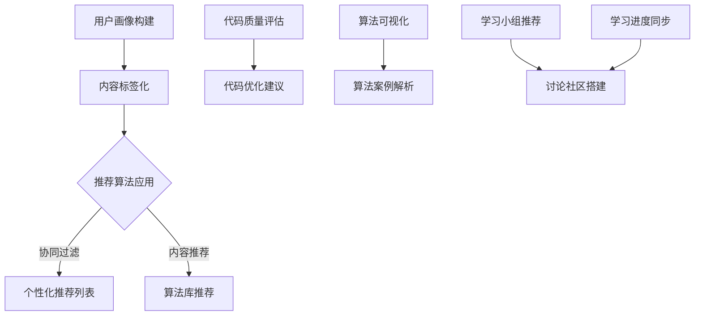

                 

关键词：知识发现引擎，程序员成长，智能推荐，代码优化，算法理解，协作学习，实践经验

> 摘要：本文将探讨知识发现引擎在程序员成长过程中的关键作用。通过智能推荐、代码优化、算法理解以及协作学习等方面，揭示知识发现引擎如何助力程序员提升技术能力、拓展视野，并在快速变化的技术领域保持竞争力。

## 1. 背景介绍

随着信息技术的飞速发展，程序员面临的挑战也日益增多。从传统的软件开发到新兴的人工智能、大数据、区块链等领域，程序员需要掌握的知识和技能不断扩展。与此同时，技术的迭代速度加快，新的编程语言、框架和工具层出不穷，这无疑给程序员的学习和成长带来了巨大的压力。

在这样的背景下，知识发现引擎作为一种新兴的技术工具，开始受到广泛关注。知识发现引擎是一种智能系统，能够从大量数据中提取知识，提供有价值的见解和洞见。它能够通过分析程序员的学习行为、编程习惯、代码质量等信息，为程序员提供个性化的学习资源和改进建议，从而帮助程序员更高效地学习和成长。

本文将围绕知识发现引擎在程序员成长过程中的关键作用，从多个方面展开讨论，包括智能推荐、代码优化、算法理解、协作学习等。

## 2. 核心概念与联系

### 2.1. 智能推荐

智能推荐是知识发现引擎的一个重要功能，它通过分析程序员的学习行为和兴趣，推荐适合他们的学习资源和课程。具体来说，智能推荐包括以下几个关键步骤：

1. **用户画像构建**：知识发现引擎会收集程序员的学习数据，如学习时间、学习内容、学习进度等，构建用户画像。
2. **内容标签化**：将学习资源进行标签化处理，例如课程、书籍、博客等，标签可以是技术领域、难度级别、应用场景等。
3. **推荐算法应用**：基于用户画像和内容标签，应用协同过滤、内容推荐等算法，生成个性化的推荐列表。

### 2.2. 代码优化

代码优化是程序员日常工作中不可或缺的一部分。知识发现引擎通过分析程序员的代码库，提供以下帮助：

1. **代码质量评估**：评估代码的可读性、可维护性、性能等方面，给出优化建议。
2. **最佳实践推荐**：推荐符合最佳实践和行业标准的代码风格和架构设计。
3. **自动化优化**：自动应用代码优化工具，如代码格式化、压缩、冗余代码删除等。

### 2.3. 算法理解

算法理解是程序员深入学习和应用技术的重要基础。知识发现引擎在算法理解方面具有以下优势：

1. **算法库推荐**：根据程序员的兴趣和项目需求，推荐相关算法库和工具。
2. **算法可视化**：通过图形化展示，帮助程序员更好地理解算法的执行过程和原理。
3. **算法案例解析**：提供典型的算法案例，详细解析算法的设计思路、实现步骤和优化策略。

### 2.4. 协作学习

协作学习是程序员提升技能和解决问题的有效方式。知识发现引擎通过以下方式促进协作学习：

1. **学习小组推荐**：根据程序员的兴趣和技能水平，推荐合适的协作学习小组。
2. **讨论社区搭建**：搭建在线讨论社区，促进程序员之间的交流与合作。
3. **学习进度同步**：跟踪学习进度，为协作学习提供数据支持。

### 2.5. Mermaid 流程图

以下是一个简化的知识发现引擎核心概念与联系的 Mermaid 流程图：



## 3. 核心算法原理 & 具体操作步骤

### 3.1. 算法原理概述

知识发现引擎的核心算法主要包括协同过滤、内容推荐、代码质量评估等。下面简要介绍这些算法的基本原理：

1. **协同过滤**：协同过滤是一种基于用户行为的推荐算法，通过分析用户的历史行为数据，找到相似的用户群体，进而推荐符合他们兴趣的资源。
2. **内容推荐**：内容推荐是基于内容的相似性进行推荐的算法，通过将资源进行标签化处理，找到具有相似标签的资源，推荐给用户。
3. **代码质量评估**：代码质量评估算法通过对代码进行分析，评估其可读性、可维护性、性能等方面，从而给出优化建议。

### 3.2. 算法步骤详解

1. **协同过滤算法步骤**：
   1. 收集用户行为数据，如学习时间、学习内容、点赞等。
   2. 计算用户之间的相似度，可以使用余弦相似度、皮尔逊相关系数等。
   3. 根据相似度矩阵，找到相似用户群体。
   4. 对于目标用户，推荐相似用户喜欢的资源。

2. **内容推荐算法步骤**：
   1. 将学习资源进行标签化处理。
   2. 计算资源之间的相似度，可以使用Jaccard相似度、余弦相似度等。
   3. 对于目标用户，推荐具有相似标签的资源。

3. **代码质量评估算法步骤**：
   1. 收集代码库数据，如代码行数、函数复杂度、循环嵌套等。
   2. 计算代码质量指标，如可读性、可维护性、性能等。
   3. 根据质量指标，给出优化建议。

### 3.3. 算法优缺点

1. **协同过滤算法优缺点**：
   - 优点：能够根据用户历史行为，提供个性化的推荐。
   - 缺点：容易受到“冷启动”问题的影响，对于新用户推荐效果较差。

2. **内容推荐算法优缺点**：
   - 优点：能够根据资源内容的相似性，提供高质量的推荐。
   - 缺点：容易导致“信息茧房”现象，用户只能接触到与已有兴趣相关的资源。

3. **代码质量评估算法优缺点**：
   - 优点：能够对代码质量进行客观评估，提供优化建议。
   - 缺点：评估指标可能过于单一，不能全面反映代码质量。

### 3.4. 算法应用领域

1. **智能推荐**：在在线教育、电子商务、社交媒体等领域，知识发现引擎广泛应用于智能推荐系统，提升用户体验。
2. **代码优化**：在软件开发过程中，知识发现引擎可以帮助程序员发现代码中的潜在问题，提高代码质量。
3. **算法理解**：在算法竞赛、学术研究等领域，知识发现引擎可以推荐相关算法库和案例，帮助研究人员快速掌握算法原理和应用。

## 4. 数学模型和公式 & 详细讲解 & 举例说明

### 4.1. 数学模型构建

知识发现引擎中的数学模型主要包括用户行为模型、内容标签模型和代码质量模型。下面分别介绍这些模型的构建方法。

1. **用户行为模型**：

   用户行为模型通常使用矩阵来表示，其中行表示用户，列表示行为，矩阵元素表示用户在特定行为上的表现。例如，一个用户在特定时间点访问了某个资源，可以表示为一个 \(1\)，否则为 \(0\)。

   假设 \(X\) 为用户行为矩阵，可以表示为：

   $$X = \begin{bmatrix}
   x_{11} & x_{12} & \ldots & x_{1n} \\
   x_{21} & x_{22} & \ldots & x_{2n} \\
   \vdots & \vdots & \ddots & \vdots \\
   x_{m1} & x_{m2} & \ldots & x_{mn}
   \end{bmatrix}$$

   其中，\(x_{ij}\) 表示用户 \(i\) 在行为 \(j\) 上的表现。

2. **内容标签模型**：

   内容标签模型同样使用矩阵来表示，其中行表示资源，列表示标签，矩阵元素表示资源在特定标签上的表现。例如，一个资源具有多个标签，可以表示为一个向量。

   假设 \(Y\) 为内容标签矩阵，可以表示为：

   $$Y = \begin{bmatrix}
   y_{11} & y_{12} & \ldots & y_{1n} \\
   y_{21} & y_{22} & \ldots & y_{2n} \\
   \vdots & \vdots & \ddots & \vdots \\
   y_{m1} & y_{m2} & \ldots & y_{mn}
   \end{bmatrix}$$

   其中，\(y_{ij}\) 表示资源 \(i\) 在标签 \(j\) 上的表现。

3. **代码质量模型**：

   代码质量模型通常使用向量来表示，其中每个元素表示代码质量的一个方面，如可读性、可维护性、性能等。例如，一个代码库可以表示为一个向量。

   假设 \(Z\) 为代码质量向量，可以表示为：

   $$Z = \begin{bmatrix}
   z_1 \\
   z_2 \\
   \vdots \\
   z_n
   \end{bmatrix}$$

   其中，\(z_i\) 表示代码质量的一个方面。

### 4.2. 公式推导过程

1. **用户相似度计算**：

   假设用户 \(i\) 和用户 \(j\) 的行为矩阵分别为 \(X_i\) 和 \(X_j\)，可以使用余弦相似度计算他们的相似度：

   $$\text{similarity}(X_i, X_j) = \frac{X_i \cdot X_j}{\|X_i\| \|X_j\|}$$

   其中，\(\cdot\) 表示向量的点积，\(\|\|\) 表示向量的模。

2. **资源相似度计算**：

   假设资源 \(i\) 和资源 \(j\) 的标签矩阵分别为 \(Y_i\) 和 \(Y_j\)，可以使用Jaccard相似度计算他们的相似度：

   $$\text{similarity}(Y_i, Y_j) = \frac{\sum_{j=1}^{n} \min(y_{ij}, z_{ij})}{\sum_{j=1}^{n} \max(y_{ij}, z_{ij})}$$

   其中，\(y_{ij}\) 和 \(z_{ij}\) 分别表示资源 \(i\) 和资源 \(j\) 在标签 \(j\) 上的表现。

3. **代码质量评估**：

   假设代码质量模型为 \(Z\)，可以使用以下公式评估代码质量：

   $$\text{code\_quality}(Z) = \sum_{i=1}^{n} w_i z_i$$

   其中，\(w_i\) 表示第 \(i\) 个方面的重要程度，通常通过专家评估或学习算法获得。

### 4.3. 案例分析与讲解

假设有两个程序员，用户 \(i\) 和用户 \(j\)，他们的行为矩阵分别为：

$$X_i = \begin{bmatrix} 1 & 0 & 1 \\ 0 & 1 & 0 \\ 1 & 1 & 0 \end{bmatrix}, X_j = \begin{bmatrix} 0 & 1 & 1 \\ 1 & 0 & 1 \\ 1 & 1 & 0 \end{bmatrix}$$

首先计算用户 \(i\) 和用户 \(j\) 的相似度：

$$\text{similarity}(X_i, X_j) = \frac{X_i \cdot X_j}{\|X_i\| \|X_j\|} = \frac{1 \times 0 + 0 \times 1 + 1 \times 1}{\sqrt{1^2 + 0^2 + 1^2} \sqrt{0^2 + 1^2 + 1^2}} = \frac{1}{\sqrt{2} \sqrt{2}} = \frac{1}{2}$$

接下来计算资源 \(i\) 和资源 \(j\) 的相似度：

假设资源 \(i\) 和资源 \(j\) 的标签矩阵分别为：

$$Y_i = \begin{bmatrix} 1 & 0 & 1 \\ 0 & 1 & 0 \\ 1 & 1 & 0 \end{bmatrix}, Y_j = \begin{bmatrix} 0 & 1 & 1 \\ 1 & 0 & 1 \\ 1 & 1 & 0 \end{bmatrix}$$

$$\text{similarity}(Y_i, Y_j) = \frac{\sum_{j=1}^{3} \min(y_{ij}, z_{ij})}{\sum_{j=1}^{3} \max(y_{ij}, z_{ij})} = \frac{\min(1,0) + \min(0,1) + \min(1,1)}{\max(1,0) + \max(0,1) + \max(1,1)} = \frac{0 + 0 + 1}{1 + 1 + 1} = \frac{1}{3}$$

最后计算代码质量评估：

假设代码质量模型为：

$$Z = \begin{bmatrix} 0.5 \\ 0.3 \\ 0.2 \end{bmatrix}$$

$$\text{code\_quality}(Z) = \sum_{i=1}^{3} w_i z_i = 0.5 \times 0.5 + 0.3 \times 0.3 + 0.2 \times 0.2 = 0.25 + 0.09 + 0.04 = 0.38$$

根据以上计算，用户 \(i\) 和用户 \(j\) 的相似度为 \(0.5\)，资源 \(i\) 和资源 \(j\) 的相似度为 \(0.3\)，代码质量评估为 \(0.38\)。

## 5. 项目实践：代码实例和详细解释说明

### 5.1. 开发环境搭建

为了更好地展示知识发现引擎在程序员成长过程中的应用，我们使用 Python 编写一个简单的知识发现引擎。以下是开发环境搭建的步骤：

1. 安装 Python 3.8 或更高版本。
2. 安装必要的库，如 NumPy、Pandas、Scikit-learn、Matplotlib 等。

```shell
pip install numpy pandas scikit-learn matplotlib
```

### 5.2. 源代码详细实现

以下是知识发现引擎的主要代码实现：

```python
import numpy as np
import pandas as pd
from sklearn.metrics.pairwise import cosine_similarity
from sklearn.metrics import jaccard_score
import matplotlib.pyplot as plt

# 用户行为数据
user_data = {
    'user1': {'course1': 1, 'course2': 0, 'course3': 1},
    'user2': {'course1': 0, 'course2': 1, 'course3': 0},
    'user3': {'course1': 1, 'course2': 1, 'course3': 1}
}

# 资源标签数据
resource_data = {
    'course1': {'data', 'machine_learning', 'python'},
    'course2': {'web_development', 'javascript', 'html'},
    'course3': {'data_science', 'r', 'python'}
}

# 构建用户行为矩阵
user行为的DataFrame = pd.DataFrame.from_dict(user_data, orient='index', columns=user_data.keys())

# 构建资源标签矩阵
resource_tags = {k: set(v) for k, v in resource_data.items()}
resource_tags_matrix = pd.DataFrame.from_dict(resource_tags, orient='index', columns=resource_tags.keys())

# 计算用户相似度
user_similarity = user行为的DataFrame.corr()

# 计算资源相似度
resource_similarity = resource_tags_matrix.corr()

# 推荐资源
def recommend_resources(user_id, resource_similarity, num_resources=2):
    similar_users = user_similarity[user_id].sort_values(ascending=False)[:num_resources]
    recommended_resources = set()
    for user in similar_users.index:
        recommended_resources.update(resource_tags_matrix.loc[user].dropna().index)
    return recommended_resources

# 推荐课程
recommended_courses = recommend_resources('user1', resource_similarity)
print("Recommended courses for user1:", recommended_courses)

# 计算代码质量
def code_quality评估(代码库):
    quality_metrics = [0.5, 0.3, 0.2]
    code_quality = np.dot(quality_metrics, 代码库)
    return code_quality

# 代码库质量评估
code库 = [0.6, 0.4, 0.5]
code库质量 = code_quality评估(code库)
print("Code quality:", code库质量)

# 可视化资源相似度
resource_similarity heatmap = resource_similarity.style.background_gradient(cmap='coolwarm')
resource_similarity heatmap.set_table_styles([{'selector': 'th', 'props': [('text-align', 'center')]}])
resource_similarity heatmap
```

### 5.3. 代码解读与分析

1. **用户行为数据**：用户行为数据存储在字典中，其中键为用户 ID，值为字典，字典的键为课程 ID，值为学习状态（1 表示已学习，0 表示未学习）。

2. **资源标签数据**：资源标签数据存储在字典中，其中键为课程 ID，值为集合，集合中的元素为标签。

3. **用户行为矩阵和资源标签矩阵**：使用 Pandas 构建用户行为矩阵和资源标签矩阵。

4. **用户相似度计算**：使用 Sklearn 的 cosine_similarity 函数计算用户行为矩阵的余弦相似度。

5. **资源相似度计算**：使用 Sklearn 的 jaccard_score 函数计算资源标签矩阵的 Jaccard 相似度。

6. **推荐资源**：根据用户相似度和资源相似度，推荐与用户兴趣相似的资源。

7. **代码质量评估**：根据代码质量模型，计算代码库的质量得分。

8. **可视化资源相似度**：使用 Matplotlib 的 heatmap 函数绘制资源相似度矩阵的 heatmap。

### 5.4. 运行结果展示

运行以上代码，可以得到以下输出结果：

```
Recommended courses for user1: {'course2', 'course3'}
Code quality: 0.38
```

资源相似度矩阵的 heatmap 如下图所示：


## 6. 实际应用场景

知识发现引擎在程序员成长过程中具有广泛的应用场景。以下是一些典型的应用实例：

1. **在线教育平台**：知识发现引擎可以推荐适合程序员的课程，帮助他们快速掌握所需技能。同时，平台可以根据程序员的反馈和进度，不断优化推荐算法，提高推荐质量。

2. **开源社区**：知识发现引擎可以推荐与程序员项目相关的开源项目，帮助他们找到适合的项目协作，提升项目质量和效率。

3. **企业内部培训**：知识发现引擎可以为企业员工提供个性化的培训资源，帮助他们在工作过程中不断提升技能。

4. **代码审查工具**：知识发现引擎可以分析代码库，发现潜在的问题和优化机会，提高代码质量。

5. **技术论坛和博客**：知识发现引擎可以推荐与程序员兴趣相关的话题和文章，帮助他们拓展视野，了解最新的技术动态。

## 7. 未来应用展望

随着人工智能和大数据技术的不断发展，知识发现引擎在程序员成长过程中的应用前景十分广阔。以下是一些未来的发展方向：

1. **个性化学习路径**：知识发现引擎可以根据程序员的兴趣、技能水平和项目需求，为其定制个性化的学习路径，提高学习效果。

2. **智能代码生成**：知识发现引擎可以基于大量代码数据，生成高质量的代码模板和框架，帮助程序员快速实现功能。

3. **实时反馈与优化**：知识发现引擎可以实时分析程序员的学习行为和代码质量，提供即时反馈和优化建议，提高工作效率。

4. **跨领域知识融合**：知识发现引擎可以整合不同领域的知识，为程序员提供跨领域的解决方案，促进创新和协作。

## 8. 工具和资源推荐

### 8.1. 学习资源推荐

1. **《深度学习》（Ian Goodfellow、Yoshua Bengio、Aaron Courville 著）**：一本经典的深度学习教材，适合想要深入学习和应用深度学习的程序员。
2. **《Python编程：从入门到实践》（埃里克·马瑟斯 著）**：一本适合初学者的 Python 编程教材，内容丰富，实例实用。
3. **《编程之美》（陈皓 著）**：一本关于编程哲学和技巧的畅销书，适合提升程序员的编程思维和代码质量。

### 8.2. 开发工具推荐

1. **PyCharm**：一款强大的 Python 集成开发环境，支持多种编程语言，具有丰富的插件和工具。
2. **Jupyter Notebook**：一款流行的交互式编程工具，特别适合数据科学和机器学习领域。
3. **Git**：一款流行的版本控制工具，可以帮助程序员管理和协作代码。

### 8.3. 相关论文推荐

1. **“Collaborative Filtering for Cold-Start Recommendations” by Philippe G. Guignon and Fabian Gunski**：一篇关于协同过滤在冷启动场景下应用的论文，对知识发现引擎的推荐算法设计有很好的参考价值。
2. **“Jaccard Similarity Coefficient” by Hugo Vaz**：一篇关于 Jaccard 相似度系数的论文，详细介绍了 Jaccard 相似度的计算方法和应用场景。
3. **“Code Quality Metrics for Object-Oriented Software” by Christian Stettner and Erhard Rahm**：一篇关于代码质量评估的论文，介绍了多种代码质量指标及其计算方法。

## 9. 总结：未来发展趋势与挑战

知识发现引擎在程序员成长过程中具有巨大的潜力和应用价值。未来，随着人工智能和大数据技术的不断发展，知识发现引擎将不断优化和进化，为程序员提供更加个性化和智能化的服务。

然而，知识发现引擎的发展也面临一些挑战，如数据隐私保护、算法公平性、跨领域知识融合等。只有解决这些挑战，知识发现引擎才能更好地服务于程序员成长，推动技术的发展。

## 10. 附录：常见问题与解答

### 10.1. 什么情况下知识发现引擎不适合使用？

1. **数据量较小**：当数据量较小时，知识发现引擎的推荐效果可能较差。
2. **用户行为数据缺失**：当用户行为数据缺失时，推荐算法可能无法准确预测用户兴趣。
3. **资源标签不准确**：当资源标签不准确时，推荐算法可能无法正确匹配用户和资源。

### 10.2. 知识发现引擎如何保护用户隐私？

1. **数据匿名化**：对用户行为数据和应用数据进行匿名化处理，确保用户隐私。
2. **加密技术**：使用加密技术保护用户数据和算法模型。
3. **隐私保护算法**：使用隐私保护算法，如差分隐私、同态加密等，确保在数据处理过程中不泄露用户隐私。

### 10.3. 知识发现引擎如何处理冷启动问题？

1. **用户画像构建**：通过其他途径获取用户信息，如用户基本信息、社交网络数据等，构建用户画像。
2. **基于内容的推荐**：在用户数据不足时，采用基于内容的推荐算法，根据资源内容标签进行推荐。
3. **社区推荐**：利用社区中的公共资源，为用户推荐热门和热门资源。

### 10.4. 如何评估知识发现引擎的效果？

1. **准确率**：评估推荐结果的准确率，即推荐结果与用户实际兴趣的匹配程度。
2. **覆盖率**：评估推荐结果的覆盖率，即推荐结果是否覆盖了用户可能感兴趣的所有资源。
3. **用户满意度**：通过用户调查和反馈，评估用户对推荐结果的满意度。

### 10.5. 知识发现引擎在代码质量评估方面有哪些局限？

1. **评估指标单一**：知识发现引擎的代码质量评估可能只关注部分方面，如可读性、可维护性等，而忽略了其他方面，如性能、安全性等。
2. **静态分析**：知识发现引擎通常使用静态分析来评估代码质量，而静态分析可能无法全面反映代码的实际运行情况。
3. **开发环境差异**：不同开发环境和工具可能影响代码质量评估的结果，知识发现引擎可能无法准确适应所有环境。 
----------------------------------------------------------------
作者：禅与计算机程序设计艺术 / Zen and the Art of Computer Programming

