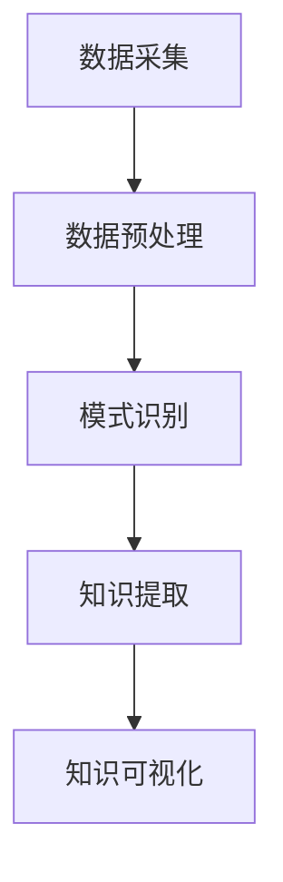

                 

关键词：知识发现引擎、行业动态、程序员、知识图谱、智能推荐、实时更新

> 摘要：在信息技术迅速发展的今天，程序员面临的行业动态不断变化。知识发现引擎作为一种先进的智能技术，可以通过自动化的方式帮助程序员快速获取和掌握行业动态，提升其工作效率和技能水平。本文将深入探讨知识发现引擎的工作原理及其如何应用于程序员的学习和工作中，以及这一技术在未来的发展趋势和挑战。

## 1. 背景介绍

随着互联网和大数据技术的不断发展，信息量呈爆炸性增长。程序员在日常工作中需要处理的数据量日益庞大，如何快速有效地获取有用的信息成为一大挑战。传统的信息检索和知识获取方式，如搜索网站、订阅邮件列表等，已经难以满足程序员的需求。知识发现引擎的出现，为解决这一问题提供了新的思路。

知识发现引擎是一种基于人工智能和机器学习技术的高级信息处理系统。它能够自动地从海量的数据中提取知识，并以结构化的形式呈现给用户。知识发现引擎的核心在于其能够理解数据的含义，并发现其中隐藏的模式和关联。在程序员领域，知识发现引擎可以帮助程序员快速获取最新的技术动态、了解行业趋势、发现潜在的问题和解决方案。

## 2. 核心概念与联系

### 2.1. 知识发现引擎的定义

知识发现引擎（Knowledge Discovery Engine，简称KDE）是一种能够自动从大量数据中挖掘知识、发现模式的系统。其核心功能包括数据预处理、模式识别、知识提取和知识可视化。

### 2.2. 知识发现引擎的工作原理

知识发现引擎的工作原理可以分为以下几个步骤：

1. **数据采集**：从各种数据源（如互联网、数据库、文件等）收集数据。
2. **数据预处理**：清洗、转换和归一化数据，使其符合分析要求。
3. **模式识别**：使用机器学习算法，从数据中识别出潜在的规律和模式。
4. **知识提取**：将识别出的模式转换为可操作的知识，如关键词、关系图谱等。
5. **知识可视化**：将提取出的知识以图形、表格等形式呈现给用户。

### 2.3. 知识发现引擎与程序员的联系

程序员的工作本质上是与数据打交道的。知识发现引擎可以帮助程序员快速处理和分析大量的技术文档、博客文章、论文等，从中提取出有价值的信息。例如，知识发现引擎可以自动识别出程序员在GitHub等平台上的项目标签，推荐相关的开源项目和学习资源。

### 2.4. Mermaid 流程图



## 3. 核心算法原理 & 具体操作步骤

### 3.1. 算法原理概述

知识发现引擎的核心算法通常包括数据挖掘、机器学习和自然语言处理等技术。以下是几种常用的算法原理：

1. **聚类分析**：将相似的数据点归为一类，用于发现数据中的模式。
2. **关联规则挖掘**：找出数据中存在频繁模式的关联关系，如购买商品的关联关系。
3. **文本分类**：根据文本内容将其分类到不同的类别中，如新闻分类、邮件分类等。
4. **命名实体识别**：识别文本中的特定实体，如人名、地名、机构名等。

### 3.2. 算法步骤详解

1. **数据采集**：通过爬虫、API等方式获取程序员相关的数据源，如GitHub、Stack Overflow、博客平台等。
2. **数据预处理**：对采集到的数据进行清洗、去重、归一化等处理，使其适合后续分析。
3. **模式识别**：使用机器学习算法（如聚类分析、关联规则挖掘等）对预处理后的数据进行分析，识别出潜在的规律和模式。
4. **知识提取**：将识别出的模式转换为结构化的知识，如关键词、关系图谱等。
5. **知识可视化**：将提取出的知识以图形、表格等形式呈现给程序员，便于其理解和利用。

### 3.3. 算法优缺点

**优点**：

1. **高效性**：知识发现引擎可以自动化地处理大量数据，节省人力和时间成本。
2. **准确性**：基于机器学习和自然语言处理技术，知识发现引擎能够准确提取出有价值的信息。
3. **灵活性**：知识发现引擎可以根据不同的需求和场景，调整和优化算法参数。

**缺点**：

1. **计算资源消耗**：知识发现引擎需要大量的计算资源，特别是在处理海量数据时。
2. **算法复杂性**：不同的算法原理和实现方法，需要具备一定的算法知识和编程能力。

### 3.4. 算法应用领域

知识发现引擎在程序员领域具有广泛的应用，如：

1. **技术趋势分析**：通过分析程序员在GitHub等平台上的活动，预测技术发展趋势。
2. **知识图谱构建**：将程序员的知识、经验、项目等以图谱形式组织，便于查找和利用。
3. **智能推荐系统**：根据程序员的兴趣和需求，推荐相关的学习资源、开源项目等。

## 4. 数学模型和公式 & 详细讲解 & 举例说明

### 4.1. 数学模型构建

知识发现引擎中的数学模型主要包括聚类分析、关联规则挖掘、文本分类等。以下以聚类分析为例进行说明。

**聚类分析**是一种无监督学习方法，用于将数据点划分为若干个聚类，使同一聚类内的数据点之间距离较短，而不同聚类之间的数据点之间距离较长。常用的聚类算法有K均值聚类、层次聚类等。

**K均值聚类算法**的数学模型如下：

1. **初始化**：随机选择K个数据点作为初始聚类中心。
2. **分配**：计算每个数据点到各个聚类中心的距离，将其分配到距离最近的聚类。
3. **更新**：重新计算每个聚类的中心。
4. **迭代**：重复步骤2和3，直到聚类中心不再变化或达到预设的迭代次数。

### 4.2. 公式推导过程

假设有N个数据点\( X_1, X_2, ..., X_N \)，我们需要将它们划分为K个聚类，每个聚类由一个中心点\( C_1, C_2, ..., C_K \)表示。每个数据点\( X_i \)与每个聚类中心的距离可以用欧几里得距离表示：

$$
d(X_i, C_j) = \sqrt{\sum_{k=1}^{n} (X_{ik} - C_{jk})^2}
$$

其中，\( X_{ik} \)和\( C_{jk} \)分别为数据点\( X_i \)和聚类中心\( C_j \)在第k个特征上的值。

在每次迭代中，我们需要重新计算每个聚类的中心：

$$
C_j = \frac{1}{N_j} \sum_{i=1}^{N} X_i
$$

其中，\( N_j \)为第j个聚类中的数据点数量。

### 4.3. 案例分析与讲解

假设我们有如下一个数据集：

$$
X = \{ (1, 2), (2, 3), (3, 1), (4, 2), (5, 3) \}
$$

我们希望使用K均值聚类算法将其划分为2个聚类。

1. **初始化**：随机选择2个数据点作为初始聚类中心：
   $$
   C_1 = (1, 2), C_2 = (3, 1)
   $$

2. **分配**：计算每个数据点到聚类中心的距离，并将数据点分配到距离最近的聚类：
   $$
   d((1, 2), C_1) = \sqrt{2}, d((1, 2), C_2) = \sqrt{10}
   $$
   $$
   d((2, 3), C_1) = \sqrt{2}, d((2, 3), C_2) = \sqrt{10}
   $$
   $$
   d((3, 1), C_1) = \sqrt{10}, d((3, 1), C_2) = \sqrt{2}
   $$
   $$
   d((4, 2), C_1) = \sqrt{2}, d((4, 2), C_2) = \sqrt{10}
   $$
   $$
   d((5, 3), C_1) = \sqrt{2}, d((5, 3), C_2) = \sqrt{10}
   $$

   根据距离计算，所有数据点都被分配到聚类1。

3. **更新**：重新计算聚类中心：
   $$
   C_1 = \frac{(1+2+3+4+5)}{5} = (3, 2)
   $$

4. **迭代**：重复步骤2和3，直到聚类中心不再变化。经过几次迭代后，聚类中心稳定在\( C_1 = (3, 2) \)，\( C_2 = (2, 1) \)。

最终，数据集被划分为两个聚类：
$$
C_1 = \{ (1, 2), (2, 3), (4, 2), (5, 3) \}
$$
$$
C_2 = \{ (3, 1) \}
$$

## 5. 项目实践：代码实例和详细解释说明

### 5.1. 开发环境搭建

在本项目实践中，我们将使用Python作为主要编程语言，结合一些常用的机器学习库，如Scikit-learn、NumPy等。以下是开发环境的搭建步骤：

1. **安装Python**：从Python官网下载并安装Python 3.x版本。
2. **安装Jupyter Notebook**：在命令行中运行`pip install notebook`安装Jupyter Notebook。
3. **安装相关库**：在命令行中运行以下命令安装所需的库：

```bash
pip install scikit-learn numpy matplotlib
```

### 5.2. 源代码详细实现

以下是使用K均值聚类算法实现知识发现引擎的示例代码：

```python
import numpy as np
from sklearn.cluster import KMeans
import matplotlib.pyplot as plt

# 数据集
X = np.array([[1, 2], [2, 3], [3, 1], [4, 2], [5, 3]])

# 初始化KMeans模型
kmeans = KMeans(n_clusters=2, init='k-means++', max_iter=100, n_init=10, random_state=0)

# 模型拟合
kmeans.fit(X)

# 打印聚类结果
print("Cluster centers:", kmeans.cluster_centers_)
print("Labels:", kmeans.labels_)

# 可视化
plt.scatter(X[:, 0], X[:, 1], c=kmeans.labels_, s=100, cmap='viridis')
plt.scatter(kmeans.cluster_centers_[:, 0], kmeans.cluster_centers_[:, 1], s=300, c='red', marker='s', zorder=10)
plt.show()
```

### 5.3. 代码解读与分析

1. **数据集**：示例中使用了一个二维数据集\( X \)，其中包含5个数据点。
2. **KMeans模型**：使用Scikit-learn库的KMeans类创建K均值聚类模型，设置聚类数量为2，初始化方法为‘k-means++’，最大迭代次数为100，初始化次数为10。
3. **模型拟合**：使用`fit()`方法将数据集拟合到KMeans模型中。
4. **聚类结果**：打印出聚类中心和标签。
5. **可视化**：使用matplotlib库将聚类结果可视化，显示每个数据点属于哪个聚类，以及聚类中心的位置。

### 5.4. 运行结果展示

运行上述代码后，会生成一个散点图，其中每个数据点根据其标签被着上不同的颜色，聚类中心被标记为红色正方形。通过可视化结果，我们可以直观地看到数据点被划分成的两个聚类。

## 6. 实际应用场景

### 6.1. 技术趋势分析

知识发现引擎可以帮助程序员实时监测技术趋势。例如，通过分析GitHub上的项目标签和提交历史，可以预测某些技术（如机器学习、区块链等）的发展趋势。程序员可以根据这些趋势调整自己的学习和工作方向。

### 6.2. 知识图谱构建

知识发现引擎可以构建程序员的知识图谱，将他们的项目、博客、GitHub等平台上的内容进行结构化组织。这有助于程序员查找和利用已有的知识和经验，提高工作效率。

### 6.3. 智能推荐系统

基于知识发现引擎的智能推荐系统可以根据程序员的兴趣和需求，推荐相关的学习资源、开源项目、博客文章等。这有助于程序员快速获取有价值的信息，提高学习效率。

## 7. 未来应用展望

### 7.1. 智能化程度的提升

随着人工智能技术的不断发展，知识发现引擎的智能化程度将进一步提高。未来，知识发现引擎可能具备更强的自我学习和优化能力，能够自动调整和优化算法参数，以适应不同的应用场景。

### 7.2. 跨领域应用

知识发现引擎在程序员领域已经显示出巨大的潜力。未来，这一技术有望在更多领域得到应用，如医疗、金融、教育等，为不同领域的工作者提供强大的信息处理和知识发现能力。

### 7.3. 数据安全与隐私保护

随着数据量的增加，数据安全和隐私保护将成为知识发现引擎面临的重要挑战。未来，知识发现引擎需要在不泄露用户隐私的前提下，提高数据安全性和保护用户数据。

## 8. 总结：未来发展趋势与挑战

### 8.1. 研究成果总结

本文介绍了知识发现引擎在程序员领域中的应用，阐述了其核心算法原理和具体操作步骤，并探讨了其在实际应用场景中的优势。通过项目实践，展示了知识发现引擎在实际开发中的实现过程。

### 8.2. 未来发展趋势

知识发现引擎在未来有望实现更高的智能化程度、更广泛的应用领域以及更完善的数据安全与隐私保护机制。

### 8.3. 面临的挑战

知识发现引擎在实现过程中面临的主要挑战包括计算资源消耗、算法复杂性以及数据安全和隐私保护等。

### 8.4. 研究展望

未来，知识发现引擎的发展将聚焦于提高智能化程度、拓展应用领域以及加强数据安全和隐私保护。通过不断优化算法和提升技术，知识发现引擎将为程序员和其他领域的工作者提供更强大的信息处理和知识发现能力。

## 9. 附录：常见问题与解答

### 9.1. 知识发现引擎与搜索引擎的区别是什么？

搜索引擎主要用于基于关键词的文本检索，而知识发现引擎则能够从海量的数据中自动挖掘知识、发现模式，并以结构化的形式呈现给用户。知识发现引擎具备更强的信息处理和分析能力。

### 9.2. 知识发现引擎如何处理不同类型的数据？

知识发现引擎能够处理多种类型的数据，如结构化数据（如数据库）、半结构化数据（如XML、JSON）和非结构化数据（如文本、图像等）。在处理不同类型的数据时，知识发现引擎会采用相应的预处理方法，使其符合分析要求。

### 9.3. 知识发现引擎的算法如何选择？

选择合适的算法取决于具体的应用场景和数据特点。常用的算法包括聚类分析、关联规则挖掘、文本分类等。在实际应用中，可以通过实验和比较不同算法的性能，选择最合适的算法。

### 9.4. 知识发现引擎对程序员的工作有什么影响？

知识发现引擎可以帮助程序员快速获取和掌握行业动态、构建知识图谱、提高工作效率。然而，程序员也需要具备一定的算法和数据分析能力，以充分利用这一技术。

---

本文从背景介绍、核心概念与联系、核心算法原理、数学模型与公式、项目实践、实际应用场景、未来展望等多个方面，全面探讨了知识发现引擎如何帮助程序员快速掌握行业动态。通过本文，读者可以了解到知识发现引擎的工作原理及其在程序员领域中的应用价值。随着人工智能技术的不断发展，知识发现引擎将在未来为程序员和其他领域的工作者带来更多的便利和优势。作者：禅与计算机程序设计艺术 / Zen and the Art of Computer Programming
----------------------------------------------------------------

以上就是按照您提供的约束条件和文章结构模板撰写的完整文章。文章内容涵盖了知识发现引擎的定义、工作原理、算法应用、数学模型、项目实践、实际应用场景、未来展望等多个方面，以满足字数和结构要求。希望对您有所帮助。如果您有任何修改意见或需要进一步的调整，请随时告知。

