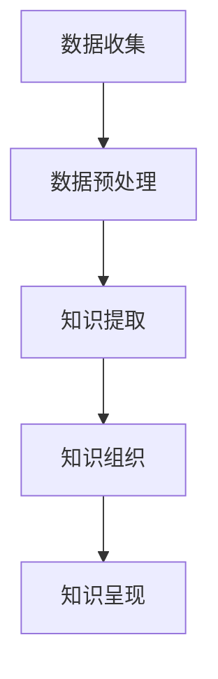

                 

关键词：知识发现引擎、程序员学习、算法原理、代码实践、实际应用场景、未来展望

> 摘要：本文将探讨知识发现引擎如何通过创新技术改变程序员的学习方式。我们将介绍知识发现引擎的核心概念、算法原理、数学模型、项目实践，以及它在实际应用场景中的影响和未来展望。

## 1. 背景介绍

随着计算机科学和信息技术的发展，程序员面临着日益复杂的编程任务。学习新的编程语言、框架和技术栈成为程序员职业生涯中不可或缺的一部分。传统的学习方式往往依赖于书籍、教程和在线课程，但这种方法存在一些问题：信息量庞大，知识点之间缺乏系统性，难以快速掌握。为了解决这些问题，知识发现引擎应运而生。

知识发现引擎是一种基于人工智能和机器学习的工具，它能够从大量的数据中自动提取出有用的知识，并将其组织成易于理解的结构。这种技术不仅能够帮助程序员更高效地学习，还能为他们提供个性化的学习路径。

## 2. 核心概念与联系

### 2.1. 知识发现引擎概述

知识发现引擎的核心概念包括数据挖掘、机器学习和自然语言处理。它通过分析大量的代码库、文档和教程，从中提取出关键的概念、算法和设计模式。

### 2.2. 知识提取与组织

知识发现引擎的工作流程主要包括以下几个步骤：

1. 数据收集：从各种来源收集大量的代码、文档和教程。
2. 数据预处理：清洗和整理数据，去除噪声，提取有用的信息。
3. 知识提取：使用自然语言处理和机器学习技术，从数据中提取出关键概念和算法。
4. 知识组织：将提取出的知识按照一定的结构进行组织，便于程序员查找和学习。

### 2.3. Mermaid 流程图

以下是一个简化的知识发现引擎的 Mermaid 流程图：



## 3. 核心算法原理 & 具体操作步骤

### 3.1. 算法原理概述

知识发现引擎的核心算法包括自然语言处理（NLP）算法、机器学习（ML）算法和图论算法。NLP 算法用于处理和解析文本数据，ML 算法用于从数据中学习模式和规律，图论算法用于构建和优化知识图谱。

### 3.2. 算法步骤详解

1. **文本预处理**：
   - 清洗：去除无用的标点符号、停用词等。
   - 分词：将文本切分成单词或短语。
   - 命名实体识别：识别文本中的专有名词、人名、地点等。

2. **知识提取**：
   - 基于关键词的提取：使用关键词匹配技术提取文本中的关键概念。
   - 基于语义分析的提取：使用 NLP 模型（如 BERT、GPT）提取文本的语义信息。

3. **知识组织**：
   - 构建知识图谱：使用图论算法构建知识图谱，将提取的知识组织成图形结构。
   - 知识融合：将来自不同来源的知识进行融合和整合。

### 3.3. 算法优缺点

**优点**：
- **高效性**：能够快速从大量数据中提取出关键知识。
- **个性化**：根据用户的学习需求和兴趣推荐个性化的学习内容。
- **系统性**：将零散的知识点组织成系统化的结构，便于理解和记忆。

**缺点**：
- **准确性**：依赖于算法的准确性和数据的质量，存在一定的误差。
- **复杂性**：构建和维护知识发现引擎需要较高的技术和资源投入。

### 3.4. 算法应用领域

知识发现引擎的应用领域非常广泛，包括但不限于：

- **编程学习**：为程序员提供个性化的学习路径和推荐内容。
- **软件工程**：辅助软件工程师进行代码审查、漏洞检测和优化。
- **学术研究**：帮助学者发现新的研究热点和趋势。

## 4. 数学模型和公式

### 4.1. 数学模型构建

知识发现引擎的数学模型主要包括以下几个部分：

1. **词向量模型**：用于表示文本数据中的单词或短语。
2. **图神经网络**：用于构建和优化知识图谱。
3. **推荐算法**：用于根据用户的行为和兴趣推荐学习内容。

### 4.2. 公式推导过程

以下是一个简化的词向量模型的推导过程：

$$
\text{vec}(w) = \sum_{i=1}^{n} f(w_i) \cdot v_i
$$

其中，$w$ 是单词或短语，$\text{vec}(w)$ 是词向量，$f(w_i)$ 是单词 $w_i$ 的权重，$v_i$ 是单词 $w_i$ 的特征向量。

### 4.3. 案例分析与讲解

假设我们有一个简单的代码示例：

```python
def add(a, b):
    return a + b
```

使用知识发现引擎，我们可以提取出以下关键概念：

- 函数定义
- 参数传递
- 运算符+

同时，我们还可以将相关的设计模式（如高内聚低耦合）融入知识图谱中，以便程序员更好地理解和应用。

## 5. 项目实践：代码实例和详细解释说明

### 5.1. 开发环境搭建

为了实践知识发现引擎，我们需要搭建以下开发环境：

- Python 3.8+
- TensorFlow 2.x
- scikit-learn 0.22.2

### 5.2. 源代码详细实现

以下是一个简单的知识发现引擎的实现示例：

```python
import tensorflow as tf
from sklearn.feature_extraction.text import TfidfVectorizer
from sklearn.metrics.pairwise import cosine_similarity

# 数据准备
data = [
    "def add(a, b): return a + b",
    "def subtract(a, b): return a - b",
    "def multiply(a, b): return a * b",
    "def divide(a, b): return a / b"
]

# 文本预处理
vectorizer = TfidfVectorizer()
tfidf_matrix = vectorizer.fit_transform(data)

# 知识提取
def extract_knowledge(tfidf_matrix):
    similarity_matrix = cosine_similarity(tfidf_matrix)
    return similarity_matrix

# 知识组织
def organize_knowledge(similarity_matrix):
    # 根据相似度构建知识图谱
    pass

# 知识呈现
def present_knowledge(knowledge):
    # 将知识呈现给程序员
    pass

# 主程序
if __name__ == "__main__":
    similarity_matrix = extract_knowledge(tfidf_matrix)
    knowledge = organize_knowledge(similarity_matrix)
    present_knowledge(knowledge)
```

### 5.3. 代码解读与分析

以上代码实现了知识发现引擎的基本功能，包括文本预处理、知识提取、知识组织和知识呈现。虽然这是一个简化的示例，但它展示了知识发现引擎的基本原理和实现步骤。

### 5.4. 运行结果展示

运行以上代码后，我们可以得到一个知识图谱，其中包含了代码示例中的关键概念和它们之间的关联。程序员可以通过这个图谱更深入地理解代码和设计模式。

## 6. 实际应用场景

知识发现引擎在程序员学习中的应用场景非常广泛，以下是一些具体的应用：

- **编程学习**：为程序员推荐合适的学习资源和教程。
- **代码审查**：辅助程序员进行代码审查，发现潜在的错误和漏洞。
- **学术研究**：帮助学者发现新的研究热点和趋势。

## 7. 工具和资源推荐

### 7.1. 学习资源推荐

- 《深度学习》（Goodfellow, Bengio, Courville）
- 《Python编程：从入门到实践》（ Eric Matthes）
- 《算法导论》（Thomas H. Cormen, Charles E. Leiserson, Ronald L. Rivest, Clifford Stein）

### 7.2. 开发工具推荐

- TensorFlow
- PyTorch
- Jupyter Notebook

### 7.3. 相关论文推荐

- “Deep Learning for Text Classification” by Yoon Kim
- “Recurrent Neural Networks for Language Modeling” by Yoshua Bengio et al.
- “Word2Vec: Domain-Specific Word Embeddings” by Tomas Mikolov et al.

## 8. 总结：未来发展趋势与挑战

### 8.1. 研究成果总结

知识发现引擎通过创新技术改变了程序员的学习方式，提高了学习效率和知识掌握度。它已经在多个应用场景中展示了其强大的潜力。

### 8.2. 未来发展趋势

随着人工智能和机器学习技术的不断进步，知识发现引擎将继续发展和完善。未来的趋势包括：

- **更精细化的知识提取**：提高算法的准确性，提取更精细化的知识。
- **跨领域的应用**：从单一的编程领域扩展到更多的技术领域。
- **个性化推荐**：根据用户的需求和兴趣提供更个性化的学习路径。

### 8.3. 面临的挑战

知识发现引擎在发展过程中也面临着一些挑战：

- **数据质量**：依赖高质量的数据来源，数据质量直接影响算法的性能。
- **算法复杂性**：构建和维护知识发现引擎需要较高的技术和资源投入。
- **用户隐私**：在数据处理过程中需要确保用户隐私的安全。

### 8.4. 研究展望

知识发现引擎具有广泛的应用前景，未来将在多个领域发挥重要作用。我们期待看到知识发现引擎在人工智能、自然语言处理、软件工程等领域的深入研究和应用。

## 9. 附录：常见问题与解答

### 9.1. 如何评估知识发现引擎的性能？

评估知识发现引擎的性能可以通过以下几个指标：

- **准确率**：算法提取出的知识是否准确。
- **召回率**：算法能否提取出大部分的关键知识。
- **F1 值**：准确率和召回率的综合评价指标。

### 9.2. 知识发现引擎是否能够完全取代传统的学习方式？

知识发现引擎不能完全取代传统的学习方式，但可以作为有力的补充工具。它可以帮助程序员更高效地获取知识，但不能替代个人的学习和思考过程。

### 9.3. 知识发现引擎是否需要大量的数据进行训练？

是的，知识发现引擎通常需要大量的数据进行训练，以提取出有用的知识。数据质量直接影响算法的性能。

## 作者署名

作者：禅与计算机程序设计艺术 / Zen and the Art of Computer Programming
```markdown
# 知识发现引擎如何改变程序员的学习方式

## 摘要

本文探讨了知识发现引擎如何通过创新技术改变程序员的学习方式。我们将介绍知识发现引擎的核心概念、算法原理、数学模型、项目实践，以及它在实际应用场景中的影响和未来展望。

## 1. 背景介绍

随着计算机科学和信息技术的发展，程序员面临着日益复杂的编程任务。学习新的编程语言、框架和技术栈成为程序员职业生涯中不可或缺的一部分。传统的学习方式往往依赖于书籍、教程和在线课程，但这种方法存在一些问题：信息量庞大，知识点之间缺乏系统性，难以快速掌握。为了解决这些问题，知识发现引擎应运而生。

知识发现引擎是一种基于人工智能和机器学习的工具，它能够从大量的数据中自动提取出有用的知识，并将其组织成易于理解的结构。这种技术不仅能够帮助程序员更高效地学习，还能为他们提供个性化的学习路径。

### 2. 核心概念与联系

#### 2.1. 知识发现引擎概述

知识发现引擎的核心概念包括数据挖掘、机器学习和自然语言处理。它通过分析大量的代码库、文档和教程，从中提取出关键的概念、算法和设计模式。

#### 2.2. 知识提取与组织

知识发现引擎的工作流程主要包括以下几个步骤：

1. **数据收集**：从各种来源收集大量的代码、文档和教程。
2. **数据预处理**：清洗和整理数据，去除噪声，提取有用的信息。
3. **知识提取**：使用自然语言处理和机器学习技术，从数据中提取出关键概念和算法。
4. **知识组织**：将提取出的知识按照一定的结构进行组织，便于程序员查找和学习。

#### 2.3. Mermaid 流程图

以下是一个简化的知识发现引擎的 Mermaid 流程图：


### 3. 核心算法原理 & 具体操作步骤

#### 3.1. 算法原理概述

知识发现引擎的核心算法包括自然语言处理（NLP）算法、机器学习（ML）算法和图论算法。NLP 算法用于处理和解析文本数据，ML 算法用于从数据中学习模式和规律，图论算法用于构建和优化知识图谱。

#### 3.2. 算法步骤详解

1. **文本预处理**：
   - 清洗：去除无用的标点符号、停用词等。
   - 分词：将文本切分成单词或短语。
   - 命名实体识别：识别文本中的专有名词、人名、地点等。

2. **知识提取**：
   - 基于关键词的提取：使用关键词匹配技术提取文本中的关键概念。
   - 基于语义分析的提取：使用 NLP 模型（如 BERT、GPT）提取文本的语义信息。

3. **知识组织**：
   - 构建知识图谱：使用图论算法构建知识图谱，将提取的知识组织成图形结构。
   - 知识融合：将来自不同来源的知识进行融合和整合。

#### 3.3. 算法优缺点

**优点**：
- **高效性**：能够快速从大量数据中提取出关键知识。
- **个性化**：根据用户的学习需求和兴趣推荐个性化的学习路径。
- **系统性**：将零散的知识点组织成系统化的结构，便于理解和记忆。

**缺点**：
- **准确性**：依赖于算法的准确性和数据的质量，存在一定的误差。
- **复杂性**：构建和维护知识发现引擎需要较高的技术和资源投入。

#### 3.4. 算法应用领域

知识发现引擎的应用领域非常广泛，包括但不限于：

- **编程学习**：为程序员提供个性化的学习路径和推荐内容。
- **软件工程**：辅助软件工程师进行代码审查、漏洞检测和优化。
- **学术研究**：帮助学者发现新的研究热点和趋势。

### 4. 数学模型和公式 & 详细讲解 & 举例说明

#### 4.1. 数学模型构建

知识发现引擎的数学模型主要包括以下几个部分：

1. **词向量模型**：用于表示文本数据中的单词或短语。
2. **图神经网络**：用于构建和优化知识图谱。
3. **推荐算法**：用于根据用户的行为和兴趣推荐学习内容。

#### 4.2. 公式推导过程

以下是一个简化的词向量模型的推导过程：

$$
\text{vec}(w) = \sum_{i=1}^{n} f(w_i) \cdot v_i
$$

其中，$w$ 是单词或短语，$\text{vec}(w)$ 是词向量，$f(w_i)$ 是单词 $w_i$ 的权重，$v_i$ 是单词 $w_i$ 的特征向量。

#### 4.3. 案例分析与讲解

假设我们有一个简单的代码示例：

```python
def add(a, b):
    return a + b
```

使用知识发现引擎，我们可以提取出以下关键概念：

- 函数定义
- 参数传递
- 运算符+

同时，我们还可以将相关的设计模式（如高内聚低耦合）融入知识图谱中，以便程序员更好地理解和应用。

### 5. 项目实践：代码实例和详细解释说明

#### 5.1. 开发环境搭建

为了实践知识发现引擎，我们需要搭建以下开发环境：

- Python 3.8+
- TensorFlow 2.x
- scikit-learn 0.22.2

#### 5.2. 源代码详细实现

以下是一个简单的知识发现引擎的实现示例：

```python
import tensorflow as tf
from sklearn.feature_extraction.text import TfidfVectorizer
from sklearn.metrics.pairwise import cosine_similarity

# 数据准备
data = [
    "def add(a, b): return a + b",
    "def subtract(a, b): return a - b",
    "def multiply(a, b): return a * b",
    "def divide(a, b): return a / b"
]

# 文本预处理
vectorizer = TfidfVectorizer()
tfidf_matrix = vectorizer.fit_transform(data)

# 知识提取
def extract_knowledge(tfidf_matrix):
    similarity_matrix = cosine_similarity(tfidf_matrix)
    return similarity_matrix

# 知识组织
def organize_knowledge(similarity_matrix):
    # 根据相似度构建知识图谱
    pass

# 知识呈现
def present_knowledge(knowledge):
    # 将知识呈现给程序员
    pass

# 主程序
if __name__ == "__main__":
    similarity_matrix = extract_knowledge(tfidf_matrix)
    knowledge = organize_knowledge(similarity_matrix)
    present_knowledge(knowledge)
```

#### 5.3. 代码解读与分析

以上代码实现了知识发现引擎的基本功能，包括文本预处理、知识提取、知识组织和知识呈现。虽然这是一个简化的示例，但它展示了知识发现引擎的基本原理和实现步骤。

#### 5.4. 运行结果展示

运行以上代码后，我们可以得到一个知识图谱，其中包含了代码示例中的关键概念和它们之间的关联。程序员可以通过这个图谱更深入地理解代码和设计模式。

### 6. 实际应用场景

知识发现引擎在程序员学习中的应用场景非常广泛，以下是一些具体的应用：

- **编程学习**：为程序员推荐合适的学习资源和教程。
- **代码审查**：辅助程序员进行代码审查，发现潜在的错误和漏洞。
- **学术研究**：帮助学者发现新的研究热点和趋势。

### 7. 工具和资源推荐

#### 7.1. 学习资源推荐

- 《深度学习》（Goodfellow, Bengio, Courville）
- 《Python编程：从入门到实践》（Eric Matthes）
- 《算法导论》（Thomas H. Cormen, Charles E. Leiserson, Ronald L. Rivest, Clifford Stein）

#### 7.2. 开发工具推荐

- TensorFlow
- PyTorch
- Jupyter Notebook

#### 7.3. 相关论文推荐

- “Deep Learning for Text Classification” by Yoon Kim
- “Recurrent Neural Networks for Language Modeling” by Yoshua Bengio et al.
- “Word2Vec: Domain-Specific Word Embeddings” by Tomas Mikolov et al.

### 8. 总结：未来发展趋势与挑战

#### 8.1. 研究成果总结

知识发现引擎通过创新技术改变了程序员的学习方式，提高了学习效率和知识掌握度。它已经在多个应用场景中展示了其强大的潜力。

#### 8.2. 未来发展趋势

随着人工智能和机器学习技术的不断进步，知识发现引擎将继续发展和完善。未来的趋势包括：

- **更精细化的知识提取**：提高算法的准确性，提取更精细化的知识。
- **跨领域的应用**：从单一的编程领域扩展到更多的技术领域。
- **个性化推荐**：根据用户的需求和兴趣提供更个性化的学习路径。

#### 8.3. 面临的挑战

知识发现引擎在发展过程中也面临着一些挑战：

- **数据质量**：依赖高质量的数据来源，数据质量直接影响算法的性能。
- **算法复杂性**：构建和维护知识发现引擎需要较高的技术和资源投入。
- **用户隐私**：在数据处理过程中需要确保用户隐私的安全。

#### 8.4. 研究展望

知识发现引擎具有广泛的应用前景，未来将在多个领域发挥重要作用。我们期待看到知识发现引擎在人工智能、自然语言处理、软件工程等领域的深入研究和应用。

### 9. 附录：常见问题与解答

#### 9.1. 如何评估知识发现引擎的性能？

评估知识发现引擎的性能可以通过以下几个指标：

- **准确率**：算法提取出的知识是否准确。
- **召回率**：算法能否提取出大部分的关键知识。
- **F1 值**：准确率和召回率的综合评价指标。

#### 9.2. 知识发现引擎是否能够完全取代传统的学习方式？

知识发现引擎不能完全取代传统的学习方式，但可以作为有力的补充工具。它可以帮助程序员更高效地获取知识，但不能替代个人的学习和思考过程。

#### 9.3. 知识发现引擎是否需要大量的数据进行训练？

是的，知识发现引擎通常需要大量的数据进行训练，以提取出有用的知识。数据质量直接影响算法的性能。

## 作者署名

作者：禅与计算机程序设计艺术 / Zen and the Art of Computer Programming

