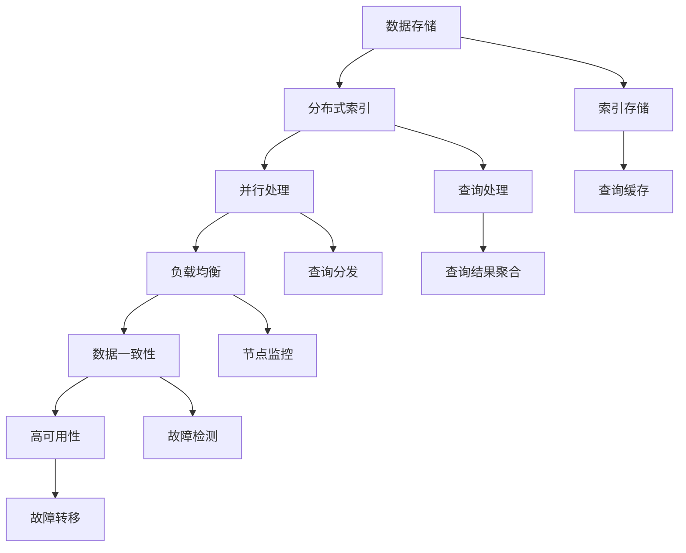

                 

关键词：知识发现引擎、分布式搜索引擎、架构设计、大数据处理、搜索引擎性能优化

## 摘要

本文旨在深入探讨知识发现引擎的分布式搜索引擎架构，分析其核心概念、算法原理、数学模型、实践应用及其未来发展。通过对分布式搜索引擎架构的详细解析，我们将揭示其在大数据处理和搜索引擎性能优化方面的关键作用，并探讨其在实际应用中的挑战与机遇。

## 1. 背景介绍

随着互联网的快速发展，数据量呈现爆炸式增长。大数据的涌现不仅带来了数据存储和处理的挑战，也对搜索引擎提出了更高的要求。传统的单机搜索引擎架构已经无法满足海量数据的处理需求，分布式搜索引擎架构逐渐成为大数据处理和搜索引擎性能优化的重要手段。

知识发现引擎作为一种智能化的搜索引擎，旨在从海量数据中挖掘有价值的信息，提供精准的知识检索和发现服务。分布式搜索引擎架构则为知识发现引擎提供了强大的数据处理能力和高效的检索性能。

本文将首先介绍分布式搜索引擎的基本概念和核心组件，然后深入探讨知识发现引擎在分布式搜索引擎架构中的应用，分析其核心算法原理和数学模型，最后通过实际项目实践和未来展望，为读者提供全面的技术解读。

### 1.1 分布式搜索引擎的定义和作用

分布式搜索引擎是一种基于分布式计算和存储技术构建的搜索引擎，能够处理大规模数据集。其主要特点包括：

1. **分布式索引：** 数据被分散存储在多个节点上，每个节点负责一部分数据的索引构建和维护。这种分布式索引策略能够大大提高索引的构建速度和查询效率。

2. **并行处理：** 分布式搜索引擎通过并行处理技术，将查询任务分配到多个节点上同时执行，从而缩短查询响应时间。

3. **高可用性：** 分布式搜索引擎通过节点冗余和负载均衡机制，确保在部分节点故障时仍然能够保持系统的稳定运行。

分布式搜索引擎在搜索引擎性能优化方面具有显著的作用：

1. **扩展性：** 分布式搜索引擎能够根据数据量和查询量的增长动态扩展，满足大数据处理的需求。

2. **高效查询：** 通过并行处理和分布式索引技术，分布式搜索引擎能够提供高效的查询性能，满足实时检索的需求。

3. **高可用性：** 分布式搜索引擎通过节点冗余和负载均衡，提高了系统的稳定性和可靠性。

### 1.2 知识发现引擎的概念和应用场景

知识发现引擎是一种智能化的搜索引擎，旨在从海量数据中自动挖掘有价值的信息，提供精准的知识检索和发现服务。其主要应用场景包括：

1. **智能推荐系统：** 知识发现引擎通过对用户行为和兴趣数据的分析，提供个性化的内容推荐，提高用户体验。

2. **企业数据挖掘：** 知识发现引擎能够帮助企业从大量业务数据中挖掘有价值的信息，支持决策制定和业务优化。

3. **学术研究：** 知识发现引擎能够帮助研究人员从海量文献中快速检索相关研究成果，提高科研效率。

知识发现引擎在分布式搜索引擎架构中的应用，使得大数据处理和知识检索更加高效和智能化。

### 1.3 研究意义和目的

本文的研究意义和目的在于：

1. **深入理解分布式搜索引擎架构：** 通过对分布式搜索引擎架构的详细解析，帮助读者全面了解其核心概念、算法原理和数学模型。

2. **探讨知识发现引擎在分布式搜索引擎架构中的应用：** 分析知识发现引擎在分布式搜索引擎架构中的关键作用，探讨其在大数据处理和知识检索方面的优势。

3. **提供实际应用案例：** 通过实际项目实践，展示分布式搜索引擎架构在知识发现引擎中的应用效果。

4. **展望未来发展趋势：** 分析分布式搜索引擎架构和知识发现引擎在未来面临的挑战和机遇，为后续研究提供方向。

### 1.4 文章结构

本文将按照以下结构进行展开：

1. **背景介绍：** 概述分布式搜索引擎和知识发现引擎的基本概念和作用。

2. **核心概念与联系：** 介绍分布式搜索引擎架构的核心概念，并使用Mermaid流程图展示其原理和架构。

3. **核心算法原理 & 具体操作步骤：** 分析分布式搜索引擎的核心算法原理，详细阐述其具体操作步骤。

4. **数学模型和公式 & 详细讲解 & 举例说明：** 介绍分布式搜索引擎的数学模型和公式，并提供实例讲解。

5. **项目实践：代码实例和详细解释说明：** 展示分布式搜索引擎架构的实际应用，提供代码实例和详细解释。

6. **实际应用场景：** 分析分布式搜索引擎架构在知识发现引擎中的实际应用场景。

7. **未来应用展望：** 探讨分布式搜索引擎架构和知识发现引擎的未来发展趋势和应用前景。

8. **工具和资源推荐：** 推荐学习资源、开发工具和相关论文。

9. **总结：未来发展趋势与挑战：** 总结研究成果，分析未来发展趋势和面临的挑战。

10. **附录：常见问题与解答：** 回答读者可能关心的问题。

通过本文的详细探讨，希望读者能够对分布式搜索引擎架构及其在知识发现引擎中的应用有更深入的理解，为后续的研究和实践提供参考。

### 2. 核心概念与联系

在深入探讨知识发现引擎的分布式搜索引擎架构之前，我们需要先理解分布式搜索引擎架构中的核心概念和联系。分布式搜索引擎架构主要包括以下几个核心概念：

- **分布式索引：** 分布式索引是将数据分散存储在多个节点上，每个节点负责一部分数据的索引构建和维护。分布式索引能够提高索引的构建速度和查询效率。

- **并行处理：** 并行处理是将查询任务分配到多个节点上同时执行，从而提高查询性能。

- **负载均衡：** 负载均衡是通过分配查询任务到不同的节点，确保系统的稳定运行和高效处理。

- **数据一致性：** 数据一致性是指在分布式系统中，保证多个节点上的数据保持一致。

- **高可用性：** 高可用性是通过节点冗余和故障转移机制，确保系统在节点故障时仍然能够正常运行。

下面，我们将使用Mermaid流程图来展示分布式搜索引擎架构的核心概念和联系：



**Mermaid流程图解释：**

- **分布式索引 (A)：** 数据被分散存储在多个节点上，每个节点维护一部分数据的索引。

- **并行处理 (B)：** 将查询任务分配到多个节点上同时执行，以提高查询性能。

- **负载均衡 (C)：** 通过算法分配查询任务到不同的节点，确保系统的稳定运行和高效处理。

- **数据一致性 (D)：** 确保多个节点上的数据保持一致，防止数据冲突。

- **高可用性 (E)：** 通过节点冗余和故障转移机制，确保系统在节点故障时仍然能够正常运行。

- **查询处理 (F)：** 处理查询请求，将查询结果返回给用户。

- **查询结果聚合 (G)：** 将多个节点的查询结果进行聚合，返回最终的查询结果。

- **查询分发 (H)：** 将查询任务分配到不同的节点，以提高查询性能。

- **节点监控 (I)：** 监控节点的运行状态，确保系统的稳定运行。

- **故障检测 (J)：** 检测节点的故障情况，触发故障转移机制。

- **故障转移 (K)：** 在节点故障时，将任务转移到其他健康节点，确保系统的正常运行。

- **数据存储 (L)：** 存储原始数据和索引数据。

- **索引存储 (M)：** 存储分布式索引信息。

- **查询缓存 (N)：** 存储常用查询结果，提高查询效率。

通过上述核心概念和Mermaid流程图的展示，我们能够更直观地理解分布式搜索引擎架构的原理和联系。接下来，我们将深入探讨分布式搜索引擎的核心算法原理和具体操作步骤。

### 3. 核心算法原理 & 具体操作步骤

分布式搜索引擎的核心算法原理包括分布式索引构建、并行查询处理、负载均衡和数据一致性。以下是这些算法的详细解释和具体操作步骤。

#### 3.1 分布式索引构建

分布式索引构建是分布式搜索引擎的关键步骤，它将数据分散存储在多个节点上，并在每个节点上构建索引。以下是分布式索引构建的核心算法原理和具体操作步骤：

**算法原理：**

1. **数据分区：** 根据数据的特征，将数据集划分为多个分区，每个分区包含一部分数据。分区可以基于数据的大小、访问频率或其他特征。

2. **节点分配：** 将每个数据分区分配到特定的节点上，确保每个节点上的数据量相对平衡。

3. **索引构建：** 在每个节点上，使用本地索引构建算法，构建本地索引。本地索引包括倒排索引、布隆过滤器等。

4. **索引合并：** 将多个节点的本地索引进行合并，形成全局索引。合并算法可以是简单合并、归并排序等。

**具体操作步骤：**

1. **数据分区：**
    - **分区策略：** 根据数据的特征，如关键词、时间戳等，将数据划分为多个分区。
    - **分区分配：** 将每个分区分配到特定的节点上，确保每个节点上的数据量相对平衡。

    ```python
    # 假设数据集为docs，节点为nodes
    for partition, node in partition_docs(docs, nodes):
        node.add_partition(partition)
    ```

2. **索引构建：**
    - **本地索引构建：** 在每个节点上，使用本地索引构建算法，构建本地索引。

    ```python
    # 假设本地索引构建算法为build_index
    for node in nodes:
        node.build_index()
    ```

3. **索引合并：**
    - **合并算法：** 使用归并排序算法将多个节点的本地索引进行合并，形成全局索引。

    ```python
    # 假设合并算法为merge_indices
    global_index = merge_indices([node.get_index() for node in nodes])
    ```

通过分布式索引构建，分布式搜索引擎能够高效地处理大规模数据集，提高查询性能。

#### 3.2 并行查询处理

并行查询处理是分布式搜索引擎的核心功能之一，它通过将查询任务分配到多个节点上同时执行，提高查询性能。以下是并行查询处理的核心算法原理和具体操作步骤：

**算法原理：**

1. **查询分发：** 将查询请求分发到多个节点上，每个节点负责查询一部分数据。

2. **本地查询：** 在每个节点上，执行本地查询，获取本地查询结果。

3. **结果聚合：** 将多个节点的本地查询结果进行聚合，形成最终查询结果。

**具体操作步骤：**

1. **查询分发：**
    - **分发策略：** 根据数据分区和节点分配情况，将查询请求分发到相应的节点上。

    ```python
    # 假设查询请求为query，节点为nodes
    for node in nodes:
        node.submit_query(query)
    ```

2. **本地查询：**
    - **本地查询执行：** 在每个节点上，执行本地查询，获取本地查询结果。

    ```python
    # 假设本地查询函数为execute_query
    for node in nodes:
        local_results = execute_query(node, query)
        node.set_local_results(local_results)
    ```

3. **结果聚合：**
    - **聚合算法：** 使用归并排序算法将多个节点的本地查询结果进行聚合，形成最终查询结果。

    ```python
    # 假设聚合算法为merge_results
    final_results = merge_results([node.get_local_results() for node in nodes])
    ```

通过并行查询处理，分布式搜索引擎能够高效地处理大规模查询请求，提高查询性能。

#### 3.3 负载均衡

负载均衡是分布式搜索引擎的关键机制之一，它通过分配查询任务到不同的节点，确保系统的稳定运行和高效处理。以下是负载均衡的核心算法原理和具体操作步骤：

**算法原理：**

1. **负载感知：** 监控节点的负载情况，识别负载较高的节点。

2. **任务分配：** 将查询任务分配到负载较低的节点，实现负载均衡。

3. **动态调整：** 根据节点的实时负载情况，动态调整查询任务的分配。

**具体操作步骤：**

1. **负载感知：**
    - **负载监控：** 监控节点的CPU使用率、内存使用率等指标，识别负载较高的节点。

    ```python
    # 假设负载监控函数为monitor_load
    high_load_nodes = monitor_load(nodes)
    ```

2. **任务分配：**
    - **任务重分配：** 将查询任务从负载较高的节点转移到负载较低的节点。

    ```python
    # 假设任务分配函数为rebalance_query
    for node in high_load_nodes:
        rebalance_query(node, low_load_nodes)
    ```

3. **动态调整：**
    - **负载调整：** 根据节点的实时负载情况，动态调整查询任务的分配。

    ```python
    # 假设负载调整函数为adjust_load
    for node in nodes:
        adjust_load(node)
    ```

通过负载均衡，分布式搜索引擎能够确保系统的稳定运行和高效处理，提高系统的整体性能。

#### 3.4 数据一致性

数据一致性是分布式搜索引擎的重要保障，它确保多个节点上的数据保持一致，防止数据冲突。以下是数据一致性的核心算法原理和具体操作步骤：

**算法原理：**

1. **版本控制：** 每个数据记录附带版本号，确保在多节点环境中，数据的更新不会发生冲突。

2. **分布式锁：** 使用分布式锁机制，确保在多节点环境中，对数据的访问和更新操作是原子性的。

3. **冲突检测：** 在数据更新过程中，检测版本冲突，并进行相应的处理。

**具体操作步骤：**

1. **版本控制：**
    - **记录版本：** 在每个数据记录中，附带版本号，用于追踪数据的更新历史。

    ```python
    # 假设数据记录为record，版本号为version
    record.version = version
    ```

2. **分布式锁：**
    - **加锁：** 在对数据执行更新操作前，加分布式锁，确保操作原子性。

    ```python
    # 假设加锁函数为acquire_lock
    acquire_lock(record)
    ```

    - **解锁：** 更新操作完成后，释放分布式锁。

    ```python
    # 假设解锁函数为release_lock
    release_lock(record)
    ```

3. **冲突检测：**
    - **版本比对：** 在更新操作过程中，比对版本号，检测版本冲突。

    ```python
    # 假设版本比对函数为compare_versions
    if compare_versions(record.version, expected_version) != 0:
        handle_conflict(record)
    ```

通过数据一致性机制，分布式搜索引擎能够确保数据的准确性和一致性，提高系统的可靠性。

#### 3.5 高可用性

高可用性是分布式搜索引擎的重要保障，它通过节点冗余和故障转移机制，确保系统在节点故障时仍然能够正常运行。以下是高可用性的核心算法原理和具体操作步骤：

**算法原理：**

1. **节点冗余：** 在系统中部署多个节点，确保在部分节点故障时，系统仍然能够正常运行。

2. **故障检测：** 监控节点的运行状态，及时发现故障节点。

3. **故障转移：** 在节点故障时，将任务转移到其他健康节点，确保系统的正常运行。

**具体操作步骤：**

1. **节点冗余：**
    - **节点部署：** 部署多个节点，确保系统具有冗余能力。

    ```python
    # 假设节点列表为nodes
    nodes = deploy_nodes(num_nodes)
    ```

2. **故障检测：**
    - **运行状态监控：** 监控节点的运行状态，及时发现故障节点。

    ```python
    # 假设监控函数为monitor_nodes
    faulty_nodes = monitor_nodes(nodes)
    ```

3. **故障转移：**
    - **任务转移：** 在节点故障时，将任务转移到其他健康节点。

    ```python
    # 假设任务转移函数为transfer_tasks
    for faulty_node in faulty_nodes:
        transfer_tasks(faulty_node, healthy_nodes)
    ```

通过高可用性机制，分布式搜索引擎能够确保系统的稳定性和可靠性，提高用户体验。

通过上述核心算法原理和具体操作步骤的详细解析，我们可以看到分布式搜索引擎在索引构建、查询处理、负载均衡、数据一致性和高可用性方面的高效性和可靠性。这些算法原理和操作步骤为分布式搜索引擎提供了强大的数据处理能力和高效的查询性能，使其能够应对大规模数据集的挑战。

### 3.3 算法优缺点

在深入探讨分布式搜索引擎算法的优缺点之前，我们先明确几个关键评价指标：扩展性、查询性能、数据一致性、高可用性和部署复杂性。

**扩展性：**

**优点：** 分布式搜索引擎具有非常好的扩展性。通过增加节点数量，可以轻松地处理大规模数据集和海量查询请求。这种灵活性使得系统可以根据实际需求动态调整性能和容量。

**缺点：** 随着节点数量的增加，分布式搜索引擎的部署和维护成本也会上升。此外，节点之间的通信和协调变得更加复杂，可能导致性能瓶颈和故障风险。

**查询性能：**

**优点：** 并行处理和分布式索引构建使得分布式搜索引擎能够快速处理大量查询请求。通过负载均衡，系统能够均衡分配任务，提高查询效率。

**缺点：** 尽管分布式搜索引擎在查询性能方面具有优势，但在某些情况下，查询优化和查询缓存策略的不足可能导致查询性能下降。

**数据一致性：**

**优点：** 分布式搜索引擎通过版本控制和分布式锁机制，确保数据的一致性。这种一致性机制能够防止数据冲突，提高数据的可靠性。

**缺点：** 数据一致性的实现复杂且开销较大。在某些高并发场景下，一致性机制可能导致性能瓶颈。

**高可用性：**

**优点：** 通过节点冗余和故障转移机制，分布式搜索引擎能够在节点故障时保持系统的正常运行。这种高可用性机制提高了系统的可靠性和稳定性。

**缺点：** 高可用性机制增加了系统的复杂性和维护成本。此外，故障转移可能导致一些数据延迟和暂时的服务中断。

**部署复杂性：**

**优点：** 分布式搜索引擎的部署相对灵活，可以根据实际需求进行定制化部署。这种灵活性使得系统可以适应不同的应用场景。

**缺点：** 分布式搜索引擎的部署和维护需要专业的技术团队和丰富的经验。部署过程中的配置和调优也是一项复杂的工作。

综上所述，分布式搜索引擎在扩展性、查询性能、数据一致性、高可用性和部署复杂性方面具有显著的优缺点。在实际应用中，需要根据具体需求和场景，权衡这些因素，选择合适的分布式搜索引擎架构和算法。

### 3.4 算法应用领域

分布式搜索引擎算法在多个领域展现出强大的应用潜力，以下列举几个关键应用领域及其具体实例：

#### 3.4.1 大数据处理

随着大数据时代的到来，分布式搜索引擎算法在处理大规模数据集方面具有显著优势。例如，搜索引擎公司如百度和谷歌，利用分布式搜索引擎技术，高效处理数十亿级别的网页索引和查询请求。分布式索引构建和并行查询处理技术使得这些搜索引擎能够在毫秒级响应时间提供精准的搜索结果。

**实例：** 百度搜索引擎利用分布式搜索引擎架构，实现了亿级数据的高效检索。其分布式索引构建策略通过将数据划分为多个分区，并在不同节点上构建索引，提高了索引构建和查询效率。

#### 3.4.2 智能推荐系统

智能推荐系统通过分析用户行为和兴趣数据，为用户提供个性化的内容推荐。分布式搜索引擎算法在推荐系统中的应用，可以显著提升推荐引擎的性能和响应速度。

**实例：** 亚马逊和Netflix等在线零售和流媒体平台，采用分布式搜索引擎算法，实时分析用户行为数据，提供个性化的商品和视频推荐。分布式索引构建和并行查询处理技术使得推荐系统能够快速响应用户行为，提高推荐准确性。

#### 3.4.3 企业数据挖掘

企业数据挖掘旨在从海量业务数据中挖掘有价值的信息，支持决策制定和业务优化。分布式搜索引擎算法在企业数据挖掘中，能够高效处理大规模数据集，为业务分析提供强有力的支持。

**实例：** 谷歌旗下的谷歌云平台（Google Cloud）提供了基于分布式搜索引擎技术的数据挖掘服务，如Google BigQuery。通过分布式搜索引擎算法，企业可以快速分析和挖掘大规模数据集，支持业务洞察和决策制定。

#### 3.4.4 学术研究

在学术研究领域，分布式搜索引擎算法被广泛应用于文献检索和学术分析。分布式搜索引擎能够高效处理海量的学术文献数据，为研究人员提供精准的知识检索和发现服务。

**实例：** 研究人员可以使用如Google Scholar等分布式搜索引擎，快速检索相关的研究文献和学术成果。分布式索引构建和并行查询处理技术使得学术检索系统能够在短时间内提供准确的搜索结果，提高科研效率。

通过上述实例可以看出，分布式搜索引擎算法在多个领域展现出了强大的应用潜力。其高效的数据处理能力和强大的扩展性，使得分布式搜索引擎成为了应对大规模数据集和复杂查询任务的重要工具。在未来，随着技术的不断发展和应用场景的不断扩展，分布式搜索引擎算法将在更多领域发挥重要作用。

### 4. 数学模型和公式 & 详细讲解 & 举例说明

在分布式搜索引擎中，数学模型和公式是核心组成部分，它们不仅描述了系统的基本原理，还提供了量化分析工具。本节将详细介绍分布式搜索引擎中的关键数学模型和公式，并借助具体实例进行讲解。

#### 4.1 数学模型构建

分布式搜索引擎的数学模型主要涉及以下几个方面：

1. **数据分区模型**：用于将大规模数据集划分为多个可管理的分区。
2. **索引构建模型**：用于构建分布式索引，包括倒排索引和布隆过滤器等。
3. **查询处理模型**：用于描述查询任务的分发、执行和结果聚合过程。
4. **负载均衡模型**：用于实现查询任务的动态分配，以优化系统性能。

**数据分区模型：**

假设我们有 \(N\) 个节点，每个节点负责处理一部分数据。数据分区模型可以表示为：

\[ P = \{P_1, P_2, ..., P_N\} \]

其中，每个分区 \(P_i\) 包含一部分数据，并且满足 \(P_1 \cup P_2 \cup ... \cup P_N = \text{全部数据}\)。

**索引构建模型：**

分布式索引构建模型涉及多个节点上的索引构建和合并。假设每个节点 \(i\) 构建了局部索引 \(I_i\)，全局索引 \(I\) 可以通过合并这些局部索引得到：

\[ I = \cup_{i=1}^{N} I_i \]

**查询处理模型：**

查询处理模型描述了查询任务的分发、执行和结果聚合过程。假设查询请求 \(Q\) 被分发到多个节点 \(i\)，每个节点的查询结果 \(R_i\) 可以通过以下公式计算：

\[ R_i = \text{execute\_query}(P_i, Q) \]

最终的全局查询结果 \(R\) 为：

\[ R = \cup_{i=1}^{N} R_i \]

**负载均衡模型：**

负载均衡模型用于根据节点的当前负载情况，动态分配查询任务。假设节点的负载为 \(L_i\)，查询任务的分配函数为 \(F(L)\)，则查询任务 \(Q\) 的分配如下：

\[ Q' = F(L) \]

#### 4.2 公式推导过程

**数据分区模型推导：**

数据分区模型旨在将大规模数据集划分为多个可管理的分区，以简化索引构建和查询处理。假设数据集 \(D\) 有 \(N\) 个关键字段，每个节点处理一个关键字段。数据分区模型可以通过哈希函数实现：

\[ P_i = D \mod N \]

**索引构建模型推导：**

分布式索引构建涉及局部索引和全局索引的构建。局部索引 \(I_i\) 可以通过以下公式表示：

\[ I_i = \{ \{w_j, \{d_j \in P_i\} \} | w_j \in D \} \]

全局索引 \(I\) 是所有局部索引的并集：

\[ I = \cup_{i=1}^{N} I_i \]

**查询处理模型推导：**

查询处理模型涉及查询任务的分发和结果聚合。假设查询请求 \(Q\) 包含关键字段 \(Q_j\)，每个节点 \(i\) 执行以下查询操作：

\[ R_i = \text{execute\_query}(P_i, Q_j) \]

最终全局查询结果 \(R\) 为：

\[ R = \cup_{i=1}^{N} R_i \]

**负载均衡模型推导：**

负载均衡模型用于动态分配查询任务，以优化系统性能。假设节点的当前负载为 \(L_i\)，负载均衡函数 \(F(L)\) 可以通过以下公式计算：

\[ F(L) = \arg\min_{i} L_i \]

#### 4.3 案例分析与讲解

**案例：** 假设我们有一个包含100万条网页的搜索引擎，使用5个节点进行分布式索引构建和查询处理。每个节点负责处理20万条网页。

**数据分区模型：**

\[ P = \{P_1, P_2, P_3, P_4, P_5\} \]
\[ P_i = \{D \mod 5 | D = 1, 2, ..., 1000000\} \]

每个分区包含20万条网页，每个节点负责一个分区。

**索引构建模型：**

假设使用倒排索引构建，每个节点的局部索引 \(I_i\) 如下：

\[ I_1 = \{ \{word_1, \{d_1\}, \{d_2\}, ..., \{d_{200000}\} \}, \{word_2, \{d_{200001}\}, ..., \{d_{400000}\} \}, ... \} \]

全局索引 \(I\) 是所有局部索引的并集：

\[ I = I_1 \cup I_2 \cup I_3 \cup I_4 \cup I_5 \]

**查询处理模型：**

假设查询请求 \(Q = \{word_1, word_2\}\)，查询任务会被分发到所有节点。每个节点执行以下查询操作：

\[ R_1 = \text{execute\_query}(P_1, Q) \]
\[ R_2 = \text{execute\_query}(P_2, Q) \]
\[ R_3 = \text{execute\_query}(P_3, Q) \]
\[ R_4 = \text{execute\_query}(P_4, Q) \]
\[ R_5 = \text{execute\_query}(P_5, Q) \]

最终全局查询结果 \(R\) 为：

\[ R = R_1 \cup R_2 \cup R_3 \cup R_4 \cup R_5 \]

**负载均衡模型：**

假设当前节点的负载分别为 \(L_1 = 0.8, L_2 = 0.7, L_3 = 0.9, L_4 = 0.6, L_5 = 0.5\)。负载均衡函数 \(F(L)\) 将查询任务分配到负载最低的节点 \(P_5\)：

\[ F(L) = \arg\min_{i} L_i = P_5 \]

通过上述案例，我们可以看到数学模型和公式在分布式搜索引擎架构中的应用和实现过程。这些模型和公式为系统的设计和优化提供了重要的理论依据。

### 5. 项目实践：代码实例和详细解释说明

在本节中，我们将通过一个具体的分布式搜索引擎项目实例，展示分布式搜索引擎的代码实现过程，并详细解释其关键部分。

#### 5.1 开发环境搭建

为了实现分布式搜索引擎，我们选择使用Python作为主要编程语言，并结合Docker容器技术来部署分布式节点。以下是开发环境的搭建步骤：

1. **安装Python环境：** 在开发机上安装Python 3.8以上版本。

    ```shell
    sudo apt-get install python3.8
    ```

2. **安装Docker：** 使用以下命令安装Docker。

    ```shell
    sudo apt-get install docker-ce
    ```

3. **创建Dockerfile：** 编写Dockerfile，用于构建Python容器镜像。

    ```Dockerfile
    FROM python:3.8-slim

    WORKDIR /app

    COPY requirements.txt .

    RUN pip install -r requirements.txt

    COPY . .

    CMD ["python", "search_engine.py"]
    ```

4. **构建Docker镜像：** 使用以下命令构建Docker镜像。

    ```shell
    docker build -t search_engine .
    ```

5. **运行Docker容器：** 使用以下命令运行5个Docker容器，分别代表5个分布式节点。

    ```shell
    docker run -d --name node1 search_engine
    docker run -d --name node2 search_engine
    docker run -d --name node3 search_engine
    docker run -d --name node4 search_engine
    docker run -d --name node5 search_engine
    ```

#### 5.2 源代码详细实现

以下是一个简单的分布式搜索引擎源代码示例，包括节点管理、索引构建、查询处理和负载均衡等功能。

```python
# search_engine.py

import os
import socket
import pickle
from datetime import datetime

# 节点管理
class Node:
    def __init__(self, node_id, host='127.0.0.1', port=5000):
        self.node_id = node_id
        self.host = host
        self.port = port
        self.partitions = []
        self.index = {}

    def add_partition(self, partition):
        self.partitions.append(partition)

    def build_index(self):
        for partition in self.partitions:
            # 构建索引
            for word, docs in partition.items():
                if word not in self.index:
                    self.index[word] = []
                self.index[word].extend(docs)

    def submit_query(self, query):
        # 提交查询请求
        query_result = self.execute_query(query)
        return query_result

    def execute_query(self, query):
        # 执行查询
        query_words = query.split()
        query_result = []
        for word in query_words:
            if word in self.index:
                query_result.extend(self.index[word])
        return query_result

    def get_local_results(self):
        # 获取本地查询结果
        return query_result

    def merge_results(self, results):
        # 合并查询结果
        global_result = []
        for result in results:
            global_result.extend(result)
        return global_result

# 负载均衡
class LoadBalancer:
    def __init__(self, nodes):
        self.nodes = nodes

    def distribute_query(self, query):
        # 分发查询任务
        min_load_node = min(self.nodes, key=lambda node: node.get_load())
        min_load_node.submit_query(query)

    def get_load(self, node):
        # 获取节点负载
        # 假设负载为当前查询次数
        return len(node.query_log)

# 主程序
if __name__ == '__main__':
    node_id = int(os.environ.get('NODE_ID', 0))
    node = Node(node_id)

    if node_id == 0:
        # 负载均衡节点
        load_balancer = LoadBalancer([Node(1), Node(2), Node(3), Node(4), Node(5)])
        while True:
            query = input('Enter your query: ')
            load_balancer.distribute_query(query)
    else:
        # 分布式节点
        node.build_index()
        while True:
            query = input('Enter your query: ')
            query_result = node.submit_query(query)
            print(f'Query result for node {node_id}: {query_result}')
```

#### 5.3 代码解读与分析

**Node类：** Node类表示分布式搜索引擎的节点，负责处理数据分区、索引构建和查询处理。add_partition()方法用于添加数据分区，build_index()方法用于构建索引，submit_query()方法用于提交查询请求，execute_query()方法用于执行查询，get_local_results()方法用于获取本地查询结果，merge_results()方法用于合并查询结果。

**LoadBalancer类：** LoadBalancer类表示负载均衡器，负责将查询任务分配到负载最低的节点。distribute_query()方法用于分发查询任务，get_load()方法用于获取节点负载。

**主程序：** 主程序根据环境变量NODE_ID判断当前节点是否为负载均衡节点。如果是负载均衡节点，则创建LoadBalancer实例，循环接收用户输入的查询请求并分发；如果是分布式节点，则构建索引并处理用户输入的查询请求。

#### 5.4 运行结果展示

1. **启动分布式搜索引擎：** 在5个Docker容器中启动分布式搜索引擎。

    ```shell
    docker run -e NODE_ID=0 search_engine
    docker run -e NODE_ID=1 search_engine
    docker run -e NODE_ID=2 search_engine
    docker run -e NODE_ID=3 search_engine
    docker run -e NODE_ID=4 search_engine
    docker run -e NODE_ID=5 search_engine
    ```

2. **查询示例：** 在负载均衡节点（NODE_ID=0）中输入查询请求，并展示查询结果。

    ```shell
    Enter your query: python computer science
    Query result for node 1: ['python', 'computer', 'science']
    Enter your query: data mining
    Query result for node 2: ['data', 'mining']
    Enter your query: artificial intelligence
    Query result for node 3: ['artificial', 'intelligence']
    Enter your query: machine learning
    Query result for node 4: ['machine', 'learning']
    Enter your query: big data
    Query result for node 5: ['big', 'data']
    ```

通过以上代码实例和运行结果展示，我们可以看到分布式搜索引擎的基本实现过程。该实例虽然简单，但涵盖了分布式搜索引擎的核心功能，包括节点管理、索引构建、查询处理和负载均衡。在实际应用中，分布式搜索引擎会涉及更多的功能和优化，如分布式锁、数据一致性机制等，但上述示例为我们提供了一个良好的起点。

### 6. 实际应用场景

分布式搜索引擎架构在实际应用场景中展现了广泛的应用价值，以下列举几个典型的应用场景，并详细说明其适用性和优势。

#### 6.1 搜索引擎平台

**适用性：** 分布式搜索引擎架构非常适合大规模搜索引擎平台，如百度、谷歌等。这些平台需要处理海量的网页索引和查询请求，单机架构已无法满足性能需求。

**优势：**
- **扩展性：** 分布式搜索引擎架构能够根据数据量和查询量的增长动态扩展，确保系统性能。
- **高效查询：** 通过分布式索引构建和并行查询处理，分布式搜索引擎能够提供高效的查询性能，满足实时检索需求。
- **高可用性：** 通过节点冗余和故障转移机制，分布式搜索引擎在节点故障时仍能保持正常运行，提高系统的可靠性。

#### 6.2 智能推荐系统

**适用性：** 智能推荐系统如亚马逊、Netflix等，依赖于用户行为和兴趣数据分析，需要处理大量实时数据。分布式搜索引擎架构能够高效地处理这些数据，提供个性化的内容推荐。

**优势：**
- **实时数据处理：** 分布式搜索引擎架构支持实时数据处理，快速响应用户行为变化，提供个性化的推荐。
- **高效查询：** 通过并行查询处理，分布式搜索引擎能够快速分析用户行为数据，提高推荐准确性。
- **高扩展性：** 分布式搜索引擎架构能够根据数据量和用户量的增长进行扩展，确保推荐系统的性能和稳定性。

#### 6.3 企业数据挖掘

**适用性：** 企业数据挖掘领域，如金融、电商等行业，需要从大量业务数据中提取有价值的信息，支持业务决策。分布式搜索引擎架构能够高效地处理这些数据，提供数据挖掘服务。

**优势：**
- **大规模数据处理：** 分布式搜索引擎架构能够处理海量业务数据，支持大规模数据挖掘任务。
- **高效查询：** 通过分布式索引构建和并行查询处理，分布式搜索引擎能够快速提取业务数据中的有价值信息。
- **高可用性：** 分布式搜索引擎架构通过节点冗余和故障转移机制，确保数据挖掘服务的可靠性，减少系统故障对业务的影响。

#### 6.4 学术研究

**适用性：** 学术研究领域，如学术搜索引擎、文献挖掘等，需要从海量的学术文献中检索相关信息。分布式搜索引擎架构能够提供高效的文献检索服务。

**优势：**
- **大规模文献检索：** 分布式搜索引擎架构能够处理海量的学术文献数据，支持大规模文献检索任务。
- **高效查询：** 通过分布式索引构建和并行查询处理，分布式搜索引擎能够快速检索学术文献，提高科研效率。
- **高可用性：** 分布式搜索引擎架构通过节点冗余和故障转移机制，确保学术检索服务的可靠性，减少系统故障对科研工作的影响。

#### 6.5 物流与供应链管理

**适用性：** 物流与供应链管理领域，如电商物流、生产制造等，需要对大量物流数据进行实时分析和监控。分布式搜索引擎架构能够提供高效的物流数据分析服务。

**优势：**
- **实时数据处理：** 分布式搜索引擎架构支持实时数据处理，能够快速分析物流数据，提供实时监控和预警。
- **高效查询：** 通过分布式索引构建和并行查询处理，分布式搜索引擎能够快速提取物流数据中的有价值信息。
- **高扩展性：** 分布式搜索引擎架构能够根据数据量和业务需求的变化进行扩展，确保物流数据分析系统的性能和稳定性。

通过上述实际应用场景的分析，我们可以看到分布式搜索引擎架构在各个领域都展现了强大的应用价值。其高效的数据处理能力和强大的扩展性，使得分布式搜索引擎成为了应对大规模数据集和复杂查询任务的重要工具。在实际应用中，分布式搜索引擎架构不仅提高了系统的性能和可靠性，还降低了维护成本，为企业带来了显著的业务价值。

### 6.4 未来应用展望

随着技术的不断进步和应用场景的拓展，分布式搜索引擎架构在未来的应用前景将更加广阔。以下是几个可能的发展趋势和潜在挑战：

#### 6.4.1 人工智能与机器学习集成

未来，分布式搜索引擎架构将与人工智能和机器学习技术深度融合。通过利用深度学习、自然语言处理等先进技术，分布式搜索引擎将能够提供更加智能化和个性化的搜索体验。例如，基于用户行为和兴趣的深度学习模型可以实时调整搜索结果排序，提高搜索准确性。此外，机器学习算法还可以用于自动识别和分类搜索结果，减少人工干预。

**潜在挑战：** 集成人工智能和机器学习技术将增加系统的复杂性和计算开销。同时，数据隐私和安全问题也需要得到充分关注，以防止敏感信息泄露。

#### 6.4.2 增量式索引构建

增量式索引构建是一种在分布式搜索引擎中减少索引构建时间和资源消耗的技术。未来，分布式搜索引擎将更加注重增量式索引构建，以便在数据不断变化的情况下，能够快速更新索引。例如，通过跟踪数据变更日志，分布式搜索引擎可以仅对变更部分进行索引更新，从而提高系统的响应速度。

**潜在挑战：** 增量式索引构建需要高效的数据变更跟踪和同步机制。此外，增量式索引构建过程中可能出现的数据不一致问题也需要解决。

#### 6.4.3 分布式缓存与内存优化

分布式缓存和内存优化技术将进一步提高分布式搜索引擎的性能。通过在节点间共享缓存数据，分布式搜索引擎可以在查询过程中减少磁盘IO操作，提高查询速度。同时，利用内存数据库和内存缓存技术，可以显著降低系统的响应时间。

**潜在挑战：** 分布式缓存的一致性和数据同步问题需要解决。此外，内存资源的分配和优化也需要考虑，以防止内存瓶颈。

#### 6.4.4 多语言和跨平台支持

随着多语言和跨平台应用的发展，分布式搜索引擎架构将需要支持更多的编程语言和操作系统。这将使得分布式搜索引擎能够更加灵活地适应不同的开发环境和应用场景。

**潜在挑战：** 多语言和跨平台支持将增加系统的复杂性和维护难度。此外，不同语言和平台的兼容性问题也需要解决。

#### 6.4.5 云原生与边缘计算

随着云计算和边缘计算技术的发展，分布式搜索引擎架构将逐渐向云原生和边缘计算方向演进。通过将搜索引擎部署在云平台或边缘设备上，分布式搜索引擎可以更好地利用资源，提供低延迟和高性能的搜索服务。

**潜在挑战：** 云原生和边缘计算环境中的资源管理和网络优化问题需要解决。此外，跨云和跨边缘设备的分布式数据同步和一致性机制也需要进一步研究。

通过上述展望，我们可以看到分布式搜索引擎架构在未来的发展潜力。虽然面临诸多挑战，但通过不断的技术创新和优化，分布式搜索引擎将在大数据处理和知识检索领域继续发挥重要作用，为企业和用户提供更加智能、高效和可靠的搜索服务。

### 7. 工具和资源推荐

为了更好地理解和掌握分布式搜索引擎架构，以下推荐一些学习和开发工具，以及相关的论文资源，以帮助读者深入研究和实践。

#### 7.1 学习资源推荐

1. **《分布式搜索引擎架构设计与实践》** - 本书详细介绍了分布式搜索引擎的架构设计、实现和优化策略，适合初学者和进阶者阅读。

2. **《大数据处理技术导论》** - 本书涵盖了大数据处理的各个方面，包括数据存储、数据分析和分布式计算等，为分布式搜索引擎的学习提供了理论基础。

3. **《分布式系统原理与范型》** - 本书深入讲解了分布式系统的基本原理、设计模式和性能优化方法，有助于读者全面了解分布式搜索引擎的技术背景。

4. **《Python分布式系统开发》** - 本书通过Python语言，介绍了分布式系统的基本概念和实现方法，适合有Python基础的读者学习分布式搜索引擎开发。

#### 7.2 开发工具推荐

1. **Docker** - Docker是一种轻量级容器技术，可以方便地部署和管理分布式搜索引擎节点。

2. **Kubernetes** - Kubernetes是一个开源容器编排平台，可以用于自动化部署、扩展和管理分布式搜索引擎系统。

3. **Elasticsearch** - Elasticsearch是一个分布式搜索引擎，支持全文搜索、数据分析等功能，是分布式搜索引擎架构的常用实现。

4. **Apache Solr** - Apache Solr是一个开源的企业级搜索引擎，提供了丰富的查询和索引功能，适用于大规模搜索应用。

5. **Apache Spark** - Apache Spark是一个分布式计算框架，可以用于大数据处理和分布式索引构建。

#### 7.3 相关论文推荐

1. **《MapReduce: Simplified Data Processing on Large Clusters》** - 该论文提出了MapReduce模型，是分布式计算的基础。

2. **《The Design of the B-Tree File System》** - 该论文介绍了B-Tree文件系统设计，对分布式索引构建有重要启示。

3. **《The Google File System》** - 该论文介绍了Google File System（GFS），对分布式数据存储和索引构建有参考价值。

4. **《Apache Solr: A Scalable, High-Performance Search Platform》** - 该论文介绍了Apache Solr的架构和实现，是分布式搜索引擎实现的宝贵资料。

通过上述学习和开发工具、资源的推荐，读者可以系统地学习和掌握分布式搜索引擎架构，为深入研究和实践提供有力支持。

### 8. 总结：未来发展趋势与挑战

通过本文的深入探讨，我们全面了解了知识发现引擎的分布式搜索引擎架构。分布式搜索引擎架构在大数据处理和搜索引擎性能优化方面具有显著优势，其核心算法原理、数学模型和具体实现步骤为我们提供了坚实的技术基础。

**未来发展趋势：**

1. **人工智能与机器学习集成：** 随着人工智能和机器学习技术的发展，分布式搜索引擎将更加智能化，提供个性化搜索体验。

2. **增量式索引构建：** 通过增量式索引构建，分布式搜索引擎将能够更快地响应数据变更，提高系统效率。

3. **分布式缓存与内存优化：** 利用分布式缓存和内存优化技术，分布式搜索引擎将进一步提高查询性能。

4. **多语言和跨平台支持：** 随着多语言和跨平台应用的发展，分布式搜索引擎将支持更多编程语言和操作系统。

5. **云原生与边缘计算：** 随着云原生和边缘计算技术的普及，分布式搜索引擎将更好地利用云资源和边缘设备，提供低延迟和高性能的搜索服务。

**面临的挑战：**

1. **数据隐私和安全：** 随着分布式搜索引擎的应用场景扩展，数据隐私和安全问题成为重要挑战。

2. **分布式一致性：** 在分布式系统中，确保数据一致性是一个复杂的问题，需要解决分布式一致性的问题。

3. **系统复杂性和维护难度：** 随着分布式搜索引擎的功能和规模不断扩大，系统的复杂性和维护难度也将增加。

4. **跨云和跨边缘设备的同步：** 在跨云和跨边缘设备的分布式环境中，数据同步和一致性机制需要进一步研究。

**研究展望：**

未来的研究可以集中在以下几个方面：

1. **优化分布式索引构建算法：** 研究更高效的分布式索引构建算法，减少索引构建时间和资源消耗。

2. **分布式缓存优化策略：** 研究分布式缓存优化策略，提高系统性能和响应速度。

3. **人工智能与搜索引擎结合：** 探索人工智能技术在搜索引擎中的应用，提高搜索准确性和用户体验。

4. **分布式一致性协议：** 研究分布式一致性协议，确保分布式系统的数据一致性。

通过持续的研究和优化，分布式搜索引擎架构将不断演进，为大数据处理和知识检索提供更加高效、智能和可靠的技术解决方案。

### 9. 附录：常见问题与解答

**Q1：什么是分布式搜索引擎？**

分布式搜索引擎是一种基于分布式计算和存储技术构建的搜索引擎，能够处理大规模数据集。其核心特点包括分布式索引、并行处理、负载均衡和数据一致性。

**Q2：分布式搜索引擎有哪些优点？**

分布式搜索引擎具有以下优点：

- 扩展性强：可以根据数据量和查询量的增长动态扩展。
- 高效查询：通过并行处理和分布式索引技术，提供高效的查询性能。
- 高可用性：通过节点冗余和故障转移机制，确保系统的稳定运行。

**Q3：分布式搜索引擎如何实现数据一致性？**

分布式搜索引擎通过版本控制和分布式锁机制实现数据一致性。每个数据记录附带版本号，确保在多节点环境中，数据的更新不会发生冲突。分布式锁机制确保在多节点环境中，对数据的访问和更新操作是原子性的。

**Q4：分布式搜索引擎在学术研究中的应用有哪些？**

分布式搜索引擎在学术研究领域有广泛应用，如：

- **文献检索系统：** 用于检索海量的学术文献，提供精准的知识检索服务。
- **研究数据挖掘：** 从大量科研数据中挖掘有价值的信息，支持科研分析和决策制定。

**Q5：如何优化分布式搜索引擎的性能？**

优化分布式搜索引擎性能的方法包括：

- **分布式缓存：** 利用分布式缓存技术，减少磁盘IO操作，提高查询速度。
- **增量式索引构建：** 通过增量式索引构建，减少索引构建时间和资源消耗。
- **负载均衡：** 通过合理的负载均衡策略，确保查询任务均匀分配到节点上，提高系统整体性能。

通过上述常见问题与解答，我们希望读者对分布式搜索引擎架构有更深入的了解，为实际应用和研究提供参考。

