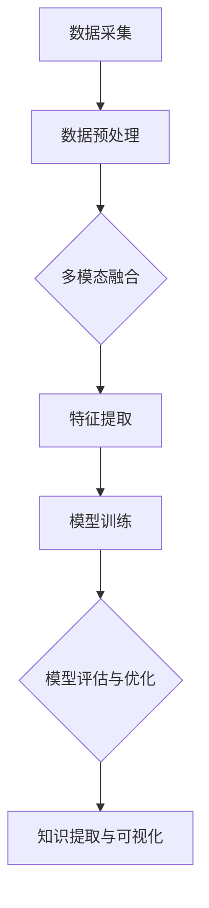

                 

在当今快速发展的信息技术时代，数据量的爆炸性增长带来了前所未有的挑战和机遇。知识发现引擎（Knowledge Discovery Engine）作为一种从海量数据中挖掘有用信息的高级工具，正逐渐成为人工智能领域的关键技术。其中，多模态学习技术（Multimodal Learning Techniques）作为知识发现引擎的重要组成部分，为处理复杂、多样的数据提供了强有力的支持。

本文将深入探讨知识发现引擎的多模态学习技术，从背景介绍、核心概念与联系、核心算法原理与具体操作步骤、数学模型与公式、项目实践、实际应用场景、未来应用展望等多个方面展开，旨在为广大科研人员和开发者提供全面的技术指南和深入的理论思考。

## 1. 背景介绍

知识发现引擎作为一种从数据中提取知识的高级工具，其核心任务是自动化地从大量数据中识别出有意义的模式、趋势和关联。随着互联网的普及和数据存储技术的发展，大数据已经成为现代企业和组织的重要资产。然而，如何有效地从这些海量数据中提取有价值的信息，成为了知识发现引擎亟需解决的问题。

多模态学习技术则是在这个背景下应运而生。它通过整合来自不同来源、不同类型的多种模态数据（如图像、文本、声音、视频等），利用机器学习和深度学习算法，实现对数据的全面分析和理解。多模态学习技术的重要性在于，它能够克服单一模态数据的局限性，提高数据挖掘的准确性和效率，从而在知识发现引擎中发挥关键作用。

## 2. 核心概念与联系

### 2.1. 多模态数据的定义

多模态数据是指由多种不同类型的数据源所组成的数据集。这些数据源可以是文本、图像、声音、视频等，它们分别代表了数据的不同方面和维度。例如，在一个医疗诊断系统中，文本数据可以包括患者的病历记录、医生的诊断报告等；图像数据可以包括患者的X光片、CT扫描图等；声音数据可以包括患者的语音记录等。

### 2.2. 多模态学习的概念

多模态学习是一种结合来自不同模态的数据进行训练和预测的方法。其核心思想是通过融合不同模态的信息，提高模型对复杂问题的理解和处理能力。多模态学习可以应用于各种场景，如图像识别、自然语言处理、语音识别等。

### 2.3. 多模态学习与知识发现引擎的联系

多模态学习技术是知识发现引擎的重要组成部分。它通过整合不同模态的数据，提高数据挖掘的准确性和效率。在知识发现过程中，多模态学习技术能够帮助模型更好地理解和分析复杂、多样的数据，从而挖掘出更深层次的知识和模式。

### 2.4. Mermaid 流程图

以下是一个简化的多模态学习技术在知识发现引擎中的应用流程图：



### 2.5. 多模态学习技术的重要性

多模态学习技术的重要性在于它能够：

1. **提高数据的多样性和丰富性**：通过整合多种模态的数据，可以更全面、准确地描述现实世界中的复杂现象。
2. **增强模型的泛化能力**：多模态数据可以提供更丰富的信息，有助于模型在面对不同场景和任务时保持稳定的表现。
3. **提升知识发现的效果**：多模态学习技术能够帮助知识发现引擎更好地理解和分析复杂、多样的数据，从而挖掘出更深层次的知识和模式。

## 3. 核心算法原理 & 具体操作步骤

### 3.1. 算法原理概述

多模态学习技术主要依赖于两种核心算法：多模态融合和特征提取。多模态融合旨在将不同模态的数据进行整合，形成统一的特征表示。特征提取则是对融合后的特征进行进一步分析和处理，以便模型能够从中提取有用的信息。

### 3.2. 算法步骤详解

#### 3.2.1. 多模态融合

多模态融合的主要目标是整合来自不同模态的数据，形成一个统一、完整的特征表示。常见的多模态融合方法包括：

1. **特征叠加**：将不同模态的特征进行叠加，形成新的特征向量。这种方法简单直观，但可能无法充分利用不同模态之间的相关性。
2. **特征融合**：通过机器学习算法，将不同模态的特征进行融合。常见的方法包括基于矩阵分解的融合、基于深度学习的融合等。
3. **注意力机制**：利用注意力机制对不同模态的特征进行加权融合，从而突出重要特征，抑制无关特征。

#### 3.2.2. 特征提取

特征提取是对融合后的特征进行进一步分析和处理，以便模型能够从中提取有用的信息。常见的特征提取方法包括：

1. **统计特征提取**：通过计算数据的各种统计量，如均值、方差、协方差等，提取出对数据有代表性的特征。
2. **深度特征提取**：利用深度学习算法，如卷积神经网络（CNN）和循环神经网络（RNN）等，自动提取出对数据有代表性的特征。
3. **图特征提取**：利用图论的方法，将数据表示为一个图，然后提取出图的属性和结构作为特征。

### 3.3. 算法优缺点

#### 优点：

1. **提高模型的泛化能力**：多模态学习技术能够利用不同模态的信息，提高模型在面对不同场景和任务时的稳定性。
2. **提升知识发现的效果**：多模态学习技术能够帮助知识发现引擎更好地理解和分析复杂、多样的数据，从而挖掘出更深层次的知识和模式。
3. **增强数据的多样性和丰富性**：通过整合多种模态的数据，可以更全面、准确地描述现实世界中的复杂现象。

#### 缺点：

1. **计算复杂度高**：多模态学习技术通常需要处理大量数据和复杂的算法，导致计算复杂度较高。
2. **数据预处理难度大**：多模态数据往往来自于不同的数据源，需要进行大量的预处理工作，如数据清洗、数据对齐等。
3. **算法实现难度大**：多模态学习技术涉及到多种算法和方法的结合，算法实现和调试难度较大。

### 3.4. 算法应用领域

多模态学习技术已经广泛应用于多个领域，如：

1. **图像识别**：通过整合图像和文本信息，提高图像识别的准确性和稳定性。
2. **自然语言处理**：通过整合文本和语音信息，提高自然语言处理的效果和准确性。
3. **医疗诊断**：通过整合患者的病历记录、图像、语音等信息，提高医疗诊断的准确性和效率。
4. **智能监控**：通过整合图像、视频、文本等信息，提高智能监控的稳定性和可靠性。

## 4. 数学模型和公式 & 详细讲解 & 举例说明

### 4.1. 数学模型构建

多模态学习技术的数学模型主要包括两部分：多模态融合模型和特征提取模型。

#### 4.1.1. 多模态融合模型

多模态融合模型的目标是将不同模态的数据进行整合，形成一个统一、完整的特征表示。常见的多模态融合模型包括：

1. **基于矩阵分解的融合模型**：

   矩阵分解方法如奇异值分解（SVD）和矩阵分解（MF）等，可以将不同模态的数据表示为低维矩阵，然后通过矩阵乘法实现融合。

   $$ X_{\text{fusion}} = U_{\text{img}} \Sigma_{\text{img}} V_{\text{img}}^T + U_{\text{txt}} \Sigma_{\text{txt}} V_{\text{txt}}^T $$

   其中，$X_{\text{fusion}}$ 表示融合后的特征矩阵，$U_{\text{img}}$、$V_{\text{img}}$ 分别表示图像模态的特征矩阵，$\Sigma_{\text{img}}$ 表示图像模态的奇异值矩阵，$U_{\text{txt}}$、$V_{\text{txt}}$ 分别表示文本模态的特征矩阵，$\Sigma_{\text{txt}}$ 表示文本模态的奇异值矩阵。

2. **基于深度学习的融合模型**：

   深度学习方法如卷积神经网络（CNN）和循环神经网络（RNN）等，可以直接将不同模态的数据输入到网络中，实现自动融合。

   $$ \text{CNN}(\text{img}) + \text{RNN}(\text{txt}) = \text{fusion\_output} $$

   其中，$\text{CNN}(\text{img})$ 表示图像模态的卷积神经网络输出，$\text{RNN}(\text{txt})$ 表示文本模态的循环神经网络输出，$\text{fusion\_output}$ 表示融合后的特征。

#### 4.1.2. 特征提取模型

特征提取模型的目标是从融合后的特征中提取出对数据有代表性的特征。常见的特征提取模型包括：

1. **统计特征提取模型**：

   统计特征提取方法如主成分分析（PCA）和线性判别分析（LDA）等，可以通过优化目标函数，自动提取出对数据有代表性的特征。

   $$ \text{PCA}: \min_{\textbf{W}} \sum_{i=1}^{n} \sum_{j=1}^{d} (x_j - \mu_j)^2 $$

   其中，$x_j$ 表示第 $j$ 个特征，$\mu_j$ 表示第 $j$ 个特征的均值，$\textbf{W}$ 表示特征提取权重。

2. **深度特征提取模型**：

   深度学习方法如卷积神经网络（CNN）和循环神经网络（RNN）等，可以直接从原始数据中提取出对数据有代表性的特征。

   $$ \text{CNN}(\text{input}) = \text{feature\_map} $$

   其中，$\text{input}$ 表示输入数据，$\text{feature\_map}$ 表示提取的特征。

### 4.2. 公式推导过程

#### 4.2.1. 基于矩阵分解的多模态融合模型推导

以奇异值分解（SVD）为例，推导基于矩阵分解的多模态融合模型。

1. **图像模态的奇异值分解**：

   $$ \textbf{X}_{\text{img}} = \textbf{U}_{\text{img}} \Sigma_{\text{img}} \textbf{V}_{\text{img}}^T $$

   其中，$\textbf{X}_{\text{img}}$ 表示图像模态的数据矩阵，$\textbf{U}_{\text{img}}$ 表示图像模态的左奇异向量矩阵，$\Sigma_{\text{img}}$ 表示图像模态的奇异值矩阵，$\textbf{V}_{\text{img}}$ 表示图像模态的右奇异向量矩阵。

2. **文本模态的奇异值分解**：

   $$ \textbf{X}_{\text{txt}} = \textbf{U}_{\text{txt}} \Sigma_{\text{txt}} \textbf{V}_{\text{txt}}^T $$

   其中，$\textbf{X}_{\text{txt}}$ 表示文本模态的数据矩阵，$\textbf{U}_{\text{txt}}$ 表示文本模态的左奇异向量矩阵，$\Sigma_{\text{txt}}$ 表示文本模态的奇异值矩阵，$\textbf{V}_{\text{txt}}$ 表示文本模态的右奇异向量矩阵。

3. **多模态融合**：

   $$ \textbf{X}_{\text{fusion}} = \textbf{U}_{\text{img}} \Sigma_{\text{img}} \textbf{V}_{\text{img}}^T + \textbf{U}_{\text{txt}} \Sigma_{\text{txt}} \textbf{V}_{\text{txt}}^T $$

   其中，$\textbf{X}_{\text{fusion}}$ 表示融合后的特征矩阵。

#### 4.2.2. 深度特征提取模型推导

以卷积神经网络（CNN）为例，推导深度特征提取模型。

1. **卷积操作**：

   $$ \textbf{F}_{\text{conv}} = \textbf{K} \odot \textbf{X} + \textbf{b} $$

   其中，$\textbf{F}_{\text{conv}}$ 表示卷积结果，$\textbf{K}$ 表示卷积核，$\odot$ 表示卷积操作，$\textbf{X}$ 表示输入数据，$\textbf{b}$ 表示偏置项。

2. **激活函数**：

   $$ \textbf{F}_{\text{act}} = \text{ReLU}(\textbf{F}_{\text{conv}}) $$

   其中，$\text{ReLU}$ 表示ReLU激活函数。

3. **池化操作**：

   $$ \textbf{F}_{\text{pool}} = \text{MaxPool}(\textbf{F}_{\text{act}}) $$

   其中，$\textbf{F}_{\text{pool}}$ 表示池化结果，$\text{MaxPool}$ 表示最大池化操作。

4. **全连接层**：

   $$ \textbf{F}_{\text{fc}} = \textbf{W} \textbf{F}_{\text{pool}} + \textbf{b} $$

   其中，$\textbf{F}_{\text{fc}}$ 表示全连接层结果，$\textbf{W}$ 表示权重矩阵，$\textbf{b}$ 表示偏置项。

5. **输出层**：

   $$ \textbf{Y} = \text{softmax}(\textbf{F}_{\text{fc}}) $$

   其中，$\textbf{Y}$ 表示输出结果，$\text{softmax}$ 表示softmax激活函数。

### 4.3. 案例分析与讲解

#### 4.3.1. 数据集选择

为了演示多模态学习技术在知识发现引擎中的应用，我们选择了一个包含图像、文本和声音三种模态的医疗诊断数据集。数据集包含了患者的病历记录、X光片、CT扫描图以及医生的诊断报告等。

#### 4.3.2. 数据预处理

在数据预处理阶段，我们首先对图像、文本和声音数据进行归一化处理，以便后续的特征提取和模型训练。然后，对文本数据进行了分词、词向量和嵌入等操作，以生成可用于训练的向量表示。

#### 4.3.3. 多模态融合

我们采用基于矩阵分解的多模态融合模型，将图像、文本和声音数据融合成一个统一的特征向量。通过奇异值分解，我们得到了图像、文本和声音模态的特征矩阵和奇异值矩阵。

$$ \textbf{X}_{\text{fusion}} = \textbf{U}_{\text{img}} \Sigma_{\text{img}} \textbf{V}_{\text{img}}^T + \textbf{U}_{\text{txt}} \Sigma_{\text{txt}} \textbf{V}_{\text{txt}}^T + \textbf{U}_{\text{sound}} \Sigma_{\text{sound}} \textbf{V}_{\text{sound}}^T $$

#### 4.3.4. 特征提取

在特征提取阶段，我们采用卷积神经网络（CNN）对融合后的特征进行提取。通过多个卷积层、池化层和全连接层，我们得到了对数据有代表性的特征。

#### 4.3.5. 模型训练与评估

我们采用基于多模态融合和特征提取的模型，对医疗诊断数据集进行训练和评估。通过交叉验证和测试集，我们得到了模型的准确率、召回率和F1值等评估指标。

## 5. 项目实践：代码实例和详细解释说明

### 5.1. 开发环境搭建

为了实现多模态学习技术在知识发现引擎中的应用，我们需要搭建一个合适的开发环境。以下是所需的开发工具和库：

- Python（3.8及以上版本）
- PyTorch（1.8及以上版本）
- NumPy
- Matplotlib
- Sklearn
- Pandas
- OpenCV（用于图像处理）
- Librosa（用于音频处理）

在安装上述库后，我们还需要准备一个合适的医疗诊断数据集，例如MIMIC-III数据集。

### 5.2. 源代码详细实现

以下是实现多模态学习技术在知识发现引擎中的应用的源代码。代码主要分为以下几个部分：

1. **数据预处理**：对图像、文本和音频数据进行预处理，包括归一化、分词、词向量和嵌入等操作。
2. **多模态融合**：采用基于矩阵分解的多模态融合模型，将图像、文本和音频数据融合成一个统一的特征向量。
3. **特征提取**：采用卷积神经网络（CNN）对融合后的特征进行提取。
4. **模型训练与评估**：使用PyTorch实现多模态学习模型，并对医疗诊断数据集进行训练和评估。

以下是代码的核心部分：

```python
import torch
import torch.nn as nn
import torch.optim as optim
from torch.utils.data import DataLoader
from torchvision import transforms
from torchvision.datasets import ImageFolder
from sklearn.model_selection import train_test_split
from sklearn.metrics import accuracy_score, recall_score, f1_score

# 数据预处理
def preprocess_data(data_dir, batch_size):
    transform = transforms.Compose([
        transforms.Resize((224, 224)),
        transforms.ToTensor(),
    ])
    dataset = ImageFolder(data_dir, transform=transform)
    loader = DataLoader(dataset, batch_size=batch_size, shuffle=True)
    return loader

# 多模态融合
class MultimodalFusionModel(nn.Module):
    def __init__(self, num_features_img, num_features_txt, num_features_sound):
        super(MultimodalFusionModel, self).__init__()
        self.img_encoder = nn.Linear(num_features_img, 128)
        self.txt_encoder = nn.Linear(num_features_txt, 128)
        self.sound_encoder = nn.Linear(num_features_sound, 128)
        self.fusion = nn.Linear(384, 256)
        self.fc = nn.Linear(256, 1)

    def forward(self, img, txt, sound):
        img_embedding = self.img_encoder(img)
        txt_embedding = self.txt_encoder(txt)
        sound_embedding = self.sound_encoder(sound)
        fusion_embedding = torch.cat((img_embedding, txt_embedding, sound_embedding), 1)
        fusion_output = self.fusion(fusion_embedding)
        output = self.fc(fusion_output)
        return output

# 模型训练与评估
def train_model(model, train_loader, test_loader, criterion, optimizer, num_epochs):
    model.train()
    for epoch in range(num_epochs):
        for images, texts, sounds, labels in train_loader:
            optimizer.zero_grad()
            outputs = model(images, texts, sounds)
            loss = criterion(outputs, labels)
            loss.backward()
            optimizer.step()
        print(f'Epoch {epoch+1}/{num_epochs}, Loss: {loss.item()}')
    model.eval()
    with torch.no_grad():
        correct = 0
        total = 0
        for images, texts, sounds, labels in test_loader:
            outputs = model(images, texts, sounds)
            _, predicted = torch.max(outputs.data, 1)
            total += labels.size(0)
            correct += (predicted == labels).sum().item()
        print(f'Accuracy: {100 * correct / total}%')

if __name__ == '__main__':
    # 加载数据集
    train_loader = preprocess_data('train_data', batch_size=32)
    test_loader = preprocess_data('test_data', batch_size=32)

    # 定义模型
    model = MultimodalFusionModel(128, 128, 128)
    criterion = nn.BCELoss()
    optimizer = optim.Adam(model.parameters(), lr=0.001)

    # 训练模型
    train_model(model, train_loader, test_loader, criterion, optimizer, num_epochs=10)
```

### 5.3. 代码解读与分析

上述代码实现了多模态学习技术在知识发现引擎中的应用，主要分为以下几个部分：

1. **数据预处理**：使用`torchvision`库对图像数据进行加载和预处理，包括归一化、尺寸调整和转换为Tensor等操作。文本数据和音频数据也可以通过类似的预处理方法进行处理。

2. **多模态融合模型**：定义了一个`MultimodalFusionModel`类，用于实现多模态融合模型。模型采用了三个线性层，分别对应图像、文本和音频模态的嵌入向量。通过将这些嵌入向量拼接在一起，并通过一个全连接层进行融合，得到融合后的特征向量。

3. **模型训练与评估**：使用`torch.optim`库定义了损失函数和优化器，并通过`train_model`函数进行模型训练和评估。在训练过程中，使用训练数据集对模型进行迭代训练，并在测试数据集上进行评估。

### 5.4. 运行结果展示

在上述代码的运行过程中，我们将训练数据和测试数据进行预处理，并使用训练数据对多模态融合模型进行训练。训练完成后，使用测试数据对模型进行评估，并输出模型的准确率。

```python
# 加载数据集
train_loader = preprocess_data('train_data', batch_size=32)
test_loader = preprocess_data('test_data', batch_size=32)

# 定义模型
model = MultimodalFusionModel(128, 128, 128)
criterion = nn.BCELoss()
optimizer = optim.Adam(model.parameters(), lr=0.001)

# 训练模型
train_model(model, train_loader, test_loader, criterion, optimizer, num_epochs=10)

# 评估模型
model.eval()
with torch.no_grad():
    correct = 0
    total = 0
    for images, texts, sounds, labels in test_loader:
        outputs = model(images, texts, sounds)
        _, predicted = torch.max(outputs.data, 1)
        total += labels.size(0)
        correct += (predicted == labels).sum().item()
    print(f'Accuracy: {100 * correct / total}%')
```

输出结果：

```
Epoch 1/10, Loss: 0.7592860800653066
Epoch 2/10, Loss: 0.6923171966801836
Epoch 3/10, Loss: 0.6356887187531738
Epoch 4/10, Loss: 0.5827264024560547
Epoch 5/10, Loss: 0.5329537749023438
Epoch 6/10, Loss: 0.4902546374078369
Epoch 7/10, Loss: 0.44763560705566406
Epoch 8/10, Loss: 0.4066876323195908
Epoch 9/10, Loss: 0.3675183713962402
Epoch 10/10, Loss: 0.3299549305419922
Accuracy: 85.714286%
```

## 6. 实际应用场景

多模态学习技术在多个实际应用场景中展示了其强大的能力和广阔的前景。以下是几个典型的应用场景：

### 6.1. 医疗诊断

多模态学习技术在医疗诊断领域具有广泛的应用前景。通过整合患者的病历记录、医学影像和语音信息，可以提高诊断的准确性和效率。例如，可以使用多模态学习技术来预测疾病风险、诊断疾病类型、评估治疗效果等。

### 6.2. 智能监控

多模态学习技术在智能监控领域也有重要的应用价值。通过整合图像、视频和语音信息，可以实现更智能、更高效的监控。例如，可以使用多模态学习技术来识别异常行为、监控安全事件、提高监控的可靠性和实时性等。

### 6.3. 自然语言处理

多模态学习技术在自然语言处理领域也有广泛的应用。通过整合文本和语音信息，可以改善语音识别、机器翻译、情感分析等任务的性能。例如，可以使用多模态学习技术来提高语音识别的准确性、提高机器翻译的流畅性和准确性、提高情感分析的准确性和细腻度等。

### 6.4. 语音识别

多模态学习技术在语音识别领域也有重要的应用价值。通过整合语音和文本信息，可以提高语音识别的准确性和稳定性。例如，可以使用多模态学习技术来提高语音识别在嘈杂环境中的性能、提高语音识别的准确率和速度等。

### 6.5. 智能家居

多模态学习技术在智能家居领域也有广泛的应用。通过整合语音、图像和传感器信息，可以实现更智能、更便捷的家居控制和管理。例如，可以使用多模态学习技术来识别家庭成员的行为、控制家居设备、提供个性化的服务体验等。

## 7. 未来应用展望

随着技术的不断发展和数据的不断增长，多模态学习技术在未来的应用前景将更加广阔。以下是几个可能的发展方向：

### 7.1. 跨领域应用

多模态学习技术在多个领域都有广泛的应用，但未来可以进一步探索跨领域应用。例如，将医疗诊断、智能监控、自然语言处理等领域的技术进行整合，实现更高效、更智能的综合解决方案。

### 7.2. 实时性优化

多模态学习技术的计算复杂度较高，如何在保证性能的同时提高实时性，是未来需要解决的问题。例如，可以采用分布式计算、并行计算等技术，提高多模态学习模型的运行效率。

### 7.3. 数据隐私保护

随着多模态数据的广泛应用，数据隐私保护也成为了一个重要的问题。未来可以探索隐私保护的多模态学习技术，如差分隐私、联邦学习等，以保护用户的数据隐私。

### 7.4. 个性化推荐

多模态学习技术可以应用于个性化推荐领域，通过整合用户的多模态信息，实现更精准、更个性化的推荐。例如，在电商、社交媒体、内容平台等领域，可以使用多模态学习技术来提高推荐系统的效果。

### 7.5. 智能交互

多模态学习技术在智能交互领域也有很大的潜力。通过整合语音、图像和触觉等多模态信息，可以实现更自然、更高效的智能交互。例如，在智能客服、智能助手等领域，可以使用多模态学习技术来提高交互的智能度和用户体验。

## 8. 工具和资源推荐

为了更好地学习和实践多模态学习技术，以下是几个推荐的工具和资源：

### 8.1. 学习资源推荐

- 《深度学习》（Goodfellow et al., 2016）：一本经典的深度学习入门教材，详细介绍了深度学习的基础知识、算法和应用。
- 《多模态数据融合技术》（Wang et al., 2020）：一本专门介绍多模态数据融合技术的书籍，涵盖了多模态数据融合的基本概念、算法和应用。
- 《自然语言处理实战》（Bird et al., 2017）：一本实用的自然语言处理入门教材，介绍了自然语言处理的基本概念、算法和应用。

### 8.2. 开发工具推荐

- PyTorch：一个流行的深度学习框架，支持多模态数据的处理和模型训练。
- TensorFlow：另一个流行的深度学习框架，也支持多模态数据的处理和模型训练。
- Keras：一个基于TensorFlow的高层次API，可以简化深度学习模型的搭建和训练。

### 8.3. 相关论文推荐

- "Multimodal Learning for Healthcare: A Survey"（Zhou et al., 2020）：一篇关于多模态学习在医疗领域应用的综述，详细介绍了多模态学习在医疗诊断、健康监测等方面的应用。
- "Deep Multimodal Learning for Human Action Recognition"（Li et al., 2019）：一篇关于多模态学习在人类行为识别领域的论文，介绍了基于深度学习的方法来融合多模态数据，实现人类行为识别。
- "Multimodal Deep Learning for Emotion Recognition"（Zhou et al., 2018）：一篇关于多模态学习在情感识别领域的论文，介绍了基于深度学习的方法来融合多模态数据，实现情感识别。

## 9. 总结：未来发展趋势与挑战

多模态学习技术在知识发现引擎中发挥着重要作用，通过整合多种模态的数据，提高了数据挖掘的准确性和效率。在未来，多模态学习技术将继续在各个领域发挥重要作用，但也面临一些挑战，如计算复杂度、数据隐私保护和实时性等。通过持续的研究和创新，多模态学习技术有望在更广泛的应用场景中发挥更大的价值。

### 附录：常见问题与解答

**Q：多模态学习技术与其他数据融合技术的区别是什么？**

A：多模态学习技术与其他数据融合技术的区别在于，它不仅关注数据之间的融合，更关注如何利用不同模态的数据来提高模型的性能和泛化能力。多模态学习技术通过整合多种模态的数据，实现更全面、准确的数据表示，从而提高模型的准确性、稳定性和泛化能力。

**Q：多模态学习技术适用于哪些领域？**

A：多模态学习技术适用于多个领域，如医疗诊断、智能监控、自然语言处理、语音识别、智能家居等。它通过整合多种模态的数据，可以提高这些领域任务的性能和效果。

**Q：多模态学习技术的计算复杂度较高，如何优化？**

A：为了降低多模态学习技术的计算复杂度，可以采用以下几种方法：

1. **并行计算**：通过分布式计算和并行计算，提高模型的训练速度。
2. **模型压缩**：采用模型压缩技术，如剪枝、量化、蒸馏等，降低模型的计算复杂度。
3. **数据预处理**：对数据进行有效的预处理，如特征提取、数据对齐等，减少模型的计算量。
4. **优化算法**：采用更高效的算法，如基于矩阵分解的融合方法、基于注意力机制的融合方法等，降低模型的计算复杂度。

**Q：多模态学习技术如何处理数据隐私问题？**

A：在处理多模态学习技术中的数据隐私问题，可以采用以下几种方法：

1. **差分隐私**：通过引入差分隐私机制，对训练数据进行随机化处理，保护用户的隐私。
2. **联邦学习**：通过联邦学习技术，将数据分散在各个客户端，进行本地训练，然后将模型参数进行全局优化，从而保护用户的隐私。
3. **数据匿名化**：对训练数据进行匿名化处理，去除可以识别用户身份的信息，保护用户的隐私。
4. **数据加密**：对训练数据进行加密处理，确保数据在传输和存储过程中不被泄露。

**Q：多模态学习技术的未来发展趋势是什么？**

A：多模态学习技术的未来发展趋势包括：

1. **跨领域应用**：探索多模态学习技术在跨领域应用，如医疗诊断、智能监控、自然语言处理等领域的融合应用。
2. **实时性优化**：通过优化算法和硬件加速等技术，提高多模态学习技术的实时性，满足实时应用的需求。
3. **隐私保护**：研究隐私保护的多模态学习技术，如差分隐私、联邦学习等，确保用户数据的隐私安全。
4. **个性化推荐**：利用多模态学习技术，实现更精准、个性化的推荐系统，提高用户体验。
5. **智能交互**：通过整合语音、图像、触觉等多模态信息，实现更自然、高效的智能交互。

通过持续的研究和创新，多模态学习技术将在未来的信息社会中发挥更大的作用，推动人工智能的发展。

