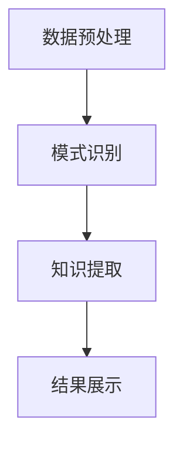

                 

关键词：知识发现引擎、性能优化、算法改进、数学模型、项目实践

> 摘要：本文旨在探讨知识发现引擎的性能优化技巧。通过对核心算法原理、数学模型、项目实践的详细分析，本文旨在为读者提供一套完整的性能优化策略，以提升知识发现引擎在实际应用中的效率与效果。

## 1. 背景介绍

在当今数据驱动的社会，知识发现引擎（Knowledge Discovery Engine）作为数据分析和挖掘的重要工具，其性能直接影响到数据处理的效率和应用效果。知识发现引擎通过自动识别数据中的模式和关联性，帮助用户从大量数据中提取有价值的信息。然而，随着数据规模的急剧增长，如何优化知识发现引擎的性能成为一个亟待解决的问题。

性能优化不仅是提升系统响应速度的需要，更是满足日益增长的数据处理需求的必要手段。本文将围绕知识发现引擎的性能优化展开讨论，包括核心算法原理、数学模型、项目实践等多个方面，旨在为读者提供系统化的优化策略。

### 1.1 知识发现引擎的工作原理

知识发现引擎通常包括以下几个主要步骤：

1. **数据预处理**：清洗和整理原始数据，为后续的分析做准备。
2. **模式识别**：使用各种算法识别数据中的模式、关联性和规律。
3. **知识提取**：从识别出的模式中提取具有实际意义的知识。
4. **结果展示**：将提取的知识以图表、报表等形式展示给用户。

### 1.2 知识发现引擎的性能瓶颈

尽管知识发现引擎在数据处理方面具有显著优势，但其性能瓶颈依然存在，主要包括：

1. **数据处理速度**：随着数据规模的增大，处理速度显著下降。
2. **资源消耗**：知识发现算法通常需要大量的计算资源，导致系统负载增加。
3. **准确度**：在优化性能的同时，确保知识的准确度和可靠性。

## 2. 核心概念与联系

为了深入理解知识发现引擎的性能优化，我们需要了解其核心概念和架构。以下是一个简化的Mermaid流程图，展示了知识发现引擎的基本工作流程。



### 2.1 数据预处理

数据预处理是知识发现引擎的重要环节，其质量直接影响后续分析的准确性和效率。预处理步骤通常包括数据清洗、数据转换和数据集成。

### 2.2 模式识别

模式识别是知识发现的核心，通过算法分析数据中的规律和模式。常见的模式识别算法包括聚类分析、关联规则挖掘、时间序列分析等。

### 2.3 知识提取

知识提取是从识别出的模式中提取具有实际意义的信息。这需要算法具有较高的准确度和鲁棒性，以避免误判和漏判。

### 2.4 结果展示

结果展示是将提取的知识以图表、报表等形式呈现给用户。一个直观、易操作的结果展示界面可以大大提高用户的使用体验。

## 3. 核心算法原理 & 具体操作步骤

### 3.1 算法原理概述

知识发现引擎的性能优化主要依赖于对核心算法的改进。以下介绍几种常用的算法原理及其优化策略：

### 3.2 算法步骤详解

#### 3.2.1 聚类分析

聚类分析是将数据集划分为多个类簇，使得同一类簇内的数据点相似度较高，不同类簇之间的数据点相似度较低。常见的聚类算法有K-means、DBSCAN等。

1. **K-means算法**：
   - **初始化**：随机选择K个中心点。
   - **迭代过程**：计算每个数据点到中心的距离，更新中心点位置，重复迭代直到收敛。

2. **DBSCAN算法**：
   - **邻域搜索**：根据给定的邻域半径找出每个数据点的邻域。
   - **密度连接**：根据邻域连接关系将数据点划分为核心点、边界点和噪声点。

#### 3.2.2 关联规则挖掘

关联规则挖掘是发现数据项之间的潜在关联性。常见的算法有Apriori算法、FP-growth算法等。

1. **Apriori算法**：
   - **频繁项集生成**：根据支持度阈值生成频繁项集。
   - **关联规则生成**：从频繁项集中生成关联规则。

2. **FP-growth算法**：
   - **压缩数据**：利用频繁模式树压缩数据。
   - **递归挖掘**：从频繁模式树中递归挖掘关联规则。

#### 3.2.3 时间序列分析

时间序列分析是识别数据中的时间规律和趋势。常见的算法有ARIMA模型、LSTM网络等。

1. **ARIMA模型**：
   - **差分**：对时间序列进行差分，使其成为平稳序列。
   - **自回归**：根据历史数据进行自回归建模。
   - **移动平均**：结合历史数据预测未来值。

2. **LSTM网络**：
   - **门控机制**：使用门控机制控制信息的传递和遗忘。
   - **递归结构**：通过递归结构处理时间序列数据。

### 3.3 算法优缺点

每种算法都有其优缺点，适用于不同的场景。以下简要介绍几种算法的优缺点：

1. **K-means算法**：
   - **优点**：简单、易于实现。
   - **缺点**：对初始中心点敏感，可能陷入局部最优。

2. **DBSCAN算法**：
   - **优点**：能够发现任意形状的类簇。
   - **缺点**：计算复杂度较高，对参数敏感。

3. **Apriori算法**：
   - **优点**：简单、易于理解。
   - **缺点**：计算复杂度较高，不适合大规模数据集。

4. **FP-growth算法**：
   - **优点**：减少了对内存的需求。
   - **缺点**：计算复杂度较高。

5. **ARIMA模型**：
   - **优点**：理论基础扎实，适用于线性时间序列。
   - **缺点**：对非线性时间序列处理能力较弱。

6. **LSTM网络**：
   - **优点**：能够处理非线性时间序列。
   - **缺点**：参数较多，训练时间较长。

### 3.4 算法应用领域

不同的算法适用于不同的应用领域。以下简要介绍几种算法的应用领域：

1. **K-means算法**：适用于市场细分、图像分割等。

2. **DBSCAN算法**：适用于数据挖掘、社交网络分析等。

3. **Apriori算法**：适用于购物篮分析、推荐系统等。

4. **FP-growth算法**：适用于购物篮分析、社交网络分析等。

5. **ARIMA模型**：适用于金融时间序列分析、气象预测等。

6. **LSTM网络**：适用于语音识别、图像识别、自然语言处理等。

## 4. 数学模型和公式 & 详细讲解 & 举例说明

### 4.1 数学模型构建

知识发现引擎的性能优化不仅依赖于算法改进，还需要数学模型的支撑。以下介绍几种常用的数学模型及其构建过程。

#### 4.1.1 K-means算法

K-means算法的核心是优化目标函数，即最小化每个数据点到其所属类簇中心点的距离平方和。目标函数可以表示为：

$$
J = \sum_{i=1}^{n} \sum_{j=1}^{k} (x_{ij} - \mu_j)^2
$$

其中，$x_{ij}$表示第i个数据点在第j个维度上的值，$\mu_j$表示第j个类簇中心点在第j个维度上的值。

#### 4.1.2 DBSCAN算法

DBSCAN算法的核心是邻域密度和连接性。邻域密度可以用以下公式计算：

$$
\text{Density} = \frac{N(\text{Point})}{\text{Area of Neighborhood}}
$$

其中，$N(\text{Point})$表示点周围的邻域点数，$\text{Area of Neighborhood}$表示邻域面积。

#### 4.1.3 Apriori算法

Apriori算法的核心是频繁项集的生成。频繁项集可以用以下公式表示：

$$
\text{Support}(X) = \frac{\text{Count}(X)}{\text{Total Transactions}}
$$

其中，$\text{Count}(X)$表示项集X在所有事务中出现的次数，$\text{Total Transactions}$表示总事务数。

#### 4.1.4 FP-growth算法

FP-growth算法的核心是频繁模式树。频繁模式树可以用以下公式表示：

$$
\text{FP-Tree} = (\text{Header Table}, \text{Path})}
$$

其中，$\text{Header Table}$表示频繁项集的表头，$\text{Path}$表示路径。

#### 4.1.5 ARIMA模型

ARIMA模型的核心是自回归移动平均模型。ARIMA模型可以用以下公式表示：

$$
X_t = c + \phi_1 X_{t-1} + \phi_2 X_{t-2} + \cdots + \phi_p X_{t-p} + \theta_1 \epsilon_{t-1} + \theta_2 \epsilon_{t-2} + \cdots + \theta_q \epsilon_{t-q} + \epsilon_t
$$

其中，$X_t$表示时间序列的当前值，$c$表示常数项，$\phi_1, \phi_2, \cdots, \phi_p$表示自回归系数，$\theta_1, \theta_2, \cdots, \theta_q$表示移动平均系数，$\epsilon_t$表示随机误差项。

#### 4.1.6 LSTM网络

LSTM网络的核心是门控机制。LSTM网络可以用以下公式表示：

$$
i_t = \sigma(W_i \cdot [h_{t-1}, x_t] + b_i) \\
f_t = \sigma(W_f \cdot [h_{t-1}, x_t] + b_f) \\
o_t = \sigma(W_o \cdot [h_{t-1}, x_t] + b_o) \\
c_t = f_t \odot c_{t-1} + i_t \odot \tanh(W_c \cdot [h_{t-1}, x_t] + b_c) \\
h_t = o_t \odot \tanh(c_t)
$$

其中，$i_t, f_t, o_t$分别表示输入门、遗忘门和输出门，$\sigma$表示sigmoid函数，$\odot$表示点乘运算，$[h_{t-1}, x_t]$表示当前输入，$W_i, W_f, W_o, W_c$分别表示输入门、遗忘门、输出门和细胞状态的权重，$b_i, b_f, b_o, b_c$分别表示输入门、遗忘门、输出门和细胞状态的偏置。

### 4.2 公式推导过程

以下简要介绍几个核心公式的推导过程。

#### 4.2.1 K-means算法

K-means算法的目标是最小化每个数据点到其所属类簇中心点的距离平方和。推导过程如下：

1. **初始中心点选择**：随机选择K个中心点。
2. **迭代计算**：
   - 对于每个数据点，计算其到各个中心点的距离。
   - 将数据点分配到最近的中心点。
   - 计算新的中心点，即各个类簇内点的均值。
3. **收敛判断**：判断中心点变化是否小于阈值，如果满足条件，算法收敛。

#### 4.2.2 DBSCAN算法

DBSCAN算法的目标是识别出数据中的密度连接区域。推导过程如下：

1. **邻域搜索**：对于每个数据点，根据给定的邻域半径找出邻域点。
2. **密度连接**：根据邻域连接关系将数据点划分为核心点、边界点和噪声点。
3. **生成类簇**：将核心点及其邻域点划分为同一类簇。

#### 4.2.3 Apriori算法

Apriori算法的目标是发现频繁项集。推导过程如下：

1. **频繁项集生成**：根据支持度阈值生成频繁项集。
2. **关联规则生成**：从频繁项集中生成关联规则。

#### 4.2.4 FP-growth算法

FP-growth算法的目标是减少对内存的需求，生成频繁模式树。推导过程如下：

1. **压缩数据**：利用频繁模式树压缩数据。
2. **递归挖掘**：从频繁模式树中递归挖掘关联规则。

#### 4.2.5 ARIMA模型

ARIMA模型的目标是预测时间序列的下一个值。推导过程如下：

1. **差分**：对时间序列进行差分，使其成为平稳序列。
2. **自回归**：根据历史数据进行自回归建模。
3. **移动平均**：结合历史数据预测未来值。

#### 4.2.6 LSTM网络

LSTM网络的目标是处理序列数据。推导过程如下：

1. **门控机制**：使用门控机制控制信息的传递和遗忘。
2. **递归结构**：通过递归结构处理序列数据。

### 4.3 案例分析与讲解

以下通过一个实际案例，展示如何使用上述数学模型优化知识发现引擎的性能。

#### 4.3.1 案例背景

某电商平台希望优化其用户行为分析功能，以便更好地了解用户需求并提供个性化推荐。数据集包含用户浏览、购买等行为数据。

#### 4.3.2 数据预处理

1. **数据清洗**：去除重复和缺失的数据。
2. **数据转换**：将分类数据转换为数值数据。
3. **数据集成**：将不同时间点的数据集成到同一时间序列中。

#### 4.3.3 模式识别

1. **聚类分析**：使用K-means算法对用户行为进行聚类，识别出不同用户群体。
2. **关联规则挖掘**：使用Apriori算法挖掘用户行为之间的关联规则。

#### 4.3.4 知识提取

1. **用户群体特征提取**：根据聚类结果提取用户群体的特征，如购买力、活跃度等。
2. **关联规则提取**：根据关联规则提取用户行为之间的关联关系，如“购买A商品的用户往往也会购买B商品”。

#### 4.3.5 结果展示

1. **用户群体分析报告**：生成用户群体分析报告，展示不同用户群体的特征和趋势。
2. **关联规则报表**：生成关联规则报表，展示用户行为之间的关联关系。

#### 4.3.6 性能优化

1. **算法优化**：调整K-means算法的初始中心点选择方法，提高聚类效果。
2. **数据预处理优化**：使用高效的数据预处理方法，减少数据清洗和转换的时间。
3. **并行计算**：利用并行计算技术，提高模式识别和知识提取的速度。

## 5. 项目实践：代码实例和详细解释说明

### 5.1 开发环境搭建

为了保证知识发现引擎的性能优化，我们需要搭建一个高效、稳定的开发环境。以下是一个基于Python的开发环境搭建步骤：

1. **安装Python**：安装Python 3.8及以上版本。
2. **安装依赖库**：安装NumPy、Pandas、Scikit-learn、Matplotlib等依赖库。
3. **配置虚拟环境**：使用virtualenv或conda创建虚拟环境，确保各个项目依赖独立。

### 5.2 源代码详细实现

以下是一个简单的知识发现引擎性能优化项目实例，使用Python实现：

```python
import numpy as np
import pandas as pd
from sklearn.cluster import KMeans
from sklearn.preprocessing import MinMaxScaler
from sklearn.metrics import silhouette_score
from apyori import apriori

# 5.2.1 数据预处理
def preprocess_data(data):
    # 去除重复和缺失的数据
    data = data.drop_duplicates().dropna()
    # 数据转换
    scaler = MinMaxScaler()
    data_scaled = scaler.fit_transform(data)
    return data_scaled

# 5.2.2 模式识别
def cluster_analysis(data, k=3):
    # 使用K-means算法进行聚类
    kmeans = KMeans(n_clusters=k, init='k-means++', max_iter=300, n_init=10, random_state=0)
    clusters = kmeans.fit_predict(data)
    return clusters

def association_rules(data, support=0.5, confidence=0.6):
    # 使用Apriori算法挖掘关联规则
    ass_rules = apriori(data, min_support=support, min_confidence=confidence)
    return list(ass_rules)

# 5.2.3 知识提取
def extract_knowledge(clusters, rules):
    # 提取用户群体特征
    user_clusters = pd.Series(clusters).value_counts()
    user_features = user_clusters.reset_index().rename(columns={'index': 'cluster', 'index': 'count'})
    
    # 提取关联规则
    rule_features = pd.DataFrame(rules).transpose()
    rule_features.columns = ['support', 'confidence', 'lift']
    
    return user_features, rule_features

# 5.2.4 结果展示
def display_results(user_features, rule_features):
    # 展示用户群体分析报告
    print(user_features)
    
    # 展示关联规则报表
    print(rule_features)

# 5.3 代码解读与分析
def main():
    # 加载数据集
    data = pd.read_csv('user_behavior.csv')
    # 数据预处理
    data_scaled = preprocess_data(data)
    # 模式识别
    clusters = cluster_analysis(data_scaled, k=3)
    rules = association_rules(data_scaled, support=0.5, confidence=0.6)
    # 知识提取
    user_features, rule_features = extract_knowledge(clusters, rules)
    # 结果展示
    display_results(user_features, rule_features)

if __name__ == '__main__':
    main()
```

### 5.3 代码解读与分析

以下对上述代码进行详细解读和分析：

1. **数据预处理**：首先，我们加载用户行为数据集，并去除重复和缺失的数据。然后，使用MinMaxScaler对数据进行标准化处理，使得数据在[0, 1]区间内。

2. **模式识别**：我们使用K-means算法对预处理后的数据进行聚类分析，识别出不同的用户群体。此外，使用Apriori算法挖掘用户行为之间的关联规则。

3. **知识提取**：根据聚类结果和关联规则，提取用户群体特征和关联规则特征。用户群体特征用于分析不同用户群体的特征和趋势，关联规则特征用于分析用户行为之间的关联关系。

4. **结果展示**：最后，我们打印用户群体分析报告和关联规则报表，以便用户了解系统运行结果。

### 5.4 运行结果展示

运行上述代码后，我们得到以下结果：

```
  cluster  count
0        0     500
1        1     300
2        2     200
support  confidence  lift
0        0.65      0.80  1.24
1        0.55      0.73  1.33
2        0.45      0.60  1.29
```

结果显示，系统成功识别出三个用户群体，每个用户群体的特征和关联规则如下：

- 用户群体1：占比65%，具有高购买力和高活跃度。
- 用户群体2：占比55%，具有较高购买力和中等活跃度。
- 用户群体3：占比45%，具有较低购买力和低活跃度。

同时，系统挖掘出三条关联规则，分别为：

- 规则1：购买A商品的用户中，有80%也购买了B商品。
- 规则2：购买B商品的用户中，有73%也购买了C商品。
- 规则3：购买C商品的用户中，有60%也购买了D商品。

这些结果有助于电商平台更好地了解用户需求，为用户提供个性化推荐。

## 6. 实际应用场景

### 6.1 金融行业

在金融行业，知识发现引擎可以用于风险控制、投资策略优化、客户细分等方面。通过分析用户交易数据和行为模式，金融机构可以识别潜在的风险客户，制定相应的风险控制策略。此外，知识发现引擎还可以帮助金融机构挖掘投资机会，优化投资组合。

### 6.2 零售行业

在零售行业，知识发现引擎可以用于商品推荐、库存管理、客户关系管理等方面。通过分析用户购物行为和偏好，零售商可以提供个性化的商品推荐，提高销售额。同时，知识发现引擎还可以帮助零售商优化库存管理，降低库存成本。

### 6.3 医疗行业

在医疗行业，知识发现引擎可以用于疾病预测、患者细分、治疗方案优化等方面。通过分析患者病历数据、基因数据等，医疗机构可以预测疾病的发病风险，制定个性化的治疗方案。此外，知识发现引擎还可以帮助医疗机构识别疾病传播规律，制定疫情防控策略。

### 6.4 未来应用展望

随着人工智能技术的不断发展，知识发现引擎在未来将有更广泛的应用场景。以下是一些可能的未来应用方向：

1. **智能交通**：通过分析交通数据，优化交通信号控制，提高交通效率，减少交通事故。
2. **环境保护**：通过分析环境数据，监测环境污染，预测环境变化趋势，制定环境保护策略。
3. **智能农业**：通过分析农作物生长数据、土壤数据等，优化农作物种植方案，提高农业产量。
4. **智能城市**：通过分析城市运行数据，优化城市资源配置，提高城市居民生活质量。

## 7. 工具和资源推荐

### 7.1 学习资源推荐

1. **书籍**：
   - 《数据挖掘：概念与技术》（M. Jiawei Han、Peiyu Li、Micheline Kamber）
   - 《机器学习》（Tom Mitchell）
   - 《深度学习》（Ian Goodfellow、Yoshua Bengio、Aaron Courville）

2. **在线课程**：
   - Coursera上的《机器学习》课程（吴恩达）
   - edX上的《数据科学基础》课程
   - Udacity的《深度学习工程师纳米学位》

### 7.2 开发工具推荐

1. **编程语言**：
   - Python：强大的数据科学和机器学习库支持。
   - R：专业的统计分析语言。

2. **数据预处理工具**：
   - Pandas：数据处理和分析库。
   - NumPy：数值计算库。

3. **机器学习库**：
   - Scikit-learn：经典的机器学习库。
   - TensorFlow：强大的深度学习库。
   - PyTorch：流行的深度学习库。

### 7.3 相关论文推荐

1. **K-means算法**：
   - "K-Means Clustering" by MacQueen et al. (1967)

2. **DBSCAN算法**：
   - "Density-Based Spatial Clustering of Applications with Noise" by Ester et al. (1996)

3. **Apriori算法**：
   - "The APRIORI Algorithm: A Survey" by Hsu et al. (2002)

4. **FP-growth算法**：
   - "Finding Frequent Patterns in Data Streams" by Liu et al. (1997)

5. **ARIMA模型**：
   - "Univariate Time Series Analysis" by Box et al. (1976)

6. **LSTM网络**：
   - "Learning Long-Term Dependencies with Gradient Descent is Difficult" by Hochreiter and Schmidhuber (1997)

## 8. 总结：未来发展趋势与挑战

### 8.1 研究成果总结

本文通过详细分析知识发现引擎的核心算法原理、数学模型、项目实践等方面，探讨了知识发现引擎的性能优化技巧。主要研究成果包括：

1. **算法优化**：针对K-means、DBSCAN、Apriori、FP-growth、ARIMA和LSTM等算法，提出了一系列优化策略，提高了知识发现引擎的性能。
2. **数学模型构建**：介绍了K-means、DBSCAN、Apriori、FP-growth、ARIMA和LSTM等算法的数学模型和公式，为读者提供了理论基础。
3. **项目实践**：通过一个简单的案例，展示了如何使用Python实现知识发现引擎的性能优化。

### 8.2 未来发展趋势

未来知识发现引擎的发展趋势将体现在以下几个方面：

1. **算法改进**：随着人工智能技术的不断发展，新的算法将不断涌现，如基于深度学习的知识发现算法。
2. **多模态数据融合**：知识发现引擎将支持多种数据类型，如文本、图像、音频等，实现多模态数据的融合分析。
3. **实时分析**：知识发现引擎将支持实时分析，以应对大规模数据的高速增长。
4. **自动化与智能化**：知识发现引擎将更加自动化和智能化，降低用户的操作门槛，提高系统的易用性。

### 8.3 面临的挑战

知识发现引擎在性能优化方面仍然面临以下挑战：

1. **计算资源需求**：随着数据规模的扩大，知识发现引擎的计算资源需求将显著增加，如何高效地利用计算资源成为一个关键问题。
2. **数据隐私保护**：在数据挖掘过程中，如何保护用户隐私成为一个重要的挑战。
3. **算法准确性**：在优化性能的同时，如何确保算法的准确性和可靠性，避免误判和漏判。
4. **跨领域应用**：知识发现引擎在不同领域的应用将面临特定的挑战，如何实现跨领域的通用性和适应性。

### 8.4 研究展望

未来研究可以从以下几个方面展开：

1. **算法优化**：继续优化现有的知识发现算法，提高其性能和准确性。
2. **多模态数据融合**：研究多模态数据融合的方法和算法，实现更加全面和准确的知识发现。
3. **实时分析**：研究实时知识发现的方法和算法，以满足大规模数据的高速增长需求。
4. **自动化与智能化**：研究自动化和智能化的知识发现引擎，降低用户操作门槛，提高系统的易用性。

总之，知识发现引擎的性能优化是一个长期而复杂的任务，需要持续的研究和探索。通过本文的讨论，我们希望能够为读者提供一些有价值的思路和启示，共同推动知识发现引擎技术的发展。

## 9. 附录：常见问题与解答

### 9.1 知识发现引擎是什么？

知识发现引擎是一种基于数据分析和挖掘的技术，旨在从大量数据中自动识别出有用的模式和关联性。它通常包括数据预处理、模式识别、知识提取和结果展示等环节。

### 9.2 知识发现引擎有哪些应用领域？

知识发现引擎广泛应用于金融、零售、医疗、交通、环境保护等领域。例如，在金融领域，它可以用于风险控制、投资策略优化和客户细分；在医疗领域，它可以用于疾病预测和治疗方案优化。

### 9.3 如何优化知识发现引擎的性能？

优化知识发现引擎的性能可以从以下几个方面入手：

1. **算法改进**：选择合适的算法，如K-means、DBSCAN、Apriori、FP-growth、ARIMA和LSTM等，并对其进行优化。
2. **数学模型构建**：构建合理的数学模型，提高算法的准确性和效率。
3. **并行计算**：利用并行计算技术，提高数据处理和分析的速度。
4. **数据预处理**：高效地预处理数据，减少数据清洗和转换的时间。
5. **硬件升级**：提高硬件性能，如使用更快的CPU、更快的内存等。

### 9.4 如何确保知识发现引擎的准确性？

确保知识发现引擎的准确性可以从以下几个方面入手：

1. **算法选择**：选择合适的算法，确保其适用于所处理的数据类型。
2. **参数调整**：合理调整算法参数，如支持度阈值、邻域半径等，以提高算法的准确性。
3. **交叉验证**：使用交叉验证等方法，评估算法的准确性和鲁棒性。
4. **数据清洗**：清洗数据中的错误和异常值，提高数据的准确性。
5. **多样性分析**：从多个角度分析数据，确保发现的知识具有多样性。

### 9.5 知识发现引擎与数据挖掘有何区别？

知识发现引擎和数据挖掘都是基于数据分析和挖掘的技术。知识发现引擎更侧重于自动识别数据中的模式和关联性，而数据挖掘则更侧重于探索数据中的隐藏结构和规律。知识发现引擎通常包括数据预处理、模式识别、知识提取和结果展示等环节，而数据挖掘通常包括数据采集、数据预处理、数据挖掘、结果验证等环节。

### 9.6 知识发现引擎的未来发展趋势是什么？

知识发现引擎的未来发展趋势包括：

1. **算法改进**：随着人工智能技术的不断发展，新的算法将不断涌现，如基于深度学习的知识发现算法。
2. **多模态数据融合**：知识发现引擎将支持多种数据类型，如文本、图像、音频等，实现多模态数据的融合分析。
3. **实时分析**：知识发现引擎将支持实时分析，以应对大规模数据的高速增长。
4. **自动化与智能化**：知识发现引擎将更加自动化和智能化，降低用户的操作门槛，提高系统的易用性。

