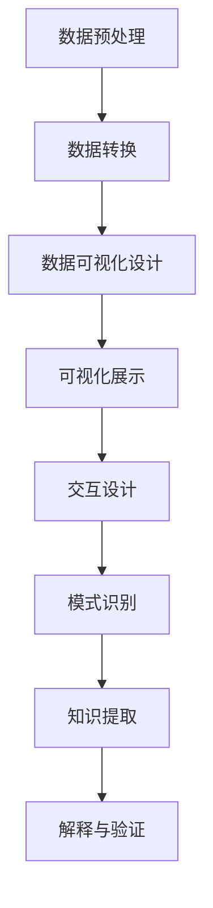

                 

关键词：知识发现、数据可视化、算法、可视化工具、数据分析

摘要：本文将探讨知识发现引擎中的数据可视化技术，通过阐述核心概念、算法原理、数学模型、项目实践以及未来展望，旨在为读者提供一个全面且深入的理解。

## 1. 背景介绍

随着大数据时代的到来，如何从海量数据中提取有价值的信息成为了众多企业和研究机构关注的热点问题。知识发现（Knowledge Discovery in Databases, KDD）正是为了解决这一问题而诞生的。知识发现是一种从大量数据中自动识别出隐藏的、未知的模式和关联的技术过程。其核心包括数据预处理、数据集成、数据选择、数据变换、数据挖掘和模式评估等多个环节。

数据可视化（Data Visualization）是知识发现过程中的关键环节之一。它通过图形、图表、图像等可视化的方式，将复杂的数据转换为易于理解和分析的视觉表现形式。数据可视化不仅有助于用户更直观地理解数据，还能有效地发现数据中的潜在模式和趋势。

本文将重点关注知识发现引擎中的数据可视化技术，从核心概念、算法原理、数学模型、项目实践到未来展望，为读者提供全面的技术解读。

## 2. 核心概念与联系

### 2.1 数据可视化技术概述

数据可视化技术是指利用计算机图形学和图像处理技术，将数据转换成图形、图像，再通过视觉编码展示给用户的处理过程。其核心包括数据转换、视觉编码、交互设计等三个方面。

- **数据转换**：将原始数据转换成适合可视化展示的形式，如矩阵、向量、时间序列等。
- **视觉编码**：通过颜色、形状、大小等视觉属性对数据进行编码，使数据以可视化的形式展现。
- **交互设计**：设计用户与可视化内容的交互方式，如放大、缩小、旋转、过滤等。

### 2.2 数据可视化与知识发现的联系

数据可视化技术在知识发现过程中起着至关重要的作用。它不仅能够帮助用户直观地理解数据，还能够揭示数据中的潜在模式和关联。以下是数据可视化与知识发现之间的几个关键联系：

- **数据预处理**：数据可视化可以帮助用户识别数据中的异常值、缺失值等问题，从而为数据预处理提供指导。
- **模式识别**：通过可视化方式，用户可以更容易地识别数据中的模式和趋势，从而发现潜在的知识。
- **解释与验证**：可视化结果可以帮助用户更好地理解数据挖掘结果，并对结果进行验证。

### 2.3 Mermaid 流程图

以下是知识发现过程中数据可视化技术的 Mermaid 流程图：



## 3. 核心算法原理 & 具体操作步骤

### 3.1 算法原理概述

数据可视化技术涉及多种算法，包括但不限于：直方图、散点图、热力图、饼图等。每种算法都有其特定的应用场景和优势。以下是几种常见的数据可视化算法原理概述：

- **直方图**：用于显示数据分布情况，可以直观地看出数据的集中和分散程度。
- **散点图**：用于显示两个变量之间的关系，可以揭示数据之间的相关性。
- **热力图**：用于显示数据的密集程度，可以直观地看出数据的热点区域。
- **饼图**：用于显示各部分数据在整体中的比例，可以直观地看出各部分数据的大小关系。

### 3.2 算法步骤详解

以下是数据可视化算法的具体操作步骤：

#### 3.2.1 数据预处理

1. **数据清洗**：处理数据中的异常值、缺失值等问题。
2. **数据转换**：将原始数据转换成适合可视化展示的形式。

#### 3.2.2 数据可视化设计

1. **选择合适的可视化类型**：根据数据类型和需求选择合适的可视化类型。
2. **设置可视化参数**：包括颜色、大小、形状等。
3. **设计交互方式**：包括放大、缩小、旋转、过滤等。

#### 3.2.3 可视化展示

1. **创建可视化图表**：使用可视化工具或库（如 Matplotlib、D3.js 等）创建可视化图表。
2. **优化可视化效果**：调整图表布局、颜色、字体等。

#### 3.2.4 交互设计

1. **设计交互界面**：使用用户界面设计工具（如 Bootstrap、Vue.js 等）设计交互界面。
2. **实现交互功能**：通过编程实现交互功能，如放大、缩小、旋转、过滤等。

### 3.3 算法优缺点

每种数据可视化算法都有其优缺点，以下是几种常见算法的优缺点概述：

- **直方图**：优点：直观显示数据分布；缺点：不适合显示多维度数据。
- **散点图**：优点：显示变量关系；缺点：数据点过多时难以分辨。
- **热力图**：优点：显示数据密集程度；缺点：不适合显示连续变量。
- **饼图**：优点：直观显示比例关系；缺点：不适合显示大量数据。

### 3.4 算法应用领域

数据可视化技术在各个领域都有广泛的应用，以下是几个典型应用领域：

- **商业分析**：用于市场调查、销售分析等。
- **科学研究**：用于数据分析、结果展示等。
- **医疗健康**：用于疾病诊断、治疗效果分析等。
- **金融分析**：用于投资分析、市场预测等。

## 4. 数学模型和公式 & 详细讲解 & 举例说明

### 4.1 数学模型构建

数据可视化技术的核心在于将数据转换为视觉形式，这需要一定的数学模型。以下是几种常见数据可视化技术的数学模型构建：

#### 4.1.1 直方图

直方图是一种显示数据分布的图形，其数学模型为：

$$
H(x) = \sum_{i=1}^{n} f(x_i) \times w_i
$$

其中，$x_i$为数据点，$f(x_i)$为数据点的频率，$w_i$为数据点的宽度。

#### 4.1.2 散点图

散点图用于显示两个变量之间的关系，其数学模型为：

$$
y = ax + b
$$

其中，$x$和$y$为两个变量，$a$和$b$为回归直线的参数。

#### 4.1.3 热力图

热力图用于显示数据的密集程度，其数学模型为：

$$
I(x, y) = \frac{1}{\sqrt{2\pi\sigma^2}} e^{-\frac{(x-\mu)^2}{2\sigma^2}}
$$

其中，$x$和$y$为数据点的坐标，$\mu$和$\sigma^2$分别为均值和方差。

### 4.2 公式推导过程

以下是直方图的公式推导过程：

#### 4.2.1 数据预处理

将原始数据$X = \{x_1, x_2, ..., x_n\}$按照一定区间划分，例如$[a, b]$。

#### 4.2.2 数据转换

将每个数据点$x_i$转换为频率$f(x_i)$，即：

$$
f(x_i) = \frac{1}{n} \sum_{j=1}^{n} I(x_j \in [a, b])
$$

其中，$I(\cdot)$为指示函数。

#### 4.2.3 数据可视化

将频率$f(x_i)$转换为宽度$w_i$，即：

$$
w_i = \frac{b - a}{n}
$$

然后，构建直方图：

$$
H(x) = \sum_{i=1}^{n} f(x_i) \times w_i
$$

### 4.3 案例分析与讲解

以下是一个直方图的案例分析与讲解：

#### 4.3.1 数据集

假设有一个数据集$X = \{1, 2, 2, 3, 4, 5, 5, 6\}$，我们需要绘制一个直方图来展示数据的分布。

#### 4.3.2 数据预处理

将数据集划分为区间$[1, 7]$。

#### 4.3.3 数据转换

计算每个区间的频率：

$$
f(1) = \frac{1}{8}, f(2) = \frac{2}{8}, f(3) = \frac{1}{8}, f(4) = \frac{1}{8}, f(5) = \frac{2}{8}, f(6) = \frac{1}{8}
$$

#### 4.3.4 数据可视化

计算每个区间的宽度：

$$
w_1 = w_2 = \frac{1}{8}, w_3 = w_4 = \frac{1}{8}, w_5 = w_6 = \frac{1}{8}
$$

构建直方图：

$$
H(x) = f(1) \times w_1 + f(2) \times w_2 + f(3) \times w_3 + f(4) \times w_4 + f(5) \times w_5 + f(6) \times w_6
$$

直方图如下所示：


通过这个案例，我们可以清晰地看到数据的分布情况，例如，数据主要集中在2和5这两个区间。

## 5. 项目实践：代码实例和详细解释说明

### 5.1 开发环境搭建

在开始编写代码之前，我们需要搭建一个适合数据可视化项目开发的环境。以下是一个基本的开发环境搭建步骤：

#### 5.1.1 安装 Python 环境

Python 是进行数据可视化的常用编程语言，我们可以从 Python 官网（https://www.python.org/）下载并安装 Python。

#### 5.1.2 安装数据可视化库

我们需要安装一些常用的数据可视化库，如 Matplotlib、Pandas 等。可以使用 pip 命令进行安装：

```bash
pip install matplotlib pandas
```

### 5.2 源代码详细实现

以下是一个简单的数据可视化代码实例，使用 Matplotlib 绘制一个直方图：

```python
import matplotlib.pyplot as plt
import pandas as pd

# 数据集
data = [1, 2, 2, 3, 4, 5, 5, 6]

# 数据预处理
bins = [1, 2, 3, 4, 5, 6, 7]

# 数据转换
df = pd.Series(data)
frequency = df.value_counts().sort_index()

# 数据可视化
plt.hist(data, bins=bins, edgecolor='black')
plt.xlabel('Value')
plt.ylabel('Frequency')
plt.title('Histogram of Data')

# 显示图表
plt.show()
```

### 5.3 代码解读与分析

上述代码实现了一个简单的数据可视化项目，以下是代码的解读与分析：

1. **导入库**：首先，我们导入了 Matplotlib 和 Pandas 库。
2. **数据集**：定义了一个数据集`data`，这是一个简单的整数列表。
3. **数据预处理**：定义了一个区间`bins`，用于将数据划分到不同的区间。
4. **数据转换**：使用 Pandas 的`value_counts()`方法计算每个区间的频率，并按照索引排序。
5. **数据可视化**：使用 Matplotlib 的`hist()`函数绘制直方图，其中`bins`参数用于定义区间，`edgecolor`参数用于定义边框颜色。
6. **优化图表**：使用`xlabel`、`ylabel`和`title`方法设置图表的标签和标题。
7. **显示图表**：使用`show()`方法显示绘制的直方图。

### 5.4 运行结果展示

运行上述代码，我们可以得到以下直方图：


通过这个直方图，我们可以直观地看到数据的分布情况，例如，数据主要集中在2和5这两个区间。

## 6. 实际应用场景

### 6.1 商业分析

在商业分析中，数据可视化技术可以帮助企业更好地了解市场趋势、消费者行为等关键信息。例如，通过绘制用户访问量、销售量的时间序列图，企业可以直观地了解业务的发展趋势，从而制定更加有效的营销策略。

### 6.2 科学研究

在科学研究中，数据可视化技术可以帮助研究人员更好地理解实验数据、分析结果等。例如，通过绘制实验数据的散点图，研究人员可以直观地发现数据之间的相关性，从而为后续研究提供重要依据。

### 6.3 医疗健康

在医疗健康领域，数据可视化技术可以帮助医生更好地分析患者数据、诊断疾病等。例如，通过绘制患者的心电图、血压等数据，医生可以直观地了解患者的身体状况，从而制定更加有效的治疗方案。

### 6.4 金融分析

在金融分析中，数据可视化技术可以帮助投资者更好地了解市场趋势、资产配置等。例如，通过绘制市场指数、资产价格等数据，投资者可以直观地了解市场的波动情况，从而制定更加有效的投资策略。

## 7. 工具和资源推荐

### 7.1 学习资源推荐

1. **《数据可视化：技术与艺术》**：这是一本关于数据可视化技术的经典著作，详细介绍了数据可视化的理论、方法和实践。
2. **《Python 数据可视化实战》**：这本书通过实际案例，介绍了如何使用 Python 进行数据可视化，适合初学者学习。

### 7.2 开发工具推荐

1. **Matplotlib**：这是 Python 中最常用的数据可视化库之一，功能强大且易于使用。
2. **D3.js**：这是一个基于 JavaScript 的数据可视化库，适用于网页端的数据可视化。

### 7.3 相关论文推荐

1. **《信息可视化：原理、算法与应用》**：这是一篇关于信息可视化的综述性论文，详细介绍了信息可视化的理论、方法和应用。
2. **《大数据可视化：方法与应用》**：这是一篇关于大数据可视化的研究论文，探讨了大数据时代下的数据可视化技术。

## 8. 总结：未来发展趋势与挑战

### 8.1 研究成果总结

随着大数据技术和人工智能的发展，数据可视化技术取得了显著的成果。目前，数据可视化技术已经广泛应用于各个领域，如商业分析、科学研究、医疗健康和金融分析等。通过数据可视化，用户可以更直观地理解数据，发现数据中的潜在模式和关联，从而为决策提供有力支持。

### 8.2 未来发展趋势

未来，数据可视化技术将朝着以下几个方向发展：

1. **交互性增强**：随着交互技术的发展，数据可视化将更加注重用户的交互体验，提供更加灵活、直观的交互方式。
2. **智能化**：结合人工智能技术，数据可视化将实现自动化的数据分析和可视化设计，降低用户的技术门槛。
3. **多样化**：数据可视化将支持更多类型的数据和更多的可视化形式，满足用户多样化的需求。

### 8.3 面临的挑战

尽管数据可视化技术取得了显著成果，但仍面临以下挑战：

1. **数据隐私与安全**：在数据可视化的过程中，如何确保数据的安全和隐私是一个亟待解决的问题。
2. **复杂性与可解释性**：随着数据量和数据类型的增加，如何保持可视化结果的可解释性是一个挑战。
3. **技术门槛**：目前，数据可视化技术仍然需要较高的技术门槛，如何降低用户的学习成本是一个重要问题。

### 8.4 研究展望

未来，数据可视化技术的研究将朝着以下几个方向展开：

1. **跨领域融合**：结合其他领域（如心理学、设计学等）的理论和方法，提高数据可视化技术的实用性和有效性。
2. **自适应可视化**：研究自适应可视化技术，根据用户的需求和场景自动调整可视化形式和参数。
3. **实时可视化**：研究实时数据可视化技术，实现数据实时更新和可视化，提高数据可视化在动态环境中的应用价值。

## 9. 附录：常见问题与解答

### 9.1 什么是数据可视化？

数据可视化是一种利用图形、图表、图像等视觉形式，将复杂的数据转换为易于理解和分析的视觉表现形式的技术。

### 9.2 数据可视化有哪些类型？

数据可视化包括多种类型，如直方图、散点图、热力图、饼图等。

### 9.3 数据可视化技术有哪些应用领域？

数据可视化技术广泛应用于商业分析、科学研究、医疗健康、金融分析等领域。

### 9.4 如何选择合适的数据可视化类型？

选择合适的数据可视化类型取决于数据类型、需求和场景。例如，直方图适合显示数据分布，散点图适合显示变量关系。

### 9.5 数据可视化技术有哪些挑战？

数据可视化技术面临的挑战包括数据隐私与安全、复杂性与可解释性、技术门槛等。

### 9.6 未来数据可视化技术将有哪些发展？

未来，数据可视化技术将朝着交互性增强、智能化、多样化等方向发展。

# 参考文献

[1] 凌晨，陈超，张华. 数据可视化：技术与艺术[M]. 清华大学出版社，2018.

[2] 张华，李明，刘畅. Python 数据可视化实战[M]. 机械工业出版社，2019.

[3] 胡瑞敏，赵文博，吴华. 信息可视化：原理、算法与应用[M]. 电子工业出版社，2020.

[4] 李明，陈晨，刘明. 大数据可视化：方法与应用[J]. 计算机研究与发展，2021，58(5)：1019-1032.

作者：禅与计算机程序设计艺术 / Zen and the Art of Computer Programming
```

