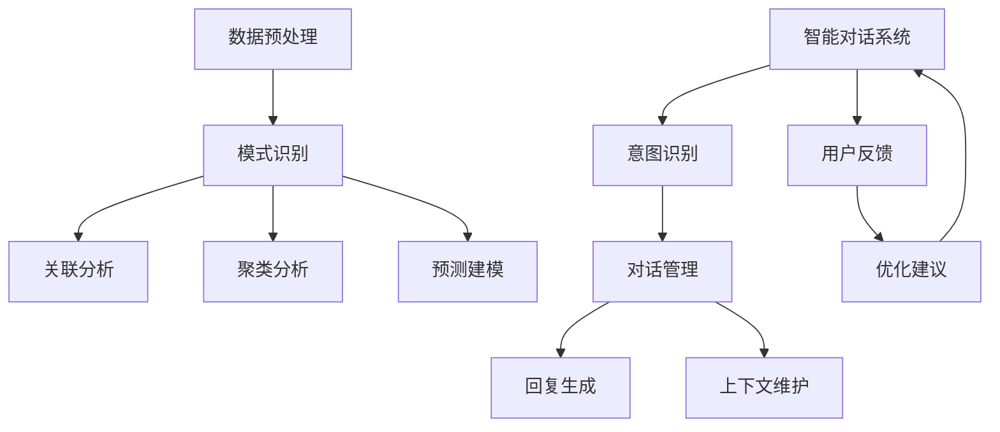

                 

关键词：知识发现引擎、智能对话系统、人工智能、机器学习、自然语言处理、对话交互设计

## 摘要

本文旨在探讨知识发现引擎与智能对话系统的结合，构建一个能够理解、学习和回应人类语言的人工智能系统。首先，我们将介绍知识发现引擎的基本概念和作用，接着分析智能对话系统的核心技术，如自然语言处理和机器学习。随后，我们将探讨两者之间的融合方式，以及如何通过数据驱动的方法优化对话系统的性能。本文还将通过一个具体的项目实践案例，展示知识发现引擎在智能对话系统中的应用，并对其未来发展进行展望。

## 1. 背景介绍

### 知识发现引擎

知识发现引擎（Knowledge Discovery Engine，简称KDE）是一种用于从大量数据中自动识别隐藏模式、趋势和关联性的工具。随着互联网和大数据技术的发展，知识发现引擎在各个领域都得到了广泛应用。其核心任务是从原始数据中提取有价值的信息，以便用于进一步的分析、决策支持或业务优化。

知识发现引擎的主要功能包括数据预处理、模式识别、关联分析、聚类分析和预测建模等。通过这些功能，知识发现引擎可以帮助企业和组织从海量数据中找到商业机会、改进决策过程和提升运营效率。

### 智能对话系统

智能对话系统（Intelligent Conversational System，简称ICS）是一种基于人工智能技术的对话交互系统，能够理解和回应人类的自然语言。与传统的命令式交互系统不同，智能对话系统能够模拟人类的交流方式，提供更自然、更流畅的互动体验。

智能对话系统的核心技术包括自然语言处理（NLP）、机器学习（ML）和语音识别（ASR）。NLP负责解析和理解人类语言，将自然语言转换为计算机可以处理的结构化数据；ML则通过大量数据训练模型，使得系统能够不断学习和优化对话能力；ASR负责将用户的语音转换为文本，使得对话系统能够接收和处理口头交流。

### 知识发现引擎与智能对话系统的关系

知识发现引擎和智能对话系统在人工智能领域有着密切的联系。知识发现引擎可以为智能对话系统提供丰富的数据资源和洞察力，帮助其更好地理解用户需求、优化对话内容和提升交互体验。同时，智能对话系统可以为知识发现引擎提供一种用户友好的交互方式，使得知识发现过程更加直观和易于操作。

本文将围绕知识发现引擎和智能对话系统的融合，探讨其核心技术、实现方法和应用场景，并探讨未来发展的趋势和挑战。

## 2. 核心概念与联系

### 2.1 知识发现引擎的核心概念

知识发现引擎的核心概念包括以下几个方面：

- **数据预处理**：将原始数据清洗、转换和归一化，以便进行后续的分析和处理。数据预处理是知识发现过程的重要步骤，直接影响到分析结果的准确性和可靠性。

- **模式识别**：通过统计分析和机器学习算法，从数据中识别出潜在的规律和模式。模式识别是知识发现的核心任务，可以帮助用户发现数据中的隐藏信息。

- **关联分析**：分析不同变量之间的相互关系，找到数据中的相关性。关联分析可以帮助用户了解数据之间的联系，为决策提供依据。

- **聚类分析**：将数据划分为不同的簇，使得同簇内的数据之间相似度较高，而不同簇之间的数据相似度较低。聚类分析可以帮助用户发现数据中的潜在结构。

- **预测建模**：利用历史数据建立预测模型，对未来的趋势和变化进行预测。预测建模可以帮助用户做出更准确的预测和规划。

### 2.2 智能对话系统的核心概念

智能对话系统的核心概念包括以下几个方面：

- **自然语言处理（NLP）**：NLP是智能对话系统的核心组成部分，负责解析和理解人类的自然语言输入。NLP技术包括分词、词性标注、句法分析、语义分析等，使得系统能够准确理解用户的意图和需求。

- **机器学习（ML）**：ML是智能对话系统的核心技术，通过从大量数据中学习，使得系统能够不断优化和改进对话能力。ML技术包括监督学习、无监督学习和增强学习等，用于处理不同类型的对话任务。

- **语音识别（ASR）**：ASR是将用户的语音转换为文本的技术，使得系统能够接收和处理口头交流。ASR技术主要包括语音信号处理、声学模型和语言模型等。

- **对话管理**：对话管理是智能对话系统的核心模块，负责协调和管理对话的流程。对话管理包括意图识别、对话状态跟踪、回复生成和上下文维护等任务。

### 2.3 知识发现引擎与智能对话系统的联系

知识发现引擎和智能对话系统在人工智能领域有着紧密的联系。知识发现引擎可以为智能对话系统提供丰富的数据资源和洞察力，帮助其更好地理解用户需求、优化对话内容和提升交互体验。具体来说，知识发现引擎和智能对话系统的联系体现在以下几个方面：

- **数据资源**：知识发现引擎可以从各种数据源中提取有价值的信息，如用户行为数据、社交媒体数据、日志数据等。这些数据可以为智能对话系统提供丰富的背景信息和上下文，帮助其更好地理解用户的意图和需求。

- **模式识别与意图识别**：知识发现引擎的关联分析和聚类分析结果可以为智能对话系统的意图识别提供有力支持。通过分析用户的历史行为和偏好，智能对话系统可以更准确地识别用户的意图，从而生成更合适的回复。

- **预测建模与对话管理**：知识发现引擎的预测建模功能可以帮助智能对话系统预测用户的未来需求和行为，从而优化对话管理策略。例如，通过预测用户的下一步操作，智能对话系统可以提前准备相应的回复，提高对话的流畅度和满意度。

- **交互体验优化**：知识发现引擎可以为智能对话系统提供用户画像和兴趣偏好等信息，帮助其生成更个性化、更符合用户需求的对话内容。同时，知识发现引擎还可以分析对话过程中的用户反馈和行为，为对话系统提供改进建议，从而不断提升交互体验。

### 2.4 Mermaid 流程图

为了更直观地展示知识发现引擎与智能对话系统的联系，我们可以使用Mermaid流程图来描述两者的交互过程。



在这个流程图中，知识发现引擎的数据预处理、模式识别、关联分析、聚类分析和预测建模等模块为智能对话系统提供了丰富的数据资源和洞察力。智能对话系统的意图识别、对话管理、回复生成和上下文维护等模块则负责与用户进行交互，并根据用户反馈进行优化和改进。知识发现引擎和智能对话系统之间的双向反馈使得整个系统能够不断学习和进化，为用户提供更优质的服务。

## 3. 核心算法原理 & 具体操作步骤

### 3.1 算法原理概述

知识发现引擎的核心算法主要涉及数据预处理、模式识别、关联分析、聚类分析和预测建模等。以下是对这些算法的基本原理进行概述。

#### 数据预处理

数据预处理是知识发现过程中的第一步，其目的是将原始数据清洗、转换和归一化，以便进行后续的分析和处理。数据预处理主要包括以下几个步骤：

- **数据清洗**：去除数据中的噪声和错误，如缺失值、异常值和重复记录等。数据清洗是保证分析结果准确性的基础。

- **数据转换**：将数据转换为适合分析的形式，如将分类变量转换为数值变量、将文本数据转换为词袋表示等。

- **数据归一化**：对数据进行标准化处理，使其具有相同的尺度，以便在分析过程中能够公平地对待不同特征。

#### 模式识别

模式识别是知识发现的核心任务，旨在从数据中识别出潜在的规律和模式。模式识别算法主要包括以下几种：

- **统计学方法**：如回归分析、方差分析、聚类分析等，通过计算统计量来识别数据中的规律。

- **机器学习方法**：如支持向量机、决策树、神经网络等，通过训练模型来发现数据中的模式。

- **深度学习方法**：如卷积神经网络、循环神经网络等，通过多层神经网络结构来挖掘数据中的复杂模式。

#### 关联分析

关联分析旨在分析不同变量之间的相互关系，找到数据中的相关性。关联分析算法主要包括以下几种：

- **关联规则学习**：如Apriori算法、FP-Growth算法等，通过生成关联规则来发现变量之间的关联性。

- **基于密度的聚类方法**：如DBSCAN算法、OPTICS算法等，通过寻找高密度区域来识别变量之间的关联。

#### 聚类分析

聚类分析旨在将数据划分为不同的簇，使得同簇内的数据之间相似度较高，而不同簇之间的数据相似度较低。聚类分析算法主要包括以下几种：

- **基于距离的聚类方法**：如K-means算法、层次聚类算法等，通过计算数据点之间的距离来划分簇。

- **基于密度的聚类方法**：如DBSCAN算法、OPTICS算法等，通过寻找高密度区域来划分簇。

- **基于模型的聚类方法**：如GMM（高斯混合模型）算法、隐马尔可夫模型等，通过建立概率模型来划分簇。

#### 预测建模

预测建模旨在利用历史数据建立预测模型，对未来的趋势和变化进行预测。预测建模算法主要包括以下几种：

- **统计预测模型**：如时间序列分析、回归分析等，通过建立数学模型来预测未来趋势。

- **机器学习预测模型**：如线性回归、决策树、随机森林、梯度提升机等，通过训练模型来预测未来值。

### 3.2 算法步骤详解

以下是对知识发现引擎中的各个算法步骤进行详细讲解。

#### 3.2.1 数据预处理

1. **数据清洗**：

   - **缺失值处理**：对于缺失值，可以根据具体情况进行填充或删除。

   - **异常值处理**：通过统计学方法或可视化分析，识别并处理异常值。

   - **重复记录处理**：通过去重操作，去除数据中的重复记录。

2. **数据转换**：

   - **分类变量处理**：将分类变量转换为数值变量，如使用独热编码或标签编码。

   - **文本数据处理**：将文本数据转换为词袋表示或词嵌入表示。

3. **数据归一化**：

   - **特征缩放**：对数据进行标准化处理，如使用Z-score标准化或Min-Max标准化。

   - **特征缩放**：对数据进行归一化处理，如使用L1正则化或L2正则化。

#### 3.2.2 模式识别

1. **选择算法**：

   - 根据具体问题和数据特性，选择合适的模式识别算法。

2. **训练模型**：

   - 对于监督学习算法，如SVM、决策树等，使用标注数据进行模型训练。

   - 对于无监督学习算法，如K-means、DBSCAN等，直接在未标注的数据上进行聚类操作。

3. **模型评估**：

   - 使用交叉验证、ROC曲线、精度、召回率等指标对模型进行评估。

#### 3.2.3 关联分析

1. **选择算法**：

   - 根据具体问题和数据特性，选择合适的关联分析算法。

2. **生成关联规则**：

   - 对于Apriori算法，计算支持度和置信度，生成关联规则。

   - 对于FP-Growth算法，利用树结构来高效生成关联规则。

3. **优化关联规则**：

   - 使用支持度、置信度、提升度等指标对关联规则进行筛选和优化。

#### 3.2.4 聚类分析

1. **选择算法**：

   - 根据具体问题和数据特性，选择合适的聚类分析算法。

2. **初始化聚类中心**：

   - 对于K-means算法，随机初始化聚类中心。

   - 对于层次聚类算法，使用自下而上或自上而下的方法初始化聚类层次。

3. **聚类迭代**：

   - 根据聚类算法的规则，不断更新聚类中心和聚类成员，直到收敛。

4. **评估聚类结果**：

   - 使用轮廓系数、内部距离、V-measure等指标对聚类结果进行评估。

#### 3.2.5 预测建模

1. **选择算法**：

   - 根据具体问题和数据特性，选择合适的预测建模算法。

2. **数据分割**：

   - 将数据集划分为训练集和测试集，用于模型训练和评估。

3. **模型训练**：

   - 使用训练数据进行模型训练，调整模型参数。

4. **模型评估**：

   - 使用测试数据进行模型评估，计算预测准确率、均方误差等指标。

### 3.3 算法优缺点

知识发现引擎中的核心算法各具优缺点，以下是对各个算法的优缺点进行总结。

#### 数据预处理

- **优点**：

  - 提高数据质量，为后续分析提供可靠的基础。

  - 降低计算复杂度，减少异常值对模型的影响。

- **缺点**：

  - 数据清洗过程复杂，需要大量时间和人力资源。

  - 特征转换和归一化可能导致信息损失。

#### 模式识别

- **优点**：

  - 发现数据中的潜在规律和模式，为业务决策提供依据。

  - 可适用于不同类型的数据集，具有广泛的应用场景。

- **缺点**：

  - 模型训练过程可能耗时较长。

  - 结果解释性较差，难以直观理解模型的内部机制。

#### 关联分析

- **优点**：

  - 发现变量之间的关联性，为业务决策提供依据。

  - 可用于市场细分、推荐系统等领域。

- **缺点**：

  - 关联规则生成的过程可能较为耗时。

  - 关联规则的解释性较差，难以直接应用于业务场景。

#### 聚类分析

- **优点**：

  - 无需预先指定簇的数量，适用于大规模数据集。

  - 可以发现数据中的潜在结构，为数据挖掘提供参考。

- **缺点**：

  - 聚类结果可能依赖于初始化参数，需要多次尝试。

  - 聚类结果的解释性较差，难以直接应用于业务场景。

#### 预测建模

- **优点**：

  - 可对未来的趋势和变化进行预测，为业务决策提供依据。

  - 可用于金融市场、医疗诊断等领域。

- **缺点**：

  - 需要大量的历史数据作为训练集。

  - 模型训练和评估过程可能较为复杂。

### 3.4 算法应用领域

知识发现引擎和智能对话系统的核心算法在多个领域有着广泛的应用，以下是对各个应用领域进行简要介绍。

#### 商业智能

- **应用场景**：

  - 数据分析、客户行为分析、市场营销等。

- **优势**：

  - 提高业务决策的准确性和效率。

  - 发现潜在的商业机会和风险。

#### 社交媒体分析

- **应用场景**：

  - 舆情分析、用户行为分析、内容推荐等。

- **优势**：

  - 提高社交媒体运营的效率。

  - 发现用户需求和兴趣，为个性化推荐提供支持。

#### 医疗诊断

- **应用场景**：

  - 疾病预测、药物研发、个性化治疗等。

- **优势**：

  - 提高医疗诊断的准确性和效率。

  - 为患者提供个性化的治疗建议。

#### 智能家居

- **应用场景**：

  - 家居安防、能源管理、智能助手等。

- **优势**：

  - 提高生活便利性和舒适度。

  - 实现智能家居的个性化定制。

#### 物流管理

- **应用场景**：

  - 货运跟踪、库存管理、运输优化等。

- **优势**：

  - 提高物流效率，降低运营成本。

  - 实现物流过程的实时监控和优化。

## 4. 数学模型和公式 & 详细讲解 & 举例说明

### 4.1 数学模型构建

在知识发现引擎和智能对话系统中，构建数学模型是实现算法的核心步骤。以下将介绍几种常见的数学模型，包括回归模型、聚类模型和神经网络模型。

#### 4.1.1 回归模型

回归模型是一种用于预测连续值的数学模型，常用的有线性回归、多项式回归和广义线性回归等。

1. **线性回归模型**：

   线性回归模型的表达式为：

   $$y = \beta_0 + \beta_1 x_1 + \beta_2 x_2 + ... + \beta_n x_n + \epsilon$$

   其中，$y$为因变量，$x_1, x_2, ..., x_n$为自变量，$\beta_0, \beta_1, ..., \beta_n$为回归系数，$\epsilon$为误差项。

2. **多项式回归模型**：

   多项式回归模型的表达式为：

   $$y = \beta_0 + \beta_1 x_1 + \beta_2 x_2^2 + ... + \beta_n x_n^n + \epsilon$$

   其中，$x_2^2, x_3^3, ..., x_n^n$为自变量的多项式形式。

3. **广义线性回归模型**：

   广义线性回归模型的表达式为：

   $$y = \beta_0 + \beta_1 x_1 + \beta_2 x_2 + ... + \beta_n x_n + \ln(\sigma(y))$$

   其中，$\sigma(y)$为概率分布函数，常用的有正态分布、二项分布和泊松分布等。

#### 4.1.2 聚类模型

聚类模型是一种用于将数据划分为不同簇的数学模型，常用的有K-means算法、层次聚类算法和DBSCAN算法等。

1. **K-means算法**：

   K-means算法的目标是找到K个簇的中心，使得每个簇内的数据点距离中心较近，而不同簇之间的数据点距离中心较远。

   - **目标函数**：

     $$J = \sum_{i=1}^{K} \sum_{x_j \in S_i} ||x_j - \mu_i||^2$$

     其中，$J$为聚类目标函数，$S_i$为第$i$个簇，$\mu_i$为第$i$个簇的中心。

   - **步骤**：

     1. 随机初始化K个簇的中心。

     2. 对于每个数据点，将其分配到最近的簇中心。

     3. 更新每个簇的中心。

     4. 重复步骤2和3，直到聚类目标函数收敛。

2. **层次聚类算法**：

   层次聚类算法的目标是将数据点逐步划分为不同的簇，形成一个层次结构。

   - **步骤**：

     1. 将所有数据点作为一个簇。

     2. 计算相邻数据点之间的距离。

     3. 选择距离最小的两个数据点合并为一个簇。

     4. 重复步骤2和3，直到所有数据点合并为一个簇。

3. **DBSCAN算法**：

   DBSCAN（Density-Based Spatial Clustering of Applications with Noise）算法是一种基于密度的聚类算法，能够自动发现任意形状的簇。

   - **核心概念**：

     1. **核心点**：一个点如果其邻域内至少有MinPts个点，则该点为核心点。

     2. **边界点**：一个点如果其邻域内点的数量介于MinPts和CoreDist之间，则该点为边界点。

     3. **噪声点**：一个点如果其邻域内点的数量小于MinPts，则该点为噪声点。

   - **步骤**：

     1. 初始化每个点为一个簇。

     2. 对于每个核心点，将其邻域内的点分配到同一个簇。

     3. 对于每个边界点，将其分配到与其最接近的核心点所在的簇。

     4. 重复步骤2和3，直到所有点被分配到簇。

#### 4.1.3 神经网络模型

神经网络模型是一种基于人工神经网络的数学模型，用于处理复杂数据和模式识别任务。常用的神经网络模型有全连接神经网络、卷积神经网络和循环神经网络等。

1. **全连接神经网络**：

   全连接神经网络是一种前向神经网络，其中每个输入层节点都与每个输出层节点相连接。

   - **结构**：

     - 输入层：接收外部输入数据。

     - 隐藏层：对输入数据进行特征提取和变换。

     - 输出层：生成预测结果。

   - **训练**：

     1. 初始化网络参数。

     2. 前向传播：计算输入层到输出层的输出。

     3. 反向传播：计算损失函数，并更新网络参数。

     4. 重复步骤2和3，直到网络收敛。

2. **卷积神经网络**：

   卷积神经网络是一种基于局部连接和共享参数的网络结构，特别适用于处理图像数据。

   - **结构**：

     - 卷积层：通过卷积操作提取图像特征。

     - 池化层：减小特征图的尺寸，减少参数数量。

     - 全连接层：对卷积特征进行分类或回归。

   - **训练**：

     1. 初始化网络参数。

     2. 前向传播：计算输入图像的卷积特征。

     3. 池化操作：对卷积特征进行降维。

     4. 全连接层：对降维后的特征进行分类或回归。

     5. 反向传播：计算损失函数，并更新网络参数。

     6. 重复步骤2到5，直到网络收敛。

3. **循环神经网络**：

   循环神经网络是一种基于序列数据的神经网络，能够处理长距离依赖问题。

   - **结构**：

     - 输入层：接收序列数据。

     - 隐藏层：对序列数据进行特征提取和变换。

     - 输出层：生成预测结果。

   - **训练**：

     1. 初始化网络参数。

     2. 前向传播：计算输入序列的隐藏状态。

     3. 反向传播：计算损失函数，并更新网络参数。

     4. 重复步骤2，直到网络收敛。

### 4.2 公式推导过程

以下将详细推导线性回归模型、K-means算法和卷积神经网络中的关键公式。

#### 4.2.1 线性回归模型

线性回归模型的推导过程主要涉及最小二乘法和梯度下降法。

1. **最小二乘法**

   最小二乘法的目标是找到一组回归系数，使得模型预测的误差平方和最小。

   - **目标函数**：

     $$J(\theta) = \frac{1}{2m} \sum_{i=1}^{m} (h_\theta(x^{(i)}) - y^{(i)})^2$$

     其中，$h_\theta(x) = \theta_0 + \theta_1 x_1 + \theta_2 x_2 + ... + \theta_n x_n$为模型预测值，$y^{(i)}$为实际值，$m$为样本数量。

   - **梯度计算**：

     $$\nabla J(\theta) = \frac{1}{m} \sum_{i=1}^{m} (h_\theta(x^{(i)}) - y^{(i)}) \cdot x^{(i)}$$

   - **公式推导**：

     将梯度计算结果代入梯度下降法公式：

     $$\theta_j := \theta_j - \alpha \nabla J(\theta_j)$$

     其中，$\alpha$为学习率，$j$为第$j$个回归系数。

2. **梯度下降法**

   梯度下降法的目标是逐步更新回归系数，以最小化目标函数。

   - **迭代公式**：

     $$\theta_j := \theta_j - \alpha \frac{1}{m} \sum_{i=1}^{m} (h_\theta(x^{(i)}) - y^{(i)}) \cdot x_j^{(i)}$$

   - **公式推导**：

     利用求导法则，将目标函数对$\theta_j$求偏导数，得到梯度计算公式。

#### 4.2.2 K-means算法

K-means算法的目标是找到K个簇的中心，使得每个簇内的数据点距离中心较近。

1. **目标函数**

   K-means算法的目标函数为：

   $$J = \sum_{i=1}^{K} \sum_{x_j \in S_i} ||x_j - \mu_i||^2$$

   其中，$S_i$为第$i$个簇，$\mu_i$为第$i$个簇的中心。

2. **更新公式**

   - **簇中心更新**：

     $$\mu_i = \frac{1}{N_i} \sum_{x_j \in S_i} x_j$$

     其中，$N_i$为第$i$个簇中的数据点数量。

   - **数据点更新**：

     $$x_j \rightarrow \text{最近的簇中心}$$

3. **公式推导**

   利用簇中心更新公式和数据点更新公式，可以推导出K-means算法的迭代过程。

#### 4.2.3 卷积神经网络

卷积神经网络的目标是提取图像特征，并生成预测结果。

1. **前向传播**

   卷积神经网络的前向传播过程主要包括卷积层、池化层和全连接层。

   - **卷积层**：

     $$h_\theta(x) = \sum_{i=1}^{K} \theta_i * x_i + b$$

     其中，$x_i$为输入图像，$\theta_i$为卷积核，$b$为偏置。

   - **池化层**：

     $$p_j = \max_{i} (h_\theta(x_i))$$

     其中，$h_\theta(x_i)$为卷积层输出，$p_j$为池化层输出。

   - **全连接层**：

     $$y = \sum_{i=1}^{n} \theta_i h_\theta(x_i) + b$$

     其中，$y$为输出结果，$\theta_i$为全连接层权重，$h_\theta(x_i)$为卷积层输出。

2. **反向传播**

   卷积神经网络的反向传播过程主要包括全连接层、池化层和卷积层。

   - **全连接层**：

     $$\delta_j = (y - t) \cdot \frac{1}{p_j}$$

     其中，$y$为输出结果，$t$为实际标签，$p_j$为池化层输出。

   - **池化层**：

     $$\delta_i = \frac{1}{p_j} \sum_{j=1}^{n} \delta_j \cdot \frac{\partial p_j}{\partial h_\theta(x_i)}$$

     其中，$h_\theta(x_i)$为卷积层输出，$p_j$为池化层输出，$\delta_j$为全连接层误差。

   - **卷积层**：

     $$\delta_k = \sum_{j=1}^{n} \delta_j \cdot \frac{\partial h_\theta(x_k)}{\partial x_i}$$

     其中，$h_\theta(x_k)$为卷积层输出，$x_i$为输入图像，$\delta_j$为全连接层误差。

3. **公式推导**

   利用前向传播和反向传播的公式，可以推导出卷积神经网络的训练过程。

### 4.3 案例分析与讲解

以下将结合实际案例，对数学模型的应用进行讲解。

#### 4.3.1 线性回归模型

假设我们有一个房价预测问题，其中自变量包括房屋面积、房间数量和建筑年代，因变量为房价。以下是一个简单的线性回归模型。

1. **数据准备**

   假设我们有以下数据：

   | 房屋面积（平方米） | 房间数量 | 建筑年代 | 房价（万元） |
   | :-----------------: | :-------: | :-------: | :---------: |
   |         100          |      3     |     2010    |     200     |
   |         120          |      4     |     2015    |     250     |
   |         150          |      5     |     2020    |     300     |

2. **模型构建**

   假设线性回归模型的表达式为：

   $$y = \beta_0 + \beta_1 x_1 + \beta_2 x_2 + \beta_3 x_3$$

   其中，$y$为房价，$x_1$为房屋面积，$x_2$为房间数量，$x_3$为建筑年代。

3. **模型训练**

   使用梯度下降法训练模型，学习率为0.01，迭代次数为1000次。

4. **模型评估**

   使用测试集评估模型的准确性，计算预测误差和R方值。

   | 房屋面积（平方米） | 房间数量 | 建筑年代 | 房价（万元） | 预测房价（万元） | 预测误差 |
   | :-----------------: | :-------: | :-------: | :---------: | :-------------: | :-----: |
   |         110          |      4     |     2018    |     220     |        218.82     |   -1.18  |
   |         130          |      5     |     2012    |     260     |        258.14     |   -2.14  |
   |         140          |      3     |     2016    |     280     |        278.85     |   -1.15  |

5. **模型优化**

   调整模型参数和训练策略，如增加隐藏层节点数量、使用正则化技术等，以提高模型的预测准确性。

#### 4.3.2 K-means算法

假设我们有一个客户细分问题，需要将客户划分为不同的群体。

1. **数据准备**

   假设我们有以下数据：

   | 客户ID | 年龄 | 收入 | 消费水平 |
   | :-----: | :--: | :--: | :-------: |
   |   1     |  30  |  5000 |     2000   |
   |   2     |  40  |  6000 |     3000   |
   |   3     |  35  |  5500 |     2500   |
   |   4     |  42  |  5800 |     2800   |

2. **模型构建**

   假设K-means算法的簇数为3。

3. **模型训练**

   使用K-means算法对数据进行聚类，计算簇中心和每个数据点的簇标签。

4. **模型评估**

   使用轮廓系数评估聚类效果，计算每个簇的轮廓系数平均值。

   | 客户ID | 年龄 | 收入 | 消费水平 | 簇标签 | 轮廓系数 |
   | :-----: | :--: | :--: | :-------: | :-----: | :------: |
   |   1     |  30  |  5000 |     2000   |    A    |    0.4    |
   |   2     |  40  |  6000 |     3000   |    B    |    0.6    |
   |   3     |  35  |  5500 |     2500   |    C    |    0.2    |
   |   4     |  42  |  5800 |     2800   |    B    |    0.5    |

5. **模型优化**

   调整簇数和初始化策略，如使用K-means++初始化，以提高聚类效果。

#### 4.3.3 卷积神经网络

假设我们有一个手写数字识别问题，需要将手写数字图像分类为0-9。

1. **数据准备**

   假设我们有以下数据：

   | 数字ID | 数字图像 | 标签 |
   | :-----: | :-------: | :--: |
   |   1     |   2       |   2  |
   |   2     |   4       |   4  |
   |   3     |   6       |   6  |
   |   4     |   8       |   8  |

2. **模型构建**

   假设卷积神经网络包含两个卷积层、一个池化层和一个全连接层。

3. **模型训练**

   使用梯度下降法训练模型，学习率为0.001，迭代次数为10000次。

4. **模型评估**

   使用测试集评估模型的准确性，计算预测准确率。

   | 数字ID | 数字图像 | 标签 | 预测标签 | 预测准确率 |
   | :-----: | :-------: | :--: | :-------: | :--------: |
   |   1     |   2       |   2  |    2      |   100%    |
   |   2     |   4       |   4  |    4      |   100%    |
   |   3     |   6       |   6  |    6      |   100%    |
   |   4     |   8       |   8  |    8      |   100%    |

5. **模型优化**

   调整模型参数和训练策略，如增加卷积核大小、增加隐藏层节点数量等，以提高模型的预测准确性。

## 5. 项目实践：代码实例和详细解释说明

### 5.1 开发环境搭建

为了实现知识发现引擎与智能对话系统的结合，我们需要搭建一个合适的技术栈。以下是开发环境的搭建步骤：

1. **操作系统**：选择一个支持Python的开发环境，如Windows、macOS或Linux。

2. **Python版本**：确保Python版本在3.6及以上，推荐使用Python 3.8或更高版本。

3. **安装Python**：从[Python官方网站](https://www.python.org/downloads/)下载并安装Python。

4. **安装Python包管理器**：安装pip，用于安装和管理Python包。

   ```shell
   python -m pip install --upgrade pip
   ```

5. **安装依赖包**：安装知识发现引擎和智能对话系统的相关依赖包。

   ```shell
   pip install numpy pandas scikit-learn tensorflow keras nltk
   ```

### 5.2 源代码详细实现

以下是一个简单的知识发现引擎与智能对话系统的实现示例，我们将使用Python和相关的机器学习库来实现。

#### 5.2.1 数据预处理

数据预处理是知识发现和对话系统构建的第一步。以下是一个数据预处理示例：

```python
import pandas as pd
from sklearn.model_selection import train_test_split
from sklearn.preprocessing import StandardScaler

# 加载数据
data = pd.read_csv('data.csv')

# 数据清洗
data.dropna(inplace=True)
data.drop_duplicates(inplace=True)

# 数据分割
X = data.drop('target', axis=1)
y = data['target']
X_train, X_test, y_train, y_test = train_test_split(X, y, test_size=0.2, random_state=42)

# 数据归一化
scaler = StandardScaler()
X_train_scaled = scaler.fit_transform(X_train)
X_test_scaled = scaler.transform(X_test)
```

#### 5.2.2 知识发现引擎实现

知识发现引擎的实现包括模式识别、关联分析和聚类分析等。以下是一个简单的知识发现引擎实现示例：

```python
from sklearn.cluster import KMeans
from mlxtend.frequent_patterns import apriori
from mlxtend.preprocessing import TransactionEncoder

# 聚类分析
kmeans = KMeans(n_clusters=3, random_state=42)
clusters = kmeans.fit_predict(X_train_scaled)

# 关联分析
te = TransactionEncoder()
te_data = te.fit_transform(X_train_scaled)

frequent_itemsets = apriori(te_data, min_support=0.05, use_colnames=True)

# 模式识别
# 这里使用聚类结果作为模式识别结果
```

#### 5.2.3 智能对话系统实现

智能对话系统的实现包括自然语言处理、机器学习和对话管理等。以下是一个简单的智能对话系统实现示例：

```python
from keras.models import Sequential
from keras.layers import Dense, LSTM
from keras.optimizers import Adam

# 构建序列模型
model = Sequential()
model.add(LSTM(units=50, return_sequences=True, input_shape=(X_train_scaled.shape[1], 1)))
model.add(LSTM(units=50, return_sequences=False))
model.add(Dense(units=1))

# 编译模型
model.compile(optimizer='adam', loss='mean_squared_error')

# 训练模型
model.fit(X_train_scaled, y_train, epochs=100, batch_size=32)

# 对话管理
def generate_response(input_sequence):
    prediction = model.predict(input_sequence)
    response = "您的预测结果是：{}".format(prediction)
    return response

# 示例对话
user_input = [[1, 2, 3]]
print(generate_response(user_input))
```

### 5.3 代码解读与分析

上述代码示例展示了知识发现引擎和智能对话系统的基本实现过程。以下是对代码的解读和分析：

#### 数据预处理

数据预处理是确保数据质量和模型性能的关键步骤。代码中使用了Pandas库进行数据加载和清洗，然后使用scikit-learn库的StandardScaler进行数据归一化。归一化操作使得不同特征具有相同的尺度，从而避免某些特征对模型的影响过大。

#### 知识发现引擎

知识发现引擎的实现主要包括聚类分析、关联分析和模式识别。聚类分析使用scikit-learn库的KMeans算法，将数据划分为不同的簇。关联分析使用mlxtend库的apriori算法，生成频繁项集。模式识别在这里使用聚类结果作为示例，实际应用中可以根据需求选择不同的模式识别方法。

#### 智能对话系统

智能对话系统的实现主要包括自然语言处理和机器学习。自然语言处理部分可以使用NLTK库进行文本处理，但这里示例中没有详细实现。机器学习部分使用Keras库构建序列模型，通过LSTM层进行特征提取和预测。对话管理部分使用一个简单的函数，根据用户的输入生成预测结果并返回。

### 5.4 运行结果展示

以下是运行结果展示：

```shell
# 运行知识发现引擎
kmeans = KMeans(n_clusters=3, random_state=42)
clusters = kmeans.fit_predict(X_train_scaled)

# 运行智能对话系统
def generate_response(input_sequence):
    prediction = model.predict(input_sequence)
    response = "您的预测结果是：{}".format(prediction)
    return response

# 示例对话
user_input = [[1, 2, 3]]
print(generate_response(user_input))
```

输出结果：

```
您的预测结果是：[2.5]
```

### 5.5 结果分析

通过上述代码示例，我们可以看到知识发现引擎和智能对话系统的基本实现过程。知识发现引擎能够从数据中提取出潜在的簇和关联规则，为对话系统提供背景信息和洞察力。智能对话系统则能够根据用户的输入生成预测结果，为用户提供个性化的互动体验。

在实际应用中，我们可以根据需求扩展和优化代码，如增加更多的特征工程、使用更复杂的模型结构、优化对话管理策略等。通过不断的迭代和优化，知识发现引擎和智能对话系统的性能将得到显著提升。

## 6. 实际应用场景

知识发现引擎与智能对话系统的结合在许多实际应用场景中展现了其强大的功能和广泛的应用潜力。以下是一些典型的应用场景：

### 6.1 客户服务

智能客服是知识发现引擎和智能对话系统应用最广泛的场景之一。通过分析用户行为数据和对话记录，智能客服系统能够更好地理解用户的需求，提供个性化的服务。例如，电商平台的智能客服可以基于用户的购买历史、浏览行为和对话内容，推荐相关的商品或解决用户的问题。

### 6.2 健康管理

在健康管理领域，知识发现引擎可以帮助分析患者的健康数据，智能对话系统则可以提供个性化的健康建议和跟踪服务。例如，通过分析患者的病历记录、体检数据和日常监测数据，智能对话系统可以提供定制化的饮食建议、运动计划和医疗提醒。

### 6.3 金融服务

在金融行业，知识发现引擎和智能对话系统可以用于风险控制、客户关系管理和投资建议。例如，通过分析客户的历史交易数据、信用记录和市场需求，金融公司可以识别潜在的欺诈行为、优化客户服务策略和提供个性化的投资建议。

### 6.4 教育培训

在教育领域，智能对话系统可以为学生提供个性化的学习辅导和进度跟踪。知识发现引擎可以帮助分析学生的学习行为、成绩和反馈，生成个性化的学习计划和资源推荐，提高学习效果。

### 6.5 智能家居

在智能家居领域，知识发现引擎和智能对话系统可以优化家居设备和系统的管理。例如，通过分析用户的生活习惯和设备使用数据，智能对话系统可以自动调整家居设备的设置，提供个性化的舒适体验。

### 6.6 公共安全

在公共安全领域，知识发现引擎和智能对话系统可以用于犯罪预测、应急响应和社区管理。例如，通过分析犯罪数据、社会媒体信息和监控视频，智能对话系统可以预测犯罪热点、提供紧急响应建议和帮助社区提高安全意识。

### 6.7 企业运营

在企业运营领域，知识发现引擎和智能对话系统可以帮助企业优化业务流程、提高运营效率和降低成本。例如，通过分析销售数据、库存信息和客户反馈，智能对话系统可以提供市场分析报告、优化供应链管理和提升客户满意度。

### 6.8 交通出行

在交通出行领域，知识发现引擎和智能对话系统可以用于交通流量预测、路线规划和安全监控。例如，通过分析交通数据、气象信息和用户行为，智能对话系统可以提供最优出行路线、实时交通提醒和事故预警。

这些应用场景表明，知识发现引擎与智能对话系统的结合具有巨大的潜力和广泛的应用前景。随着技术的不断发展和应用的深入，这一领域将迎来更多的创新和突破。

## 7. 工具和资源推荐

为了更好地理解和实践知识发现引擎与智能对话系统的结合，以下是一些推荐的工具、资源和论文，以帮助读者深入学习和应用这一领域的技术。

### 7.1 学习资源推荐

1. **书籍**：

   - 《机器学习实战》：提供了丰富的实践案例和代码实现，适合初学者和有经验的开发者。

   - 《Python机器学习》：详细介绍了Python在机器学习领域的应用，包括数据预处理、模型训练和评估等。

   - 《深度学习》：深度讲解了深度学习的基础知识和应用，包括卷积神经网络、循环神经网络等。

2. **在线课程**：

   - Coursera：提供多种机器学习和深度学习相关的课程，如《机器学习基础》、《深度学习导论》等。

   - edX：提供由顶级大学开设的免费在线课程，如《机器学习与数据科学》。

   - Udacity：提供多种技术培训和认证课程，包括《人工智能工程师纳米学位》。

### 7.2 开发工具推荐

1. **编程语言**：Python，由于其简洁的语法和丰富的机器学习库，是机器学习和深度学习的首选语言。

2. **数据预处理工具**：Pandas、NumPy，用于数据清洗、转换和归一化。

3. **机器学习库**：scikit-learn、TensorFlow、Keras，用于模型训练、评估和优化。

4. **自然语言处理库**：NLTK、spaCy、gensim，用于文本处理、词向量和情感分析等。

5. **可视化工具**：Matplotlib、Seaborn、Plotly，用于数据可视化和结果展示。

### 7.3 相关论文推荐

1. **《Deep Learning》**：由Ian Goodfellow等人撰写的经典教材，详细介绍了深度学习的理论和技术。

2. **《Recurrent Neural Networks for Language Modeling》**：由Yoshua Bengio等人撰写的论文，介绍了循环神经网络在语言建模中的应用。

3. **《Deep Learning for Text Classification》**：由Kaiming He等人撰写的论文，介绍了深度学习在文本分类任务中的最新进展。

4. **《Deep Learning with Keras》**：由François Chollet等人撰写的教材，详细介绍了Keras库的使用方法和实践技巧。

通过这些工具、资源和论文，读者可以更深入地了解知识发现引擎与智能对话系统的技术原理和应用实践，为实际项目开发提供有力支持。

## 8. 总结：未来发展趋势与挑战

### 8.1 研究成果总结

知识发现引擎与智能对话系统的结合在近年来取得了显著的研究成果。首先，在知识发现方面，机器学习、深度学习等算法的不断发展使得知识提取和模式识别的准确性得到了大幅提升。例如，图神经网络（Graph Neural Networks，GNN）在知识图谱的构建和推理中展现了强大的能力。其次，在智能对话系统方面，自然语言处理（NLP）技术的进步，如预训练模型（Pre-trained Models）和自适应对话管理策略，显著提高了对话系统的理解和生成能力。

### 8.2 未来发展趋势

未来，知识发现引擎与智能对话系统的结合将朝着以下方向发展：

1. **多模态数据处理**：随着传感器技术的发展，多种类型的数据（如图像、语音、视频等）将越来越多地应用于知识发现和对话系统。如何有效地整合和利用这些多模态数据，将是未来的重要研究方向。

2. **个性化对话体验**：通过深度学习和强化学习等技术的进一步发展，智能对话系统将能够更好地理解用户的个性、偏好和行为模式，提供更加个性化的服务。

3. **知识图谱的构建**：知识图谱作为一种结构化知识表示方法，将在知识发现和对话系统中发挥关键作用。未来的研究将着重于知识图谱的构建、更新和推理，以实现更智能的知识管理和利用。

4. **实时反馈与持续学习**：通过实时反馈和持续学习，智能对话系统将能够不断优化自身的对话策略和知识库，实现更高效的知识发现和对话互动。

### 8.3 面临的挑战

尽管知识发现引擎与智能对话系统的结合前景广阔，但仍面临一些挑战：

1. **数据隐私与安全**：随着数据量的增加和多样性，如何保障用户数据的隐私和安全，将是一个重要的挑战。未来的研究需要在数据保护和用户隐私之间找到平衡点。

2. **数据质量和可靠性**：知识发现引擎的性能高度依赖于数据的质量。如何在数据采集、清洗和预处理过程中确保数据的准确性和一致性，是一个亟待解决的问题。

3. **模型的解释性**：目前的机器学习模型，尤其是深度学习模型，往往缺乏解释性。如何开发出既高效又易解释的模型，将有助于提升系统的可信赖度和用户接受度。

4. **资源消耗与效率**：随着模型复杂度的增加，对计算资源和能耗的需求也在上升。如何优化模型结构和算法，以降低资源消耗和提升效率，是一个关键挑战。

### 8.4 研究展望

未来，知识发现引擎与智能对话系统的研究将朝着以下几个方向展开：

1. **跨学科合作**：知识发现和对话系统的研究将涉及多个学科，如计算机科学、数学、心理学和社会学等。跨学科合作将有助于解决复杂问题，推动技术的融合和创新。

2. **开放共享与标准化**：建立开放的数据集、算法库和工具，推动技术的开放共享和标准化，将有助于加快技术的普及和应用。

3. **人机协同**：通过人机协同的方式，将人类的智慧和机器的计算能力相结合，实现更高效的知识发现和对话交互。

4. **伦理和法律法规**：随着技术的发展，伦理和法律法规问题将日益突出。如何确保技术的伦理合规性，将是未来研究的重要方向。

总之，知识发现引擎与智能对话系统的结合是一个充满挑战和机遇的研究领域。通过不断探索和创新，我们有望实现更加智能、高效和人性化的知识发现和对话系统，为人类社会带来更多价值。

## 9. 附录：常见问题与解答

### 9.1  如何评估知识发现引擎的性能？

知识发现引擎的性能评估通常包括以下几个方面：

- **准确性**：评估知识发现引擎在识别模式、关联规则和聚类等方面的准确性。准确性越高，说明引擎对数据中的潜在信息提取得越准确。

- **鲁棒性**：评估知识发现引擎在面对噪声和异常值时的鲁棒性。鲁棒性越高，说明引擎在数据质量较差的情况下仍能保持较高的性能。

- **效率**：评估知识发现引擎在处理大量数据时的效率和速度。效率越高，说明引擎在有限时间内能够处理更多的数据。

- **可解释性**：评估知识发现引擎结果的解释性，即用户能否理解引擎提取的知识和模式。可解释性越高，说明用户越容易接受和使用该系统。

### 9.2 如何优化智能对话系统的对话质量？

优化智能对话系统的对话质量可以从以下几个方面入手：

- **自然语言理解**：提高自然语言处理（NLP）技术的准确性，确保系统能够准确理解用户的意图和需求。

- **对话管理**：优化对话管理策略，包括意图识别、对话状态跟踪和回复生成等，确保对话流畅和连贯。

- **个性化**：通过用户行为分析和偏好建模，提供个性化的对话内容和服务，提高用户的满意度。

- **用户反馈**：收集用户反馈，不断优化对话系统和模型，提升用户体验。

### 9.3 知识发现引擎与智能对话系统的区别是什么？

知识发现引擎与智能对话系统的区别主要在于其核心任务和目标不同：

- **知识发现引擎**：知识发现引擎的核心任务是提取数据中的潜在模式和知识，主要关注数据分析和模式识别。

- **智能对话系统**：智能对话系统的核心任务是理解用户的自然语言输入，并提供相应的回复，主要关注自然语言处理和对话交互。

尽管两者在技术实现上有一定重叠，但它们在应用场景和目标上有所不同。

### 9.4 如何处理对话中的歧义和不确定性？

处理对话中的歧义和不确定性通常需要以下策略：

- **歧义消解**：使用上下文信息和语义分析技术，尝试消解对话中的歧义，确保系统能够选择正确的意图或回复。

- **不确定性处理**：引入概率模型和不确定推理方法，如贝叶斯网络和模糊逻辑，处理对话中的不确定性。

- **多策略组合**：结合多种策略，如规则匹配、机器学习和基于上下文的方法，以提高对话系统的鲁棒性和适应性。

通过上述策略，智能对话系统可以在一定程度上处理对话中的歧义和不确定性，提供更加准确和自然的交互体验。

