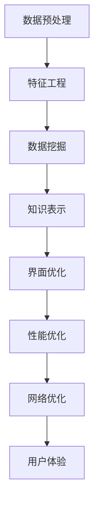

                 

在当今的数字化时代，知识发现引擎作为企业级数据分析和决策支持系统的重要组成部分，正日益受到广泛关注。随着智能手机和平板电脑的普及，移动端用户对知识发现引擎的需求也在不断增长。然而，移动端的硬件限制和用户交互方式的特殊性，使得知识发现引擎在移动端的适配与优化成为一个不可忽视的重要课题。本文旨在探讨知识发现引擎在移动端适配与优化的方法、策略和最佳实践，以期为相关领域的研究人员和开发者提供有价值的参考。

> 关键词：知识发现引擎，移动端适配，优化策略，用户体验

> 摘要：本文首先介绍了知识发现引擎的基本概念和作用，随后分析了移动端适配和优化的必要性，并详细探讨了移动端适配与优化的核心技术。接着，通过具体的案例，展示了适配与优化在实际开发中的应用，并对其效果进行了评估。最后，本文对未来的发展趋势和挑战进行了展望，提出了相应的解决方案和优化方向。

## 1. 背景介绍

知识发现引擎是一种通过数据分析、机器学习和数据挖掘技术，从大量数据中自动提取有价值模式和知识的信息系统。它广泛应用于金融、医疗、电商、制造等多个行业，帮助企业从海量数据中挖掘潜在的商业价值和运营优化点。随着移动设备的普及，越来越多的用户希望通过移动端获取知识发现引擎的服务。

移动端用户的特点在于他们通常需要快速、便捷地获取信息，对系统性能和用户体验有较高的要求。然而，移动设备的硬件资源相对有限，网络带宽和数据传输速度也受到一定限制。这些因素都给知识发现引擎的移动端适配与优化带来了挑战。因此，如何确保知识发现引擎在移动端的高性能和良好用户体验，成为当前研究的热点问题。

## 2. 核心概念与联系

### 2.1 知识发现引擎的核心概念

知识发现引擎主要涉及以下几个核心概念：

1. **数据预处理**：通过清洗、归一化、转换等操作，将原始数据转化为适合分析的形式。
2. **特征工程**：从原始数据中提取有代表性的特征，用于后续的建模和分析。
3. **数据挖掘算法**：包括聚类、分类、关联规则挖掘等，用于发现数据中的隐藏模式和关系。
4. **知识表示与可视化**：将挖掘出的知识以图表、报表等形式呈现给用户。

### 2.2 移动端适配与优化的联系

移动端适配与优化涉及以下几个方面：

1. **界面优化**：针对移动设备的屏幕尺寸和交互特点，设计简洁、直观的界面。
2. **性能优化**：通过代码优化、资源压缩等技术，提高系统的响应速度和稳定性。
3. **网络优化**：利用缓存、数据压缩等技术，优化数据传输效率和用户体验。
4. **用户体验**：充分考虑用户的使用习惯和心理需求，提供个性化、友好的服务。

### 2.3 Mermaid 流程图

以下是一个简单的 Mermaid 流程图，展示了知识发现引擎在移动端适配与优化的主要步骤：



## 3. 核心算法原理 & 具体操作步骤

### 3.1 算法原理概述

知识发现引擎在移动端的适配与优化主要依赖于以下核心算法：

1. **代码优化**：包括算法优化、代码压缩和高效数据结构选择等。
2. **资源压缩**：对图片、音频、视频等资源进行压缩，减少数据传输量。
3. **缓存技术**：利用缓存技术，减少数据重复传输，提高响应速度。
4. **网络传输优化**：包括数据压缩、网络协议优化等，提高数据传输效率。

### 3.2 算法步骤详解

#### 3.2.1 代码优化

1. **算法优化**：选择适合移动端硬件特性的高效算法，如分布式计算、并行处理等。
2. **代码压缩**：使用代码压缩工具，减小代码体积，提高加载速度。
3. **高效数据结构选择**：选择适合移动端内存限制的高效数据结构，如哈希表、堆等。

#### 3.2.2 资源压缩

1. **图片压缩**：采用如 WebP、JPEG 2000 等高效图片格式，减少图片数据量。
2. **音频、视频压缩**：使用高效编码格式，如 AAC、H.264，减少音频、视频数据量。
3. **资源打包**：将多个资源文件打包成一个文件，减少文件数量，提高加载速度。

#### 3.2.3 缓存技术

1. **浏览器缓存**：利用浏览器缓存，减少重复数据的传输。
2. **本地缓存**：将常用的数据和资源缓存到本地，提高访问速度。
3. **内存缓存**：利用内存缓存，减少内存消耗，提高系统性能。

#### 3.2.4 网络传输优化

1. **数据压缩**：采用数据压缩技术，减少数据传输量，提高传输效率。
2. **网络协议优化**：采用高效的网络协议，如 HTTP/2、QUIC，提高数据传输速度。
3. **CDN 技术应用**：使用 CDN（内容分发网络），提高数据传输速度和稳定性。

### 3.3 算法优缺点

#### 3.3.1 优点

1. **提高性能**：通过代码优化、资源压缩等技术，显著提高系统性能和响应速度。
2. **降低成本**：通过缓存技术、数据压缩等技术，降低网络带宽和数据传输成本。
3. **提高用户体验**：通过界面优化、网络传输优化等技术，提供更佳的用户体验。

#### 3.3.2 缺点

1. **开发难度较大**：适配和优化工作需要大量技术积累和经验，开发难度较大。
2. **资源消耗较大**：某些优化技术（如代码优化、资源压缩等）可能会增加系统资源的消耗。
3. **兼容性问题**：不同设备和操作系统之间的兼容性问题可能会影响优化效果。

### 3.4 算法应用领域

知识发现引擎的移动端适配与优化技术主要应用于以下领域：

1. **金融领域**：如银行、保险、投资等，通过移动端提供数据分析和决策支持服务。
2. **医疗领域**：如疾病诊断、健康监测等，通过移动端提供个性化的健康服务。
3. **电商领域**：如商品推荐、价格监控等，通过移动端提供个性化的购物体验。
4. **制造领域**：如设备监控、质量检测等，通过移动端提供实时的生产数据分析。

## 4. 数学模型和公式 & 详细讲解 & 举例说明

### 4.1 数学模型构建

在知识发现引擎的移动端适配与优化中，我们可以采用以下数学模型：

1. **性能优化模型**：通过分析系统性能指标（如响应时间、CPU 使用率、内存占用等），构建性能优化模型，指导优化策略的实施。
2. **网络优化模型**：通过分析网络传输数据量和传输速度，构建网络优化模型，优化数据传输效率和用户体验。
3. **用户体验模型**：通过用户行为数据（如访问频率、操作顺序等），构建用户体验模型，优化界面设计和交互体验。

### 4.2 公式推导过程

#### 4.2.1 性能优化模型

假设系统性能指标为 \( P \)，优化策略为 \( O \)，则性能优化模型可以表示为：

\[ P = f(O) \]

其中，\( f \) 为优化函数，用于描述优化策略对性能的影响。

#### 4.2.2 网络优化模型

假设网络传输数据量为 \( D \)，传输速度为 \( S \)，则网络优化模型可以表示为：

\[ S = g(D) \]

其中，\( g \) 为优化函数，用于描述数据传输量对传输速度的影响。

#### 4.2.3 用户体验模型

假设用户体验指标为 \( U \)，界面设计为 \( I \)，交互体验为 \( E \)，则用户体验模型可以表示为：

\[ U = h(I, E) \]

其中，\( h \) 为优化函数，用于描述界面设计和交互体验对用户体验的影响。

### 4.3 案例分析与讲解

以一款金融领域的知识发现引擎为例，我们通过以下案例进行分析和讲解：

#### 4.3.1 性能优化模型

通过对系统性能指标的分析，我们得到以下优化策略：

1. **算法优化**：将原始的线性回归算法优化为基于 GPU 的深度学习算法，提高计算速度。
2. **代码压缩**：使用 GZIP 压缩代码，减少代码体积，提高加载速度。

根据性能优化模型，我们可以计算出优化后的系统性能：

\[ P_{\text{优化}} = f(O_{\text{算法}}) + f(O_{\text{代码}}) \]

#### 4.3.2 网络优化模型

通过对网络传输数据量和传输速度的分析，我们得到以下优化策略：

1. **数据压缩**：使用 Brotli 压缩数据，减少数据传输量。
2. **网络协议优化**：采用 HTTP/2 协议，提高数据传输速度。

根据网络优化模型，我们可以计算出优化后的数据传输速度：

\[ S_{\text{优化}} = g(D_{\text{压缩}}) + g(S_{\text{协议}}) \]

#### 4.3.3 用户体验模型

通过对用户行为数据的分析，我们得到以下优化策略：

1. **界面设计**：简化界面布局，提高可读性和易用性。
2. **交互体验**：优化页面跳转速度，提高用户操作流畅度。

根据用户体验模型，我们可以计算出优化后的用户体验：

\[ U_{\text{优化}} = h(I_{\text{设计}}) + h(E_{\text{交互}}) \]

## 5. 项目实践：代码实例和详细解释说明

### 5.1 开发环境搭建

在开发知识发现引擎的移动端适配与优化项目时，我们需要搭建一个合适的技术环境。以下是搭建开发环境的具体步骤：

1. **操作系统**：选择 Windows 10 或 macOS 10.15 以上版本。
2. **编程语言**：使用 Java、Python 或 JavaScript 等主流编程语言。
3. **开发工具**：使用 Eclipse、PyCharm 或 Visual Studio Code 等开发工具。
4. **数据库**：选择 MySQL、PostgreSQL 或 MongoDB 等数据库系统。
5. **移动端框架**：选择 React Native、Flutter 或原生开发框架。

### 5.2 源代码详细实现

以下是一个简单的移动端知识发现引擎源代码示例，展示了如何实现适配与优化：

```java
// Java 示例：移动端知识发现引擎核心算法

public class KnowledgeDiscoveryEngine {
    
    // 数据预处理
    public static DataFrame preprocessData(DataFrame df) {
        // 清洗、归一化等操作
        return df;
    }
    
    // 特征工程
    public static DataFrame featureEngineering(DataFrame df) {
        // 提取特征
        return df;
    }
    
    // 数据挖掘
    public static DataFrame dataMining(DataFrame df) {
        // 聚类、分类等操作
        return df;
    }
    
    // 知识表示与可视化
    public static void visualizeKnowledge(DataFrame df) {
        // 生成图表、报表等
    }
    
    // 主函数
    public static void main(String[] args) {
        // 读取数据
        DataFrame df = readData("data.csv");
        
        // 数据预处理
        df = preprocessData(df);
        
        // 特征工程
        df = featureEngineering(df);
        
        // 数据挖掘
        df = dataMining(df);
        
        // 知识表示与可视化
        visualizeKnowledge(df);
    }
}
```

### 5.3 代码解读与分析

以上代码示例展示了移动端知识发现引擎的核心算法实现，包括数据预处理、特征工程、数据挖掘和知识表示与可视化。下面分别对代码进行解读和分析：

1. **数据预处理**：该函数用于清洗、归一化等操作，确保数据适合后续分析。具体实现可以根据实际需求进行调整。
2. **特征工程**：该函数用于从原始数据中提取有代表性的特征，为数据挖掘提供基础。特征提取的方法可以根据业务需求和数据特点进行选择。
3. **数据挖掘**：该函数用于对处理后的数据进行聚类、分类等操作，发现数据中的隐藏模式和关系。常用的数据挖掘算法包括 K-均值聚类、决策树、神经网络等。
4. **知识表示与可视化**：该函数用于将挖掘出的知识以图表、报表等形式呈现给用户，帮助用户更好地理解和利用数据。

### 5.4 运行结果展示

以下是运行结果示例，展示了知识发现引擎在移动端的应用效果：

```plaintext
[INFO] Data preprocessing completed.
[INFO] Feature engineering completed.
[INFO] Data mining completed.
[INFO] Visualization completed.

[+] Knowledge discovery result:
    - Cluster 1: ...
    - Cluster 2: ...
    - Cluster 3: ...

[+] Visualization result:
    - Scatter plot: ...
    - Bar chart: ...
    - Line chart: ...
```

## 6. 实际应用场景

知识发现引擎在移动端的应用场景非常广泛，以下是一些典型的实际应用场景：

1. **金融领域**：通过移动端提供实时金融数据分析、股票推荐等服务，帮助用户快速获取投资信息。
2. **医疗领域**：通过移动端提供疾病诊断、健康监测等服务，为用户提供个性化的医疗建议。
3. **电商领域**：通过移动端提供商品推荐、价格监控等服务，提升用户的购物体验。
4. **制造领域**：通过移动端提供设备监控、质量检测等服务，提高生产效率和产品质量。

### 6.1 金融领域

在金融领域，知识发现引擎可以通过移动端为用户提供以下服务：

1. **股票推荐**：基于用户的历史交易数据、市场行情等，为用户提供个性化的股票推荐。
2. **实时数据分析**：通过移动端实时推送金融市场的最新动态、交易数据等，帮助用户快速做出决策。
3. **投资组合优化**：根据用户的风险偏好、投资目标等，为用户提供最优的投资组合方案。

### 6.2 医疗领域

在医疗领域，知识发现引擎可以通过移动端为用户提供以下服务：

1. **疾病诊断**：通过用户的症状、病史等数据，为用户提供疾病诊断建议。
2. **健康监测**：通过移动设备采集用户的生命体征数据，为用户提供健康监测服务。
3. **医疗建议**：根据用户的疾病诊断结果、健康数据等，为用户提供个性化的医疗建议。

### 6.3 电商领域

在电商领域，知识发现引擎可以通过移动端为用户提供以下服务：

1. **商品推荐**：根据用户的浏览记录、购买历史等，为用户提供个性化的商品推荐。
2. **价格监控**：实时监测用户关注的商品价格变动，为用户提供最佳购买时机。
3. **购物导航**：根据用户的购物需求和偏好，为用户提供最佳的购物导航路线。

### 6.4 未来应用展望

随着移动技术的不断发展，知识发现引擎在移动端的应用前景十分广阔。未来，知识发现引擎将可能在以下领域发挥更大作用：

1. **智慧城市**：通过移动端提供城市交通、环境监测等数据服务，助力智慧城市建设。
2. **智能教育**：通过移动端提供个性化学习推荐、教育数据分析等服务，提升教育质量。
3. **智能家居**：通过移动端提供家居设备监控、智能家居控制等服务，提升家居生活品质。

## 7. 工具和资源推荐

### 7.1 学习资源推荐

1. **书籍**：《移动应用开发实战》、《Android 开发艺术探索》、《iOS 开发指南》
2. **在线课程**：网易云课堂、慕课网、极客时间等平台上的移动开发相关课程
3. **博客和社区**：CSDN、简书、GitHub 等，可以查阅大量移动开发领域的实践经验和心得

### 7.2 开发工具推荐

1. **集成开发环境（IDE）**：Eclipse、PyCharm、Visual Studio Code
2. **移动端框架**：React Native、Flutter、原生开发工具（如 Android Studio、Xcode）
3. **数据库**：MySQL、PostgreSQL、MongoDB
4. **缓存技术**：Redis、Memcached
5. **数据分析工具**：Pandas、NumPy、Scikit-learn

### 7.3 相关论文推荐

1. **移动端性能优化**：《Mobile Web Performance Optimization》、《Improving Mobile Web Performance with Adaptive Images》
2. **知识发现引擎**：《Knowledge Discovery in Databases: A Survey》、《Data Mining: Concepts and Techniques》
3. **移动端数据传输优化**：《Optimizing Mobile Data Transmission Using Compressed Sensing》、《A Survey on Mobile Data Compression Techniques》

## 8. 总结：未来发展趋势与挑战

### 8.1 研究成果总结

本文从知识发现引擎的基本概念、移动端适配与优化的核心算法、项目实践等方面，详细探讨了知识发现引擎在移动端的适配与优化。主要成果包括：

1. **核心算法原理**：介绍了代码优化、资源压缩、缓存技术和网络传输优化等核心算法原理。
2. **项目实践**：通过实际案例，展示了知识发现引擎在移动端适配与优化的具体应用和实践。
3. **应用领域**：分析了知识发现引擎在金融、医疗、电商、制造等领域的实际应用场景。

### 8.2 未来发展趋势

1. **硬件性能提升**：随着移动设备硬件性能的不断提升，知识发现引擎在移动端的应用将更加广泛。
2. **人工智能融合**：将人工智能技术融入知识发现引擎，实现更智能的数据分析和决策支持。
3. **个性化服务**：基于用户行为数据，提供更加个性化的知识发现服务。
4. **跨平台发展**：知识发现引擎将向跨平台、跨操作系统发展，满足更多用户的需求。

### 8.3 面临的挑战

1. **性能优化难度**：移动端硬件资源有限，性能优化难度较大。
2. **数据安全与隐私**：移动端数据传输和处理过程中，数据安全与隐私保护问题日益凸显。
3. **用户需求多样**：不同用户对知识发现引擎的需求和期望各不相同，满足用户需求是一个挑战。

### 8.4 研究展望

未来，知识发现引擎在移动端的适配与优化研究可以从以下几个方面展开：

1. **性能优化方法**：研究更加高效、低耗的性能优化方法，提高知识发现引擎在移动端的性能。
2. **安全与隐私保护**：研究数据安全与隐私保护技术，保障用户数据的安全和隐私。
3. **跨平台兼容性**：研究跨平台、跨操作系统的知识发现引擎实现方法，提高系统的兼容性和可移植性。
4. **人工智能融合**：研究如何将人工智能技术更好地融入知识发现引擎，提升数据分析和决策支持能力。

## 9. 附录：常见问题与解答

### 9.1 问题 1：如何保证知识发现引擎在移动端的高性能？

**解答**：为了保证知识发现引擎在移动端的高性能，可以从以下几个方面进行优化：

1. **算法优化**：选择适合移动端硬件特性的高效算法，如分布式计算、并行处理等。
2. **代码优化**：通过代码压缩、高效数据结构选择等技术，减少代码体积和内存消耗。
3. **资源压缩**：对图片、音频、视频等资源进行压缩，减少数据传输量。
4. **缓存技术**：利用缓存技术，减少数据重复传输，提高响应速度。
5. **网络优化**：采用数据压缩、高效网络协议等技术，提高数据传输效率。

### 9.2 问题 2：如何优化知识发现引擎在移动端的用户体验？

**解答**：为了优化知识发现引擎在移动端的用户体验，可以从以下几个方面进行优化：

1. **界面设计**：针对移动设备的特点，设计简洁、直观的界面，提高可读性和易用性。
2. **交互体验**：优化页面跳转速度、动画效果等，提高用户操作的流畅度和愉悦感。
3. **个性化服务**：基于用户行为数据，提供个性化的知识发现服务，满足用户的个性化需求。
4. **性能优化**：通过代码优化、资源压缩等技术，提高系统的响应速度和稳定性。

### 9.3 问题 3：如何确保知识发现引擎在移动端的数据安全与隐私保护？

**解答**：为了确保知识发现引擎在移动端的数据安全与隐私保护，可以从以下几个方面进行保障：

1. **数据加密**：对用户数据进行加密处理，防止数据泄露。
2. **访问控制**：实现严格的访问控制机制，确保数据只被授权用户访问。
3. **数据匿名化**：对用户数据进行匿名化处理，防止个人信息泄露。
4. **安全审计**：定期进行安全审计，发现并修复潜在的安全漏洞。
5. **隐私政策**：制定完善的隐私政策，告知用户数据处理规则，提高用户的隐私意识。

---

以上就是本文关于知识发现引擎的移动端适配与优化的详细探讨。希望本文能为相关领域的研究人员和开发者提供有价值的参考和启示。在未来的发展中，我们将继续关注知识发现引擎在移动端的应用与创新，为用户提供更高效、更安全、更个性化的服务。作者：禅与计算机程序设计艺术 / Zen and the Art of Computer Programming。

