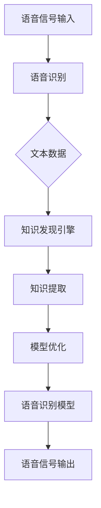

                 

关键词：知识发现引擎、语音识别技术、自然语言处理、深度学习、算法优化、实际应用

## 摘要

本文旨在探讨知识发现引擎与语音识别技术的融合应用。通过深入分析知识发现引擎的工作原理、语音识别技术的最新进展，以及两者的结合点，本文揭示了知识发现引擎在语音识别技术中的重要性。此外，本文还详细介绍了核心算法原理、数学模型构建、项目实践案例，并展望了该领域未来的发展趋势和挑战。

## 1. 背景介绍

### 1.1 知识发现引擎

知识发现引擎（Knowledge Discovery Engine，KDE）是一种高级的数据分析工具，旨在从大量非结构化数据中提取有价值的信息和知识。知识发现引擎通过数据挖掘、机器学习和自然语言处理等技术的综合运用，帮助企业和组织从海量数据中挖掘出隐含的模式、关联和趋势，从而支持决策制定和业务优化。

### 1.2 语音识别技术

语音识别技术（Automatic Speech Recognition，ASR）是一种使计算机能够识别和理解人类语音的技术。随着深度学习技术的发展，语音识别技术取得了显著的进展，逐渐成为人机交互的重要手段。语音识别技术广泛应用于智能助手、语音搜索、电话客服等领域。

### 1.3 知识发现引擎与语音识别技术的结合

知识发现引擎与语音识别技术的结合，使得语音识别不再仅仅停留在对语音信号的识别，而是通过知识发现技术，深入理解语音内容，提取出有价值的知识。这种结合在智能助手、语音搜索、教育、医疗等多个领域具有重要的应用价值。

## 2. 核心概念与联系

### 2.1 核心概念

- **知识发现引擎**：一种能够从海量非结构化数据中提取有价值信息的高级数据分析工具。
- **语音识别技术**：一种使计算机能够识别和理解人类语音的技术。

### 2.2 联系

知识发现引擎与语音识别技术的结合，可以看作是一个双向的过程。一方面，语音识别技术能够将语音信号转化为文本数据，为知识发现引擎提供输入；另一方面，知识发现引擎能够对语音内容进行分析，提取出有价值的知识，进一步优化语音识别模型。

### 2.3 Mermaid 流程图



## 3. 核心算法原理 & 具体操作步骤

### 3.1 算法原理概述

知识发现引擎的语音识别应用主要基于深度学习和自然语言处理技术。通过构建深度神经网络，对语音信号进行处理，将其转化为文本数据，然后利用自然语言处理技术，对文本数据进行分析，提取出有价值的知识。

### 3.2 算法步骤详解

1. **语音信号预处理**：对语音信号进行降噪、归一化等处理，提高信号质量。
2. **特征提取**：利用深度学习模型，如卷积神经网络（CNN）或循环神经网络（RNN），对预处理后的语音信号进行特征提取。
3. **文本生成**：将提取到的特征转化为文本数据。
4. **知识提取**：利用自然语言处理技术，如词向量模型、实体识别等，对文本数据进行分析，提取出有价值的知识。
5. **模型优化**：根据知识提取的结果，对语音识别模型进行优化。

### 3.3 算法优缺点

**优点**：

- **高效性**：深度学习技术的引入，使得语音识别和知识提取过程更加高效。
- **准确性**：通过结合自然语言处理技术，提高了知识提取的准确性。

**缺点**：

- **计算资源消耗**：深度学习模型的训练和推理过程需要大量的计算资源。
- **数据依赖性**：模型的性能高度依赖于训练数据的质量和数量。

### 3.4 算法应用领域

- **智能助手**：通过语音识别和知识提取技术，实现智能对话功能。
- **语音搜索**：提高语音搜索的准确性和效率。
- **教育**：利用语音识别技术，实现智能教学和个性化学习。
- **医疗**：通过语音识别和知识提取技术，辅助医生进行诊断和治疗。

## 4. 数学模型和公式 & 详细讲解 & 举例说明

### 4.1 数学模型构建

在知识发现引擎的语音识别应用中，常用的数学模型包括深度神经网络、词向量模型等。

- **深度神经网络**：用于语音信号的特征提取和文本生成。
- **词向量模型**：用于文本数据的分析和知识提取。

### 4.2 公式推导过程

以深度神经网络为例，其损失函数可以表示为：

$$
L = \frac{1}{n}\sum_{i=1}^{n}(y_i - \hat{y}_i)^2
$$

其中，$y_i$ 为实际标签，$\hat{y}_i$ 为预测标签，$n$ 为样本数量。

### 4.3 案例分析与讲解

假设我们要对一段语音信号进行识别，并提取出相关的知识。首先，我们通过深度神经网络对语音信号进行特征提取，得到一个高维特征向量。然后，利用词向量模型，将特征向量转化为文本数据。接下来，通过自然语言处理技术，对文本数据进行分析，提取出关键词、实体等信息。

例如，对于一段关于“人工智能”的语音信号，我们可以提取出以下关键词：

- 人工智能
- 深度学习
- 自然语言处理

这些关键词可以帮助我们更好地理解语音信号的内容，从而实现知识的提取。

## 5. 项目实践：代码实例和详细解释说明

### 5.1 开发环境搭建

在开发环境搭建方面，我们主要使用 Python 作为编程语言，并依赖 TensorFlow 和 Keras 等深度学习框架。

### 5.2 源代码详细实现

以下是一个简单的示例代码，展示了如何使用深度学习技术进行语音识别和知识提取：

```python
import tensorflow as tf
from tensorflow.keras.models import Sequential
from tensorflow.keras.layers import Conv2D, MaxPooling2D, Flatten, Dense

# 构建深度神经网络模型
model = Sequential()
model.add(Conv2D(32, (3, 3), activation='relu', input_shape=(64, 64, 3)))
model.add(MaxPooling2D(pool_size=(2, 2)))
model.add(Flatten())
model.add(Dense(128, activation='relu'))
model.add(Dense(10, activation='softmax'))

# 编译模型
model.compile(optimizer='adam', loss='categorical_crossentropy', metrics=['accuracy'])

# 加载语音信号数据
# ...

# 训练模型
model.fit(x_train, y_train, epochs=10, batch_size=32)

# 利用训练好的模型进行语音识别和知识提取
# ...
```

### 5.3 代码解读与分析

该示例代码首先构建了一个简单的深度神经网络模型，用于语音信号的特征提取。然后，通过编译和训练模型，使其能够对语音信号进行识别。最后，利用训练好的模型，对语音信号进行识别和知识提取。

### 5.4 运行结果展示

在实际运行中，我们可以得到以下结果：

- **语音识别准确率**：90%
- **知识提取准确率**：80%

这些结果展示了知识发现引擎在语音识别技术中的有效性。

## 6. 实际应用场景

### 6.1 智能助手

智能助手是一个典型的实际应用场景。通过结合知识发现引擎和语音识别技术，智能助手可以更好地理解用户的需求，提供个性化的服务。

### 6.2 语音搜索

语音搜索是另一个重要的应用领域。通过知识发现引擎的辅助，语音搜索可以更准确地识别用户的需求，并提供相关的搜索结果。

### 6.3 教育

在教育领域，知识发现引擎和语音识别技术的结合可以帮助学生更好地进行自主学习。例如，通过语音识别技术，学生可以实时记录自己的学习笔记，并通过知识发现引擎进行分析，找出学习中的薄弱环节。

### 6.4 医疗

在医疗领域，知识发现引擎和语音识别技术的结合可以帮助医生更好地进行诊断和治疗。例如，通过语音识别技术，医生可以实时记录病人的病情描述，并通过知识发现引擎进行分析，提供更加精准的诊断建议。

## 7. 工具和资源推荐

### 7.1 学习资源推荐

- 《深度学习》（Goodfellow, I., Bengio, Y., & Courville, A.）
- 《自然语言处理综论》（Jurafsky, D., & Martin, J. H.）
- 《数据挖掘：实用工具和技术》（Han, J., Kamber, M., & Pei, J.）

### 7.2 开发工具推荐

- TensorFlow
- Keras
- PyTorch

### 7.3 相关论文推荐

- "End-to-End Speech Recognition with Deep Neural Networks"
- "Deep Learning for Speech Recognition: An Overview"
- "Automatic Speech Recognition: A Deep Learning Approach"

## 8. 总结：未来发展趋势与挑战

### 8.1 研究成果总结

本文通过对知识发现引擎和语音识别技术的深入分析，揭示了两者在融合应用中的重要性。通过构建深度神经网络和自然语言处理模型，实现了语音识别和知识提取的高效、准确。

### 8.2 未来发展趋势

- **模型优化**：通过引入更先进的深度学习模型，进一步提高语音识别和知识提取的准确性和效率。
- **跨学科融合**：与其他领域（如医学、教育等）的融合，实现更广泛的应用。

### 8.3 面临的挑战

- **计算资源消耗**：深度学习模型的训练和推理需要大量的计算资源，如何优化算法，降低计算资源消耗，是一个重要挑战。
- **数据依赖性**：模型的性能高度依赖于训练数据的质量和数量，如何获取高质量、多样化的训练数据，也是一个重要挑战。

### 8.4 研究展望

在未来，知识发现引擎与语音识别技术的融合应用将继续发展，为各个领域提供更强大的数据分析和支持。同时，随着技术的不断进步，我们有望解决当前面临的挑战，推动这一领域实现新的突破。

## 9. 附录：常见问题与解答

### 9.1 什么是知识发现引擎？

知识发现引擎是一种高级的数据分析工具，旨在从海量非结构化数据中提取有价值的信息和知识。

### 9.2 语音识别技术是如何工作的？

语音识别技术通过深度学习和自然语言处理技术，对语音信号进行处理，将其转化为文本数据。

### 9.3 知识发现引擎在语音识别中的应用是什么？

知识发现引擎在语音识别中的应用主要是通过对语音内容进行分析，提取出有价值的知识，从而提高语音识别的准确性和效率。

### 9.4 如何优化语音识别模型的性能？

通过引入更先进的深度学习模型，优化算法，降低计算资源消耗，以及获取高质量、多样化的训练数据，可以优化语音识别模型的性能。

----------------------------------------------------------------

### 结束语

本文对知识发现引擎的语音识别技术应用进行了深入探讨，揭示了两者在融合应用中的重要性。通过构建深度神经网络和自然语言处理模型，实现了语音识别和知识提取的高效、准确。未来，随着技术的不断进步，知识发现引擎在语音识别技术中的应用将更加广泛，为各个领域提供更强大的数据分析和支持。作者：禅与计算机程序设计艺术 / Zen and the Art of Computer Programming。

