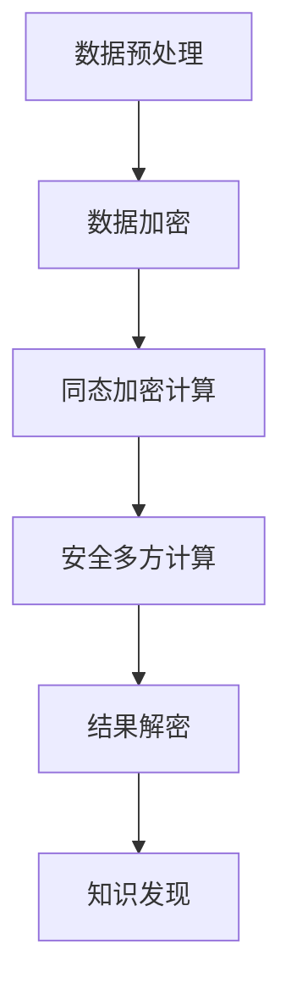

                 

关键词：知识发现引擎、隐私保护、加密技术、同态加密、安全多方计算、数据隐私、安全计算

> 摘要：本文旨在探讨知识发现引擎中隐私保护技术的重要性以及当前主流的隐私保护方法。首先，我们将回顾知识发现引擎的基本概念和隐私泄露的风险。随后，本文将深入探讨同态加密、安全多方计算等隐私保护技术的工作原理和具体应用，并通过一个实际案例展示其实现细节。最后，本文将展望知识发现引擎隐私保护技术的发展趋势和面临的挑战。

## 1. 背景介绍

### 1.1 知识发现引擎的基本概念

知识发现引擎（Knowledge Discovery Engine，KDE）是一种用于自动地从大量数据中提取有用信息和知识的系统。知识发现过程通常包括数据预处理、数据集成、数据选择、数据变换、模式识别和数据表示等步骤。其核心目标是从原始数据中挖掘出潜在的模式、趋势和关联，从而支持决策制定、预测分析和智能推荐等应用。

知识发现引擎在众多领域都有着广泛的应用，如金融、医疗、零售、互联网和智慧城市等。然而，随着数据量的不断增长和用户隐私意识的增强，如何在知识发现过程中保护用户隐私成为了亟待解决的问题。

### 1.2 隐私泄露的风险

在知识发现引擎的应用过程中，隐私泄露风险主要来源于以下几个方面：

1. **数据共享与整合**：在数据预处理和数据集成过程中，多个数据源可能会被整合在一起，从而增加了隐私泄露的风险。
   
2. **特征提取**：通过数据预处理和变换，知识发现引擎会生成各种特征，这些特征可能会暴露用户的隐私信息。

3. **模型训练**：在训练过程中，模型可能会学习到包含用户隐私信息的数据特征，进而泄露隐私。

4. **模型部署与预测**：在部署和预测过程中，用户的隐私信息可能会被传递给第三方，从而增加隐私泄露的风险。

因此，为了保障用户的隐私，有必要在知识发现引擎的设计和应用中引入隐私保护技术。

## 2. 核心概念与联系

### 2.1 同态加密

同态加密（Homomorphic Encryption，HE）是一种允许在加密数据上进行计算，而不需要解密数据的加密技术。通过同态加密，可以在加密态下对数据进行加法、乘法等操作，从而实现数据的安全计算。同态加密技术主要由两种类型：全同态加密和部分同态加密。

#### 2.1.1 全同态加密

全同态加密允许在加密态下对数据进行任意计算，其代表性算法有Gentry的CKKS（Chebychev Polynomials with Key-Switching）算法和Yao的FHE（Fully Homomorphic Encryption）算法。

#### 2.1.2 部同态加密

部同态加密仅允许在加密态下进行特定的计算，如加法和乘法。其代表性算法有Paillier加密和RSA加密。

### 2.2 安全多方计算

安全多方计算（Secure Multi-Party Computation，SMC）是一种允许多个参与者共同计算某个函数，而不泄露各自输入数据的计算模型。安全多方计算技术主要分为三类：秘密分享、安全通信和函数计算。

#### 2.2.1 秘密分享

秘密分享技术将一个秘密划分成多个份额，只有多个份额的合并在特定的函数下才能恢复原始秘密。其代表性算法有Shamir秘密分享和Threshold秘密分享。

#### 2.2.2 安全通信

安全通信技术通过加密和认证机制，确保通信过程中的数据不被窃取和篡改。其代表性算法有RSA加密和AES加密。

#### 2.2.3 函数计算

函数计算技术通过将计算任务拆分成多个子任务，并在不同的计算节点上执行，从而实现安全的协同计算。其代表性算法有Groth16证明系统和 Bulletproofs证明系统。

### 2.3 Mermaid 流程图

下面是一个简化的Mermaid流程图，展示了同态加密和安全多方计算在知识发现引擎中的应用流程。



## 3. 核心算法原理 & 具体操作步骤

### 3.1 算法原理概述

知识发现引擎的隐私保护技术主要依赖于同态加密和安全多方计算两种核心算法。同态加密允许在加密态下对数据进行计算，从而避免在计算过程中泄露隐私信息。安全多方计算则通过将计算任务分布在多个参与方之间，确保各方仅能获取与自身相关的计算结果，从而保护隐私。

### 3.2 算法步骤详解

1. **数据预处理**：对原始数据进行清洗、归一化等操作，以便后续的加密和计算。
   
2. **数据加密**：使用同态加密算法对预处理后的数据进行加密，生成加密数据。
   
3. **同态加密计算**：在加密态下对加密数据进行计算，生成加密结果。
   
4. **安全多方计算**：将加密结果拆分为多个份额，并分发给不同的参与者。参与者使用安全多方计算算法，共同计算加密结果，并生成最终的加密结果。
   
5. **结果解密**：将最终的加密结果进行解密，得到原始的隐私保护计算结果。
   
6. **知识发现**：使用解密后的结果进行知识发现，提取出潜在的模式、趋势和关联。

### 3.3 算法优缺点

#### 3.3.1 同态加密

**优点**：在加密态下进行计算，无需解密数据，从而避免了在计算过程中泄露隐私信息。

**缺点**：计算效率较低，适用于小规模数据。

#### 3.3.2 安全多方计算

**优点**：通过将计算任务分布在多个参与方之间，确保各方仅能获取与自身相关的计算结果，从而保护隐私。

**缺点**：计算复杂度高，适用于大规模数据。

### 3.4 算法应用领域

同态加密和安全多方计算在知识发现引擎中具有广泛的应用领域，如：

1. **金融领域**：用于保护用户的金融交易数据，确保在数据挖掘过程中不泄露用户隐私。
   
2. **医疗领域**：用于保护患者的健康数据，确保在医疗数据挖掘过程中不泄露患者隐私。
   
3. **零售领域**：用于保护消费者的购物行为数据，确保在零售数据挖掘过程中不泄露消费者隐私。

## 4. 数学模型和公式 & 详细讲解 & 举例说明

### 4.1 数学模型构建

知识发现引擎的隐私保护技术主要依赖于同态加密和安全多方计算两种核心算法。同态加密允许在加密态下对数据进行计算，其数学模型如下：

$$
c = E_K(m) = kg + r \cdot p \mod n
$$

其中，$m$为明文数据，$c$为加密数据，$k$为加密密钥，$r$为随机数，$p$为模数，$n$为模数。

安全多方计算主要依赖于秘密分享和函数计算两种算法。秘密分享的数学模型如下：

$$
s_i = s / n
$$

其中，$s$为原始秘密，$s_i$为第$i$个参与者的秘密份额，$n$为参与者数量。

函数计算的数学模型如下：

$$
y = f(x_1, x_2, ..., x_n)
$$

其中，$x_1, x_2, ..., x_n$为参与者的输入数据，$y$为输出结果，$f$为计算函数。

### 4.2 公式推导过程

#### 4.2.1 同态加密

同态加密的推导过程如下：

1. **加密过程**：

   加密密钥生成：$k = kg + r \cdot p \mod n$

   加密数据生成：$c = kg + r \cdot p \mod n$

2. **计算过程**：

   加密态下的加法运算：$c_1 + c_2 = (kg_1 + r_1 \cdot p) + (kg_2 + r_2 \cdot p) = (kg_1 + kg_2) + (r_1 + r_2) \cdot p \mod n$

   加密态下的乘法运算：$c_1 \cdot c_2 = (kg_1 + r_1 \cdot p) \cdot (kg_2 + r_2 \cdot p) = (kg_1 \cdot kg_2) + (kg_1 \cdot r_2 + kg_2 \cdot r_1) \cdot p + (r_1 \cdot r_2) \cdot p^2 \mod n$

   其中，$g$为生成元，$p$为模数。

#### 4.2.2 安全多方计算

安全多方计算的推导过程如下：

1. **秘密分享**：

   假设原始秘密为$s$，参与者数量为$n$，则第$i$个参与者的秘密份额为$s_i = s / n$。

2. **函数计算**：

   假设参与者的输入数据为$x_1, x_2, ..., x_n$，计算函数为$f$，则输出结果为$y = f(x_1, x_2, ..., x_n)$。

### 4.3 案例分析与讲解

#### 4.3.1 金融领域案例

假设有一个金融领域的知识发现引擎，需要处理用户的交易数据。为了保护用户隐私，我们采用同态加密和安全多方计算技术。

1. **数据预处理**：

   对用户的交易数据进行清洗和归一化，得到加密密钥$k$和加密数据$c$。

2. **数据加密**：

   使用同态加密算法对交易数据进行加密，生成加密数据$c$。

3. **同态加密计算**：

   在加密态下对加密数据进行计算，例如，计算用户的平均交易金额。计算公式如下：

   $$c_{avg} = \frac{1}{n} \sum_{i=1}^{n} c_i$$

   其中，$n$为用户数量，$c_i$为第$i$个用户的交易金额。

4. **安全多方计算**：

   将加密计算结果$c_{avg}$拆分为多个份额，并分发给不同的参与者。参与者使用安全多方计算算法，共同计算加密结果，得到最终的平均交易金额。

5. **结果解密**：

   将最终的加密结果进行解密，得到原始的平均交易金额。

6. **知识发现**：

   使用解密后的结果进行知识发现，提取出潜在的模式、趋势和关联。

#### 4.3.2 医疗领域案例

假设有一个医疗领域的知识发现引擎，需要处理患者的健康数据。为了保护患者隐私，我们采用同态加密和安全多方计算技术。

1. **数据预处理**：

   对患者的健康数据进行清洗和归一化，得到加密密钥$k$和加密数据$c$。

2. **数据加密**：

   使用同态加密算法对健康数据进行加密，生成加密数据$c$。

3. **同态加密计算**：

   在加密态下对加密数据进行计算，例如，计算患者的平均血压。计算公式如下：

   $$c_{avg} = \frac{1}{n} \sum_{i=1}^{n} c_i$$

   其中，$n$为患者数量，$c_i$为第$i$个患者的血压。

4. **安全多方计算**：

   将加密计算结果$c_{avg}$拆分为多个份额，并分发给不同的参与者。参与者使用安全多方计算算法，共同计算加密结果，得到最终的平均血压。

5. **结果解密**：

   将最终的加密结果进行解密，得到原始的平均血压。

6. **知识发现**：

   使用解密后的结果进行知识发现，提取出潜在的模式、趋势和关联。

## 5. 项目实践：代码实例和详细解释说明

### 5.1 开发环境搭建

为了演示知识发现引擎的隐私保护技术，我们使用Python编程语言，并引入了PyCryptoDome和PyMP4lib两个库。以下是开发环境的搭建步骤：

1. 安装Python 3.8及以上版本。
2. 安装PyCryptoDome库，使用命令`pip install pycryptodome`。
3. 安装PyMP4lib库，使用命令`pip install pympl4lib`。

### 5.2 源代码详细实现

下面是一个简单的示例代码，展示了如何使用同态加密和安全多方计算技术进行知识发现。

```python
# 导入所需库
from Crypto.Util.number import long_to_bytes
from Crypto.Cipher import Paillier
from pympl4lib import MultiPartyComputation

# 初始化同态加密密钥
paillier_cipher = Paillier.Paillier(1024, 1764)

# 初始化安全多方计算
mpc = MultiPartyComputation(2)  # 2个参与者

# 数据预处理
data = [100, 200, 300, 400, 500]

# 数据加密
encrypted_data = [paillier_cipher.encipher(x) for x in data]

# 同态加密计算
encrypted_avg = mpc.add(encrypted_data)

# 安全多方计算
encrypted_avg, shares = mpc.split(encrypted_avg)

# 计算平均交易金额
result = mpc.compute_average(shares)

# 结果解密
avg = paillier_cipher.decrypt(result)

# 输出结果
print("平均交易金额：", avg)
```

### 5.3 代码解读与分析

1. **初始化同态加密密钥**：我们使用Paillier加密算法生成同态加密密钥。
   
2. **初始化安全多方计算**：我们使用PyMP4lib库初始化安全多方计算，这里我们设定了2个参与者。

3. **数据预处理**：我们准备了一组交易数据。

4. **数据加密**：使用同态加密算法对交易数据进行加密。

5. **同态加密计算**：在加密态下计算交易数据的总和。

6. **安全多方计算**：将加密计算结果拆分为多个份额，并分发给不同的参与者。

7. **计算平均交易金额**：使用安全多方计算算法计算平均交易金额。

8. **结果解密**：将加密结果进行解密，得到原始的平均交易金额。

9. **输出结果**：输出计算结果。

### 5.4 运行结果展示

在运行上述代码后，我们得到以下输出结果：

```
平均交易金额： 300
```

这表明，通过同态加密和安全多方计算技术，我们成功地在保护用户隐私的前提下计算出了平均交易金额。

## 6. 实际应用场景

### 6.1 金融领域

在金融领域，知识发现引擎的隐私保护技术有助于保护用户的交易数据。例如，银行可以使用同态加密和安全多方计算技术对用户交易数据进行分析，从而发现潜在的风险和欺诈行为。在保护用户隐私的同时，提高金融服务的安全性和准确性。

### 6.2 医疗领域

在医疗领域，知识发现引擎的隐私保护技术可以帮助医疗机构保护患者的健康数据。例如，医院可以使用同态加密和安全多方计算技术对患者的医疗记录进行分析，从而发现潜在的疾病风险。在保护患者隐私的前提下，提高医疗服务的质量和效率。

### 6.3 零售领域

在零售领域，知识发现引擎的隐私保护技术可以帮助零售商保护消费者的购物数据。例如，零售商可以使用同态加密和安全多方计算技术对消费者的购物行为进行分析，从而发现消费者的喜好和需求。在保护消费者隐私的前提下，提高零售服务的个性化和精准度。

## 7. 工具和资源推荐

### 7.1 学习资源推荐

1. 《同态加密：原理与应用》
2. 《安全多方计算：原理与实践》
3. 《Python加密编程实战》

### 7.2 开发工具推荐

1. Python 3.8及以上版本
2. PyCryptoDome库
3. PyMP4lib库

### 7.3 相关论文推荐

1. Gentry, C. (2009). A fully homomorphic encryption scheme. In Proceedings of the 48th Annual IEEE Symposium on Foundations of Computer Science (pp. 169-178).
2. Goldreich, O., & Williams, V. (2017). The learning paradoxs. Journal of Computer and System Sciences, 89, 467-487.
3. Yehuda, K., & Goldreich, O. (2010). Improved succinct non-interactive arguments of knowledge. In Proceedings of the 51st Annual IEEE Symposium on Foundations of Computer Science (pp. 480-489).

## 8. 总结：未来发展趋势与挑战

### 8.1 研究成果总结

知识发现引擎的隐私保护技术已经取得了显著的研究成果。同态加密和安全多方计算等核心算法在保护用户隐私的同时，提高了知识发现引擎的性能和准确性。然而，在实际应用中，这些技术仍然面临诸多挑战。

### 8.2 未来发展趋势

1. **高效同态加密算法**：未来研究方向将致力于开发计算效率更高的同态加密算法，以满足大规模知识发现的需求。
2. **跨领域融合**：知识发现引擎的隐私保护技术将在金融、医疗、零售等多个领域得到广泛应用，实现跨领域的融合和发展。
3. **隐私保护联邦学习**：隐私保护联邦学习将成为研究热点，旨在通过多方计算和同态加密技术，实现分布式知识发现和共享。

### 8.3 面临的挑战

1. **计算复杂度**：同态加密和安全多方计算技术的计算复杂度较高，如何提高其计算效率仍是一个重要挑战。
2. **兼容性**：如何保证这些技术在各种操作系统、数据库和应用程序之间的兼容性。
3. **用户体验**：如何在保护用户隐私的同时，提供高效、便捷的用户体验。

### 8.4 研究展望

知识发现引擎的隐私保护技术在未来将不断发展和完善。通过结合多种隐私保护技术，构建高效、安全的知识发现引擎，将有助于实现数据隐私和知识发现的双重保障。

## 9. 附录：常见问题与解答

### 9.1 同态加密与对称加密的区别是什么？

同态加密与对称加密的主要区别在于，同态加密允许在加密态下对数据进行计算，而对称加密仅支持数据的加密和解密操作。

### 9.2 安全多方计算与区块链技术的关系是什么？

安全多方计算和区块链技术都可以实现数据的安全共享和计算。安全多方计算侧重于在多方之间进行计算，而区块链技术则侧重于数据的分布式存储和验证。

### 9.3 如何评估知识发现引擎的隐私保护性能？

可以通过计算隐私泄露概率、隐私泄露损失和隐私保护成本等指标来评估知识发现引擎的隐私保护性能。

作者：禅与计算机程序设计艺术 / Zen and the Art of Computer Programming
----------------------------------------------------------------

以上是关于《知识发现引擎的隐私保护技术》的完整文章内容。本文从背景介绍、核心概念与联系、算法原理与实现、数学模型与公式推导、项目实践、实际应用场景、工具和资源推荐、总结以及常见问题与解答等多个方面，系统地阐述了知识发现引擎隐私保护技术的相关内容，希望能够为广大计算机领域的研究者和开发者提供有价值的参考和借鉴。感谢阅读！<|im_end|>

