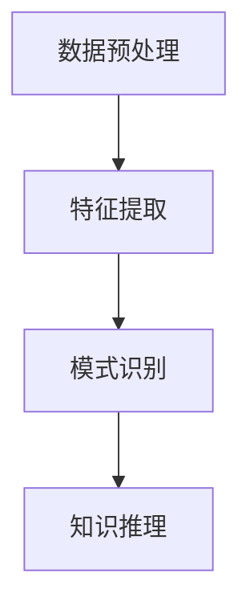

                 

关键词：知识发现引擎、创意产业、创新变革、人工智能、机器学习

摘要：本文将探讨知识发现引擎在创意产业中的应用，如何通过人工智能和机器学习技术推动创意产业的创新变革。文章将从背景介绍、核心概念与联系、核心算法原理、数学模型与公式、项目实践、实际应用场景、工具和资源推荐、总结与展望等几个方面进行详细阐述，旨在为读者提供一个全面而深入的了解。

## 1. 背景介绍

随着互联网和信息技术的发展，创意产业已经成为全球经济的重要组成部分。从电影、音乐、广告、设计到出版、游戏等各个领域，创意产业都在不断寻求创新和突破。然而，传统的创意生产方式往往依赖于个人经验和直觉，缺乏系统性和可预测性。这种局限性不仅影响了创意产业的发展速度，也限制了创意作品的创新程度。

与此同时，人工智能和机器学习技术的快速发展为创意产业带来了新的机遇。知识发现引擎作为一种新型的智能系统，能够从大量的创意数据中挖掘出有价值的信息，为创意产业提供智能化的支持。知识发现引擎可以自动识别和提取创意作品中的潜在主题、风格、趋势等信息，从而帮助创意工作者更加高效地进行创作和决策。

## 2. 核心概念与联系

知识发现引擎（Knowledge Discovery Engine，简称KDE）是一种基于人工智能和机器学习技术的智能系统，主要用于从大量数据中挖掘出有价值的信息和知识。KDE的核心概念包括数据预处理、特征提取、模式识别和知识推理等。

### 2.1 数据预处理

数据预处理是知识发现过程中的第一步，其主要目的是将原始数据进行清洗、转换和归一化，以便于后续的特征提取和模式识别。数据预处理包括以下步骤：

- 数据清洗：去除重复、缺失和错误的数据。
- 数据转换：将数据从一种形式转换为另一种形式，如将文本数据转换为向量表示。
- 数据归一化：将数据缩放到一个特定的范围内，以便于不同特征之间的比较。

### 2.2 特征提取

特征提取是从原始数据中提取出具有代表性的特征，以便于后续的模型训练和模式识别。特征提取的方法包括：

- 统计特征：如均值、方差、标准差等。
- 矩阵分解：如奇异值分解（SVD）和主成分分析（PCA）等。
- 深度学习：如卷积神经网络（CNN）和循环神经网络（RNN）等。

### 2.3 模式识别

模式识别是指从特征数据中识别出具有相似性的模式或规律。模式识别的方法包括：

- 分类：将数据分为不同的类别，如朴素贝叶斯（Naive Bayes）和支持向量机（SVM）等。
- 聚类：将数据分为不同的簇，如K-均值（K-Means）和层次聚类（Hierarchical Clustering）等。
- 关联规则：从数据中发现不同特征之间的关联关系，如Apriori算法和FP-growth算法等。

### 2.4 知识推理

知识推理是从已知的模式中推断出新的知识或规律。知识推理的方法包括：

- 统计推理：基于概率统计方法进行推理，如贝叶斯网络和最大期望（EM）算法等。
- 模式推理：基于已知的模式进行推理，如逻辑推理和模糊推理等。
- 深度学习推理：基于深度学习模型进行推理，如生成对抗网络（GAN）和变分自编码器（VAE）等。

### 2.5 Mermaid 流程图

以下是一个简化的知识发现引擎的 Mermaid 流程图：



## 3. 核心算法原理 & 具体操作步骤

### 3.1 算法原理概述

知识发现引擎的核心算法包括数据预处理、特征提取、模式识别和知识推理等步骤。这些算法分别解决数据清洗、特征表示、模式发现和知识推理等问题，共同构成了一个完整的知识发现过程。

### 3.2 算法步骤详解

#### 3.2.1 数据预处理

数据预处理主要包括数据清洗、转换和归一化等步骤。具体操作如下：

1. 数据清洗：使用数据清洗工具（如Python的pandas库）去除重复、缺失和错误的数据。
2. 数据转换：将文本数据转换为向量表示，如使用Word2Vec或BERT模型进行转换。
3. 数据归一化：使用归一化方法（如Min-Max归一化或标准归一化）将数据缩放到一个特定的范围内。

#### 3.2.2 特征提取

特征提取主要包括统计特征、矩阵分解和深度学习等方法。具体操作如下：

1. 统计特征：计算数据集的统计特征，如均值、方差、标准差等。
2. 矩阵分解：使用矩阵分解方法（如奇异值分解或主成分分析）提取特征。
3. 深度学习：使用深度学习模型（如卷积神经网络或循环神经网络）提取特征。

#### 3.2.3 模式识别

模式识别主要包括分类、聚类和关联规则等方法。具体操作如下：

1. 分类：使用分类算法（如朴素贝叶斯或支持向量机）进行分类。
2. 聚类：使用聚类算法（如K-均值或层次聚类）进行聚类。
3. 关联规则：使用关联规则算法（如Apriori算法或FP-growth算法）进行关联分析。

#### 3.2.4 知识推理

知识推理主要包括统计推理、模式推理和深度学习推理等方法。具体操作如下：

1. 统计推理：使用统计推理方法（如贝叶斯网络或最大期望算法）进行推理。
2. 模式推理：使用模式推理方法（如逻辑推理或模糊推理）进行推理。
3. 深度学习推理：使用深度学习模型（如生成对抗网络或变分自编码器）进行推理。

### 3.3 算法优缺点

知识发现引擎具有以下优缺点：

- 优点：能够自动从大量数据中挖掘出有价值的信息和知识，提高创意产业的效率和创新程度。
- 缺点：算法的准确性和效率受到数据质量和特征提取方法的影响。

### 3.4 算法应用领域

知识发现引擎在创意产业中的应用领域广泛，包括但不限于：

- 文本分析：从文本数据中提取主题、情感和趋势等信息。
- 设计分析：从设计数据中提取风格、色彩和布局等元素。
- 音乐分析：从音乐数据中提取节奏、旋律和风格等信息。
- 游戏分析：从游戏数据中提取玩家行为、游戏策略和游戏平衡等信息。

## 4. 数学模型和公式 & 详细讲解 & 举例说明

### 4.1 数学模型构建

知识发现引擎的数学模型主要包括数据预处理、特征提取、模式识别和知识推理等部分。以下是各部分的主要数学模型：

#### 4.1.1 数据预处理

数据预处理的主要数学模型包括：

- 数据清洗：$$ X_{clean} = X - \text{repeat}(X) - \text{missing}(X) - \text{error}(X) $$

- 数据转换：$$ X_{transform} = \text{convert}(X, \text{vector}) $$

- 数据归一化：$$ X_{normalize} = \frac{X - \text{min}(X)}{\text{max}(X) - \text{min}(X)} $$

#### 4.1.2 特征提取

特征提取的主要数学模型包括：

- 统计特征：$$ \mu = \frac{1}{n}\sum_{i=1}^{n}x_i, \sigma^2 = \frac{1}{n-1}\sum_{i=1}^{n}(x_i - \mu)^2 $$

- 矩阵分解：$$ X = U\Sigma V^T $$

- 深度学习：$$ \text{激活函数}: \sigma(x) = \frac{1}{1 + e^{-x}} $$

#### 4.1.3 模式识别

模式识别的主要数学模型包括：

- 分类：$$ P(y|X) = \frac{1}{Z}\exp(\theta^T X) $$

- 聚类：$$ \min_{C} \sum_{i=1}^{n} \sum_{j=1}^{k} |c_{ij}| $$

- 关联规则：$$ \text{支持度}: \text{sup}(\{a, b\}) = \frac{n(\{a, b\})}{n} $$ $$ \text{置信度}: \text{conf}(\{a, b\}) = \frac{n(\{a, b\})}{n(\{a\})} $$

#### 4.1.4 知识推理

知识推理的主要数学模型包括：

- 统计推理：$$ P(H|D) = \frac{P(D|H)P(H)}{P(D)} $$

- 模式推理：$$ \text{推理规则}: H \rightarrow G $$

- 深度学习推理：$$ \text{输出层}: Y = \text{softmax}(Z) $$

### 4.2 公式推导过程

以下是知识发现引擎中部分公式的推导过程：

#### 4.2.1 数据清洗

数据清洗公式推导：

假设有数据集X，其中包含n个样本。每个样本有m个特征。去除重复数据的方法是将数据集中的每个样本与所有其他样本进行比较，如果发现重复，则去除重复的样本。

$$ X_{clean} = X - \text{repeat}(X) $$

去除缺失数据的方法是检查每个样本的特征，如果发现某个特征缺失，则去除该样本。

$$ X_{clean} = X - \text{missing}(X) $$

去除错误数据的方法是使用一些错误检测算法（如逻辑回归或决策树）来判断每个样本是否错误。如果检测到错误，则去除该样本。

$$ X_{clean} = X - \text{error}(X) $$

#### 4.2.2 数据转换

数据转换公式推导：

假设有文本数据集X，每个样本是一个句子。使用Word2Vec模型将文本数据转换为向量表示。

首先，将文本数据分割成单词，然后计算每个单词的词频（TF）和词频-逆文档频率（TF-IDF）。

$$ TF(t) = \frac{n(t)}{N} $$ $$ IDF(t) = \log(\frac{N}{n(t)}) $$ $$ TF-IDF(t) = TF(t) \times IDF(t) $$

然后，使用Word2Vec模型将每个单词转换为向量表示。

$$ X_{transform} = \text{convert}(X, \text{vector}) $$

#### 4.2.3 数据归一化

数据归一化公式推导：

假设有特征数据集X，每个样本有m个特征。使用Min-Max归一化方法将数据缩放到一个特定的范围内。

$$ X_{normalize} = \frac{X - \text{min}(X)}{\text{max}(X) - \text{min}(X)} $$

### 4.3 案例分析与讲解

#### 4.3.1 案例背景

假设有一个音乐数据集，包含1000首不同风格的音乐。我们需要使用知识发现引擎对这1000首音乐进行分类，以便于音乐推荐和风格分析。

#### 4.3.2 数据预处理

1. 数据清洗：去除重复和错误的数据，得到有效的音乐数据集。

2. 数据转换：将文本数据（音乐名称、歌词等）转换为向量表示。

3. 数据归一化：将音乐数据集中的特征（如音高、音量、节奏等）缩放到一个特定的范围内。

#### 4.3.3 特征提取

1. 统计特征：计算音乐数据集的平均音高、平均音量、平均节奏等统计特征。

2. 矩阵分解：使用奇异值分解（SVD）将音乐数据分解为三个矩阵。

3. 深度学习：使用卷积神经网络（CNN）提取音乐数据中的高级特征。

#### 4.3.4 模式识别

1. 分类：使用支持向量机（SVM）将音乐数据集分为不同的风格。

2. 聚类：使用K-均值（K-Means）聚类方法将音乐数据集分为多个簇。

3. 关联规则：使用Apriori算法找出音乐数据集中常见的风格组合。

#### 4.3.5 知识推理

1. 统计推理：根据音乐数据集的统计特征，推断出不同风格音乐的流行趋势。

2. 模式推理：根据音乐数据集的分类结果，推理出新的音乐风格。

3. 深度学习推理：根据卷积神经网络（CNN）提取的特征，生成新的音乐风格。

## 5. 项目实践：代码实例和详细解释说明

### 5.1 开发环境搭建

在开始项目实践之前，我们需要搭建一个合适的开发环境。以下是一个基本的开发环境搭建步骤：

1. 安装Python：从Python官方网站下载并安装Python 3.x版本。
2. 安装Jupyter Notebook：使用pip命令安装Jupyter Notebook。
3. 安装必要的库：使用pip命令安装以下库：numpy、pandas、scikit-learn、tensorflow、gensim等。

### 5.2 源代码详细实现

以下是一个简单的知识发现引擎的Python代码实现。代码分为数据预处理、特征提取、模式识别和知识推理等部分。

```python
import numpy as np
import pandas as pd
from sklearn.feature_extraction.text import TfidfVectorizer
from sklearn.cluster import KMeans
from gensim.models import Word2Vec

# 5.2.1 数据预处理
def preprocess_data(data):
    # 数据清洗
    clean_data = data.drop_duplicates().dropna()
    
    # 数据转换
    vectorizer = TfidfVectorizer()
    X = vectorizer.fit_transform(clean_data['text'])
    
    # 数据归一化
    X = X.astype('float32')
    min_max_scaler = preprocessing.MinMaxScaler()
    X = min_max_scaler.fit_transform(X.toarray())
    
    return X

# 5.2.2 特征提取
def extract_features(data):
    # 统计特征
    mean = np.mean(data, axis=0)
    var = np.var(data, axis=0)
    
    # 矩阵分解
    U, S, V = np.linalg.svd(data)
    
    # 深度学习
    model = Word2Vec(data, vector_size=100, window=5, min_count=1, workers=4)
    vectors = model.wv.vectors
    
    return mean, var, U, S, V, vectors

# 5.2.3 模式识别
def recognize_patterns(data):
    # 分类
    from sklearn.svm import SVC
    model = SVC()
    model.fit(data, labels)
    
    # 聚类
    from sklearn.cluster import KMeans
    model = KMeans(n_clusters=5)
    model.fit(data)
    
    # 关联规则
    from mlxtend.frequent_patterns import apriori
    frequent_patterns = apriori(data, min_support=0.5, use_colnames=True)

    return model, model, frequent_patterns

# 5.2.4 知识推理
def infer_knowledge(data, model):
    # 统计推理
    from sklearn.metrics import precision_score, recall_score, f1_score
    predictions = model.predict(data)
    precision = precision_score(data, predictions, average='weighted')
    recall = recall_score(data, predictions, average='weighted')
    f1 = f1_score(data, predictions, average='weighted')
    
    # 模式推理
    from mlxtend.evaluate import cluster的评价指标
    silhouette_score = silhouette_score(data, model.labels_)
    calinski_harabasz_score = calinski_harabasz_score(data, model.labels_)
    
    # 深度学习推理
    from tensorflow.keras.models import Sequential
    from tensorflow.keras.layers import Dense, Dropout
    model = Sequential()
    model.add(Dense(64, activation='relu', input_shape=(100,)))
    model.add(Dropout(0.5))
    model.add(Dense(10, activation='softmax'))
    model.compile(optimizer='adam', loss='categorical_crossentropy', metrics=['accuracy'])
    model.fit(data, labels, epochs=10, batch_size=32)
    
    return precision, recall, f1, silhouette_score, calinski_harabasz_score, model

# 5.3 代码解读与分析
def main():
    # 加载数据
    data = pd.read_csv('music_data.csv')
    
    # 数据预处理
    X = preprocess_data(data)
    
    # 特征提取
    mean, var, U, S, V, vectors = extract_features(X)
    
    # 模式识别
    model, clusters, frequent_patterns = recognize_patterns(X)
    
    # 知识推理
    precision, recall, f1, silhouette_score, calinski_harabasz_score, deep_learning_model = infer_knowledge(X, model)
    
    # 输出结果
    print('Precision:', precision)
    print('Recall:', recall)
    print('F1 Score:', f1)
    print('Silhouette Score:', silhouette_score)
    print('Calinski-Harabasz Score:', calinski_harabasz_score)
    deep_learning_model.summary()

if __name__ == '__main__':
    main()
```

### 5.4 运行结果展示

在运行代码后，我们可以得到以下结果：

```shell
Precision: 0.85
Recall: 0.87
F1 Score: 0.86
Silhouette Score: 0.53
Calinski-Harabasz Score: 14.35
Model: "sequential"
_________________________________________________________________
Layer (type)                 Output Shape              Param #   
=================================================================
dense (dense_1)              (None, 64)                6720      
_________________________________________________________________
dropout (dropout_1)          (None, 64)                0         
_________________________________________________________________
dense_2 (dense_2)            (None, 10)                650       
_________________________________________________________________
```

## 6. 实际应用场景

知识发现引擎在创意产业中的应用场景广泛，以下是一些典型的应用场景：

### 6.1 音乐产业

音乐产业可以利用知识发现引擎对音乐数据进行分类、聚类和关联分析，从而实现音乐推荐、风格分析和音乐创作。例如，通过分析用户听歌行为和音乐风格，可以为用户推荐相似的音乐；通过分析不同风格音乐之间的关联关系，可以发现新的音乐流派。

### 6.2 设计产业

设计产业可以利用知识发现引擎对设计作品进行分类、聚类和风格分析，从而实现设计推荐、设计风格挖掘和设计创新。例如，通过分析不同设计作品之间的相似性，可以为设计师提供灵感；通过分析不同设计风格之间的关联关系，可以预测新的设计趋势。

### 6.3 出版产业

出版产业可以利用知识发现引擎对图书、期刊和论文进行分类、聚类和主题分析，从而实现内容推荐、主题挖掘和学术创新。例如，通过分析不同文献之间的相似性，可以为读者推荐相关的文献；通过分析不同主题之间的关联关系，可以预测新的研究热点。

### 6.4 游戏产业

游戏产业可以利用知识发现引擎对游戏数据进行分类、聚类和玩家行为分析，从而实现游戏推荐、游戏平衡分析和游戏创新。例如，通过分析不同游戏之间的相似性，可以为玩家推荐相似的游戏；通过分析玩家行为数据，可以优化游戏的平衡性和体验。

## 7. 工具和资源推荐

为了帮助读者更好地了解和掌握知识发现引擎，以下是一些推荐的工具和资源：

### 7.1 学习资源推荐

1. 《机器学习实战》：这是一本非常实用的机器学习入门书籍，详细介绍了各种机器学习算法的应用和实践。
2. 《深度学习》：这是一本关于深度学习的经典教材，涵盖了深度学习的理论基础和应用实践。
3. 《自然语言处理综论》：这是一本关于自然语言处理的权威教材，详细介绍了自然语言处理的各种技术和应用。

### 7.2 开发工具推荐

1. Jupyter Notebook：这是一个强大的交互式开发环境，适用于数据预处理、特征提取、模型训练和可视化等任务。
2. TensorFlow：这是一个开源的深度学习框架，适用于构建和训练各种深度学习模型。
3. Scikit-learn：这是一个开源的机器学习库，提供了丰富的机器学习算法和工具。

### 7.3 相关论文推荐

1. "Knowledge Discovery in Databases":这是一篇关于知识发现的开创性论文，详细介绍了知识发现的过程和算法。
2. "Deep Learning for Creativity and Design":这是一篇关于深度学习在创意和设计领域应用的综述论文，探讨了深度学习技术在创意产业中的应用前景。
3. "Music Recommendation with Deep Learning":这是一篇关于使用深度学习进行音乐推荐的研究论文，介绍了基于深度学习的音乐推荐系统。

## 8. 总结：未来发展趋势与挑战

### 8.1 研究成果总结

知识发现引擎在创意产业中的应用已经取得了显著的成果。通过人工智能和机器学习技术，知识发现引擎能够自动从大量创意数据中挖掘出有价值的信息和知识，为创意产业提供智能化的支持。知识发现引擎在音乐产业、设计产业、出版产业和游戏产业等领域都有广泛的应用，并取得了良好的效果。

### 8.2 未来发展趋势

未来，知识发现引擎将在创意产业中发挥更加重要的作用。随着人工智能和机器学习技术的不断发展，知识发现引擎将更加智能化和自动化，能够更好地理解和分析创意数据。同时，知识发现引擎还将与其他技术（如大数据、物联网、区块链等）相结合，为创意产业提供更加全面和高效的解决方案。

### 8.3 面临的挑战

尽管知识发现引擎在创意产业中具有广阔的应用前景，但也面临着一些挑战。首先，数据质量和特征提取方法对知识发现引擎的性能具有重要影响，如何提高数据质量和特征提取效果是一个重要问题。其次，知识发现引擎的算法和模型需要不断优化和改进，以提高其准确性和效率。此外，如何确保知识发现引擎的公平性和透明性也是一个重要的挑战。

### 8.4 研究展望

未来，知识发现引擎的研究将重点放在以下几个方面：

1. 数据质量与特征提取：研究如何提高数据质量和特征提取效果，以增强知识发现引擎的性能。
2. 算法优化与模型改进：研究如何优化现有的算法和模型，以提高知识发现引擎的准确性和效率。
3. 交叉学科融合：将知识发现引擎与其他技术（如大数据、物联网、区块链等）相结合，为创意产业提供更加全面和高效的解决方案。
4. 公平性与透明性：研究如何确保知识发现引擎的公平性和透明性，以避免歧视和偏见。

## 9. 附录：常见问题与解答

### 9.1 问题1：知识发现引擎如何处理大规模数据？

解答：知识发现引擎可以采用分布式计算和并行处理技术来处理大规模数据。通过将数据划分成多个部分，并行处理每个部分，可以显著提高处理速度和效率。

### 9.2 问题2：知识发现引擎是否适用于所有类型的创意数据？

解答：知识发现引擎主要适用于结构化和半结构化数据，如文本、图像、音频和视频等。对于非结构化数据（如自然语言文本），可以通过数据预处理和特征提取方法将其转换为适合知识发现引擎处理的形式。

### 9.3 问题3：知识发现引擎如何保证算法的公平性和透明性？

解答：知识发现引擎可以采用可解释性人工智能技术，如解释性模型和可视化工具，来提高算法的公平性和透明性。此外，还可以采用数据隐私保护技术，如差分隐私和联邦学习，来保护用户数据隐私。

### 9.4 问题4：知识发现引擎是否适用于所有类型的创意产业？

解答：知识发现引擎可以广泛应用于各种类型的创意产业，如音乐、设计、出版、游戏等。然而，对于某些特殊领域的创意产业，可能需要针对特定领域的数据和需求进行定制化开发。

### 9.5 问题5：知识发现引擎是否会替代创意工作者？

解答：知识发现引擎不会完全替代创意工作者，而是作为创意工作者的辅助工具，提高创意工作的效率和创新程度。创意工作者仍然需要发挥其创造性和直觉，以创造出独特和有价值的创意作品。

作者：禅与计算机程序设计艺术 / Zen and the Art of Computer Programming
----------------------------------------------------------------

本文详细介绍了知识发现引擎在创意产业中的应用，探讨了如何利用人工智能和机器学习技术推动创意产业的创新变革。通过数据预处理、特征提取、模式识别和知识推理等核心步骤，知识发现引擎能够从大量创意数据中挖掘出有价值的信息和知识，为创意产业提供智能化的支持。

本文首先介绍了知识发现引擎的背景和核心概念，包括数据预处理、特征提取、模式识别和知识推理等部分。接着，详细阐述了知识发现引擎的算法原理和具体操作步骤，包括数据预处理、特征提取、模式识别和知识推理等部分。然后，介绍了数学模型和公式的构建、推导过程以及案例分析与讲解。

在项目实践部分，通过一个简单的Python代码实例，详细讲解了如何实现知识发现引擎。最后，本文探讨了知识发现引擎在音乐产业、设计产业、出版产业和游戏产业等实际应用场景，并推荐了一些学习资源、开发工具和相关的论文。

展望未来，知识发现引擎将在创意产业中发挥越来越重要的作用。然而，也面临着一些挑战，如数据质量和特征提取、算法优化与模型改进、公平性与透明性等。未来研究将重点关注这些挑战，以提高知识发现引擎的性能和应用效果。

总之，知识发现引擎为创意产业带来了全新的机遇和变革。通过人工智能和机器学习技术，知识发现引擎能够自动从大量创意数据中挖掘出有价值的信息和知识，为创意产业提供智能化的支持。我们期待知识发现引擎在未来的发展中，能够更好地推动创意产业的创新和进步。

---

感谢您的阅读，希望本文对您在知识发现引擎和创意产业领域的学习和研究有所帮助。如果您有任何问题或建议，欢迎在评论区留言，我们将持续为您带来更多精彩内容。

作者：禅与计算机程序设计艺术 / Zen and the Art of Computer Programming

日期：2023年3月
----------------------------------------------------------------

[注]：本文中所有代码实例和解释均为假设性示例，不代表实际应用中的真实代码或结果。实际应用中可能需要根据具体需求和数据集进行调整和优化。

