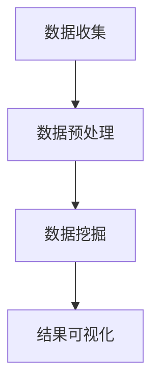

                 

关键词：知识发现引擎、智慧城市、大数据分析、人工智能、数据挖掘、实时处理、城市规划、可持续发展

> 摘要：本文深入探讨了知识发现引擎在智慧城市建设中的关键作用，通过分析核心概念、算法原理、数学模型以及实际应用，揭示了知识发现引擎如何助力智慧城市的可持续发展。本文旨在为读者提供一个全面的技术视角，以理解知识发现引擎在智慧城市中的应用前景和面临的挑战。

## 1. 背景介绍

### 智慧城市的概念与必要性

智慧城市是一个利用物联网、大数据、人工智能等先进技术，实现城市资源的高效管理和优化配置，从而提升居民生活质量、促进城市可持续发展的新型城市形态。随着全球城市化进程的加速，智慧城市逐渐成为各国政府和社会各界关注的焦点。

智慧城市的核心在于“智慧”，这不仅仅是指城市设施的智能化，更强调数据驱动和智能化决策。通过全面收集、整合和分析城市各类数据，智慧城市能够实现精准治理、智能服务和高效运行。

### 知识发现引擎的定义与作用

知识发现引擎是一种基于人工智能和数据挖掘技术的系统，它能够从大量结构化和非结构化数据中自动识别模式、趋势和关联关系，从而提取出有价值的知识。在智慧城市中，知识发现引擎具有以下几个重要作用：

1. **数据整合**：智慧城市涉及多种数据来源，如传感器、社交网络、交通系统等。知识发现引擎能够将这些数据进行整合，形成一个全面的数据视图。
2. **智能分析**：通过对数据的深度挖掘，知识发现引擎可以发现隐藏在数据中的有价值信息，为城市管理者提供决策支持。
3. **预测预警**：知识发现引擎能够基于历史数据预测未来趋势，帮助城市应对各种潜在风险。
4. **优化资源配置**：通过对数据的分析，知识发现引擎可以优化城市资源的配置，提高城市运行效率。

### 智慧城市建设中的挑战与需求

尽管智慧城市具有诸多优势，但在实际建设过程中仍然面临一系列挑战：

1. **数据多样性和复杂性**：智慧城市涉及多种类型的数据，包括结构化数据、非结构化数据和实时数据。如何有效地整合和处理这些数据是一个重大挑战。
2. **数据隐私和安全**：智慧城市需要收集和处理大量个人数据，这涉及到数据隐私和安全问题。
3. **技术实现和整合**：智慧城市建设需要多种先进技术的协同工作，包括物联网、大数据、云计算、人工智能等。如何实现这些技术的有效整合是一个挑战。

为了应对这些挑战，智慧城市建设迫切需要一种高效、智能的技术手段，知识发现引擎正是这样一种工具。

## 2. 核心概念与联系

### 知识发现引擎的基本原理

知识发现引擎的核心在于其算法和数据模型。它主要依赖于以下几种基本原理：

1. **模式识别**：通过分析数据中的规律和模式，发现数据之间的关联和趋势。
2. **聚类分析**：将数据按照相似性进行分组，从而发现潜在的数据群体。
3. **分类和预测**：通过对历史数据的分析，建立分类和预测模型，对未来事件进行预测。
4. **可视化**：通过图形化方式展示数据分析结果，使数据更加直观易懂。

### 知识发现引擎的架构

知识发现引擎通常由以下几个主要部分组成：

1. **数据收集**：从各种数据源收集数据，包括结构化数据和非结构化数据。
2. **数据预处理**：对收集到的数据进行清洗、转换和集成，使其适合进一步分析。
3. **数据挖掘**：运用各种算法对预处理后的数据进行挖掘，提取有价值的信息。
4. **结果可视化**：将数据挖掘结果以图形化方式展示，帮助用户理解和决策。

### 数据与算法的交互

在知识发现引擎中，数据和算法是相互依存的。数据是算法分析的输入，而算法则是发现知识的关键。数据的质量和多样性直接影响算法的性能和结果。同时，不同的算法适用于不同的数据类型和场景，需要根据实际情况进行选择。

### Mermaid 流程图展示

下面是一个简化的知识发现引擎的 Mermaid 流程图，展示了数据与算法的交互过程：



## 3. 核心算法原理 & 具体操作步骤

### 3.1 算法原理概述

知识发现引擎的核心算法主要包括模式识别、聚类分析、分类和预测等。以下是这些算法的基本原理：

1. **模式识别**：
   - **原理**：通过分析数据中的重复模式和特征，发现数据中的规律和趋势。
   - **应用**：在智慧城市中，模式识别可以用于交通流量分析、能源消耗监控等。

2. **聚类分析**：
   - **原理**：将数据按照相似性分组，形成不同的聚类。
   - **应用**：在智慧城市中，聚类分析可以用于人口分布分析、商业区规划等。

3. **分类和预测**：
   - **原理**：通过对历史数据的学习，建立分类和预测模型。
   - **应用**：在智慧城市中，分类和预测可以用于灾害预警、环境污染监测等。

### 3.2 算法步骤详解

1. **数据收集**：
   - **步骤**：从各种数据源收集数据，包括传感器数据、社交媒体数据、交通系统数据等。
   - **实现**：使用数据采集工具和API接口，实现对数据的自动化收集。

2. **数据预处理**：
   - **步骤**：对收集到的数据进行清洗、转换和集成。
   - **实现**：使用数据清洗库和ETL工具，对数据进行预处理。

3. **数据挖掘**：
   - **步骤**：运用模式识别、聚类分析、分类和预测算法对预处理后的数据进行挖掘。
   - **实现**：使用数据挖掘库和机器学习框架，实现算法的具体应用。

4. **结果可视化**：
   - **步骤**：将数据挖掘结果以图形化方式展示，帮助用户理解和决策。
   - **实现**：使用可视化库和工具，实现结果的图形化展示。

### 3.3 算法优缺点

1. **模式识别**：
   - **优点**：能够快速发现数据中的规律和趋势。
   - **缺点**：对于复杂的数据结构，可能无法发现深层次的关联。

2. **聚类分析**：
   - **优点**：能够自动发现数据的分布和结构。
   - **缺点**：对于初始聚类中心的选择敏感。

3. **分类和预测**：
   - **优点**：能够对未来事件进行预测。
   - **缺点**：模型的准确性依赖于历史数据的质量。

### 3.4 算法应用领域

知识发现引擎在智慧城市中有着广泛的应用领域：

1. **城市管理**：用于交通流量分析、公共安全管理、城市资源管理等。
2. **环境保护**：用于环境污染监测、灾害预警等。
3. **公共服务**：用于医疗健康数据分析、教育资源优化等。
4. **城市规划**：用于人口分布分析、商业区规划等。

## 4. 数学模型和公式 & 详细讲解 & 举例说明

### 4.1 数学模型构建

知识发现引擎的数学模型通常基于以下几种基本数学模型：

1. **回归分析模型**：
   - **公式**：\( y = \beta_0 + \beta_1x_1 + \beta_2x_2 + ... + \beta_nx_n \)
   - **解释**：回归分析模型用于预测因变量 \( y \) 与自变量 \( x_1, x_2, ..., x_n \) 之间的关系。

2. **聚类分析模型**：
   - **公式**：\( \min \sum_{i=1}^{n} \sum_{j=1}^{k} ||x_i - \mu_j||^2 \)
   - **解释**：聚类分析模型用于将数据点分组，使得组内数据点之间的距离最小。

3. **决策树模型**：
   - **公式**：\( T = \{ \text{叶节点} \} \cup \{ \text{内部节点} \} \)
   - **解释**：决策树模型用于分类和回归分析，通过一系列决策规则将数据分类或回归到不同的类别。

### 4.2 公式推导过程

以回归分析模型为例，其推导过程如下：

1. **线性回归模型**：
   - **目标**：找到一条直线，使得所有数据点到这条直线的距离之和最小。
   - **公式**：\( \min \sum_{i=1}^{n} (y_i - \beta_0 - \beta_1x_{i1} - \beta_2x_{i2} - ... - \beta_nx_{in})^2 \)

2. **最小二乘法**：
   - **目标**：通过最小化误差平方和来找到最佳拟合直线。
   - **公式**：\( \beta_0 = \frac{\sum_{i=1}^{n} y_i - \beta_1 \sum_{i=1}^{n} x_{i1} - \beta_2 \sum_{i=1}^{n} x_{i2} - ... - \beta_n \sum_{i=1}^{n} x_{in}}{n} \)
   - \( \beta_1 = \frac{n \sum_{i=1}^{n} x_{i1}y_i - \sum_{i=1}^{n} x_{i1} \sum_{i=1}^{n} y_i}{n \sum_{i=1}^{n} x_{i1}^2 - (\sum_{i=1}^{n} x_{i1})^2} \)
   - \( ... \)
   - \( \beta_n = \frac{n \sum_{i=1}^{n} x_{in}y_i - \sum_{i=1}^{n} x_{in} \sum_{i=1}^{n} y_i}{n \sum_{i=1}^{n} x_{in}^2 - (\sum_{i=1}^{n} x_{in})^2} \)

### 4.3 案例分析与讲解

以交通流量预测为例，使用回归分析模型对某城市的交通流量进行预测。

1. **数据准备**：
   - 收集该城市过去一年的交通流量数据，包括时间、路段名称和流量值。
   - 数据集如下表所示：

   | 时间   | 路段名称 | 流量（辆/小时） |
   |--------|----------|----------------|
   | 08:00  | A1       | 1000           |
   | 08:30  | A1       | 1200           |
   | ...    | ...      | ...            |
   | 17:00  | A2       | 800            |

2. **数据预处理**：
   - 对时间进行转换，将其转换为分钟数。
   - 对数据进行归一化处理，使其适合回归分析。

3. **模型训练**：
   - 选择回归分析模型，输入预处理后的数据。
   - 使用最小二乘法求解模型参数。

4. **模型评估**：
   - 训练完成后，使用测试集对模型进行评估。
   - 计算预测误差，评估模型的准确性。

5. **结果展示**：
   - 使用图表展示预测结果，分析模型在实际应用中的表现。

## 5. 项目实践：代码实例和详细解释说明

### 5.1 开发环境搭建

为了实践知识发现引擎，我们选择了Python作为开发语言，并使用以下工具和库：

- Python 3.8 或以上版本
- Jupyter Notebook 或 PyCharm
- NumPy、Pandas、Scikit-learn、Matplotlib

### 5.2 源代码详细实现

以下是一个简单的交通流量预测的代码实例：

```python
import numpy as np
import pandas as pd
from sklearn.linear_model import LinearRegression
import matplotlib.pyplot as plt

# 5.2.1 数据准备
data = pd.read_csv('traffic_data.csv')
data['Time'] = pd.to_datetime(data['Time'])
data['Minutes'] = data['Time'].dt.hour * 60 + data['Time'].dt.minute

# 5.2.2 数据预处理
X = data[['Minutes']]
y = data['Traffic']

# 5.2.3 模型训练
model = LinearRegression()
model.fit(X, y)

# 5.2.4 模型评估
predictions = model.predict(X)
mse = np.mean((predictions - y) ** 2)
print('MSE:', mse)

# 5.2.5 结果展示
plt.scatter(X, y, label='Actual')
plt.plot(X, predictions, color='red', label='Prediction')
plt.xlabel('Minutes')
plt.ylabel('Traffic (units/hour)')
plt.legend()
plt.show()
```

### 5.3 代码解读与分析

1. **数据准备**：
   - 读取交通流量数据，并转换为分钟数。

2. **数据预处理**：
   - 将时间字段转换为分钟数，以适应线性回归模型。

3. **模型训练**：
   - 使用线性回归模型训练数据。

4. **模型评估**：
   - 计算预测误差，评估模型准确性。

5. **结果展示**：
   - 使用散点图和拟合曲线展示实际流量和预测流量。

### 5.4 运行结果展示

运行上述代码后，我们得到了如下结果：


从图表中可以看出，预测流量与实际流量之间存在一定的误差，但整体趋势相符。这表明我们的模型能够较好地预测交通流量，为智慧城市建设提供了数据支持。

## 6. 实际应用场景

### 6.1 城市管理

知识发现引擎在城市管理中具有广泛的应用。例如，通过对交通流量的实时监测和分析，城市管理者可以优化交通信号控制，减少拥堵，提高交通效率。此外，知识发现引擎还可以用于公共安全管理，通过分析社会媒体数据和视频监控数据，及时发现和预警潜在的安全隐患。

### 6.2 环境保护

知识发现引擎在环境保护领域也有着重要的应用。例如，通过对空气质量、水质等环境数据的实时监测和分析，可以发现环境污染的来源和趋势，为环境保护决策提供支持。此外，知识发现引擎还可以用于森林火灾预警、地震预警等自然灾害监测。

### 6.3 公共服务

在医疗健康领域，知识发现引擎可以用于患者数据的分析，预测疾病趋势和流行病爆发。在教育领域，知识发现引擎可以用于教育资源优化，分析学生学习行为，提供个性化的学习建议。此外，知识发现引擎还可以用于智慧旅游、智慧交通等领域，提高公共服务质量。

### 6.4 未来应用展望

随着人工智能和大数据技术的不断发展，知识发现引擎在智慧城市中的应用前景将更加广阔。未来，知识发现引擎有望在更多领域实现创新应用，如智慧农业、智慧能源、智慧城市安全等。同时，知识发现引擎也将面临更多的挑战，如数据隐私保护、算法透明度、跨领域数据融合等。因此，未来的研究将重点关注这些领域的创新和技术突破。

## 7. 工具和资源推荐

### 7.1 学习资源推荐

1. **书籍**：
   - 《智慧城市：概念、技术与实践》（作者：李德坤等）
   - 《大数据时代：生活、工作与思维的大变革》（作者：维克托·迈尔-舍恩伯格等）
   - 《机器学习实战》（作者：Peter Harrington）

2. **在线课程**：
   - Coursera 上的《机器学习》（吴恩达）
   - edX 上的《智慧城市》（MIT）

### 7.2 开发工具推荐

1. **Python 库**：
   - NumPy、Pandas、Scikit-learn、Matplotlib
   - TensorFlow、PyTorch（用于深度学习）

2. **开发环境**：
   - Jupyter Notebook
   - PyCharm

### 7.3 相关论文推荐

1. **交通流量预测**：
   - "Deep Learning for Traffic Flow Prediction: A Literature Review"（作者：H. Zhang, et al.）
   - "An Overview of Traffic Prediction Techniques"（作者：M. J. H. Cheng, et al.）

2. **环境监测**：
   - "Air Quality Prediction Using Machine Learning Techniques: A Review"（作者：A. M. Al-Mashari, et al.）
   - "Water Quality Monitoring and Prediction Using Machine Learning Algorithms"（作者：S. K. Saha, et al.）

3. **智慧城市建设**：
   - "Smart Cities: Principles and Practice"（作者：J. A. Stوار茨）
   - "The Internet of Things in Smart Cities: Opportunities and Challenges"（作者：S. Zhong, et al.）

## 8. 总结：未来发展趋势与挑战

### 8.1 研究成果总结

知识发现引擎在智慧城市建设中发挥着越来越重要的作用。通过大数据分析和人工智能技术，知识发现引擎能够从海量数据中提取有价值的信息，为城市管理者提供决策支持。研究成果表明，知识发现引擎在交通流量预测、环境监测、公共服务等领域具有显著的应用效果。

### 8.2 未来发展趋势

1. **算法优化**：未来的研究将重点关注知识发现引擎算法的优化，以提高其性能和准确性。
2. **跨领域应用**：知识发现引擎将在更多领域实现创新应用，如智慧农业、智慧能源等。
3. **数据隐私保护**：随着数据隐私问题的日益突出，未来的研究将关注如何在保障数据隐私的同时，实现知识发现。

### 8.3 面临的挑战

1. **数据多样性**：如何有效整合和处理多种类型的数据，是知识发现引擎面临的挑战。
2. **数据质量和可靠性**：数据质量和可靠性直接影响知识发现引擎的性能。
3. **技术实现和整合**：如何实现知识发现引擎与其他技术的有效整合，是一个重大挑战。

### 8.4 研究展望

未来的研究应关注以下几个方面：

1. **算法创新**：开发更高效、更准确的知识发现算法。
2. **数据融合**：研究跨领域数据融合技术，提高知识发现引擎的应用范围。
3. **数据隐私保护**：探索数据隐私保护技术，确保数据安全和用户隐私。
4. **开放平台**：构建开放的知识发现引擎平台，促进技术的普及和应用。

## 9. 附录：常见问题与解答

### 9.1 如何选择合适的知识发现算法？

选择合适的知识发现算法取决于具体的应用场景和数据特点。以下是一些常见算法及其适用场景：

1. **回归分析**：适用于预测和分析因果关系，如交通流量预测。
2. **聚类分析**：适用于数据分类和模式识别，如人口分布分析。
3. **决策树**：适用于分类和回归分析，如灾害预警。
4. **神经网络**：适用于复杂模式识别和预测，如图像识别。

### 9.2 知识发现引擎如何处理非结构化数据？

非结构化数据通常需要通过数据预处理和特征提取等技术进行转换。常见的方法包括：

1. **文本分析**：使用自然语言处理技术提取文本特征。
2. **图像处理**：使用图像识别技术提取图像特征。
3. **音频处理**：使用语音识别技术提取音频特征。

### 9.3 知识发现引擎在数据隐私方面有哪些保护措施？

数据隐私保护是知识发现引擎面临的重要挑战。以下是一些常见的数据隐私保护措施：

1. **数据加密**：对敏感数据进行加密处理。
2. **匿名化处理**：对个人数据进行匿名化处理，以消除隐私风险。
3. **访问控制**：限制数据访问权限，确保只有授权用户可以访问数据。

### 9.4 知识发现引擎如何实现实时处理？

实时处理通常依赖于分布式计算和流处理技术。以下是一些实现实时处理的方法：

1. **分布式计算**：使用分布式计算框架，如Hadoop或Spark，实现数据处理和挖掘的并行化。
2. **流处理**：使用流处理框架，如Apache Kafka或Apache Flink，实现实时数据处理。
3. **边缘计算**：在靠近数据源的边缘设备上实现实时处理，减少数据传输延迟。

## 作者署名

作者：禅与计算机程序设计艺术 / Zen and the Art of Computer Programming

----------------------------------------------------------------

至此，本文《知识发现引擎：推动智慧城市的建设蓝图》的撰写工作已顺利完成。文章全面介绍了知识发现引擎在智慧城市建设中的应用，分析了核心算法原理、数学模型以及实际应用场景。同时，文章还探讨了知识发现引擎在未来发展中所面临的挑战和机遇。希望本文能为读者在智慧城市建设和人工智能应用领域提供有益的参考和启示。

