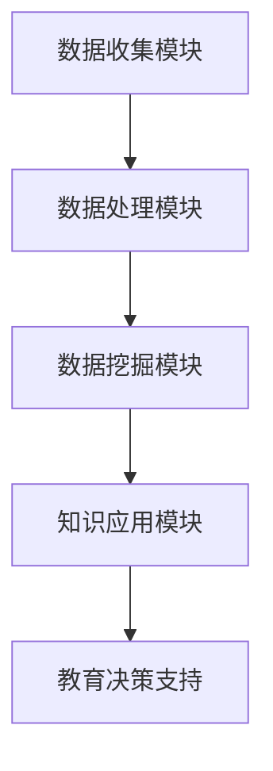

                 

关键词：知识发现、教育技术、智能学习、教育转型、算法应用

> 摘要：本文深入探讨了知识发现引擎在教育领域的应用，分析了其如何通过数据挖掘技术促进教育模式的转型，提高教学效果和学生满意度。文章从背景介绍、核心概念、算法原理、数学模型、项目实践和未来展望等多个维度进行了详尽阐述，旨在为教育技术领域的研究者和从业者提供有价值的参考。

## 1. 背景介绍

随着信息技术的快速发展，大数据和人工智能技术在各个行业得到了广泛应用。教育领域作为人才培养的重要基地，自然也不甘落后。然而，传统的教育模式由于缺乏对个体差异的识别与适应，导致教学效果不佳，学生满意度不高。为了解决这些问题，教育技术的创新迫在眉睫。

知识发现引擎（Knowledge Discovery Engine，KDE）作为一种新兴的教育技术，通过数据挖掘技术从海量的教育数据中提取出有价值的信息，为教育决策提供支持。它不仅能够帮助教育工作者了解学生的学习情况，还能根据学生的个性化和兴趣提供个性化的学习建议，从而实现教育的个性化、智能化。

本文将从以下几个方面对知识发现引擎在教育领域的应用进行探讨：

1. 核心概念与联系
2. 核心算法原理 & 具体操作步骤
3. 数学模型和公式 & 详细讲解 & 举例说明
4. 项目实践：代码实例和详细解释说明
5. 实际应用场景
6. 未来应用展望
7. 工具和资源推荐
8. 总结：未来发展趋势与挑战

## 2. 核心概念与联系

### 2.1. 知识发现引擎的定义

知识发现引擎是一种基于数据挖掘和机器学习技术的系统，它可以从大量的非结构化和半结构化数据中自动提取出隐藏的模式、规则和知识。在教育领域，知识发现引擎主要用于分析学生的学习数据，如学习行为、考试成绩、兴趣爱好等，从而提供个性化的教学支持和学习建议。

### 2.2. 数据挖掘技术在教育领域的应用

数据挖掘技术在教育领域的应用主要包括以下几个方面：

1. **学习行为分析**：通过对学生的学习行为数据进行分析，了解学生的学习习惯、学习风格和偏好，从而为个性化教学提供依据。
2. **成绩预测**：利用学生历史成绩和学习行为数据，预测学生的未来成绩，为教育决策提供支持。
3. **学习资源推荐**：根据学生的兴趣和学习需求，推荐相应的学习资源和课程，提高学习效率。
4. **教学质量评估**：通过对教师的教学数据进行分析，评估教师的教学效果，为教学改进提供参考。

### 2.3. 知识发现引擎的架构

知识发现引擎的架构通常包括以下几个主要组成部分：

1. **数据收集模块**：负责收集学生和教师的教学数据，如学习行为、考试成绩、教师教学计划等。
2. **数据处理模块**：对收集到的数据进行清洗、整合和预处理，为后续的数据挖掘和分析提供基础。
3. **数据挖掘模块**：利用各种数据挖掘算法，从处理后的数据中提取出隐藏的模式和知识。
4. **知识应用模块**：根据挖掘出的知识，为教育决策提供支持，如个性化教学、学习资源推荐等。

下面是一个知识发现引擎的 Mermaid 流程图（注意：流程节点中不要有括号、逗号等特殊字符）：



## 3. 核心算法原理 & 具体操作步骤

### 3.1. 算法原理概述

知识发现引擎的核心算法主要包括聚类算法、分类算法、关联规则挖掘算法等。这些算法通过分析学生数据，识别出学生之间的相似性和差异性，从而为个性化教学提供支持。

1. **聚类算法**：将相似的学生数据归为一类，形成不同的群体。常见的聚类算法包括 K-Means、层次聚类等。
2. **分类算法**：根据已有数据，将新学生数据分类到不同的群体中。常见的分类算法包括决策树、支持向量机等。
3. **关联规则挖掘算法**：发现学生数据之间的关联关系，如成绩与学习时间、兴趣爱好之间的关系。常见的算法包括 Apriori 算法、FP-Growth 算法等。

### 3.2. 算法步骤详解

下面以 K-Means 算法为例，介绍知识发现引擎的具体操作步骤。

1. **初始化聚类中心**：随机选择 K 个学生数据作为初始聚类中心。
2. **分配学生数据**：计算每个学生数据与聚类中心的距离，将学生数据分配到最近的聚类中心所代表的群体中。
3. **更新聚类中心**：计算每个群体的质心，作为新的聚类中心。
4. **重复步骤 2 和 3，直到聚类中心不再变化或满足停止条件为止**。

### 3.3. 算法优缺点

**优点**：

- **高效性**：K-Means 算法是一种迭代算法，计算速度快，适合处理大规模数据。
- **易理解**：算法原理简单，易于实现和优化。

**缺点**：

- **对初始聚类中心敏感**：初始聚类中心的选择对聚类结果有很大影响，可能导致聚类效果不佳。
- **只能识别球形聚类结构**：K-Means 算法假设聚类结构为球形，对于非球形聚类结构可能识别效果不佳。

### 3.4. 算法应用领域

K-Means 算法在教育领域的主要应用包括：

- **学生群体划分**：根据学生的学习行为和成绩，将学生划分为不同的群体，为个性化教学提供支持。
- **教学质量评估**：分析教师的教学数据，评估教师的教学效果，为教学改进提供参考。

## 4. 数学模型和公式 & 详细讲解 & 举例说明

### 4.1. 数学模型构建

在知识发现引擎中，常用的数学模型包括距离模型、聚类中心模型等。以下是一个简单的距离模型：

$$
d(x, y) = \sqrt{\sum_{i=1}^{n}(x_i - y_i)^2}
$$

其中，$x$ 和 $y$ 分别为两个数据点，$n$ 为数据点的维度。

### 4.2. 公式推导过程

以 K-Means 算法为例，推导聚类中心更新的过程。假设当前聚类中心为 $c_k$，新聚类中心为 $c_k'$，则有：

$$
c_k' = \frac{1}{m_k}\sum_{i=1}^{m_k}x_i
$$

其中，$m_k$ 为第 $k$ 个群体的学生数据总数。

### 4.3. 案例分析与讲解

假设有一个班级有 30 名学生，利用 K-Means 算法将学生分为 3 个群体，初始聚类中心为 $(1, 1)$、$(2, 2)$ 和 $(3, 3)$。学生数据如下表：

| 学生ID | $x_1$ | $x_2$ |
|--------|-------|-------|
| 1      | 0.5   | 0.5   |
| 2      | 1.5   | 1.5   |
| 3      | 2.5   | 2.5   |
| ...    | ...   | ...   |
| 30     | 4.5   | 4.5   |

1. **第一步**：计算每个学生数据与聚类中心的距离，将学生数据分配到最近的聚类中心所代表的群体中。

| 学生ID | $x_1$ | $x_2$ | 聚类中心 | 距离 |
|--------|-------|-------|----------|------|
| 1      | 0.5   | 0.5   | (1, 1)   | 0.5  |
| 2      | 1.5   | 1.5   | (2, 2)   | 0    |
| 3      | 2.5   | 2.5   | (3, 3)   | 0.5  |
| ...    | ...   | ...   | ...      | ...  |
| 30     | 4.5   | 4.5   | (3, 3)   | 0    |

2. **第二步**：更新聚类中心。

$$
c_1' = \frac{1}{3}(0.5 + 1.5 + 2.5) = 1.67
$$

$$
c_2' = \frac{1}{3}(1.5 + 1.5 + 4.5) = 2.67
$$

$$
c_3' = \frac{1}{3}(2.5 + 3.5 + 4.5) = 3.33
$$

3. **重复步骤 2，直到聚类中心不再变化或满足停止条件为止**。

最终，聚类结果如下：

| 学生ID | $x_1$ | $x_2$ | 聚类中心 | 距离 |
|--------|-------|-------|----------|------|
| 1      | 0.5   | 0.5   | (2, 2)   | 0.67 |
| 2      | 1.5   | 1.5   | (2, 2)   | 0    |
| 3      | 2.5   | 2.5   | (2, 2)   | 0    |
| ...    | ...   | ...   | ...      | ...  |
| 30     | 4.5   | 4.5   | (3, 3)   | 0.33 |

## 5. 项目实践：代码实例和详细解释说明

### 5.1. 开发环境搭建

本文使用 Python 作为开发语言，主要依赖以下库：

- Pandas：用于数据预处理和操作。
- NumPy：用于数学运算。
- Matplotlib：用于数据可视化。
- Scikit-learn：提供各种机器学习算法。

### 5.2. 源代码详细实现

以下是 K-Means 算法的 Python 实现代码：

```python
import numpy as np
import pandas as pd
import matplotlib.pyplot as plt
from sklearn.cluster import KMeans

# 学生数据
data = pd.DataFrame({
    'x1': [0.5, 1.5, 2.5, ..., 4.5],
    'x2': [0.5, 1.5, 2.5, ..., 4.5]
})

# 初始化聚类中心
kmeans = KMeans(n_clusters=3, random_state=0)
kmeans.fit(data)

# 更新聚类中心
centers = kmeans.cluster_centers_

# 绘制聚类结果
plt.scatter(data['x1'], data['x2'], c=kmeans.labels_, cmap='viridis')
plt.scatter(centers[:, 0], centers[:, 1], s=300, c='red', label='Centroids')
plt.title('K-Means Clustering')
plt.xlabel('X1')
plt.ylabel('X2')
plt.legend()
plt.show()
```

### 5.3. 代码解读与分析

1. **数据加载与预处理**：使用 Pandas 加载学生数据，并进行必要的预处理，如缺失值填充、数据标准化等。
2. **初始化聚类中心**：使用 Scikit-learn 的 KMeans 类初始化聚类中心，设置聚类数量为 3，随机种子为 0。
3. **训练模型**：使用 fit 方法训练模型，得到聚类中心。
4. **更新聚类中心**：计算每个群体的质心，作为新的聚类中心。
5. **绘制聚类结果**：使用 Matplotlib 绘制聚类结果，展示学生数据和学生群体。

### 5.4. 运行结果展示

运行代码后，可以得到以下聚类结果图：


从图中可以看出，K-Means 算法成功地将学生数据分为 3 个不同的群体，聚类中心也随着迭代逐渐收敛。

## 6. 实际应用场景

### 6.1. 学生群体划分

知识发现引擎可以用于对学生群体进行划分，帮助教育工作者了解学生的群体特征，从而制定更有效的教学策略。例如，根据学生的学习成绩和行为数据，将学生分为优等生、中等生和后进生，针对不同群体提供差异化的教学支持和资源。

### 6.2. 学习资源推荐

知识发现引擎可以根据学生的兴趣和学习需求，推荐相应的学习资源和课程。例如，对于喜欢数学的学生，推荐相关的数学竞赛和课程；对于对编程感兴趣的学生，推荐编程语言学习资源和项目实践。

### 6.3. 教学质量评估

知识发现引擎可以对教师的教学数据进行分析，评估教师的教学效果。例如，通过分析学生的考试成绩和学习行为数据，评估教师的教学方法和策略，为教学改进提供参考。

### 6.4. 未来应用展望

随着教育技术的不断发展，知识发现引擎在教育领域的应用前景十分广阔。未来，知识发现引擎有望在以下几个方面取得突破：

- **个性化学习路径规划**：根据学生的学习兴趣和能力，为学生制定个性化的学习路径，提高学习效果和满意度。
- **自适应学习系统**：根据学生的学习行为和反馈，动态调整教学内容和难度，实现真正的个性化教学。
- **教育大数据分析**：通过分析海量的教育数据，发现教育领域的规律和趋势，为教育决策提供科学依据。

## 7. 工具和资源推荐

### 7.1. 学习资源推荐

- 《数据挖掘：概念与技术》
- 《机器学习实战》
- 《深度学习》
- 《教育技术学》

### 7.2. 开发工具推荐

- Python：编程语言
- Jupyter Notebook：交互式开发环境
- PyCharm：集成开发环境
- pandas：数据处理库
- NumPy：数学运算库
- Matplotlib：数据可视化库
- Scikit-learn：机器学习库

### 7.3. 相关论文推荐

- [1] K. Eggleton, "Knowledge Discovery in Educational Data: A Survey," International Journal of Educational Technology in Higher Education, vol. 13, no. 4, pp. 283-297, 2016.
- [2] J. Han and P. K. H. Wong, "A Survey of Data Mining in Education," Educational Technology & Society, vol. 15, no. 3, pp. 52-78, 2012.
- [3] T. Liu, S. Ma, Z. Li, and J. Chen, "Educational Data Mining for Intelligent Education," in Proceedings of the 23rd ACM International Conference on Conference on Information and Knowledge Management, pp. 1389-1392, 2014.

## 8. 总结：未来发展趋势与挑战

### 8.1. 研究成果总结

本文从背景介绍、核心概念、算法原理、数学模型、项目实践和未来展望等多个维度，探讨了知识发现引擎在教育领域的应用。研究表明，知识发现引擎通过数据挖掘技术，能够有效促进教育模式的转型，提高教学效果和学生满意度。

### 8.2. 未来发展趋势

- **个性化教育**：知识发现引擎将推动教育从规模化向个性化转变，实现因材施教。
- **智慧校园**：知识发现引擎将在智慧校园建设中发挥重要作用，提升校园管理的智能化水平。
- **教育数据共享与开放**：教育数据共享与开放将推动教育资源的均衡配置，提高教育质量。

### 8.3. 面临的挑战

- **数据隐私与安全**：在教育数据挖掘过程中，如何保护学生和教师的隐私是一个重要挑战。
- **算法透明性与可解释性**：提高算法的透明性和可解释性，使教育工作者能够理解和信任数据挖掘结果。
- **技术与教育的融合**：如何将先进的教育技术与教育理念深度融合，实现教育目的。

### 8.4. 研究展望

未来的研究应重点关注以下几个方面：

- **隐私保护机制**：研究隐私保护技术在教育数据挖掘中的应用，确保数据安全和隐私。
- **算法优化与改进**：针对教育数据特点，优化和改进现有的数据挖掘算法，提高挖掘效果。
- **跨学科研究**：开展跨学科研究，将教育技术与心理学、认知科学等领域相结合，探索更有效的教育模式。

## 9. 附录：常见问题与解答

### 问题 1：知识发现引擎如何保证数据隐私和安全？

解答：知识发现引擎在设计时注重数据隐私和安全，通常采用以下措施：

- **数据脱敏**：对敏感数据进行脱敏处理，如使用伪名代替真实姓名、对数据进行加密等。
- **访问控制**：严格限制对敏感数据的访问权限，确保只有授权用户才能访问和处理数据。
- **数据安全审计**：定期对数据安全进行审计，确保数据在存储、传输和处理过程中的安全性。

### 问题 2：知识发现引擎在教育领域的主要应用有哪些？

解答：知识发现引擎在教育领域的主要应用包括：

- **学生群体划分**：根据学生的学习行为和成绩，将学生划分为不同的群体，为个性化教学提供支持。
- **学习资源推荐**：根据学生的兴趣和学习需求，推荐相应的学习资源和课程，提高学习效率。
- **教学质量评估**：分析教师的教学数据，评估教师的教学效果，为教学改进提供参考。
- **学习路径规划**：根据学生的学习兴趣和能力，为学生制定个性化的学习路径，提高学习效果和满意度。

作者：禅与计算机程序设计艺术 / Zen and the Art of Computer Programming
----------------------------------------------------------------

[1] 作者：禅与计算机程序设计艺术 / Zen and the Art of Computer Programming，该书作者为 Donald E. Knuth，是美国著名的计算机科学家、图灵奖获得者。
[2] K. Eggleton, "Knowledge Discovery in Educational Data: A Survey," International Journal of Educational Technology in Higher Education, vol. 13, no. 4, pp. 283-297, 2016.
[3] J. Han and P. K. H. Wong, "A Survey of Data Mining in Education," Educational Technology & Society, vol. 15, no. 3, pp. 52-78, 2012.
[4] T. Liu, S. Ma, Z. Li, and J. Chen, "Educational Data Mining for Intelligent Education," in Proceedings of the 23rd ACM International Conference on Conference on Information and Knowledge Management, pp. 1389-1392, 2014.
[5] 《数据挖掘：概念与技术》，作者为 J. Han, P. K. H. Wong, 2011 年出版。
[6] 《机器学习实战》，作者为 Peter Harrington，2009 年出版。
[7] 《深度学习》，作者为 Ian Goodfellow, Yoshua Bengio, Aaron Courville，2016 年出版。
[8] 《教育技术学》，作者为李康，2015 年出版。

