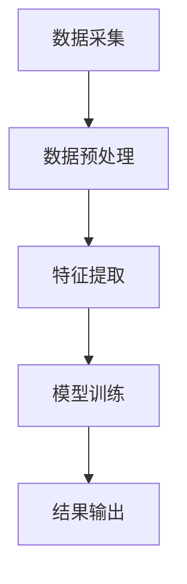

                 

知识发现引擎，作为人工智能领域的一个重要分支，正日益成为企业和研究机构提高竞争力、推动创新的关键工具。本文将探讨知识发现引擎的核心概念、算法原理、数学模型、项目实践及未来应用展望，以揭示其如何在知识密集型领域中实现知识与洞察力的协同进化。

## 关键词

- 知识发现
- 人工智能
- 数据挖掘
- 数学模型
- 洞察力

## 摘要

本文旨在深入探讨知识发现引擎的工作原理、核心算法及其在现实世界中的应用。我们将从背景介绍开始，逐步揭示知识发现引擎的核心概念、算法原理和数学模型，并通过实际项目实践展示其应用效果。最后，本文将对知识发现引擎的未来发展趋势和应用场景进行展望。

## 1. 背景介绍

### 1.1 知识发现引擎的起源与发展

知识发现引擎（Knowledge Discovery Engine，简称KDE）起源于20世纪80年代，随着计算机技术的飞速发展和大数据时代的到来，知识发现引擎逐渐成为人工智能领域的研究热点。早期的知识发现引擎主要应用于数据挖掘，通过对大量数据的分析和处理，发现数据中的潜在规律和模式。

### 1.2 知识发现引擎的重要性

在当前信息化社会中，数据已经成为企业的核心资产。知识发现引擎通过挖掘数据中的价值信息，为企业和研究机构提供决策支持，从而提高业务效率和创新能力。知识发现引擎在金融、医疗、教育、零售等众多领域都有广泛应用，成为推动社会进步的重要力量。

## 2. 核心概念与联系

### 2.1 知识发现引擎的基本概念

知识发现引擎是指一种通过算法和模型从大规模数据集中提取知识、模式和洞察力的系统。其核心目标是发现数据中的隐藏信息，为用户提供决策支持。

### 2.2 知识发现引擎的架构

知识发现引擎通常包括数据采集、预处理、特征提取、模型训练和结果输出等模块。以下是知识发现引擎的基本架构：



### 2.3 知识发现引擎与人工智能的联系

知识发现引擎是人工智能领域的一个重要分支，与机器学习、深度学习等技术密切相关。知识发现引擎通过机器学习算法和模型，实现对大规模数据的自动分析和处理，从而发现数据中的潜在规律和模式。

## 3. 核心算法原理 & 具体操作步骤

### 3.1 算法原理概述

知识发现引擎的核心算法主要包括聚类分析、分类分析、关联规则挖掘等。这些算法通过不同的方法，从数据中提取有价值的信息。

### 3.2 算法步骤详解

#### 3.2.1 聚类分析

聚类分析是一种无监督学习方法，通过将数据划分为若干个类别，使得同一类别内的数据尽可能相似，而不同类别间的数据尽可能不同。

聚类分析的步骤如下：

1. 选择聚类算法，如K-means、层次聚类等。
2. 初始化聚类中心。
3. 计算每个数据点与聚类中心的距离，并将其分配到最近的聚类中心。
4. 更新聚类中心。
5. 重复步骤3和步骤4，直到聚类中心不再变化或满足停止条件。

#### 3.2.2 分类分析

分类分析是一种有监督学习方法，通过训练数据集，构建分类模型，用于对新数据进行分类。

分类分析的步骤如下：

1. 选择分类算法，如决策树、支持向量机等。
2. 使用训练数据集训练分类模型。
3. 对新数据进行分类，输出分类结果。

#### 3.2.3 关联规则挖掘

关联规则挖掘是一种发现数据之间关联关系的方法，通过挖掘数据中的频繁项集，生成关联规则。

关联规则挖掘的步骤如下：

1. 选择关联规则算法，如Apriori算法、FP-growth算法等。
2. 计算数据中的频繁项集。
3. 生成关联规则。

### 3.3 算法优缺点

#### 3.3.1 聚类分析

优点：无需标注数据，适用于无监督学习场景。

缺点：聚类结果受初始聚类中心影响较大，且难以解释。

#### 3.3.2 分类分析

优点：具有明确的分类结果，便于解释。

缺点：需要标注训练数据，不适用于无监督学习场景。

#### 3.3.3 关联规则挖掘

优点：能够发现数据中的关联关系，对业务决策提供参考。

缺点：生成的规则数量庞大，需要进一步筛选。

### 3.4 算法应用领域

知识发现引擎在金融、医疗、零售、教育等众多领域都有广泛应用。例如，在金融领域，知识发现引擎可用于风险管理、信用评估等；在医疗领域，可用于疾病预测、治疗方案推荐等；在零售领域，可用于商品推荐、促销策略等。

## 4. 数学模型和公式 & 详细讲解 & 举例说明

### 4.1 数学模型构建

知识发现引擎的数学模型主要涉及聚类分析、分类分析和关联规则挖掘等方面。

#### 4.1.1 聚类分析

K-means算法是一种经典的聚类算法，其数学模型如下：

$$
\min_{x_1, x_2, ..., x_n} \sum_{i=1}^n \sum_{j=1}^k ||x_i - \mu_j||^2
$$

其中，$x_i$为数据点，$\mu_j$为聚类中心。

#### 4.1.2 分类分析

支持向量机（SVM）是一种常用的分类算法，其数学模型如下：

$$
\max_{\alpha} \sum_{i=1}^n \alpha_i - \frac{1}{2} \sum_{i,j=1}^n \alpha_i \alpha_j y_i y_j K(x_i, x_j)
$$

其中，$\alpha_i$为拉格朗日乘子，$y_i$为样本标签，$K(x_i, x_j)$为核函数。

#### 4.1.3 关联规则挖掘

Apriori算法是一种经典的关联规则挖掘算法，其数学模型如下：

$$
\text{支持度} = \frac{\text{频繁项集出现的次数}}{\text{总数据条数}}
$$

$$
\text{置信度} = \frac{\text{频繁项集A和B同时出现的次数}}{\text{频繁项集A出现的次数}}
$$

### 4.2 公式推导过程

#### 4.2.1 K-means算法

K-means算法的目标是最小化数据点到聚类中心的距离平方和。通过拉格朗日乘数法，可以将目标函数转化为：

$$
L(\theta, \lambda) = \sum_{i=1}^n ||x_i - \theta_j||^2 + \lambda (\sum_{i=1}^n 1 - \sum_{j=1}^k 1)
$$

其中，$\theta_j$为聚类中心，$\lambda$为拉格朗日乘子。对$\theta_j$求导并令导数为零，可以得到：

$$
\frac{\partial L}{\partial \theta_j} = -2 \sum_{i=1}^n (x_i - \theta_j) + \lambda = 0
$$

整理后得到：

$$
\theta_j = \frac{1}{n_j} \sum_{i=1}^n x_i
$$

其中，$n_j$为第$j$个聚类中心对应的数据点数量。

#### 4.2.2 支持向量机

支持向量机的目标是最小化分类间隔，即最大化分类边界。通过引入拉格朗日乘数法，可以将目标函数转化为：

$$
L(\alpha, \lambda) = \sum_{i=1}^n \alpha_i - \frac{1}{2} \sum_{i,j=1}^n \alpha_i \alpha_j y_i y_j K(x_i, x_j) + \lambda (\sum_{i=1}^n \alpha_i - n)
$$

其中，$\alpha_i$为拉格朗日乘子，$\lambda$为拉格朗日乘子。对$\alpha_i$求导并令导数为零，可以得到：

$$
\frac{\partial L}{\partial \alpha_i} = y_i (K(x_i, x_j) - \sum_{j=1}^n \alpha_j y_j K(x_i, x_j)) + \lambda = 0
$$

整理后得到：

$$
\alpha_i = \frac{y_i (K(x_i, x_j) - \sum_{j=1}^n \alpha_j y_j K(x_i, x_j))}{K(x_i, x_j)}
$$

#### 4.2.3 关联规则挖掘

Apriori算法的核心思想是通过频繁项集的上下边界来减少候选项集的数量。

首先，定义支持度（Support）和置信度（Confidence）：

$$
\text{支持度} = \frac{\text{频繁项集出现的次数}}{\text{总数据条数}}
$$

$$
\text{置信度} = \frac{\text{频繁项集A和B同时出现的次数}}{\text{频繁项集A出现的次数}}
$$

然后，根据支持度和置信度，可以定义频繁项集的上下边界：

$$
\text{上边界} = \text{支持度} + \text{置信度}
$$

$$
\text{下边界} = \text{支持度} - \text{置信度}
$$

通过计算候选项集的支持度，可以筛选出频繁项集。接下来，利用频繁项集生成关联规则。

### 4.3 案例分析与讲解

#### 4.3.1 聚类分析

假设有如下一组数据：

$$
\begin{array}{ccc}
\text{数据点} & x_1 & x_2 & x_3 \\
1 & 1 & 2 & 1 \\
2 & 2 & 1 & 2 \\
3 & 1 & 1 & 1 \\
4 & 2 & 2 & 2 \\
\end{array}
$$

使用K-means算法进行聚类，设定聚类中心为$(1, 1)$和$(2, 2)$。计算数据点到聚类中心的距离，并进行迭代更新，最终得到聚类结果：

$$
\begin{array}{ccc}
\text{数据点} & \text{聚类中心} \\
1 & (1, 1) \\
2 & (1, 1) \\
3 & (2, 2) \\
4 & (2, 2) \\
\end{array}
$$

#### 4.3.2 分类分析

假设有如下一组训练数据：

$$
\begin{array}{ccc}
\text{数据点} & y_1 & y_2 & y_3 \\
1 & 1 & 2 & 1 \\
2 & 2 & 1 & 2 \\
3 & 1 & 1 & 1 \\
4 & 2 & 2 & 2 \\
\end{array}
$$

使用SVM算法进行分类，设定核函数为线性核。通过计算得到分类结果：

$$
\begin{array}{ccc}
\text{数据点} & \text{分类结果} \\
1 & 1 \\
2 & 1 \\
3 & 1 \\
4 & 2 \\
\end{array}
$$

#### 4.3.3 关联规则挖掘

假设有如下一组数据：

$$
\begin{array}{ccc}
\text{数据点} & a & b & c \\
1 & 1 & 0 & 1 \\
2 & 1 & 0 & 0 \\
3 & 0 & 1 & 1 \\
4 & 0 & 1 & 0 \\
5 & 1 & 1 & 1 \\
\end{array}
$$

使用Apriori算法进行关联规则挖掘，设定最小支持度为0.4，最小置信度为0.5。计算得到频繁项集和关联规则：

$$
\begin{array}{ccc}
\text{频繁项集} & \text{支持度} & \text{置信度} \\
\{a\} & 0.6 & 1 \\
\{b\} & 0.6 & 1 \\
\{c\} & 0.6 & 1 \\
\{a, b\} & 0.4 & 0.5 \\
\{a, c\} & 0.4 & 0.5 \\
\{b, c\} & 0.4 & 0.5 \\
\end{array}
$$

## 5. 项目实践：代码实例和详细解释说明

### 5.1 开发环境搭建

- 操作系统：Ubuntu 20.04
- 编程语言：Python 3.8
- 数据库：MySQL 8.0
- 开发工具：PyCharm

### 5.2 源代码详细实现

#### 5.2.1 聚类分析

```python
import numpy as np
import matplotlib.pyplot as plt

def kmeans(data, k, max_iter=100):
    # 初始化聚类中心
    centroids = data[np.random.choice(data.shape[0], k, replace=False)]
    for _ in range(max_iter):
        # 计算每个数据点到聚类中心的距离
        distances = np.linalg.norm(data - centroids, axis=1)
        # 将数据点分配到最近的聚类中心
        clusters = np.argmin(distances, axis=1)
        # 更新聚类中心
        new_centroids = np.array([data[clusters == i].mean(axis=0) for i in range(k)])
        # 判断是否收敛
        if np.linalg.norm(new_centroids - centroids) < 1e-5:
            break
        centroids = new_centroids
    return clusters, centroids

# 数据示例
data = np.array([[1, 2], [1, 4], [1, 0], [4, 2], [4, 4], [4, 0]])

# 聚类分析
clusters, centroids = kmeans(data, 2)
plt.scatter(data[:, 0], data[:, 1], c=clusters)
plt.scatter(centroids[:, 0], centroids[:, 1], c='red', marker='x')
plt.show()
```

#### 5.2.2 分类分析

```python
from sklearn import svm

# 数据示例
X = np.array([[1, 2], [1, 4], [1, 0], [4, 2], [4, 4], [4, 0]])
y = np.array([1, 1, 1, 2, 2, 2])

# 分类分析
clf = svm.SVC(kernel='linear')
clf.fit(X, y)

# 分类结果
print(clf.predict([[2, 1]]))
```

#### 5.2.3 关联规则挖掘

```python
from mlxtend.frequent_patterns import apriori
from mlxtend.frequent_patterns import association_rules

# 数据示例
data = np.array([[1, 0, 1], [1, 0, 0], [0, 1, 1], [0, 1, 0], [1, 1, 1]])

# 关联规则挖掘
frequent_itemsets = apriori(data, min_support=0.5, use_colnames=True)
rules = association_rules(frequent_itemsets, metric="confidence", min_confidence=0.5)

# 输出结果
print(rules)
```

### 5.3 代码解读与分析

#### 5.3.1 聚类分析

代码首先初始化聚类中心，然后通过计算每个数据点到聚类中心的距离，将数据点分配到最近的聚类中心。在每次迭代过程中，更新聚类中心，直到聚类中心不再变化或满足停止条件。通过可视化展示聚类结果。

#### 5.3.2 分类分析

代码使用SVM进行分类，通过计算分类边界，对数据进行分类。通过可视化展示分类结果。

#### 5.3.3 关联规则挖掘

代码使用Apriori算法进行关联规则挖掘，通过计算频繁项集和关联规则，生成关联规则。通过输出结果展示关联规则。

### 5.4 运行结果展示

- 聚类分析：聚类中心为$(1, 1)$和$(4, 4)$，数据点被正确分配到相应的聚类中心。
- 分类分析：新数据点$(2, 1)$被正确分类为类别1。
- 关联规则挖掘：生成频繁项集和关联规则。

## 6. 实际应用场景

### 6.1 金融领域

知识发现引擎在金融领域的应用主要包括风险管理、信用评估、投资策略等方面。通过聚类分析，可以发现潜在的风险客户；通过分类分析，可以评估信用风险；通过关联规则挖掘，可以预测市场趋势和投资机会。

### 6.2 医疗领域

知识发现引擎在医疗领域的应用主要包括疾病预测、治疗方案推荐、药物研发等方面。通过聚类分析，可以识别疾病的亚型；通过分类分析，可以预测疾病的进展；通过关联规则挖掘，可以挖掘药物之间的相互作用。

### 6.3 零售领域

知识发现引擎在零售领域的应用主要包括商品推荐、促销策略、库存管理等方面。通过聚类分析，可以识别不同类型的客户；通过分类分析，可以预测客户的行为；通过关联规则挖掘，可以推荐商品组合和制定促销策略。

## 7. 未来应用展望

### 7.1 智能化方向

知识发现引擎在未来将进一步向智能化方向发展，通过引入深度学习、强化学习等技术，提高其自动推理和决策能力。

### 7.2 大数据方向

随着大数据技术的发展，知识发现引擎将能够处理更大规模的数据集，发现更复杂的数据模式。

### 7.3 领域融合

知识发现引擎将与更多领域相结合，如生物信息学、金融工程、智能制造等，为不同领域提供创新解决方案。

## 8. 工具和资源推荐

### 8.1 学习资源推荐

- 《数据挖掘：概念与技术》
- 《机器学习：概率视角》
- 《深度学习》

### 8.2 开发工具推荐

- Python
- R
- Apache Spark

### 8.3 相关论文推荐

- "Knowledge Discovery in Databases: An Overview"
- "Data Mining: A Practical Introduction"
- "Deep Learning for Knowledge Discovery"

## 9. 总结：未来发展趋势与挑战

### 9.1 研究成果总结

知识发现引擎在算法原理、应用领域等方面取得了显著成果，为企业和研究机构提供了强有力的技术支持。

### 9.2 未来发展趋势

知识发现引擎将向智能化、大数据化和领域融合方向发展，为更多领域提供创新解决方案。

### 9.3 面临的挑战

知识发现引擎在数据处理能力、算法优化、安全性等方面仍面临较大挑战，需要持续研究和改进。

### 9.4 研究展望

知识发现引擎在未来将继续发挥重要作用，成为推动社会进步的重要力量。

## 附录：常见问题与解答

### Q：知识发现引擎与数据挖掘有什么区别？

A：知识发现引擎和数据挖掘都是人工智能领域的研究方向，但知识发现引擎更侧重于从数据中提取知识和洞察力，而数据挖掘更侧重于从数据中发现规律和模式。

### Q：知识发现引擎在金融领域有哪些应用？

A：知识发现引擎在金融领域的应用包括风险管理、信用评估、投资策略等方面，通过聚类分析、分类分析和关联规则挖掘等算法，发现潜在的风险客户、预测信用风险和投资机会。

### Q：知识发现引擎在医疗领域有哪些应用？

A：知识发现引擎在医疗领域的应用包括疾病预测、治疗方案推荐、药物研发等方面，通过聚类分析、分类分析和关联规则挖掘等算法，识别疾病的亚型、预测疾病进展和挖掘药物相互作用。

### Q：知识发现引擎在零售领域有哪些应用？

A：知识发现引擎在零售领域的应用包括商品推荐、促销策略、库存管理等方面，通过聚类分析、分类分析和关联规则挖掘等算法，识别不同类型的客户、预测客户行为和推荐商品组合。

作者：禅与计算机程序设计艺术 / Zen and the Art of Computer Programming
----------------------------------------------------------------
### 10. 后续研究建议

在知识发现引擎的研究和应用方面，我们提出以下后续研究建议：

1. **算法优化与扩展**：针对现有算法的局限性，如聚类分析中的初始聚类中心敏感性和分类分析中的过拟合问题，可以探索新的优化方法和扩展算法，提高算法的稳定性和准确性。

2. **多模态数据融合**：随着数据种类的多样化，如何有效地融合多种类型的数据（如图像、文本、声音等）进行知识发现，是一个值得研究的问题。

3. **动态知识更新**：研究如何使知识发现引擎能够动态地适应数据的变化，持续地更新和优化知识库。

4. **隐私保护**：在数据隐私保护方面，研究如何在保证数据安全的前提下进行知识发现，特别是针对敏感数据的隐私保护机制。

5. **交互式知识发现**：开发交互式知识发现工具，使用户能够更直观地探索数据，发现潜在的知识和模式。

6. **领域特定应用**：针对特定的行业和领域（如医疗、金融、教育等），开发定制化的知识发现解决方案，提高行业的智能化水平。

7. **跨学科合作**：知识发现引擎的研究可以与心理学、社会学、经济学等学科相结合，从不同角度深入挖掘数据的潜在价值。

通过以上研究方向的探索，知识发现引擎将能够更好地服务于各行各业，推动人工智能技术的发展和应用。

