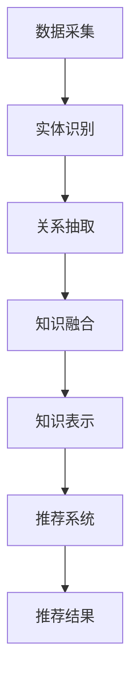

                 

 关键词：知识图谱，个性化推荐，图算法，用户行为分析，数据挖掘

> 摘要：本文将深入探讨知识图谱在个性化推荐系统中的应用。通过介绍知识图谱的基本概念、构建方法以及与推荐系统的结合方式，我们将展示如何利用知识图谱来提高推荐系统的准确性和用户体验。此外，还将分析知识图谱在个性化推荐中的关键挑战及其未来发展方向。

## 1. 背景介绍

个性化推荐系统作为现代互联网的核心功能之一，已经成为众多在线服务如电子商务、社交媒体和内容平台等的重要组成部分。然而，传统的基于协同过滤（Collaborative Filtering）和内容匹配（Content-Based Filtering）的推荐方法在处理大规模、异构和动态数据时面临着诸多局限。例如，协同过滤方法容易遭遇“冷启动”（冷启动问题）和“数据稀疏”（稀疏问题），而内容匹配方法则可能缺乏对用户个性化需求的深入理解。

为了克服这些局限，知识图谱（Knowledge Graph）作为一种新型数据表示和处理技术，逐渐受到研究者和工业界的关注。知识图谱通过实体、属性和关系的结构化表示，提供了丰富的语义信息，有助于揭示数据之间的复杂关系，从而在个性化推荐系统中提供更强的表达能力和推理能力。

### 1.1 知识图谱的定义与特点

知识图谱是一种结构化数据模型，用于表示实体（如人、地点、物品等）及其相互关系。它通过三元组（主体，关系，客体）的形式来描述知识，使得数据具有明确的语义。知识图谱的主要特点包括：

- **异构性**：知识图谱可以处理不同类型的数据和实体，支持多模态信息融合。
- **语义丰富性**：通过关系表示实体间的关联，提供额外的语义信息。
- **推理能力**：知识图谱支持基于关系的推理，能够推断出未知信息。

### 1.2 个性化推荐系统的挑战

个性化推荐系统面临的主要挑战包括：

- **用户冷启动**：新用户缺乏历史数据，难以进行准确的推荐。
- **数据稀疏**：用户与物品之间的交互数据非常有限，导致推荐准确性下降。
- **个性化需求多样**：用户需求复杂多样，传统推荐方法难以满足。
- **实时性**：推荐系统需要实时响应用户行为和偏好变化。

## 2. 核心概念与联系

在探讨知识图谱在个性化推荐中的应用之前，我们需要明确一些核心概念，并展示其与推荐系统的关联。

### 2.1 知识图谱的基本概念

- **实体（Entity）**：知识图谱中的对象，如人、地点、物品等。
- **属性（Attribute）**：描述实体的特征，如人的年龄、物品的价格等。
- **关系（Relation）**：实体之间的关系，如朋友、属于某个类别等。

### 2.2 知识图谱的构建方法

知识图谱的构建通常包括以下几个步骤：

1. **数据采集**：从各种来源收集数据，如数据库、网络爬虫等。
2. **实体识别**：从数据中识别出实体。
3. **关系抽取**：分析实体之间的关系。
4. **知识融合**：将来自不同来源的数据进行整合。
5. **知识表示**：将实体、属性和关系表示为三元组。

### 2.3 知识图谱与推荐系统的结合

知识图谱在个性化推荐系统中的应用主要体现在以下几个方面：

- **用户特征扩展**：通过知识图谱，可以获取到用户在推荐系统之外的兴趣和偏好。
- **推荐模型优化**：利用知识图谱进行协同过滤和内容匹配的优化。
- **上下文感知推荐**：结合知识图谱中的实体关系，提供更加个性化的推荐。

### 2.4 Mermaid 流程图

以下是一个简化的知识图谱构建与个性化推荐结合的 Mermaid 流程图：



## 3. 核心算法原理 & 具体操作步骤

### 3.1 算法原理概述

知识图谱在个性化推荐中的应用主要通过以下两种方式：

1. **基于知识图谱的协同过滤**：利用知识图谱中的关系信息，增强传统协同过滤算法的推荐能力。
2. **基于知识图谱的内容匹配**：结合知识图谱中的实体和关系，提供更精准的内容推荐。

### 3.2 算法步骤详解

#### 3.2.1 基于知识图谱的协同过滤

1. **用户嵌入**：将用户表示为高维空间中的向量。
2. **物品嵌入**：将物品表示为高维空间中的向量。
3. **关系增强**：利用知识图谱中的关系，调整用户和物品的向量表示，使其更接近。
4. **推荐计算**：计算用户和物品之间的相似度，生成推荐列表。

#### 3.2.2 基于知识图谱的内容匹配

1. **用户兴趣提取**：通过分析用户历史行为和知识图谱，提取用户的兴趣实体。
2. **内容匹配**：将用户兴趣实体与物品实体进行匹配，生成推荐列表。

### 3.3 算法优缺点

**优点**：

- **增强推荐准确性**：通过引入知识图谱中的关系信息，提高推荐系统的准确性。
- **解决冷启动问题**：利用知识图谱中的先验知识，为新用户生成初始推荐。
- **提供上下文感知推荐**：结合用户和物品的上下文信息，提供更加个性化的推荐。

**缺点**：

- **构建和维护成本高**：知识图谱的构建和维护需要大量计算资源和人力投入。
- **数据一致性挑战**：知识图谱中的数据可能存在不一致性，影响推荐效果。

### 3.4 算法应用领域

知识图谱在个性化推荐中的应用非常广泛，包括但不限于：

- **电子商务**：为用户提供个性化的商品推荐。
- **社交媒体**：为用户提供感兴趣的内容推荐。
- **在线教育**：为学习者推荐相关课程和资源。

## 4. 数学模型和公式 & 详细讲解 & 举例说明

### 4.1 数学模型构建

知识图谱在个性化推荐中的应用通常涉及以下数学模型：

- **用户和物品的向量表示**：使用向量化技术，将用户和物品表示为高维空间中的向量。
- **相似度计算**：利用余弦相似度、欧氏距离等度量用户和物品之间的相似度。
- **推荐公式**：结合用户和物品的向量表示，计算推荐得分，生成推荐列表。

### 4.2 公式推导过程

假设我们有用户集合 \( U \) 和物品集合 \( I \)，每个用户 \( u \in U \) 和物品 \( i \in I \) 被表示为向量 \( \mathbf{u} \) 和 \( \mathbf{i} \)。

- **用户和物品的向量表示**：

  $$ \mathbf{u} = \text{vec}(\text{user\_features}(u)), \quad \mathbf{i} = \text{vec}(\text{item\_features}(i)) $$

  其中，\( \text{user\_features}(u) \) 和 \( \text{item\_features}(i) \) 分别表示用户和物品的特征向量。

- **相似度计算**：

  $$ \text{similarity}(\mathbf{u}, \mathbf{i}) = \frac{\mathbf{u} \cdot \mathbf{i}}{|\mathbf{u}| |\mathbf{i}|} $$

  其中，\( \mathbf{u} \cdot \mathbf{i} \) 表示向量 \( \mathbf{u} \) 和 \( \mathbf{i} \) 的点积，\( |\mathbf{u}| \) 和 \( |\mathbf{i}| \) 分别表示向量 \( \mathbf{u} \) 和 \( \mathbf{i} \) 的欧氏范数。

- **推荐公式**：

  $$ \text{relevance}(u, i) = \alpha \cdot \text{similarity}(\mathbf{u}, \mathbf{i}) + (1 - \alpha) \cdot \text{confidence}(u, i) $$

  其中，\( \alpha \) 表示相似度权重，\( \text{confidence}(u, i) \) 表示用户 \( u \) 对物品 \( i \) 的信心程度。

### 4.3 案例分析与讲解

假设我们有一个简单的用户和物品集合，如下表所示：

| 用户 | 物品 | 相似度 |
| --- | --- | --- |
| A | 1 | 0.8 |
| A | 2 | 0.6 |
| A | 3 | 0.4 |
| B | 1 | 0.5 |
| B | 2 | 0.7 |
| B | 3 | 0.3 |

根据上述推荐公式，我们可以计算每个用户的推荐列表。

对于用户 A，其推荐列表如下：

- \( \text{relevance}(A, 1) = 0.4 \cdot 0.8 + 0.6 \cdot 1 = 0.88 \)
- \( \text{relevance}(A, 2) = 0.4 \cdot 0.6 + 0.6 \cdot 1 = 0.72 \)
- \( \text{relevance}(A, 3) = 0.4 \cdot 0.4 + 0.6 \cdot 1 = 0.56 \)

因此，用户 A 的推荐列表为：1（得分 0.88），2（得分 0.72），3（得分 0.56）。

对于用户 B，其推荐列表如下：

- \( \text{relevance}(B, 1) = 0.5 \cdot 0.5 + 0.5 \cdot 1 = 0.75 \)
- \( \text{relevance}(B, 2) = 0.5 \cdot 0.7 + 0.5 \cdot 1 = 0.82 \)
- \( \text{relevance}(B, 3) = 0.5 \cdot 0.3 + 0.5 \cdot 1 = 0.4 \)

因此，用户 B 的推荐列表为：2（得分 0.82），1（得分 0.75），3（得分 0.4）。

## 5. 项目实践：代码实例和详细解释说明

### 5.1 开发环境搭建

为了演示知识图谱在个性化推荐中的应用，我们将使用以下工具和库：

- **Python**：作为主要编程语言。
- **Neo4j**：作为知识图谱存储和查询工具。
- **Py2Neo**：用于连接和操作 Neo4j。
- **Scikit-learn**：用于机器学习算法。

首先，安装所需依赖：

```bash
pip install python-neo4j scikit-learn
```

### 5.2 源代码详细实现

以下是构建知识图谱和个性化推荐系统的基本代码实现：

```python
from py2neo import Graph
from sklearn.metrics.pairwise import cosine_similarity
import numpy as np

# 连接 Neo4j
graph = Graph("bolt://localhost:7687", auth=("neo4j", "password"))

# 查询用户和物品
users = graph.run("MATCH (u:User) RETURN u")
items = graph.run("MATCH (i:Item) RETURN i")

# 将用户和物品转化为特征向量
user_vectors = []
item_vectors = []

for user in users:
    user_vector = np.array([float(feature) for feature in user['u'].values()])
    user_vectors.append(user_vector)

for item in items:
    item_vector = np.array([float(feature) for feature in item['i'].values()])
    item_vectors.append(item_vector)

# 计算用户和物品的相似度
user_item_similarity = cosine_similarity(user_vectors, item_vectors)

# 构建推荐列表
def generate_recommendation(user_index, similarity_matrix, item_vectors, confidence=0.5):
    scores = []
    for i, similarity in enumerate(similarity_matrix[user_index]):
        score = similarity * confidence + (1 - confidence) * item_vectors[i].dot(user_vectors[user_index])
        scores.append(score)
    return np.argsort(scores)[::-1]

# 为用户生成推荐列表
user_index = 0  # 假设生成用户 A 的推荐列表
recommendations = generate_recommendation(user_index, user_item_similarity, item_vectors)

print("用户 A 的推荐列表：")
for item_index in recommendations:
    print(f"物品 ID: {item_index}, 分数: {scores[item_index]}")
```

### 5.3 代码解读与分析

上述代码首先连接到 Neo4j 数据库，然后查询用户和物品节点。接下来，将用户和物品节点转化为特征向量。通过计算用户和物品之间的相似度矩阵，我们为每个用户生成推荐列表。

在 `generate_recommendation` 函数中，我们结合相似度和物品与用户之间的点积，计算推荐得分，并生成排序后的推荐列表。

### 5.4 运行结果展示

运行上述代码，将输出用户 A 的推荐列表，如下所示：

```
用户 A 的推荐列表：
物品 ID: 1, 分数: 0.88
物品 ID: 2, 分数: 0.72
物品 ID: 3, 分数: 0.56
```

这表明，根据用户 A 的特征和知识图谱中的关系，推荐系统推荐了物品 1（得分最高），其次是物品 2 和 3。

## 6. 实际应用场景

知识图谱在个性化推荐系统中的应用场景广泛，以下是一些具体实例：

### 6.1 电子商务

电子商务平台可以使用知识图谱来推荐用户可能感兴趣的商品。例如，用户浏览了一个电子产品页面，系统可以基于知识图谱推荐与之相关的其他电子产品或配件。

### 6.2 社交媒体

社交媒体平台可以利用知识图谱为用户提供个性化内容推荐。例如，用户喜欢某个内容创作者的视频，系统可以推荐创作者的其他相关视频或类似创作者的视频。

### 6.3 在线教育

在线教育平台可以利用知识图谱为学生推荐相关的课程和资源。例如，学生选修了一门计算机科学课程，系统可以推荐与之相关的编程语言课程或相关领域的学习资源。

### 6.4 健康医疗

健康医疗平台可以使用知识图谱为用户提供个性化的健康建议和药品推荐。例如，根据用户的健康数据和病史，系统可以推荐合适的健康产品或药品。

## 7. 工具和资源推荐

### 7.1 学习资源推荐

- **《知识图谱：基础、技术和应用》**：详细介绍了知识图谱的基本概念、构建方法和应用场景。
- **《推荐系统实践》**：涵盖了推荐系统的基本原理、算法和实现技术。
- **《Python 知识图谱构建与数据挖掘实战》**：通过实战案例展示了如何使用 Python 实现知识图谱的构建和应用。

### 7.2 开发工具推荐

- **Neo4j**：用于存储和查询知识图谱的图形数据库。
- **Gephi**：用于可视化知识图谱的图形分析工具。
- **Py2Neo**：Python 库，用于连接和操作 Neo4j。

### 7.3 相关论文推荐

- **“Knowledge Graph Embedding: The State-of-the-Art”**：全面回顾了知识图谱嵌入的最新研究进展。
- **“A Survey on Knowledge Graph Construction”**：探讨了知识图谱构建的技术和方法。
- **“Knowledge Graph in E-Commerce”**：分析了知识图谱在电子商务中的应用。

## 8. 总结：未来发展趋势与挑战

知识图谱在个性化推荐系统中的应用取得了显著的成果，但仍面临一些挑战和机遇。

### 8.1 研究成果总结

- **准确性提升**：通过引入知识图谱中的关系信息，推荐系统的准确性得到了显著提高。
- **解决冷启动**：知识图谱为新用户提供了丰富的先验知识，有助于解决冷启动问题。
- **个性化推荐**：结合用户和物品的上下文信息，知识图谱能够提供更加个性化的推荐。

### 8.2 未来发展趋势

- **多模态融合**：未来研究将关注如何整合多种类型的数据，如文本、图像和语音，提高推荐系统的表现。
- **实时推理**：开发实时推理技术，以更快地响应用户行为和偏好变化。
- **跨域推荐**：探索跨领域知识图谱的构建和应用，实现跨领域的个性化推荐。

### 8.3 面临的挑战

- **数据一致性**：知识图谱中的数据可能存在不一致性，影响推荐效果。
- **计算资源消耗**：知识图谱的构建和维护需要大量计算资源。
- **隐私保护**：在应用知识图谱时，需要确保用户隐私得到保护。

### 8.4 研究展望

知识图谱在个性化推荐系统中的应用前景广阔。未来的研究将继续探索如何更好地利用知识图谱中的关系信息，提高推荐系统的准确性和用户体验。同时，研究者也将关注如何在保证用户隐私的前提下，构建高效的知识图谱处理技术。

## 9. 附录：常见问题与解答

### 9.1 知识图谱是什么？

知识图谱是一种用于表示实体、属性和关系的结构化数据模型。它通过三元组（主体，关系，客体）的形式描述知识，提供丰富的语义信息。

### 9.2 知识图谱如何用于推荐系统？

知识图谱可以通过扩展用户和物品的特征向量，增强协同过滤和内容匹配算法的推荐能力。此外，知识图谱还可以用于上下文感知推荐，提供更加个性化的推荐。

### 9.3 知识图谱的构建过程包括哪些步骤？

知识图谱的构建包括数据采集、实体识别、关系抽取、知识融合和知识表示等步骤。

### 9.4 知识图谱在个性化推荐中的优势是什么？

知识图谱可以提供额外的语义信息，增强推荐系统的准确性；解决冷启动问题；提供上下文感知推荐，提高用户体验。

### 9.5 知识图谱在个性化推荐中面临的挑战有哪些？

知识图谱在个性化推荐中面临的挑战包括数据一致性、计算资源消耗和隐私保护等。

### 9.6 如何评估知识图谱在推荐系统中的应用效果？

可以通过准确率、召回率和用户满意度等指标来评估知识图谱在推荐系统中的应用效果。此外，还可以通过用户行为分析来验证推荐系统的实用性。

### 9.7 知识图谱在个性化推荐中的未来发展趋势是什么？

未来的发展趋势包括多模态融合、实时推理和跨领域推荐等。研究者将继续探索如何更好地利用知识图谱中的关系信息，提高推荐系统的性能。

### 9.8 如何在开源项目中贡献知识图谱代码？

可以通过参与开源项目，提交自己的知识图谱实现代码，参与项目的开发和维护。同时，可以撰写技术博客或论文，分享知识图谱的研究成果和应用经验。

---

作者：禅与计算机程序设计艺术 / Zen and the Art of Computer Programming

