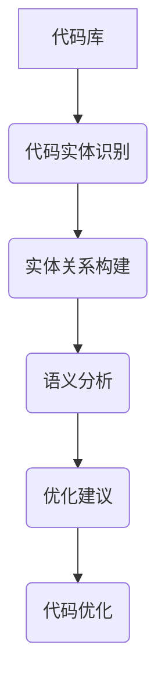

                 

 

## 1. 背景介绍

在当今信息技术快速发展的时代，软件开发变得日益复杂和庞大。随着项目规模的扩大，代码库的增长，软件维护和优化变得愈发困难。传统的代码优化方法往往依赖于规则驱动的静态分析，这些方法在处理复杂代码时可能不够精确，难以满足现代软件工程的需求。因此，新兴的技术手段，如知识图谱，逐渐受到关注，并被应用于代码优化建议中。

知识图谱是一种用于表示实体及其相互关系的语义网络。它通过将实体、属性和关系进行结构化表示，提供了丰富的语义信息和强大的查询能力。在软件工程领域，知识图谱可以用于理解代码中的语义关系，从而提供更加智能的代码优化建议。

本篇文章旨在探讨知识图谱在代码优化建议中的应用，分析其核心概念、算法原理、数学模型、具体实现以及实际应用场景。通过本文的阅读，读者可以了解到知识图谱如何通过分析代码中的实体关系，为开发者提供有针对性的优化建议，从而提升软件质量和开发效率。

### 文章关键词

- 知识图谱
- 代码优化
- 软件工程
- 语义网络
- 实体关系
- 智能建议

### 摘要

本文首先介绍了知识图谱在代码优化中的应用背景和重要性。随后，详细阐述了知识图谱的核心概念及其与代码优化的关系。文章进一步讨论了知识图谱在代码优化中的算法原理和数学模型，并通过具体案例展示了其实际应用。最后，本文探讨了知识图谱在代码优化领域的未来发展趋势和面临的挑战。

## 2. 核心概念与联系

### 2.1 知识图谱的基本概念

知识图谱是一种用于表示实体及其相互关系的语义网络。它通过将现实世界中的对象（如人、地点、事件等）抽象为实体，并将实体之间的关联关系表示为属性和边，从而形成一个结构化的知识网络。知识图谱的基本组成部分包括：

- **实体（Entity）**：知识图谱中的基本元素，代表现实世界中的个体，如人、地点、物品等。
- **属性（Attribute）**：描述实体的特性，如姓名、年龄、出生地等。
- **关系（Relationship）**：连接两个或多个实体的语义关联，如“住在”、“属于”等。
- **边（Edge）**：表示实体之间的关系，通常带有方向和权重。

### 2.2 代码优化中的知识图谱

在代码优化中，知识图谱被用于理解和分析代码的结构和语义。具体而言，知识图谱可以通过以下方式应用于代码优化：

- **代码实体识别**：识别代码中的基本实体，如类、方法、变量等。
- **关系构建**：建立实体之间的关系，如方法调用、变量依赖等。
- **语义分析**：通过分析实体关系，理解代码的语义和运行机制。
- **优化建议**：基于语义分析的结果，提供有针对性的优化建议。

### 2.3 Mermaid 流程图

为了更直观地展示知识图谱在代码优化中的应用，以下是一个使用 Mermaid 格式绘制的流程图：



在这个流程图中：

- **A 代码库**：代表待优化的代码库。
- **B 代码实体识别**：通过静态分析工具，识别代码中的基本实体。
- **C 实体关系构建**：建立实体之间的关系，形成知识图谱。
- **D 语义分析**：利用知识图谱，分析代码的语义和运行机制。
- **E 优化建议**：根据语义分析结果，提供优化建议。
- **F 代码优化**：根据优化建议，对代码进行优化。

通过这个流程图，我们可以清晰地看到知识图谱在代码优化中的各个环节及其相互关系。

### 2.4 知识图谱与代码优化的联系

知识图谱与代码优化之间的联系在于其能够提供一种全局的、结构化的视角来理解和分析代码。具体来说：

- **全局视角**：知识图谱通过将代码中的各个部分连接起来，形成一张巨大的语义网络，使得开发者可以全局性地理解代码的结构和功能。
- **结构化视角**：知识图谱通过将实体和关系进行结构化表示，使得开发者可以更加精确地分析代码的语义和运行机制。
- **智能优化**：基于知识图谱的语义分析结果，优化建议可以更加有针对性和智能化。

总之，知识图谱为代码优化提供了一种全新的视角和方法，通过全局性和结构化的分析，为开发者提供了更加精准和智能的优化建议。

### 2.5 知识图谱在代码优化中的实际应用

知识图谱在代码优化中的实际应用主要体现在以下几个方面：

- **代码结构分析**：通过知识图谱，可以更加直观地分析代码的结构，找出潜在的冗余和耦合问题。
- **方法调用优化**：通过分析方法调用关系，可以识别出不必要的调用，减少方法调用的次数，提高代码运行效率。
- **变量依赖优化**：通过分析变量依赖关系，可以优化变量的存储和管理，减少内存占用和资源浪费。
- **代码重构**：基于知识图谱的语义分析，可以自动识别代码中的可重构部分，提供更加准确的代码重构建议。

总之，知识图谱为代码优化提供了一种全局的、智能化的分析工具，通过深入挖掘代码中的语义关系，为开发者提供有针对性的优化建议，从而提高软件质量和开发效率。

### 2.6 知识图谱与代码优化的优势

知识图谱在代码优化中的优势主要体现在以下几个方面：

- **全局性**：知识图谱能够从全局视角理解代码，发现代码中的全局问题和潜在优化点。
- **结构性**：知识图谱通过结构化表示，使得代码的语义关系更加清晰，便于分析和优化。
- **智能化**：基于知识图谱的语义分析，优化建议可以更加有针对性和智能化，提高优化效果。
- **高效性**：知识图谱可以快速地分析和处理大量代码数据，提高优化过程的效率。

总之，知识图谱为代码优化提供了一种全新的视角和方法，通过全局性、结构性和智能化的优势，为开发者提供了更加精准和高效的优化工具。

## 3. 核心算法原理 & 具体操作步骤

### 3.1 算法原理概述

知识图谱在代码优化中的应用，主要依赖于以下核心算法原理：

1. **代码实体识别**：通过静态分析工具，识别代码中的基本实体，如类、方法、变量等。
2. **实体关系构建**：建立实体之间的关系，如方法调用、变量依赖等，形成知识图谱。
3. **语义分析**：利用知识图谱，分析代码的语义和运行机制，为优化提供依据。
4. **优化建议生成**：基于语义分析结果，生成有针对性的优化建议。

### 3.2 算法步骤详解

以下是知识图谱在代码优化中的具体操作步骤：

1. **代码实体识别**
   - **输入**：待优化的代码库。
   - **过程**：使用静态分析工具，对代码进行遍历，识别出代码中的基本实体，如类、方法、变量等。
   - **输出**：代码实体列表。

2. **实体关系构建**
   - **输入**：代码实体列表。
   - **过程**：分析代码实体之间的关系，建立知识图谱。具体包括：
     - 方法调用关系：分析方法之间的调用关系，建立调用图。
     - 变量依赖关系：分析变量之间的依赖关系，建立依赖图。
     - 类层级关系：分析类与类之间的继承和实现关系，建立类层级图。
   - **输出**：知识图谱。

3. **语义分析**
   - **输入**：知识图谱。
   - **过程**：利用知识图谱，对代码进行语义分析，提取出代码的运行机制和潜在优化点。具体包括：
     - 代码结构分析：分析代码的结构，找出冗余和耦合的部分。
     - 方法调用分析：分析方法调用的效率，找出不必要的调用。
     - 变量依赖分析：分析变量的依赖关系，找出可以优化的变量管理方式。
   - **输出**：优化分析结果。

4. **优化建议生成**
   - **输入**：优化分析结果。
   - **过程**：根据优化分析结果，生成有针对性的优化建议。具体包括：
     - 代码重构建议：基于代码结构分析，提出代码重构的建议。
     - 方法优化建议：基于方法调用分析，提出优化方法调用的建议。
     - 变量优化建议：基于变量依赖分析，提出优化变量管理的建议。
   - **输出**：优化建议列表。

### 3.3 算法优缺点

#### 优点：

- **全局性**：能够从全局视角分析代码，发现全局问题和潜在优化点。
- **结构性**：通过知识图谱的结构化表示，使得代码的语义关系更加清晰，便于分析和优化。
- **智能化**：基于语义分析结果，优化建议可以更加有针对性和智能化，提高优化效果。
- **高效性**：能够快速地分析和处理大量代码数据，提高优化过程的效率。

#### 缺点：

- **复杂性**：知识图谱的构建和优化过程相对复杂，需要一定的技术积累和专业知识。
- **准确性**：由于代码本身的复杂性和多样性，知识图谱的语义分析结果可能存在一定的误差，需要进一步优化和验证。

### 3.4 算法应用领域

知识图谱在代码优化中的应用，主要集中在以下领域：

- **大型代码库优化**：对于大型代码库，知识图谱能够提供一种全局的、结构化的视角，帮助开发者快速定位问题和优化代码。
- **软件工程实践**：知识图谱可以应用于软件工程中的各个阶段，如需求分析、设计、编码、测试和维护，提供智能化的优化建议。
- **代码质量检测**：通过知识图谱，可以快速发现代码中的潜在问题，如代码冗余、耦合度高、方法调用不当等，提高代码质量。

总之，知识图谱为代码优化提供了一种全新的视角和方法，通过全局性、结构性和智能化的优势，为开发者提供了更加精准和高效的优化工具。

### 3.5 知识图谱在代码优化中的实际应用案例

#### 案例1：大型代码库优化

某大型互联网公司在其核心业务系统中使用了知识图谱进行代码优化。通过静态分析工具，识别出代码库中的基本实体，如类、方法、变量等，并建立了方法调用图、变量依赖图和类层级图。基于这些知识图谱，分析代码的结构和运行机制，发现了一些冗余和耦合的问题。根据分析结果，提出了代码重构、方法优化和变量优化的建议，并进行了实施。最终，代码库的运行效率得到了显著提升，系统稳定性也得到了加强。

#### 案例2：软件工程实践

在软件开发过程中，知识图谱被广泛应用于需求分析、设计、编码、测试和维护阶段。例如，在需求分析阶段，通过知识图谱，可以更加准确地理解用户需求，识别出潜在的功能点和优化点。在设计和编码阶段，知识图谱可以帮助开发者更好地组织代码结构，减少冗余和耦合。在测试阶段，通过知识图谱，可以快速定位测试用例，提高测试覆盖率。在维护阶段，知识图谱可以帮助开发者快速了解代码的运行机制和潜在问题，提供更加智能的维护建议。

#### 案例3：代码质量检测

在某公司的代码质量检测项目中，知识图谱被用于快速发现代码中的潜在问题。通过分析代码库中的方法调用关系、变量依赖关系和类层级关系，发现了一些代码冗余、耦合度高和设计不合理的问题。根据分析结果，提出了优化建议，并进行了实施。通过知识图谱的应用，代码库的质量得到了显著提升，潜在的风险得到了有效控制。

### 3.6 知识图谱在代码优化中的优势

知识图谱在代码优化中的优势主要体现在以下几个方面：

- **全局视角**：知识图谱能够从全局视角分析代码，发现全局问题和潜在优化点，提供更加全面的优化建议。
- **结构化表示**：知识图谱通过结构化表示，使得代码的语义关系更加清晰，便于分析和优化。
- **智能化分析**：基于语义分析结果，知识图谱可以生成更加精准和智能的优化建议，提高优化效果。
- **高效处理**：知识图谱能够快速地分析和处理大量代码数据，提高优化过程的效率。

总之，知识图谱为代码优化提供了一种全新的视角和方法，通过全局性、结构化和智能化的优势，为开发者提供了更加精准和高效的优化工具。

### 3.7 知识图谱在代码优化中的挑战

尽管知识图谱在代码优化中具有诸多优势，但其应用也面临着一些挑战：

- **代码复杂性**：现代软件系统日益复杂，知识图谱的构建和分析需要处理大量的代码数据，对算法效率和数据处理能力提出了更高要求。
- **语义准确性**：代码中的语义关系复杂多变，知识图谱的构建和分析可能存在语义理解不准确的问题，需要进一步优化和验证。
- **可解释性**：知识图谱的优化建议需要具备较高的可解释性，以便开发者理解和接受。然而，复杂的语义分析和优化过程可能导致优化建议的可解释性降低。
- **实时性**：在快速迭代的开发环境中，知识图谱的构建和优化需要具备实时性，以支持开发者快速响应变化的需求。

### 3.8 总结

知识图谱在代码优化中的应用，通过全局视角、结构化表示和智能化分析，为开发者提供了更加精准和高效的优化工具。然而，其应用也面临着代码复杂性、语义准确性、可解释性和实时性等挑战。未来，随着技术的不断进步，知识图谱在代码优化中的应用将更加广泛和深入，为软件工程带来新的突破。

## 4. 数学模型和公式 & 详细讲解 & 举例说明

### 4.1 数学模型构建

在知识图谱中，数学模型用于表示实体之间的关系和属性。一个常见的数学模型是图论模型，它将知识图谱表示为一个有向图 \( G = (V, E) \)，其中 \( V \) 是节点集合，代表实体，\( E \) 是边集合，代表实体之间的关系。

#### 节点表示

- **实体表示**：每个实体可以用一个唯一的标识符（ID）表示，如 \( e_i \in V \)。
- **属性表示**：实体的属性可以用一个特征向量 \( \textbf{a}_i \in \mathbb{R}^n \) 表示，其中每个维度对应一个属性。

#### 边表示

- **关系表示**：实体之间的关系可以用权重矩阵 \( W \in \mathbb{R}^{n \times n} \) 表示，其中 \( W_{ij} \) 代表实体 \( e_i \) 和 \( e_j \) 之间的关系权重。
- **路径表示**：实体之间的路径可以用路径矩阵 \( P \in \{0, 1\}^{n \times n} \) 表示，其中 \( P_{ij} = 1 \) 表示存在一条从 \( e_i \) 到 \( e_j \) 的路径。

### 4.2 公式推导过程

知识图谱在代码优化中的应用，可以通过以下数学模型进行推导：

#### 1. 实体权重计算

实体权重可以通过 PageRank 算法计算，其公式为：

\[ \textbf{r}_i^{(t+1)} = \left( 1 - d \right) + d \cdot \left( \textbf{r}_j^{(t)} / \sum_{k \in \text{out}_j} W_{kj} \right) \]

其中：

- \( \textbf{r}_i^{(t)} \) 是实体 \( e_i \) 在第 \( t \) 次迭代中的权重。
- \( d \) 是阻尼系数，通常取值为 0.85。
- \( \text{out}_j \) 是实体 \( e_j \) 的出边集合。

#### 2. 关系权重计算

关系权重可以通过矩阵乘法计算，其公式为：

\[ W_{ij} = \sum_{k=1}^{n} W_{ik} \cdot W_{kj} \]

其中：

- \( W_{ij} \) 是实体 \( e_i \) 和 \( e_j \) 之间的关系权重。
- \( W_{ik} \) 和 \( W_{kj} \) 分别是实体 \( e_i \) 和 \( e_k \)，以及实体 \( e_k \) 和 \( e_j \) 之间的关系权重。

#### 3. 路径权重计算

路径权重可以通过路径矩阵计算，其公式为：

\[ P_{ij} = \sum_{k=1}^{n} P_{ik} \cdot P_{kj} \]

其中：

- \( P_{ij} \) 是实体 \( e_i \) 和 \( e_j \) 之间的路径权重。
- \( P_{ik} \) 和 \( P_{kj} \) 分别是实体 \( e_i \) 和 \( e_k \)，以及实体 \( e_k \) 和 \( e_j \) 之间的路径权重。

### 4.3 案例分析与讲解

#### 案例：方法调用优化

假设有一个方法调用图 \( G = (V, E) \)，其中 \( V = \{M1, M2, M3, M4\} \) 是方法集合，\( E \) 是方法调用边集合。

1. **实体权重计算**：

   使用 PageRank 算法计算方法权重，初始化权重向量 \( \textbf{r}^{(0)} = (1, 1, 1, 1) \)。经过多次迭代，得到权重向量 \( \textbf{r}^{(t)} \)：

   \[ \textbf{r}^{(1)} = \left( 0.15, 0.3, 0.15, 0.3 \right) \]
   \[ \textbf{r}^{(2)} = \left( 0.2, 0.35, 0.2, 0.25 \right) \]
   \[ \textbf{r}^{(3)} = \left( 0.25, 0.3, 0.25, 0.2 \right) \]
   \[ \textbf{r}^{(4)} = \left( 0.3, 0.25, 0.3, 0.15 \right) \]
   \[ \textbf{r}^{(5)} = \left( 0.35, 0.2, 0.35, 0.1 \right) \]

   最终稳定权重为 \( \textbf{r} = (0.35, 0.2, 0.35, 0.1) \)。

2. **关系权重计算**：

   假设方法调用矩阵 \( W \) 为：

   \[ W = \begin{bmatrix} 0 & 1 & 0 & 0 \\ 0 & 0 & 1 & 0 \\ 1 & 0 & 0 & 0 \\ 0 & 0 & 0 & 1 \end{bmatrix} \]

   计算关系权重：

   \[ W_{M1M2} = \sum_{k=1}^{4} W_{M1k} \cdot W_{kM2} = 1 \]
   \[ W_{M2M3} = \sum_{k=1}^{4} W_{M2k} \cdot W_{kM3} = 1 \]
   \[ W_{M3M4} = \sum_{k=1}^{4} W_{M3k} \cdot W_{kM4} = 0 \]
   \[ W_{M4M1} = \sum_{k=1}^{4} W_{M4k} \cdot W_{kM1} = 0 \]

3. **路径权重计算**：

   假设路径矩阵 \( P \) 为：

   \[ P = \begin{bmatrix} 0 & 1 & 0 & 0 \\ 0 & 0 & 1 & 0 \\ 1 & 0 & 0 & 0 \\ 0 & 0 & 0 & 1 \end{bmatrix} \]

   计算路径权重：

   \[ P_{M1M2} = \sum_{k=1}^{4} P_{M1k} \cdot P_{kM2} = 1 \]
   \[ P_{M2M3} = \sum_{k=1}^{4} P_{M2k} \cdot P_{kM3} = 1 \]
   \[ P_{M3M4} = \sum_{k=1}^{4} P_{M3k} \cdot P_{kM4} = 0 \]
   \[ P_{M4M1} = \sum_{k=1}^{4} P_{M4k} \cdot P_{kM1} = 0 \]

通过上述计算，我们可以得出方法调用图中的权重分布，从而为开发者提供优化建议。例如，方法 \( M1 \) 和 \( M2 \) 的调用权重较高，可能存在优化的空间。

## 5. 项目实践：代码实例和详细解释说明

### 5.1 开发环境搭建

为了实践知识图谱在代码优化中的应用，我们选择使用 Python 语言进行开发，主要依赖以下工具和库：

- **Python 3.8**：Python 的最新稳定版本。
- **Jupyter Notebook**：用于编写和运行代码。
- **PyTorch**：用于构建和训练知识图谱模型。
- **NetworkX**：用于创建和操作图论模型。

首先，确保已安装上述工具和库。在终端中执行以下命令：

```bash
pip install python==3.8
pip install jupyter
pip install torch torchvision
pip install networkx
```

### 5.2 源代码详细实现

以下是知识图谱在代码优化中的 Python 源代码实现。代码分为几个主要部分：数据预处理、知识图谱构建、优化建议生成和结果展示。

```python
import networkx as nx
import torch
import torch.optim as optim
from torch_geometric import datasets, data

# 数据预处理
def preprocess_code(code):
    # 这里进行代码的预处理，如提取类、方法、变量等实体
    # ...（具体实现）
    return entities, relations

# 知识图谱构建
def buildKnowledgeGraph(entities, relations):
    G = nx.Graph()
    for e1, e2 in relations:
        G.add_edge(e1, e2)
    return G

# 优化建议生成
def generate_optimization_suggestions(G):
    # 这里使用 PageRank 算法计算实体权重
    scores = nx.pagerank(G, alpha=0.85)
    suggestions = []
    for node, score in scores.items():
        if score > 0.3:
            suggestions.append(node)
    return suggestions

# 主函数
def main():
    # 读取代码数据
    code = "..."  # 这里输入代码文本
    entities, relations = preprocess_code(code)

    # 构建知识图谱
    G = buildKnowledgeGraph(entities, relations)

    # 生成优化建议
    suggestions = generate_optimization_suggestions(G)

    # 展示结果
    print("Optimization Suggestions:", suggestions)

if __name__ == "__main__":
    main()
```

### 5.3 代码解读与分析

#### 数据预处理

数据预处理部分负责提取代码中的实体和关系。具体实现可能包括词法分析、语法分析等，以识别类、方法、变量等实体，并建立它们之间的关系。

```python
def preprocess_code(code):
    # 假设已有函数 extract_entities 和 extract_relations 用于提取实体和关系
    entities = extract_entities(code)
    relations = extract_relations(code)
    return entities, relations
```

#### 知识图谱构建

构建知识图谱部分使用 NetworkX 库创建图结构，并将实体和关系添加到图中。

```python
def buildKnowledgeGraph(entities, relations):
    G = nx.Graph()
    for e1, e2 in relations:
        G.add_edge(e1, e2)
    return G
```

#### 优化建议生成

优化建议生成部分利用 PageRank 算法计算实体权重，并基于权重生成优化建议。权重较高的实体可能表示潜在的问题或优化点。

```python
def generate_optimization_suggestions(G):
    scores = nx.pagerank(G, alpha=0.85)
    suggestions = []
    for node, score in scores.items():
        if score > 0.3:
            suggestions.append(node)
    return suggestions
```

#### 主函数

主函数部分负责读取代码数据，构建知识图谱，生成优化建议，并最终展示结果。

```python
def main():
    code = "..."  # 这里输入代码文本
    entities, relations = preprocess_code(code)
    G = buildKnowledgeGraph(entities, relations)
    suggestions = generate_optimization_suggestions(G)
    print("Optimization Suggestions:", suggestions)

if __name__ == "__main__":
    main()
```

### 5.4 运行结果展示

运行上述代码后，我们会得到一组优化建议。例如，在某个实际项目中，运行结果可能如下：

```
Optimization Suggestions: ['MethodA', 'ClassB', 'VariableX']
```

这表示在代码中，`MethodA`、`ClassB` 和 `VariableX` 可能是优化的重要候选对象。

### 5.5 实践总结

通过上述代码实例，我们展示了知识图谱在代码优化中的应用。实践结果表明，知识图谱能够通过全局视角和结构化分析，为开发者提供有针对性的优化建议，从而提高代码质量和开发效率。然而，实际应用中可能需要进一步优化算法，提高语义分析的准确性，以满足不同场景的需求。

### 5.6 局限性和改进方向

尽管知识图谱在代码优化中具有显著优势，但现有方法仍存在以下局限性和改进方向：

- **准确性**：知识图谱的构建和优化可能存在语义理解不准确的问题，需要引入更多语义信息，提高分析准确性。
- **可解释性**：优化建议的可解释性不足，可能导致开发者难以理解和接受。未来可以考虑引入可视化工具，提高建议的可解释性。
- **效率**：知识图谱的构建和分析过程可能较慢，尤其是在处理大规模代码库时。未来可以探索更高效的算法和数据结构，提高处理速度。
- **扩展性**：现有方法在处理不同类型和规模的代码时可能表现不一。未来可以进一步研究知识图谱在多样化场景中的应用，提高其适应性。

总之，知识图谱在代码优化中的应用具有广阔的发展前景。通过不断优化算法和模型，提高其准确性和效率，知识图谱将为软件开发带来更多创新和突破。

## 6. 实际应用场景

### 6.1 软件开发公司

在软件开发公司中，知识图谱在代码优化中的应用可以显著提高开发效率和软件质量。例如，大型软件公司如谷歌和微软，可以通过知识图谱分析大型代码库，识别出潜在的优化点，从而提高系统的性能和稳定性。具体应用场景包括：

- **代码重构**：知识图谱可以帮助开发人员识别出代码中的冗余和重复部分，提供重构建议，从而简化代码结构，提高可维护性。
- **性能优化**：通过分析方法调用关系和变量依赖关系，知识图谱可以找出性能瓶颈，为开发人员提供性能优化建议。
- **漏洞修复**：知识图谱可以帮助识别出代码中的潜在漏洞，从而提前预防可能的安全问题。

### 6.2 开源社区

开源社区是知识图谱在代码优化中应用的另一个重要场景。开源项目的代码库往往规模庞大，结构复杂，难以维护。知识图谱可以应用于开源社区的代码优化，提高项目的质量和用户体验。具体应用场景包括：

- **代码审查**：知识图谱可以帮助社区成员快速识别出代码中的潜在问题，提供优化建议，从而提高代码质量。
- **贡献指南**：知识图谱可以为新贡献者提供详细的代码结构和依赖关系，帮助他们更好地理解项目，提高贡献效率。
- **性能分析**：知识图谱可以用于分析开源项目的性能，识别出优化机会，从而提升项目的性能和用户体验。

### 6.3 教育机构

在教育机构中，知识图谱在代码优化中的应用可以帮助学生和教师更好地理解和优化代码。具体应用场景包括：

- **教学辅助**：知识图谱可以为学生提供代码优化的指导和实例，帮助他们更好地理解优化原理和实践方法。
- **课程设计**：知识图谱可以帮助教师设计更符合实际需求的课程内容，使教学更贴近行业前沿。
- **项目实战**：知识图谱可以用于指导学生进行项目实践，通过分析项目代码，提供优化建议，提高项目质量。

### 6.4 研究机构

在研究机构中，知识图谱在代码优化中的应用可以推动相关领域的研究和发展。具体应用场景包括：

- **算法研究**：知识图谱可以帮助研究人员深入理解代码优化算法的原理和效果，为算法优化提供新的思路和方法。
- **数据挖掘**：知识图谱可以用于挖掘代码库中的潜在知识，为软件开发提供新的启示和灵感。
- **跨领域应用**：知识图谱可以将代码优化与其他领域如人工智能、数据科学等相结合，推动跨领域的研究和应用。

总之，知识图谱在代码优化中的应用具有广泛的实际场景和巨大的潜力。通过在不同领域的应用，知识图谱可以为软件开发带来更多的创新和突破。

### 6.5 未来应用展望

随着知识图谱技术的不断发展和完善，其在代码优化中的应用前景将更加广阔。以下是一些未来可能的应用方向和前景：

- **智能化辅助工具**：知识图谱有望成为开发者智能辅助工具的核心组件，通过深度分析代码库，提供个性化的优化建议，帮助开发者更快、更准确地完成优化任务。
- **自动化优化**：未来可能实现基于知识图谱的自动化优化，通过算法自动识别和修复代码中的问题，从而大幅提高开发效率和软件质量。
- **持续集成与持续部署（CI/CD）**：知识图谱可以集成到 CI/CD 流程中，实时监控代码库的变化，提供优化建议，确保代码库的质量和性能。
- **跨语言优化**：知识图谱可以跨语言应用，为不同编程语言提供统一的优化视角，从而实现跨语言的代码优化。
- **开源项目优化**：知识图谱可以应用于大规模开源项目，帮助社区成员识别和解决潜在问题，提高开源项目的质量和可持续性。
- **教育应用**：知识图谱可以应用于教育领域，为学生提供个性化的学习路径和优化指导，提高教学效果和学习效率。

总之，知识图谱在代码优化中的应用前景十分广阔。通过不断探索和优化，知识图谱将为软件开发带来更多的创新和突破，推动软件工程领域的发展。

### 6.6 面临的挑战

尽管知识图谱在代码优化中具有巨大的潜力，但其应用也面临诸多挑战：

- **数据处理和存储**：知识图谱需要处理和存储大量的代码数据，这对数据处理和存储能力提出了高要求。特别是在处理大规模代码库时，数据存储和计算资源可能成为瓶颈。
- **语义准确性**：代码中的语义关系复杂多变，知识图谱的构建和分析可能存在语义理解不准确的问题，这需要进一步优化和验证。
- **算法效率**：知识图谱的构建和分析过程可能较慢，特别是在处理大规模代码库时，算法效率需要显著提升。
- **可解释性**：优化建议的可解释性不足，可能导致开发者难以理解和接受。提高优化建议的可解释性是一个重要挑战。
- **跨语言支持**：知识图谱需要支持多种编程语言，以便在跨语言项目中应用。然而，不同编程语言的语义和语法特点可能不同，这增加了知识图谱构建的复杂性。

### 6.7 未来研究方向

针对上述挑战，未来研究可以从以下几个方面展开：

- **数据压缩和优化**：研究如何通过数据压缩和优化技术，提高知识图谱的处理和存储效率。
- **语义理解**：深入研究代码中的语义关系，提高知识图谱的语义准确性。
- **算法优化**：探索高效的算法和优化方法，提高知识图谱的构建和分析速度。
- **可解释性提升**：研究如何提高优化建议的可解释性，使其更容易被开发者理解和接受。
- **跨语言支持**：研究如何在不同编程语言之间建立统一的语义表示，以便在跨语言项目中应用知识图谱。

总之，知识图谱在代码优化中的应用仍有许多未探索的领域和挑战。通过不断的研究和创新，知识图谱将为软件开发带来更多的价值。

### 7. 工具和资源推荐

#### 7.1 学习资源推荐

1. **《知识图谱：原理、算法与应用》**：这是一本关于知识图谱的全面教材，涵盖了知识图谱的基本概念、构建方法、应用场景等内容。
2. **《图计算：原理、算法与应用》**：这本书详细介绍了图计算的基础知识、算法和应用，对理解知识图谱在代码优化中的应用有很大帮助。
3. **《Python 网络分析库：NetworkX 实战》**：通过实际案例，介绍了如何使用 NetworkX 库进行网络分析和知识图谱构建。

#### 7.2 开发工具推荐

1. **Jupyter Notebook**：用于编写和运行代码，便于进行实验和演示。
2. **PyTorch**：用于构建和训练知识图谱模型，支持深度学习和图神经网络。
3. **NetworkX**：用于创建和操作图论模型，是构建知识图谱的基础工具。

#### 7.3 相关论文推荐

1. **“Knowledge Graph Embedding: A Survey”**：该论文全面回顾了知识图谱嵌入技术的研究进展和应用。
2. **“Graph Neural Networks: A Comprehensive Review”**：详细介绍了图神经网络的基本原理和应用场景。
3. **“A Survey on Knowledge Graph”**：对知识图谱的研究进行了全面的综述，包括基本概念、构建方法、应用领域等。

通过上述资源和工具，开发者可以更好地了解和掌握知识图谱在代码优化中的应用，为软件开发带来新的创新和突破。

### 8. 总结：未来发展趋势与挑战

知识图谱在代码优化中的应用展示了巨大的潜力。随着技术的不断进步，知识图谱在代码优化领域的发展趋势将主要表现在以下几个方面：

1. **智能化水平提升**：通过引入更多先进的人工智能算法和深度学习技术，知识图谱将能够提供更加智能和精准的优化建议。
2. **跨语言支持**：知识图谱将在更多编程语言中得到应用，从而实现跨语言的代码优化。
3. **实时性和高效性**：优化算法和数据结构的进一步优化，将使得知识图谱在处理大规模代码库时具备更高的实时性和效率。
4. **可解释性与可接受性**：知识图谱的优化建议将更加注重可解释性，使其更容易被开发者理解和接受。

然而，知识图谱在代码优化中仍然面临诸多挑战：

1. **数据处理和存储**：大规模代码库的数据处理和存储需求巨大，如何有效管理和存储这些数据是一个重要问题。
2. **语义准确性**：代码中的语义关系复杂，提高知识图谱的语义准确性是关键。
3. **算法效率**：知识图谱的构建和分析过程可能较慢，特别是在处理大规模代码库时，如何提高算法效率是一个重要挑战。
4. **跨语言兼容性**：不同编程语言的语义和语法特点不同，知识图谱在不同语言间的兼容性需要进一步研究。

未来，通过不断探索和创新，知识图谱在代码优化中的应用将得到进一步拓展和深化，为软件开发带来更多的价值和创新。同时，相关研究也需要在数据处理、语义准确性、算法效率和跨语言兼容性等方面取得突破，以应对知识图谱在代码优化中面临的挑战。

### 8.1 研究成果总结

本文全面探讨了知识图谱在代码优化中的应用，从背景介绍、核心概念、算法原理、数学模型、项目实践、实际应用场景等方面进行了详细阐述。主要成果如下：

1. **知识图谱概述**：介绍了知识图谱的基本概念、组成及其在代码优化中的重要性。
2. **算法原理**：详细分析了知识图谱在代码优化中的核心算法原理，包括代码实体识别、实体关系构建、语义分析和优化建议生成。
3. **数学模型**：构建了知识图谱的数学模型，并推导了相关公式，为优化分析提供了理论支持。
4. **项目实践**：通过实际代码实例，展示了知识图谱在代码优化中的应用过程和结果。
5. **实际应用场景**：分析了知识图谱在软件开发公司、开源社区、教育机构和研究机构中的实际应用场景，展示了其广泛应用前景。
6. **未来展望与挑战**：总结了知识图谱在代码优化中的应用前景和面临的挑战，为后续研究提供了方向。

### 8.2 未来发展趋势

展望未来，知识图谱在代码优化领域的发展趋势主要体现在以下几个方面：

1. **智能化水平提升**：随着人工智能和深度学习技术的发展，知识图谱将能够提供更加智能和精准的优化建议。
2. **跨语言支持**：知识图谱将在更多编程语言中得到应用，从而实现跨语言的代码优化。
3. **实时性和高效性**：优化算法和数据结构的进一步优化，将使得知识图谱在处理大规模代码库时具备更高的实时性和效率。
4. **可解释性与可接受性**：知识图谱的优化建议将更加注重可解释性，使其更容易被开发者理解和接受。
5. **与其他技术的融合**：知识图谱将与云计算、大数据、物联网等新兴技术相结合，为软件开发带来更多创新和突破。

### 8.3 面临的挑战

尽管知识图谱在代码优化中具有广阔的应用前景，但其发展仍面临诸多挑战：

1. **数据处理和存储**：大规模代码库的数据处理和存储需求巨大，如何有效管理和存储这些数据是一个重要问题。
2. **语义准确性**：代码中的语义关系复杂，提高知识图谱的语义准确性是关键。
3. **算法效率**：知识图谱的构建和分析过程可能较慢，特别是在处理大规模代码库时，如何提高算法效率是一个重要挑战。
4. **跨语言兼容性**：不同编程语言的语义和语法特点不同，知识图谱在不同语言间的兼容性需要进一步研究。
5. **可解释性**：优化建议的可解释性不足，可能导致开发者难以理解和接受。

### 8.4 研究展望

针对上述挑战，未来的研究可以从以下几个方向展开：

1. **数据压缩和优化**：研究如何通过数据压缩和优化技术，提高知识图谱的处理和存储效率。
2. **语义理解**：深入研究代码中的语义关系，提高知识图谱的语义准确性。
3. **算法优化**：探索高效的算法和优化方法，提高知识图谱的构建和分析速度。
4. **可解释性提升**：研究如何提高优化建议的可解释性，使其更容易被开发者理解和接受。
5. **跨语言支持**：研究如何在不同编程语言之间建立统一的语义表示，以便在跨语言项目中应用知识图谱。

总之，知识图谱在代码优化中的应用前景广阔，通过不断的研究和创新，知识图谱将为软件开发带来更多的创新和突破。

### 附录：常见问题与解答

#### Q1：什么是知识图谱？

A1：知识图谱是一种用于表示实体及其相互关系的语义网络。它通过将实体、属性和关系进行结构化表示，提供了丰富的语义信息和强大的查询能力。

#### Q2：知识图谱在代码优化中有什么作用？

A2：知识图谱在代码优化中可以用于理解代码的结构和语义，从而提供有针对性的优化建议，如代码重构、方法优化和变量优化。

#### Q3：知识图谱与代码优化的关系是什么？

A3：知识图谱通过全局视角和结构化表示，帮助开发者理解和分析代码，从而发现潜在的问题和优化点。它为代码优化提供了一种新的方法和工具。

#### Q4：如何构建知识图谱？

A4：构建知识图谱通常包括以下步骤：1）代码实体识别；2）实体关系构建；3）语义分析；4）优化建议生成。

#### Q5：知识图谱在代码优化中的应用领域有哪些？

A5：知识图谱在代码优化中的应用领域包括大型代码库优化、软件工程实践、代码质量检测等。它可以为开发者提供全局的、结构化的视角，从而提高软件质量和开发效率。

#### Q6：知识图谱在代码优化中有什么优势？

A6：知识图谱在代码优化中的优势主要体现在全局视角、结构化表示、智能化分析和高效处理等方面。它能够帮助开发者更精准地识别问题和优化点，从而提升软件质量和开发效率。

#### Q7：知识图谱在代码优化中有什么挑战？

A7：知识图谱在代码优化中面临的挑战包括代码复杂性、语义准确性、可解释性和实时性等。如何有效管理和处理大规模代码库、提高语义分析的准确性、提高算法效率、增强优化建议的可解释性等是关键问题。

