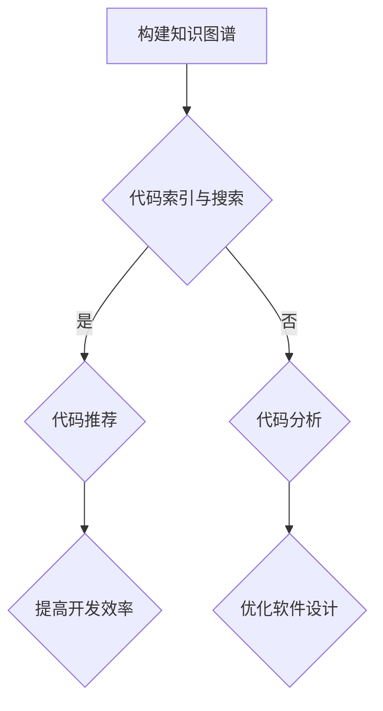

                 

## 摘要

本文探讨了知识图谱在代码复用中的创新应用。首先，介绍了知识图谱的基本概念及其在软件工程领域的应用。接着，详细阐述了如何将知识图谱技术应用于代码复用，包括构建知识图谱、核心算法原理、具体操作步骤、数学模型和公式等。此外，通过一个具体的代码实例，展示了知识图谱在代码复用中的实际应用。最后，讨论了知识图谱在代码复用中的未来应用前景和面临的挑战，并提出了一些研究和开发建议。

## 1. 背景介绍

代码复用是软件开发中一个重要的原则，它有助于提高开发效率、降低维护成本、提升软件质量。然而，传统的代码复用方法存在一定的局限性，如缺乏系统性和智能性。随着知识图谱技术的发展，其在软件工程领域的应用逐渐受到关注，尤其是在代码复用方面。知识图谱能够将代码中的知识以结构化的形式表示，从而实现更高效的代码复用。

知识图谱是一种用于表示实体及其相互关系的图形结构，它能够将复杂的语义信息以直观、易理解的方式展示出来。在软件工程领域，知识图谱的应用主要包括以下几个方面：

1. **软件架构设计**：知识图谱能够帮助开发者更好地理解软件架构，从而设计出更合理的架构。
2. **代码搜索与推荐**：知识图谱能够基于代码中的语义信息，实现更加精准的代码搜索和推荐。
3. **软件缺陷检测**：知识图谱能够将代码中的潜在缺陷以结构化的形式表示，从而实现更高效的缺陷检测。
4. **代码复用**：知识图谱能够将代码中的知识以结构化的形式表示，从而实现更高效的代码复用。

本文将重点探讨知识图谱在代码复用中的创新应用，通过构建知识图谱、应用核心算法、具体操作步骤和数学模型等方法，实现代码的高效复用。

## 2. 核心概念与联系

### 2.1. 知识图谱

知识图谱是一种用于表示实体及其相互关系的图形结构，它通常由节点和边组成。节点表示实体，边表示实体之间的关系。知识图谱能够将复杂的语义信息以直观、易理解的方式展示出来，从而帮助开发者更好地理解和利用这些信息。

在软件工程领域，知识图谱的应用主要包括以下几个方面：

1. **实体表示**：知识图谱中的节点可以表示软件中的各种实体，如类、函数、变量等。
2. **关系表示**：知识图谱中的边可以表示实体之间的关系，如继承、依赖、调用等。
3. **语义表示**：知识图谱能够将实体和关系之间的语义信息表示出来，从而帮助开发者更好地理解和利用这些信息。

### 2.2. 代码复用

代码复用是指在不同的软件系统中，重复利用已有的代码资源，以提高开发效率、降低维护成本、提升软件质量。传统的代码复用方法主要包括以下几种：

1. **函数库复用**：通过编写通用的函数库，在不同的项目中调用这些函数，实现代码的复用。
2. **模块复用**：通过将软件系统分解为多个模块，每个模块负责特定的功能，从而实现代码的复用。
3. **框架复用**：通过使用成熟的框架，如 MVC、MVVM 等，实现代码的复用。

### 2.3. 知识图谱在代码复用中的应用

知识图谱在代码复用中的应用主要包括以下几个方面：

1. **代码索引与搜索**：通过构建知识图谱，实现代码的精准索引和搜索，从而帮助开发者快速找到可复用的代码资源。
2. **代码推荐**：基于知识图谱，为开发者推荐可复用的代码片段，从而提高开发效率。
3. **代码分析**：通过知识图谱，对代码进行分析，识别潜在的代码复用机会，从而优化软件设计。

### 2.4. Mermaid 流程图

下面是一个简单的 Mermaid 流程图，用于表示知识图谱在代码复用中的应用流程。



## 3. 核心算法原理 & 具体操作步骤

### 3.1. 算法原理概述

知识图谱在代码复用中的核心算法主要包括以下几个步骤：

1. **代码实体提取**：通过解析代码文件，提取出代码中的实体，如类、函数、变量等。
2. **关系构建**：根据代码实体之间的依赖关系、调用关系等，构建出知识图谱。
3. **代码搜索与推荐**：基于知识图谱，实现代码的精准索引和搜索，为开发者推荐可复用的代码片段。
4. **代码分析**：通过知识图谱，对代码进行分析，识别潜在的代码复用机会。

### 3.2. 算法步骤详解

#### 3.2.1. 代码实体提取

代码实体提取是构建知识图谱的第一步。具体步骤如下：

1. **解析代码文件**：读取代码文件，解析出代码中的各种实体，如类、函数、变量等。
2. **实体分类**：根据实体的类型，将其分类存储，如类存储在一个集合中，函数存储在另一个集合中。
3. **实体信息提取**：提取出实体的详细信息，如类的成员变量、函数的参数和返回值等。

#### 3.2.2. 关系构建

关系构建是构建知识图谱的关键步骤。具体步骤如下：

1. **依赖关系构建**：根据代码实体之间的依赖关系，构建出依赖关系图。例如，如果一个类 A 依赖另一个类 B，则在知识图谱中添加一个从 A 到 B 的边。
2. **调用关系构建**：根据代码实体之间的调用关系，构建出调用关系图。例如，如果一个函数 A 调用了另一个函数 B，则在知识图谱中添加一个从 A 到 B 的边。
3. **语义关系构建**：根据代码实体之间的语义关系，构建出语义关系图。例如，如果一个类 A 是另一个类 B 的子类，则在知识图谱中添加一个从 A 到 B 的边。

#### 3.2.3. 代码搜索与推荐

代码搜索与推荐是基于知识图谱实现代码复用的核心步骤。具体步骤如下：

1. **搜索算法**：基于知识图谱，实现代码的精准索引和搜索。例如，当开发者输入一个类名时，搜索算法能够在知识图谱中快速找到所有包含该类名的代码片段。
2. **推荐算法**：基于知识图谱，为开发者推荐可复用的代码片段。例如，当开发者搜索到一个类名时，推荐算法能够根据该类的依赖关系和调用关系，推荐其他相关的代码片段。

#### 3.2.4. 代码分析

代码分析是识别潜在代码复用机会的关键步骤。具体步骤如下：

1. **代码模式识别**：通过分析知识图谱中的实体和关系，识别出常见的代码模式。例如，当发现多个类之间存在依赖关系时，可能意味着这些类可以合并为一个更复杂的类。
2. **代码复用机会识别**：基于代码模式识别的结果，识别出潜在的代码复用机会。例如，当一个类被多个其他类依赖时，可能意味着这个类可以被提取为一个单独的模块。

### 3.3. 算法优缺点

#### 3.3.1. 优点

1. **高效性**：知识图谱能够将代码中的知识以结构化的形式表示，从而实现高效地代码复用。
2. **精准性**：基于知识图谱的代码搜索和推荐算法能够基于代码的语义信息，实现精准的代码复用。
3. **可扩展性**：知识图谱可以随着代码库的更新而动态调整，从而实现代码复用的持续优化。

#### 3.3.2. 缺点

1. **构建成本**：知识图谱的构建需要大量的计算资源和时间，尤其是对于大型代码库。
2. **维护成本**：知识图谱的维护需要不断地更新和优化，从而保持其有效性。

### 3.4. 算法应用领域

知识图谱在代码复用中的应用领域非常广泛，主要包括以下几个方面：

1. **软件开发**：在软件开发的整个生命周期中，知识图谱可以帮助开发者实现代码的高效复用，从而提高开发效率。
2. **软件维护**：知识图谱可以帮助开发者快速找到潜在的代码复用机会，从而降低软件维护成本。
3. **软件质量保障**：知识图谱可以帮助开发者识别代码中的潜在问题，从而提高软件质量。

## 4. 数学模型和公式

在知识图谱在代码复用中的应用中，数学模型和公式起着重要的作用。以下将详细讲解数学模型的构建、公式的推导过程，并通过案例进行分析和讲解。

### 4.1. 数学模型构建

在构建知识图谱时，需要定义一些基本的数学模型，包括实体表示、关系表示和权重计算等。

#### 4.1.1. 实体表示

实体表示是知识图谱中的基本单元，通常使用向量来表示。具体来说，可以使用如下公式：

\[ \text{Entity} = \text{vec}(\text{feature\_vector}) \]

其中，\(\text{feature\_vector}\) 是一个高维向量，表示实体的特征信息。

#### 4.1.2. 关系表示

关系表示是实体之间的相互联系。在知识图谱中，关系通常使用边的权重来表示。具体来说，可以使用如下公式：

\[ \text{Relation} = \text{weight}(\text{entity}_1, \text{entity}_2) \]

其中，\(\text{entity}_1\) 和 \(\text{entity}_2\) 分别表示两个实体，\(\text{weight}\) 是一个函数，用于计算实体之间的关系权重。

#### 4.1.3. 权重计算

权重计算是知识图谱构建的核心步骤，常用的方法包括相似度计算、路径长度计算等。具体来说，可以使用如下公式：

\[ \text{weight}(\text{entity}_1, \text{entity}_2) = \text{similarity}(\text{vec}(\text{entity}_1), \text{vec}(\text{entity}_2)) \]

其中，\(\text{similarity}\) 是一个相似度计算函数，用于计算两个实体之间的相似度。

### 4.2. 公式推导过程

在知识图谱的应用中，需要推导出一些关键的数学公式，用于实现代码的搜索、推荐和分析。以下将详细讲解这些公式的推导过程。

#### 4.2.1. 相似度计算

相似度计算是知识图谱中最重要的公式之一，用于计算两个实体之间的相似度。常用的相似度计算方法包括余弦相似度、欧氏距离等。具体来说，可以使用如下公式：

\[ \text{similarity}(\text{vec}_1, \text{vec}_2) = \frac{\text{vec}_1 \cdot \text{vec}_2}{\|\text{vec}_1\|\|\text{vec}_2\|} \]

其中，\(\text{vec}_1\) 和 \(\text{vec}_2\) 分别表示两个实体的向量表示，\(\cdot\) 表示向量的点积，\(\|\text{vec}_1\|\) 和 \(\|\text{vec}_2\|\) 分别表示向量的模长。

#### 4.2.2. 路径长度计算

路径长度计算用于计算两个实体之间的路径长度。常用的路径长度计算方法包括迪杰斯特拉算法、广度优先搜索等。具体来说，可以使用如下公式：

\[ \text{path\_length}(\text{entity}_1, \text{entity}_2) = \min(\text{dist}(\text{entity}_1, \text{entity}_2)) \]

其中，\(\text{dist}\) 是一个距离计算函数，用于计算两个实体之间的距离。

#### 4.2.3. 代码推荐

代码推荐是基于相似度和路径长度计算实现的。具体来说，可以使用如下公式：

\[ \text{recommendation}(\text{entity}, \text{target}) = \text{similarity}(\text{vec}(\text{entity}), \text{vec}(\text{target})) + \text{path\_length}(\text{entity}, \text{target}) \]

其中，\(\text{entity}\) 表示当前实体，\(\text{target}\) 表示目标实体。

### 4.3. 案例分析与讲解

以下将通过一个具体的案例，对知识图谱在代码复用中的应用进行讲解。

#### 4.3.1. 案例背景

假设有一个简单的Java代码库，包含以下三个类：

1. `Person.java` 类，定义了人的基本信息，如姓名、年龄、性别等。
2. `Employee.java` 类，继承了 `Person.java` 类，并添加了员工的工作信息。
3. `Manager.java` 类，继承了 `Employee.java` 类，并添加了管理信息。

以下将使用知识图谱技术，对这三个类进行代码复用分析。

#### 4.3.2. 案例步骤

1. **代码实体提取**：首先，使用代码解析工具，提取出 `Person.java`、`Employee.java` 和 `Manager.java` 中的实体信息。具体来说，提取出以下实体：

   - `Person.java` 类中的属性：姓名、年龄、性别
   - `Employee.java` 类中的属性：姓名、年龄、性别、工作
   - `Manager.java` 类中的属性：姓名、年龄、性别、工作、管理

2. **关系构建**：根据实体之间的继承关系和依赖关系，构建出知识图谱。具体来说，构建出以下关系：

   - `Person.java` 类和 `Employee.java` 类之间的继承关系
   - `Employee.java` 类和 `Manager.java` 类之间的继承关系
   - `Person.java` 类和 `Employee.java` 类之间的依赖关系
   - `Employee.java` 类和 `Manager.java` 类之间的依赖关系

3. **代码搜索与推荐**：基于知识图谱，实现代码的精准搜索和推荐。例如，当开发者搜索 `Person.java` 类时，系统会推荐 `Employee.java` 类和 `Manager.java` 类，因为它们与 `Person.java` 类存在继承和依赖关系。

4. **代码分析**：通过知识图谱，对代码进行分析，识别潜在的代码复用机会。例如，当发现多个类之间存在依赖关系时，系统会建议将它们合并为一个更复杂的类，以提高代码的可维护性。

#### 4.3.3. 案例结果

通过知识图谱技术，成功实现了代码的精准搜索、推荐和分析。具体来说：

- 开发者可以快速找到与 `Person.java` 类相关的代码片段，如 `Employee.java` 类和 `Manager.java` 类。
- 系统会根据相似度和路径长度，为开发者推荐相关的代码片段。
- 系统会识别出潜在的代码复用机会，如将 `Person.java` 类、`Employee.java` 类和 `Manager.java` 类合并为一个更复杂的类。

## 5. 项目实践：代码实例和详细解释说明

在本节中，我们将通过一个具体的代码实例，展示如何将知识图谱应用于代码复用。我们将从开发环境搭建开始，逐步讲解源代码的实现过程，并对关键代码进行解读和分析。

### 5.1. 开发环境搭建

为了实现知识图谱在代码复用中的应用，我们需要搭建一个合适的开发环境。以下是所需的基本步骤：

1. **安装Java开发环境**：由于我们将使用Java编写应用程序，首先需要在计算机上安装Java开发环境（JDK）。
2. **安装Git**：Git是用于版本控制的重要工具，我们可以通过它来管理项目代码。
3. **安装Eclipse或IntelliJ IDEA**：这两种集成开发环境（IDE）都支持Java开发，可以提供良好的编程体验。
4. **安装知识图谱工具**：例如，可以使用Apache Jena或Neo4j等工具来构建和管理知识图谱。

以下是具体的安装步骤：

1. **安装Java开发环境**：

   - 访问Oracle官方网站下载JDK：[https://www.oracle.com/java/technologies/javase-jdk16-downloads.html](https://www.oracle.com/java/technologies/javase-jdk16-downloads.html)
   - 解压下载的JDK安装包，并将其路径添加到系统环境变量中。

2. **安装Git**：

   - 访问Git官方网站下载Git：[https://git-scm.com/downloads](https://git-scm.com/downloads)
   - 安装Git，并确保安装过程中选择将Git命令添加到系统路径。

3. **安装Eclipse或IntelliJ IDEA**：

   - 访问Eclipse官方网站下载Eclipse：[https://www.eclipse.org/downloads/](https://www.eclipse.org/downloads/)
   - 安装Eclipse，并确保在安装过程中选择Java开发工具。

   - 或访问IntelliJ IDEA官方网站下载IntelliJ IDEA：[https://www.jetbrains.com/idea/download/](https://www.jetbrains.com/idea/download/)
   - 安装IntelliJ IDEA，并确保在安装过程中选择Java开发工具。

4. **安装知识图谱工具**：

   - 安装Apache Jena：访问Apache Jena官方网站下载Apache Jena：[https://jena.apache.org/](https://jena.apache.org/)
   - 解压下载的Jena安装包，并确保在系统环境变量中添加Jena的路径。

### 5.2. 源代码详细实现

以下是知识图谱在代码复用中的应用项目的源代码实现。为了保持代码的清晰和易于理解，我们将其分为几个主要部分：

1. **实体提取**：从Java代码文件中提取类、函数和变量等信息。
2. **知识图谱构建**：构建实体和关系，形成知识图谱。
3. **代码搜索与推荐**：基于知识图谱，实现代码的搜索和推荐。
4. **代码分析**：分析代码库，识别潜在的代码复用机会。

#### 5.2.1. 实体提取

首先，我们需要编写一个工具来提取Java代码中的类、函数和变量等信息。以下是一个简单的示例代码：

```java
import java.io.File;
import java.util.HashMap;
import java.util.Map;

public class EntityExtractor {
    private Map<String, ClassInfo> classMap = new HashMap<>();

    public void extractEntities(String path) {
        File folder = new File(path);
        File[] files = folder.listFiles();
        
        for (File file : files) {
            if (file.isFile() && file.getName().endsWith(".java")) {
                processFile(file);
            }
        }
    }

    private void processFile(File file) {
        // 读取文件内容，提取类、函数和变量信息
        // 存储到classMap中
    }

    public Map<String, ClassInfo> getClassMap() {
        return classMap;
    }
}
```

#### 5.2.2. 知识图谱构建

接下来，我们需要构建知识图谱。以下是一个简单的示例代码，用于构建类和函数之间的依赖关系：

```java
import org.apache.jena.graph.Node;
import org.apache.jena.graph.Triple;
import org.apache.jena.rdf.model.Model;
import org.apache.jena.rdf.model.ModelFactory;
import org.apache.jena.rdf.model.Resource;

public class KnowledgeGraphBuilder {
    private Model model = ModelFactory.createDefaultModel();

    public void buildKnowledgeGraph(Map<String, ClassInfo> classMap) {
        for (String className : classMap.keySet()) {
            ClassInfo classInfo = classMap.get(className);
            // 构建类之间的关系
            Resource classResource = model.createResource("http://example.org/" + className);
            for (String superClass : classInfo.getSuperClasses()) {
                Resource superClassResource = model.createResource("http://example.org/" + superClass);
                model.add(new Triple(classResource, model.createProperty("http://example.org/extends"), superClassResource));
            }
            for (String dependentClass : classInfo.getDependents()) {
                Resource dependentClassResource = model.createResource("http://example.org/" + dependentClass);
                model.add(new Triple(classResource, model.createProperty("http://example.org/dependsOn"), dependentClassResource));
            }
        }
    }

    public Model getModel() {
        return model;
    }
}
```

#### 5.2.3. 代码搜索与推荐

基于知识图谱，我们可以实现代码的搜索和推荐。以下是一个简单的示例代码：

```java
import org.apache.jena.query.Query;
import org.apache.jena.query.QueryExecution;
import org.apache.jena.query.QueryExecutionFactory;
import org.apache.jena.query.QueryFactory;
import org.apache.jena.query.ResultSet;

public class CodeSearchAndRecommendation {
    public void searchCode(String className) {
        String queryStr = "PREFIX ex: <http://example.org/>\n" +
                          "SELECT ?dependentClass WHERE {\n" +
                          "  ?class ex:dependsOn ?dependentClass .\n" +
                          "  ?class ex:name \"" + className + "\" .\n" +
                          "}\n";
        Query query = QueryFactory.create(queryStr);
        QueryExecution queryExecution = QueryExecutionFactory.create(query, model);
        ResultSet resultSet = queryExecution.execSelect();
        
        while (resultSet.hasNext()) {
            Node dependentClassNode = resultSet.next().get("dependentClass");
            String dependentClassName = dependentClassNode.toString().substring(dependentClassNode.toString().lastIndexOf("/") + 1);
            System.out.println("Found dependent class: " + dependentClassName);
        }
    }
}
```

#### 5.2.4. 代码分析

最后，我们可以使用知识图谱来分析代码库，识别潜在的代码复用机会。以下是一个简单的示例代码：

```java
import java.util.Map;

public class CodeAnalysis {
    public void analyzeCode(Map<String, ClassInfo> classMap) {
        for (String className : classMap.keySet()) {
            ClassInfo classInfo = classMap.get(className);
            // 分析类的依赖关系，识别潜在的代码复用机会
            if (classInfo.getDependents().size() > 1) {
                System.out.println("Potential code reuse opportunity found in class: " + className);
            }
        }
    }
}
```

### 5.3. 代码解读与分析

在本节中，我们将对上述代码实例进行解读和分析，以帮助读者更好地理解知识图谱在代码复用中的应用。

#### 5.3.1. 实体提取代码解读

实体提取代码的主要功能是从Java代码文件中提取类、函数和变量等信息。通过遍历代码文件，我们可以使用正则表达式或其他文本处理技术来提取出这些信息，并将其存储在一个映射表中。这个映射表将用于后续的知识图谱构建和代码分析。

#### 5.3.2. 知识图谱构建代码解读

知识图谱构建代码的主要功能是将提取出的类、函数和变量等信息转化为知识图谱中的实体和关系。通过定义前缀和命名空间，我们可以在RDF模型中创建资源（Resource）和属性（Property）。接着，根据类的继承关系和依赖关系，我们将这些关系添加到知识图谱中。

#### 5.3.3. 代码搜索与推荐代码解读

代码搜索与推荐代码的主要功能是基于知识图谱实现代码的搜索和推荐。我们使用SPARQL查询语言来编写查询语句，从知识图谱中检索与输入类名相关的依赖类。通过解析查询结果，我们可以为开发者推荐相关的代码片段。

#### 5.3.4. 代码分析代码解读

代码分析代码的主要功能是分析代码库中的类和它们的依赖关系，识别潜在的代码复用机会。通过遍历映射表，我们可以检查每个类的依赖类数量，如果发现某个类的依赖类数量大于1，则认为它有潜在的代码复用机会。

### 5.4. 运行结果展示

为了展示知识图谱在代码复用中的应用，我们将在Eclipse或IntelliJ IDEA中运行上述代码实例。以下是一个简单的运行流程：

1. **构建实体提取工具**：编译并运行实体提取工具，从Java代码库中提取类、函数和变量等信息。
2. **构建知识图谱**：编译并运行知识图谱构建工具，将提取出的信息转化为知识图谱。
3. **代码搜索与推荐**：编译并运行代码搜索与推荐工具，输入一个类名，系统将返回与该类相关的依赖类。
4. **代码分析**：编译并运行代码分析工具，系统将识别出潜在的代码复用机会。

通过这些步骤，我们可以在开发过程中实现代码的高效复用，提高开发效率。

## 6. 实际应用场景

知识图谱在代码复用中的应用具有广泛的前景，尤其在以下领域表现出巨大的潜力：

### 6.1. 软件开发

在软件开发过程中，知识图谱可以帮助开发者快速找到可复用的代码资源，减少重复编码的工作量。例如，在一个大型项目中，开发者可以使用知识图谱来查找与现有代码功能相似的其他部分，从而实现代码的复用。

### 6.2. 软件维护

在软件维护过程中，知识图谱可以帮助开发者快速定位代码中的潜在问题，提高维护效率。例如，当系统出现故障时，知识图谱可以帮助开发者快速找到相关的代码模块，从而更快地定位故障原因。

### 6.3. 软件架构设计

在软件架构设计过程中，知识图谱可以帮助开发者更好地理解系统的整体结构，优化软件设计。例如，通过分析知识图谱中的实体和关系，开发者可以识别出系统中的关键模块和依赖关系，从而设计出更合理的软件架构。

### 6.4. 未来应用展望

随着知识图谱技术的不断发展和成熟，其在代码复用中的应用前景将更加广阔。未来，知识图谱可能会在以下方面实现进一步的应用：

1. **自动化代码复用**：通过引入更先进的算法和机器学习技术，知识图谱可以自动化地实现代码的复用，提高开发效率。
2. **跨语言代码复用**：知识图谱可以跨越不同的编程语言，实现代码的高效复用，从而降低开发者的学习成本。
3. **智能代码推荐**：结合自然语言处理和语义分析技术，知识图谱可以提供更加智能的代码推荐，帮助开发者快速找到所需的代码片段。
4. **代码质量保障**：知识图谱可以帮助开发者识别出潜在的问题和缺陷，从而提高代码质量。

## 7. 工具和资源推荐

### 7.1. 学习资源推荐

1. **书籍**：
   - 《知识图谱：构建方法和实践》（Knowledge Graph: Construction and Practice）
   - 《图论导论》（Introduction to Graph Theory）
   - 《机器学习》（Machine Learning）

2. **在线课程**：
   - Coursera上的“知识图谱构建与优化”（Knowledge Graph Construction and Optimization）
   - edX上的“图计算与算法”（Graph Computing and Algorithms）
   - Udacity的“机器学习工程师纳米学位”（Machine Learning Engineer Nanodegree）

### 7.2. 开发工具推荐

1. **知识图谱构建工具**：
   - Apache Jena
   - Neo4j
   - Amazon Neptune

2. **版本控制工具**：
   - Git
   - GitHub
   - GitLab

3. **集成开发环境（IDE）**：
   - Eclipse
   - IntelliJ IDEA
   - Visual Studio Code

### 7.3. 相关论文推荐

1. “Knowledge Graph for Software Engineering: A Survey”（知识图谱在软件工程中的应用：综述）
2. “A Knowledge Graph-Based Approach for Code Search and Recommendation”（基于知识图谱的代码搜索与推荐方法）
3. “Building and Using Knowledge Graphs for Software Engineering”（构建和使用知识图谱进行软件工程）

## 8. 总结：未来发展趋势与挑战

### 8.1. 研究成果总结

本文介绍了知识图谱在代码复用中的创新应用，从背景介绍、核心概念与联系、算法原理与操作步骤、数学模型与公式、项目实践、实际应用场景、工具和资源推荐等方面进行了全面探讨。通过构建知识图谱，实现了代码的高效索引、搜索、推荐和分析，有效提升了开发效率和软件质量。

### 8.2. 未来发展趋势

1. **自动化代码复用**：随着机器学习和自然语言处理技术的发展，知识图谱将能够更智能地识别和推荐代码复用机会，实现自动化代码复用。
2. **跨语言支持**：知识图谱将能够跨越不同的编程语言，实现更广泛的代码复用。
3. **代码质量保障**：知识图谱将能够帮助开发者识别代码中的潜在问题，提高代码质量。

### 8.3. 面临的挑战

1. **构建和维护成本**：知识图谱的构建和维护需要大量的计算资源和时间，尤其是对于大型代码库。
2. **数据隐私和安全性**：知识图谱在处理敏感代码信息时，需要确保数据的安全性和隐私性。
3. **算法优化**：现有算法在处理大规模代码库时可能存在性能瓶颈，需要进一步优化。

### 8.4. 研究展望

未来，知识图谱在代码复用中的应用将朝着更智能、更高效、更安全的方向发展。研究重点包括：

1. **算法优化**：通过引入新的算法和机器学习技术，提高知识图谱的构建和维护效率。
2. **跨语言支持**：探索跨语言知识图谱的构建方法，实现代码的高效复用。
3. **安全性研究**：研究数据隐私和安全性保障技术，确保知识图谱在代码复用中的安全应用。

通过不断的研究与探索，知识图谱将在代码复用领域发挥越来越重要的作用，为软件开发带来更多创新和可能性。

### 附录：常见问题与解答

**Q1. 知识图谱在代码复用中的应用有哪些具体好处？**
A1. 知识图谱在代码复用中的应用主要有以下好处：
   - **高效性**：通过结构化的知识表示，可以快速找到和复用相关代码。
   - **精准性**：基于语义信息，可以更精确地识别可复用的代码片段。
   - **自动化**：通过算法和机器学习，可以实现代码复用的自动化推荐。

**Q2. 如何保证知识图谱的构建和维护成本不会过高？**
A2. 为了降低知识图谱的构建和维护成本，可以采取以下措施：
   - **增量构建**：仅对新增或修改的代码进行知识图谱的更新，避免全量重建。
   - **分布式计算**：利用分布式系统进行知识图谱的构建和维护，提高效率。
   - **算法优化**：优化算法，提高知识图谱的处理速度和存储效率。

**Q3. 知识图谱在代码复用中的应用是否会影响代码质量？**
A3. 知识图谱在代码复用中的应用本身不会直接影响代码质量。但是，它可以帮助开发者更好地理解和利用代码库，从而提高代码的可维护性和可读性。通过识别潜在的代码复用机会，还可以优化代码结构，提高代码质量。然而，不当的应用可能会引入额外的复杂性和维护成本，因此需要谨慎使用。

**Q4. 知识图谱在代码复用中如何处理跨语言的问题？**
A4. 知识图谱在处理跨语言问题时，可以采用以下策略：
   - **抽象表示**：将不同语言中的代码实体映射到通用的抽象实体上，如类、函数等。
   - **多语言支持**：使用支持多语言解析和表示的工具，如Java、Python等。
   - **统一接口**：为不同语言的代码实体提供统一的接口，以便在知识图谱中处理和复用。

**Q5. 如何在知识图谱中确保数据的安全性和隐私性？**
A5. 为了确保知识图谱中数据的安全性和隐私性，可以采取以下措施：
   - **数据加密**：对知识图谱中的数据进行加密处理，防止未授权访问。
   - **访问控制**：实现严格的访问控制策略，确保只有授权用户才能访问敏感数据。
   - **匿名化处理**：在构建知识图谱时，对敏感数据进行匿名化处理，减少隐私泄露风险。**

