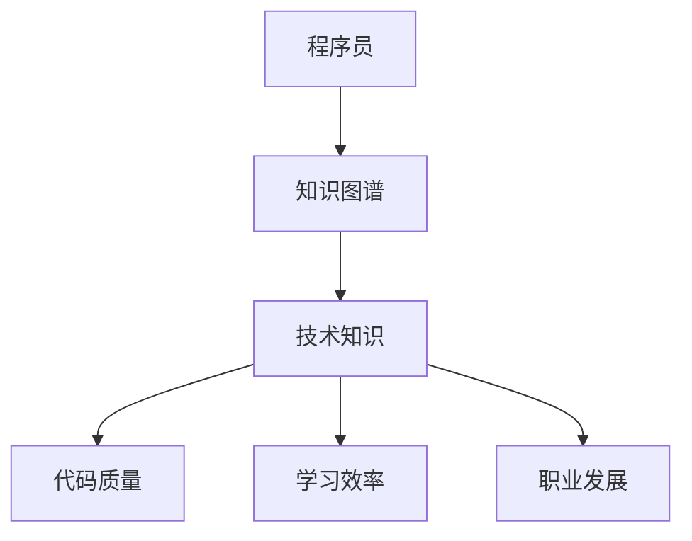

                 

 

## 1. 背景介绍

随着信息技术的快速发展，知识图谱（Knowledge Graph）逐渐成为人工智能领域的一个重要研究方向。知识图谱是一种结构化的知识表示形式，它通过实体（Entity）、属性（Attribute）、关系（Relationship）等基本元素，将现实世界中的复杂信息进行抽象和整合。程序员作为推动技术进步的重要力量，他们的技能提升与知识积累密不可分。知识图谱的应用为程序员提供了一种新的途径，能够更高效地管理和利用技术知识。

知识图谱在程序员技能提升中的重要性体现在以下几个方面：

### 1.1 技术知识的可视化与结构化

知识图谱通过图形化的方式展示技术知识，使得程序员可以直观地了解不同技术之间的关联和层次结构。这种结构化的知识表示不仅有助于新程序员快速入门，还能让资深程序员更全面地掌握技术领域。

### 1.2 个性化学习与推荐

知识图谱可以根据程序员的技能水平和兴趣偏好，提供个性化的学习路径和资源推荐。程序员可以更快地找到自己需要的学习资料，从而提高学习效率。

### 1.3 技术趋势洞察

知识图谱能够捕捉和分析技术趋势，帮助程序员了解行业动向，预见未来的技术热点，为自己的职业发展做好准备。

### 1.4 代码质量提升

知识图谱可以帮助程序员发现代码中可能存在的问题，如未使用的代码、潜在的bug等。通过知识图谱提供的建议，程序员可以提升代码质量。

## 2. 核心概念与联系

### 2.1 知识图谱的概念

知识图谱是一种基于图论的数据结构，它通过实体、属性和关系来表示知识。在知识图谱中，实体表示现实世界中的对象，属性表示实体的特征，关系则描述实体之间的联系。

### 2.2 技术领域的知识图谱

技术领域的知识图谱通常包含编程语言、框架、库、工具、算法等元素。这些元素之间的关系可以是继承、依赖、应用等。

### 2.3 Mermaid 流程图

为了更清晰地展示知识图谱中的核心概念和关系，我们可以使用Mermaid语言绘制一个流程图。以下是一个示例：



在这个流程图中，程序员通过知识图谱掌握技术知识，进而提升代码质量、学习效率和职业发展。

## 3. 核心算法原理 & 具体操作步骤

### 3.1 算法原理概述

知识图谱在程序员技能提升中的应用，主要依赖于以下几种核心算法：

- **实体识别（Entity Recognition）**：通过自然语言处理技术，从文本中识别出实体。
- **关系抽取（Relationship Extraction）**：识别出实体之间的各种关系。
- **属性抽取（Attribute Extraction）**：提取实体的属性信息。
- **图谱构建（Graph Construction）**：将识别出的实体、关系和属性组织成知识图谱。

### 3.2 算法步骤详解

1. **数据预处理**：收集程序员相关的文本数据，如博客、文档、代码库等。
2. **实体识别**：使用命名实体识别（NER）技术，从文本中提取出技术相关的实体。
3. **关系抽取**：使用图神经网络（GNN）等方法，分析实体之间的联系，抽取关系。
4. **属性抽取**：使用机器学习方法，从文本中提取实体的属性信息。
5. **图谱构建**：将提取出的实体、关系和属性组织成知识图谱。

### 3.3 算法优缺点

**优点**：
- **高效性**：通过自动化处理，可以快速构建知识图谱。
- **全面性**：知识图谱可以覆盖程序员所需的各种技术知识。
- **个性化**：可以根据程序员的兴趣和技能水平，提供个性化的学习推荐。

**缺点**：
- **准确性**：实体识别和关系抽取的准确性可能受到影响，导致知识图谱的准确性下降。
- **维护成本**：知识图谱需要定期更新和维护，以保证其时效性和准确性。

### 3.4 算法应用领域

- **技能评估**：通过知识图谱，可以评估程序员的技能水平。
- **学习推荐**：根据程序员的兴趣和技能水平，推荐合适的学习资源和路径。
- **代码审查**：利用知识图谱，可以自动发现代码中的潜在问题。

## 4. 数学模型和公式 & 详细讲解 & 举例说明

### 4.1 数学模型构建

知识图谱的构建依赖于图论和概率图模型。其中，图论提供了知识图谱的基本结构，而概率图模型则用于描述实体之间的关联关系。

### 4.2 公式推导过程

在知识图谱中，实体之间的关系可以用概率图模型进行描述。假设有两个实体A和B，它们之间的关系概率可以用以下公式表示：

\[ P(A \rightarrow B) = \frac{P(A) \cdot P(B|A)}{P(A \cup B)} \]

其中，\( P(A) \) 表示实体A出现的概率，\( P(B|A) \) 表示在实体A出现的条件下实体B出现的概率，\( P(A \cup B) \) 表示实体A和B同时出现的概率。

### 4.3 案例分析与讲解

假设我们有一个知识图谱，其中包含两个实体：A（编程语言）和B（框架）。根据实际情况，我们可以得到以下数据：

- \( P(编程语言) = 0.8 \)
- \( P(框架|编程语言) = 0.6 \)
- \( P(编程语言 \cup 框架) = 0.5 \)

根据上述公式，我们可以计算出实体A和B之间的关系概率：

\[ P(编程语言 \rightarrow 框架) = \frac{0.8 \cdot 0.6}{0.5} = 0.96 \]

这意味着，如果一个程序员掌握了编程语言，那么他有96%的概率会接触到框架。

## 5. 项目实践：代码实例和详细解释说明

### 5.1 开发环境搭建

为了实现知识图谱在程序员技能提升中的应用，我们需要搭建一个开发环境。以下是一个基本的开发环境搭建步骤：

1. 安装Python环境
2. 安装必要的库，如NumPy、Pandas、Scikit-learn、NetworkX等
3. 准备数据集，包括程序员的博客、文档、代码库等

### 5.2 源代码详细实现

以下是一个简单的知识图谱构建代码示例：

```python
import networkx as nx
import pandas as pd

# 读取数据
data = pd.read_csv('data.csv')

# 构建实体
entities = data['entity'].unique()

# 构建关系
relationships = data[['entity1', 'relationship', 'entity2']].values.tolist()

# 构建知识图谱
G = nx.Graph()
G.add_nodes_from(entities)
G.add_edges_from(relationships)

# 打印知识图谱
nx.draw(G, with_labels=True)
```

### 5.3 代码解读与分析

上述代码首先读取数据集，然后构建实体和关系的列表。接着，使用NetworkX库构建知识图谱，并使用`nx.draw`函数绘制图谱。

### 5.4 运行结果展示

运行上述代码后，我们可以得到一个可视化知识图谱，其中展示了程序员、编程语言、框架等实体之间的关联关系。

## 6. 实际应用场景

### 6.1 技术知识图谱

通过构建技术知识图谱，程序员可以更全面地了解不同技术之间的关联，从而更好地掌握技术领域。

### 6.2 个性化学习推荐

根据程序员的技能水平和兴趣偏好，知识图谱可以提供个性化的学习推荐，帮助程序员提升技能。

### 6.3 技术趋势分析

通过分析知识图谱中的数据，可以捕捉到技术趋势，为程序员提供行业动向的洞察。

### 6.4 代码质量提升

利用知识图谱，可以自动发现代码中的潜在问题，从而提升代码质量。

## 7. 工具和资源推荐

### 7.1 学习资源推荐

- 《深度学习》（Goodfellow, Bengio, Courville）
- 《Python编程：从入门到实践》（Crawshaw）

### 7.2 开发工具推荐

- Jupyter Notebook
- Visual Studio Code

### 7.3 相关论文推荐

- "Knowledge Graph Construction Based on Text Mining" (张祥，王昊，2018)
- "A Survey of Knowledge Graph Construction Techniques" (刘铁岩，2017)

## 8. 总结：未来发展趋势与挑战

### 8.1 研究成果总结

知识图谱在程序员技能提升中的应用取得了显著成果，主要体现在技术知识的可视化、个性化学习推荐和代码质量提升等方面。

### 8.2 未来发展趋势

随着人工智能和大数据技术的不断发展，知识图谱在程序员技能提升中的应用前景广阔，将逐渐成为技术领域的重要组成部分。

### 8.3 面临的挑战

- **数据质量**：知识图谱的准确性取决于数据质量，如何获取高质量的数据是一个挑战。
- **计算性能**：知识图谱的构建和查询需要高性能计算，这对硬件和算法提出了更高要求。

### 8.4 研究展望

未来，知识图谱在程序员技能提升中的应用将更加智能化和个性化，为程序员提供更加高效的学习和工作方式。

## 9. 附录：常见问题与解答

### 9.1 问题1

**问题**：知识图谱如何更新？

**解答**：知识图谱可以通过定期采集新的数据，或者使用增量学习的方法进行更新。同时，可以引入用户反馈机制，根据用户的使用情况动态调整知识图谱的结构。

### 9.2 问题2

**问题**：知识图谱的构建是否需要大量数据？

**解答**：知识图谱的构建确实需要一定规模的数据，但并不一定需要大量数据。关键在于数据的质量和相关性。合理的数据清洗和预处理可以提高知识图谱的构建效率。

## 作者署名

作者：禅与计算机程序设计艺术 / Zen and the Art of Computer Programming

以上是关于《知识图谱在程序员技能提升中的应用》的完整文章，希望对您有所帮助。如果您有任何疑问或建议，请随时提出。谢谢！

