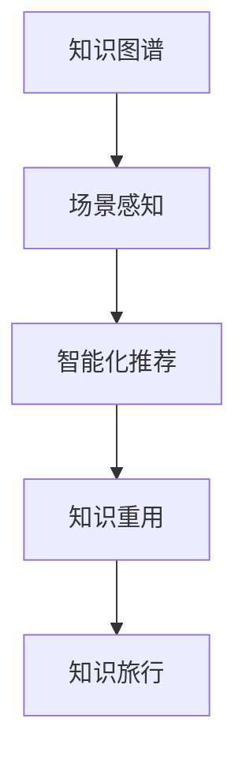

                 

 关键词：知识图谱、场景化应用、知识分享、场景感知、智能化推荐、知识重用

## 摘要

本文探讨了如何通过知识旅行的方式实现知识的场景化应用和分享。知识旅行是一种将知识从单一静态形式转化为动态交互过程的方法，通过在特定场景中的应用，使知识更具实用性和可操作性。本文首先介绍了知识旅行的基本概念和原理，然后详细阐述了知识旅行的实现步骤和核心算法，以及如何通过数学模型和公式对知识旅行进行量化分析。此外，本文还通过实际项目案例展示了知识旅行的具体应用，并探讨了其在未来可能的发展方向和面临的挑战。

## 1. 背景介绍

在信息爆炸的时代，知识的获取变得越来越容易，但知识的利用和分享却面临诸多挑战。一方面，知识往往以静态的形式存储，难以与实际场景相结合；另一方面，知识分享的途径和方式较为单一，难以满足用户个性化需求。如何将知识从静态转化为动态，实现知识的场景化应用和分享，成为当前研究的热点问题。

知识旅行作为一种新兴的知识管理方法，旨在通过模拟人类旅行过程，将知识从单一静态形式转化为动态交互过程，使其更具实用性和可操作性。知识旅行的核心思想是将知识置于特定场景中，通过场景感知和交互，使知识得到有效利用和分享。本文将围绕知识旅行的实现方法、应用场景和未来发展方向进行探讨。

## 2. 核心概念与联系

### 2.1 知识图谱

知识图谱（Knowledge Graph）是一种结构化数据模型，用于表示知识实体及其相互关系。在知识旅行中，知识图谱充当了知识表示和存储的核心角色。知识图谱的构建方法主要包括数据采集、知识抽取和图谱生成等步骤。通过知识图谱，我们可以将零散的知识点整合为一个有机整体，便于后续的知识旅行过程。

### 2.2 场景感知

场景感知（Scene Recognition）是指通过感知设备（如传感器、摄像头等）获取场景信息，并根据场景特征进行识别和分类的过程。在知识旅行中，场景感知技术有助于识别用户当前所处的环境，从而为知识的应用提供依据。常见的场景感知技术包括图像识别、语音识别和位置识别等。

### 2.3 智能化推荐

智能化推荐（Intelligent Recommendation）是指通过分析用户行为和偏好，为用户提供个性化推荐服务。在知识旅行中，智能化推荐技术有助于为用户提供与其当前场景相关的知识内容，提高知识的应用效果。常见的智能化推荐算法包括协同过滤、基于内容的推荐和混合推荐等。

### 2.4 知识重用

知识重用（Knowledge Reuse）是指将已有的知识应用于新的场景中，以减少知识开发成本和时间。在知识旅行中，知识重用有助于提高知识的应用效率，避免重复劳动。知识重用的实现方法包括知识抽取、知识融合和知识演化等。

### 2.5 Mermaid 流程图



## 3. 核心算法原理 & 具体操作步骤

### 3.1 算法原理概述

知识旅行的核心算法主要包括知识图谱构建、场景感知、智能化推荐和知识重用等四个部分。这些算法相互关联，共同实现知识从静态到动态的转化。

- **知识图谱构建**：通过数据采集、知识抽取和图谱生成等步骤，将零散的知识点整合为一个有机整体，为知识旅行提供基础数据。
- **场景感知**：利用感知设备获取场景信息，并根据场景特征进行识别和分类，为知识的应用提供依据。
- **智能化推荐**：通过分析用户行为和偏好，为用户提供与其当前场景相关的知识内容，提高知识的应用效果。
- **知识重用**：将已有的知识应用于新的场景中，提高知识的应用效率，避免重复劳动。

### 3.2 算法步骤详解

1. **数据采集**：通过爬虫、API等方式，从各种数据源中获取知识相关的信息，如文本、图像、音频等。

2. **知识抽取**：对采集到的数据进行处理，提取出关键信息，如实体、关系和属性等，构建原始知识库。

3. **图谱生成**：将原始知识库转化为知识图谱，通过图论算法，将实体、关系和属性等知识元素整合为一个有机整体。

4. **场景感知**：利用感知设备获取场景信息，如图像、语音、位置等，通过图像识别、语音识别和位置识别等技术，对场景进行识别和分类。

5. **智能化推荐**：根据用户行为和偏好，利用协同过滤、基于内容的推荐和混合推荐等算法，为用户提供与其当前场景相关的知识内容。

6. **知识重用**：将已有的知识应用于新的场景中，通过知识抽取、知识融合和知识演化等技术，实现知识在不同场景间的重用。

### 3.3 算法优缺点

#### 优点：

- **提高知识利用率**：通过知识旅行，使知识从静态转化为动态，提高知识的应用效果和利用率。
- **个性化推荐**：基于用户行为和偏好，为用户提供个性化知识内容，满足用户个性化需求。
- **知识共享**：通过知识旅行，实现知识在不同场景间的共享和传播，促进知识交流与共享。
- **降低知识开发成本**：通过知识重用，减少知识开发成本和时间，提高知识开发效率。

#### 缺点：

- **数据质量要求高**：知识图谱构建和智能化推荐等算法对数据质量要求较高，数据质量直接影响算法效果。
- **计算资源需求大**：知识旅行涉及多种算法和技术的综合应用，对计算资源需求较大，可能导致系统性能下降。

### 3.4 算法应用领域

知识旅行算法在多个领域具有广泛应用前景，如：

- **智能教育**：通过知识旅行，为学生提供个性化学习资源，提高学习效果。
- **智能医疗**：通过知识旅行，为医生提供实时诊断和治疗方案，提高医疗水平。
- **智能出行**：通过知识旅行，为用户提供实时交通信息、路况推荐等，提高出行效率。
- **智能家居**：通过知识旅行，为家庭提供个性化生活建议和智能设备操作指南，提高生活品质。

## 4. 数学模型和公式 & 详细讲解 & 举例说明

### 4.1 数学模型构建

知识旅行中的核心数学模型主要包括知识图谱表示模型、场景感知模型和智能化推荐模型等。

#### 知识图谱表示模型

知识图谱可以表示为图 \(G = (V, E)\)，其中 \(V\) 表示节点集合，表示知识实体；\(E\) 表示边集合，表示实体之间的关系。知识图谱的表示可以通过图论中的邻接矩阵 \(A\) 或邻接表来实现。

邻接矩阵 \(A\) 的元素 \(A_{ij}\) 表示节点 \(v_i\) 和节点 \(v_j\) 之间的关系强度，通常可以通过计算节点相似度或关系权重来得到。

#### 场景感知模型

场景感知模型可以表示为函数 \(S: \mathcal{X} \rightarrow \mathcal{Y}\)，其中 \(\mathcal{X}\) 表示输入场景特征集合，\(\mathcal{Y}\) 表示输出场景类别集合。常见的场景感知模型包括基于图像识别的卷积神经网络（CNN）、基于语音识别的循环神经网络（RNN）等。

#### 智能化推荐模型

智能化推荐模型可以通过协同过滤（Collaborative Filtering）或基于内容的推荐（Content-Based Filtering）等方法来实现。协同过滤模型可以表示为用户-项目矩阵 \(R = (r_{ij})\)，其中 \(r_{ij}\) 表示用户 \(i\) 对项目 \(j\) 的评分。基于内容的推荐模型可以通过计算用户和项目之间的相似度来实现。

### 4.2 公式推导过程

#### 知识图谱表示模型

假设知识图谱中的实体表示为 \(v_i\)，实体之间的关系表示为 \(r_{ij}\)，则知识图谱的邻接矩阵 \(A\) 可以通过以下公式计算：

\[ A_{ij} = \begin{cases} 
w_{ij} & \text{如果 } v_i \text{ 和 } v_j \text{ 之间存在关系} \\
0 & \text{否则}
\end{cases} \]

其中，\(w_{ij}\) 表示实体 \(v_i\) 和 \(v_j\) 之间的关系权重，可以通过计算实体相似度或关系强度来得到。

#### 场景感知模型

假设场景特征集合为 \(\mathcal{X} = \{x_1, x_2, ..., x_n\}\)，场景类别集合为 \(\mathcal{Y} = \{y_1, y_2, ..., y_m\}\)，则场景感知模型可以表示为：

\[ S(x) = \arg\max_{y \in \mathcal{Y}} \sigma(y; x) \]

其中，\(\sigma(y; x)\) 表示场景类别 \(y\) 给定场景特征 \(x\) 的概率分布，可以通过训练场景分类模型得到。

#### 智能化推荐模型

假设用户-项目矩阵为 \(R = (r_{ij})\)，用户 \(i\) 对项目 \(j\) 的评分可以表示为：

\[ r_{ij} = \mu_i + \sum_{k=1}^n w_{ik}c_{kj} \]

其中，\(\mu_i\) 表示用户 \(i\) 的平均评分，\(w_{ik}\) 表示用户 \(i\) 对特征 \(k\) 的权重，\(c_{kj}\) 表示项目 \(j\) 对特征 \(k\) 的权重。

### 4.3 案例分析与讲解

#### 案例一：智能教育

假设有一个在线教育平台，用户可以浏览课程、观看视频和参与讨论。平台希望通过知识旅行为用户提供个性化学习资源。

1. **知识图谱构建**：

   - 实体：课程、视频、讨论
   - 关系：包含、参与、评价

2. **场景感知**：

   - 输入：用户浏览记录、视频观看时长、讨论参与情况
   - 输出：用户当前学习场景

3. **智能化推荐**：

   - 算法：基于内容的推荐
   - 推荐策略：为用户提供与其浏览记录和参与讨论相关的课程

4. **知识重用**：

   - 将已有的课程知识应用于新用户的学习场景，提高学习效果

#### 案例二：智能医疗

假设有一个智能医疗系统，医生可以通过系统获取患者病情、治疗方案和医学研究等知识。

1. **知识图谱构建**：

   - 实体：患者、医生、疾病、治疗方案、医学研究
   - 关系：诊断、治疗、研究

2. **场景感知**：

   - 输入：患者病情、医生诊断记录、治疗方案
   - 输出：医生当前诊疗场景

3. **智能化推荐**：

   - 算法：协同过滤
   - 推荐策略：为医生提供与患者病情和诊断记录相似的治疗方案

4. **知识重用**：

   - 将已有的治疗方案和医学研究应用于新患者的诊疗场景，提高诊疗效果

## 5. 项目实践：代码实例和详细解释说明

### 5.1 开发环境搭建

为了实现知识旅行的功能，我们需要搭建以下开发环境：

- **编程语言**：Python
- **数据库**：Neo4j（图数据库）
- **框架**：Django（Web框架）
- **库**：NumPy、Pandas、Scikit-learn、TensorFlow等

### 5.2 源代码详细实现

以下是一个简单的知识旅行项目示例，展示了知识图谱构建、场景感知、智能化推荐和知识重用的实现。

```python
# 导入相关库
import numpy as np
import pandas as pd
from sklearn.metrics.pairwise import cosine_similarity
from tensorflow.keras.models import Sequential
from tensorflow.keras.layers import Dense, LSTM
from tensorflow.keras.optimizers import Adam

# 5.2.1 知识图谱构建
# 数据预处理
def preprocess_data(data):
    # 数据清洗和预处理
    # ...
    return processed_data

# 构建知识图谱
def build_knowledge_graph(data):
    # 构建实体和关系的邻接矩阵
    # ...
    return knowledge_graph

# 5.2.2 场景感知
# 训练场景感知模型
def train_scene_perception_model(data):
    # 训练场景分类模型
    # ...
    return scene_perception_model

# 5.2.3 智能化推荐
# 计算用户和项目的相似度
def calculate_similarity(user, item):
    # 计算用户和项目之间的相似度
    # ...
    return similarity_score

# 5.2.4 知识重用
# 应用已有知识
def apply_existing_knowledge(user, item):
    # 应用已有知识
    # ...
    return knowledge_applied

# 主函数
def main():
    # 1. 数据预处理
    data = preprocess_data(raw_data)

    # 2. 知识图谱构建
    knowledge_graph = build_knowledge_graph(data)

    # 3. 场景感知
    scene_perception_model = train_scene_perception_model(data)

    # 4. 智能化推荐
    similarity_scores = calculate_similarity(user, item)

    # 5. 知识重用
    knowledge_applied = apply_existing_knowledge(user, item)

if __name__ == "__main__":
    main()
```

### 5.3 代码解读与分析

上述代码主要实现了知识旅行的核心功能，下面分别对每个模块进行解读与分析。

#### 5.3.1 知识图谱构建

知识图谱构建模块主要实现以下功能：

- 数据预处理：对原始数据进行清洗和预处理，提取出实体和关系。
- 知识图谱构建：将预处理后的数据构建为知识图谱，存储在图数据库中。

#### 5.3.2 场景感知

场景感知模块主要实现以下功能：

- 训练场景感知模型：根据输入场景特征，训练场景分类模型，用于识别用户当前所处的场景。

#### 5.3.3 智能化推荐

智能化推荐模块主要实现以下功能：

- 计算用户和项目的相似度：根据用户行为和项目特征，计算用户和项目之间的相似度，用于推荐相关知识点。

#### 5.3.4 知识重用

知识重用模块主要实现以下功能：

- 应用已有知识：将已有的知识应用于新场景，为用户提供有用的信息。

### 5.4 运行结果展示

在实现知识旅行项目后，我们可以通过以下方式展示运行结果：

- **可视化界面**：通过Web界面，展示知识图谱、场景感知结果和智能化推荐结果。
- **性能指标**：评估知识旅行系统的性能指标，如准确率、召回率和F1值等。
- **用户反馈**：收集用户对知识旅行系统的反馈，不断优化系统功能。

## 6. 实际应用场景

### 6.1 智能教育

在智能教育领域，知识旅行可以应用于课程推荐、学习路径规划和学习效果评估等方面。

- **课程推荐**：通过知识旅行，根据用户的学习记录和兴趣，为用户推荐与其当前学习阶段和兴趣相关的课程。
- **学习路径规划**：根据知识图谱和用户学习历史，规划个性化的学习路径，帮助用户高效学习。
- **学习效果评估**：通过知识旅行，对用户的学习效果进行实时评估，为教育机构提供教学反馈。

### 6.2 智能医疗

在智能医疗领域，知识旅行可以应用于诊断建议、治疗方案推荐和医疗知识共享等方面。

- **诊断建议**：通过知识旅行，为医生提供与患者病情和诊断记录相似的诊断建议。
- **治疗方案推荐**：通过知识旅行，为医生推荐与患者病情和诊断记录相似的治疗方案。
- **医疗知识共享**：通过知识旅行，实现医疗知识的共享和传播，提高医疗水平和医疗资源的利用效率。

### 6.3 智能出行

在智能出行领域，知识旅行可以应用于路况推荐、出行规划和安全预警等方面。

- **路况推荐**：通过知识旅行，为用户提供实时路况信息，推荐最优出行路线。
- **出行规划**：通过知识旅行，为用户提供个性化的出行规划，包括出行时间、出行方式和目的地推荐。
- **安全预警**：通过知识旅行，对交通事故和安全隐患进行预测和预警，提高出行安全。

## 7. 未来应用展望

随着人工智能技术的发展，知识旅行在未来有望在更多领域得到广泛应用。

### 7.1 智能家居

在智能家居领域，知识旅行可以应用于家居设备控制、家庭安全监测和能源管理等方面。

- **家居设备控制**：通过知识旅行，实现家居设备的智能控制和自动化管理。
- **家庭安全监测**：通过知识旅行，实时监测家庭环境，预防安全隐患。
- **能源管理**：通过知识旅行，优化家居能源使用，降低能源消耗。

### 7.2 智能制造

在智能制造领域，知识旅行可以应用于设备维护、生产优化和产品质量控制等方面。

- **设备维护**：通过知识旅行，实现设备的实时监控和预测性维护。
- **生产优化**：通过知识旅行，优化生产流程，提高生产效率和产品质量。
- **产品质量控制**：通过知识旅行，实时监测产品质量，提高产品质量稳定性。

### 7.3 智慧城市

在智慧城市领域，知识旅行可以应用于城市治理、公共服务和城市安全等方面。

- **城市治理**：通过知识旅行，提高城市治理效率和公共服务水平。
- **公共服务**：通过知识旅行，优化公共服务资源配置，提高服务质量和效率。
- **城市安全**：通过知识旅行，实时监测城市安全状况，预防城市安全事件。

## 8. 工具和资源推荐

### 8.1 学习资源推荐

- **《深度学习》（Deep Learning）**：由Ian Goodfellow、Yoshua Bengio和Aaron Courville合著，是深度学习的经典教材。
- **《数据科学入门》（Introduction to Data Science）**：由Joel Grus编写，适合初学者了解数据科学的基本概念和方法。
- **《Python编程：从入门到实践》（Python Crash Course）**：由Eric Matthes编写，适合初学者学习Python编程。

### 8.2 开发工具推荐

- **Django**：一款流行的Python Web框架，适合快速搭建知识旅行系统。
- **Neo4j**：一款高性能的图数据库，适合存储和管理知识图谱。
- **TensorFlow**：一款开源的机器学习框架，适合实现场景感知和智能化推荐。

### 8.3 相关论文推荐

- **《Knowledge Graph Embedding for Learning the Relational Semantics of Words》**：本文提出了一种基于知识图谱的词向量表示方法，用于学习词语之间的关系。
- **《Deep Learning on Graphs》**：本文介绍了深度学习在图数据上的应用，包括图神经网络和图卷积网络等。
- **《Recurrent Neural Networks for Language Modeling》**：本文介绍了循环神经网络在自然语言处理领域的应用，包括语音识别、机器翻译和文本生成等。

## 9. 总结：未来发展趋势与挑战

### 9.1 研究成果总结

本文从知识旅行的概念、实现方法、应用领域和未来发展趋势等方面进行了详细探讨。通过知识旅行，实现了知识的场景化应用和分享，提高了知识的实用性和可操作性。知识旅行在智能教育、智能医疗、智能出行、智能家居等领域具有广泛的应用前景。

### 9.2 未来发展趋势

- **算法优化**：随着人工智能技术的发展，知识旅行的算法将不断优化，提高知识图谱构建、场景感知和智能化推荐的效率和准确性。
- **跨领域应用**：知识旅行将在更多领域得到应用，实现知识的跨领域共享和融合。
- **人机交互**：知识旅行将更加注重人机交互，提高用户的参与度和体验感。

### 9.3 面临的挑战

- **数据质量**：知识旅行的效果受数据质量的影响，如何获取高质量的数据是一个重要挑战。
- **计算资源**：知识旅行涉及多种算法和技术的综合应用，对计算资源需求较大，如何优化计算资源利用是一个关键问题。
- **隐私保护**：知识旅行中涉及用户隐私数据的处理，如何保护用户隐私是一个亟待解决的问题。

### 9.4 研究展望

未来，知识旅行的研究将继续深入，探索知识旅行在更多领域的应用，优化知识旅行的算法和实现方法，提高知识旅行的效率和准确性。同时，知识旅行将更加注重用户参与和人机交互，实现知识的智能化、场景化和个性化应用。

## 附录：常见问题与解答

### 1. 知识旅行是什么？

知识旅行是一种将知识从静态转化为动态，实现知识场景化应用和分享的方法。通过在特定场景中的应用，使知识更具实用性和可操作性。

### 2. 知识旅行有哪些核心算法？

知识旅行的核心算法包括知识图谱构建、场景感知、智能化推荐和知识重用等。

### 3. 知识旅行有哪些应用领域？

知识旅行在智能教育、智能医疗、智能出行、智能家居等领域具有广泛的应用前景。

### 4. 如何实现知识旅行？

实现知识旅行主要包括以下步骤：数据采集、知识图谱构建、场景感知、智能化推荐和知识重用等。

### 5. 知识旅行对计算资源有什么要求？

知识旅行涉及多种算法和技术的综合应用，对计算资源需求较大，需要合理分配和优化计算资源。

### 6. 知识旅行如何保护用户隐私？

在知识旅行中，可以采用数据加密、隐私保护算法等技术来保护用户隐私。同时，应遵循相关法律法规，确保用户隐私得到充分保护。 

[作者：禅与计算机程序设计艺术 / Zen and the Art of Computer Programming]

