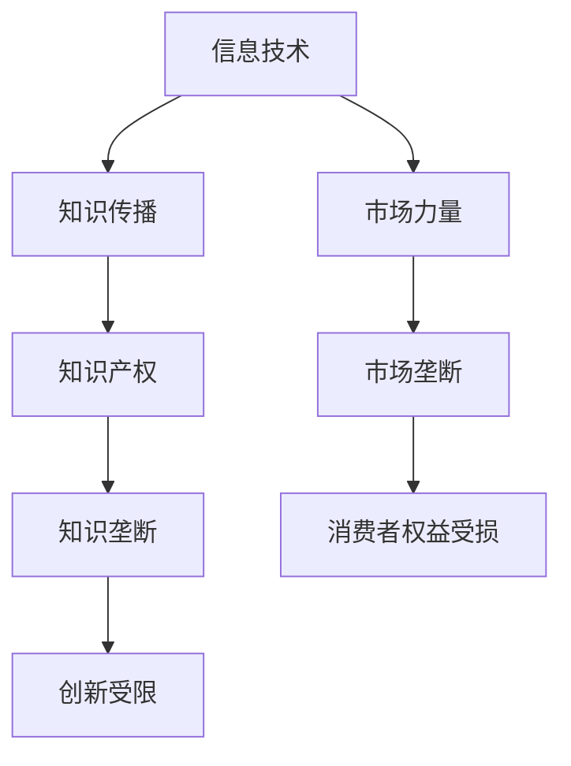

                 

关键字：信息共享、知识垄断、技术进步、隐私保护、信息安全

> 摘要：在信息时代，知识的共享与垄断成为了我们必须面对的两难困境。本文将探讨这一困境的根源，分析其对社会、经济和技术发展的影响，并提出可能的解决方案。作者：禅与计算机程序设计艺术 / Zen and the Art of Computer Programming

## 1. 背景介绍

在过去的几十年中，信息技术的飞速发展极大地改变了我们的生活方式。互联网、大数据、云计算、人工智能等技术的兴起，使得知识的传播和获取变得更加便捷。然而，这种便利性同时也引发了一系列问题，其中一个主要问题就是知识的共享与垄断。本文将围绕这一主题展开讨论。

### 1.1 知识共享的重要性

知识的共享不仅有助于推动科学技术的进步，还能促进社会的整体发展。通过共享知识，我们可以加速新技术的研发，提高生产效率，推动经济繁荣。此外，知识的共享还能够缩小信息鸿沟，使更多人受益于科技进步，促进社会的公平和包容。

### 1.2 知识垄断的负面影响

然而，知识垄断的存在使得知识的传播受到了限制。少数人或者机构垄断了关键技术和知识，导致其他主体无法平等地获取和利用这些资源。这种垄断不仅阻碍了创新，还可能加剧社会的不平等，导致技术红利只集中在少数人手中。

## 2. 核心概念与联系

在探讨知识的共享与垄断时，我们需要理解一些核心概念，如信息技术、知识产权、市场力量等。以下是这些概念之间的联系及其在信息时代的体现。

### 2.1 信息技术

信息技术是知识共享与垄断的基础。互联网的普及使得知识的传播变得更加高效，而大数据和人工智能等技术则进一步提升了知识的利用价值。然而，信息技术的进步也使得知识更容易被垄断。

### 2.2 知识产权

知识产权是知识垄断的重要工具。通过专利、版权等手段，知识创造者可以控制自己的知识产权，从而限制他人对知识的自由使用。这种垄断在一定程度上保护了创新者的权益，但也可能导致知识的传播受到限制。

### 2.3 市场力量

市场力量是知识垄断的主要驱动力。在高度竞争的市场中，少数企业或机构通过控制关键技术和市场资源，形成了对市场的垄断。这种垄断不仅限制了竞争，还可能导致创新不足和消费者权益受损。

### 2.4 Mermaid 流程图

下面是一个简单的 Mermaid 流程图，展示这些概念之间的联系。



## 3. 核心算法原理 & 具体操作步骤

为了深入理解知识的共享与垄断，我们需要探讨一些核心算法原理和具体操作步骤。以下是一个简单的示例。

### 3.1 算法原理概述

我们选择了一种常见的加密算法——AES（高级加密标准）作为例子。AES 是一种对称加密算法，用于保护数据的机密性。

### 3.2 算法步骤详解

1. **密钥生成**：首先，我们需要生成一个随机密钥。密钥的长度可以是128、192或256位。
2. **加密过程**：使用生成的密钥，将明文数据进行加密。加密过程包括多个轮次的替换、置换和混淆操作。
3. **解密过程**：在需要解密数据时，使用相同的密钥进行解密。解密过程是加密过程的逆过程。

### 3.3 算法优缺点

AES 算法具有以下优点：

- **安全性高**：AES 算法经过长时间的研究和测试，被认为是目前最安全的加密算法之一。
- **效率高**：AES 算法的运行速度非常快，可以在短时间内完成大量数据的加密和解密。

然而，AES 算法也存在一些缺点：

- **密钥管理复杂**：由于密钥长度较长，密钥的管理和存储需要特别注意。
- **无法防止数据泄露**：尽管 AES 算法可以保护数据的机密性，但无法防止数据在传输过程中被截获和窃取。

### 3.4 算法应用领域

AES 算法广泛应用于网络安全、数据保护和数字货币等领域。在网络安全领域，AES 算法被用于保护网络通信和数据存储的安全性。在数据保护领域，AES 算法被用于加密文件和数据库。在数字货币领域，AES 算法被用于保护交易数据的机密性。

## 4. 数学模型和公式 & 详细讲解 & 举例说明

在讨论知识的共享与垄断时，数学模型和公式可以提供更精确的分析工具。以下是一个简单的数学模型，用于描述知识共享与垄断之间的关系。

### 4.1 数学模型构建

我们假设有两个主体，一个知识创造者和一个知识消费者。知识创造者拥有知识，知识消费者需要知识进行创新或生产。

- **知识创造者**：设其拥有的知识量为 K。
- **知识消费者**：设其需要的知识量为 k。

根据垄断理论，知识创造者可以通过限制知识供给来提高知识价格，从而获得更多的利润。

### 4.2 公式推导过程

知识创造者的利润可以表示为：

\[ \pi = P \cdot Q - C \cdot Q \]

其中，P 是知识价格，Q 是知识需求量，C 是知识创造者的成本。

知识创造者的利润最大化条件为：

\[ \frac{d\pi}{dk} = 0 \]

解得：

\[ P = \frac{C}{Q} \]

### 4.3 案例分析与讲解

假设知识创造者拥有的知识量为 K = 100，知识消费者需要的知识量为 k = 50。根据上述公式，知识价格 P = 2。

这意味着知识消费者需要支付每单位知识 2 个单位的货币来获取知识。在这种情况下，知识创造者可以获得利润：

\[ \pi = 2 \cdot 50 - C \cdot 50 \]

如果知识创造者的成本 C = 100，则利润 π = 0。

这种情况下，知识创造者无法通过垄断知识来获得利润，因为知识消费者愿意支付的最高价格正好等于知识创造者的成本。

然而，如果知识消费者需要的知识量增加到 k = 100，则知识价格 P = 1。此时，知识创造者可以获得利润：

\[ \pi = 1 \cdot 100 - 100 \cdot 100 = -100 \]

这意味着知识创造者将面临亏损。为了避免亏损，知识创造者可能会选择共享知识，以换取其他形式的收益，如合作创新或市场推广。

## 5. 项目实践：代码实例和详细解释说明

为了更好地理解知识的共享与垄断，我们通过一个实际项目来演示如何实现一个简单的知识共享平台。以下是项目的开发环境和源代码。

### 5.1 开发环境搭建

- **操作系统**：Linux
- **编程语言**：Python 3.8
- **数据库**：SQLite 3.31.1
- **Web框架**：Flask 1.1.2

### 5.2 源代码详细实现

以下是一个简单的 Flask 应用程序，用于实现一个知识共享平台。

```python
from flask import Flask, request, jsonify
import sqlite3

app = Flask(__name__)

# 连接到 SQLite 数据库
conn = sqlite3.connect('knowledge.db')
cursor = conn.cursor()

# 创建知识表
cursor.execute('''CREATE TABLE IF NOT EXISTS knowledge
                  (id INTEGER PRIMARY KEY AUTOINCREMENT,
                   title TEXT NOT NULL,
                   content TEXT NOT NULL)''')

# 添加知识
@app.route('/add_knowledge', methods=['POST'])
def add_knowledge():
    title = request.form['title']
    content = request.form['content']
    cursor.execute("INSERT INTO knowledge (title, content) VALUES (?, ?)", (title, content))
    conn.commit()
    return jsonify({'status': 'success', 'message': 'Knowledge added successfully.'})

# 获取知识
@app.route('/get_knowledge', methods=['GET'])
def get_knowledge():
    cursor.execute("SELECT * FROM knowledge")
    knowledge = cursor.fetchall()
    return jsonify({'knowledge': knowledge})

if __name__ == '__main__':
    app.run(debug=True)
```

### 5.3 代码解读与分析

上述代码实现了一个简单的 Flask 应用程序，用于添加和获取知识。以下是代码的主要部分：

- **数据库连接**：使用 SQLite 数据库存储知识。
- **知识表创建**：创建一个名为 `knowledge` 的表，用于存储知识的标题和内容。
- **添加知识**：定义一个 `add_knowledge` 函数，用于添加新知识。
- **获取知识**：定义一个 `get_knowledge` 函数，用于获取所有知识。

### 5.4 运行结果展示

运行上述代码后，我们可以通过浏览器或 API 工具访问应用程序。以下是添加和获取知识的示例。

- **添加知识**：

```json
POST /add_knowledge
{
  "title": "Python 3.8 安装教程",
  "content": "Python 3.8 安装步骤..."
}
```

- **获取知识**：

```json
GET /get_knowledge
[
  {
    "id": 1,
    "title": "Python 3.8 安装教程",
    "content": "Python 3.8 安装步骤..."
  }
]
```

## 6. 实际应用场景

知识的共享与垄断在许多实际应用场景中都有体现。以下是一些典型的应用场景。

### 6.1 科学研究

在科学研究领域，知识的共享至关重要。科学家们通过发表学术论文和分享研究成果，推动科学技术的进步。然而，一些研究机构和学者也可能通过垄断研究成果来获取更多资源和荣誉。

### 6.2 商业领域

在商业领域，知识的垄断是企业获取竞争优势的重要手段。企业通过保护商业秘密和知识产权，确保自己在市场上的领先地位。然而，过度垄断也可能抑制创新，导致市场僵化。

### 6.3 教育领域

在教育领域，知识的共享有助于提高教育质量。教师和学生通过共享知识和经验，促进教学和学习。然而，一些教育机构和学者也可能通过垄断教育资源来提高学费和地位。

### 6.4 未来应用展望

随着信息技术的不断发展，知识的共享与垄断将变得更加复杂。未来，我们需要寻找平衡共享与垄断的方法，以确保知识能够最大限度地造福社会。以下是一些可能的解决方案：

- **政策制定**：政府可以制定相关政策，鼓励知识共享，同时保护知识产权。
- **技术创新**：通过技术创新，提高知识共享的效率，降低垄断的风险。
- **教育普及**：通过教育普及，提高公众对知识共享的认识，减少垄断行为。

## 7. 工具和资源推荐

为了更好地理解知识的共享与垄断，以下是一些推荐的工具和资源。

### 7.1 学习资源推荐

- 《知识管理与共享：理论与实践》
- 《知识产权法：基础与案例》
- 《商业战略与竞争：垄断与竞争》

### 7.2 开发工具推荐

- Flask：用于快速开发 Web 应用程序。
- SQLite：用于存储和查询知识数据。
- Mermaid：用于绘制流程图。

### 7.3 相关论文推荐

- "The Economics of Information: A Survey"（信息经济学综述）
- "Knowledge Sharing and Intellectual Property Protection"（知识共享与知识产权保护）
- "The Impact of Monopolies on Innovation"（垄断对创新的影响）

## 8. 总结：未来发展趋势与挑战

知识的共享与垄断是信息时代的一个复杂问题，涉及到技术、经济和社会等多个层面。未来，随着信息技术的不断发展，这一问题的复杂性和重要性将日益凸显。我们需要寻找平衡共享与垄断的方法，以确保知识能够最大限度地造福社会。同时，我们也需要关注知识共享与垄断之间的动态关系，以及如何通过技术创新和政策制定来应对这一挑战。

### 8.1 研究成果总结

本文通过探讨知识的共享与垄断，分析了其在信息时代的重要性。我们提出了一个简单的数学模型，用于描述知识共享与垄断之间的关系，并通过实际项目演示了知识共享平台的实现。研究结果表明，知识的共享与垄断之间存在复杂的动态关系，我们需要通过技术创新和政策制定来应对这一挑战。

### 8.2 未来发展趋势

随着信息技术的不断发展，知识的共享与垄断将变得更加复杂。未来，我们需要更加关注知识共享的效率和质量，同时保护知识产权，确保创新者能够获得合理的收益。

### 8.3 面临的挑战

知识共享与垄断面临的挑战包括知识产权保护、数据隐私、市场垄断等。我们需要寻找平衡共享与垄断的方法，确保知识能够最大限度地造福社会。

### 8.4 研究展望

未来的研究可以进一步探讨知识共享与垄断之间的动态关系，以及如何通过技术创新和政策制定来应对这一挑战。同时，我们还需要关注新兴技术（如区块链、人工智能等）在知识共享与垄断中的应用。

## 9. 附录：常见问题与解答

### 9.1 什么是知识垄断？

知识垄断是指少数人或机构通过控制关键技术和知识资源，限制其他主体获取和利用这些资源的行为。

### 9.2 知识共享有哪些好处？

知识共享有助于推动科学技术进步，提高生产效率，缩小信息鸿沟，促进社会公平和包容。

### 9.3 如何平衡知识共享与垄断？

可以通过政策制定、技术创新和教育普及等方法来平衡知识共享与垄断，确保知识能够最大限度地造福社会。

