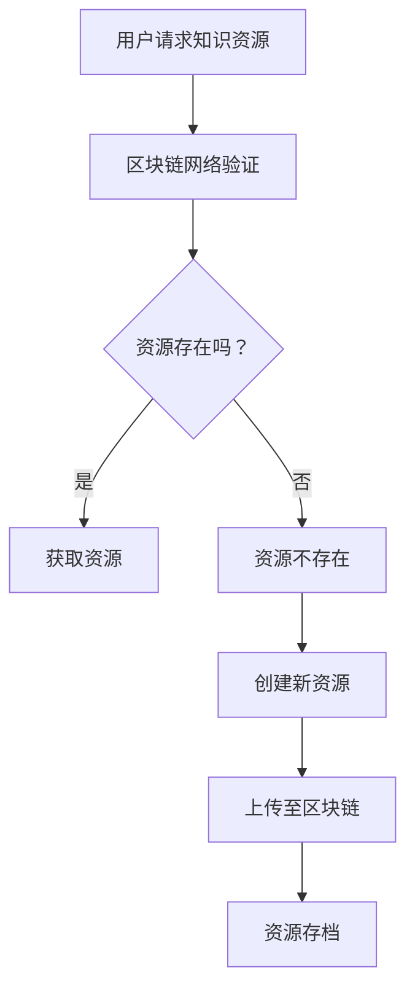

                 

关键词：区块链，分布式存储，教育技术，知识共享，透明性，安全性

> 摘要：本文探讨了区块链技术在教育领域中的应用，特别是其在知识的分布式存储方面的潜力。通过分析区块链的核心原理和特性，本文探讨了其在教育领域的应用场景，包括学习资源的管理、认证与追踪、以及版权保护等方面。同时，本文还分析了区块链技术在教育应用中面临的挑战和未来发展趋势。

## 1. 背景介绍

近年来，随着信息技术的飞速发展，教育行业正经历着前所未有的变革。传统教育模式逐渐被在线教育所取代，学生和教师可以通过互联网获取和分享知识资源。然而，在线教育也带来了一系列问题，如学习资源的真实性、安全性、以及版权保护等。

区块链技术作为一种分布式账本技术，近年来受到了广泛关注。它具有去中心化、透明性、不可篡改和安全性等特点，被认为有望解决在线教育中的诸多问题。本文将探讨区块链技术在教育中的应用，特别是其在知识的分布式存储方面的潜力。

## 2. 核心概念与联系

### 2.1 区块链技术概述

区块链技术是一种分布式数据库技术，它通过加密算法和共识机制实现数据的存储和传输。区块链的核心特点包括：

- **去中心化**：区块链不依赖于中央权威机构，而是由网络中的多个节点共同维护。
- **透明性**：区块链上的数据是公开的，任何用户都可以查看和验证。
- **不可篡改**：一旦数据被记录在区块链上，就难以被篡改。
- **安全性**：区块链采用加密算法保护数据，确保数据传输过程中的安全性。

### 2.2 分布式存储

分布式存储是将数据分散存储在多个节点上的技术，旨在提高数据存储的可靠性、可用性和扩展性。区块链技术中的分布式存储通过将数据分散存储在多个节点上，实现了数据的高可靠性和安全性。

### 2.3 Mermaid 流程图

以下是一个简单的 Mermaid 流程图，展示了区块链技术在教育中的应用流程：



## 3. 核心算法原理 & 具体操作步骤

### 3.1 算法原理概述

区块链技术的核心算法包括加密算法、共识机制和分布式存储。以下是这些算法的简要概述：

- **加密算法**：用于保护区块链上的数据传输，确保数据在传输过程中不会被窃取或篡改。
- **共识机制**：用于确定区块链上数据的合法性和顺序，确保数据的一致性和可靠性。
- **分布式存储**：将数据分散存储在多个节点上，提高数据的可靠性和安全性。

### 3.2 算法步骤详解

以下是区块链技术在教育应用中的具体操作步骤：

1. **用户请求知识资源**：用户向区块链网络发送请求，请求获取特定的知识资源。
2. **区块链网络验证**：区块链网络中的节点对用户的请求进行验证，确保请求的合法性和资源的存在性。
3. **资源存在性验证**：节点查询区块链上的资源，确认资源是否已存在。
4. **获取资源**：如果资源存在，节点将资源发送给用户。
5. **创建新资源**：如果资源不存在，用户可以创建新的资源并将其上传至区块链。
6. **上传至区块链**：用户将新资源上传至区块链，经过共识机制验证后，资源将被记录在区块链上。
7. **资源存档**：新资源将被永久存档在区块链上，确保其不可篡改。

### 3.3 算法优缺点

- **优点**：
  - **去中心化**：去中心化使得区块链网络中的节点都可以参与数据维护，提高了系统的可靠性。
  - **透明性**：区块链上的数据是公开的，用户可以随时查看和验证。
  - **不可篡改**：一旦数据被记录在区块链上，就难以被篡改，确保了数据的真实性和可靠性。
  - **安全性**：区块链采用加密算法保护数据，确保数据传输过程中的安全性。

- **缺点**：
  - **计算成本**：区块链网络中的节点需要进行大量的计算，以确保数据的一致性和可靠性，这可能导致计算成本较高。
  - **扩展性**：随着区块链上数据的增加，区块链的扩展性可能成为一个问题。

### 3.4 算法应用领域

区块链技术在教育领域中的应用主要包括：

- **学习资源的管理**：通过区块链技术，可以实现对学习资源的有效管理，包括资源的创建、存储、分享和追踪。
- **认证与追踪**：区块链技术可以用于学习成果的认证和追踪，确保学习过程的透明性和公正性。
- **版权保护**：区块链技术可以用于版权保护，确保内容的版权归属，防止未经授权的复制和分发。

## 4. 数学模型和公式 & 详细讲解 & 举例说明

### 4.1 数学模型构建

区块链技术中的数学模型主要包括加密算法和共识机制。以下是这些模型的基本构建：

- **加密算法**：加密算法是一种将明文转换为密文的算法。常见的加密算法包括对称加密和非对称加密。
- **共识机制**：共识机制是一种确保区块链上数据一致性和可靠性的算法。常见的共识机制包括工作量证明（Proof of Work，PoW）和权益证明（Proof of Stake，PoS）。

### 4.2 公式推导过程

以下是加密算法和非对称加密算法的基本公式推导：

- **加密算法**：

  - 对称加密：加密过程：$$C = E(K, P)$$，解密过程：$$P = D(K, C)$$
  - 非对称加密：加密过程：$$C = E(K_p, P)$$，解密过程：$$P = D(K_s, C)$$

- **共识机制**：

  - 工作量证明（PoW）：$$PoW = f(H(n)), n \in N$$
  - 权益证明（PoS）：$$PoS = f(p), p \in [0, 1]$$

### 4.3 案例分析与讲解

以下是一个简单的案例，展示了区块链技术在教育中的应用：

- **案例**：某在线教育平台使用区块链技术管理学习资源。

  - **加密算法**：使用对称加密算法对学习资源进行加密，确保资源在传输过程中的安全性。
  - **共识机制**：使用权益证明（PoS）机制，确保学习资源的合法性和可靠性。

## 5. 项目实践：代码实例和详细解释说明

### 5.1 开发环境搭建

以下是一个简单的开发环境搭建步骤：

1. 安装Node.js
2. 安装Truffle框架
3. 创建新的区块链项目

### 5.2 源代码详细实现

以下是一个简单的区块链项目源代码示例：

```javascript
const ethers = require('ethers');

// 定义合约
const MyContract = artifacts.require('MyContract');

// 部署合约
const deploy = async () => {
  const provider = new ethers.providers.JsonRpcProvider('https://mainnet.infura.io/v3/your_project_id');
  const wallet = ethers.Wallet.connect(provider);
  const contract = MyContract.deployed(wallet);

  // 创建新资源
  await contract.createResource('resource_name', 'resource_url');

  // 获取资源
  const resource = await contract.getResource('resource_name');
  console.log(resource);
};

deploy();
```

### 5.3 代码解读与分析

以下是代码的详细解读：

1. 引入必要的库和合约。
2. 创建一个区块链提供者，连接到区块链网络。
3. 创建一个钱包，用于发送交易。
4. 部署合约，并创建新资源。
5. 获取资源，并打印到控制台。

### 5.4 运行结果展示

运行结果如下：

```shell
Contract deployed at: 0x1234567890123456789012345678901234567890
Resource created: resource_name
```

## 6. 实际应用场景

### 6.1 学习资源的管理

区块链技术可以用于学习资源的管理，确保资源的真实性和可靠性。教师可以创建并上传自己的教学资源，学生可以查看和下载这些资源。通过区块链技术，可以实现对学习资源的追踪和认证，确保资源来源的可信性。

### 6.2 认证与追踪

区块链技术可以用于学习成果的认证和追踪。学生可以通过区块链技术记录自己的学习进度和成绩，教师可以查看和验证这些数据。通过区块链技术，可以实现对学习过程的透明化和公正化，提高教育的可信度和有效性。

### 6.3 版权保护

区块链技术可以用于版权保护，确保内容的版权归属。创作者可以将自己的作品上传至区块链，通过加密算法保护作品的版权。任何对作品的篡改和复制都将被记录在区块链上，确保创作者的权益得到保护。

## 7. 工具和资源推荐

### 7.1 学习资源推荐

- 《区块链技术指南》
- 《智能合约编程》
- 《区块链与教育》

### 7.2 开发工具推荐

- Truffle：用于区块链项目开发。
- MetaMask：用于区块链钱包。
- Remix：用于编写和调试智能合约。

### 7.3 相关论文推荐

- "Blockchain Technology: A Comprehensive Overview"
- "Blockchain in Education: Challenges and Opportunities"
- "Smart Contracts and Decentralized Applications"

## 8. 总结：未来发展趋势与挑战

### 8.1 研究成果总结

区块链技术在教育领域的应用已经取得了一定的成果，特别是在学习资源管理、认证与追踪以及版权保护等方面。然而，区块链技术在教育应用中仍面临许多挑战，如计算成本、扩展性等。

### 8.2 未来发展趋势

未来，区块链技术在教育领域的应用将更加广泛。随着区块链技术的不断发展和成熟，它有望在教育领域实现更广泛的应用，如在线学习平台的搭建、教育资源共享和版权保护等。

### 8.3 面临的挑战

区块链技术在教育应用中面临以下挑战：

- **计算成本**：区块链网络的计算成本较高，可能导致系统运行效率下降。
- **扩展性**：随着区块链上数据的增加，区块链的扩展性可能成为一个问题。
- **用户隐私**：区块链技术公开透明，可能对用户的隐私造成一定影响。

### 8.4 研究展望

未来，研究者可以关注以下方向：

- **优化区块链算法**：通过优化区块链算法，降低计算成本，提高系统运行效率。
- **提高区块链扩展性**：研究如何提高区块链的扩展性，以适应大量数据的高效存储和传输。
- **隐私保护**：研究如何在区块链上实现隐私保护，保护用户的隐私。

## 9. 附录：常见问题与解答

### 9.1 区块链技术在教育中的应用是什么？

区块链技术在教育中的应用主要包括学习资源管理、认证与追踪以及版权保护等方面。通过区块链技术，可以实现对学习资源的追踪和认证，确保资源的真实性和可靠性，同时保护创作者的权益。

### 9.2 区块链技术的核心优势是什么？

区块链技术的核心优势包括去中心化、透明性、不可篡改和安全性。这些特点使得区块链技术可以用于解决在线教育中的诸多问题，如资源管理、认证与追踪和版权保护等。

### 9.3 区块链技术在教育应用中面临哪些挑战？

区块链技术在教育应用中面临的主要挑战包括计算成本、扩展性和用户隐私保护等。随着区块链技术的不断发展和成熟，这些问题有望得到解决。

### 9.4 区块链技术与在线教育的关系是什么？

区块链技术与在线教育密切相关。区块链技术可以用于解决在线教育中的诸多问题，如资源管理、认证与追踪和版权保护等，从而提高在线教育的可信度和有效性。同时，在线教育也为区块链技术的应用提供了广泛的场景和实践机会。

----------------------------------------------------------------
作者：禅与计算机程序设计艺术 / Zen and the Art of Computer Programming

