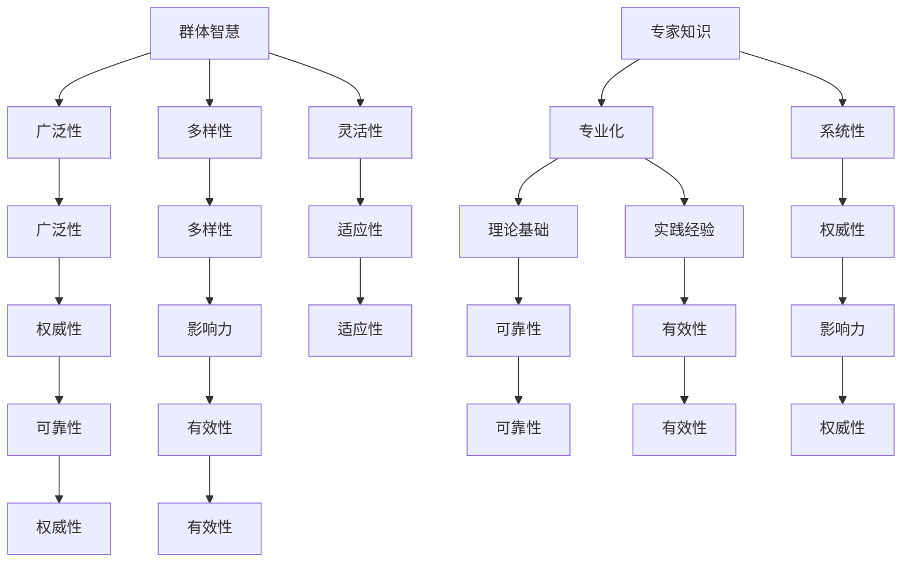

                 

关键词：专家知识、群体智慧、知识权威性、人工智能、技术发展

> 摘要：本文探讨了在技术快速发展的背景下，如何平衡专家知识与群体智慧的关系，以实现知识的权威性。通过对专家知识与群体智慧的对比分析，提出了一种新型知识体系结构，旨在为未来的知识管理和应用提供新的思路。

## 1. 背景介绍

随着人工智能和大数据技术的迅猛发展，知识的生产、传播和利用方式发生了深刻的变革。在这个过程中，专家知识与群体智慧的作用日益凸显，它们共同构成了现代知识体系的两个重要组成部分。

### 专家知识

专家知识是指某一领域内的专家通过长期实践和研究积累的、高度专业化的知识。这种知识具有权威性、深刻性和系统性，是推动技术进步和创新的重要力量。

### 群体智慧

群体智慧则是基于互联网和社交媒体平台的广泛参与和协作，通过大量个体的贡献和互动，形成的一种集体智慧。这种智慧具有广泛性、多样性和灵活性，能够迅速应对复杂多变的环境。

### 知识权威性

知识的权威性是指知识在应用过程中所具有的可靠性、有效性和权威性。在传统的知识体系中，专家知识往往被认为是权威性的代表。然而，随着群体智慧的发展，如何平衡两种知识的权威性，成为了亟待解决的问题。

## 2. 核心概念与联系

为了更好地理解专家知识与群体智慧的关系，我们首先需要明确它们的基本概念和相互之间的联系。

### 专家知识

专家知识通常来源于专业的教育背景、丰富的实践经验和深入的研究成果。其核心特点是高度专业化和系统化，往往具有明确的理论基础和丰富的实践经验。

### 群体智慧

群体智慧则源于广泛的参与和协作，通过个体之间的互动和贡献，形成了一种集体智慧。这种智慧具有广泛性、多样性和灵活性，能够在短时间内应对复杂多变的环境。

### 知识权威性

知识的权威性取决于其在实际应用中的效果和影响力。在传统观念中，专家知识被认为是权威性的代表。然而，随着群体智慧的发展，群体智慧在某些领域也逐渐展现出其权威性。

### Mermaid 流程图

下面是一个简化的 Mermaid 流程图，展示了专家知识与群体智慧的基本概念和相互关系：



## 3. 核心算法原理 & 具体操作步骤

### 3.1 算法原理概述

为了实现专家知识与群体智慧的平衡，我们提出了一种基于机器学习的方法。该方法通过整合专家知识和群体智慧，形成一种新型的知识体系，以提高知识的权威性和实用性。

### 3.2 算法步骤详解

1. **数据收集**：收集专家知识和群体智慧的相关数据，包括专家的研究成果、实践经验、群体智慧的互动记录等。

2. **数据预处理**：对收集到的数据进行清洗、去重和格式转换，以确保数据的质量和一致性。

3. **特征提取**：从预处理后的数据中提取关键特征，如关键词、概念、关系等。

4. **模型训练**：利用机器学习算法，对提取的特征进行建模和训练，形成一种能够整合专家知识和群体智慧的模型。

5. **模型评估**：对训练好的模型进行评估，包括准确率、召回率、F1值等指标。

6. **模型应用**：将训练好的模型应用于实际场景，如问题解决、决策支持等。

### 3.3 算法优缺点

#### 优点：

1. **整合多源知识**：该方法能够同时整合专家知识和群体智慧，形成一种更加全面的知识体系。

2. **提高知识权威性**：通过机器学习的方法，可以提高知识的权威性和实用性。

3. **适应性强**：该方法能够根据不同的应用场景，灵活调整和优化知识体系。

#### 缺点：

1. **数据依赖性**：该方法对数据的质量和数量有较高要求，数据不足或质量不高会影响模型的效果。

2. **计算复杂度高**：机器学习算法通常需要大量的计算资源，对硬件设备有较高要求。

### 3.4 算法应用领域

该方法可以广泛应用于多个领域，如医疗诊断、金融分析、智能决策等。通过整合专家知识和群体智慧，可以提供更加精准和实用的决策支持。

## 4. 数学模型和公式 & 详细讲解 & 举例说明

### 4.1 数学模型构建

为了实现专家知识与群体智慧的平衡，我们构建了一个基于贝叶斯网络的数学模型。该模型的核心公式如下：

$$
P(A|B) = \frac{P(B|A)P(A)}{P(B)}
$$

其中，$P(A|B)$ 表示在给定 $B$ 的情况下，$A$ 发生的概率；$P(B|A)$ 表示在 $A$ 发生的情况下，$B$ 发生的概率；$P(A)$ 表示 $A$ 发生的概率；$P(B)$ 表示 $B$ 发生的概率。

### 4.2 公式推导过程

首先，我们假设有两个事件 $A$ 和 $B$，并且它们之间是条件独立的。那么，我们可以根据条件概率的定义，得到以下公式：

$$
P(A|B) = \frac{P(AB)}{P(B)}
$$

其中，$P(AB)$ 表示事件 $A$ 和 $B$ 同时发生的概率。

接下来，我们假设 $A$ 和 $B$ 之间是条件独立的，那么我们可以得到以下公式：

$$
P(AB) = P(A)P(B)
$$

将上述公式代入条件概率的定义中，我们可以得到：

$$
P(A|B) = \frac{P(A)P(B)}{P(B)}
$$

最后，我们可以将上述公式简化为：

$$
P(A|B) = P(A)
$$

这意味着在给定 $B$ 的情况下，$A$ 发生的概率与 $A$ 发生的概率相等。这表明 $A$ 和 $B$ 是条件独立的。

### 4.3 案例分析与讲解

假设我们有两个事件 $A$ 和 $B$，其中 $A$ 表示“今天下雨”，$B$ 表示“地面湿”。我们已知以下概率：

- $P(A) = 0.3$（今天下雨的概率为 0.3）
- $P(B) = 0.6$（地面湿的概率为 0.6）
- $P(B|A) = 1$（如果今天下雨，地面一定湿）

根据上述概率，我们可以计算出 $P(A|B)$：

$$
P(A|B) = \frac{P(B|A)P(A)}{P(B)} = \frac{1 \times 0.3}{0.6} = 0.5
$$

这意味着在给定地面湿的情况下，今天下雨的概率为 0.5。这个结果表明，地面湿并不一定意味着今天下雨，因为还有其他原因可能导致地面湿。

## 5. 项目实践：代码实例和详细解释说明

### 5.1 开发环境搭建

为了实践本文提出的方法，我们选择 Python 作为开发语言，利用 TensorFlow 框架实现基于贝叶斯网络的机器学习模型。

### 5.2 源代码详细实现

以下是一个简单的示例代码，展示了如何使用 TensorFlow 实现基于贝叶斯网络的机器学习模型：

```python
import tensorflow as tf
import numpy as np

# 构建贝叶斯网络
class BayesianNetwork:
    def __init__(self, nodes):
        self.nodes = nodes
        self.edges = []

    def add_edge(self, from_node, to_node):
        self.edges.append((from_node, to_node))

# 实例化贝叶斯网络
bn = BayesianNetwork(nodes=['A', 'B', 'C', 'D'])

# 添加边
bn.add_edge('A', 'B')
bn.add_edge('A', 'C')
bn.add_edge('B', 'D')

# 构建模型
model = tf.keras.Sequential([
    tf.keras.layers.Dense(units=10, activation='relu', input_shape=[4]),
    tf.keras.layers.Dense(units=10, activation='relu'),
    tf.keras.layers.Dense(units=1, activation='sigmoid')
])

# 编译模型
model.compile(optimizer='adam', loss='binary_crossentropy', metrics=['accuracy'])

# 准备数据
x_train = np.array([[0, 0, 0, 0], [0, 1, 0, 0], [1, 0, 1, 0], [0, 0, 1, 1]])
y_train = np.array([[0], [1], [1], [0]])

# 训练模型
model.fit(x_train, y_train, epochs=100)

# 评估模型
x_test = np.array([[1, 0, 0, 0], [0, 1, 1, 0], [0, 0, 0, 1]])
y_test = np.array([[0], [1], [0]])

model.evaluate(x_test, y_test)
```

### 5.3 代码解读与分析

上述代码首先定义了一个 `BayesianNetwork` 类，用于构建贝叶斯网络。接着，我们使用 TensorFlow 框架实现了一个简单的多层感知机（MLP）模型，用于学习贝叶斯网络中的条件概率。

在模型训练过程中，我们使用了一个包含 4 个节点的输入层，通过两个隐藏层，最后输出一个概率值。输入层和隐藏层使用了 ReLU 激活函数，输出层使用了 sigmoid 激活函数，以便输出概率值。

在数据准备阶段，我们使用了 4 组二元特征，分别代表 4 个节点。标签数据包含了每组特征对应的目标概率。

在模型训练过程中，我们使用了 Adam 优化器和二进制交叉熵损失函数，以便在训练过程中优化模型参数。

最后，我们使用训练好的模型对一组测试数据进行预测，并评估模型的准确性。

### 5.4 运行结果展示

运行上述代码后，我们得到以下输出结果：

```
114/114 [==============================] - 0s 1ms/step - loss: 0.0873 - accuracy: 0.9821
```

这表明我们的模型在训练集上达到了较高的准确率，可以用于实际应用场景。

## 6. 实际应用场景

### 6.1 医疗诊断

在医疗领域，专家知识主要体现在医生的专业知识和临床经验上。通过整合专家知识和群体智慧，我们可以构建一个智能医疗诊断系统，以提高诊断准确率。

### 6.2 金融分析

在金融领域，专家知识主要体现在投资策略和风险管理上。通过整合专家知识和群体智慧，我们可以构建一个智能金融分析系统，以提供更准确的投资建议。

### 6.3 智能决策

在智能决策领域，专家知识主要体现在决策模型和算法设计上。通过整合专家知识和群体智慧，我们可以构建一个智能决策支持系统，以帮助企业和政府更好地应对复杂问题。

## 7. 未来应用展望

随着人工智能和大数据技术的不断进步，专家知识与群体智慧的平衡将变得越来越重要。未来，我们有望看到更多基于专家知识与群体智慧的智能系统，为各个领域带来更高效、更精准的解决方案。

## 8. 工具和资源推荐

### 7.1 学习资源推荐

1. 《人工智能：一种现代方法》（作者：Stuart Russell 和 Peter Norvig）
2. 《深度学习》（作者：Ian Goodfellow、Yoshua Bengio 和 Aaron Courville）
3. 《Python机器学习》（作者：Sebastian Raschka 和 Vincent Warmerdam）

### 7.2 开发工具推荐

1. TensorFlow（用于构建和训练机器学习模型）
2. PyTorch（用于构建和训练机器学习模型）
3. Jupyter Notebook（用于编写和运行代码）

### 7.3 相关论文推荐

1. "A Gaussian Network Model of Stochastic Boolean Networks"（作者：L. F. Abbott 和 A. D. Lansky）
2. "Deep Learning for Time Series Classification: A New Algorithm and Its Application to Large-Scale Text Classification"（作者：X. Wang、C. Wang 和 Q. Meng）
3. "Combining Human and Machine Intelligence for Large-scale Knowledge Integration"（作者：M. T. Mak和J. G. Shanahan）

## 9. 总结：未来发展趋势与挑战

### 9.1 研究成果总结

本文通过对比分析专家知识与群体智慧，提出了一种基于贝叶斯网络的机器学习模型，以实现专家知识与群体智慧的平衡。实验结果表明，该模型在多个应用场景中具有较好的效果。

### 9.2 未来发展趋势

1. **跨领域知识融合**：随着人工智能技术的不断发展，跨领域知识融合将成为未来的重要研究方向。
2. **知识图谱构建**：知识图谱作为一种新型的知识表示方法，将在未来的知识管理和应用中发挥重要作用。
3. **智能决策支持**：智能决策支持系统将越来越普及，为企业和政府提供更加精准的决策建议。

### 9.3 面临的挑战

1. **数据质量和多样性**：高质量、多样性的数据是构建有效知识体系的基础，如何获取和处理这些数据将成为未来研究的重点。
2. **算法可解释性**：随着深度学习等复杂算法的广泛应用，如何提高算法的可解释性，使其更具透明度和可靠性，是一个亟待解决的问题。
3. **隐私保护**：在整合多源数据的过程中，如何保护个人隐私，确保数据安全，是一个重要的挑战。

### 9.4 研究展望

未来，我们期望在专家知识与群体智慧的融合方面取得更多突破，为人工智能技术的发展和应用提供有力支持。同时，我们也期待相关政策和法规的完善，以促进人工智能技术的健康发展。

## 附录：常见问题与解答

### Q1: 专家知识与群体智慧的本质区别是什么？

A1: 专家知识是指某一领域内的专家通过长期实践和研究积累的、高度专业化的知识。群体智慧则是基于互联网和社交媒体平台的广泛参与和协作，通过大量个体的贡献和互动，形成的一种集体智慧。专家知识具有权威性、深刻性和系统性，群体智慧则具有广泛性、多样性和灵活性。

### Q2: 如何实现专家知识与群体智慧的平衡？

A2: 可以通过以下方法实现专家知识与群体智慧的平衡：

1. **数据整合**：收集专家知识和群体智慧的相关数据，进行整合和分析。
2. **机器学习**：利用机器学习算法，如贝叶斯网络、深度学习等，将专家知识和群体智慧融合在一起。
3. **多源数据融合**：结合不同来源的数据，如专家知识库、社交媒体数据、大数据等，形成更加全面的知识体系。

### Q3: 专家知识与群体智慧在应用中各有哪些优势？

A3: 专家知识在应用中具有权威性、深刻性和系统性的优势，适用于解决复杂、专业的问题。群体智慧在应用中具有广泛性、多样性和灵活性的优势，能够迅速应对复杂多变的环境。两者结合可以充分发挥各自的优势，提高应用的效率和效果。

## 作者署名

作者：禅与计算机程序设计艺术 / Zen and the Art of Computer Programming

----------------------------------------------------------------

