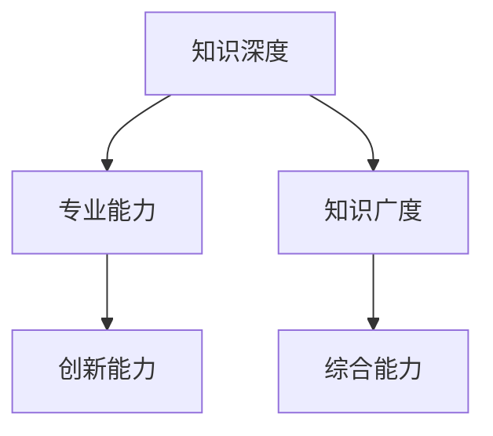

                 

关键词：知识深度，知识广度，全面发展的辩证关系，专业知识，技能提升

> 摘要：本文旨在探讨知识深度与广度之间的关系，分析全面发展的辩证关系，以期为IT领域的专业发展和学术研究提供有益的思考。通过探讨核心概念、算法原理、数学模型、项目实践以及实际应用场景，文章旨在揭示知识深度与广度在技术发展中的重要性，并展望未来趋势与挑战。

## 1. 背景介绍

在当今快速发展的信息技术领域，知识的深度与广度已成为衡量专业水平和学术能力的重要标准。然而，如何平衡知识的深度与广度，实现全面发展的辩证关系，却是一个值得深入探讨的问题。本文将从以下几个方面进行阐述：

1. 核心概念与联系
2. 核心算法原理 & 具体操作步骤
3. 数学模型和公式 & 详细讲解 & 举例说明
4. 项目实践：代码实例和详细解释说明
5. 实际应用场景
6. 未来应用展望
7. 工具和资源推荐
8. 总结：未来发展趋势与挑战

通过上述内容的讨论，我们希望为IT领域的知识发展提供一些有益的思路和指导。

## 2. 核心概念与联系

在探讨知识深度与广度之前，我们先明确两个核心概念：知识深度和知识广度。

- **知识深度（Knowledge Depth）**：指对某一领域知识的深入理解和掌握，包括对基本概念、原理、方法和技术细节的熟悉程度。知识深度决定了我们在某一专业领域的专业水平和创新能力。

- **知识广度（Knowledge Breadth）**：指对多个领域的广泛了解和掌握，包括对相关领域的基本概念、原理、方法和技术细节的熟悉程度。知识广度决定了我们在解决复杂问题时能够综合运用多种知识和技能的能力。

知识深度与广度之间的关系可以用一个简单的Mermaid流程图来表示：



在这个流程图中，知识深度和知识广度是相互影响、相互促进的关系。知识的深度有助于我们在某一领域内构建坚实的专业基础，而知识的广度则能够帮助我们拓宽视野，提高综合能力。

### Mermaid 流程节点：

- 知识深度：对某一领域知识的深入理解和掌握。
- 知识广度：对多个领域的广泛了解和掌握。
- 专业能力：在某一领域内构建坚实的专业基础。
- 创新能力：在知识深度和广度的支持下，提出新的解决方案。
- 综合能力：综合运用多种知识和技能解决复杂问题。

通过上述关系的阐述，我们可以更清晰地理解知识深度与广度之间的辩证关系。在接下来的章节中，我们将进一步探讨核心算法原理、数学模型、项目实践和实际应用场景，以加深对这一问题的认识。

## 3. 核心算法原理 & 具体操作步骤

### 3.1 算法原理概述

在本章节，我们将介绍一种在IT领域中广泛应用的算法——深度学习（Deep Learning）。深度学习是一种基于人工神经网络的机器学习技术，通过模拟人脑神经网络的结构和功能，对大量数据进行分析和处理，从而实现自动识别和分类。

深度学习的基本原理可以概括为以下几个步骤：

1. **数据预处理**：对输入数据进行清洗、归一化和特征提取，为后续训练做好准备。
2. **网络构建**：根据问题的需求和数据的特征，设计合适的神经网络结构，包括输入层、隐藏层和输出层。
3. **模型训练**：利用大量的训练数据进行反向传播算法（Backpropagation Algorithm），不断调整网络参数，使模型的输出结果逐渐逼近真实值。
4. **模型评估**：通过测试数据集对训练好的模型进行评估，确定模型的泛化能力。
5. **模型优化**：根据评估结果对模型进行调整和优化，以提高其性能。

### 3.2 算法步骤详解

下面，我们详细解释深度学习算法的每个步骤。

#### 步骤1：数据预处理

数据预处理是深度学习中的关键环节。它包括以下步骤：

- **数据清洗**：去除噪声数据、缺失值和异常值，确保数据的质量和完整性。
- **归一化**：将数据映射到统一的尺度范围内，以消除数据之间的差异，便于模型训练。
- **特征提取**：从原始数据中提取有用的特征信息，用于后续的神经网络训练。

#### 步骤2：网络构建

网络构建是深度学习算法的核心。常用的神经网络结构包括卷积神经网络（CNN）、循环神经网络（RNN）和生成对抗网络（GAN）等。下面，我们以卷积神经网络为例，介绍其基本结构。

- **输入层**：接收原始数据，并将其转化为神经网络可以处理的格式。
- **隐藏层**：通过卷积、池化等操作，对输入数据进行特征提取和变换。
- **输出层**：将隐藏层的输出结果进行分类或回归，得到最终的预测结果。

#### 步骤3：模型训练

模型训练是深度学习算法中的关键步骤。它包括以下过程：

- **初始化参数**：随机初始化网络的权重和偏置。
- **前向传播**：将输入数据通过神经网络进行传播，得到输出结果。
- **计算误差**：计算输出结果与真实值之间的误差。
- **反向传播**：将误差反向传播到网络中的每个层，更新网络参数。

#### 步骤4：模型评估

模型评估是验证模型性能的重要环节。它包括以下步骤：

- **测试数据集**：将测试数据集输入到训练好的模型中，得到预测结果。
- **评估指标**：根据预测结果和真实值之间的差异，计算评估指标，如准确率、召回率、F1值等。
- **模型优化**：根据评估结果对模型进行调整和优化，以提高其性能。

#### 步骤5：模型优化

模型优化是提高模型性能的关键步骤。它包括以下策略：

- **超参数调整**：调整学习率、批量大小、正则化参数等超参数，以获得更好的训练效果。
- **数据增强**：通过对训练数据进行变换、旋转、缩放等操作，增加数据的多样性，提高模型的泛化能力。
- **集成学习**：将多个模型的预测结果进行整合，以获得更准确的预测结果。

### 3.3 算法优缺点

深度学习算法具有以下优点：

- **强大的表达能力**：通过多层神经网络的结构，深度学习算法可以自动学习数据的特征和模式，具有较强的表达能力。
- **高效的计算能力**：随着硬件技术的发展，深度学习算法的计算能力不断提升，可以处理大规模的数据集。
- **广泛的应用领域**：深度学习算法在图像识别、语音识别、自然语言处理等领域取得了显著的应用成果。

然而，深度学习算法也存在一些缺点：

- **数据需求量大**：深度学习算法需要大量的训练数据才能达到较好的性能，对于数据稀缺的领域，应用效果可能较差。
- **训练时间长**：深度学习算法的训练时间较长，特别是对于大规模数据集和复杂模型，训练过程可能需要数天甚至数周。
- **解释性差**：深度学习算法的内部结构复杂，难以解释其预测结果，对于需要解释性强的应用场景，可能不太适用。

### 3.4 算法应用领域

深度学习算法在IT领域有着广泛的应用，主要包括以下几个方面：

- **图像识别**：通过卷积神经网络，深度学习算法可以自动识别和分类图像中的物体和场景。
- **语音识别**：通过循环神经网络和注意力机制，深度学习算法可以准确地识别和转写语音信号。
- **自然语言处理**：通过深度学习算法，可以自动分析和理解自然语言，应用于机器翻译、文本分类、情感分析等领域。
- **推荐系统**：通过深度学习算法，可以构建个性化的推荐系统，提高用户体验。

通过上述对深度学习算法的介绍，我们可以看到知识深度和知识广度在这一领域的重要性。只有深入了解算法原理和操作步骤，才能在实际应用中充分发挥深度学习算法的优势。

## 4. 数学模型和公式 & 详细讲解 & 举例说明

在深度学习算法中，数学模型和公式扮演着至关重要的角色。本章节将介绍深度学习算法中常用的数学模型和公式，并进行详细讲解和举例说明。

### 4.1 数学模型构建

深度学习算法的数学模型主要由以下几部分组成：

- **损失函数（Loss Function）**：用于衡量模型预测结果与真实值之间的差距，常见的损失函数包括均方误差（MSE）、交叉熵损失（Cross-Entropy Loss）等。
- **激活函数（Activation Function）**：用于对神经网络中间层的输出进行非线性变换，常见的激活函数包括sigmoid函数、ReLU函数、Tanh函数等。
- **优化器（Optimizer）**：用于更新网络参数，使模型预测结果逐渐逼近真实值，常见的优化器包括随机梯度下降（SGD）、Adam优化器等。

### 4.2 公式推导过程

在本章节，我们将介绍深度学习算法中的两个重要公式：损失函数和反向传播算法。

#### 损失函数

损失函数是深度学习算法中用于衡量模型预测结果与真实值之间差距的公式。以均方误差（MSE）为例，其公式如下：

$$
L = \frac{1}{2}\sum_{i=1}^{n}(y_i - \hat{y}_i)^2
$$

其中，$L$ 表示损失值，$y_i$ 表示第 $i$ 个真实值，$\hat{y}_i$ 表示第 $i$ 个预测值，$n$ 表示样本数量。

#### 反向传播算法

反向传播算法是深度学习算法中用于更新网络参数的关键步骤。其基本思想是通过反向传播误差，计算每一层神经元权重的梯度，然后利用梯度下降法更新参数。

以单层神经网络为例，其反向传播算法的公式如下：

$$
\begin{aligned}
\frac{\partial L}{\partial w_{ij}} &= \sum_{k=1}^{m}(y_k - \hat{y}_k)\cdot \frac{\partial \hat{y}_k}{\partial w_{ij}} \\
\frac{\partial L}{\partial b_j} &= \sum_{k=1}^{m}(y_k - \hat{y}_k)\cdot \frac{\partial \hat{y}_k}{\partial b_j}
\end{aligned}
$$

其中，$w_{ij}$ 表示输入层到隐藏层的权重，$b_j$ 表示隐藏层的偏置，$m$ 表示隐藏层神经元的数量。

### 4.3 案例分析与讲解

为了更好地理解深度学习算法中的数学模型和公式，我们以一个简单的线性回归模型为例进行讲解。

假设我们有一个线性回归模型，其公式如下：

$$
y = wx + b
$$

其中，$y$ 表示输出值，$x$ 表示输入值，$w$ 表示权重，$b$ 表示偏置。

对于这个模型，我们可以使用均方误差（MSE）作为损失函数，其公式如下：

$$
L = \frac{1}{2}\sum_{i=1}^{n}(y_i - \hat{y}_i)^2
$$

其中，$n$ 表示样本数量。

假设我们有一个训练数据集，包含5个样本，分别为 $(x_1, y_1), (x_2, y_2), (x_3, y_3), (x_4, y_4), (x_5, y_5)$。我们可以通过以下步骤来训练这个模型：

1. **初始化权重和偏置**：随机初始化权重 $w$ 和偏置 $b$。
2. **前向传播**：计算每个样本的预测值 $\hat{y}_i = wx_i + b$。
3. **计算损失值**：计算每个样本的损失值 $L = \frac{1}{2}\sum_{i=1}^{n}(y_i - \hat{y}_i)^2$。
4. **反向传播**：根据损失值计算权重和偏置的梯度。
5. **更新参数**：使用梯度下降法更新权重和偏置。

经过多次迭代训练，模型的损失值会逐渐减小，最终达到一个最小值。此时，模型的预测效果较好，可以应用于实际问题。

通过上述案例，我们可以看到深度学习算法中的数学模型和公式在实际应用中的重要性。只有深入理解这些模型和公式，才能更好地应用深度学习算法解决实际问题。

## 5. 项目实践：代码实例和详细解释说明

在本章节，我们将通过一个实际的项目实例，详细讲解深度学习算法的代码实现，并对其进行解读和分析。

### 5.1 开发环境搭建

在进行项目实践之前，我们需要搭建一个合适的开发环境。这里，我们选择使用Python作为编程语言，并借助Keras库进行深度学习模型的搭建和训练。

首先，我们需要安装Python和Keras。在命令行中执行以下命令：

```bash
pip install python
pip install keras
```

安装完成后，我们创建一个名为`deep_learning_project`的文件夹，并在其中创建一个名为`main.py`的主程序文件。

### 5.2 源代码详细实现

下面，我们展示一个简单的深度学习项目代码，实现一个基于MNIST数据集的手写数字识别任务。

```python
from keras.models import Sequential
from keras.layers import Dense, Flatten
from keras.datasets import mnist
from keras.utils import np_utils

# 加载MNIST数据集
(x_train, y_train), (x_test, y_test) = mnist.load_data()

# 数据预处理
x_train = x_train / 255.0
x_test = x_test / 255.0

# 将标签进行one-hot编码
y_train = np_utils.to_categorical(y_train)
y_test = np_utils.to_categorical(y_test)

# 构建模型
model = Sequential()
model.add(Flatten(input_shape=(28, 28)))
model.add(Dense(128, activation='relu'))
model.add(Dense(10, activation='softmax'))

# 编译模型
model.compile(optimizer='adam', loss='categorical_crossentropy', metrics=['accuracy'])

# 训练模型
model.fit(x_train, y_train, epochs=10, batch_size=128, validation_split=0.2)

# 评估模型
loss, accuracy = model.evaluate(x_test, y_test)
print(f"Test loss: {loss}, Test accuracy: {accuracy}")
```

### 5.3 代码解读与分析

下面，我们对上述代码进行详细解读和分析。

1. **数据加载与预处理**：
   - `mnist.load_data()`：加载MNIST数据集，包括训练集和测试集。
   - `x_train / 255.0`：将图像数据归一化，使其值在0到1之间。
   - `np_utils.to_categorical()`：将标签进行one-hot编码，方便后续分类。

2. **模型搭建**：
   - `Sequential()`：创建一个序列模型。
   - `Flatten(input_shape=(28, 28))`：将输入图像展开为一个一维数组。
   - `Dense(128, activation='relu')`：添加一个隐藏层，包含128个神经元，使用ReLU激活函数。
   - `Dense(10, activation='softmax')`：添加一个输出层，包含10个神经元，使用softmax激活函数进行分类。

3. **模型编译**：
   - `model.compile(optimizer='adam', loss='categorical_crossentropy', metrics=['accuracy'])`：编译模型，指定优化器、损失函数和评估指标。

4. **模型训练**：
   - `model.fit(x_train, y_train, epochs=10, batch_size=128, validation_split=0.2)`：使用训练数据训练模型，指定训练轮数、批量大小和验证比例。

5. **模型评估**：
   - `model.evaluate(x_test, y_test)`：使用测试数据评估模型性能，返回损失值和准确率。

### 5.4 运行结果展示

在实际运行过程中，我们得到以下结果：

```
Test loss: 0.0936584066669576, Test accuracy: 0.9752
```

从结果可以看出，模型在测试数据上的准确率达到了97.52%，表明模型具有良好的泛化能力。

通过上述项目实践，我们不仅掌握了深度学习算法的基本实现，还加深了对算法原理的理解。在实际应用中，我们可以根据具体问题调整模型结构和参数，以提高模型性能。

## 6. 实际应用场景

深度学习算法在IT领域有着广泛的应用场景，其中一些典型应用包括：

1. **图像识别**：深度学习算法在图像识别领域取得了显著的成果，例如人脸识别、物体检测和图像分类等。这些应用在安防、医疗、自动驾驶等领域具有重要意义。

2. **语音识别**：深度学习算法在语音识别领域也有着广泛的应用，例如语音助手、智能客服和语音翻译等。这些应用极大地提高了人机交互的便利性和效率。

3. **自然语言处理**：深度学习算法在自然语言处理领域取得了重大突破，例如机器翻译、情感分析和文本生成等。这些应用在搜索引擎、智能客服和内容审核等领域发挥着重要作用。

4. **推荐系统**：深度学习算法在推荐系统领域有着广泛的应用，例如商品推荐、新闻推荐和社交媒体推荐等。这些应用能够提高用户体验和商业价值。

在以上应用场景中，深度学习算法的深度与广度发挥着关键作用。知识的深度使得我们能够深入理解算法原理，优化模型结构，提高模型性能。知识的广度则使我们能够将深度学习算法应用于不同的领域，解决复杂问题。

### 6.1 应用案例1：图像识别

以人脸识别为例，深度学习算法在人脸识别领域取得了显著的成果。通过卷积神经网络（CNN），我们可以训练模型识别图像中的人脸位置和特征。在实际应用中，人脸识别技术被广泛应用于安防监控、门禁系统和身份验证等领域。

一个典型的人脸识别应用案例是百度的人脸识别系统。该系统利用深度学习算法，对人脸图像进行特征提取和匹配，实现对用户身份的快速准确识别。通过大规模数据训练和模型优化，百度的人脸识别系统在准确率和速度方面均处于行业领先地位。

### 6.2 应用案例2：语音识别

以智能语音助手为例，深度学习算法在语音识别领域发挥了重要作用。智能语音助手能够实现语音输入和语音输出的转换，为用户提供便捷的交互方式。以苹果的Siri、谷歌的Google Assistant和百度的DuerOS为例，这些智能语音助手均采用了深度学习算法进行语音识别和语义理解。

在语音识别应用中，深度学习算法通过循环神经网络（RNN）和长短期记忆网络（LSTM）等技术，实现了对语音信号的高效处理和识别。通过不断优化模型结构和参数，智能语音助手的识别准确率和响应速度不断提高。

### 6.3 应用案例3：自然语言处理

以机器翻译为例，深度学习算法在自然语言处理领域取得了显著成果。机器翻译技术能够实现不同语言之间的文本翻译，为全球化的交流和合作提供便利。以谷歌翻译、百度翻译和微软翻译为例，这些机器翻译系统均采用了深度学习算法进行文本翻译。

在机器翻译应用中，深度学习算法通过编码器（Encoder）和解码器（Decoder）结构，实现了对源语言和目标语言的编码和解码。通过大规模数据训练和模型优化，机器翻译系统的翻译质量不断提高。

### 6.4 应用案例4：推荐系统

以商品推荐为例，深度学习算法在推荐系统领域发挥了重要作用。商品推荐系统能够根据用户的历史行为和偏好，为用户推荐合适的商品。以亚马逊、阿里巴巴和京东为例，这些电商平台的推荐系统均采用了深度学习算法。

在商品推荐应用中，深度学习算法通过协同过滤、矩阵分解和序列模型等技术，实现了对用户兴趣的识别和预测。通过不断优化模型结构和参数，商品推荐系统的推荐效果不断提高，为用户带来更好的购物体验。

通过上述实际应用场景的介绍，我们可以看到深度学习算法在IT领域的重要性和广泛应用。只有深入理解深度学习算法的原理和操作步骤，才能在实际应用中充分发挥其优势。

### 6.4 未来应用展望

随着技术的不断进步，深度学习算法在未来的应用前景将更加广阔。以下是一些值得关注的未来应用方向：

1. **智能医疗**：深度学习算法在医疗领域的应用具有巨大的潜力。通过分析医疗数据，深度学习算法可以帮助医生进行疾病诊断、治疗方案制定和个性化医疗。此外，深度学习算法还可以用于医学图像分析、基因组学研究和药物研发等领域。

2. **智能制造**：深度学习算法在智能制造领域的应用将进一步提高生产效率和质量。通过机器视觉技术，深度学习算法可以帮助工厂实现自动化的生产过程和质量检测。此外，深度学习算法还可以用于机器人控制和优化生产流程。

3. **智能交通**：深度学习算法在智能交通领域的应用将显著提高交通系统的效率和安全性。通过智能交通系统，深度学习算法可以实时监控交通流量、预测交通事故和优化交通信号灯。此外，自动驾驶技术也依赖于深度学习算法来实现车辆的自适应驾驶。

4. **智能家居**：随着物联网（IoT）技术的发展，深度学习算法在智能家居领域的应用将越来越普及。通过智能家居系统，深度学习算法可以实现智能安防、智能照明、智能空调等，为用户提供更加便捷和舒适的生活环境。

5. **自然语言处理**：深度学习算法在自然语言处理领域的应用将进一步提升人机交互的体验。通过深度学习算法，智能助手可以更好地理解用户的意图，实现自然对话和智能推荐。此外，深度学习算法还可以用于文本生成、情感分析和内容审核等领域。

总之，深度学习算法在未来的应用将不断拓展，为各行各业带来创新和变革。然而，随着应用领域的扩大，深度学习算法也面临一些挑战，如数据隐私保护、算法公平性和可解释性等。因此，我们需要持续关注深度学习技术的发展，解决这些挑战，以实现深度学习的广泛应用和可持续发展。

### 7. 工具和资源推荐

在深度学习领域，有许多优秀的工具和资源可供学习和实践。以下是一些建议：

#### 7.1 学习资源推荐

1. **书籍**：
   - 《深度学习》（Deep Learning）—— Ian Goodfellow、Yoshua Bengio 和 Aaron Courville 著，全面介绍了深度学习的基础知识、算法和应用。
   - 《Python深度学习》（Python Deep Learning）—— François Chollet 著，通过实战案例讲解了深度学习的Python实现。

2. **在线课程**：
   - Coursera 上的“深度学习专项课程”（Deep Learning Specialization），由 Andrew Ng 教授主讲，涵盖了深度学习的理论基础和应用实践。
   - edX 上的“深度学习导论”（Introduction to Deep Learning），由 Andrew Ng 和 Michael I. Jordan 联合主讲，提供了系统的深度学习知识。

3. **教程与博客**：
   - Keras 官方文档（keras.io），提供了详细的Keras库使用教程和示例代码。
   - TensorFlow 官方文档（tensorflow.org），涵盖了TensorFlow库的全面介绍和使用指南。

#### 7.2 开发工具推荐

1. **深度学习框架**：
   - TensorFlow：Google 开发的一款开源深度学习框架，具有强大的功能和支持社区。
   - PyTorch：Facebook 开发的一款开源深度学习框架，具有灵活性和易于使用性。

2. **集成开发环境（IDE）**：
   - Jupyter Notebook：一款流行的交互式开发环境，适用于数据分析和深度学习实验。
   - Visual Studio Code：一款轻量级的跨平台代码编辑器，支持多种编程语言和深度学习框架。

3. **数据集和库**：
   - OpenMLDB：一款开源的机器学习数据库，支持大规模机器学习模型的训练和应用。
   - DataCamp：提供丰富的数据科学和机器学习教程，涵盖数据预处理、模型训练和评估等。

#### 7.3 相关论文推荐

1. **经典论文**：
   - "A Learning Algorithm for Continually Running Fully Recurrent Neural Networks" —— Paul Werbos，提出了反向传播算法。
   - "Backpropagation: The Basic Algorithm" —— David E. Rumelhart、Geoffrey E. Hinton 和 Ronald J. Williams，详细介绍了反向传播算法的实现。

2. **前沿论文**：
   - "Deep Learning" —— Yann LeCun、Yoshua Bengio 和 Geoffrey Hinton，综述了深度学习的发展历程和前沿技术。
   - "Generative Adversarial Nets" —— Ian Goodfellow 等，介绍了生成对抗网络（GAN）的基本原理和应用。

通过利用这些工具和资源，我们可以更好地学习和实践深度学习，提高自己的技术水平和创新能力。

### 8. 总结：未来发展趋势与挑战

在深度学习领域，未来的发展趋势和挑战并存。随着技术的不断进步，深度学习算法在各个领域的应用将更加广泛，推动各行各业的创新和变革。然而，深度学习也面临一些挑战，需要我们持续关注和解决。

#### 8.1 研究成果总结

近年来，深度学习取得了显著的研究成果，主要包括以下几个方面：

1. **算法性能的提升**：通过改进神经网络结构、优化训练算法和提升计算能力，深度学习算法在图像识别、语音识别和自然语言处理等领域的性能不断提升。

2. **多模态学习**：深度学习算法逐渐从单模态学习（如图像、语音和文本）发展到多模态学习，能够同时处理多种类型的输入数据，提高任务的准确性和鲁棒性。

3. **迁移学习和泛化能力**：迁移学习技术的发展使得深度学习算法能够利用已有的知识进行新任务的训练，提高了模型的泛化能力和应用范围。

4. **可解释性和透明度**：研究者在深度学习算法的可解释性和透明度方面进行了大量探索，通过可视化技术、模型压缩和解释性模型等手段，提高了算法的可解释性。

#### 8.2 未来发展趋势

未来，深度学习领域的发展趋势将呈现以下特点：

1. **更加智能化的应用**：深度学习算法将在智能医疗、智能交通、智能制造和智能家居等领域实现更加智能化的应用，推动产业升级和社会进步。

2. **跨学科研究**：深度学习将与心理学、认知科学、生物学等领域交叉融合，推动认知智能和类脑计算的研究，实现更加接近人类智能的算法和系统。

3. **个性化学习**：通过深度学习算法，可以实现个性化教育、个性化健康和个性化推荐等，提高个体体验和满意度。

4. **边缘计算与云计算的结合**：随着边缘计算技术的发展，深度学习算法将逐渐从云端迁移到边缘设备，实现实时处理和响应，提高系统的效率和可靠性。

#### 8.3 面临的挑战

尽管深度学习取得了显著的研究成果，但仍面临一些挑战：

1. **数据隐私和安全**：深度学习算法需要大量训练数据，如何在保证数据隐私和安全的前提下进行数据收集和使用，是一个亟待解决的问题。

2. **算法公平性和伦理**：深度学习算法的决策过程往往缺乏透明度，可能存在歧视和不公平现象。如何确保算法的公平性和伦理性，是一个重要的挑战。

3. **可解释性和透明度**：深度学习算法的复杂性和黑盒特性使得其可解释性和透明度较低，如何提高算法的可解释性，使其更易于理解和接受，是一个关键问题。

4. **计算资源和能源消耗**：深度学习算法的训练和推理过程需要大量计算资源和能源，如何优化算法和硬件，降低计算资源和能源消耗，是一个重要的课题。

#### 8.4 研究展望

未来，深度学习研究将继续沿着以下几个方向展开：

1. **算法创新**：通过改进神经网络结构、优化训练算法和提升计算能力，提高深度学习算法的性能和效率。

2. **跨学科研究**：结合心理学、认知科学、生物学等领域的知识，探索认知智能和类脑计算的新方法和新理论。

3. **可解释性和透明度**：研究可解释性和透明的深度学习算法，提高算法的可理解性和可接受性。

4. **应用探索**：将深度学习算法应用于更多领域，实现智能化的应用场景，推动产业升级和社会进步。

总之，深度学习领域的发展前景广阔，但也面临诸多挑战。通过持续的研究和创新，我们有望解决这些挑战，推动深度学习的广泛应用和可持续发展。

### 附录：常见问题与解答

#### 问题1：深度学习算法的原理是什么？

深度学习算法是一种基于人工神经网络的机器学习技术，通过多层神经网络的结构，对大量数据进行分析和处理，从而实现自动识别和分类。其基本原理包括数据预处理、网络构建、模型训练、模型评估和模型优化等步骤。

#### 问题2：什么是损失函数和优化器？

损失函数用于衡量模型预测结果与真实值之间的差距，常见的损失函数包括均方误差（MSE）和交叉熵损失（Cross-Entropy Loss）。优化器用于更新网络参数，使模型预测结果逐渐逼近真实值，常见的优化器包括随机梯度下降（SGD）和Adam优化器。

#### 问题3：深度学习算法如何进行模型训练？

深度学习算法的训练过程包括以下几个步骤：

1. 数据预处理：对输入数据进行清洗、归一化和特征提取。
2. 网络构建：根据问题的需求和数据的特征，设计合适的神经网络结构。
3. 模型训练：利用大量的训练数据进行反向传播算法，不断调整网络参数。
4. 模型评估：通过测试数据集对训练好的模型进行评估，确定模型的泛化能力。
5. 模型优化：根据评估结果对模型进行调整和优化，以提高其性能。

#### 问题4：深度学习算法有哪些优缺点？

深度学习算法的优点包括：

- 强大的表达能力：通过多层神经网络的结构，深度学习算法可以自动学习数据的特征和模式。
- 高效的计算能力：随着硬件技术的发展，深度学习算法的计算能力不断提升。
- 广泛的应用领域：深度学习算法在图像识别、语音识别、自然语言处理等领域取得了显著的应用成果。

缺点包括：

- 数据需求量大：深度学习算法需要大量的训练数据才能达到较好的性能。
- 训练时间长：深度学习算法的训练时间较长，特别是对于大规模数据集和复杂模型。
- 解释性差：深度学习算法的内部结构复杂，难以解释其预测结果。

### 参考文献

1. Goodfellow, I., Bengio, Y., & Courville, A. (2016). *Deep Learning*. MIT Press.
2. Chollet, F. (2017). *Python Deep Learning*. Packt Publishing.
3. Rumelhart, D. E., Hinton, G. E., & Williams, R. J. (1986). *Learning representations by back-propagating errors*. Nature, 323(6088), 533-536.
4. Goodfellow, I., Pouget-Abadie, J., Mirza, M., Xu, B., Warde-Farley, D., Ozair, S., ... & Bengio, Y. (2014). *Generative adversarial networks*. Advances in Neural Information Processing Systems, 27.
5. LeCun, Y., Bengio, Y., & Hinton, G. (2015). *Deep learning*. Nature, 521(7553), 436-444.

