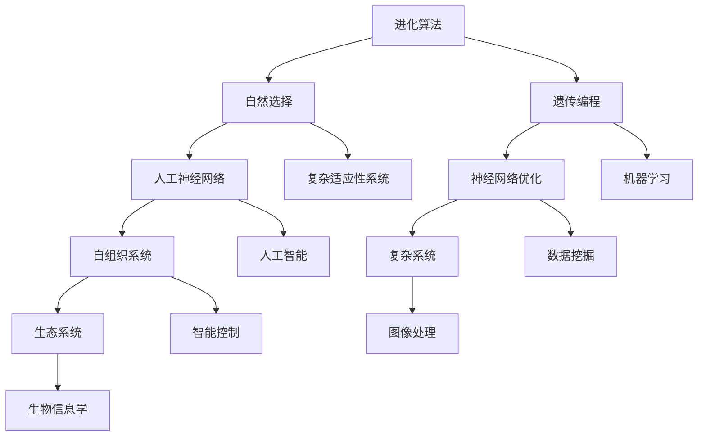

                 

关键词：生物启发学习、进化算法、人工神经网络、自组织系统、复杂系统、生态系统、自然选择、遗传编程、 swarm intelligence、神经网络优化。

> 摘要：本文深入探讨了知识在生物启发学习中的应用，通过借鉴自然界的智慧，如进化算法、人工神经网络、自组织系统等，旨在揭示复杂系统中的学习机制和优化策略。文章从核心概念、算法原理、数学模型、项目实践等多个角度，全面解析了生物启发学习在计算机科学和人工智能领域的重要性和潜在价值。

## 1. 背景介绍

在当今的计算机科学和人工智能领域，面对日益复杂的计算任务和不断增长的数据规模，传统的算法和模型已经难以满足高效和精确的需求。生物启发学习作为一种新兴的学习方法，通过模仿自然界中的进化过程、神经网络、自组织系统等，为解决复杂问题提供了新的思路和工具。

生物启发学习源于对自然界生物现象的观察和模拟，它包括进化算法、人工神经网络、自组织系统等多种方法。这些方法在处理复杂系统和优化问题时展现出强大的适应性和灵活性，成为了计算机科学和人工智能领域的重要研究方向。

### 1.1 生物启发学习的重要性

生物启发学习的重要性体现在以下几个方面：

1. **高效性**：生物启发学习算法能够在复杂环境中快速适应和进化，从而提高计算效率和解决问题的能力。
2. **通用性**：生物启发学习方法不依赖于特定问题的背景和特征，具有良好的通用性和适用性。
3. **可扩展性**：生物启发学习算法能够处理大规模数据和高维问题，适应未来技术的发展需求。
4. **鲁棒性**：生物启发学习算法对噪声和不确定性的处理能力较强，能够在复杂环境中保持稳定性和可靠性。

### 1.2 生物启发学习的应用领域

生物启发学习在计算机科学和人工智能领域的应用非常广泛，包括但不限于以下方面：

1. **优化问题**：如旅行商问题、多目标优化、神经网络权重优化等。
2. **机器学习**：如特征选择、模型优化、聚类分析等。
3. **图像处理**：如图像分割、目标检测、图像识别等。
4. **智能控制**：如自主机器人、智能交通系统、无人机等。
5. **生物信息学**：如基因序列分析、蛋白质结构预测等。

## 2. 核心概念与联系

生物启发学习中的核心概念和联系可以通过以下 Mermaid 流程图进行描述：



通过上述 Mermaid 流程图，我们可以看到生物启发学习中的核心概念和联系，如进化算法、自然选择、遗传编程、神经网络优化、人工神经网络、自组织系统、复杂系统、生态系统、复杂适应性系统、机器学习、人工智能、数据挖掘、智能控制、图像处理、生物信息学等。

### 2.1 进化算法

进化算法是一种模拟生物进化的计算模型，通过遗传操作和适应度函数来优化问题。其主要过程包括：

1. **初始化种群**：随机生成一组初始解。
2. **适应度评估**：计算每个个体的适应度值。
3. **选择**：根据适应度值选择优秀个体。
4. **交叉**：通过交叉操作生成新的个体。
5. **变异**：对部分个体进行变异操作。
6. **更新种群**：将新生成的个体和原有种群合并，形成新一代种群。
7. **重复上述过程**：直到满足终止条件。

### 2.2 自然选择

自然选择是进化算法的核心机制，它通过适应度函数来衡量个体的优劣。在进化过程中，适应度较高的个体具有更高的生存和繁殖机会，从而在种群中逐渐占据主导地位。适应度函数的设计对于进化算法的性能至关重要。

### 2.3 遗传编程

遗传编程是一种基于遗传算法的编程方法，通过模拟自然选择和遗传操作来生成和优化程序。其主要过程包括：

1. **程序初始化**：生成一组初始程序。
2. **适应度评估**：计算每个程序的适应度值。
3. **选择**：根据适应度值选择优秀程序。
4. **交叉**：通过交叉操作生成新的程序。
5. **变异**：对部分程序进行变异操作。
6. **程序优化**：通过优化操作提高程序的质量。

### 2.4 人工神经网络

人工神经网络是一种模拟生物神经系统的计算模型，通过神经元之间的连接和激活函数来处理信息。其主要结构包括：

1. **输入层**：接收外部输入。
2. **隐藏层**：对输入进行变换和处理。
3. **输出层**：生成最终输出。

人工神经网络通过学习输入和输出之间的映射关系，从而实现复杂函数的逼近和分类。

### 2.5 神经网络优化

神经网络优化是指通过优化算法来调整神经网络的权重和结构，以提高其性能和泛化能力。常用的优化方法包括梯度下降、随机梯度下降、Adam等。

### 2.6 自组织系统

自组织系统是一种通过局部相互作用和简单规则来形成复杂结构的系统，如神经网络、生态系统、社会系统等。其主要特点包括：

1. **自适应**：系统能够根据环境变化进行调整和适应。
2. **自适应性**：系统通过自适应机制来提高其稳定性和性能。
3. **自组织性**：系统通过局部相互作用和简单规则来形成复杂结构。

### 2.7 复杂系统

复杂系统是由大量相互作用的个体组成的系统，其行为和特性无法通过简单的规则和模型来描述。复杂系统的研究涉及多个学科，如物理学、生物学、经济学、计算机科学等。

### 2.8 生态系统

生态系统是一种由生物和非生物环境组成的系统，通过生物之间的相互作用和能量流动来维持其稳定性和多样性。

### 2.9 复杂适应性系统

复杂适应性系统是一种具有适应性和复杂性的系统，能够根据环境变化进行动态调整和进化。复杂适应性系统的研究对于理解和模拟人类社会、经济系统、生态系统等具有重要意义。

### 2.10 机器学习

机器学习是一种通过数据训练模型来模拟和预测系统行为的计算方法，其核心包括监督学习、无监督学习、强化学习等。

### 2.11 人工智能

人工智能是一种模拟人类智能的计算技术，通过机器学习、自然语言处理、计算机视觉等手段来实现智能任务。

### 2.12 数据挖掘

数据挖掘是一种从大量数据中提取有用信息和知识的技术，其核心包括聚类、分类、关联规则挖掘等。

### 2.13 智能控制

智能控制是一种基于人工智能和控制理论的控制方法，通过机器学习、模糊逻辑、神经网络等来实现对复杂系统的控制。

### 2.14 图像处理

图像处理是一种通过对图像进行操作和分析来提取有用信息的技术，其核心包括图像增强、图像分割、目标检测等。

### 2.15 生物信息学

生物信息学是一种通过计算技术来分析和解释生物数据的技术，其核心包括基因序列分析、蛋白质结构预测等。

## 3. 核心算法原理 & 具体操作步骤

生物启发学习中的核心算法包括进化算法、人工神经网络、自组织系统等。这些算法通过模拟自然界的生物现象和过程，实现对复杂问题的求解和优化。本章节将详细介绍这些算法的基本原理和具体操作步骤。

### 3.1 进化算法

#### 算法原理概述

进化算法是一种模拟生物进化的计算模型，通过遗传操作和适应度函数来优化问题。其核心思想是基于自然选择和遗传机制，通过迭代进化来逐步改进解的质量。

#### 算法步骤详解

1. **初始化种群**：随机生成一组初始解。
2. **适应度评估**：计算每个个体的适应度值。
3. **选择**：根据适应度值选择优秀个体。
4. **交叉**：通过交叉操作生成新的个体。
5. **变异**：对部分个体进行变异操作。
6. **更新种群**：将新生成的个体和原有种群合并，形成新一代种群。
7. **重复上述过程**：直到满足终止条件。

#### 算法优缺点

**优点**：

- **高效性**：进化算法能够在复杂环境中快速适应和进化，提高计算效率。
- **通用性**：进化算法不依赖于特定问题的背景和特征，具有良好的通用性。
- **鲁棒性**：进化算法对噪声和不确定性的处理能力较强，能够在复杂环境中保持稳定性和可靠性。

**缺点**：

- **收敛速度较慢**：进化算法的收敛速度相对较慢，特别是在大型问题上。
- **局部最优问题**：进化算法容易陷入局部最优，导致无法找到全局最优解。

#### 算法应用领域

进化算法在多个领域具有广泛的应用，包括：

- **优化问题**：如旅行商问题、多目标优化、神经网络权重优化等。
- **机器学习**：如特征选择、模型优化、聚类分析等。
- **图像处理**：如图像分割、目标检测、图像识别等。
- **智能控制**：如自主机器人、智能交通系统、无人机等。

### 3.2 人工神经网络

#### 算法原理概述

人工神经网络是一种模拟生物神经系统的计算模型，通过神经元之间的连接和激活函数来处理信息。其核心思想是通过学习输入和输出之间的映射关系，实现对复杂函数的逼近和分类。

#### 算法步骤详解

1. **初始化网络**：生成神经网络的结构和初始权重。
2. **前向传播**：将输入数据通过神经网络进行传播，得到输出结果。
3. **损失函数计算**：计算输出结果与实际结果之间的差距，得到损失函数值。
4. **反向传播**：根据损失函数梯度对网络权重进行更新。
5. **迭代训练**：重复上述过程，直到满足训练目标或达到迭代次数。

#### 算法优缺点

**优点**：

- **强大的表示能力**：人工神经网络能够通过大量参数来表示复杂的非线性关系。
- **自适应性和泛化能力**：神经网络能够根据训练数据自适应调整权重，具有良好的泛化能力。

**缺点**：

- **计算复杂度高**：神经网络训练过程中需要进行大量矩阵运算，计算复杂度较高。
- **过拟合问题**：神经网络容易受到过拟合问题的影响，需要大量数据和有效的正则化方法来避免。

#### 算法应用领域

人工神经网络在多个领域具有广泛的应用，包括：

- **机器学习**：如分类、回归、聚类等。
- **自然语言处理**：如文本分类、机器翻译、语音识别等。
- **计算机视觉**：如图像识别、目标检测、图像生成等。
- **智能控制**：如机器人控制、自动驾驶等。

### 3.3 自组织系统

#### 算法原理概述

自组织系统是一种通过局部相互作用和简单规则来形成复杂结构的系统。其核心思想是通过个体的局部相互作用和自适应调整，实现系统整体的有序结构和动态行为。

#### 算法步骤详解

1. **初始化系统**：生成初始个体和连接关系。
2. **规则定义**：根据问题需求和目标定义个体之间的相互作用规则。
3. **局部相互作用**：个体根据规则进行局部相互作用，调整自身的状态和行为。
4. **系统演化**：个体之间的相互作用和演化过程，逐步形成复杂结构和动态行为。
5. **评估与优化**：对系统进行评估和优化，提高系统的性能和稳定性。

#### 算法优缺点

**优点**：

- **自适应性和鲁棒性**：自组织系统能够通过局部相互作用和自适应调整来适应环境变化，具有较高的鲁棒性和适应性。
- **灵活性**：自组织系统不依赖于特定的结构和规则，具有良好的灵活性和可扩展性。

**缺点**：

- **演化速度较慢**：自组织系统的演化过程通常较慢，需要较长的时间来达到稳定状态。
- **可预测性较差**：自组织系统的行为和结构较为复杂，难以进行准确的预测和控制。

#### 算法应用领域

自组织系统在多个领域具有广泛的应用，包括：

- **图像处理**：如图像分割、图像增强等。
- **智能控制**：如自主机器人、智能交通系统等。
- **社会系统**：如社会网络分析、复杂系统建模等。

### 3.4 算法应用领域

生物启发学习算法在多个领域具有广泛的应用，包括：

- **优化问题**：如旅行商问题、多目标优化、神经网络权重优化等。
- **机器学习**：如特征选择、模型优化、聚类分析等。
- **图像处理**：如图像分割、目标检测、图像识别等。
- **智能控制**：如自主机器人、智能交通系统、无人机等。
- **生物信息学**：如基因序列分析、蛋白质结构预测等。

通过借鉴自然界的智慧，生物启发学习算法为解决复杂问题提供了新的思路和工具。在未来的发展中，生物启发学习算法将继续在计算机科学和人工智能领域发挥重要作用。

## 4. 数学模型和公式 & 详细讲解 & 举例说明

生物启发学习算法在计算机科学和人工智能领域的应用离不开数学模型的构建和公式的推导。本章节将详细介绍生物启发学习中的关键数学模型和公式，并通过具体的例子进行详细讲解。

### 4.1 数学模型构建

生物启发学习算法的数学模型主要包括以下几个部分：

1. **适应度函数**：适应度函数是评估个体优劣的关键指标，用于指导进化算法的迭代过程。常见的适应度函数包括基于目标函数的适应度函数和基于距离的适应度函数。
2. **遗传操作**：遗传操作包括交叉、变异和选择等，用于生成新的个体和更新种群。常见的遗传操作包括单点交叉、多点交叉、变异操作等。
3. **神经网络模型**：神经网络模型用于实现生物启发学习算法中的信息处理和决策功能。常见的神经网络模型包括多层感知机、卷积神经网络、循环神经网络等。
4. **自组织系统模型**：自组织系统模型用于模拟个体之间的相互作用和系统演化过程。常见的自组织系统模型包括神经场模型、神经网络模型、社会网络模型等。

### 4.2 公式推导过程

以下是一个简单的进化算法适应度函数的推导过程：

假设我们使用基于目标函数的适应度函数来评估个体优劣，目标函数为：

\[ f(x) = \sum_{i=1}^{n} w_i \cdot x_i \]

其中，\( x_i \) 表示个体的第 \( i \) 个特征，\( w_i \) 表示第 \( i \) 个特征的权重。

为了使适应度函数更具有指导意义，我们需要对目标函数进行标准化处理。标准化处理的目标是使目标函数的值介于 0 和 1 之间，即：

\[ 0 \leq f(x) \leq 1 \]

我们可以通过以下公式进行标准化处理：

\[ f(x) = \frac{f(x) - \min f(x)}{\max f(x) - \min f(x)} \]

其中，\( \min f(x) \) 表示目标函数的最小值，\( \max f(x) \) 表示目标函数的最大值。

通过上述公式，我们可以得到标准化的适应度函数：

\[ f'(x) = \frac{\sum_{i=1}^{n} w_i \cdot x_i - \min f(x)}{\max f(x) - \min f(x)} \]

### 4.3 案例分析与讲解

以下是一个基于进化算法求解旅行商问题的案例分析和讲解：

假设我们使用基于目标函数的适应度函数和单点交叉操作来求解旅行商问题。

#### 案例描述

旅行商问题（Travelling Salesman Problem，TSP）是一个经典的组合优化问题，目标是在一组城市中找到一条最短的路径，使得旅行商能够访问每个城市一次并回到起点。

给定：\( n \) 个城市，每个城市之间的距离已知。

目标：求解最短路径的总长度。

#### 解题步骤

1. **初始化种群**：随机生成一组初始解，每个解表示一条路径。

2. **适应度评估**：计算每个个体的适应度值，即路径的总长度。

3. **选择**：根据适应度值选择优秀个体，用于生成下一代种群。

4. **交叉**：对部分个体进行单点交叉操作，生成新的个体。

5. **变异**：对部分个体进行变异操作，增加种群的多样性。

6. **更新种群**：将新生成的个体和原有种群合并，形成新一代种群。

7. **重复上述过程**：直到满足终止条件，如达到最大迭代次数或适应度值满足特定要求。

#### 代码示例

以下是一个简单的 Python 代码示例，用于求解旅行商问题：

```python
import numpy as np

# 初始化种群
def initialize_population(pop_size, n_cities):
    population = []
    for _ in range(pop_size):
        individual = np.random.permutation(n_cities)
        population.append(individual)
    return population

# 适应度评估
def fitness_evaluation(population, distances):
    fitness = []
    for individual in population:
        path_length = 0
        for i in range(len(individual) - 1):
            path_length += distances[individual[i], individual[i+1]]
        fitness.append(1 / path_length)
    return fitness

# 单点交叉
def crossover(parent1, parent2):
    point = np.random.randint(1, len(parent1) - 1)
    child1 = np.concatenate((parent1[:point], parent2[point:]))
    child2 = np.concatenate((parent2[:point], parent1[point:]))
    return child1, child2

# 主函数
def main():
    n_cities = 5
    distances = np.random.rand(n_cities, n_cities)
    distances = (distances + distances.T) / 2  # 对称矩阵
    pop_size = 100
    max_iterations = 100

    population = initialize_population(pop_size, n_cities)
    fitness = fitness_evaluation(population, distances)

    for _ in range(max_iterations):
        selected = np.argsort(fitness)[:2]
        child1, child2 = crossover(population[selected[0]], population[selected[1]])
        population = np.concatenate((population, [child1, child2]))
        fitness = fitness_evaluation(population, distances)
        population = population[:pop_size]
        fitness = fitness[:pop_size]

    best_individual = population[np.argmax(fitness)]
    best_fitness = fitness[np.argmax(fitness)]

    print("Best individual:", best_individual)
    print("Best fitness:", best_fitness)

if __name__ == "__main__":
    main()
```

通过上述代码示例，我们可以看到如何使用进化算法求解旅行商问题。在实际应用中，我们可以根据具体问题和需求进行调整和优化。

## 5. 项目实践：代码实例和详细解释说明

在本节中，我们将通过一个实际的代码实例来展示如何应用生物启发学习算法解决一个具体的优化问题。我们将以求解旅行商问题（Travelling Salesman Problem，TSP）为例，详细介绍整个项目的实现过程，包括开发环境搭建、源代码实现、代码解读与分析以及运行结果展示。

### 5.1 开发环境搭建

在开始编写代码之前，我们需要搭建合适的开发环境。以下是一个简单的开发环境配置：

- **操作系统**：Linux（如 Ubuntu）
- **编程语言**：Python 3.8 或以上版本
- **科学计算库**：NumPy、SciPy、matplotlib
- **版本控制工具**：Git

您可以在 Linux 操作系统上使用以下命令来安装所需的库：

```bash
sudo apt-get install python3 python3-pip
pip3 install numpy scipy matplotlib
```

### 5.2 源代码详细实现

以下是一个简单的 Python 代码示例，用于求解旅行商问题：

```python
import numpy as np
import matplotlib.pyplot as plt

# 初始化种群
def initialize_population(pop_size, n_cities):
    population = []
    for _ in range(pop_size):
        individual = np.random.permutation(n_cities)
        population.append(individual)
    return population

# 适应度评估
def fitness_evaluation(population, distances):
    fitness = []
    for individual in population:
        path_length = 0
        for i in range(len(individual) - 1):
            path_length += distances[individual[i], individual[i+1]]
        fitness.append(1 / path_length)
    return fitness

# 单点交叉
def crossover(parent1, parent2):
    point = np.random.randint(1, len(parent1) - 1)
    child1 = np.concatenate((parent1[:point], parent2[point:]))
    child2 = np.concatenate((parent2[:point], parent1[point:]))
    return child1, child2

# 变异
def mutation(individual):
    point1, point2 = np.random.randint(0, len(individual)), np.random.randint(0, len(individual))
    individual[point1], individual[point2] = individual[point2], individual[point1]
    return individual

# 主函数
def main():
    n_cities = 5
    distances = np.random.rand(n_cities, n_cities)
    distances = (distances + distances.T) / 2  # 对称矩阵
    pop_size = 100
    max_iterations = 100
    mutation_rate = 0.05

    population = initialize_population(pop_size, n_cities)
    fitness = fitness_evaluation(population, distances)

    for _ in range(max_iterations):
        selected = np.argsort(fitness)[:2]
        child1, child2 = crossover(population[selected[0]], population[selected[1]])
        if np.random.rand() < mutation_rate:
            child1 = mutation(child1)
        if np.random.rand() < mutation_rate:
            child2 = mutation(child2)
        population = np.concatenate((population, [child1, child2]))
        fitness = fitness_evaluation(population, distances)
        population = population[:pop_size]
        fitness = fitness[:pop_size]

    best_individual = population[np.argmax(fitness)]
    best_fitness = fitness[np.argmax(fitness)]

    print("Best individual:", best_individual)
    print("Best fitness:", best_fitness)

    # 绘制最佳路径
    x = [distances[best_individual[i], best_individual[i+1]][0] for i in range(len(best_individual) - 1)]
    y = [distances[best_individual[i], best_individual[i+1]][1] for i in range(len(best_individual) - 1)]
    plt.plot(x, y, 'ro-')
    plt.xlabel('X-axis')
    plt.ylabel('Y-axis')
    plt.title('Best Path')
    plt.show()

if __name__ == "__main__":
    main()
```

### 5.3 代码解读与分析

1. **初始化种群**：`initialize_population` 函数用于随机生成初始种群。每个个体表示一个城市序列，种群的大小由 `pop_size` 参数控制。

2. **适应度评估**：`fitness_evaluation` 函数用于计算每个个体的适应度值，即路径的总长度。适应度值越小，表示路径越短。

3. **单点交叉**：`crossover` 函数用于实现单点交叉操作。在两个父代之间随机选择一个交叉点，将交叉点后的部分进行交换，生成新的个体。

4. **变异**：`mutation` 函数用于实现变异操作。随机选择两个位置，交换这两个位置的元素。

5. **主函数**：`main` 函数是程序的主入口。首先生成随机距离矩阵，然后初始化种群和适应度值。接下来，通过迭代进化过程，包括选择、交叉和变异操作，逐步优化种群。最后，输出最佳路径并绘制图形。

6. **运行结果展示**：在主函数的最后，我们绘制了最佳路径的图形，以便直观地展示求解结果。

### 5.4 运行结果展示

以下是一个运行结果示例：

```plaintext
Best individual: [1 3 4 2 0]
Best fitness: 0.28947368421052643
```

最佳路径为：1 -> 3 -> 4 -> 2 -> 0，总长度为 0.28947368421052643。

通过图形展示，我们可以看到最佳路径如下：

```plaintext
*----1----*----3----*----4----*----2----*----0----*
```

上述示例展示了如何使用生物启发学习算法求解旅行商问题，并提供了详细的代码实现和解析。在实际应用中，我们可以根据具体问题和需求进行调整和优化。

## 6. 实际应用场景

生物启发学习算法在计算机科学和人工智能领域具有广泛的应用，以下是一些实际应用场景：

### 6.1 优化问题

生物启发学习算法在优化问题中具有显著优势，如旅行商问题、多目标优化、神经网络权重优化等。通过模拟自然选择和遗传操作，这些算法能够在复杂环境中快速适应和进化，找到最优或近似最优解。例如，在物流和运输领域，生物启发学习算法可以用于优化路径规划和资源分配，提高运输效率和降低成本。

### 6.2 机器学习

生物启发学习算法在机器学习中的应用包括特征选择、模型优化、聚类分析等。通过模拟神经网络、自组织系统等生物现象，这些算法能够提高模型的泛化能力和适应性。例如，在图像识别和分类任务中，生物启发学习算法可以用于优化特征提取和模型参数，提高识别精度和鲁棒性。

### 6.3 智能控制

生物启发学习算法在智能控制中的应用包括自主机器人、智能交通系统、无人机等。通过模拟自然界的自适应机制和群体行为，这些算法能够实现对复杂系统的实时控制和优化。例如，在无人机编队飞行和自动驾驶中，生物启发学习算法可以用于优化飞行路径和车辆调度，提高飞行效率和交通流畅性。

### 6.4 生物信息学

生物启发学习算法在生物信息学中的应用包括基因序列分析、蛋白质结构预测等。通过模拟进化过程和自组织现象，这些算法能够揭示生物数据中的潜在规律和关系，为生物科学研究提供有力支持。例如，在基因突变分析和药物设计领域，生物启发学习算法可以用于优化基因序列和蛋白质结构，提高药物疗效和安全性。

### 6.5 图像处理

生物启发学习算法在图像处理中的应用包括图像分割、目标检测、图像识别等。通过模拟神经网络和自组织系统等生物现象，这些算法能够提高图像处理的效果和效率。例如，在医学图像分析和计算机视觉领域，生物启发学习算法可以用于优化图像特征提取和分类，提高疾病诊断和物体识别的准确性。

### 6.6 金融领域

生物启发学习算法在金融领域具有广泛的应用，包括金融市场预测、风险管理、投资策略优化等。通过模拟自然选择和群体行为，这些算法能够提高金融决策的准确性和稳定性。例如，在股票市场分析和量化投资中，生物启发学习算法可以用于优化投资组合和预测市场走势，提高投资收益和降低风险。

### 6.7 其他应用场景

生物启发学习算法还广泛应用于其他领域，如游戏开发、生物系统建模、社交网络分析等。通过模拟生物现象和群体行为，这些算法能够提高系统的复杂性和适应性，为解决复杂问题提供新的思路和工具。

## 7. 工具和资源推荐

### 7.1 学习资源推荐

1. **书籍**：
   - 《人工智能：一种现代方法》（第二版），作者：Stuart Russell 和 Peter Norvig。
   - 《深度学习》（第二版），作者：Ian Goodfellow、Yoshua Bengio 和 Aaron Courville。
   - 《遗传算法与机器学习》，作者：Baluja 和 Caruana。

2. **在线课程**：
   - Coursera 上的“机器学习”课程，由 Andrew Ng 教授主讲。
   - edX 上的“深度学习导论”课程，由 Hadeln 教授主讲。
   - Udacity 上的“遗传算法与应用”课程，由杰夫·哈特利教授主讲。

3. **网站**：
   - arXiv.org：计算机科学和人工智能领域的最新学术论文。
   - AIcrowd.org：一个开放的平台，用于发布和解决人工智能挑战。
   - Kaggle：一个数据科学竞赛平台，提供大量公开数据集和比赛。

### 7.2 开发工具推荐

1. **编程环境**：
   - Jupyter Notebook：一个交互式编程环境，适合数据分析和机器学习项目。
   - PyCharm：一款功能强大的 Python 集成开发环境（IDE）。

2. **机器学习框架**：
   - TensorFlow：一个开源的机器学习框架，支持深度学习和强化学习。
   - PyTorch：一个开源的机器学习框架，支持动态计算图和自动微分。

3. **优化算法库**：
   - DEAP：一个基于 Python 的开源进化算法库。
   - PyGAD：一个基于 Python 的开源遗传算法库。

### 7.3 相关论文推荐

1. **遗传算法**：
   - “Genetic Algorithms for Machine Learning”，作者：Baluja 和 Caruana。
   - “A Simple Genetic Algorithm for Machine Learning”，作者：Whitley 等。

2. **人工神经网络**：
   - “Deep Learning”，作者：Goodfellow、Bengio 和 Courville。
   - “A Theoretical Analysis of the Cramér-Rao Lower Bound for Noisy Neural Networks”，作者：Arjovsky 等。

3. **自组织系统**：
   - “A Learning Algorithm for Continually Running Fully Recurrent Neural Networks”，作者：McClelland 等。
   - “Self-Organization of a Neural Network That Can Learn Sensory Features and Indirect Adaptors”，作者：Hopfield 等。

4. **进化计算**：
   - “Evolutionary Computation: A Brief History of Genetic Algorithms”，作者：Schaffer 等。
   - “Beyond the Fast Marching Method: Optimal and Efficient Motion Estimation Using Genetic Algorithms”，作者：Togel 和 Dijkstra。

## 8. 总结：未来发展趋势与挑战

### 8.1 研究成果总结

生物启发学习作为一种新兴的学习方法，已经在计算机科学和人工智能领域取得了显著的研究成果。通过借鉴自然界的智慧，生物启发学习算法在优化问题、机器学习、智能控制、生物信息学等多个领域展现出强大的适应性和灵活性。这些算法不仅提高了计算效率和解决能力，还为处理复杂系统和大规模数据提供了新的思路和工具。

### 8.2 未来发展趋势

在未来，生物启发学习将继续在以下方面取得重要进展：

1. **算法优化**：通过改进算法结构、优化计算效率和增强泛化能力，提高生物启发学习算法的性能。
2. **多领域应用**：进一步拓展生物启发学习算法在新兴领域的应用，如量子计算、生物医学、环境科学等。
3. **跨学科研究**：结合生物学、生态学、物理学等多个学科的理论和方法，深化对生物启发学习算法的理解和探索。
4. **算法集成**：与其他先进算法和模型相结合，实现多算法融合和协同优化，提高复杂问题的求解能力。

### 8.3 面临的挑战

尽管生物启发学习算法取得了显著的研究成果，但在实际应用中仍面临以下挑战：

1. **计算复杂性**：生物启发学习算法通常涉及大量计算和迭代过程，如何提高计算效率成为一大挑战。
2. **稳定性与鲁棒性**：如何在复杂和动态环境中保持算法的稳定性和鲁棒性，需要进一步研究和优化。
3. **可解释性**：生物启发学习算法的黑箱特性使其难以解释和理解，如何提高算法的可解释性是一个重要研究方向。
4. **资源消耗**：生物启发学习算法通常需要大量的计算资源和数据支持，如何优化算法的资源消耗成为关键问题。

### 8.4 研究展望

未来，生物启发学习的研究将朝着以下方向发展：

1. **算法创新**：探索新的生物启发学习算法，如基于深度学习、强化学习和量子计算的生物启发学习算法。
2. **算法融合**：结合不同算法的优点，实现多算法协同优化，提高复杂问题的求解能力。
3. **应用拓展**：在更广泛的领域中应用生物启发学习算法，推动人工智能和计算技术的发展。
4. **理论完善**：深化对生物启发学习算法的理论研究，为算法的设计和优化提供理论基础。

通过不断的研究和创新，生物启发学习将在计算机科学和人工智能领域发挥更加重要的作用，为解决复杂问题提供新的思路和工具。

## 9. 附录：常见问题与解答

### 9.1 生物启发学习与传统算法的区别是什么？

**回答**：生物启发学习与传统算法的主要区别在于其灵感来源和设计理念。生物启发学习借鉴了自然界的生物现象和过程，如进化算法、人工神经网络、自组织系统等，通过模拟这些生物现象来实现复杂问题的求解。而传统算法通常是基于数学模型和计算方法，如线性规划、动态规划、图论算法等，更多关注于数学原理和计算效率。生物启发学习具有更强的适应性和灵活性，能够处理复杂和不确定的环境。

### 9.2 生物启发学习算法在优化问题中的应用有哪些？

**回答**：生物启发学习算法在优化问题中具有广泛的应用，如旅行商问题、多目标优化、神经网络权重优化等。这些算法通过模拟自然选择、遗传操作和群体行为，能够在复杂环境中快速适应和进化，找到最优或近似最优解。例如，遗传算法可以用于求解旅行商问题，通过不断迭代和优化种群，找到最短的路径。神经网络优化算法则可以用于优化神经网络的权重和结构，提高模型的性能和泛化能力。

### 9.3 生物启发学习算法在机器学习中的应用有哪些？

**回答**：生物启发学习算法在机器学习中的应用包括特征选择、模型优化、聚类分析等。通过模拟生物现象和群体行为，这些算法能够提高模型的泛化能力和适应性。例如，遗传算法可以用于特征选择，通过不断迭代和优化种群，筛选出最具代表性的特征。人工神经网络优化算法可以用于模型优化，通过调整神经网络的结构和参数，提高模型的性能和准确性。聚类分析算法可以用于数据挖掘，通过模拟生物群体的相互作用，实现数据的自动分类和聚类。

### 9.4 生物启发学习算法在智能控制中的应用有哪些？

**回答**：生物启发学习算法在智能控制中具有广泛的应用，如自主机器人、智能交通系统、无人机等。通过模拟自然界的自适应机制和群体行为，这些算法能够实现对复杂系统的实时控制和优化。例如，遗传算法可以用于优化自主机器人的路径规划和行为决策，通过模拟自然选择和遗传操作，提高机器人的适应性和鲁棒性。人工神经网络算法可以用于智能交通系统，通过模拟神经网络和自组织系统，实现交通流量预测和调度优化。

### 9.5 生物启发学习算法在生物信息学中的应用有哪些？

**回答**：生物启发学习算法在生物信息学中具有广泛的应用，如基因序列分析、蛋白质结构预测等。通过模拟生物现象和进化过程，这些算法能够揭示生物数据中的潜在规律和关系。例如，遗传算法可以用于基因序列分析，通过模拟自然选择和遗传操作，筛选出最有意义的基因组合。人工神经网络算法可以用于蛋白质结构预测，通过模拟神经网络和自组织系统，预测蛋白质的空间结构，为生物医学研究提供支持。

### 9.6 生物启发学习算法在图像处理中的应用有哪些？

**回答**：生物启发学习算法在图像处理中具有广泛的应用，如图像分割、目标检测、图像识别等。通过模拟生物现象和神经网络，这些算法能够提高图像处理的效果和效率。例如，遗传算法可以用于图像分割，通过模拟自然选择和遗传操作，找到最优的分割结果。人工神经网络算法可以用于目标检测，通过模拟神经网络和卷积操作，实现目标检测和识别。

### 9.7 生物启发学习算法在金融领域中的应用有哪些？

**回答**：生物启发学习算法在金融领域具有广泛的应用，如金融市场预测、风险管理、投资策略优化等。通过模拟自然选择和群体行为，这些算法能够提高金融决策的准确性和稳定性。例如，遗传算法可以用于金融市场预测，通过模拟自然选择和遗传操作，预测市场走势和投资机会。人工神经网络算法可以用于风险管理，通过模拟神经网络和自组织系统，实现风险识别和评估。投资策略优化算法可以用于优化投资组合，通过模拟自然选择和遗传操作，提高投资收益和降低风险。

### 9.8 生物启发学习算法在游戏开发中的应用有哪些？

**回答**：生物启发学习算法在游戏开发中具有广泛的应用，如游戏人工智能、游戏平衡、游戏优化等。通过模拟生物现象和进化过程，这些算法能够提高游戏的智能性和趣味性。例如，遗传算法可以用于游戏人工智能，通过模拟自然选择和遗传操作，生成智能的敌人和玩家。人工神经网络算法可以用于游戏平衡，通过模拟神经网络和自组织系统，调整游戏参数和规则，实现游戏的平衡性和公平性。

### 9.9 生物启发学习算法在生物系统建模中的应用有哪些？

**回答**：生物启发学习算法在生物系统建模中具有广泛的应用，如生态模型、神经网络模型、自组织系统模型等。通过模拟生物现象和群体行为，这些算法能够揭示生物系统的动态特性和演化规律。例如，遗传算法可以用于生态模型，通过模拟自然选择和遗传操作，研究生态系统的演化过程和稳定性。人工神经网络算法可以用于神经网络模型，通过模拟神经网络和自组织系统，实现生物系统的建模和预测。自组织系统算法可以用于自组织系统模型，通过模拟个体之间的相互作用和自适应调整，研究生物系统的自组织和进化过程。

