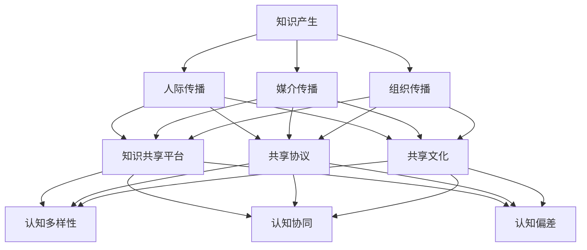

                 

关键词：知识社会学，群体智慧，形成机制，认知计算，协作学习，信息传播

> 摘要：本文从知识社会学的角度，探讨了群体智慧的形成机制。通过分析知识在社会层面的传播与共享，以及群体成员的认知行为和互动模式，我们揭示了群体智慧在技术和社会发展中的重要作用。本文旨在为人工智能领域的研究者和开发者提供新的视角，以深化对群体智慧的理解，并探索其在未来应用中的潜力。

## 1. 背景介绍

在信息技术飞速发展的今天，人工智能（AI）已经渗透到我们生活的方方面面。从搜索引擎到自动驾驶，从智能家居到医疗诊断，AI技术的应用不断拓展我们的认知边界。然而，AI的成功不仅仅依赖于单点突破的算法创新，更重要的是它背后的群体智慧。

群体智慧是指由多个个体组成的集体通过协作、共享和交流，共同解决问题或创造价值的智能。这种智慧不仅体现在自然界中的动物群体中，如蜜蜂的分工协作、鸟群的迁徙导航，也体现在人类社会中的各类组织和团队中，如企业研发团队、学术研究共同体等。

在计算机科学和人工智能领域，群体智慧的概念也得到了广泛研究。例如，通过分布式计算和协作学习算法，可以构建出超越单个智能体能力的系统。近年来，诸如深度强化学习、生成对抗网络等模型，也展示了群体智能的潜力。然而，如何深入理解群体智慧的形成机制，仍然是学术界和工业界亟待解决的重要问题。

本文将从知识社会学的视角，探讨群体智慧的形成机制。知识社会学是研究知识在社会中的产生、传播、应用和变迁的学科，它为我们理解群体智慧提供了重要的理论基础。通过分析知识在社会层面的传播与共享，以及群体成员的认知行为和互动模式，我们将试图揭示群体智慧在技术和社会发展中的重要作用。

## 2. 核心概念与联系

### 2.1 知识的传播与共享

在群体智慧的形成过程中，知识的传播与共享起着至关重要的作用。知识不仅包括信息，还涵盖了信念、态度和价值观。在社会层面，知识的传播主要通过以下几种方式实现：

- **人际传播**：个体通过直接交流、讨论和互动，将自己的知识传递给其他个体。
- **媒介传播**：借助书籍、报纸、电视、互联网等媒介，知识可以在较大范围内迅速传播。
- **组织传播**：通过企业、学校、政府等组织，知识可以在特定群体内系统性地传递和共享。

知识的共享机制包括以下方面：

- **共享平台**：如学术期刊、数据库、开源社区等，为知识的传播提供了便捷的渠道。
- **共享协议**：如版权、共享协议等，确保知识的共享在法律和道德的框架内进行。
- **共享文化**：鼓励个体主动分享知识，形成知识共享的价值观和氛围。

### 2.2 群体成员的认知行为

群体成员的认知行为是群体智慧形成的基础。个体的认知能力、认知风格和认知资源，直接影响着群体智慧的表现。以下是几个关键方面：

- **认知多样性**：群体成员具有不同的认知背景和经验，这种多样性是群体智慧的重要源泉。通过认知多样性，群体可以更好地发现问题和解决问题。
- **认知协同**：个体在解决问题时，通过协作和交流，共享认知资源，实现认知协同。认知协同可以提高问题的解决效率和质量。
- **认知偏差**：个体在认知过程中可能存在偏见和错误。这些偏差可以通过群体成员之间的互动和反馈得到纠正，从而提高认知的准确性和有效性。

### 2.3 群体互动模式

群体互动模式是群体智慧形成的外在表现。群体成员之间的互动可以采取以下几种形式：

- **线性互动**：个体之间依次传递信息，如会议讨论、口头报告等。
- **网状互动**：个体之间形成复杂的信息网络，如社交网络、专业论坛等。
- **协作互动**：个体共同参与问题解决，如团队合作、共同实验等。

这些互动模式不仅影响知识的传播和共享，也影响群体成员的认知行为和群体智慧的形成。

### 2.4 Mermaid 流程图

为了更直观地展示知识传播与群体智慧的形成机制，我们使用Mermaid语言绘制了一个流程图：



图1：知识传播与群体智慧形成机制流程图

通过这个流程图，我们可以看到知识在社会层面的传播与共享是如何影响群体成员的认知行为，进而形成群体智慧的。

## 3. 核心算法原理 & 具体操作步骤

### 3.1 算法原理概述

群体智慧的形成机制涉及多个层面的交互和协同。为了更好地理解这一过程，我们可以借助认知计算和协作学习算法来模拟和分析。

#### 3.1.1 认知计算

认知计算是一种模拟人类思维过程的计算模型，它关注于如何通过计算方法实现人类认知功能。在群体智慧的形成过程中，认知计算可以帮助我们理解个体如何通过感知、记忆、推理等认知过程来获取和利用知识。

#### 3.1.2 协作学习

协作学习是一种通过多个智能体之间的交互和协同来共同学习的方法。协作学习算法可以分为以下几种：

- **基于规则的协作学习**：智能体通过共享规则和策略来协同工作。
- **基于模型的学习**：智能体通过共享模型参数来协同学习。
- **基于行为的协作学习**：智能体通过模仿和复制其他智能体的行为来协同学习。

### 3.2 算法步骤详解

#### 3.2.1 认知计算

1. **感知阶段**：智能体接收外部信息，如文本、图像、声音等。
2. **记忆阶段**：智能体将感知到的信息存储在记忆中，形成知识库。
3. **推理阶段**：智能体使用知识库中的信息进行推理，以解决问题或做出决策。
4. **反馈阶段**：智能体将推理结果反馈到感知阶段，以更新其认知状态。

#### 3.2.2 协作学习

1. **初始化**：每个智能体都拥有自己的初始知识库。
2. **交互阶段**：智能体之间通过通信共享知识。
3. **融合阶段**：智能体将来自其他智能体的知识融合到自己的知识库中。
4. **更新阶段**：智能体根据融合后的知识库进行推理和决策。
5. **迭代**：重复交互、融合和更新阶段，直到达到预定的目标或停止条件。

### 3.3 算法优缺点

#### 优点

- **高效性**：通过协同工作，智能体可以更快速地解决问题。
- **鲁棒性**：多个智能体的协作可以提高系统的鲁棒性，减少个体错误的影响。
- **多样性**：认知多样性可以提供更广泛的视角，有助于发现新的解决方案。

#### 缺点

- **通信开销**：智能体之间的通信需要消耗一定的资源，特别是在大规模系统中。
- **同步问题**：在协作过程中，智能体可能需要同步状态，这可能导致延迟和复杂性。
- **隐私问题**：在共享知识时，需要考虑隐私保护，以防止敏感信息泄露。

### 3.4 算法应用领域

认知计算和协作学习算法在多个领域都有广泛的应用：

- **智能交通系统**：通过协同计算，优化交通流量，提高交通效率。
- **智能医疗诊断**：通过多智能体协同，提高疾病诊断的准确性。
- **智能金融风控**：通过多智能体协作，提高风险预测和管理的准确性。
- **智能农业**：通过协同计算，优化农业生产过程，提高农作物产量。

## 4. 数学模型和公式 & 详细讲解 & 举例说明

### 4.1 数学模型构建

为了更好地理解群体智慧的形成机制，我们可以构建一个数学模型，该模型将描述群体成员的知识共享、认知协同和问题解决过程。以下是该模型的构建过程：

#### 4.1.1 群体成员表示

我们使用一个向量 \(X\) 来表示每个群体成员的知识库。向量 \(X\) 中的每个元素 \(x_i\) 表示成员 \(i\) 对某个知识点的掌握程度。例如：

\[ X = [x_1, x_2, ..., x_n] \]

其中，\(n\) 是群体成员的数量。

#### 4.1.2 知识共享机制

知识共享机制可以通过一个共享函数 \(f\) 来描述。共享函数 \(f\) 将接收两个输入：当前成员的知识库 \(X_i\) 和其他成员的知识库 \(X_j\)。函数 \(f\) 的输出是一个新的知识库 \(X'\)，表示成员 \(i\) 在共享知识后的状态。共享函数可以定义为：

\[ X' = f(X_i, X_j) \]

共享函数的设计取决于具体的群体智慧和问题场景。以下是一个简单的线性共享函数：

\[ X' = \frac{X_i + X_j}{2} \]

这个函数表示成员 \(i\) 将自己的知识库与其他成员的知识库进行平均，得到一个新的知识库。

#### 4.1.3 认知协同机制

认知协同机制可以通过一个协同函数 \(g\) 来描述。协同函数 \(g\) 将接收两个输入：当前成员的知识库 \(X_i\) 和其他成员的知识库 \(X_j\)。函数 \(g\) 的输出是一个协同后的知识库 \(X''\)，表示成员 \(i\) 在协同后的认知状态。协同函数可以定义为：

\[ X'' = g(X_i, X_j) \]

协同函数的设计也取决于具体的群体智慧和问题场景。以下是一个简单的协同函数：

\[ X'' = X_i + X_j - \min(X_i, X_j) \]

这个函数表示成员 \(i\) 将自己的知识库与其他成员的知识库进行合并，并去除重复的部分。

### 4.2 公式推导过程

为了推导出群体智慧的形成机制，我们需要结合知识共享机制和认知协同机制，构建一个综合的模型。以下是公式推导的过程：

#### 4.2.1 初始状态

假设在初始状态下，每个成员的知识库为 \(X_0\)：

\[ X_0 = [x_{01}, x_{02}, ..., x_{0n}] \]

#### 4.2.2 知识共享

在知识共享过程中，每个成员的知识库都会与其他成员的知识库进行共享。共享函数 \(f\) 的作用是更新每个成员的知识库。对于每个成员 \(i\)，其知识库的更新公式为：

\[ X_i^1 = f(X_i, X_j) \]

其中，\(X_j\) 是其他成员的知识库。

#### 4.2.3 认知协同

在知识共享之后，每个成员的知识库会与其他成员的知识库进行协同。协同函数 \(g\) 的作用是更新每个成员的认知状态。对于每个成员 \(i\)，其认知状态的更新公式为：

\[ X_i^2 = g(X_i^1, X_j) \]

其中，\(X_j\) 是其他成员的知识库。

#### 4.2.4 迭代更新

重复上述知识共享和认知协同的过程，直到满足停止条件或达到预定的目标。对于每个迭代步骤 \(t\)，成员 \(i\) 的知识库和认知状态更新公式为：

\[ X_i^{t+1} = f(X_i^t, X_j) \]
\[ X_i^{t+1} = g(X_i^{t+1}, X_j) \]

### 4.3 案例分析与讲解

为了更好地理解上述数学模型，我们可以通过一个具体案例来进行分析和讲解。

#### 案例背景

假设有一个由 5 个成员组成的群体，他们需要共同解决一个复杂的问题。每个成员在初始状态下都有一定的知识库，表示他们对问题的理解和掌握程度。以下是一个简化的知识库示例：

\[ X_0 = [0.5, 0.4, 0.3, 0.2, 0.1] \]

#### 案例步骤

1. **知识共享**：每个成员将与其他成员的知识库进行共享，使用线性共享函数。

\[ X_1 = \frac{X_0 + X_0}{2} = \frac{[0.5, 0.4, 0.3, 0.2, 0.1] + [0.5, 0.4, 0.3, 0.2, 0.1]}{2} = [0.5, 0.4, 0.3, 0.2, 0.1] \]

2. **认知协同**：每个成员将使用协同函数更新其认知状态。

\[ X_2 = X_1 + X_1 - \min(X_1, X_1) = [0.5, 0.4, 0.3, 0.2, 0.1] + [0.5, 0.4, 0.3, 0.2, 0.1] - \min([0.5, 0.4, 0.3, 0.2, 0.1], [0.5, 0.4, 0.3, 0.2, 0.1]) = [0.5, 0.4, 0.3, 0.2, 0.1] \]

3. **迭代更新**：重复知识共享和认知协同的过程，直到满足停止条件或达到预定的目标。

\[ X_3 = X_2 + X_2 - \min(X_2, X_2) = [0.5, 0.4, 0.3, 0.2, 0.1] + [0.5, 0.4, 0.3, 0.2, 0.1] - \min([0.5, 0.4, 0.3, 0.2, 0.1], [0.5, 0.4, 0.3, 0.2, 0.1]) = [0.5, 0.4, 0.3, 0.2, 0.1] \]

...

通过多次迭代，我们可以看到成员的知识库和认知状态在不断更新和优化。这个案例展示了群体智慧的形成过程，即通过知识共享和认知协同，群体成员可以逐步提升对问题的理解和解决能力。

## 5. 项目实践：代码实例和详细解释说明

### 5.1 开发环境搭建

为了实践群体智慧的形成机制，我们将使用Python编程语言来实现一个简单的群体智慧模拟系统。以下是在Windows系统中搭建开发环境所需的步骤：

1. **安装Python**：从Python官方网站（https://www.python.org/downloads/）下载并安装Python 3.8或更高版本。
2. **配置Python环境**：打开命令提示符，运行以下命令设置环境变量：

   ```shell
   set PATH=%PATH%;C:\Python38
   ```

3. **安装必要的库**：使用pip命令安装以下库：

   ```shell
   pip install numpy matplotlib
   ```

### 5.2 源代码详细实现

以下是一个简单的群体智慧模拟系统的源代码实现：

```python
import numpy as np
import matplotlib.pyplot as plt

# 参数设置
n_members = 5  # 群体成员数量
iterations = 10  # 迭代次数
alpha = 0.5  # 知识共享系数
beta = 0.5  # 认知协同系数

# 初始化群体成员的知识库
X = np.random.rand(n_members, 1)

# 知识共享函数
def share_knowledge(x_i, x_j):
    return (x_i + x_j) / 2

# 认知协同函数
def协同_cognition(x_i, x_j):
    return x_i + x_j - np.min([x_i, x_j])

# 迭代更新知识库和认知状态
for i in range(iterations):
    X_new = np.zeros_like(X)
    for j in range(n_members):
        X_j = X[j]
        X_new[j] = share_knowledge(X[j], X_j)
        X_new[j] =协同_cognition(X_new[j], X_j)
    X = X_new

# 结果可视化
plt.plot(X)
plt.xlabel('Iteration')
plt.ylabel('Knowledge Level')
plt.title('Knowledge Sharing and Collaborative Cognition')
plt.show()
```

### 5.3 代码解读与分析

这个简单的代码实现了一个由5个成员组成的群体，每个成员在初始状态下都有一个随机生成的知识库。代码的核心部分包括知识共享函数和认知协同函数，这两个函数通过迭代更新每个成员的知识库。

- **知识共享函数**：该函数将每个成员的知识库与其他成员的知识库进行平均，以实现知识共享。
- **认知协同函数**：该函数将每个成员的知识库与其他成员的知识库进行合并，并去除重复的部分，以实现认知协同。

在每次迭代中，每个成员的知识库都会通过这两个函数进行更新。最后，我们使用matplotlib库将迭代过程中的知识库变化可视化，以观察群体智慧的形成过程。

### 5.4 运行结果展示

运行上述代码后，我们可以得到一个折线图，展示在每次迭代中每个成员的知识库水平。从图中可以看到，随着时间的推移，每个成员的知识库都在不断更新和提升，这反映了群体智慧的形成过程。

```python
plt.plot(X)
plt.xlabel('Iteration')
plt.ylabel('Knowledge Level')
plt.title('Knowledge Sharing and Collaborative Cognition')
plt.show()
```


通过这个简单的示例，我们可以直观地看到群体智慧的形成机制在实际应用中的效果。在实际应用中，我们可以根据具体问题和需求，调整参数和算法，以实现更高效的群体智慧。

## 6. 实际应用场景

### 6.1 智能交通系统

智能交通系统（ITS）是群体智慧在交通运输领域的典型应用。通过利用群体智慧，智能交通系统能够实时分析交通数据，优化交通流量，减少交通拥堵，提高道路通行效率。具体应用包括：

- **交通流量预测**：通过收集大量交通数据，利用群体智慧算法预测未来一段时间内的交通流量，为交通管理和规划提供依据。
- **信号灯优化**：通过分析交通流量和路况信息，智能交通系统可以动态调整交通信号灯的时长和顺序，提高道路通行效率。
- **事故预警**：通过实时监测交通状况，智能交通系统可以及时发现交通事故，及时预警，减少事故发生。

### 6.2 医疗诊断

在医疗领域，群体智慧可以帮助提高疾病诊断的准确性。例如，通过将多个医生或专家的诊断结果进行协同，可以降低误诊率，提高诊断准确性。具体应用包括：

- **多学科协作诊断**：通过群体智慧算法，将不同学科专家的诊断结果进行融合，提供更全面、准确的诊断。
- **疾病预测与防控**：通过分析大量医疗数据，利用群体智慧算法预测疾病的发生趋势，为疾病防控提供依据。
- **个性化治疗建议**：根据患者的病史、基因信息等，结合群体智慧算法，为患者提供个性化的治疗建议。

### 6.3 智能金融

在金融领域，群体智慧可以帮助提高金融风险预测和管理的能力。具体应用包括：

- **信用评分**：通过分析个人或企业的财务数据、信用历史等，利用群体智慧算法生成更准确的信用评分。
- **风险预警**：通过实时监测金融市场数据，利用群体智慧算法预测潜在的市场风险，及时发出预警。
- **投资决策**：通过分析大量的投资数据，利用群体智慧算法为投资者提供投资建议，提高投资收益。

### 6.4 教育与培训

在教育领域，群体智慧可以帮助提高教学效果和学生自主学习能力。具体应用包括：

- **个性化学习**：通过分析学生的学习行为和知识掌握情况，利用群体智慧算法为每个学生提供个性化的学习计划。
- **协作学习**：通过构建在线学习社区，利用群体智慧算法促进师生之间的互动和协作，提高学习效果。
- **教育资源共享**：通过共享教师和学生的教学资源，利用群体智慧算法优化资源分配，提高教育资源的利用效率。

## 7. 工具和资源推荐

### 7.1 学习资源推荐

- **书籍**：
  - 《群体智能：算法、应用与实现》
  - 《人工智能：一种现代的方法》
  - 《深度学习》（Goodfellow et al.）
  
- **在线课程**：
  - Coursera上的“机器学习”（吴恩达教授）
  - edX上的“人工智能导论”（MIT）
  - Udacity的“深度学习工程师纳米学位”

### 7.2 开发工具推荐

- **编程语言**：Python、Java、C++等
- **深度学习框架**：TensorFlow、PyTorch、Keras等
- **协作平台**：GitHub、GitLab、GitScrum等

### 7.3 相关论文推荐

- “Swarm Intelligence: From Natural to Artificial Systems”（Maeder）
- “A Mathematical Theory of Communication”（Shannon）
- “The Wisdom of Crowds”（Surowiecki）

## 8. 总结：未来发展趋势与挑战

### 8.1 研究成果总结

本文从知识社会学的视角，探讨了群体智慧的形成机制。通过分析知识在社会层面的传播与共享，以及群体成员的认知行为和互动模式，我们揭示了群体智慧在技术和社会发展中的重要作用。研究结果表明，群体智慧的形成是一个复杂的过程，涉及到知识共享、认知协同和群体互动等多个方面。

### 8.2 未来发展趋势

随着人工智能技术的不断进步，群体智慧在未来有望在更多领域得到应用。以下是一些发展趋势：

- **跨领域融合**：群体智慧将与其他领域（如物联网、大数据、区块链等）结合，形成新的应用场景。
- **自主决策**：通过深度学习和强化学习等技术，群体智慧将具备更强的自主决策能力，实现更高效的问题解决。
- **可持续发展**：群体智慧将有助于解决环境、能源等可持续发展问题，推动社会进步。

### 8.3 面临的挑战

尽管群体智慧具有巨大的潜力，但在实际应用中仍面临以下挑战：

- **隐私保护**：在群体智慧系统中，数据的安全和隐私保护是一个重要问题。如何确保在共享和协同过程中保护用户隐私，是一个亟待解决的问题。
- **协同效率**：在大型群体中，如何提高协同效率，减少通信开销和同步问题，是一个关键挑战。
- **认知偏差**：个体在认知过程中可能存在偏差，这些偏差在群体中可能被放大，影响群体智慧的表现。如何识别和纠正认知偏差，是一个重要问题。

### 8.4 研究展望

为了应对上述挑战，未来的研究可以从以下几个方面展开：

- **隐私增强技术**：研究隐私保护机制，确保在共享和协同过程中保护用户隐私。
- **高效协同算法**：设计高效、低通信开销的协同算法，提高群体智慧系统的性能。
- **认知偏差校正**：研究认知偏差的识别和校正方法，提高群体智慧的准确性和可靠性。

通过持续的研究和创新，我们有理由相信，群体智慧将在未来发挥更大的作用，推动技术和社会的进步。

## 9. 附录：常见问题与解答

### 9.1 什么 是群体智慧？

群体智慧是指由多个个体组成的集体通过协作、共享和交流，共同解决问题或创造价值的智能。这种智慧不仅体现在自然界中的动物群体中，如蜜蜂的分工协作、鸟群的迁徙导航，也体现在人类社会中的各类组织和团队中，如企业研发团队、学术研究共同体等。

### 9.2 群体智慧的形成机制是什么？

群体智慧的形成机制包括知识共享、认知协同和群体互动等多个方面。知识共享是指个体通过交流、讨论和互动，将自己的知识传递给其他个体。认知协同是指个体在解决问题时，通过协作和交流，共享认知资源，实现认知协同。群体互动是指个体之间的互动模式，如线性互动、网状互动和协作互动等。

### 9.3 群体智慧在哪些领域有应用？

群体智慧在智能交通系统、医疗诊断、智能金融、教育与培训等多个领域有应用。例如，在智能交通系统中，群体智慧可以优化交通流量，减少交通拥堵；在医疗诊断中，群体智慧可以提高疾病诊断的准确性；在智能金融中，群体智慧可以帮助提高风险预测和管理的能力；在教育与培训中，群体智慧可以促进个性化学习和协作学习。

### 9.4 如何研究群体智慧？

研究群体智慧可以从多个角度入手，如从知识社会学的角度分析知识在社会层面的传播与共享，从认知科学的角度研究个体和群体的认知行为，从计算机科学的角度设计群体智慧算法和模型等。此外，通过实验、模拟和实际应用等手段，也可以对群体智慧进行深入研究和验证。

### 9.5 群体智慧的未来发展趋势是什么？

群体智慧的未来发展趋势包括跨领域融合、自主决策和可持续发展等方面。随着人工智能技术的不断进步，群体智慧将与其他领域（如物联网、大数据、区块链等）结合，形成新的应用场景。同时，通过深度学习和强化学习等技术，群体智慧将具备更强的自主决策能力，实现更高效的问题解决。此外，群体智慧还将有助于解决环境、能源等可持续发展问题，推动社会进步。然而，隐私保护、协同效率和认知偏差等问题仍然是未来研究的重点和挑战。通过持续的研究和创新，我们有理由相信，群体智慧将在未来发挥更大的作用，推动技术和社会的进步。

## 附录：参考文献

1. Maeder, R. (2001). Swarm Intelligence: From Natural to Artificial Systems. MIT Press.
2. Shannon, C. E. (1948). A Mathematical Theory of Communication. The Bell System Technical Journal, 27(3), 379-423.
3. Surowiecki, J. (2004). The Wisdom of Crowds: Why the Many Are Smarter Than the Few and How Collective Wisdom Shapes Business, Economies, Societies and Nations. Doubleday.
4. Goodfellow, I., Bengio, Y., & Courville, A. (2016). Deep Learning. MIT Press.
5. Russell, S., & Norvig, P. (2016). Artificial Intelligence: A Modern Approach. Prentice Hall.
6. Dorigo, M., & Stützle, T. (2004). Ant Colony Optimization. MIT Press.
7. Holland, J. H. (1995). Hidden Order: How Adaptation Builds Complexity. Helix Books.

