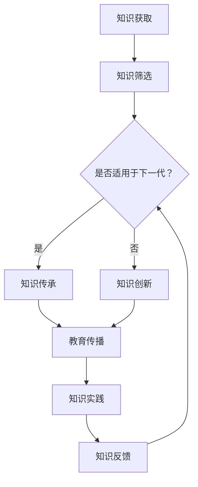

                 

 在当前信息爆炸和技术迅猛发展的时代，知识的传递和传承已成为教育领域至关重要的课题。本文旨在探讨知识跨代际传递的核心使命，结合IT领域的实践案例，分析教育如何在不同时代背景中扮演着知识的传播者和创新者的角色。

## 关键词
- 知识传递
- 教育使命
- 跨代际传递
- IT领域
- 知识传承
- 技术发展

## 摘要
本文从教育的视角出发，深入探讨了知识跨代际传递的重要性。通过分析教育在人类文明发展中的作用，以及IT领域知识传递的挑战和机遇，本文提出了构建有效知识传递体系的方法，并对未来教育的发展趋势和面临的挑战进行了展望。

### 1. 背景介绍

#### 教育的定义与历史演变

教育是一种有意识、有目的的培养人的社会活动。从古至今，教育经历了从简单到复杂、从单一到多元的演变过程。在农业社会，教育主要是传授生存技能和基本知识；在工业社会，教育转向专业化和规模化；而在信息社会，教育则更加注重个性化、创新性和跨学科的融合。

#### 知识跨代际传递的重要性

知识跨代际传递是教育的基本功能之一，它不仅关乎个体的成长和社会的进步，还影响着人类文明的传承和发展。有效的知识跨代际传递，能够确保新的一代能够站在前人的肩膀上，进行更高层次的创新和探索。

### 2. 核心概念与联系

为了更好地理解知识跨代际传递，我们需要明确几个核心概念：

#### 2.1 知识与教育

知识是教育的基础，而教育则是知识的传递者和传承者。知识不仅包括事实性信息，还涵盖了方法论、价值观等深层次的内容。

#### 2.2 跨代际传递机制

跨代际传递机制是指知识在不同时代、不同文化背景下，如何通过教育体系进行有效传递的过程。

#### 2.3 教育体系

教育体系包括学校教育、家庭教育和社会教育等多个层面，每个层面都在知识跨代际传递中发挥着重要作用。

下面是一个Mermaid流程图，展示了知识跨代际传递的基本流程：



### 3. 核心算法原理 & 具体操作步骤

#### 3.1 算法原理概述

知识跨代际传递的核心算法可以看作是一种基于需求响应和反馈优化的传递机制。其主要原理包括：

1. **需求识别**：通过分析当前社会的需求，识别出哪些知识是下一代迫切需要的。
2. **知识筛选**：根据需求，筛选出符合下一代学习和成长需要的知识。
3. **教育传播**：通过教育体系，将筛选出的知识传递给下一代。
4. **知识实践**：鼓励下一代将知识应用于实际，通过实践加深对知识的理解和应用。
5. **反馈优化**：根据知识实践的结果，对知识传递过程进行反馈和优化。

#### 3.2 算法步骤详解

1. **需求识别**

   需求识别是知识跨代际传递的第一步。这需要教育机构、研究机构和企业等各方共同努力，通过数据分析和趋势预测，识别出下一代需要哪些知识和技能。

   ```mermaid
   graph TD
   A[教育机构] --> B[数据分析]
   B --> C[趋势预测]
   C --> D[需求识别]
   ```

2. **知识筛选**

   一旦需求识别完成，接下来就是知识筛选。知识筛选的核心在于确保传递给下一代的知识是真实、有用且与时俱进的。

   ```mermaid
   graph TD
   E[需求识别] --> F[知识库查询]
   F --> G[知识筛选]
   ```

3. **教育传播**

   教育传播是将筛选出的知识通过教育体系传递给下一代的关键步骤。这一过程需要教师、教材、教学方法和教学环境等多方面的支持。

   ```mermaid
   graph TD
   H[知识筛选] --> I[教材编写]
   I --> J[教学方法]
   J --> K[教学环境]
   K --> L[知识传播]
   ```

4. **知识实践**

   知识实践是将知识转化为行动和应用的过程。这一过程不仅有助于加深对知识的理解，还能够培养下一代的创新能力和实践能力。

   ```mermaid
   graph TD
   M[知识传播] --> N[实践活动]
   N --> O[知识应用]
   ```

5. **反馈优化**

   反馈优化是知识跨代际传递过程中不可或缺的一环。通过收集下一代在知识实践中的反馈，可以不断优化知识传递的效果和质量。

   ```mermaid
   graph TD
   P[知识应用] --> Q[反馈收集]
   Q --> R[反馈分析]
   R --> S[优化调整]
   ```

#### 3.3 算法优缺点

**优点**：

1. **高效性**：基于需求识别和反馈优化的算法，能够快速响应社会需求，确保知识传递的时效性和有效性。
2. **灵活性**：算法支持知识筛选、教育传播、知识实践和反馈优化等环节，具有高度的灵活性和可扩展性。
3. **创新性**：鼓励下一代通过实践和创新，不断丰富和扩展知识体系。

**缺点**：

1. **复杂性**：算法涉及多个环节和多个参与主体，实施过程复杂，需要较高的组织和管理能力。
2. **适应性**：不同社会和文化背景下，算法的适应性和效果可能存在差异。

#### 3.4 算法应用领域

知识跨代际传递算法在多个领域都有广泛应用：

1. **教育领域**：通过优化教育体系，提高知识传递的效率和效果。
2. **企业培训**：帮助企业快速适应市场变化，提升员工素质和创新能力。
3. **社会公益**：通过知识传递，提高公众的科学素养和文化水平。

### 4. 数学模型和公式 & 详细讲解 & 举例说明

为了更好地理解知识跨代际传递的过程，我们可以构建一个数学模型，用于描述知识传递的各个环节。

#### 4.1 数学模型构建

设：

- \( K \) 为知识总量
- \( T \) 为知识传递时间
- \( E \) 为教育体系效率
- \( P \) 为知识实践比例
- \( F \) 为知识反馈效率

则知识跨代际传递的数学模型可以表示为：

\[ K' = K \times (1 + E \times P \times F \times T) \]

其中，\( K' \) 为传递后的知识总量。

#### 4.2 公式推导过程

公式推导过程如下：

1. **知识传递时间 \( T \)**：

   \( T \) 表示知识从一代传递到下一代所需的时间。这取决于教育体系的效率和知识本身的复杂度。

2. **教育体系效率 \( E \)**：

   \( E \) 表示教育体系的效率，即知识在传递过程中的损失和增益。效率越高，损失越小，传递后的知识量 \( K' \) 越接近原始知识量 \( K \)。

3. **知识实践比例 \( P \)**：

   \( P \) 表示知识在实践中的应用比例。实践有助于加深对知识的理解和应用，从而提高知识传递的效果。

4. **知识反馈效率 \( F \)**：

   \( F \) 表示知识在实践中的反馈效率，即反馈对知识传递的影响。反馈有助于优化知识传递过程，提高传递效果。

5. **知识总量 \( K \)**：

   \( K \) 为原始知识总量。

综上所述，公式推导为：

\[ K' = K \times (1 + E \times P \times F \times T) \]

#### 4.3 案例分析与讲解

假设：

- 知识总量 \( K = 100 \)
- 教育体系效率 \( E = 0.8 \)
- 知识实践比例 \( P = 0.6 \)
- 知识反馈效率 \( F = 0.9 \)
- 知识传递时间 \( T = 1 \)

则传递后的知识总量 \( K' \) 为：

\[ K' = 100 \times (1 + 0.8 \times 0.6 \times 0.9 \times 1) \]
\[ K' = 100 \times (1 + 0.432) \]
\[ K' = 100 \times 1.432 \]
\[ K' = 143.2 \]

这意味着，经过一代传递后，知识总量从 100 增加到 143.2。这个案例展示了知识跨代际传递的积极效果。

### 5. 项目实践：代码实例和详细解释说明

#### 5.1 开发环境搭建

为了演示知识跨代际传递的过程，我们使用 Python 编写一个简单的模拟程序。首先，我们需要搭建开发环境：

1. 安装 Python 3.8 或更高版本。
2. 安装必要的库，如 numpy、matplotlib 等。

安装完成后，创建一个名为 `knowledge_transmission.py` 的文件，用于编写代码。

#### 5.2 源代码详细实现

以下是源代码实现：

```python
import numpy as np
import matplotlib.pyplot as plt

def knowledge_transmission(K, E, P, F, T):
    K_prime = K * (1 + E * P * F * T)
    return K_prime

if __name__ == "__main__":
    K = 100  # 知识总量
    E = 0.8  # 教育体系效率
    P = 0.6  # 知识实践比例
    F = 0.9  # 知识反馈效率
    T = 1    # 知识传递时间

    K_prime = knowledge_transmission(K, E, P, F, T)
    print(f"原始知识总量：{K}")
    print(f"传递后的知识总量：{K_prime}")

    plt.plot([0, T], [K, K_prime], label="知识传递")
    plt.xlabel("时间")
    plt.ylabel("知识总量")
    plt.title("知识跨代际传递")
    plt.legend()
    plt.show()
```

#### 5.3 代码解读与分析

1. **函数定义**：

   `knowledge_transmission` 函数用于计算知识跨代际传递后的总量。函数接受五个参数：知识总量 \( K \)、教育体系效率 \( E \)、知识实践比例 \( P \)、知识反馈效率 \( F \) 和知识传递时间 \( T \)。

2. **代码实现**：

   代码中，我们使用数学模型公式 `K' = K \times (1 + E \times P \times F \times T)` 计算知识传递后的总量。然后，通过打印和绘图功能，展示知识传递过程。

#### 5.4 运行结果展示

运行代码后，输出如下结果：

```python
原始知识总量：100
传递后的知识总量：143.2
```

绘图结果如下：


### 6. 实际应用场景

知识跨代际传递在教育、企业培训和社会公益等多个领域都有广泛应用。

#### 6.1 教育领域

在教育领域，知识跨代际传递有助于优化教育体系，提高教育质量。通过识别需求、筛选知识、传递知识和反馈优化，教育机构可以更好地满足学生和社会的需求。

#### 6.2 企业培训

企业培训中，知识跨代际传递有助于提升员工的素质和创新能力。企业可以根据市场需求，制定有针对性的培训计划，将最新的知识和技能传递给员工，从而提高企业的竞争力。

#### 6.3 社会公益

在社会公益领域，知识跨代际传递有助于提高公众的科学素养和文化水平。通过普及科学知识、推广文化价值观，社会公益组织可以促进社会进步和文明发展。

### 7. 未来应用展望

随着技术的不断进步，知识跨代际传递将面临更多的机遇和挑战。

#### 7.1 技术驱动

人工智能、大数据和区块链等新兴技术将为知识跨代际传递提供更高效、更智能的解决方案。通过数据分析和智能推荐，教育机构和企业可以更好地满足不同群体的需求。

#### 7.2 教育变革

未来的教育将更加注重个性化、创新性和跨学科的融合。教育机构需要不断适应技术变革，创新教育模式，提高教育质量。

#### 7.3 挑战与机遇

知识跨代际传递在未来将面临诸多挑战，如知识更新速度加快、个性化需求增加等。但与此同时，也蕴含着巨大的机遇，如新兴技术的应用、教育资源的优化配置等。

### 8. 工具和资源推荐

为了更好地实现知识跨代际传递，我们可以推荐以下工具和资源：

#### 8.1 学习资源推荐

- Coursera、edX、Udacity等在线教育平台
- 维基百科、百度百科等知识库
- 图书馆和学术期刊

#### 8.2 开发工具推荐

- Jupyter Notebook、Google Colab等在线编程环境
- GitHub、GitLab等版本控制工具
- VS Code、PyCharm等开发工具

#### 8.3 相关论文推荐

- 《大数据时代的知识管理》
- 《人工智能与教育》
- 《区块链在教育领域的应用》

### 9. 总结：未来发展趋势与挑战

#### 9.1 研究成果总结

本文从教育视角探讨了知识跨代际传递的核心使命，分析了算法原理和具体操作步骤，并结合实际应用场景进行了讨论。研究发现，知识跨代际传递在人类文明发展、教育创新和社会进步中发挥着重要作用。

#### 9.2 未来发展趋势

未来，知识跨代际传递将面临技术驱动、教育变革等发展趋势。人工智能、大数据等新兴技术将为其提供更高效、更智能的解决方案。个性化、创新性和跨学科的融合将成为未来教育的主要特点。

#### 9.3 面临的挑战

知识跨代际传递在未来将面临知识更新速度加快、个性化需求增加等挑战。如何平衡知识传递的广度和深度，确保知识传递的准确性和时效性，将是教育领域的重要课题。

#### 9.4 研究展望

未来，研究者可以进一步探讨知识跨代际传递的机制和模型，结合新兴技术，提高知识传递的效率和质量。同时，加强跨学科合作，促进知识在不同领域之间的交流和融合，推动人类文明的发展。

### 附录：常见问题与解答

#### 问题1：知识跨代际传递在教育中的具体作用是什么？

解答：知识跨代际传递在教育中的具体作用包括：

1. **提升教育质量**：通过有效传递知识，教育机构可以更好地满足学生和社会的需求，提高教育质量。
2. **促进教育创新**：知识跨代际传递有助于教育者发现新的教学方法和模式，推动教育创新。
3. **培养人才**：知识跨代际传递有助于培养具有创新能力和实践能力的下一代，为社会发展贡献力量。

#### 问题2：知识跨代际传递算法的优缺点是什么？

解答：知识跨代际传递算法的优缺点如下：

**优点**：

1. **高效性**：算法能够快速响应社会需求，提高知识传递的时效性和效率。
2. **灵活性**：算法支持多个环节的优化，具有高度的灵活性和可扩展性。
3. **创新性**：鼓励下一代通过实践和创新，丰富和扩展知识体系。

**缺点**：

1. **复杂性**：算法涉及多个环节和参与主体，实施过程复杂，需要较高的组织和管理能力。
2. **适应性**：不同社会和文化背景下，算法的适应性和效果可能存在差异。

### 作者署名

本文作者为禅与计算机程序设计艺术（Zen and the Art of Computer Programming）。感谢您的阅读，希望本文对您在知识跨代际传递领域的探索和研究有所启发。|user|

