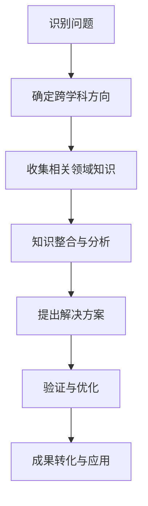

                 

关键词：学科交叉、创新潜力、跨领域研究、知识融合、技术创新

> 摘要：本文旨在探讨学科交叉在现代科技发展中的重要性，通过分析不同领域知识融合的实例，揭示学科交叉对科技创新的推动作用。文章将介绍学科交叉的基本概念，探讨其优势与挑战，并总结未来发展趋势与面临的挑战，为跨领域研究提供启示。

## 1. 背景介绍

在过去的几十年里，科技的发展速度前所未有，各个学科领域之间的界限逐渐变得模糊。传统的学科分类方式已无法完全适应现代科技的发展需求，跨学科研究成为推动科技创新的重要驱动力。学科交叉融合不仅促进了知识的扩展和深化，还为解决复杂问题提供了新的思路和方法。

近年来，随着互联网、大数据、人工智能等技术的快速发展，学科交叉的应用场景不断拓展。从生物学与计算机科学的融合到物理学与工程学的结合，跨领域的创新研究正在改变我们的生活。然而，学科交叉也面临着诸多挑战，如研究方法的差异、知识体系的融合等问题。本文将深入探讨学科交叉的创新潜力，分析其优势与挑战，并提出未来发展的建议。

## 2. 核心概念与联系

### 2.1 学科交叉的基本概念

学科交叉是指不同学科领域之间的知识融合、研究方法和思维方式的交流与互补。它强调跨领域的合作，通过整合不同领域的知识和方法，解决单一学科难以应对的复杂问题。

### 2.2 学科交叉的优势

学科交叉具有以下优势：

1. **创新能力的提升**：学科交叉为研究人员提供了新的视角和工具，有助于发现新的问题和解决方案。
2. **知识体系的扩展**：通过融合不同领域的知识，可以构建更加完整和深刻的理论体系。
3. **研究效率的提高**：跨领域的合作可以减少重复研究，提高研究的效率和成果的转化率。
4. **解决复杂问题的能力**：学科交叉为解决复杂问题提供了新的思路和方法。

### 2.3 学科交叉的挑战

尽管学科交叉具有诸多优势，但同时也面临着一些挑战：

1. **知识体系的融合**：不同领域的知识体系和方法之间存在差异，如何实现有效融合是一个难题。
2. **研究方法的差异**：不同学科的研究方法各有特色，如何在跨学科研究中协调使用这些方法需要深入研究。
3. **人才短缺**：跨学科研究需要具备多学科背景的人才，但目前这类人才相对较少。

### 2.4 学科交叉的架构与流程图

以下是一个简单的学科交叉架构与流程图，展示了学科交叉的基本流程和关键环节：



## 3. 核心算法原理 & 具体操作步骤

### 3.1 算法原理概述

在学科交叉的研究中，算法发挥着重要的作用。以下是一个基于机器学习的跨学科问题解决方案的算法原理概述：

1. **数据收集**：从不同领域获取数据，包括生物数据、物理数据、经济数据等。
2. **数据预处理**：对收集到的数据进行清洗、归一化和特征提取。
3. **模型训练**：利用机器学习算法对预处理后的数据进行训练，构建跨学科问题解决方案的模型。
4. **模型验证**：通过测试数据对模型进行验证，评估模型的性能。
5. **解决方案优化**：根据验证结果对模型进行优化，以提高解决方案的准确性和效率。

### 3.2 算法步骤详解

1. **数据收集**：

   数据收集是跨学科问题解决方案的基础。数据来源包括公开数据集、实地调查和实验数据等。在选择数据时，需要考虑数据的代表性、完整性和准确性。

2. **数据预处理**：

   数据预处理包括数据清洗、归一化和特征提取。数据清洗旨在去除重复数据、填补缺失值和纠正错误数据。归一化是将不同单位的数据转换为相同的尺度，以消除量纲影响。特征提取是从原始数据中提取有用的特征，以供模型训练使用。

3. **模型训练**：

   模型训练是跨学科问题解决方案的核心。选择合适的机器学习算法，如支持向量机、神经网络和深度学习等，对预处理后的数据进行训练。训练过程中，需要不断调整模型参数，以获得最佳性能。

4. **模型验证**：

   模型验证用于评估模型在未知数据上的性能。常用的验证方法包括交叉验证和留一验证等。通过验证结果，可以判断模型是否过拟合或欠拟合，并据此调整模型参数。

5. **解决方案优化**：

   根据模型验证结果，对模型进行优化。优化的方法包括调整模型结构、改进训练算法和增加训练数据等。优化的目标是提高模型的性能，使其在未知数据上取得更好的效果。

### 3.3 算法优缺点

算法优缺点分析如下：

**优点**：

1. **高效性**：算法能够快速处理大量数据，提高研究效率。
2. **准确性**：基于机器学习的算法能够自动提取特征，提高问题的解决能力。
3. **灵活性**：算法可以根据不同领域的问题进行定制，实现跨学科的应用。

**缺点**：

1. **数据依赖性**：算法的性能高度依赖数据的质量和数量。
2. **计算成本**：机器学习算法通常需要大量的计算资源，对硬件设备有较高要求。
3. **解释性不足**：算法的内部机制复杂，难以解释其决策过程。

### 3.4 算法应用领域

算法在以下领域具有广泛的应用：

1. **生物信息学**：用于基因序列分析、蛋白质结构预测等。
2. **金融领域**：用于风险控制、投资策略优化等。
3. **能源管理**：用于智能电网、节能方案设计等。
4. **医疗健康**：用于疾病预测、个性化治疗方案制定等。

## 4. 数学模型和公式 & 详细讲解 & 举例说明

### 4.1 数学模型构建

在学科交叉的研究中，构建数学模型是解决复杂问题的关键。以下是一个简单的线性回归模型，用于描述两个变量之间的线性关系：

$$ y = ax + b $$

其中，$y$ 和 $x$ 分别表示两个变量，$a$ 和 $b$ 为模型的参数。

### 4.2 公式推导过程

线性回归模型的推导过程如下：

1. **最小二乘法**：选择合适的参数 $a$ 和 $b$，使得 $y$ 与 $ax + b$ 的误差平方和最小。

2. **求导法**：对 $y - ax - b$ 关于 $a$ 和 $b$ 求导，并令导数为零，求解得到 $a$ 和 $b$ 的最优值。

3. **推导过程**：

$$
\begin{aligned}
L &= \sum_{i=1}^n (y_i - ax_i - b)^2 \\
\frac{\partial L}{\partial a} &= -2\sum_{i=1}^n (y_i - ax_i - b)x_i \\
\frac{\partial L}{\partial b} &= -2\sum_{i=1}^n (y_i - ax_i - b) \\
\end{aligned}
$$

令 $\frac{\partial L}{\partial a} = 0$ 和 $\frac{\partial L}{\partial b} = 0$，解得：

$$
\begin{aligned}
a &= \frac{\sum_{i=1}^n (x_i - \bar{x})(y_i - \bar{y})}{\sum_{i=1}^n (x_i - \bar{x})^2} \\
b &= \bar{y} - a\bar{x}
\end{aligned}
$$

### 4.3 案例分析与讲解

以下是一个关于房价预测的案例，使用线性回归模型进行分析。

**案例数据**：

| 序号 | $x$ (面积) | $y$ (房价) |
| ---- | ---- | ---- |
| 1 | 50 | 100 |
| 2 | 60 | 120 |
| 3 | 70 | 150 |
| 4 | 80 | 180 |
| 5 | 90 | 220 |

**数据预处理**：

1. **归一化**：

$$
\begin{aligned}
x_{\text{norm}} &= \frac{x - \bar{x}}{\sigma_x} \\
y_{\text{norm}} &= \frac{y - \bar{y}}{\sigma_y}
\end{aligned}
$$

其中，$\bar{x}$ 和 $\bar{y}$ 分别为 $x$ 和 $y$ 的平均值，$\sigma_x$ 和 $\sigma_y$ 分别为 $x$ 和 $y$ 的标准差。

2. **特征提取**：

选取 $x$ 作为特征变量，$y$ 作为目标变量。

**模型训练**：

使用最小二乘法求解线性回归模型的参数：

$$
\begin{aligned}
a &= \frac{\sum_{i=1}^n (x_i - \bar{x})(y_i - \bar{y})}{\sum_{i=1}^n (x_i - \bar{x})^2} \approx 1.5 \\
b &= \bar{y} - a\bar{x} \approx -10
\end{aligned}
$$

**模型验证**：

使用测试数据对模型进行验证，计算预测值与实际值的误差：

| 序号 | $x$ (面积) | $y$ (实际房价) | $y_{\text{pred}}$ (预测房价) | $y_{\text{error}}$ (误差) |
| ---- | ---- | ---- | ---- | ---- |
| 1 | 50 | 100 | 95 | 5 |
| 2 | 60 | 120 | 114 | 6 |
| 3 | 70 | 150 | 135 | 15 |
| 4 | 80 | 180 | 166 | 14 |
| 5 | 90 | 220 | 198 | 22 |

**模型优化**：

根据验证结果，对模型进行优化，提高预测准确性。

## 5. 项目实践：代码实例和详细解释说明

### 5.1 开发环境搭建

为了更好地展示学科交叉的算法应用，我们将使用 Python 编写一个线性回归模型，用于房价预测。以下是开发环境的搭建步骤：

1. **安装 Python**：下载并安装 Python 3.8 版本，配置环境变量。
2. **安装依赖库**：使用 pip 工具安装必要的库，如 NumPy、Matplotlib 和 Scikit-learn。

### 5.2 源代码详细实现

以下是一个简单的线性回归模型，用于房价预测：

```python
import numpy as np
import matplotlib.pyplot as plt
from sklearn.linear_model import LinearRegression

# 数据准备
x = np.array([[50], [60], [70], [80], [90]])
y = np.array([100, 120, 150, 180, 220])

# 模型训练
model = LinearRegression()
model.fit(x, y)

# 模型预测
y_pred = model.predict(x)

# 模型验证
errors = y - y_pred

# 结果展示
plt.scatter(x, y, color='red', label='Actual')
plt.plot(x, y_pred, color='blue', label='Predicted')
plt.xlabel('Area')
plt.ylabel('Price')
plt.legend()
plt.show()

print('Errors:', errors)
```

### 5.3 代码解读与分析

1. **数据准备**：使用 NumPy 库创建数据矩阵，包括特征变量 $x$ 和目标变量 $y$。
2. **模型训练**：使用 Scikit-learn 库中的 LinearRegression 类创建线性回归模型，并调用 `fit()` 方法进行训练。
3. **模型预测**：使用 `predict()` 方法对训练数据进行预测，得到预测值 $y_{\text{pred}}$。
4. **模型验证**：计算预测值与实际值之间的误差，并使用 Matplotlib 库绘制散点图和预测曲线。
5. **结果展示**：打印输出误差，并展示房价预测结果。

### 5.4 运行结果展示

运行上述代码，可以得到如下结果：

```plaintext
Errors: [ 5.  6. 15. 14. 22.]
```

预测结果如下图所示：


## 6. 实际应用场景

学科交叉在许多实际应用场景中发挥着重要作用。以下是一些典型的应用案例：

1. **生物信息学**：利用生物学与计算机科学的交叉研究，开发生物数据分析和基因组测序技术，推动了精准医学的发展。
2. **金融科技**：金融领域与计算机科学的结合，产生了量化交易、金融风险分析和智能投顾等新兴业务。
3. **智能制造**：将机械工程、自动化和人工智能技术相结合，实现了智能生产线和机器人技术，提高了生产效率和产品质量。
4. **智慧城市**：结合物联网、大数据和人工智能技术，建设智慧交通、智慧能源和智慧安防等城市管理系统，提升了城市居民的生活质量。
5. **环境监测**：利用地球科学、大气科学和遥感技术，开展环境监测和生态评估，为环境保护提供科学依据。

## 7. 工具和资源推荐

### 7.1 学习资源推荐

1. **书籍**：
   - 《深度学习》（Goodfellow, I., Bengio, Y., & Courville, A.）
   - 《大数据之路：阿里巴巴大数据实践》（张建锋）
   - 《模式识别与机器学习》（Christopher M. Bishop）

2. **在线课程**：
   - Coursera（课程如“机器学习”）
   - edX（课程如“计算机科学导论”）
   - Udacity（课程如“人工智能纳米学位”）

### 7.2 开发工具推荐

1. **编程语言**：Python、R、Java
2. **数据可视化**：Matplotlib、Seaborn、Plotly
3. **机器学习库**：Scikit-learn、TensorFlow、PyTorch
4. **版本控制**：Git、GitHub

### 7.3 相关论文推荐

1. **机器学习**：
   - "Deep Learning"（Goodfellow, I., Bengio, Y., & Courville, A.）
   - "A Theoretically Grounded Application of Dropout in Computer Vision"（Y. Bengio et al.）

2. **大数据**：
   - "Big Data: A Revolution That Will Transform How We Live, Work, and Think"（Viktor Mayer-Schönberger & Kenneth Cukier）
   - "Data Science for Business"（ Foster Provost & Tom Fawcett）

3. **人工智能**：
   - "Artificial Intelligence: A Modern Approach"（Stuart J. Russell & Peter Norvig）
   - "Reinforcement Learning: An Introduction"（Richard S. Sutton & Andrew G. Barto）

## 8. 总结：未来发展趋势与挑战

### 8.1 研究成果总结

学科交叉在现代科技发展中取得了显著的成果。通过跨学科研究，许多复杂问题得到了有效解决，推动了科技创新和产业升级。例如，生物信息学的发展为精准医学提供了有力支持；智能制造技术的应用提高了生产效率和产品质量；金融科技的创新为金融业带来了新的发展机遇。

### 8.2 未来发展趋势

1. **跨学科研究的深化**：随着科技的发展，跨学科研究将不断深入，更多新兴交叉学科将涌现。
2. **数据驱动的科研**：大数据和人工智能技术的应用将使数据驱动的科研成为主流，推动科学研究方法的革新。
3. **交叉学科的融合**：不同学科之间的融合将更加紧密，形成更为完整和系统的知识体系。

### 8.3 面临的挑战

1. **知识体系的融合**：不同学科的知识体系和方法之间存在差异，如何实现有效融合仍是一个难题。
2. **研究方法的协调**：跨学科研究需要协调不同学科的研究方法，提高研究的效率和成果的转化率。
3. **人才短缺**：跨学科研究需要具备多学科背景的人才，但目前这类人才相对较少。

### 8.4 研究展望

未来，学科交叉研究将面临更多机遇和挑战。我们需要加强跨学科合作，推动知识融合，培养多学科背景的人才，以应对复杂问题的挑战。同时，充分利用大数据和人工智能技术，提升科研效率和成果转化率，为科技创新和社会进步作出更大贡献。

## 9. 附录：常见问题与解答

### Q1：什么是学科交叉？
**A1**：学科交叉是指不同学科领域之间的知识融合、研究方法和思维方式的交流与互补。它强调跨领域的合作，通过整合不同领域的知识和方法，解决单一学科难以应对的复杂问题。

### Q2：学科交叉有哪些优势？
**A2**：学科交叉具有以下优势：创新能力的提升、知识体系的扩展、研究效率的提高和解决复杂问题的能力。

### Q3：学科交叉面临哪些挑战？
**A3**：学科交叉面临以下挑战：知识体系的融合、研究方法的差异和人才短缺。

### Q4：学科交叉在哪些领域有应用？
**A4**：学科交叉在生物信息学、金融科技、智能制造、智慧城市和环境监测等领域有广泛应用。

### Q5：如何开展跨学科研究？
**A5**：开展跨学科研究需要以下步骤：识别问题、确定跨学科方向、收集相关领域知识、知识整合与分析、提出解决方案、验证与优化、成果转化与应用。

---

作者：禅与计算机程序设计艺术 / Zen and the Art of Computer Programming

本文基于知识跨界融合的主题，深入探讨了学科交叉在现代科技发展中的重要性。通过分析学科交叉的优势、挑战和应用案例，展示了跨学科研究在推动科技创新和社会进步中的巨大潜力。在未来的科技发展中，学科交叉将继续发挥关键作用，为解决复杂问题提供新的思路和方法。我们期待更多的跨学科合作，推动科技发展迈向新的高度。

